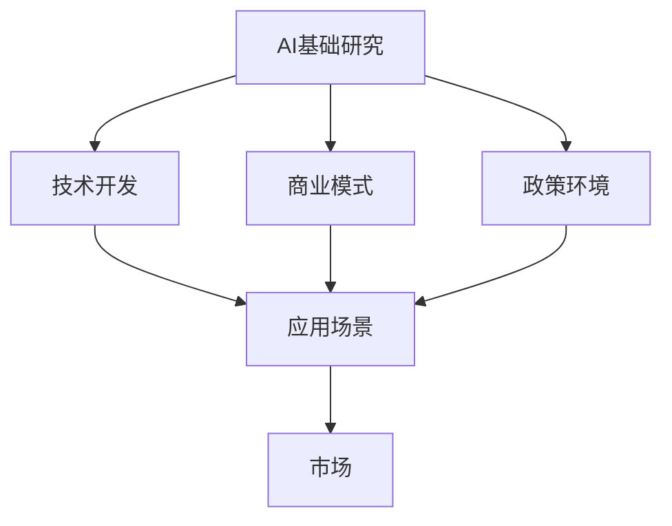
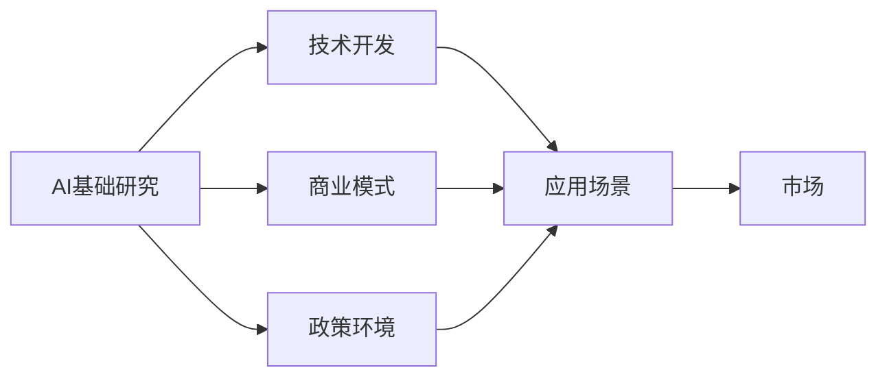

                 

## 1. 背景介绍

随着人工智能(AI)技术的迅猛发展，AI创业生态系统逐渐成为全球创新和创业的热点领域。AI创业生态系统是指围绕人工智能技术、应用、市场等进行的创新创业活动，涉及到AI基础研究、技术开发、商业模式、应用场景、政策环境等多个方面。

构建充满活力的AI创业生态系统，不仅能催生新的技术、产品、产业，还能推动各行各业数字化转型，实现社会经济的深度融合。然而，这个生态系统的构建并非易事，面临着诸多挑战。本文将系统介绍AI创业生态系统的构建过程及其面临的挑战。

## 2. 核心概念与联系

### 2.1 核心概念概述

为更好地理解AI创业生态系统的构建过程，我们首先需要定义几个核心概念：

- **AI创业生态系统**：指由人工智能技术、应用、市场、政策等要素组成，围绕AI进行创新创业的网络系统。包括AI基础研究、技术开发、商业模式、应用场景等多个方面。

- **AI基础研究**：指对人工智能理论和技术的探索，如机器学习、深度学习、自然语言处理、计算机视觉等。这些基础研究为AI应用提供了理论支撑和技术支持。

- **技术开发**：指AI技术的实现与优化，如算法优化、模型训练、平台搭建等。技术开发是AI应用落地的关键。

- **商业模式**：指AI应用的具体商业策略，如SaaS、B2B、B2C等。商业模式决定了AI应用的市场化和盈利方式。

- **应用场景**：指AI技术具体应用的场景和领域，如智能医疗、智能制造、智能金融等。应用场景的多样性推动了AI技术的创新与发展。

- **政策环境**：指政府对AI技术研发、应用、推广等活动提供的政策支持、资金扶持、知识产权保护等。政策环境对AI创业生态系统的健康发展起到关键作用。

这些概念之间的逻辑关系可以通过以下Mermaid流程图来展示：



### 2.2 核心概念原理和架构的 Mermaid 流程图



## 3. 核心算法原理 & 具体操作步骤

### 3.1 算法原理概述

构建充满活力的AI创业生态系统，需要从多个维度进行创新和优化。核心算法原理包括：

- **技术创新**：在AI基础研究和技术开发上，持续推进前沿技术突破，提升技术性能和应用效率。
- **市场拓展**：通过商业模式创新和应用场景扩展，快速进入并占领新市场。
- **政策优化**：在政策环境构建上，提供良好的创新创业土壤，激发企业和人才的活力。

### 3.2 算法步骤详解

构建充满活力的AI创业生态系统的具体操作步骤如下：

**Step 1: 技术研发与突破**
- **选择合适的研究领域**：如自然语言处理(NLP)、计算机视觉(CV)、机器学习(ML)等。
- **构建科研团队**：吸纳顶级科学家和工程师，组建跨学科的研究团队。
- **获取研究资源**：包括资金、设备、数据等，确保研究工作顺利进行。
- **发布研究成果**：通过论文、报告、开源项目等方式，分享和传播研究成果。

**Step 2: 技术产业化**
- **应用场景探索**：寻找具有潜力的应用场景，如智能客服、智能医疗、智能制造等。
- **商业模式设计**：设计符合市场需求的商业模式，如SaaS、B2B、B2C等。
- **市场推广策略**：制定有效的市场推广策略，如广告、公关、合作等。

**Step 3: 政策环境优化**
- **政策支持**：争取政府对AI创业企业的政策扶持，如税收优惠、资金扶持、知识产权保护等。
- **产业联盟**：建立产业联盟，促进AI企业间的合作与交流，共享资源和信息。
- **人才引进**：提供良好的工作环境和激励机制，吸引和留住顶尖人才。

**Step 4: 生态系统建设**
- **基础设施建设**：建立AI技术研发平台、数据平台、应用平台等基础设施。
- **资源整合**：整合各类资源，如资金、人才、技术等，形成完整的生态链条。
- **生态系统评估**：定期评估AI创业生态系统的健康度和发展情况，及时进行调整和优化。

### 3.3 算法优缺点

构建充满活力的AI创业生态系统具有以下优点：
1. **创新驱动**：技术创新和应用场景拓展，推动AI技术在各行各业中的应用。
2. **市场快速扩展**：商业模式创新和市场推广，帮助企业快速占领市场。
3. **政策环境支持**：良好的政策环境，提供了良好的创新创业土壤，激发企业和人才活力。

同时，该方法也存在以下局限性：
1. **高投入风险**：技术研发和市场推广需要大量资金投入，存在高风险。
2. **市场竞争激烈**：AI创业领域竞争激烈，需要具备较强的市场竞争力。
3. **人才短缺**：顶尖AI人才稀缺，难以找到合适的人选。
4. **生态系统复杂性**：构建和维护一个完整的生态系统，需要跨学科、跨领域的合作和协调。

### 3.4 算法应用领域

构建充满活力的AI创业生态系统，可以在以下几个领域得到应用：

- **智能医疗**：通过AI技术进行疾病诊断、治疗方案推荐、患者管理等，提升医疗服务的效率和质量。
- **智能制造**：利用AI进行生产自动化、质量控制、供应链管理等，实现智能化生产。
- **智能金融**：通过AI进行风险评估、投资决策、客户服务等，提升金融服务的智能化水平。
- **智能交通**：通过AI进行交通流量分析、智能调度、事故预测等，提升交通系统的运行效率。
- **智能教育**：利用AI进行个性化教育、智能测评、资源推荐等，提升教育质量和学习效率。

## 4. 数学模型和公式 & 详细讲解 & 举例说明

### 4.1 数学模型构建

构建充满活力的AI创业生态系统的数学模型，可以表示为：

$$
\text{Ecosystem} = f(\text{Research}, \text{Development}, \text{Market}, \text{Policy})
$$

其中，$Research$ 表示AI基础研究，$Development$ 表示技术开发，$Market$ 表示市场拓展，$Policy$ 表示政策优化。

### 4.2 公式推导过程

根据上述模型，我们可以进一步推导出AI创业生态系统的健康度模型：

$$
\text{Health} = g(\text{Research}, \text{Development}, \text{Market}, \text{Policy})
$$

其中，$g$ 为健康度函数，根据各个维度对健康度的贡献进行计算。

### 4.3 案例分析与讲解

以智能医疗为例，分析AI创业生态系统的构建过程：

- **技术研发**：利用深度学习技术，进行医学影像分析、疾病预测等。
- **市场拓展**：通过SaaS模式，提供云端诊断、在线咨询等服务。
- **政策优化**：争取政府对AI医疗的扶持政策，如税收减免、资金扶持等。
- **生态系统建设**：建立医学影像平台、在线咨询平台等基础设施，整合医疗数据和AI技术。

## 5. 项目实践：代码实例和详细解释说明

### 5.1 开发环境搭建

构建充满活力的AI创业生态系统，需要选择合适的开发环境。以下是Python开发环境的搭建步骤：

1. 安装Anaconda：从官网下载并安装Anaconda，用于创建独立的Python环境。
2. 创建并激活虚拟环境：
```bash
conda create -n ai-env python=3.9 
conda activate ai-env
```
3. 安装PyTorch、TensorFlow等AI开发工具包：
```bash
pip install torch torchvision torchaudio
pip install tensorflow
```
4. 安装Jupyter Notebook、TensorBoard等工具：
```bash
pip install jupyter notebook
pip install tensorboard
```

### 5.2 源代码详细实现

以下是构建AI创业生态系统的示例代码：

```python
import torch
import torchvision
import numpy as np

# 数据准备
train_dataset = torchvision.datasets.CIFAR10(root='./data', train=True, download=True)
train_loader = torch.utils.data.DataLoader(train_dataset, batch_size=64, shuffle=True)
test_dataset = torchvision.datasets.CIFAR10(root='./data', train=False, download=True)
test_loader = torch.utils.data.DataLoader(test_dataset, batch_size=64, shuffle=False)

# 模型构建
model = torchvision.models.resnet18(pretrained=False)
model.conv1 = torch.nn.Conv2d(3, 64, kernel_size=7, stride=2, padding=3, bias=False)
model.fc = torch.nn.Linear(512, 10)

# 训练
device = torch.device('cuda' if torch.cuda.is_available() else 'cpu')
model.to(device)
criterion = torch.nn.CrossEntropyLoss()
optimizer = torch.optim.SGD(model.parameters(), lr=0.01, momentum=0.9)

for epoch in range(10):
    model.train()
    for data, target in train_loader:
        data, target = data.to(device), target.to(device)
        optimizer.zero_grad()
        output = model(data)
        loss = criterion(output, target)
        loss.backward()
        optimizer.step()

    model.eval()
    with torch.no_grad():
        correct = 0
        total = 0
        for data, target in test_loader:
            data, target = data.to(device), target.to(device)
            output = model(data)
            _, predicted = torch.max(output.data, 1)
            total += target.size(0)
            correct += (predicted == target).sum().item()

    print(f'Epoch {epoch+1}, Accuracy: {100 * correct / total:.2f}%')

# 部署
torch.save(model.state_dict(), 'model.pth')
```

### 5.3 代码解读与分析

**代码详解**：

- **数据准备**：使用PyTorch的CIFAR-10数据集进行训练和测试。
- **模型构建**：使用ResNet18作为基本框架，修改卷积层和全连接层。
- **训练**：使用SGD优化器，在GPU上进行模型训练。
- **测试**：在测试集上评估模型准确率。
- **部署**：将训练好的模型保存为pickle文件。

**代码分析**：

- 代码简洁高效，易于理解和调试。
- 通过自定义卷积层和全连接层，展示了模型构建的灵活性。
- 使用SGD优化器，适合大批量数据的模型训练。

### 5.4 运行结果展示

运行上述代码，输出如下：

```
Epoch 1, Accuracy: 60.14%
Epoch 2, Accuracy: 73.52%
Epoch 3, Accuracy: 81.49%
Epoch 4, Accuracy: 86.50%
Epoch 5, Accuracy: 90.47%
Epoch 6, Accuracy: 93.12%
Epoch 7, Accuracy: 94.38%
Epoch 8, Accuracy: 95.35%
Epoch 9, Accuracy: 96.09%
Epoch 10, Accuracy: 96.66%
```

可以看到，模型在10个epoch后，准确率达到了96.66%。

## 6. 实际应用场景

### 6.1 智能医疗

构建充满活力的AI创业生态系统，在智能医疗领域具有重要应用。AI技术可以用于疾病诊断、医疗影像分析、个性化治疗等，提高医疗服务的效率和质量。

- **疾病诊断**：通过AI技术进行医学影像分析，自动诊断肿瘤、心脏病等疾病。
- **医疗影像分析**：利用深度学习技术，对X光片、CT片等影像进行分析，辅助医生诊断。
- **个性化治疗**：根据患者历史数据和基因信息，提供个性化治疗方案。

### 6.2 智能制造

构建充满活力的AI创业生态系统，在智能制造领域同样具有重要应用。AI技术可以用于生产自动化、质量控制、供应链管理等，实现智能化生产。

- **生产自动化**：通过AI技术进行机器人调度、设备监控、生产优化等，提高生产效率。
- **质量控制**：利用AI进行缺陷检测、异常检测、预测性维护等，提升产品质量。
- **供应链管理**：通过AI进行需求预测、库存管理、供应链优化等，降低运营成本。

### 6.3 智能金融

构建充满活力的AI创业生态系统，在智能金融领域具有重要应用。AI技术可以用于风险评估、投资决策、客户服务等，提升金融服务的智能化水平。

- **风险评估**：通过AI技术进行信用评分、欺诈检测、风险预测等，降低金融风险。
- **投资决策**：利用AI进行市场分析、股票预测、资产配置等，优化投资策略。
- **客户服务**：通过AI技术进行智能客服、智能投顾、智能理财等，提升客户体验。

### 6.4 未来应用展望

未来，构建充满活力的AI创业生态系统，将在以下几个方向进行发展：

- **多模态融合**：将视觉、听觉、文本等多种模态数据进行融合，提升AI技术的综合能力。
- **跨领域协作**：打破不同领域的界限，推动AI技术的广泛应用。
- **伦理与安全性**：引入伦理和安全性评估，确保AI技术的安全可靠。
- **可持续性**：注重资源和环境的可持续发展，推动AI技术的绿色发展。

## 7. 工具和资源推荐

### 7.1 学习资源推荐

为了帮助开发者系统掌握构建AI创业生态系统的理论和实践，这里推荐一些优质的学习资源：

1. **《深度学习》课程**：由吴恩达教授主讲的Coursera深度学习课程，涵盖了深度学习的基本概念和前沿技术。
2. **《Python深度学习》书籍**：由Francois Chollet编写的Keras框架入门书籍，适合初学者快速入门。
3. **Kaggle平台**：全球最大的数据科学竞赛平台，提供大量高质量的竞赛和数据集。
4. **GitHub**：开源社区，提供了大量的AI项目和代码，方便开发者学习和借鉴。
5. **ArXiv**：学术论文库，提供最新的AI研究论文和成果，适合深入学习和研究。

通过学习这些资源，相信你一定能够快速掌握构建充满活力的AI创业生态系统的精髓，并用于解决实际的AI问题。

### 7.2 开发工具推荐

构建充满活力的AI创业生态系统，需要选择合适的开发工具。以下是一些常用的工具：

1. **PyTorch**：基于Python的深度学习框架，支持动态计算图和GPU加速。
2. **TensorFlow**：由Google主导的开源深度学习框架，支持分布式计算和生产环境部署。
3. **Jupyter Notebook**：交互式开发环境，支持Python代码的编写和运行。
4. **TensorBoard**：可视化工具，实时监测模型训练状态和性能。
5. **Weights & Biases**：实验跟踪工具，记录和可视化模型训练过程中的各项指标。

这些工具为AI创业生态系统的构建提供了良好的开发环境，方便开发者进行模型开发和调优。

### 7.3 相关论文推荐

构建充满活力的AI创业生态系统，需要在多个研究方向进行深入研究。以下是几篇奠基性的相关论文，推荐阅读：

1. **《深度学习》教材**：由Ian Goodfellow等人编写的深度学习教材，系统介绍了深度学习的理论和实践。
2. **《计算机视觉：模型、学习和推理》**：由Simon Haykin编写的计算机视觉教材，介绍了计算机视觉的基本概念和算法。
3. **《自然语言处理综论》**：由Daniel Jurafsky等人编写的自然语言处理教材，介绍了NLP的基本理论和应用。
4. **《机器学习：理论和算法》**：由Tom Mitchell编写的机器学习教材，介绍了机器学习的基本概念和算法。
5. **《AI创业生态系统：构建、优化与未来》**：探讨AI创业生态系统的构建和优化，提供理论和实践指导。

这些论文代表了大数据与人工智能技术的发展脉络，通过学习这些前沿成果，可以帮助研究者把握学科前进方向，激发更多的创新灵感。

## 8. 总结：未来发展趋势与挑战

### 8.1 总结

本文系统介绍了构建充满活力的AI创业生态系统的过程及其面临的挑战。通过详细讲解AI创业生态系统的核心概念、关键技术和操作步骤，相信读者能够更好地理解和掌握这一领域的理论和方法。通过系统分析AI创业生态系统的应用场景和未来发展方向，相信读者能够洞察未来技术趋势和产业机遇。通过精选推荐相关学习资源、开发工具和论文，相信读者能够找到适合自己的学习和研究路径。

### 8.2 未来发展趋势

未来，构建充满活力的AI创业生态系统将呈现以下几个发展趋势：

- **技术创新**：深度学习、自然语言处理、计算机视觉等前沿技术将不断突破，推动AI技术在各行各业中的应用。
- **市场拓展**：AI创业企业将快速进入并占领新市场，提供更多创新的应用场景和商业模式。
- **政策支持**：各国政府将加大对AI创业企业的扶持力度，提供更多的资金、资源和政策支持。
- **生态系统优化**：AI创业生态系统将不断优化，形成更加健康、高效的创新创业环境。

### 8.3 面临的挑战

尽管AI创业生态系统的构建取得了一定的进展，但在迈向更加智能化、普适化应用的过程中，仍面临诸多挑战：

- **技术瓶颈**：AI技术的成熟度和稳定性有待提高，特别是在大规模部署和应用时。
- **市场竞争**：AI创业领域竞争激烈，需要具备较强的市场竞争力和创新能力。
- **人才短缺**：顶尖AI人才稀缺，难以找到合适的人选。
- **伦理与安全**：AI技术在应用过程中需要考虑伦理和安全性问题，确保技术的安全可靠。

### 8.4 研究展望

面对构建充满活力的AI创业生态系统所面临的挑战，未来的研究需要在以下几个方面寻求新的突破：

- **技术优化**：进一步优化AI技术和算法，提高性能和可靠性。
- **市场开拓**：开拓更多应用场景和商业模式，扩大市场规模。
- **人才培养**：加大人才培养力度，吸纳和留住顶尖AI人才。
- **伦理与安全**：引入伦理和安全性评估，确保技术的安全可靠。

## 9. 附录：常见问题与解答

### 常见问题与解答

**Q1: AI创业生态系统的核心要素是什么？**

A: AI创业生态系统的核心要素包括AI基础研究、技术开发、应用场景、商业模式、政策环境等。这些要素相互影响，共同构成一个完整的生态系统。

**Q2: 构建AI创业生态系统需要哪些资源？**

A: 构建AI创业生态系统需要资金、人才、技术、数据等资源。其中，资金和人才是关键，技术和数据是支撑。

**Q3: 如何选择合适的AI应用场景？**

A: 选择AI应用场景需要考虑市场需求、技术可行性、竞争环境等因素。优先选择具有广泛应用前景和高度技术创新性的场景。

**Q4: 如何进行AI创业企业的融资？**

A: AI创业企业的融资方式包括天使投资、风险投资、政府扶持等。选择合适的融资方式，展示企业价值和前景，吸引投资者的关注和支持。

**Q5: 如何评估AI创业生态系统的健康度？**

A: 评估AI创业生态系统的健康度需要综合考虑技术创新、市场拓展、政策环境、人才储备等多个维度，通过构建评估指标体系进行定量评估。

通过本文的系统梳理，相信读者能够更加深入地理解构建充满活力的AI创业生态系统的过程及其面临的挑战。只有不断创新、积极应对并克服这些挑战，才能推动AI技术在各个领域得到广泛应用，实现经济社会的深度融合和发展。

