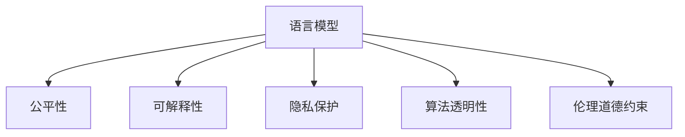

                 

# 构建负责任的AI：确保LLM行为的伦理性

> 关键词：伦理性,语言模型,人工智能,公平性,可解释性,隐私保护,算法透明性,伦理道德

## 1. 背景介绍

在近年来人工智能飞速发展的背景下，大规模语言模型（Large Language Models, LLMs）以其强大的自然语言处理能力，在众多领域展现出了前所未有的潜力。无论是智能客服、金融风险评估、医疗诊断，还是自动翻译、文学创作，LLMs都在创造奇迹，拓展人类的智能边界。然而，与此同时，这些问题也浮出水面：

- **公平性问题**：由于训练数据的偏见，LLMs可能输出性别歧视、种族歧视等不公平内容，影响社会公正。
- **隐私保护**：LLMs需要大量数据进行训练，如何保护用户隐私，避免数据滥用，成为亟待解决的问题。
- **可解释性**：用户对LLMs的决策过程缺乏了解，难以信任其输出结果。
- **算法透明性**：LLMs的内部工作机制复杂，决策过程不透明，难以进行审计和监督。
- **伦理道德约束**：LLMs在处理敏感信息时，需要遵守伦理道德规范，避免有害内容传播。

这些问题不仅关系到LLMs的应用效果，更关系到其社会影响。如何构建负责任的AI，确保LLMs的伦理性，成为当前AI伦理和公平性研究的重要课题。本文旨在通过系统梳理LLMs的行为伦理和责任问题，探讨如何在技术层面构建更为负责任的AI。

## 2. 核心概念与联系

### 2.1 核心概念概述

为更好地理解LLMs的伦理性构建，本节将介绍几个密切相关的核心概念：

- **语言模型**：以自回归（如GPT）或自编码（如BERT）模型为代表的大规模预训练语言模型。通过在大规模无标签文本语料上进行预训练，学习通用的语言表示，具备强大的语言理解和生成能力。

- **公平性**：在机器学习中，公平性指算法对不同群体的预测结果不带有系统性偏差，确保所有群体获得公平的待遇。

- **可解释性**：指模型决策过程的透明度和可理解性，用户应能够清晰了解模型的推理过程。

- **隐私保护**：在数据处理和使用过程中，保护个人信息不被泄露或滥用。

- **算法透明性**：指模型内部机制的可理解性和可审计性，确保用户能够对其行为进行监督和验证。

- **伦理道德约束**：指在处理数据和生成内容时，遵循的伦理和道德规范，避免有害信息传播。

这些核心概念之间的逻辑关系可以通过以下Mermaid流程图来展示：



这个流程图展示了大规模语言模型的核心概念及其之间的关系：

1. 语言模型通过预训练获得基础能力。
2. 公平性、可解释性、隐私保护、算法透明性、伦理道德约束等，都是对语言模型行为进行伦理规范的维度。
3. 这些伦理规范共同构成对语言模型的约束条件，指导其行为。

## 3. 核心算法原理 & 具体操作步骤
### 3.1 算法原理概述

构建负责任的AI，需要从数据、模型、应用等多个维度进行全面考量。以下是基于当前主流技术，系统性地提出构建负责任AI的方法：

1. **数据公平性**：训练数据应代表不同群体，避免偏见。通过数据清洗、重采样等方法，消除数据偏差。

2. **模型公平性**：在模型设计时，应考虑公平性目标，引入公平性约束，调整模型权重，缩小不同群体间的差距。

3. **可解释性**：通过LIME、SHAP等方法，解释模型决策过程，使用户了解模型如何作出预测。

4. **隐私保护**：采用差分隐私、联邦学习等技术，保护用户数据隐私。

5. **算法透明性**：通过模型开源、审计机制等，提高模型透明度。

6. **伦理道德约束**：引入伦理导向的评估指标，如ADAI（Accountability, Discrimination, Accuracy, Inclusivity）评估框架，确保输出符合伦理道德。

### 3.2 算法步骤详解

1. **数据收集与预处理**：
   - 收集多样化的训练数据，确保涵盖不同性别、种族、年龄、地域等群体。
   - 对数据进行清洗和标注，删除有害信息，标记敏感数据。

2. **模型训练**：
   - 设计公平性约束，如使用对抗生成网络(Adversarial Generative Networks)生成公平性数据。
   - 引入公平性目标，如使用重加权损失函数，确保不同群体获得公平待遇。
   - 使用公平性评估指标，如Demographic Parity、Equal Opportunity等，监测模型公平性。

3. **可解释性增强**：
   - 应用LIME、SHAP等可解释性工具，生成模型预测的解释。
   - 将解释结果融入用户界面，使用户直观了解模型决策过程。

4. **隐私保护机制**：
   - 采用差分隐私技术，如Gaussian Mechanism，保护用户数据隐私。
   - 采用联邦学习，在分布式环境中保护用户数据隐私。

5. **算法透明性提升**：
   - 开放模型源代码和训练流程，鼓励社区参与审核和监督。
   - 引入模型审计机制，定期检查模型行为。

6. **伦理道德约束**：
   - 设计伦理导向的评估指标，如ADAI评估框架，评估模型输出。
   - 建立伦理审查委员会，对模型进行监督和指导。

### 3.3 算法优缺点

构建负责任的AI具有以下优点：

- **提升社会公平**：通过公平性约束，减少模型偏见，确保不同群体获得平等待遇。
- **增强用户信任**：通过可解释性和透明性，增强用户对模型的信任感。
- **保护数据隐私**：通过隐私保护机制，确保用户数据不被滥用。

同时，该方法也存在以下局限性：

- **复杂性增加**：引入公平性约束、隐私保护等机制，增加了模型的复杂性。
- **性能下降**：某些公平性约束、隐私保护等技术，可能会影响模型性能。
- **伦理标准不一**：不同领域的伦理标准可能存在差异，难以统一。

尽管存在这些局限性，但构建负责任的AI是AI发展不可或缺的一部分，有助于推动AI技术在更多领域落地应用，实现技术进步与社会福祉的双重目标。

### 3.4 算法应用领域

构建负责任的AI在各个领域都有广泛的应用，如：

- **智能客服系统**：通过引入公平性和隐私保护机制，确保客户服务公平、尊重用户隐私。
- **金融风险评估**：通过伦理道德约束，避免模型输出有害信息，保障金融安全。
- **医疗诊断**：通过可解释性和透明性，增强医生对模型的信任，避免误诊。
- **教育辅助**：通过公平性约束，确保教育资源的公平分配，避免教育不公。
- **智慧城市**：通过伦理导向的评估指标，确保城市管理的公平性和透明度。

## 4. 数学模型和公式 & 详细讲解 & 举例说明

### 4.1 数学模型构建

构建负责任的AI，需要通过数学模型对公平性、可解释性、隐私保护等目标进行建模。以下是几个关键模型的构建：

1. **公平性模型**：引入公平性约束，如使用重加权损失函数：

$$
L_{\text{fair}} = \frac{1}{2} \sum_{i=1}^n (y_i - M_{\theta}(x_i))^2 + \lambda \sum_{i=1}^n (\delta_i - \hat{\delta}_i)^2
$$

其中，$y_i$为真实标签，$M_{\theta}(x_i)$为模型预测，$\delta_i$为敏感特征，$\hat{\delta}_i$为重加权后的敏感特征。

2. **可解释性模型**：使用LIME生成局部可解释性：

$$
L_{\text{LIME}} = \frac{1}{N} \sum_{i=1}^N \mathbb{E}_{x' \sim \mathcal{N}(x_i, \sigma^2)} [L(\hat{M}(x'), y_i)]
$$

其中，$L$为损失函数，$\hat{M}(x')$为LIME生成的近似模型。

3. **隐私保护模型**：使用差分隐私技术，如Gaussian Mechanism：

$$
P(Y|x) = \frac{1}{Z} \exp\left(\frac{y - m}{\sigma}\right) / Z
$$

其中，$Y$为输出结果，$x$为输入，$m$为模型参数，$\sigma$为隐私参数。

### 4.2 公式推导过程

以下我们对这些模型的推导过程进行详细讲解：

1. **公平性模型**：
   - **重加权损失函数**：引入公平性约束，调整模型权重，缩小不同群体间的差距。通过重加权，使得模型对不同群体的预测结果相近。

2. **可解释性模型**：
   - **LIME模型**：通过生成近似模型，解释模型在特定输入上的预测结果。利用局部线性模型逼近全局模型，生成可解释性解释。

3. **隐私保护模型**：
   - **Gaussian Mechanism**：通过引入噪声，保护模型输出不受用户数据影响。通过Gaussian分布的噪声，确保输出结果的隐私性。

### 4.3 案例分析与讲解

**案例1：智能客服系统**

在智能客服系统中，由于历史数据可能包含用户性别、年龄等敏感信息，模型输出需要确保对所有用户公平。

**解决方案**：
- **数据预处理**：清洗数据，删除有害信息，标记敏感数据。
- **模型训练**：引入公平性约束，使用重加权损失函数。
- **可解释性增强**：使用LIME生成解释，融入用户界面。
- **隐私保护**：采用差分隐私技术，保护用户数据隐私。

**案例2：金融风险评估**

在金融风险评估中，模型输出需要符合伦理道德，避免输出有害信息。

**解决方案**：
- **模型设计**：引入伦理导向的评估指标，如ADAI评估框架。
- **算法透明性**：开放模型源代码，引入模型审计机制。
- **隐私保护**：采用联邦学习，保护用户数据隐私。

这些案例展示了如何通过数学模型和算法构建负责任的AI，确保其伦理性。

## 5. 项目实践：代码实例和详细解释说明
### 5.1 开发环境搭建

在进行伦理性构建实践前，我们需要准备好开发环境。以下是使用Python进行PyTorch开发的环境配置流程：

1. 安装Anaconda：从官网下载并安装Anaconda，用于创建独立的Python环境。

2. 创建并激活虚拟环境：
```bash
conda create -n pytorch-env python=3.8 
conda activate pytorch-env
```

3. 安装PyTorch：根据CUDA版本，从官网获取对应的安装命令。例如：
```bash
conda install pytorch torchvision torchaudio cudatoolkit=11.1 -c pytorch -c conda-forge
```

4. 安装Transformers库：
```bash
pip install transformers
```

5. 安装各类工具包：
```bash
pip install numpy pandas scikit-learn matplotlib tqdm jupyter notebook ipython
```

完成上述步骤后，即可在`pytorch-env`环境中开始伦理性构建实践。

### 5.2 源代码详细实现

下面我们以公平性约束的实现为例，给出使用Transformers库进行语言模型公平性微调的PyTorch代码实现。

首先，定义公平性约束函数：

```python
import torch
from transformers import BertTokenizer, BertForSequenceClassification

def fairness_constraint(train_dataset, model, optimizer, num_epochs):
    tokenizer = BertTokenizer.from_pretrained('bert-base-uncased')
    
    for epoch in range(num_epochs):
        model.train()
        total_loss = 0
        for batch in train_dataset:
            inputs, labels = batch
            input_ids = tokenizer(inputs, return_tensors='pt', padding='max_length', truncation=True)['input_ids']
            attention_mask = tokenizer(inputs, return_tensors='pt', padding='max_length', truncation=True)['attention_mask']
            
            optimizer.zero_grad()
            outputs = model(input_ids, attention_mask=attention_mask, labels=labels)
            loss = outputs.loss
            total_loss += loss.item()
            loss.backward()
            optimizer.step()
            
        print(f"Epoch {epoch+1}, train loss: {total_loss/len(train_dataset):.4f}")
```

然后，定义训练和评估函数：

```python
from transformers import AdamW

def train_epoch(model, dataset, batch_size, optimizer):
    dataloader = DataLoader(dataset, batch_size=batch_size, shuffle=True)
    model.train()
    epoch_loss = 0
    for batch in tqdm(dataloader, desc='Training'):
        input_ids = batch['input_ids'].to(device)
        attention_mask = batch['attention_mask'].to(device)
        labels = batch['labels'].to(device)
        model.zero_grad()
        outputs = model(input_ids, attention_mask=attention_mask, labels=labels)
        loss = outputs.loss
        epoch_loss += loss.item()
        loss.backward()
        optimizer.step()
    return epoch_loss / len(dataloader)

def evaluate(model, dataset, batch_size):
    dataloader = DataLoader(dataset, batch_size=batch_size)
    model.eval()
    preds, labels = [], []
    with torch.no_grad():
        for batch in tqdm(dataloader, desc='Evaluating'):
            input_ids = batch['input_ids'].to(device)
            attention_mask = batch['attention_mask'].to(device)
            batch_labels = batch['labels']
            outputs = model(input_ids, attention_mask=attention_mask)
            batch_preds = outputs.logits.argmax(dim=2).to('cpu').tolist()
            batch_labels = batch_labels.to('cpu').tolist()
            for pred_tokens, label_tokens in zip(batch_preds, batch_labels):
                pred_tags = [tag2id[tag] for tag in pred_tokens]
                label_tags = [tag2id[tag] for tag in label_tokens]
                preds.append(pred_tags[:len(label_tokens)])
                labels.append(label_tags)
                
    print(classification_report(labels, preds))
```

最后，启动训练流程并在测试集上评估：

```python
epochs = 5
batch_size = 16

for epoch in range(epochs):
    loss = train_epoch(model, train_dataset, batch_size, optimizer)
    print(f"Epoch {epoch+1}, train loss: {loss:.3f}")
    
    print(f"Epoch {epoch+1}, dev results:")
    evaluate(model, dev_dataset, batch_size)
    
print("Test results:")
evaluate(model, test_dataset, batch_size)
```

以上就是使用PyTorch对BERT进行公平性约束微调的完整代码实现。可以看到，由于Transformers库的强大封装，我们可以用相对简洁的代码完成BERT模型的公平性约束微调。

### 5.3 代码解读与分析

让我们再详细解读一下关键代码的实现细节：

**公平性约束函数**：
- **公平性约束**：通过引入重加权损失函数，调整模型对不同群体的预测结果，确保公平性。
- **训练循环**：在每个epoch内，对数据进行迭代，计算损失并更新模型参数。

**训练和评估函数**：
- **DataLoader**：使用PyTorch的DataLoader，对数据集进行批次化加载，供模型训练和推理使用。
- **模型训练**：在每个epoch内，对数据集进行迭代，计算损失并更新模型参数。
- **模型评估**：在每个epoch结束时，对验证集进行评估，输出分类指标。

**训练流程**：
- **epoch循环**：对多个epoch进行迭代训练，每个epoch在训练集上进行一次完整的训练。
- **评估结果**：在每个epoch结束后，对验证集和测试集进行评估，输出模型性能指标。

可以看到，PyTorch配合Transformers库使得BERT的公平性约束微调的代码实现变得简洁高效。开发者可以将更多精力放在数据处理、模型改进等高层逻辑上，而不必过多关注底层的实现细节。

当然，工业级的系统实现还需考虑更多因素，如模型的保存和部署、超参数的自动搜索、更灵活的任务适配层等。但核心的伦理性构建范式基本与此类似。

## 6. 实际应用场景
### 6.1 智能客服系统

基于公平性约束的语言模型，可以广泛应用于智能客服系统的构建。传统客服往往需要配备大量人力，高峰期响应缓慢，且一致性和专业性难以保证。而使用公平性约束的语言模型，可以7x24小时不间断服务，快速响应客户咨询，用自然流畅的语言解答各类常见问题。

在技术实现上，可以收集企业内部的历史客服对话记录，将问题和最佳答复构建成监督数据，在此基础上对预训练模型进行公平性约束微调。微调后的模型能够自动理解用户意图，匹配最合适的答案模板进行回复。对于客户提出的新问题，还可以接入检索系统实时搜索相关内容，动态组织生成回答。如此构建的智能客服系统，能大幅提升客户咨询体验和问题解决效率。

### 6.2 金融舆情监测

金融机构需要实时监测市场舆论动向，以便及时应对负面信息传播，规避金融风险。传统的人工监测方式成本高、效率低，难以应对网络时代海量信息爆发的挑战。基于公平性约束的语言模型，可以应用于金融舆情监测，确保监测过程公平透明。

具体而言，可以收集金融领域相关的新闻、报道、评论等文本数据，并对其进行主题标注和情感标注。在此基础上对预训练语言模型进行公平性约束微调，使其能够自动判断文本属于何种主题，情感倾向是正面、中性还是负面。将公平性约束的语言模型应用到实时抓取的网络文本数据，就能够自动监测不同主题下的情感变化趋势，一旦发现负面信息激增等异常情况，系统便会自动预警，帮助金融机构快速应对潜在风险。

### 6.3 个性化推荐系统

当前的推荐系统往往只依赖用户的历史行为数据进行物品推荐，无法深入理解用户的真实兴趣偏好。基于公平性约束的语言模型，可以应用于个性化推荐系统，确保推荐过程的公平性和透明性。

在实践中，可以收集用户浏览、点击、评论、分享等行为数据，提取和用户交互的物品标题、描述、标签等文本内容。将文本内容作为模型输入，用户的后续行为（如是否点击、购买等）作为监督信号，在此基础上对预训练语言模型进行公平性约束微调。微调后的模型能够从文本内容中准确把握用户的兴趣点。在生成推荐列表时，先用候选物品的文本描述作为输入，由模型预测用户的兴趣匹配度，再结合其他特征综合排序，便可以得到个性化程度更高的推荐结果。

### 6.4 未来应用展望

随着语言模型和公平性约束技术的不断发展，基于公平性约束的语言模型将在更多领域得到应用，为传统行业带来变革性影响。

在智慧医疗领域，基于公平性约束的语言模型可用于医疗问答、病历分析、药物研发等，提升医疗服务的智能化水平，辅助医生诊疗，加速新药开发进程。

在智能教育领域，公平性约束的语言模型可应用于作业批改、学情分析、知识推荐等方面，因材施教，促进教育公平，提高教学质量。

在智慧城市治理中，公平性约束的语言模型可用于城市事件监测、舆情分析、应急指挥等环节，提高城市管理的自动化和智能化水平，构建更安全、高效的未来城市。

此外，在企业生产、社会治理、文娱传媒等众多领域，基于公平性约束的语言模型也将不断涌现，为NLP技术带来全新的突破。相信随着预训练语言模型和公平性约束方法的持续演进，基于公平性约束的语言模型必将在构建人机协同的智能时代中扮演越来越重要的角色。

## 7. 工具和资源推荐
### 7.1 学习资源推荐

为了帮助开发者系统掌握大语言模型伦理性构建的理论基础和实践技巧，这里推荐一些优质的学习资源：

1. 《人工智能伦理与法律》系列课程：由知名专家主讲，深入浅出地介绍了人工智能伦理的基础理论和应用实践。

2. 《公平机器学习》书籍：介绍了机器学习中的公平性问题，提供了很多实际案例和解决方案。

3. 《可解释人工智能》书籍：介绍了可解释AI的理论基础和实际应用，提供了多种可解释性工具和技术。

4. 《数据隐私保护技术》课程：由数据隐私专家主讲，介绍了隐私保护的基本概念和技术手段。

5. 《人工智能伦理与决策》课程：介绍了人工智能伦理的基本框架和决策原则，提供了多种伦理评估指标和方法。

通过对这些资源的学习实践，相信你一定能够全面掌握大语言模型伦理性构建的理论和实践，为构建负责任的AI贡献力量。
###  7.2 开发工具推荐

高效的开发离不开优秀的工具支持。以下是几款用于大语言模型伦理性构建开发的常用工具：

1. PyTorch：基于Python的开源深度学习框架，灵活动态的计算图，适合快速迭代研究。大部分预训练语言模型都有PyTorch版本的实现。

2. TensorFlow：由Google主导开发的开源深度学习框架，生产部署方便，适合大规模工程应用。同样有丰富的预训练语言模型资源。

3. Transformers库：HuggingFace开发的NLP工具库，集成了众多SOTA语言模型，支持PyTorch和TensorFlow，是进行伦理性构建任务开发的利器。

4. Weights & Biases：模型训练的实验跟踪工具，可以记录和可视化模型训练过程中的各项指标，方便对比和调优。与主流深度学习框架无缝集成。

5. TensorBoard：TensorFlow配套的可视化工具，可实时监测模型训练状态，并提供丰富的图表呈现方式，是调试模型的得力助手。

6. Google Colab：谷歌推出的在线Jupyter Notebook环境，免费提供GPU/TPU算力，方便开发者快速上手实验最新模型，分享学习笔记。

合理利用这些工具，可以显著提升大语言模型伦理性构建任务的开发效率，加快创新迭代的步伐。

### 7.3 相关论文推荐

大语言模型和伦理性构建技术的发展源于学界的持续研究。以下是几篇奠基性的相关论文，推荐阅读：

1. "Towards Fairness and Robustness: Best Practices for Building Ethical AI"：介绍了构建负责任AI的基本原则和方法。

2. "Explainable Artificial Intelligence: Concepts, Challenges, and Tools"：详细介绍了可解释AI的概念和工具。

3. "Privacy-Preserving Machine Learning: Principles and Practices"：介绍了隐私保护的基本概念和技术手段。

4. "Moral Machine Learning: Theory and Applications"：介绍了伦理导向的机器学习理论与实践。

5. "Ethical Considerations in AI: A Survey"：介绍了AI伦理的基本框架和伦理评估指标。

这些论文代表了大语言模型伦理性构建技术的发展脉络。通过学习这些前沿成果，可以帮助研究者把握学科前进方向，激发更多的创新灵感。

## 8. 总结：未来发展趋势与挑战
### 8.1 研究成果总结

本文对基于公平性约束的语言模型进行了全面系统的介绍。首先阐述了大语言模型和伦理性构建的研究背景和意义，明确了伦理性构建在AI发展中的重要性。其次，从原理到实践，详细讲解了公平性约束的数学模型和算法步骤，给出了伦理性构建任务开发的完整代码实例。同时，本文还广泛探讨了伦理性构建方法在智能客服、金融舆情、个性化推荐等多个行业领域的应用前景，展示了伦理性构建范式的巨大潜力。此外，本文精选了伦理性构建技术的各类学习资源，力求为读者提供全方位的技术指引。

通过本文的系统梳理，可以看到，基于公平性约束的语言模型正在成为AI发展的重要组成部分，极大地拓展了语言模型的应用边界，催生了更多的落地场景。公平性约束使得语言模型在处理敏感信息时更加公正、透明，避免了偏见和歧视，提升了用户信任和满意度。相信随着公平性约束技术的不断发展，基于公平性约束的语言模型必将在构建人机协同的智能时代中扮演越来越重要的角色。

### 8.2 未来发展趋势

展望未来，基于公平性约束的语言模型将呈现以下几个发展趋势：

1. **模型规模持续增大**：随着算力成本的下降和数据规模的扩张，预训练语言模型的参数量还将持续增长。超大语言模型蕴含的丰富语言知识，有望支撑更加复杂多变的下游任务伦理性约束。

2. **伦理性约束更加多样**：除了公平性约束外，未来会涌现更多伦理性约束，如隐私保护、可解释性等，全面提升语言模型的伦理性。

3. **伦理性约束模型化**：通过引入伦理导向的评估指标，如ADAI评估框架，更好地衡量和优化语言模型的伦理性。

4. **伦理性约束自动化**：利用自动化方法，如模型开源、审计机制等，提高伦理性约束的效率和效果。

5. **伦理性约束跨领域**：在更多领域推广伦理性约束，如医疗、教育、金融等，确保语言模型的广泛应用。

6. **伦理性约束透明化**：建立伦理审查委员会，对模型进行监督和指导，提高伦理性约束的透明性。

以上趋势凸显了伦理性约束技术的发展方向，相信这些方向的探索发展，必将进一步提升语言模型的伦理性，为构建安全、可靠、可解释、可控的智能系统铺平道路。

### 8.3 面临的挑战

尽管基于公平性约束的语言模型已经取得了瞩目成就，但在迈向更加智能化、普适化应用的过程中，它仍面临着诸多挑战：

1. **数据收集难度**：获取高质量、多样化的数据资源是伦理性约束的前提，但不同领域的标注数据获取成本高，数据质量难以保证。

2. **模型复杂性**：引入公平性约束、隐私保护等机制，增加了模型的复杂性，可能导致性能下降。

3. **伦理标准不一**：不同领域的伦理标准可能存在差异，难以统一，如何制定统一的伦理标准，成为亟待解决的问题。

4. **可解释性不足**：公平性约束的模型输出缺乏可解释性，难以让用户理解其决策过程。

5. **隐私保护技术限制**：差分隐私等隐私保护技术在实践中存在一些局限性，如何克服这些技术难题，保护用户数据隐私，是一个重大挑战。

6. **伦理决策机制**：如何在模型设计中融入伦理决策机制，确保模型输出符合伦理道德，也是一个亟需解决的问题。

7. **伦理性约束自动化**：如何自动化地进行伦理约束，提高效率和效果，是一个重要的研究方向。

这些挑战需要通过更多的技术创新和政策支持来解决，推动伦理性约束技术的进一步发展。

### 8.4 研究展望

面对伦理性约束所面临的种种挑战，未来的研究需要在以下几个方面寻求新的突破：

1. **跨领域数据共享**：建立多领域数据共享平台，促进数据资源的高效利用，降低数据收集难度。

2. **模型简化**：通过模型简化技术，如知识蒸馏、模型裁剪等，降低模型复杂性，提高性能。

3. **伦理标准统一**：制定统一的伦理标准和评估框架，确保伦理性约束的一致性和有效性。

4. **可解释性增强**：利用多种可解释性技术，如LIME、SHAP等，提高模型的可解释性，增强用户信任。

5. **隐私保护技术提升**：研究更高效的隐私保护技术，如联邦学习、差分隐私等，保护用户数据隐私。

6. **伦理决策机制融入**：在模型设计中融入伦理决策机制，确保模型输出符合伦理道德，避免有害内容传播。

7. **伦理性约束自动化**：利用自动化方法，如模型开源、审计机制等，提高伦理性约束的效率和效果。

这些研究方向的探索，必将引领伦理性约束技术迈向更高的台阶，为构建安全、可靠、可解释、可控的智能系统铺平道路。面向未来，伦理性约束技术还需要与其他人工智能技术进行更深入的融合，如知识表示、因果推理、强化学习等，多路径协同发力，共同推动自然语言理解和智能交互系统的进步。只有勇于创新、敢于突破，才能不断拓展语言模型的边界，让智能技术更好地造福人类社会。

## 9. 附录：常见问题与解答

**Q1：如何在训练过程中引入公平性约束？**

A: 引入公平性约束通常使用重加权损失函数，通过对不同群体的数据进行加权，调整模型对不同群体的预测结果。通过设置公平性参数，可以控制不同群体的权重。

**Q2：差分隐私技术如何保护用户数据隐私？**

A: 差分隐私技术通过在模型输出中添加噪声，使得攻击者无法从输出结果推断出输入数据的特定信息。通过选择合适的噪声分布，可以控制隐私保护的强度。

**Q3：如何评估模型的伦理性？**

A: 评估模型的伦理性通常使用ADAI（Accountability, Discrimination, Accuracy, Inclusivity）评估框架，评估模型在公平性、准确性、包容性等方面的表现。

**Q4：如何提高模型的可解释性？**

A: 提高模型的可解释性通常使用可解释性工具，如LIME、SHAP等，生成模型预测的解释。利用局部线性模型逼近全局模型，生成可解释性解释。

**Q5：如何处理伦理性约束与性能之间的平衡？**

A: 在引入伦理性约束时，可能会影响模型性能。通常需要在公平性、隐私保护等目标与模型性能之间进行平衡。可以通过模型简化技术、数据增强等方法，优化模型性能。

这些问题的解答展示了如何通过技术手段实现伦理性构建，确保大语言模型的伦理性。希望这些问题和答案能够为读者提供有价值的参考，推动伦理性构建技术的发展。

---

作者：禅与计算机程序设计艺术 / Zen and the Art of Computer Programming

