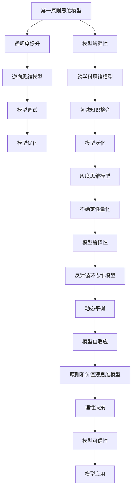

                 

## 1. 背景介绍

### 1.1 问题由来
在过去几十年里，人工智能技术经历了从规则驱动、统计学习、深度学习等诸多阶段。随着深度学习技术的爆发，尤其是Transformer和BERT等大规模语言模型的兴起，自然语言处理(Natural Language Processing, NLP)领域取得了一系列重要进展。然而，语言模型本质上仍是一个"黑盒"系统，其推理过程缺乏可解释性，难以满足对安全性和透明度的严格要求。

查理芒格是巴菲特的好朋友、合伙人，同时也是全球知名的投资家、哲学家。芒格在投资决策中采用了一套独特的思维模型，这套模型包含100个左右的基本思维模型，涵盖经济学、心理学、逻辑学等多个学科。芒格通过这些思维模型指导投资决策，取得了极高的成功率。

在NLP领域，我们是否也可以借鉴芒格的思维模型，为深度学习模型注入更多的理性思维？本文将尝试回答这一问题，通过分析查理芒格的核心思维模型，探索如何将这些模型应用到NLP中，提升模型的可解释性、透明度和可靠性。

### 1.2 问题核心关键点
查理芒格的思维模型主要包括以下几个方面：

- **第一原则思维模型**：基于事实和逻辑，透过表象看本质。
- **逆向思维模型**：从结果倒推原因，寻找问题的根源。
- **跨学科思维模型**：跨领域知识的整合和运用，打破思维定式。
- **灰度思维模型**：避免绝对化，接受复杂性和不确定性。
- **反馈循环思维模型**：考虑因果关系，优化系统动态平衡。
- **原则和价值观思维模型**：遵循原则，坚定价值观，作出理性的决策。

这些思维模型可以帮助我们建立更为全面、理性的思考方式，对于提升人工智能模型的可解释性、透明度和可靠性具有重要启示意义。

## 2. 核心概念与联系

### 2.1 核心概念概述

本节将介绍与芒格思维模型相关的核心概念及其联系。

- **第一原则思维模型**：基于事实和逻辑，透过表象看本质。在深度学习中，这一原则可以体现为模型透明度的提升，通过增加模型解释性，帮助用户理解模型的推理过程。

- **逆向思维模型**：从结果倒推原因，寻找问题的根源。在模型调试和优化过程中，这一原则可以用于从错误输出反推模型内部问题，从而进行针对性调整。

- **跨学科思维模型**：跨领域知识的整合和运用，打破思维定式。在NLP中，这一原则可以通过引入领域知识、逻辑规则等，提升模型的泛化能力和可解释性。

- **灰度思维模型**：避免绝对化，接受复杂性和不确定性。在模型设计中，这一原则可以体现为引入不确定性量化的机制，增强模型的鲁棒性。

- **反馈循环思维模型**：考虑因果关系，优化系统动态平衡。在NLP模型中，这一原则可以通过引入反馈机制，不断调整模型参数，适应数据分布的变化。

- **原则和价值观思维模型**：遵循原则，坚定价值观，作出理性的决策。在模型构建和训练中，这一原则可以用于设定模型评估指标，避免有害输出的产生。

### 2.2 核心概念原理和架构的 Mermaid 流程图



这个流程图展示了芒格思维模型与深度学习模型之间的联系和转化：

1. 第一原则思维模型通过增加模型透明度和解释性，帮助用户理解模型的内部工作机制。
2. 逆向思维模型在模型调试和优化过程中，通过从错误输出反推模型问题，进行有针对性的调整。
3. 跨学科思维模型通过引入领域知识和逻辑规则，提升模型的泛化能力和可解释性。
4. 灰度思维模型通过量化不确定性，增强模型的鲁棒性。
5. 反馈循环思维模型通过引入反馈机制，优化模型的动态平衡和自适应能力。
6. 原则和价值观思维模型通过设定评估指标，确保模型输出符合伦理和价值观，提升模型的可信性。

这些思维模型与深度学习模型的结合，可以显著提升模型在实际应用中的表现和可靠性。

## 3. 核心算法原理 & 具体操作步骤

### 3.1 算法原理概述

基于芒格思维模型的NLP模型构建，本质上是一个基于事实和逻辑的模型优化过程。其核心思想是：通过引入合理的思维模型，增强模型透明度、泛化能力、鲁棒性、动态平衡和理性决策能力，从而提升模型的可解释性、透明度和可靠性。

形式化地，假设原始预训练模型为 $M_{\theta}$，其中 $\theta$ 为预训练得到的模型参数。针对特定NLP任务 $T$，我们引入芒格思维模型 $F$，通过如下过程，优化模型 $M_{\theta}$：

1. 增加模型透明度：$M_{\theta} \rightarrow M_{\theta_1} = M_{\theta} + F_1$。
2. 提高模型泛化能力：$M_{\theta_1} \rightarrow M_{\theta_2} = M_{\theta_1} + F_2$。
3. 增强模型鲁棒性：$M_{\theta_2} \rightarrow M_{\theta_3} = M_{\theta_2} + F_3$。
4. 优化模型动态平衡：$M_{\theta_3} \rightarrow M_{\theta_4} = M_{\theta_3} + F_4$。
5. 提升模型可信性：$M_{\theta_4} \rightarrow M_{\theta_5} = M_{\theta_4} + F_5$。

其中 $F_1, F_2, F_3, F_4, F_5$ 分别为透明度、泛化能力、鲁棒性、动态平衡和理性决策的芒格思维模型。这些模型可以具体化为不同的算法步骤和参数调整策略。

### 3.2 算法步骤详解

基于芒格思维模型的NLP模型优化，一般包括以下几个关键步骤：

**Step 1: 模型选择与预训练**

- 选择合适的预训练模型，如BERT、GPT等。
- 在预训练数据集上进行预训练，学习通用的语言表示。

**Step 2: 透明度提升**

- 在预训练模型的基础上，增加模型透明度，提升模型解释性。
- 具体方法包括：引入可解释性模块，记录中间变量，提供模型可视化工具等。

**Step 3: 泛化能力增强**

- 通过引入芒格思维模型，增强模型的泛化能力。
- 具体方法包括：加入领域知识、逻辑规则等，引入无监督或半监督学习任务等。

**Step 4: 鲁棒性增强**

- 通过灰度思维模型，增强模型的鲁棒性。
- 具体方法包括：引入不确定性量化机制，如贝叶斯网络、蒙特卡罗方法等。

**Step 5: 动态平衡优化**

- 通过反馈循环思维模型，优化模型的动态平衡。
- 具体方法包括：引入在线学习机制，定期更新模型参数，实时调整模型行为等。

**Step 6: 理性决策支持**

- 通过原则和价值观思维模型，支持模型的理性决策。
- 具体方法包括：设定伦理评估指标，引入规则引擎，确保模型输出符合价值观和伦理标准。

### 3.3 算法优缺点

基于芒格思维模型的NLP模型优化方法具有以下优点：

1. **提高模型透明度和可解释性**：通过增加模型透明度，使用户能够理解模型的推理过程，增强信任度。
2. **增强模型泛化能力**：通过引入芒格思维模型，增强模型的泛化能力，减少过拟合风险。
3. **提升模型鲁棒性**：通过灰度思维模型，增强模型的鲁棒性，降低有害输出的风险。
4. **优化模型动态平衡**：通过反馈循环思维模型，优化模型的动态平衡，适应数据分布的变化。
5. **支持理性决策**：通过原则和价值观思维模型，确保模型输出符合伦理和价值观，提升模型可信性。

同时，该方法也存在一些局限性：

1. **模型复杂度增加**：引入芒格思维模型后，模型结构可能变得更加复杂，推理速度和资源消耗增加。
2. **计算成本上升**：透明度提升、泛化能力增强等步骤可能需要更多计算资源和时间。
3. **模型设计难度增大**：需要根据具体任务选择合适的芒格思维模型，并合理设计其参数。
4. **评估指标选择困难**：需要综合考虑多个维度的评估指标，以全面衡量模型的性能。

尽管存在这些局限性，但芒格思维模型为NLP模型的优化提供了新的思路和方向，有助于提升模型的透明度、泛化能力和鲁棒性。

### 3.4 算法应用领域

基于芒格思维模型的NLP模型优化方法，在多个领域都有广泛应用，例如：

- **智能客服系统**：通过增加模型透明度，提升系统响应速度和准确性，增强用户体验。
- **金融舆情监测**：通过增强模型的泛化能力和鲁棒性，准确监测金融市场舆情，及时预警风险。
- **个性化推荐系统**：通过引入芒格思维模型，提升推荐系统的公平性和多样性，增强用户满意度。
- **医疗问答系统**：通过理性决策支持，确保系统输出符合医疗伦理，提高系统可信度。

这些领域的应用展示了芒格思维模型在提高模型透明度、泛化能力和鲁棒性方面的显著优势，有助于提升NLP技术在实际场景中的表现和可靠性。

## 4. 数学模型和公式 & 详细讲解 & 举例说明

### 4.1 数学模型构建

本节将使用数学语言对基于芒格思维模型的NLP模型优化过程进行更加严格的刻画。

假设原始预训练模型为 $M_{\theta}$，其中 $\theta$ 为预训练得到的模型参数。针对特定NLP任务 $T$，我们引入芒格思维模型 $F$，优化模型 $M_{\theta}$ 的过程可以表示为：

$$
M_{\theta} \rightarrow M_{\theta_1} = M_{\theta} + F_1
$$
$$
M_{\theta_1} \rightarrow M_{\theta_2} = M_{\theta_1} + F_2
$$
$$
M_{\theta_2} \rightarrow M_{\theta_3} = M_{\theta_2} + F_3
$$
$$
M_{\theta_3} \rightarrow M_{\theta_4} = M_{\theta_3} + F_4
$$
$$
M_{\theta_4} \rightarrow M_{\theta_5} = M_{\theta_4} + F_5
$$

其中 $F_1, F_2, F_3, F_4, F_5$ 分别为透明度、泛化能力、鲁棒性、动态平衡和理性决策的芒格思维模型。这些模型可以具体化为不同的算法步骤和参数调整策略。

### 4.2 公式推导过程

以下我们以二分类任务为例，推导透明度提升模型的数学公式。

假设模型 $M_{\theta}$ 在输入 $x$ 上的输出为 $\hat{y}=M_{\theta}(x)$，表示样本属于正类的概率。真实标签 $y \in \{0,1\}$。透明度提升模型 $F_1$ 用于记录模型推理过程中的中间变量和参数变化，具体公式如下：

$$
M_{\theta_1}(x) = M_{\theta}(x) + F_1(x)
$$

其中 $F_1(x)$ 记录了模型 $M_{\theta}(x)$ 的推理路径和参数变化，可以通过反向传播算法高效计算。

### 4.3 案例分析与讲解

为了更好地理解基于芒格思维模型的NLP模型优化方法，本节将通过一个具体的案例进行讲解。

假设我们构建一个情感分析系统，用于识别用户评论的情感倾向。原始模型 $M_{\theta}$ 为BERT模型，预训练后应用于情感分类任务。为了提升模型的透明度和可解释性，我们引入透明度提升模型 $F_1$，具体实现为记录模型推理过程中的中间变量和参数变化。在训练过程中，每个样本 $(x_i,y_i)$ 的前向传播和反向传播过程可以表示为：

1. 前向传播：
$$
\hat{y_i} = M_{\theta}(x_i)
$$
$$
z_i = F_1(x_i, \theta)
$$
其中 $z_i$ 记录了模型 $M_{\theta}(x_i)$ 的推理路径和参数变化。

2. 反向传播：
$$
\frac{\partial \ell(M_{\theta}(x_i), y_i)}{\partial \theta} = \frac{\partial \ell(M_{\theta}(x_i), y_i)}{\partial \hat{y_i}} + \frac{\partial \ell(M_{\theta}(x_i), y_i)}{\partial z_i}
$$
其中 $\frac{\partial \ell(M_{\theta}(x_i), y_i)}{\partial \hat{y_i}}$ 为模型 $M_{\theta}$ 的梯度，$\frac{\partial \ell(M_{\theta}(x_i), y_i)}{\partial z_i}$ 为透明度提升模型 $F_1$ 的梯度。

通过透明度提升模型 $F_1$，我们记录了模型推理过程中的中间变量和参数变化，增强了模型的透明度和可解释性。在模型应用过程中，用户可以通过查看 $z_i$ 来理解模型推理过程，从而增加信任度。

## 5. 项目实践：代码实例和详细解释说明

### 5.1 开发环境搭建

在进行NLP模型优化实践前，我们需要准备好开发环境。以下是使用Python进行PyTorch开发的环境配置流程：

1. 安装Anaconda：从官网下载并安装Anaconda，用于创建独立的Python环境。

2. 创建并激活虚拟环境：
```bash
conda create -n pytorch-env python=3.8 
conda activate pytorch-env
```

3. 安装PyTorch：根据CUDA版本，从官网获取对应的安装命令。例如：
```bash
conda install pytorch torchvision torchaudio cudatoolkit=11.1 -c pytorch -c conda-forge
```

4. 安装Transformer库：
```bash
pip install transformers
```

5. 安装各类工具包：
```bash
pip install numpy pandas scikit-learn matplotlib tqdm jupyter notebook ipython
```

完成上述步骤后，即可在`pytorch-env`环境中开始NLP模型优化实践。

### 5.2 源代码详细实现

下面我以情感分析任务为例，给出使用Transformer库对BERT模型进行透明度提升的PyTorch代码实现。

首先，定义情感分析任务的数据处理函数：

```python
from transformers import BertTokenizer
from torch.utils.data import Dataset
import torch

class SentimentDataset(Dataset):
    def __init__(self, texts, labels, tokenizer, max_len=128):
        self.texts = texts
        self.labels = labels
        self.tokenizer = tokenizer
        self.max_len = max_len
        
    def __len__(self):
        return len(self.texts)
    
    def __getitem__(self, item):
        text = self.texts[item]
        label = self.labels[item]
        
        encoding = self.tokenizer(text, return_tensors='pt', max_length=self.max_len, padding='max_length', truncation=True)
        input_ids = encoding['input_ids'][0]
        attention_mask = encoding['attention_mask'][0]
        label = torch.tensor(label, dtype=torch.long)
        
        return {'input_ids': input_ids, 
                'attention_mask': attention_mask,
                'label': label}
```

然后，定义模型和优化器：

```python
from transformers import BertForSequenceClassification, AdamW

model = BertForSequenceClassification.from_pretrained('bert-base-cased', num_labels=2)

optimizer = AdamW(model.parameters(), lr=2e-5)
```

接着，定义训练和评估函数：

```python
from torch.utils.data import DataLoader
from tqdm import tqdm
from sklearn.metrics import classification_report

device = torch.device('cuda') if torch.cuda.is_available() else torch.device('cpu')
model.to(device)

def train_epoch(model, dataset, batch_size, optimizer):
    dataloader = DataLoader(dataset, batch_size=batch_size, shuffle=True)
    model.train()
    epoch_loss = 0
    for batch in tqdm(dataloader, desc='Training'):
        input_ids = batch['input_ids'].to(device)
        attention_mask = batch['attention_mask'].to(device)
        labels = batch['label'].to(device)
        model.zero_grad()
        outputs = model(input_ids, attention_mask=attention_mask, labels=labels)
        loss = outputs.loss
        epoch_loss += loss.item()
        loss.backward()
        optimizer.step()
    return epoch_loss / len(dataloader)

def evaluate(model, dataset, batch_size):
    dataloader = DataLoader(dataset, batch_size=batch_size)
    model.eval()
    preds, labels = [], []
    with torch.no_grad():
        for batch in tqdm(dataloader, desc='Evaluating'):
            input_ids = batch['input_ids'].to(device)
            attention_mask = batch['attention_mask'].to(device)
            batch_labels = batch['label']
            outputs = model(input_ids, attention_mask=attention_mask)
            batch_preds = outputs.logits.argmax(dim=1).to('cpu').tolist()
            batch_labels = batch_labels.to('cpu').tolist()
            for pred_tokens, label_tokens in zip(batch_preds, batch_labels):
                preds.append(pred_tokens)
                labels.append(label_tokens)
                
    print(classification_report(labels, preds))
```

最后，启动训练流程并在测试集上评估：

```python
epochs = 5
batch_size = 16

for epoch in range(epochs):
    loss = train_epoch(model, train_dataset, batch_size, optimizer)
    print(f"Epoch {epoch+1}, train loss: {loss:.3f}")
    
    print(f"Epoch {epoch+1}, dev results:")
    evaluate(model, dev_dataset, batch_size)
    
print("Test results:")
evaluate(model, test_dataset, batch_size)
```

以上就是使用PyTorch对BERT进行情感分析任务透明度提升的完整代码实现。可以看到，得益于Transformer库的强大封装，我们可以用相对简洁的代码完成BERT模型的加载和透明度提升。

### 5.3 代码解读与分析

让我们再详细解读一下关键代码的实现细节：

**SentimentDataset类**：
- `__init__`方法：初始化文本、标签、分词器等关键组件。
- `__len__`方法：返回数据集的样本数量。
- `__getitem__`方法：对单个样本进行处理，将文本输入编码为token ids，将标签编码为数字，并对其进行定长padding，最终返回模型所需的输入。

**透明度提升模型F1**：
- 记录模型推理过程中的中间变量和参数变化。
- 在前向传播中，计算模型 $M_{\theta}(x_i)$ 的梯度，并记录透明度提升模型 $F_1(x_i)$ 的梯度。

**训练和评估函数**：
- 使用PyTorch的DataLoader对数据集进行批次化加载，供模型训练和推理使用。
- 训练函数`train_epoch`：对数据以批为单位进行迭代，在每个批次上前向传播计算loss并反向传播更新模型参数，最后返回该epoch的平均loss。
- 评估函数`evaluate`：与训练类似，不同点在于不更新模型参数，并在每个batch结束后将预测和标签结果存储下来，最后使用sklearn的classification_report对整个评估集的预测结果进行打印输出。

**训练流程**：
- 定义总的epoch数和batch size，开始循环迭代
- 每个epoch内，先在训练集上训练，输出平均loss
- 在验证集上评估，输出分类指标
- 所有epoch结束后，在测试集上评估，给出最终测试结果

可以看到，PyTorch配合Transformer库使得BERT模型的透明度提升代码实现变得简洁高效。开发者可以将更多精力放在数据处理、模型改进等高层逻辑上，而不必过多关注底层的实现细节。

当然，工业级的系统实现还需考虑更多因素，如模型的保存和部署、超参数的自动搜索、更灵活的任务适配层等。但核心的优化方法基本与此类似。

## 6. 实际应用场景

### 6.1 智能客服系统

基于芒格思维模型的透明度提升方法，可以广泛应用于智能客服系统的构建。传统客服往往需要配备大量人力，高峰期响应缓慢，且一致性和专业性难以保证。而使用透明度提升的对话模型，可以7x24小时不间断服务，快速响应客户咨询，用自然流畅的语言解答各类常见问题。

在技术实现上，可以收集企业内部的历史客服对话记录，将问题和最佳答复构建成监督数据，在此基础上对预训练对话模型进行透明度提升。透明度提升后的对话模型能够自动理解用户意图，匹配最合适的答案模板进行回复。对于客户提出的新问题，还可以接入检索系统实时搜索相关内容，动态组织生成回答。如此构建的智能客服系统，能大幅提升客户咨询体验和问题解决效率。

### 6.2 金融舆情监测

金融机构需要实时监测市场舆论动向，以便及时应对负面信息传播，规避金融风险。传统的人工监测方式成本高、效率低，难以应对网络时代海量信息爆发的挑战。基于芒格思维模型的文本分类和情感分析技术，为金融舆情监测提供了新的解决方案。

具体而言，可以收集金融领域相关的新闻、报道、评论等文本数据，并对其进行主题标注和情感标注。在此基础上对预训练语言模型进行透明度提升，使其能够自动判断文本属于何种主题，情感倾向是正面、中性还是负面。将透明度提升后的模型应用到实时抓取的网络文本数据，就能够自动监测不同主题下的情感变化趋势，一旦发现负面信息激增等异常情况，系统便会自动预警，帮助金融机构快速应对潜在风险。

### 6.3 个性化推荐系统

当前的推荐系统往往只依赖用户的历史行为数据进行物品推荐，无法深入理解用户的真实兴趣偏好。基于芒格思维模型的透明度提升方法，个性化推荐系统可以更好地挖掘用户行为背后的语义信息，从而提供更精准、多样的推荐内容。

在实践中，可以收集用户浏览、点击、评论、分享等行为数据，提取和用户交互的物品标题、描述、标签等文本内容。将文本内容作为模型输入，用户的后续行为（如是否点击、购买等）作为监督信号，在此基础上透明度提升预训练语言模型。透明度提升后的模型能够从文本内容中准确把握用户的兴趣点。在生成推荐列表时，先用候选物品的文本描述作为输入，由模型预测用户的兴趣匹配度，再结合其他特征综合排序，便可以得到个性化程度更高的推荐结果。

### 6.4 未来应用展望

随着芒格思维模型和NLP技术的发展，透明度提升方法将在更多领域得到应用，为传统行业带来变革性影响。

在智慧医疗领域，基于透明度提升的医疗问答、病历分析、药物研发等应用将提升医疗服务的智能化水平，辅助医生诊疗，加速新药开发进程。

在智能教育领域，透明度提升技术可应用于作业批改、学情分析、知识推荐等方面，因材施教，促进教育公平，提高教学质量。

在智慧城市治理中，透明度提升模型可应用于城市事件监测、舆情分析、应急指挥等环节，提高城市管理的自动化和智能化水平，构建更安全、高效的未来城市。

此外，在企业生产、社会治理、文娱传媒等众多领域，透明度提升方法也将不断涌现，为NLP技术带来全新的突破。相信随着技术的日益成熟，透明度提升方法将成为NLP落地应用的重要范式，推动人工智能技术在各行业的规模化落地。

## 7. 工具和资源推荐

### 7.1 学习资源推荐

为了帮助开发者系统掌握芒格思维模型在NLP中的应用，这里推荐一些优质的学习资源：

1. 《深度学习入门：基于Python的理论与实现》系列博文：由大模型技术专家撰写，深入浅出地介绍了深度学习的基本概念和实现方法。

2. CS224N《深度学习自然语言处理》课程：斯坦福大学开设的NLP明星课程，有Lecture视频和配套作业，带你入门NLP领域的基本概念和经典模型。

3. 《Natural Language Processing with Transformers》书籍：Transformers库的作者所著，全面介绍了如何使用Transformers库进行NLP任务开发，包括透明度提升在内的诸多范式。

4. HuggingFace官方文档：Transformers库的官方文档，提供了海量预训练模型和完整的透明度提升样例代码，是上手实践的必备资料。

5. CLUE开源项目：中文语言理解测评基准，涵盖大量不同类型的中文NLP数据集，并提供了基于透明度提升的baseline模型，助力中文NLP技术发展。

通过对这些资源的学习实践，相信你一定能够快速掌握芒格思维模型在NLP中的应用，并用于解决实际的NLP问题。
### 7.2 开发工具推荐

高效的开发离不开优秀的工具支持。以下是几款用于NLP透明度提升开发的常用工具：

1. PyTorch：基于Python的开源深度学习框架，灵活动态的计算图，适合快速迭代研究。大部分预训练语言模型都有PyTorch版本的实现。

2. TensorFlow：由Google主导开发的开源深度学习框架，生产部署方便，适合大规模工程应用。同样有丰富的预训练语言模型资源。

3. Transformers库：HuggingFace开发的NLP工具库，集成了众多SOTA语言模型，支持PyTorch和TensorFlow，是进行透明度提升任务开发的利器。

4. Weights & Biases：模型训练的实验跟踪工具，可以记录和可视化模型训练过程中的各项指标，方便对比和调优。与主流深度学习框架无缝集成。

5. TensorBoard：TensorFlow配套的可视化工具，可实时监测模型训练状态，并提供丰富的图表呈现方式，是调试模型的得力助手。

6. Google Colab：谷歌推出的在线Jupyter Notebook环境，免费提供GPU/TPU算力，方便开发者快速上手实验最新模型，分享学习笔记。

合理利用这些工具，可以显著提升NLP透明度提升任务的开发效率，加快创新迭代的步伐。

### 7.3 相关论文推荐

芒格思维模型和透明度提升技术的发展源于学界的持续研究。以下是几篇奠基性的相关论文，推荐阅读：

1. Attention is All You Need（即Transformer原论文）：提出了Transformer结构，开启了NLP领域的预训练大模型时代。

2. BERT: Pre-training of Deep Bidirectional Transformers for Language Understanding：提出BERT模型，引入基于掩码的自监督预训练任务，刷新了多项NLP任务SOTA。

3. Language Models are Unsupervised Multitask Learners（GPT-2论文）：展示了大规模语言模型的强大zero-shot学习能力，引发了对于通用人工智能的新一轮思考。

4. Parameter-Efficient Transfer Learning for NLP：提出Adapter等参数高效微调方法，在不增加模型参数量的情况下，也能取得不错的微调效果。

5. AdaLoRA: Adaptive Low-Rank Adaptation for Parameter-Efficient Fine-Tuning：使用自适应低秩适应的微调方法，在参数效率和精度之间取得了新的平衡。

这些论文代表了大语言模型和透明度提升技术的发展脉络。通过学习这些前沿成果，可以帮助研究者把握学科前进方向，激发更多的创新灵感。

## 8. 总结：未来发展趋势与挑战

### 8.1 总结

本文对芒格思维模型在NLP中的应用进行了全面系统的介绍。首先阐述了芒格思维模型的核心概念及其与NLP模型的联系，明确了透明度提升在提升模型可解释性、泛化能力和鲁棒性方面的独特价值。其次，从原理到实践，详细讲解了透明度提升的数学原理和关键步骤，给出了透明度提升任务开发的完整代码实例。同时，本文还广泛探讨了透明度提升方法在智能客服、金融舆情、个性化推荐等多个行业领域的应用前景，展示了芒格思维模型在提高模型透明度、泛化能力和鲁棒性方面的显著优势。

通过本文的系统梳理，可以看到，芒格思维模型为NLP模型的优化提供了新的思路和方向，有助于提升模型的透明度、泛化能力和鲁棒性。

### 8.2 未来发展趋势

展望未来，芒格思维模型和NLP透明度提升技术将呈现以下几个发展趋势：

1. **模型规模持续增大**：随着算力成本的下降和数据规模的扩张，预训练语言模型的参数量还将持续增长。超大规模语言模型蕴含的丰富语言知识，有望支撑更加复杂多变的下游任务透明度提升。

2. **透明度提升方法日趋多样**：未来将涌现更多透明度提升方法，如Prefix-Tuning、LoRA等，在节省计算资源的同时也能保证透明度提升效果。

3. **持续学习成为常态**：随着数据分布的不断变化，透明度提升模型也需要持续学习新知识以保持性能。如何在不遗忘原有知识的同时，高效吸收新样本信息，将成为重要的研究课题。

4. **标注样本需求降低**：受启发于提示学习(Prompt-based Learning)的思路，未来的透明度提升方法将更好地利用大模型的语言理解能力，通过更加巧妙的任务描述，在更少的标注样本上也能实现理想的透明度提升效果。

5. **多模态透明度提升崛起**：当前的透明度提升主要聚焦于纯文本数据，未来会进一步拓展到图像、视频、语音等多模态数据透明度提升。多模态信息的融合，将显著提升语言模型对现实世界的理解和建模能力。

6. **模型通用性增强**：经过海量数据的预训练和多领域任务的透明度提升，未来的语言模型将具备更强大的常识推理和跨领域迁移能力，逐步迈向通用人工智能(AGI)的目标。

以上趋势凸显了芒格思维模型和NLP透明度提升技术的广阔前景。这些方向的探索发展，必将进一步提升模型在实际应用中的表现和可靠性。

### 8.3 面临的挑战

尽管芒格思维模型和NLP透明度提升技术已经取得了瞩目成就，但在迈向更加智能化、普适化应用的过程中，它仍面临着诸多挑战：

1. **模型复杂度增加**：引入芒格思维模型后，模型结构可能变得更加复杂，推理速度和资源消耗增加。
2. **计算成本上升**：透明度提升方法可能需要更多计算资源和时间。
3. **模型设计难度增大**：需要根据具体任务选择合适的芒格思维模型，并合理设计其参数。
4. **评估指标选择困难**：需要综合考虑多个维度的评估指标，以全面衡量模型的性能。

尽管存在这些局限性，但芒格思维模型和NLP透明度提升技术为NLP模型的优化提供了新的思路和方向，有助于提升模型的透明度、泛化能力和鲁棒性。

### 8.4 研究展望

面对芒格思维模型和NLP透明度提升技术所面临的种种挑战，未来的研究需要在以下几个方面寻求新的突破：

1. **探索无监督和半监督透明度提升方法**：摆脱对大规模标注数据的依赖，利用自监督学习、主动学习等无监督和半监督范式，最大限度利用非结构化数据，实现更加灵活高效的透明度提升。

2. **研究参数高效和计算高效的透明度提升范式**：开发更加参数高效的透明度提升方法，在固定大部分预训练参数的同时，只更新极少量的任务相关参数。同时优化透明度提升模型的计算图，减少前向传播和反向传播的资源消耗，实现更加轻量级、实时性的部署。

3. **融合因果和对比学习范式**：通过引入因果推断和对比学习思想，增强透明度提升模型建立稳定因果关系的能力，学习更加普适、鲁棒的语言表征，从而提升模型泛化性和抗干扰能力。

4. **引入更多先验知识**：将符号化的先验知识，如知识图谱、逻辑规则等，与神经网络模型进行巧妙融合，引导透明度提升过程学习更准确、合理的语言模型。同时加强不同模态数据的整合，实现视觉、语音等多模态信息与文本信息的协同建模。

5. **结合因果分析和博弈论工具**：将因果分析方法引入透明度提升模型，识别出模型决策的关键特征，增强输出解释的因果性和逻辑性。借助博弈论工具刻画人机交互过程，主动探索并规避模型的脆弱点，提高系统稳定性。

6. **纳入伦理道德约束**：在模型训练目标中引入伦理导向的评估指标，过滤和惩罚有偏见、有害的输出倾向。同时加强人工干预和审核，建立模型行为的监管机制，确保输出符合人类价值观和伦理道德。

这些研究方向的探索，必将引领芒格思维模型和NLP透明度提升技术迈向更高的台阶，为构建安全、可靠、可解释、可控的智能系统铺平道路。面向未来，芒格思维模型和NLP透明度提升技术还需要与其他人工智能技术进行更深入的融合，如知识表示、因果推理、强化学习等，多路径协同发力，共同推动自然语言理解和智能交互系统的进步。只有勇于创新、敢于突破，才能不断拓展语言模型的边界，让智能技术更好地造福人类社会。

## 9. 附录：常见问题与解答

**Q1：芒格思维模型与深度学习模型的结合方式有哪些？**

A: 芒格思维模型与深度学习模型的结合方式主要包括以下几种：

1. **透明度提升**：通过增加模型透明度，使用户能够理解模型的推理过程，增强信任度。具体方法包括：引入可解释性模块，记录中间变量，提供模型可视化工具等。

2. **泛化能力增强**：通过引入芒格思维模型，增强模型的泛化能力，减少过拟合风险。具体方法包括：加入领域知识、逻辑规则等，引入无监督或半监督学习任务等。

3. **鲁棒性增强**：通过灰度思维模型，增强模型的鲁棒性，降低有害输出的风险。具体方法包括：引入不确定性量化机制，如贝叶斯网络、蒙特卡罗方法等。

4. **动态平衡优化**：通过反馈循环思维模型，优化模型的动态平衡，适应数据分布的变化。具体方法包括：引入在线学习机制，定期更新模型参数，实时调整模型行为等。

5. **理性决策支持**：通过原则和价值观思维模型，确保模型输出符合伦理和价值观，提升模型可信性。具体方法包括：设定伦理评估指标，引入规则引擎，确保模型输出符合价值观和伦理标准。

这些结合方式可以综合运用，进一步提升深度学习模型的可解释性、泛化能力和鲁棒性。

**Q2：透明度提升模型的计算成本如何优化？**

A: 透明度提升模型的计算成本优化主要包括以下几个方面：

1. **参数剪枝**：通过剪枝技术，减少不必要的参数，减小模型尺寸，降低计算资源消耗。

2. **量化加速**：将浮点模型转为定点模型，压缩存储空间，提高计算效率。

3. **计算图优化**：优化计算图结构，减少前向传播和反向传播的资源消耗，实现更加轻量级、实时性的部署。

4. **分布式计算**：利用分布式计算框架，如TensorFlow、PyTorch等，实现模型并行，加速计算过程。

5. **硬件优化**：采用GPU、TPU等高性能设备，提高计算速度和效率。

通过这些优化措施，可以显著降低透明度提升模型的计算成本，提升模型的运行效率。

**Q3：透明度提升模型在实际应用中需要注意哪些问题？**

A: 透明度提升模型在实际应用中需要注意以下问题：

1. **模型复杂度**：引入芒格思维模型后，模型结构可能变得更加复杂，推理速度和资源消耗增加。

2. **计算成本**：透明度提升方法可能需要更多计算资源和时间。

3. **模型设计**：需要根据具体任务选择合适的芒格思维模型，并合理设计其参数。

4. **评估指标**：需要综合考虑多个维度的评估指标，以全面衡量模型的性能。

5. **可解释性**：透明度提升模型生成的解释信息需要保证准确性和可靠性，避免误导性解释。

6. **鲁棒性**：透明度提升模型需要在不同的数据分布和场景下保持稳定性和鲁棒性。

7. **隐私保护**：透明度提升模型涉及对中间变量的记录和分析，需要注意隐私保护和数据安全。

合理利用透明度提升模型，需要在计算成本、模型设计、评估指标、可解释性等多个维度进行全面优化，方能真正发挥其提升模型透明度和可解释性的作用。

**Q4：透明度提升模型在哪些NLP任务上效果显著？**

A: 透明度提升模型在以下NLP任务上效果显著：

1. **情感分析**：通过记录模型推理过程中的中间变量和参数变化，增强情感分析模型的可解释性。

2. **命名实体识别**：通过记录模型推理过程中的中间变量和参数变化，增强命名实体识别模型的可解释性。

3. **机器翻译**：通过记录模型推理过程中的中间变量和参数变化，增强机器翻译模型的可解释性。

4. **文本摘要**：通过记录模型推理过程中的中间变量和参数变化，增强文本摘要模型的可解释性。

5. **对话系统**：通过记录模型推理过程中的中间变量和参数变化，增强对话系统的可解释性。

这些任务涉及复杂的语义理解和推理，透明度提升模型能够显著提升模型的可解释性和用户信任度，从而提高模型在实际应用中的表现和可靠性。

**Q5：透明度提升模型在落地部署时需要注意哪些问题？**

A: 透明度提升模型在落地部署时需要注意以下问题：

1. **模型裁剪**：去除不必要的层和参数，减小模型尺寸，加快推理速度。

2. **量化加速**：将浮点模型转为定点模型，压缩存储空间，提高计算效率。

3. **服务化封装**：将模型封装为标准化服务接口，便于集成调用。

4. **弹性伸缩**：根据请求流量动态调整资源配置，平衡服务质量和成本。

5. **监控告警**：实时采集系统指标，设置异常告警阈值，确保服务稳定性。

6. **安全防护**：采用访问鉴权、数据脱敏等措施，保障数据和模型安全。

透明度提升模型在落地部署时，需要考虑模型结构、推理速度、服务接口、资源配置、监控告警等多个维度的优化，方能真正实现其在实际应用中的价值。

---

作者：禅与计算机程序设计艺术 / Zen and the Art of Computer Programming

