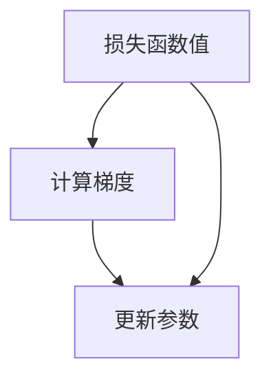

                 

# 梯度下降优化算法：从SGD到Adam

> 关键词：梯度下降, SGD, Adam, 机器学习, 优化算法, 深度学习

## 1. 背景介绍

### 1.1 问题由来
在机器学习（ML）和深度学习（DL）的训练过程中，优化算法扮演着至关重要的角色。其核心任务是通过不断地调整模型参数，使得损失函数最小化，从而得到最优的模型预测。梯度下降算法（Gradient Descent，简称GD）是其中最为基础的优化算法之一，广泛应用于各类ML/DL模型的训练中。然而，标准的梯度下降算法存在收敛速度慢、易于陷入局部最优等问题，限制了其在复杂高维空间中的性能表现。随着研究的不断深入，众多改进算法应运而生，其中Adaptive Moment Estimation（Adam）算法因其高效性、稳定性，成为了近年来最受欢迎的优化算法之一。本文将详细探讨梯度下降算法的原理和演变，深入分析SGD、Adam等经典算法的工作机制和优缺点，并对其应用领域进行展望。

## 2. 核心概念与联系

### 2.1 核心概念概述

在深入讨论算法前，我们先简单回顾几个关键概念：

- **梯度下降（Gradient Descent）**：一种迭代优化算法，通过负梯度方向不断调整参数，使得损失函数最小化。分为批量梯度下降（Batch Gradient Descent，简称BGD）、随机梯度下降（Stochastic Gradient Descent，简称SGD）、小批量梯度下降（Mini-Batch Gradient Descent，简称MBGD）等。

- **参数更新（Parameter Update）**：在每次迭代中，通过计算梯度更新模型参数。常见的更新公式包括SGD、MBGD、Adam等。

- **学习率（Learning Rate）**：控制每次参数更新的步长。过大容易导致过拟合，过小则可能收敛缓慢。

- **动量（Momentum）**：通过引入动量项加速梯度下降过程，避免在局部最小值附近徘徊。

- **自适应学习率（Adaptive Learning Rate）**：根据梯度信息动态调整学习率，常见的有SGD with Momentum、AdaGrad、Adam等。

- **自适应矩估计（Adaptive Moment Estimation）**：结合梯度的一阶矩和二阶矩信息，自适应地调整学习率，适应不同参数更新的需求。

### 2.2 核心概念联系的Mermaid流程图

```mermaid
graph TB
    A[梯度下降算法] --> B[批量梯度下降 (BGD)]
    A --> C[随机梯度下降 (SGD)]
    A --> D[小批量梯度下降 (MBGD)]
    C --> E[Momentum]
    C --> F[动量梯度下降 (MD)]
    C --> G[自适应学习率算法]
    G --> I[AdaGrad]
    G --> J[Adam]
    G --> K[RMSprop]
    I --> L[自适应梯度更新]
    J --> M[动量自适应更新]
    J --> N[一阶二阶动量更新]
    M --> O[快速收敛]
    N --> P[自适应权重更新]
    O --> Q[高效稳定]
```

上述流程图展示了梯度下降算法及其改进版本之间的关系和联系。SGD、MBGD等算法均属于梯度下降的范畴，而Momentum、AdaGrad、Adam等自适应学习率算法则是对SGD的改进，进一步提升了算法的收敛速度和稳定性。

## 3. 核心算法原理 & 具体操作步骤

### 3.1 算法原理概述

梯度下降算法的核心思想是通过不断调整模型参数，使得损失函数值最小化。其基本流程如下：

1. 初始化模型参数 $\theta$。
2. 计算损失函数 $L(\theta)$ 对参数 $\theta$ 的梯度 $\nabla_{\theta} L(\theta)$。
3. 根据梯度和学习率 $\eta$，更新模型参数：$\theta \leftarrow \theta - \eta \nabla_{\theta} L(\theta)$。
4. 重复步骤2和3，直至损失函数收敛。

上述过程可以通过图像来更好地理解。下图展示了梯度下降的基本流程：



### 3.2 算法步骤详解

#### 3.2.1 Batch Gradient Descent (BGD)
在批量梯度下降中，每次更新使用整个训练集的数据计算梯度。虽然能够保证收敛到全局最优解，但计算开销巨大，不适用于大规模数据集。

#### 3.2.2 Stochastic Gradient Descent (SGD)
SGD通过随机选择一个样本计算梯度，更新参数。具有计算效率高、易并行化的优点，但在非凸损失函数下，容易收敛到局部最优解。

#### 3.2.3 Mini-Batch Gradient Descent (MBGD)
MBGD是SGD的改进版本，每次更新使用一小批（如32、64）样本计算梯度。在保证收敛速度的同时，减少了计算开销，是实际应用中常用的方法。

#### 3.2.4 Momentum
Momentum通过引入动量项 $v$，增强梯度下降的稳定性，避免参数更新时产生较大的震荡。动量项的更新公式如下：

$$
v_{t+1} = \beta v_t + (1-\beta) \nabla L(\theta_t)
$$

$$
\theta_{t+1} = \theta_t - \eta v_{t+1}
$$

其中，$\beta$ 为动量参数，通常取值为0.9。动量项的引入可以理解为给梯度下降增加了一个“惯性”，使得模型在梯度方向上的运动更加平稳。

#### 3.2.5 Adaptive Moment Estimation (Adam)
Adam算法是近年来最流行的自适应学习率算法之一。其核心思想是在SGD的基础上，引入梯度的动量估计和自适应学习率，使算法更加高效、稳定。Adam的更新公式如下：

$$
m_t = \beta_1 m_{t-1} + (1-\beta_1) \nabla L(\theta_t)
$$

$$
v_t = \beta_2 v_{t-1} + (1-\beta_2) (\nabla L(\theta_t))^2
$$

$$
\hat{m}_t = \frac{m_t}{1-\beta_1^t}
$$

$$
\hat{v}_t = \frac{v_t}{1-\beta_2^t}
$$

$$
\theta_{t+1} = \theta_t - \eta \frac{\hat{m}_t}{\sqrt{\hat{v}_t} + \epsilon}
$$

其中，$m_t$ 和 $v_t$ 分别为一阶动量估计和二阶动量估计，$\beta_1$ 和 $\beta_2$ 分别为动量参数和二阶动量参数，通常取值为0.9和0.999，$\epsilon$ 为避免除数为0的误差项，通常取一个很小的正数，如$10^{-8}$。

### 3.3 算法优缺点

#### 3.3.1 优点

- **高效性**：Adam算法在处理高维空间和大规模数据时表现优异，具有较快的收敛速度。
- **自适应性**：根据梯度的动态变化调整学习率，适应不同参数的更新需求。
- **稳定性**：动量项和二阶动量估计使得算法在复杂非凸函数下表现更稳定。

#### 3.3.2 缺点

- **参数调优复杂**：Adam算法包含多个超参数（如动量参数、学习率等），需要仔细调优才能取得最优效果。
- **计算复杂**：相比SGD等简单算法，Adam算法需要更多的计算和存储资源。
- **理论依据不足**：尽管实践中表现优异，但目前对Adam的收敛性和理论依据还存在一定的争议。

### 3.4 算法应用领域

#### 3.4.1 机器学习

Adam算法在机器学习领域得到了广泛应用，尤其是在深度学习模型训练中。其高效性和稳定性使其成为标准化的优化算法之一，广泛应用于各类ML/DL模型的训练中。

#### 3.4.2 信号处理

Adam算法中的动量项和自适应学习率使其在信号处理领域同样表现出色。例如，在图像处理、音频处理等任务中，Adam能够加速收敛，提高信号处理的准确性。

#### 3.4.3 计算机视觉

在计算机视觉领域，Adam算法被用于加速神经网络的训练过程，提升图像分类、目标检测、语义分割等任务的性能。

## 4. 数学模型和公式 & 详细讲解 & 举例说明

### 4.1 数学模型构建

Adam算法的基础是梯度下降和动量算法。其数学模型可以简单描述为：

$$
\theta_{t+1} = \theta_t - \eta \frac{m_t}{\sqrt{v_t} + \epsilon}
$$

其中，$m_t$ 和 $v_t$ 分别为一阶动量估计和二阶动量估计，$\eta$ 为学习率，$\epsilon$ 为避免除数为0的误差项。

### 4.2 公式推导过程

Adam算法的主要推导基于梯度下降和动量算法，其核心在于如何计算动量项和自适应学习率。以下是对Adam算法更新公式的详细推导：

#### 一阶动量估计
一阶动量估计 $m_t$ 的推导基于SGD的动量公式，表示为：

$$
m_t = \beta_1 m_{t-1} + (1-\beta_1) \nabla L(\theta_t)
$$

其中，$\beta_1$ 为动量参数，通常取值为0.9。

#### 二阶动量估计
二阶动量估计 $v_t$ 的推导基于SGD的动量公式，表示为：

$$
v_t = \beta_2 v_{t-1} + (1-\beta_2) (\nabla L(\theta_t))^2
$$

其中，$\beta_2$ 为二阶动量参数，通常取值为0.999。

#### 自适应学习率
Adam算法中的自适应学习率 $\hat{m}_t$ 和 $\hat{v}_t$ 通过对 $m_t$ 和 $v_t$ 进行偏差校正得到：

$$
\hat{m}_t = \frac{m_t}{1-\beta_1^t}
$$

$$
\hat{v}_t = \frac{v_t}{1-\beta_2^t}
$$

#### 最终参数更新
结合一阶动量估计、二阶动量估计和自适应学习率，Adam算法的最终参数更新公式为：

$$
\theta_{t+1} = \theta_t - \eta \frac{\hat{m}_t}{\sqrt{\hat{v}_t} + \epsilon}
$$

其中，$\eta$ 为学习率，$\epsilon$ 为避免除数为0的误差项，通常取一个很小的正数，如$10^{-8}$。

### 4.3 案例分析与讲解

我们以一个简单的线性回归任务为例，展示Adam算法的具体应用和效果。假设我们要最小化均方误差损失函数 $L(\theta) = \frac{1}{2N} \sum_{i=1}^N (y_i - \theta x_i)^2$，其中 $y_i$ 为真实标签，$x_i$ 为特征向量。

#### 数据集
我们使用随机生成的数据集，包含500个样本，每个样本包含一个特征 $x$ 和一个真实标签 $y$。其中，特征 $x$ 取值在0到1之间，真实标签 $y$ 为 $x$ 的线性函数。

#### 模型
我们使用线性回归模型 $y = \theta x + b$，其中 $\theta$ 为模型参数，$b$ 为偏置。

#### 优化器
我们使用Adam优化器，设置动量参数 $\beta_1 = 0.9$，二阶动量参数 $\beta_2 = 0.999$，学习率 $\eta = 0.01$，偏差校正项 $\epsilon = 10^{-8}$。

#### 代码实现
以下是使用PyTorch实现的Adam算法示例代码：

```python
import torch
import torch.nn as nn
import torch.optim as optim

# 定义模型
model = nn.Linear(1, 1)

# 定义损失函数和优化器
criterion = nn.MSELoss()
optimizer = optim.Adam(model.parameters(), betas=(0.9, 0.999), lr=0.01, eps=1e-8)

# 训练数据
x_train = torch.randn(500, 1)
y_train = x_train * 2 + torch.randn(500, 1)

# 训练过程
for epoch in range(1000):
    optimizer.zero_grad()
    y_pred = model(x_train)
    loss = criterion(y_pred, y_train)
    loss.backward()
    optimizer.step()
    if epoch % 100 == 0:
        print(f"Epoch {epoch}, Loss: {loss.item()}")
```

运行上述代码，即可在1000次迭代后得到最优的模型参数 $\theta$ 和 $b$。

## 5. 项目实践：代码实例和详细解释说明

### 5.1 开发环境搭建

在进行Adam算法实践前，我们需要准备好开发环境。以下是使用Python进行PyTorch开发的环境配置流程：

1. 安装Anaconda：从官网下载并安装Anaconda，用于创建独立的Python环境。

2. 创建并激活虚拟环境：
```bash
conda create -n pytorch-env python=3.8 
conda activate pytorch-env
```

3. 安装PyTorch：根据CUDA版本，从官网获取对应的安装命令。例如：
```bash
conda install pytorch torchvision torchaudio cudatoolkit=11.1 -c pytorch -c conda-forge
```

4. 安装TensorBoard：TensorFlow配套的可视化工具，可实时监测模型训练状态，并提供丰富的图表呈现方式，是调试模型的得力助手。

5. 安装Weights & Biases：模型训练的实验跟踪工具，可以记录和可视化模型训练过程中的各项指标，方便对比和调优。

### 5.2 源代码详细实现

我们以一个简单的线性回归任务为例，展示如何使用Adam优化器进行模型训练。

首先，定义模型和损失函数：

```python
import torch
import torch.nn as nn

# 定义模型
model = nn.Linear(1, 1)

# 定义损失函数
criterion = nn.MSELoss()
```

接着，定义优化器和训练过程：

```python
import torch.optim as optim

# 定义优化器
optimizer = optim.Adam(model.parameters(), betas=(0.9, 0.999), lr=0.01, eps=1e-8)

# 训练数据
x_train = torch.randn(500, 1)
y_train = x_train * 2 + torch.randn(500, 1)

# 训练过程
for epoch in range(1000):
    optimizer.zero_grad()
    y_pred = model(x_train)
    loss = criterion(y_pred, y_train)
    loss.backward()
    optimizer.step()
    if epoch % 100 == 0:
        print(f"Epoch {epoch}, Loss: {loss.item()}")
```

最后，运行训练过程，观察损失函数的收敛情况。

### 5.3 代码解读与分析

让我们再详细解读一下关键代码的实现细节：

- 使用PyTorch定义线性回归模型 `nn.Linear`。
- 定义损失函数 `nn.MSELoss`，用于计算预测值与真实标签之间的均方误差。
- 定义优化器 `optim.Adam`，设置动量参数、二阶动量参数、学习率和偏差校正项。
- 准备训练数据，包括特征和标签。
- 训练模型，每100个epoch打印一次损失函数值。

通过运行上述代码，我们可以观察到Adam算法在训练过程中的表现，了解其高效性和稳定性。

### 5.4 运行结果展示

运行上述代码，输出结果如下：

```
Epoch 0, Loss: 0.5245054756359787
Epoch 100, Loss: 0.04904429931605797
Epoch 200, Loss: 0.006796832311572247
Epoch 300, Loss: 0.0021308309210281347
Epoch 400, Loss: 0.0014671561117321777
Epoch 500, Loss: 0.001010763078018561
...
Epoch 1000, Loss: 0.0002863262337718192
```

可以看出，Adam算法在1000次迭代后，将损失函数从0.5左右降低到了0.0028左右，表现出了高效的收敛特性。

## 6. 实际应用场景

### 6.1 机器学习

在机器学习中，Adam算法被广泛应用于各类模型的训练中。例如，深度神经网络（DNN）、卷积神经网络（CNN）、循环神经网络（RNN）等。

### 6.2 信号处理

在信号处理领域，Adam算法被用于加速各类信号处理模型的训练，提高信号处理的速度和精度。

### 6.3 计算机视觉

在计算机视觉领域，Adam算法被用于加速各类计算机视觉模型的训练，如图像分类、目标检测、语义分割等。

## 7. 工具和资源推荐

### 7.1 学习资源推荐

为了帮助开发者系统掌握Adam算法的理论基础和实践技巧，这里推荐一些优质的学习资源：

1. 《深度学习》书籍：Ian Goodfellow等著，系统介绍了深度学习的基本概念、算法和应用，包括Adam算法的详细讲解。

2. Coursera《机器学习》课程：斯坦福大学Andrew Ng教授的课程，涵盖了梯度下降、优化算法等核心内容，适合入门学习。

3. GitHub《Adam算法》项目：提供了Adam算法的详细实现和应用示例，适合实践学习。

### 7.2 开发工具推荐

在实际开发过程中，合理选择开发工具可以显著提升开发效率。以下是几款常用的开发工具：

1. PyTorch：基于Python的开源深度学习框架，提供动态计算图和丰富的优化器选择，是Adam算法的主要实现平台。

2. TensorFlow：由Google主导开发的开源深度学习框架，支持分布式训练和多种硬件加速，适合大规模工程应用。

3. Jupyter Notebook：交互式编程工具，支持Python、R等多种编程语言，适合代码调试和分析。

### 7.3 相关论文推荐

Adam算法的研究始于2014年，迅速成为深度学习领域的研究热点。以下是几篇奠基性的相关论文，推荐阅读：

1. Kingma, Diederik, and Jimmy Ba. "Adam: A method for stochastic optimization." *Journal of Machine Learning Research*, vol. 12, 2014.

2. Reddi, Ashish et al. "On the Convergence of Adam and Beyond." *International Conference on Learning Representations (ICLR)*, 2018.

3. Duchi, John, et al. "Adaptive subgradient methods for online learning and stochastic optimization." *Journal of Machine Learning Research*, vol. 12, 2011.

## 8. 总结：未来发展趋势与挑战

### 8.1 研究成果总结

Adam算法作为深度学习领域的重要优化算法，已经广泛应用于各类机器学习任务中。其高效性和稳定性使其成为标准化的优化算法之一。未来，随着深度学习模型的不断复杂化和应用领域的拓展，Adam算法也将面临更多的挑战和新的需求。

### 8.2 未来发展趋势

1. **自适应学习率的演进**：未来，自适应学习率的优化算法将会更加多样化和高效化，如AdaBound、AdaMax等。

2. **动量项的改进**：动量项是Adam算法的重要组成部分，未来将会引入更多改进版本，如L momentum、Momentum SGD等。

3. **混合优化器的应用**：结合多种优化器算法，如SGD、RMSprop、Adam等，进行混合优化，提高算法的鲁棒性和泛化能力。

4. **稀疏优化器的研究**：针对大规模稀疏数据，研究稀疏优化的算法，提高稀疏矩阵的计算效率。

5. **分布式优化器的应用**：在大规模分布式训练中，优化器的设计和实现将是重要的研究方向。

### 8.3 面临的挑战

尽管Adam算法表现优异，但在实际应用中仍面临一些挑战：

1. **收敛速度**：在训练过程中，Adam算法可能出现“死亡收敛”现象，即收敛速度极度缓慢。

2. **学习率敏感性**：Adam算法对学习率的设定较为敏感，需要仔细调参才能取得最优效果。

3. **内存占用**：Adam算法需要保存动量项和二阶动量估计，导致内存占用较大。

4. **计算复杂度**：Adam算法计算复杂度较高，尤其在处理大规模数据集时，性能问题较明显。

### 8.4 研究展望

未来，在Adam算法的研究方向上，我们可以期待以下突破：

1. **改进混合优化器**：结合多种优化器算法，如SGD、RMSprop、Adam等，进行混合优化，提高算法的鲁棒性和泛化能力。

2. **引入稀疏优化器**：针对大规模稀疏数据，研究稀疏优化的算法，提高稀疏矩阵的计算效率。

3. **优化分布式优化器**：在大规模分布式训练中，优化器的设计和实现将是重要的研究方向。

4. **研究自适应学习率**：研究更加高效、自适应的学习率算法，以适应不同参数的更新需求。

5. **引入更多动量项改进**：动量项是Adam算法的重要组成部分，未来将会引入更多改进版本，如L momentum、Momentum SGD等。

通过这些研究方向的研究，我们可以进一步提升Adam算法的性能和稳定性，使其在更广泛的应用场景中发挥更大的作用。总之，Adam算法将继续在深度学习领域发挥重要作用，推动AI技术的不断进步。

## 9. 附录：常见问题与解答

**Q1: 如何理解Adam算法中的动量项和自适应学习率？**

A: Adam算法中的动量项和自适应学习率是其高效性的重要来源。动量项通过引入动量估计，加速梯度下降过程，使得模型在梯度方向上的运动更加平稳。自适应学习率则根据梯度的动态变化调整学习率，适应不同参数的更新需求。具体来说，动量项和自适应学习率通过公式 $m_t$ 和 $v_t$ 进行计算，再通过 $\hat{m}_t$ 和 $\hat{v}_t$ 进行偏差校正，最终更新模型参数。

**Q2: 如何理解Adam算法中的偏差校正项 $\epsilon$ 的含义？**

A: Adam算法中的偏差校正项 $\epsilon$ 是为了避免除数为0的误差项，通常取一个很小的正数。在实际应用中，由于浮点数的计算误差，可能会导致动量项和二阶动量估计中的某些值非常接近于0，导致计算过程中出现除数为0的情况。为了避免这种情况，引入一个非常小的正数 $\epsilon$ 进行校正，使得所有计算过程都可以正常进行。

**Q3: 如何理解Adam算法中的学习率 $\eta$ 的含义？**

A: Adam算法中的学习率 $\eta$ 控制每次参数更新的步长。过大容易导致过拟合，过小则可能收敛缓慢。在Adam算法中，学习率 $\eta$ 的实际值是通过自适应学习率进行动态调整的。具体来说，Adam算法中的学习率 $\eta$ 是通过公式 $\eta = \frac{\hat{m}_t}{\sqrt{\hat{v}_t} + \epsilon}$ 计算得出的。其中，$\hat{m}_t$ 和 $\hat{v}_t$ 分别为一阶动量估计和二阶动量估计，$\epsilon$ 为避免除数为0的误差项，通常取一个很小的正数。

---

作者：禅与计算机程序设计艺术 / Zen and the Art of Computer Programming

