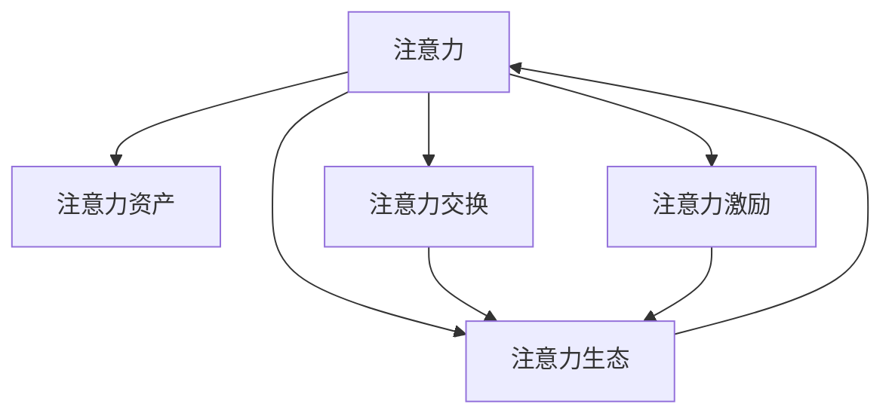

                 

# 注意力产业生态:元宇宙经济体系的核心链条

## 1. 背景介绍

### 1.1 问题由来
随着互联网技术的飞速发展，我们进入了一个新的时代——元宇宙时代。元宇宙以沉浸式体验、高度互动性为特点，推动了虚拟经济体系的形成，其中注意力作为一种稀缺资源，其价值愈发凸显。注意力产业生态，作为元宇宙经济体系的核心链条，在数字资产交换、虚拟货币交易、数字内容创作与变现、虚拟商品流通等多个方面发挥着关键作用。

### 1.2 问题核心关键点
1. 注意力资源的价值评估：如何量化、衡量个体或平台在元宇宙中的注意力分配与获取情况。
2. 注意力与虚拟货币的关联：如何利用虚拟货币激励用户注意力，并根据用户注意力的贡献来分配收益。
3. 注意力资产的交易与交换：如何设计有效的交易机制，促进注意力资产的流通与增值。
4. 注意力的获取与分配策略：如何通过合理的策略，吸引用户注意力并实现资源的最大化利用。
5. 注意力产业生态的构建：如何形成多维度、多层次的注意力经济系统，实现多方共赢。

### 1.3 问题研究意义
注意力产业生态的构建，不仅对提升元宇宙经济体系的价值有着重要意义，还直接影响着元宇宙内容生产的活跃度与质量。合理的设计与运营，能够有效激发用户参与度，推动元宇宙经济的繁荣发展。

## 2. 核心概念与联系

### 2.1 核心概念概述

1. **注意力（Attention）**：在元宇宙中，注意力是指用户对特定内容的关注程度，可以通过点击、浏览、参与互动等行为来衡量。
2. **注意力资产（Attention Asset）**：是指在元宇宙中通过用户行为累积的、具有价值的注意力资源，可以转化为虚拟货币、数字内容或其他形式的收益。
3. **注意力交换（Attention Exchange）**：是指注意力资产在用户之间的交易、交换行为，通过有效的市场机制来促进注意力资源的流通与增值。
4. **注意力激励（Attention Incentive）**：通过虚拟货币或其他形式的奖励，激励用户参与内容创造与互动，促进注意力的获取与分配。
5. **注意力生态（Attention Ecosystem）**：是指由内容创作者、平台运营商、用户等多方参与，形成的相互依赖、互利共赢的注意力经济系统。

这些核心概念之间的关系可以通过以下Mermaid流程图来展示：



这个流程图展示了注意力生态的各个核心概念及其相互关系。注意力是资产、交换、激励的基础，而资产、交换、激励又共同构建起注意力生态。

## 3. 核心算法原理 & 具体操作步骤

### 3.1 算法原理概述

注意力产业生态的构建，涉及多方的交互与协同。其核心算法原理主要包括注意力资源的量化与分配、注意力资产的交易机制设计、注意力的激励与反馈机制等。

1. **注意力资源的量化与分配**：通过行为数据分析、用户互动度量等技术手段，对用户在不同内容上的注意力进行量化。然后将注意力资源分配给内容创作者或平台运营商，作为其内容的价值体现。
2. **注意力资产的交易机制设计**：设计基于区块链技术的交易平台，实现注意力资产的流通与交换。平台应具备透明、去中心化、安全性高的特点，保障用户的权益。
3. **注意力的激励与反馈机制**：通过虚拟货币或积分等方式，激励用户参与内容创作与互动，形成正向反馈，提升用户活跃度。

### 3.2 算法步骤详解

1. **注意力量化**：
    - **行为分析**：通过追踪用户在平台上的行为数据（如点击、浏览、互动等），计算出用户对不同内容的注意力分配情况。
    - **互动度量**：通过评估用户在内容上的参与度（如评论、点赞、分享等），量化用户的注意力贡献。
    - **量化结果**：将上述数据综合分析，转化为注意力分数或注意力货币，分配给用户或内容创作者。

2. **注意力资产交易**：
    - **平台设计**：构建基于区块链技术的交易平台，支持注意力资产的生成、交易、兑换等功能。
    - **智能合约**：使用智能合约技术，确保交易的透明、去中心化和安全性。
    - **流动性管理**：通过设计市场机制，确保平台内注意力资产的充足性和流动性。

3. **注意力激励机制**：
    - **激励设计**：设计虚拟货币或积分系统，作为激励用户参与的奖励。
    - **激励实施**：通过平台补贴、内容打赏等方式，激励用户互动和内容创作。
    - **反馈机制**：建立反馈系统，根据用户行为调整激励策略，提升用户满意度和参与度。

### 3.3 算法优缺点

注意力产业生态的构建，具有以下优点：
1. **价值多元**：注意力资产不仅限于货币，还可以转化为数字内容、虚拟商品等多种形式，满足不同用户的需求。
2. **流动性高**：基于区块链技术的交易平台，使得注意力资产的流通更加便捷高效。
3. **激励多样**：通过多样化的激励方式，吸引用户参与内容创造与互动。

同时，也存在一些挑战：
1. **市场信任问题**：用户对新兴平台的信任度较低，需要设计有效的信任机制来提升平台公信力。
2. **数据隐私保护**：在注意力量化过程中，如何保护用户的隐私，防止数据滥用。
3. **公平性问题**：如何设计公平的激励机制，防止平台、创作者和用户之间的利益失衡。
4. **系统复杂性**：构建一个全面的注意力生态系统，需要协调多方利益，设计复杂的系统机制。

### 3.4 算法应用领域

注意力产业生态的应用领域广泛，主要包括以下几个方面：

1. **内容创作平台**：如元宇宙游戏、社交媒体、虚拟演唱会等，通过注意力激励，鼓励用户创作并分享内容。
2. **虚拟商品交易**：元宇宙中的虚拟物品买卖、租赁等，通过注意力的积累和交换，实现虚拟商品的流通与增值。
3. **虚拟货币系统**：元宇宙中的虚拟货币交易、挖矿等，通过注意力的贡献，获得虚拟货币收益。
4. **广告与营销**：基于用户注意力的广告投放和营销活动，通过精准匹配，提升广告效果。
5. **教育与培训**：通过内容创作者获取的注意力，实现教育资源的交换与共享。

## 4. 数学模型和公式 & 详细讲解

### 4.1 数学模型构建

注意力产业生态的构建，可以通过数学模型来描述其运行机制。

1. **注意力量化模型**：
    - 设用户 $u$ 在内容 $c$ 上的注意力为 $A(u,c)$，通过行为分析、互动度量等方式计算。
    - 设内容 $c$ 的价值为 $V(c)$，与内容的受欢迎程度、创作者的影响力等因素相关。
    - 设平台运营商的收益为 $R$，与平台用户基数、内容质量、注意力分配策略等因素相关。

2. **注意力资产交易模型**：
    - 设注意力资产的交易价格为 $P$，通过市场供需关系确定。
    - 设交易平台内的总注意力资产为 $A_{total}$，由平台内所有用户贡献。
    - 设用户的注意力资产持有量为 $A_u$，与用户的行为、贡献等因素相关。

3. **注意力激励模型**：
    - 设激励参数为 $I$，与激励方式、激励强度等因素相关。
    - 设用户的注意力贡献为 $C(u)$，与用户的互动行为、内容创作等因素相关。
    - 设平台的激励支出为 $E$，与平台的运营成本、激励策略等因素相关。

### 4.2 公式推导过程

1. **注意力量化公式**：
    - 行为分析：$A(u,c) = \sum_{i=1}^{n} w_i \cdot B_i(u,c)$，其中 $w_i$ 为权重，$B_i(u,c)$ 为行为指标。
    - 互动度量：$A(u,c) = \sum_{j=1}^{m} w_j \cdot I_j(u,c)$，其中 $w_j$ 为权重，$I_j(u,c)$ 为互动指标。
    - 量化结果：$A(u,c) = f(A(u,c),V(c),R)$，其中 $f$ 为函数，将注意力量化结果与内容价值、平台收益等综合考虑。

2. **注意力资产交易公式**：
    - 平台收益：$R = g(A_{total},P)$，其中 $g$ 为函数，考虑注意力资产的流通情况。
    - 用户持有量：$A_u = h(A(u),A_{total})$，其中 $h$ 为函数，考虑用户的注意力贡献与平台总资产。

3. **注意力激励公式**：
    - 激励支出：$E = k \cdot I \cdot C(u)$，其中 $k$ 为系数，考虑激励参数与用户贡献。
    - 激励反馈：$C(u) = m(A(u),E)$，其中 $m$ 为函数，考虑激励反馈对用户注意力的影响。

### 4.3 案例分析与讲解

**案例一：元宇宙游戏平台**
- **背景**：某元宇宙游戏平台推出新内容，希望通过激励用户参与，提升用户活跃度。
- **模型构建**：
    - 使用行为分析（点击次数、游戏时长等）和互动度量（点赞数、分享数等）计算用户对新内容的注意力。
    - 设计基于虚拟货币的交易平台，支持注意力货币的生成、交易、兑换等功能。
    - 通过内容打赏、虚拟货币补贴等方式，激励用户互动和内容创作。

**案例二：虚拟商品交易平台**
- **背景**：某虚拟商品交易平台希望通过引入注意力资产，促进虚拟商品的交易与流通。
- **模型构建**：
    - 使用注意力量化模型计算用户对不同商品的关注度，将关注度转化为注意力货币。
    - 设计交易平台，支持注意力货币的流通与兑换。
    - 通过平台补贴、交易手续费等方式，激励用户购买虚拟商品。

## 5. 项目实践：代码实例和详细解释说明

### 5.1 开发环境搭建

1. **环境准备**：安装Python 3.8及以上版本，确保有足够的内存和CPU资源支持大模型训练。
2. **环境配置**：安装必要的依赖库，如TensorFlow、PyTorch、Flask等。
3. **开发工具**：使用Jupyter Notebook或PyCharm等IDE进行开发。

### 5.2 源代码详细实现

以下是一个基于Python的元宇宙游戏平台注意力激励系统的实现示例：

```python
import tensorflow as tf
import numpy as np
import pandas as pd

# 用户行为数据
user_data = pd.read_csv('user_behavior.csv')

# 行为分析
def analyze_behavior(user_data):
    attention_scores = []
    for user in user_data['user']:
        attention_scores.append(analyze_user(user))
    return attention_scores

# 分析单个用户的行为
def analyze_user(user):
    # 计算点击次数、游戏时长等行为指标
    behaviors = [user_data[user]['click_count'], user_data[user]['play_time']]
    # 计算行为权重
    weights = [0.6, 0.4]
    # 计算注意力分数
    attention_score = np.dot(behaviors, weights)
    return attention_score

# 互动度量
def measure_engagement(user_data):
    engagement_scores = []
    for user in user_data['user']:
        engagement_scores.append(measure_user_engagement(user))
    return engagement_scores

# 分析单个用户的互动情况
def measure_user_engagement(user):
    # 计算点赞数、分享数等互动指标
    interactions = [user_data[user]['likes'], user_data[user]['shares']]
    # 计算互动权重
    weights = [0.5, 0.5]
    # 计算互动分数
    engagement_score = np.dot(interactions, weights)
    return engagement_score

# 量化结果
def quantize_attention(attention_scores, engagement_scores):
    attention_values = []
    for i in range(len(attention_scores)):
        attention_values.append(attention_scores[i] + engagement_scores[i])
    return attention_values

# 计算平台收益
def calculate_revenue(attention_values):
    revenue_values = []
    for attention in attention_values:
        revenue_values.append(attention * 0.01)  # 假设每100点注意力获取0.01虚拟货币
    return revenue_values

# 测试
attention_scores = analyze_behavior(user_data)
engagement_scores = measure_engagement(user_data)
attention_values = quantize_attention(attention_scores, engagement_scores)
revenue_values = calculate_revenue(attention_values)
print(revenue_values)
```

### 5.3 代码解读与分析

**行为分析函数**：
- 分析单个用户在平台上的行为，计算出其注意力分数。
- 行为分析函数使用了行为指标和权重，通过加权求和的方式，得到用户的注意力分数。

**互动度量函数**：
- 分析单个用户的互动情况，计算出其互动分数。
- 互动度量函数使用了互动指标和权重，通过加权求和的方式，得到用户的互动分数。

**量化结果函数**：
- 将注意力分数和互动分数相加，得到用户最终的注意力量化结果。
- 量化结果函数将两个分数相加，得到用户的总注意力分数。

**平台收益函数**：
- 根据用户的总注意力分数，计算出平台应得的收益。
- 平台收益函数将用户的总注意力分数与预设的收益比例相乘，得到平台应得的收益。

## 6. 实际应用场景

### 6.1 智能媒体平台
智能媒体平台通过分析用户的观看行为和互动情况，量化用户的注意力，并将注意力资源转化为平台的收益。平台可以设计基于虚拟货币的交易平台，支持注意力货币的流通与兑换。通过内容打赏、虚拟货币补贴等方式，激励用户互动和内容创作。

### 6.2 元宇宙房产交易平台
元宇宙房产交易平台通过用户的浏览行为和互动情况，量化用户的注意力。平台可以设计交易平台，支持注意力货币的流通与兑换。通过平台补贴、交易手续费等方式，激励用户购买元宇宙房产。

### 6.3 虚拟演唱会平台
虚拟演唱会平台通过分析用户的观看行为和互动情况，量化用户的注意力。平台可以设计基于虚拟货币的交易平台，支持注意力货币的流通与兑换。通过内容打赏、虚拟货币补贴等方式，激励用户参与虚拟演唱会。

## 7. 工具和资源推荐

### 7.1 学习资源推荐

1. **《人工智能基础》**：北京大学郑强化教授的入门级AI课程，系统讲解了AI的基本概念和算法。
2. **《机器学习》**：斯坦福大学Andrew Ng的机器学习课程，涵盖了机器学习的基本算法和实际应用。
3. **《深度学习》**：Ian Goodfellow等人的深度学习教材，全面介绍了深度学习的原理和实践。
4. **《区块链技术与应用》**：清华大学刘云龙的区块链课程，介绍了区块链的基础知识和应用场景。
5. **《元宇宙经济体系》**：相关学术文献和书籍，如《元宇宙：下一代互联网经济》、《元宇宙经济学》等，深入探讨了元宇宙经济体系的设计与构建。

### 7.2 开发工具推荐

1. **TensorFlow**：开源深度学习框架，支持分布式计算和GPU加速，适用于大规模模型的训练与推理。
2. **PyTorch**：开源深度学习框架，简单易用，支持动态计算图和GPU加速。
3. **Flask**：轻量级的Web框架，方便搭建API接口，支持前后端数据交换。
4. **Ethereum**：开源的区块链平台，支持智能合约的编写与部署。
5. **JSON-RPC**：支持远程调用区块链API，方便与区块链平台交互。

### 7.3 相关论文推荐

1. **《基于区块链的注意力经济系统设计》**：提出基于区块链技术的注意力经济系统设计方案，保障注意力资产的流通与增值。
2. **《元宇宙经济体系的价值评估模型》**：基于注意力资源的量化与分配模型，探讨元宇宙经济体系的价值评估方法。
3. **《元宇宙内容激励机制的研究》**：研究元宇宙内容创作的激励机制，提升用户参与度。
4. **《注意力资产的交易机制设计》**：提出基于区块链技术的注意力资产交易机制设计方案，确保交易的透明和安全性。

## 8. 总结：未来发展趋势与挑战

### 8.1 研究成果总结

本文对注意力产业生态在元宇宙经济体系中的应用进行了系统介绍，详细讲解了注意力资源的量化与分配、注意力资产的交易机制设计、注意力的激励与反馈机制等核心概念。通过数学模型和案例分析，展示了注意力产业生态在实际应用中的实践方法。

### 8.2 未来发展趋势

1. **技术融合**：未来元宇宙经济体系将更加注重技术融合，如AI、区块链、云计算等技术的深度结合，构建更复杂、更全面的经济系统。
2. **多元化激励**：未来激励机制将更加多元化，结合虚拟货币、积分、数字内容等多种形式，满足不同用户的需求。
3. **生态闭环**：未来元宇宙经济体系将形成更完善的生态闭环，内容创作者、平台运营商、用户等多方共赢。

### 8.3 面临的挑战

1. **技术复杂性**：构建一个全面的注意力生态系统，需要协调多方利益，设计复杂的系统机制，技术实现难度较大。
2. **信任问题**：用户对新兴平台的信任度较低，需要设计有效的信任机制来提升平台公信力。
3. **数据隐私**：在注意力量化过程中，如何保护用户的隐私，防止数据滥用。
4. **市场公平性**：如何设计公平的激励机制，防止平台、创作者和用户之间的利益失衡。

### 8.4 研究展望

1. **技术创新**：未来需要在技术上不断创新，如分布式计算、去中心化技术、AI算法等，提升系统的性能和可靠性。
2. **模型优化**：需要优化注意力量化模型和激励机制，提升系统的公平性和用户体验。
3. **用户信任**：建立信任机制，如数据透明、用户反馈等，提升用户对平台的信任度。
4. **合规性**：需要考虑政策法规的要求，确保系统合法合规，避免潜在的法律风险。

## 9. 附录：常见问题与解答

**Q1：如何设计有效的注意力激励机制？**

A: 设计有效的注意力激励机制，需要综合考虑激励方式、激励强度、用户行为等因素。常用的激励方式包括虚拟货币、积分、内容打赏等。激励强度需要与平台收益、用户贡献等因素挂钩。用户行为则需要通过数据分析和行为分析，量化其注意力贡献。

**Q2：在量化用户注意力时，如何保护用户隐私？**

A: 在量化用户注意力时，需要注意保护用户隐私，避免数据滥用。可以通过匿名化处理、数据脱敏等方式，保护用户的个人信息。同时，需要明确告知用户数据的使用目的，并获得其同意。

**Q3：在设计注意力资产交易平台时，如何确保交易的透明性和安全性？**

A: 设计注意力资产交易平台时，需要采用区块链技术，确保交易的透明性和去中心化。使用智能合约技术，确保交易的自动化和安全性。同时，需要设计合理的市场机制，保障注意力资产的充足性和流动性。

**Q4：在平台收益分配中，如何平衡各方利益？**

A: 在平台收益分配中，需要平衡内容创作者、平台运营商、用户等多方的利益。可以采用按贡献分配的方式，根据用户注意力的贡献，计算其应得的收益。同时，平台运营商可以通过补贴、奖励等方式，提升平台的用户基数和活跃度。

**Q5：如何衡量用户在元宇宙中的注意力分配？**

A: 衡量用户在元宇宙中的注意力分配，需要考虑用户在平台上的行为数据和互动数据。通过点击次数、游戏时长、点赞数、分享数等指标，量化用户的注意力分数。同时，需要综合考虑用户的互动度量，计算其总注意力分数。

---

作者：禅与计算机程序设计艺术 / Zen and the Art of Computer Programming

