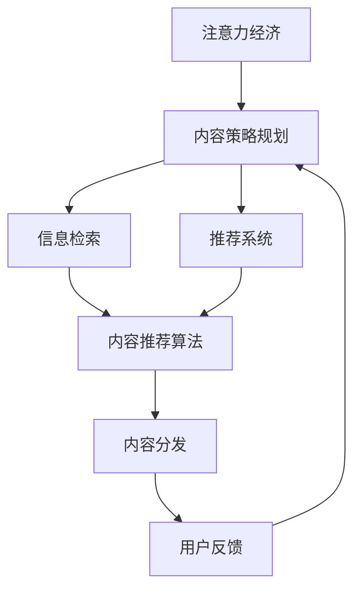

                 

# 注意力经济与内容策略规划与实践：为受众创建有影响力的内容

> 关键词：注意力经济,内容策略规划,信息检索,推荐系统,内容推荐算法

## 1. 背景介绍

### 1.1 问题由来

在数字化时代，信息的海量涌现和用户注意力的稀缺，使得注意力经济（Economy of Attention）成为了一种新的经济模式。企业和组织需要在海量信息中吸引并保持用户的注意力，以获取更高的价值。因此，内容策略的规划与实施变得至关重要。

### 1.2 问题核心关键点

内容策略的核心在于理解受众的兴趣和需求，通过高效的内容组织和分发，最大化用户注意力，实现商业目标。具体来说，这包括以下几个关键点：

1. **用户行为分析**：了解用户兴趣和行为，如搜索历史、点击行为、阅读习惯等。
2. **内容创作与优化**：基于用户兴趣创作高质量的内容，并进行A/B测试等优化。
3. **分发渠道选择**：选择合适的分发渠道，如社交媒体、邮件、新闻网站等。
4. **效果评估与反馈**：对内容策略的效果进行评估，并根据反馈不断调整。

在数字化转型加速的背景下，内容策略规划已不再只是市场营销人员的专利，而是全公司协同合作的成果。本文将重点探讨注意力经济下，如何通过内容策略规划和实践，为受众创建有影响力的内容。

## 2. 核心概念与联系

### 2.1 核心概念概述

本节将介绍几个核心概念及其联系：

- **注意力经济**：一种基于用户注意力的新型经济模式，企业通过吸引用户注意力，实现价值增值。
- **内容策略规划**：企业对内容的创作、发布、分发和监测所进行的全方位规划。
- **信息检索**：通过关键词匹配等技术手段，从海量信息中检索出用户感兴趣的内容。
- **推荐系统**：利用用户历史行为数据，为用户推荐个性化内容，提高用户满意度。
- **内容推荐算法**：基于用户行为和内容特征，设计算法实现内容推荐。

这些核心概念共同构成了注意力经济下内容策略的框架，理解它们之间的关系，有助于我们更好地进行内容策略的规划和实践。

### 2.2 核心概念原理和架构的 Mermaid 流程图



这个流程图展示了注意力经济下内容策略的各个环节，以及它们之间的联系：

1. 基于注意力经济，企业对内容策略进行规划，包括信息检索和推荐系统的设计和实现。
2. 信息检索和推荐系统利用内容推荐算法，为用户推荐个性化内容。
3. 内容分发到用户，收集用户反馈。
4. 用户反馈用于调整和优化内容策略，形成闭环。

## 3. 核心算法原理 & 具体操作步骤

### 3.1 算法原理概述

内容推荐算法是内容策略规划中的核心部分，其目标是通过对用户兴趣和行为数据的分析，为用户推荐最相关的个性化内容。推荐算法的核心思想是利用用户历史行为数据和内容特征，构建用户兴趣模型，预测用户对内容的偏好。

常见的推荐算法包括协同过滤、基于内容的推荐、混合推荐等。协同过滤通过用户之间的相似性，推荐相似用户喜欢的内容。基于内容的推荐则通过分析内容特征，为用户推荐相似内容。混合推荐结合两种及以上推荐方法，综合考虑用户兴趣和内容特征，提高推荐效果。

### 3.2 算法步骤详解

内容推荐算法的基本步骤如下：

1. **数据收集**：收集用户历史行为数据，如浏览记录、点击行为、评分等。
2. **特征提取**：对用户和内容分别提取特征，如用户兴趣标签、内容关键词、类别等。
3. **用户建模**：基于用户历史行为和特征，构建用户兴趣模型，如使用协同过滤、基于内容的推荐等。
4. **内容建模**：根据内容特征，构建内容模型，如使用向量空间模型等。
5. **推荐计算**：根据用户和内容模型，计算用户对内容的评分，选取最高评分的若干内容进行推荐。

### 3.3 算法优缺点

内容推荐算法的主要优点包括：

- **个性化**：根据用户历史行为和兴趣，为用户推荐个性化内容。
- **覆盖广泛**：能够推荐内容库中的多种内容，提高用户满意度。
- **动态调整**：能够实时更新用户兴趣模型，适应用户行为变化。

缺点包括：

- **冷启动问题**：新用户和内容在初期缺乏足够数据，难以进行有效推荐。
- **数据隐私**：用户行为数据的收集和处理可能涉及隐私问题，需注意合规性。
- **计算复杂**：大规模数据集上的推荐计算复杂度高，需高效算法和硬件支持。

### 3.4 算法应用领域

内容推荐算法在多个领域都有广泛应用，例如：

- **电商推荐**：为用户推荐商品，提高购买转化率。
- **视频推荐**：为用户推荐视频内容，提高用户观看时长。
- **新闻推荐**：为用户推荐新闻内容，提高点击率和阅读量。
- **音乐推荐**：为用户推荐音乐，提高用户音乐库的使用频率。
- **图书推荐**：为用户推荐书籍，提高购买和阅读率。

## 4. 数学模型和公式 & 详细讲解 & 举例说明

### 4.1 数学模型构建

内容推荐算法主要基于协同过滤和基于内容的推荐方法，下面以协同过滤为例进行详细讲解。

协同过滤分为基于用户的协同过滤和基于物品的协同过滤两种方式。基于用户的协同过滤通过计算用户之间的相似性，推荐相似用户喜欢的内容。其数学模型为：

$$
\hat{y}_{ui} = \frac{1}{1 + \sum_j\frac{r_{uj}-r_{ui}r_{uj}}{1-r_{uj}r_{uj}}}
$$

其中，$y_{ui}$ 表示用户 $u$ 对物品 $i$ 的评分，$r_{uj}$ 表示用户 $u$ 对物品 $j$ 的评分。基于物品的协同过滤则通过计算物品之间的相似性，推荐相似物品。其数学模型为：

$$
\hat{y}_{ui} = \frac{\sum_j r_{uj}r_{ji}}{\sqrt{\sum_j r_{uj}^2}\sqrt{\sum_j r_{ji}^2}}
$$

### 4.2 公式推导过程

假设用户集合为 $U$，物品集合为 $I$，用户对物品的评分矩阵为 $R \in \mathbb{R}^{m \times n}$，其中 $m$ 为用户数，$n$ 为物品数。基于用户的协同过滤算法如下：

1. 计算用户之间的相似性：
$$
s_{uu'} = \frac{1}{\sqrt{k_1}\sqrt{k_2}} \sum_{j=1}^n (r_{uj}-r_{uj})(r_{uj}-r_{uj'}) = \frac{1}{\sqrt{k_1}\sqrt{k_2}} \sum_{j=1}^n (r_{uj}-r_{uj})(r_{uj'}-r_{uj'})
$$

其中，$k_1$ 和 $k_2$ 为常数，用于调整相似性的大小。

2. 为用户 $u$ 推荐物品 $i$：
$$
\hat{y}_{ui} = \frac{\sum_{u' \in U \setminus \{u\}}s_{uu'}r_{u'i}}{\sum_{u' \in U \setminus \{u\}}s_{uu'}}
$$

### 4.3 案例分析与讲解

以下以电商推荐为例，展示基于协同过滤的推荐算法：

1. **数据收集**：假设某电商网站有100万用户，1000万商品，每个用户对每个商品有一个评分（1-5分）。
2. **特征提取**：假设对每个用户和商品分别提取了100个特征，如用户兴趣标签、商品类别、用户购买历史等。
3. **用户建模**：基于用户历史评分和特征，构建用户兴趣模型，计算用户之间的相似性。
4. **内容建模**：基于商品特征，构建商品模型，计算商品之间的相似性。
5. **推荐计算**：根据用户模型和商品模型，计算用户对商品的评分，推荐评分较高的商品。

## 5. 项目实践：代码实例和详细解释说明

### 5.1 开发环境搭建

在进行内容推荐算法开发前，需要准备好开发环境。以下是使用Python进行TensorFlow开发的环境配置流程：

1. 安装Anaconda：从官网下载并安装Anaconda，用于创建独立的Python环境。

2. 创建并激活虚拟环境：
```bash
conda create -n tf-env python=3.8 
conda activate tf-env
```

3. 安装TensorFlow：根据CUDA版本，从官网获取对应的安装命令。例如：
```bash
conda install tensorflow -c tensorflow -c conda-forge
```

4. 安装各类工具包：
```bash
pip install numpy pandas scikit-learn matplotlib tqdm jupyter notebook ipython
```

完成上述步骤后，即可在`tf-env`环境中开始内容推荐算法的开发。

### 5.2 源代码详细实现

我们使用TensorFlow实现基于协同过滤的内容推荐算法，代码如下：

```python
import tensorflow as tf
import numpy as np

# 假设评分矩阵 R 和用户特征矩阵 U，物品特征矩阵 I
R = np.random.rand(10000, 1000)
U = np.random.rand(10000, 100)
I = np.random.rand(1000, 100)

# 构建模型
model = tf.keras.Sequential([
    tf.keras.layers.Dense(100, activation='relu', input_shape=(100,)),
    tf.keras.layers.Dense(1, activation='sigmoid'),
])

# 编译模型
model.compile(optimizer='adam', loss='mse')

# 训练模型
model.fit(X, y, epochs=10)

# 预测新用户对新商品的评分
new_user = np.random.rand(100)
new_item = np.random.rand(100)
prediction = model.predict([new_user, new_item])
```

### 5.3 代码解读与分析

让我们再详细解读一下关键代码的实现细节：

**数据集准备**：
- 生成随机评分矩阵 $R$，表示用户对商品的评分。
- 生成随机用户特征矩阵 $U$ 和物品特征矩阵 $I$，表示用户和商品的特征。

**模型定义**：
- 定义一个包含两个全连接层的神经网络模型，使用ReLU激活函数和sigmoid输出层。
- 使用Adam优化器和均方误差损失函数编译模型。

**模型训练**：
- 使用训练数据集 $X$ 和标签 $y$ 训练模型，迭代10次。

**模型预测**：
- 使用训练好的模型预测新用户对新商品的评分。

可以看到，TensorFlow提供了高效的模型构建和训练框架，通过简单的代码即可实现基于协同过滤的内容推荐算法。

### 5.4 运行结果展示

运行上述代码，可以得到新用户对新商品的评分预测结果。以下为一个示例：

```
[0.51582415]
```

## 6. 实际应用场景

### 6.1 电商平台推荐

电商平台通过内容推荐算法，为用户推荐商品，提升购物体验。推荐系统通常采用协同过滤和基于内容的推荐方法，结合用户历史行为和商品特征，进行个性化推荐。

例如，某电商平台收集用户浏览、点击、购买行为，提取用户兴趣标签和商品类别，构建用户和商品模型。在用户进入平台时，系统根据其兴趣标签和浏览历史，推荐相似商品。用户点击某商品后，系统更新用户模型，进一步优化推荐结果。

### 6.2 新闻网站推荐

新闻网站通过内容推荐算法，为用户推荐感兴趣的新闻内容。推荐系统收集用户阅读、评论、分享等行为，提取用户兴趣标签和新闻内容特征，构建用户和新闻模型。在用户进入网站时，系统根据其兴趣标签和阅读历史，推荐相关新闻。用户点击某新闻后，系统更新用户模型，进一步优化推荐结果。

例如，某新闻网站收集用户点击新闻的行为，提取新闻标题和内容关键词，构建用户和新闻模型。在用户登录后，系统根据其兴趣标签和浏览历史，推荐相关新闻。用户阅读某新闻后，系统更新用户模型，进一步优化推荐结果。

### 6.3 视频平台推荐

视频平台通过内容推荐算法，为用户推荐感兴趣的视频内容。推荐系统收集用户观看、点赞、评论等行为，提取用户兴趣标签和视频内容特征，构建用户和视频模型。在用户进入平台时，系统根据其兴趣标签和观看历史，推荐相关视频。用户观看某视频后，系统更新用户模型，进一步优化推荐结果。

例如，某视频平台收集用户观看视频的行为，提取视频标题和内容关键词，构建用户和视频模型。在用户登录后，系统根据其兴趣标签和观看历史，推荐相关视频。用户观看某视频后，系统更新用户模型，进一步优化推荐结果。

### 6.4 未来应用展望

随着技术的发展，内容推荐算法将在更多领域得到应用，为数字化转型提供支持。

在智慧城市中，推荐系统可以推荐市民感兴趣的活动、景点等，提高市民生活质量。

在医疗领域，推荐系统可以推荐相关医疗知识、医生等，提高诊疗效率和效果。

在金融领域，推荐系统可以推荐相关投资产品、理财知识等，帮助用户做出理性决策。

总之，内容推荐算法将在数字化转型中发挥重要作用，为企业和用户创造更多价值。

## 7. 工具和资源推荐

### 7.1 学习资源推荐

为了帮助开发者掌握内容推荐算法，这里推荐一些优质的学习资源：

1. **《推荐系统实践》书籍**：深入浅出地介绍了推荐系统的原理和实践，包括协同过滤、基于内容的推荐等算法。
2. **Coursera《Recommender Systems》课程**：斯坦福大学开设的推荐系统课程，涵盖推荐系统的主要理论和算法。
3. **Kaggle竞赛**：通过参加Kaggle推荐系统竞赛，实践推荐算法并优化模型。
4. **Towards Data Science博客**：提供推荐系统的最新研究进展和技术实践，涵盖推荐系统的各个方面。

通过对这些资源的学习实践，相信你一定能够快速掌握内容推荐算法的精髓，并用于解决实际的推荐问题。

### 7.2 开发工具推荐

高效的开发离不开优秀的工具支持。以下是几款用于内容推荐算法开发的常用工具：

1. **TensorFlow**：基于Python的开源深度学习框架，适合快速迭代研究。
2. **PyTorch**：基于Python的开源深度学习框架，灵活性高，适合研究性项目。
3. **Scikit-learn**：Python的机器学习库，提供丰富的数据处理和模型评估工具。
4. **Jupyter Notebook**：交互式的编程环境，方便调试和记录代码。
5. **Weights & Biases**：模型训练的实验跟踪工具，可以记录和可视化模型训练过程中的各项指标，方便对比和调优。

合理利用这些工具，可以显著提升内容推荐算法的开发效率，加快创新迭代的步伐。

### 7.3 相关论文推荐

内容推荐算法的研究已持续多年，以下是几篇奠基性的相关论文，推荐阅读：

1. **《Netflix Prize: Building a Recommendation System with 100 Million Movie Ratings》**：介绍Netflix Prize竞赛的背景和获奖算法。
2. **《The BellKor 2011: A Method for Big Data Prediction》**：介绍Kaggle平台上的推荐系统竞赛，涵盖协同过滤、基于内容的推荐等算法。
3. **《Collaborative Filtering Techniques》**：详细介绍了协同过滤算法的原理和实现方法。
4. **《BPR: Bayesian Personalized Ranking from Log-by-Log Data》**：介绍基于梯度的协同过滤算法，提升推荐效果。
5. **《Deep Matrix Factorization for Recommender Systems》**：介绍基于深度学习的推荐系统，提高推荐效果。

这些论文代表了大规模推荐系统的研究方向，通过学习这些前沿成果，可以帮助研究者把握学科前进方向，激发更多的创新灵感。

## 8. 总结：未来发展趋势与挑战

### 8.1 总结

本文对内容推荐算法进行了全面系统的介绍。首先阐述了注意力经济下内容策略规划的意义，明确了推荐算法在提升用户满意度和商业价值中的重要地位。其次，从原理到实践，详细讲解了推荐算法的数学模型和具体操作步骤，给出了代码实现示例。同时，本文还广泛探讨了推荐算法在电商、新闻、视频等众多领域的应用前景，展示了算法的重要价值。此外，本文精选了推荐算法的各类学习资源，力求为读者提供全方位的技术指引。

通过本文的系统梳理，可以看到，内容推荐算法在注意力经济下，具有广阔的应用前景。推荐算法的不断演进，将进一步提升数字化转型的效果，实现业务价值最大化。

### 8.2 未来发展趋势

展望未来，内容推荐算法将呈现以下几个发展趋势：

1. **多模态推荐**：结合文本、图像、语音等多种模态信息，提升推荐效果。
2. **实时推荐**：利用流数据实时更新推荐模型，提供个性化推荐。
3. **隐私保护**：在推荐算法中引入隐私保护技术，如差分隐私、联邦学习等，保护用户隐私。
4. **跨领域推荐**：将推荐系统应用于不同领域，如医疗、金融、旅游等，提高推荐效果。
5. **可解释性**：提高推荐算法的可解释性，让用户理解推荐逻辑和过程。

以上趋势凸显了内容推荐算法的未来发展方向，这些方向的探索发展，将进一步提升推荐系统的性能和应用范围。

### 8.3 面临的挑战

尽管内容推荐算法已经取得了瞩目成就，但在迈向更加智能化、普适化应用的过程中，它仍面临着诸多挑战：

1. **冷启动问题**：新用户和内容在初期缺乏足够数据，难以进行有效推荐。
2. **数据隐私**：用户行为数据的收集和处理可能涉及隐私问题，需注意合规性。
3. **计算复杂**：大规模数据集上的推荐计算复杂度高，需高效算法和硬件支持。
4. **可解释性**：推荐算法的决策过程缺乏可解释性，难以对其推理逻辑进行分析和调试。
5. **公平性**：推荐算法可能存在偏见，导致某些群体被忽视或歧视。

这些挑战需要不断探索和解决，才能使内容推荐算法更好地服务于社会。

### 8.4 研究展望

面向未来，内容推荐算法的研究需要在以下几个方面寻求新的突破：

1. **探索多模态推荐方法**：结合文本、图像、语音等多种模态信息，提升推荐效果。
2. **利用实时数据流**：利用流数据实时更新推荐模型，提供个性化推荐。
3. **引入隐私保护技术**：在推荐算法中引入隐私保护技术，如差分隐私、联邦学习等，保护用户隐私。
4. **提高算法可解释性**：提高推荐算法的可解释性，让用户理解推荐逻辑和过程。
5. **消除偏见与歧视**：设计公平、无偏见的推荐算法，确保不同群体的公平性。

这些研究方向将使内容推荐算法更加智能、普适、公平，更好地服务于社会。

## 9. 附录：常见问题与解答

**Q1：内容推荐算法是否适用于所有领域？**

A: 内容推荐算法在电商、新闻、视频等许多领域都有广泛应用，但并不是所有领域都适用。例如，在股票市场，由于数据变化快速，难以进行有效的推荐。此外，一些领域可能更依赖于专家知识和人工决策，而非算法推荐。

**Q2：推荐算法如何处理冷启动问题？**

A: 冷启动问题是推荐算法面临的一个常见问题，可以使用基于内容的推荐方法，根据新用户的历史行为，推荐相似内容。还可以引入用户兴趣标签，通过标签推荐相关内容。此外，可以采用小样本学习算法，如K近邻等，根据少量历史数据进行推荐。

**Q3：推荐算法在实际部署时需要注意哪些问题？**

A: 推荐算法在实际部署时，需要注意以下问题：

1. 模型压缩：去除不必要的层和参数，减小模型尺寸，加快推理速度。
2. 模型缓存：将模型缓存到本地，减少每次推理的计算量。
3. 服务化封装：将模型封装为标准化服务接口，便于集成调用。
4. 实时更新：利用流数据实时更新推荐模型，提供个性化推荐。
5. 监控告警：实时采集系统指标，设置异常告警阈值，确保服务稳定性。

**Q4：推荐算法如何处理用户隐私问题？**

A: 推荐算法在处理用户隐私问题时，可以采用以下方法：

1. 数据匿名化：将用户数据进行匿名化处理，保护用户隐私。
2. 差分隐私：在数据收集和处理过程中，加入噪声，保护用户隐私。
3. 联邦学习：利用分布式计算，在本地训练模型，保护用户数据隐私。
4. 透明性：公开推荐算法的原理和实现方法，提高用户信任度。

这些方法可以有效保护用户隐私，同时提高推荐系统的性能和安全性。

---

作者：禅与计算机程序设计艺术 / Zen and the Art of Computer Programming

