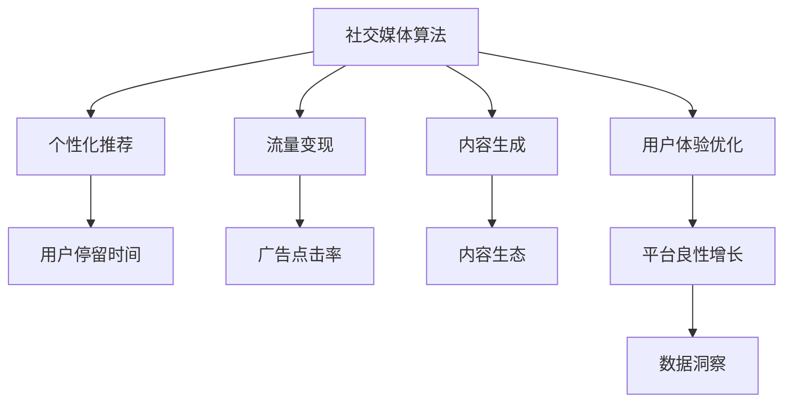

                 

## 1. 背景介绍

### 1.1 问题由来
随着互联网和社交媒体的蓬勃发展，注意力经济成为当前全球经济中最具活力和潜力的领域之一。注意力，即人们的注意力资源，是指人们花费在各种信息上的关注度。在互联网和社交媒体时代，注意力成为一种稀缺资源，如何有效地获取和利用用户注意力，成为各大互联网公司争夺的核心。

与此同时，社交媒体平台的大数据和算法技术不断发展，使得社交媒体算法成为获取和利用用户注意力的重要手段。社交媒体算法通过分析用户的行为数据和社交网络数据，精准推荐相关内容，最大化用户在该平台上的停留时间和互动频率，从而实现流量变现和用户增长。

### 1.2 问题核心关键点
社交媒体算法与注意力经济之间的共生关系，核心体现在以下几个方面：

1. **注意力获取与变现**：社交媒体算法通过个性化推荐，吸引用户注意，并基于广告、电商等形式变现。

2. **内容生成与消费**：用户注意力的投入，促进了内容生成和消费，形成了内容生态。

3. **平台优化与成长**：社交媒体算法不断优化推荐结果，提高用户体验，从而实现平台的良性增长。

4. **数据洞察与创新**：通过分析用户行为数据，社交媒体算法可以洞察用户需求和行为规律，推动产品创新。

理解这些关键点，有助于我们深入探讨社交媒体算法在注意力经济中的作用机制，以及未来发展趋势和面临的挑战。

## 2. 核心概念与联系

### 2.1 核心概念概述

社交媒体算法（Social Media Algorithm）是指在社交媒体平台上，用于分析和推荐内容、用户、广告等元素的算法系统。这些算法通常基于机器学习和深度学习技术，通过对用户行为数据和社交网络数据的分析，精准推荐相关内容，最大化用户在该平台上的互动频率和停留时间，从而实现流量变现和用户增长。

注意力经济（Attention Economy）是指在信息爆炸的时代，注意力成为一种稀缺资源，如何有效地获取和利用用户注意力，成为企业竞争的核心。社交媒体算法正是利用这种稀缺资源，实现内容变现和平台成长的算法。

注意力经济与社交媒体算法的共生关系，体现在以下几个方面：

1. **注意力获取**：社交媒体算法通过个性化推荐，吸引用户注意，并基于广告、电商等形式变现。

2. **内容生态**：用户注意力的投入，促进了内容生成和消费，形成了内容生态。

3. **平台优化**：社交媒体算法不断优化推荐结果，提高用户体验，从而实现平台的良性增长。

4. **数据洞察**：通过分析用户行为数据，社交媒体算法可以洞察用户需求和行为规律，推动产品创新。

这些核心概念之间的逻辑关系可以通过以下Mermaid流程图来展示：



这个流程图展示了社交媒体算法与注意力经济之间的关键联系：

1. 社交媒体算法通过个性化推荐，吸引用户注意（B）。
2. 通过广告（C）和电商（F）等方式变现流量。
3. 内容生成（D）受到用户注意力的推动，形成内容生态（H）。
4. 用户体验优化（E）提高用户留存和互动（I），实现平台良性增长。
5. 数据洞察（J）帮助社交媒体算法不断优化推荐结果。

## 3. 核心算法原理 & 具体操作步骤
### 3.1 算法原理概述

社交媒体算法的核心原理基于个性化推荐系统。其目标是通过分析用户的行为数据和社交网络数据，推荐与用户兴趣和需求相匹配的内容，从而最大化用户在该平台上的互动频率和停留时间。社交媒体算法的具体流程包括数据采集、用户画像构建、特征工程、模型训练和推荐输出等步骤。

社交媒体算法的核心思想是通过优化推荐结果，提高用户体验和互动频率，从而实现平台流量变现和用户增长。具体来说，社交媒体算法可以分为两大类：

1. **协同过滤算法**：通过分析用户的行为数据，找到与其兴趣相似的其他用户，从而推荐相似内容。

2. **内容推荐算法**：基于内容的特征，推荐与用户兴趣匹配的内容。

### 3.2 算法步骤详解

#### 3.2.1 数据采集

数据采集是社交媒体算法的第一步，通常包括用户行为数据（如浏览、点击、收藏等）和社交网络数据（如好友关系、社交图谱等）。

#### 3.2.2 用户画像构建

用户画像（User Profile）是社交媒体算法的核心，用于描述用户的兴趣和行为特征。常见的用户画像包括人口统计特征（如年龄、性别、职业等）、行为特征（如浏览记录、点赞内容等）和社交特征（如好友关系、社交网络图谱等）。

#### 3.2.3 特征工程

特征工程（Feature Engineering）是将原始数据转换为模型可以处理的特征的过程。常用的特征包括用户画像特征、内容特征、时间特征等。

#### 3.2.4 模型训练

模型训练（Model Training）是社交媒体算法的核心环节，通过机器学习或深度学习模型对用户行为数据和社交网络数据进行分析，生成推荐模型。常用的模型包括协同过滤模型、内容推荐模型、混合推荐模型等。

#### 3.2.5 推荐输出

推荐输出（Recommendation Output）是将模型生成的推荐结果呈现给用户的过程。常用的推荐方式包括展示在用户主界面、推送到用户邮箱、推送到用户手机等。

### 3.3 算法优缺点

社交媒体算法具有以下优点：

1. **个性化推荐**：通过分析用户行为和社交网络数据，推荐个性化内容，提高用户满意度。

2. **流量变现**：通过个性化推荐，增加用户互动频率和停留时间，实现广告和电商等流量变现。

3. **用户增长**：通过个性化推荐，吸引新用户，增加平台用户数量。

4. **内容生态**：促进内容生成和消费，形成内容生态，提升平台价值。

但社交媒体算法也存在一些缺点：

1. **数据隐私问题**：社交媒体算法需要大量用户数据，可能导致用户隐私泄露和数据滥用。

2. **推荐算法偏见**：社交媒体算法可能会基于数据偏见，导致推荐结果不公平，甚至产生歧视性内容。

3. **过拟合问题**：由于数据分布不均，社交媒体算法可能会过拟合于少数用户数据，导致推荐结果泛化性不足。

4. **用户体验风险**：过于个性化的推荐可能会降低用户体验，甚至导致用户流失。

### 3.4 算法应用领域

社交媒体算法已经在多个领域得到了广泛应用，包括：

1. **内容推荐**：如新闻、视频、文章等内容的个性化推荐。

2. **广告投放**：通过个性化推荐，精准投放广告，提升广告效果和转化率。

3. **电商推荐**：推荐用户感兴趣的商品，提升电商平台的销售量。

4. **社交网络**：通过个性化推荐，增加用户互动频率，提升社交平台的用户粘性。

5. **社交媒体营销**：通过个性化推荐，提升品牌曝光度和用户互动。

## 4. 数学模型和公式 & 详细讲解 & 举例说明

### 4.1 数学模型构建

社交媒体算法的核心模型是协同过滤和内容推荐模型。以协同过滤模型为例，假设用户对内容的评分矩阵为 $R \in \mathbb{R}^{m \times n}$，其中 $m$ 为用户数，$n$ 为内容数。假设用户 $i$ 对内容 $j$ 的评分记为 $r_{ij}$，则协同过滤模型的目标是最小化预测评分与实际评分的差异：

$$
\min_{\theta} \frac{1}{2} \sum_{i,j} (r_{ij} - \hat{r}_{ij})^2
$$

其中 $\hat{r}_{ij}$ 为模型预测的评分。

### 4.2 公式推导过程

以矩阵分解协同过滤为例，假设用户对内容的评分矩阵 $R$ 分解为用户矩阵 $U$ 和内容矩阵 $V$ 的乘积：

$$
R = U \times V
$$

其中 $U \in \mathbb{R}^{m \times k}$ 为用户矩阵，$V \in \mathbb{R}^{k \times n}$ 为内容矩阵，$k$ 为矩阵分解的维度。模型预测的评分 $\hat{r}_{ij}$ 可以表示为：

$$
\hat{r}_{ij} = u_i^T v_j
$$

其中 $u_i \in \mathbb{R}^{k}$ 为用户 $i$ 的向量表示，$v_j \in \mathbb{R}^{k}$ 为内容 $j$ 的向量表示。

### 4.3 案例分析与讲解

以Netflix推荐系统为例，Netflix通过分析用户的浏览和评分数据，使用矩阵分解协同过滤模型为用户推荐电影。Netflix将用户和电影的评分矩阵 $R$ 分解为用户矩阵 $U$ 和电影矩阵 $V$，通过预测评分 $\hat{r}_{ij}$ 推荐用户 $i$ 可能喜欢的电影 $j$。Netflix的推荐系统取得了显著的成功，用户满意度显著提升。

## 5. 项目实践：代码实例和详细解释说明
### 5.1 开发环境搭建

在进行社交媒体算法项目实践前，我们需要准备好开发环境。以下是使用Python进行PyTorch和TensorFlow开发的建议：

1. 安装Anaconda：从官网下载并安装Anaconda，用于创建独立的Python环境。

2. 创建并激活虚拟环境：
```bash
conda create -n pytorch-env python=3.8 
conda activate pytorch-env
```

3. 安装PyTorch：根据CUDA版本，从官网获取对应的安装命令。例如：
```bash
conda install pytorch torchvision torchaudio cudatoolkit=11.1 -c pytorch -c conda-forge
```

4. 安装TensorFlow：从官网下载并安装TensorFlow，并配置环境变量。

5. 安装各类工具包：
```bash
pip install numpy pandas scikit-learn matplotlib tqdm jupyter notebook ipython
```

完成上述步骤后，即可在`pytorch-env`环境中开始社交媒体算法项目的实践。

### 5.2 源代码详细实现

以下是使用PyTorch实现协同过滤模型的代码实现：

```python
import torch
from torch import nn
from torch.nn import Parameter
from torch.utils.data import DataLoader
from torch.utils.data import Dataset

class协同过滤模型(nn.Module):
    def __init__(self, m, n, k):
        super(协同过滤模型, self).__init__()
        self.U = nn.Parameter(torch.randn(m, k))
        self.V = nn.Parameter(torch.randn(n, k))
    
    def forward(self, u_idx, v_idx):
        u = self.U[u_idx]
        v = self.V[v_idx]
        return u @ v

    def predict(self, u_idx, v_idx):
        with torch.no_grad():
            return self.forward(u_idx, v_idx)

# 创建数据集
class推荐数据集(Dataset):
    def __init__(self, users, items, ratings):
        self.users = users
        self.items = items
        self.ratings = ratings
    
    def __len__(self):
        return len(self.users)
    
    def __getitem__(self, item):
        user_idx = self.users[item]
        item_idx = self.items[item]
        rating = self.ratings[item]
        return user_idx, item_idx, rating

# 创建数据加载器
train_dataset = 推荐数据集(train_users, train_items, train_ratings)
test_dataset = 推荐数据集(test_users, test_items, test_ratings)

train_loader = DataLoader(train_dataset, batch_size=32, shuffle=True)
test_loader = DataLoader(test_dataset, batch_size=32, shuffle=False)

# 创建模型
model = 协同过滤模型(m, n, k)

# 定义损失函数和优化器
criterion = nn.MSELoss()
optimizer = torch.optim.Adam(model.parameters(), lr=0.01)

# 训练模型
for epoch in range(epochs):
    for user_idx, item_idx, rating in train_loader:
        optimizer.zero_grad()
        output = model(user_idx, item_idx)
        loss = criterion(output, rating)
        loss.backward()
        optimizer.step()
        
    if (epoch + 1) % 10 == 0:
        print(f"Epoch {epoch+1}, train loss: {loss.item()}")

# 评估模型
with torch.no_grad():
    correct = 0
    total = 0
    for user_idx, item_idx, rating in test_loader:
        output = model(user_idx, item_idx)
        _, predicted = torch.max(output, 1)
        total += ratings.size(0)
        correct += (predicted == rating).sum().item()

    print(f"Test Accuracy of the model on the 10000 test samples: {correct}/{total}")
```

以上代码实现了基于矩阵分解的协同过滤模型，并使用PyTorch框架进行训练和评估。在实际应用中，可以通过调整模型的超参数、优化器参数等来进一步提升模型效果。

### 5.3 代码解读与分析

让我们再详细解读一下关键代码的实现细节：

**协同过滤模型类**：
- `__init__`方法：初始化用户矩阵 $U$ 和内容矩阵 $V$。
- `forward`方法：计算预测评分。
- `predict`方法：在预测模式下进行前向传播计算。

**推荐数据集类**：
- `__init__`方法：初始化用户、物品和评分数据。
- `__len__`方法：返回数据集的样本数量。
- `__getitem__`方法：对单个样本进行处理，返回用户索引、物品索引和评分。

**数据加载器**：
- 使用PyTorch的数据加载器，对训练集和测试集进行批次化加载。

**模型训练**：
- 在每个epoch内，对训练集数据进行循环迭代。
- 在前向传播计算输出，计算损失函数，反向传播更新模型参数。
- 周期性在验证集上评估模型性能。

**模型评估**：
- 在测试集上计算模型准确率，并打印输出。

可以看到，PyTorch框架为社交媒体算法的实现提供了强大的工具支持，大大简化了模型的开发过程。开发者可以更加专注于算法的设计和优化，而不必过多关注底层实现细节。

## 6. 实际应用场景

### 6.1 智能推荐系统

智能推荐系统是社交媒体算法的重要应用场景。通过个性化推荐，智能推荐系统能够精准推荐用户感兴趣的商品、文章、视频等内容，提升用户体验和满意度。例如，亚马逊的推荐系统能够根据用户浏览和购买记录，推荐相似商品，提升销售量。

### 6.2 社交网络推荐

社交网络推荐是社交媒体算法的另一重要应用场景。通过个性化推荐，社交网络能够增加用户互动频率，提升平台的用户粘性和活跃度。例如，Facebook的推荐系统能够根据用户的点赞和评论记录，推荐好友动态，增加用户停留时间和互动频率。

### 6.3 广告投放

社交媒体算法的广告投放应用场景，通过个性化推荐，精准投放广告，提升广告效果和转化率。例如，Google的AdSense广告系统能够根据用户的搜索行为和浏览记录，推荐相关广告，提高广告点击率和转化率。

### 6.4 未来应用展望

随着社交媒体算法和大数据技术的不断发展，未来的应用场景将更加广泛和深入。社交媒体算法将在以下方面得到更广泛的应用：

1. **个性化推荐系统**：通过更加精细化的用户画像和内容画像，提供更加精准和个性化的推荐。

2. **广告智能投放**：通过优化推荐模型，实现更加精准的广告投放，提高广告效果和转化率。

3. **内容生产与分发**：通过社交媒体算法分析用户行为，推动内容生产与分发，促进内容生态发展。

4. **社交网络优化**：通过社交媒体算法优化社交网络推荐，增加用户互动频率和平台粘性。

5. **用户情感分析**：通过社交媒体算法分析用户情感，及时响应用户需求和反馈，提升用户体验。

## 7. 工具和资源推荐

### 7.1 学习资源推荐

为了帮助开发者系统掌握社交媒体算法的理论基础和实践技巧，这里推荐一些优质的学习资源：

1. 《推荐系统》课程：斯坦福大学开设的推荐系统课程，涵盖推荐算法、数据处理、模型优化等内容，适合初学者入门。

2. 《深度学习与推荐系统》书籍：深度学习领域的经典书籍，涵盖推荐系统的各种算法和技术，适合进阶学习。

3. Coursera推荐系统专项课程：由斯坦福大学和DeepLearning.AI联合开设的专项课程，包含多个推荐系统主题，适合系统学习。

4. Kaggle推荐系统竞赛：通过参加Kaggle的推荐系统竞赛，实战训练推荐算法，提升实战能力。

5. HuggingFace官方文档：Transformers库的官方文档，提供了丰富的社交媒体算法示例和代码，适合实践学习。

通过对这些资源的学习实践，相信你一定能够快速掌握社交媒体算法的精髓，并用于解决实际的推荐问题。

### 7.2 开发工具推荐

高效的开发离不开优秀的工具支持。以下是几款用于社交媒体算法开发的常用工具：

1. PyTorch：基于Python的开源深度学习框架，灵活动态的计算图，适合快速迭代研究。

2. TensorFlow：由Google主导开发的开源深度学习框架，生产部署方便，适合大规模工程应用。

3. Weights & Biases：模型训练的实验跟踪工具，可以记录和可视化模型训练过程中的各项指标，方便对比和调优。

4. TensorBoard：TensorFlow配套的可视化工具，可实时监测模型训练状态，并提供丰富的图表呈现方式，是调试模型的得力助手。

5. Jupyter Notebook：交互式Python编程环境，适合数据处理、模型训练和实验验证。

合理利用这些工具，可以显著提升社交媒体算法的开发效率，加快创新迭代的步伐。

### 7.3 相关论文推荐

社交媒体算法和大数据技术的发展源于学界的持续研究。以下是几篇奠基性的相关论文，推荐阅读：

1. 《协同过滤推荐算法》：经典推荐算法，通过用户行为数据和物品行为数据构建推荐模型。

2. 《深度学习推荐系统》：使用深度学习技术，构建更加复杂和高效的推荐模型。

3. 《基于社交网络的无监督推荐》：利用社交网络数据，优化推荐模型，提升推荐效果。

4. 《个性化推荐系统的公平性研究》：研究推荐系统的公平性和偏见问题，推动推荐系统的伦理性发展。

5. 《社交媒体广告推荐系统的建模与优化》：研究社交媒体广告推荐系统的建模方法和优化技术，提升广告效果和转化率。

这些论文代表了大数据和社交媒体算法的进展，通过学习这些前沿成果，可以帮助研究者把握学科前进方向，激发更多的创新灵感。

## 8. 总结：未来发展趋势与挑战

### 8.1 总结

本文对基于社交媒体算法的注意力经济进行了全面系统的介绍。首先阐述了社交媒体算法与注意力经济之间的共生关系，明确了社交媒体算法在注意力获取、内容推荐、平台优化和数据洞察等方面的核心作用。其次，从原理到实践，详细讲解了社交媒体算法的数学模型、算法步骤和应用场景，给出了社交媒体算法的完整代码实现。同时，本文还广泛探讨了社交媒体算法在智能推荐、社交网络推荐、广告投放等领域的广泛应用，展示了社交媒体算法在大数据时代的重要价值。

通过本文的系统梳理，可以看到，社交媒体算法和大数据技术正在成为全球互联网经济的重要引擎，极大地拓展了信息获取和利用的方式，推动了各行业的数字化转型。未来，伴随社交媒体算法和大数据技术的不断演进，相信社交媒体算法将在更多领域得到应用，为信息经济的发展注入新的动力。

### 8.2 未来发展趋势

展望未来，社交媒体算法将呈现以下几个发展趋势：

1. **个性化推荐优化**：通过更精细化的用户画像和内容画像，提供更加精准和个性化的推荐。

2. **多模态数据融合**：融合文本、图像、视频等多模态数据，提升推荐模型的表现力和泛化能力。

3. **联邦学习与隐私保护**：通过联邦学习等技术，保护用户隐私，提升推荐模型的公平性和安全性。

4. **实时推荐与动态优化**：通过实时推荐和动态优化，提升用户体验和互动频率。

5. **跨平台推荐**：通过跨平台推荐，实现多平台之间的数据共享和协同推荐，提升推荐效果。

6. **推荐系统的伦理与公平性**：研究推荐系统的公平性、偏见和伦理性，推动推荐系统的健康发展。

以上趋势凸显了社交媒体算法和大数据技术的广阔前景。这些方向的探索发展，必将进一步提升推荐系统的效果和应用范围，为信息经济的发展注入新的动力。

### 8.3 面临的挑战

尽管社交媒体算法和大数据技术已经取得了瞩目成就，但在迈向更加智能化、普适化应用的过程中，它仍面临着诸多挑战：

1. **数据隐私问题**：社交媒体算法需要大量用户数据，可能导致用户隐私泄露和数据滥用。如何保护用户隐私，避免数据滥用，将是未来的重要课题。

2. **算法偏见与公平性**：社交媒体算法可能会基于数据偏见，导致推荐结果不公平，甚至产生歧视性内容。如何消除算法偏见，提升推荐公平性，还需要更多的理论和技术支持。

3. **推荐模型泛化性**：由于数据分布不均，社交媒体算法可能会过拟合于少数用户数据，导致推荐结果泛化性不足。如何提升推荐模型的泛化能力，是一个亟待解决的问题。

4. **用户体验风险**：过于个性化的推荐可能会降低用户体验，甚至导致用户流失。如何在个性化推荐和用户体验之间找到平衡，是未来的重要课题。

5. **计算资源瓶颈**：大规模推荐系统需要强大的计算资源支持，如何优化算法，降低计算复杂度，提高推荐效率，是一个重要的研究方向。

6. **跨平台协同**：跨平台推荐需要解决数据格式、接口、隐私保护等问题，实现多平台之间的数据共享和协同推荐，还需要更多的技术支持和标准规范。

正视社交媒体算法和大数据技术面临的这些挑战，积极应对并寻求突破，将是社交媒体算法和大数据技术走向成熟的必由之路。相信随着学界和产业界的共同努力，这些挑战终将一一被克服，社交媒体算法和大数据技术必将在信息经济中发挥更大的作用。

### 8.4 研究展望

面对社交媒体算法和大数据技术面临的种种挑战，未来的研究需要在以下几个方面寻求新的突破：

1. **多模态数据融合**：融合文本、图像、视频等多模态数据，提升推荐模型的表现力和泛化能力。

2. **联邦学习与隐私保护**：通过联邦学习等技术，保护用户隐私，提升推荐模型的公平性和安全性。

3. **实时推荐与动态优化**：通过实时推荐和动态优化，提升用户体验和互动频率。

4. **跨平台推荐**：通过跨平台推荐，实现多平台之间的数据共享和协同推荐，提升推荐效果。

5. **推荐系统的伦理与公平性**：研究推荐系统的公平性、偏见和伦理性，推动推荐系统的健康发展。

6. **推荐系统的可解释性**：研究推荐系统的可解释性，提升用户信任和系统透明度。

这些研究方向的探索，必将引领社交媒体算法和大数据技术迈向更高的台阶，为信息经济的发展注入新的动力。面向未来，社交媒体算法和大数据技术还需要与其他人工智能技术进行更深入的融合，如知识表示、因果推理、强化学习等，多路径协同发力，共同推动信息经济的进步。

## 9. 附录：常见问题与解答

**Q1：社交媒体算法是否适用于所有NLP任务？**

A: 社交媒体算法主要应用于推荐系统，涵盖推荐用户、推荐物品、推荐广告等内容推荐。对于其他NLP任务，如问答系统、情感分析、命名实体识别等，通常需要采用其他专门的算法和模型。但社交媒体算法的一些基本思想，如个性化推荐、协同过滤等，可以在其他任务中得到应用。

**Q2：如何缓解社交媒体算法的过拟合问题？**

A: 缓解社交媒体算法的过拟合问题，可以采取以下措施：

1. 数据增强：通过回译、近义替换等方式扩充训练集。

2. 正则化：使用L2正则、Dropout等正则化技术，避免过拟合。

3. 对抗训练：引入对抗样本，提高模型鲁棒性。

4. 参数高效微调：只调整少量参数，减少过拟合风险。

5. 多模型集成：训练多个模型，取平均输出，抑制过拟合。

这些策略往往需要根据具体任务和数据特点进行灵活组合。只有在数据、模型、训练、推理等各环节进行全面优化，才能最大限度地发挥社交媒体算法的威力。

**Q3：社交媒体算法的推荐效果如何衡量？**

A: 社交媒体算法的推荐效果可以通过以下指标进行衡量：

1. 精确率（Precision）：推荐的相关物品中，用户实际喜欢的物品占比。

2. 召回率（Recall）：推荐的相关物品中，实际喜欢的物品占所有相关物品的比例。

3. F1分数（F1 Score）：精确率和召回率的调和平均数，综合评估推荐效果。

4. AUC值（Area Under Curve）：ROC曲线下的面积，评估模型的分类性能。

5. 点击率（Click-Through Rate, CTR）：用户点击推荐物品的比例。

这些指标可以帮助开发者评估推荐模型的效果，并进行优化。

**Q4：社交媒体算法在落地部署时需要注意哪些问题？**

A: 将社交媒体算法转化为实际应用，还需要考虑以下问题：

1. 模型裁剪：去除不必要的层和参数，减小模型尺寸，加快推理速度。

2. 量化加速：将浮点模型转为定点模型，压缩存储空间，提高计算效率。

3. 服务化封装：将模型封装为标准化服务接口，便于集成调用。

4. 弹性伸缩：根据请求流量动态调整资源配置，平衡服务质量和成本。

5. 监控告警：实时采集系统指标，设置异常告警阈值，确保服务稳定性。

6. 安全防护：采用访问鉴权、数据脱敏等措施，保障数据和模型安全。

社交媒体算法和大数据技术在落地应用过程中，需要综合考虑模型性能、服务质量、用户体验等多个因素，确保算法的实际效果和应用价值。

---

作者：禅与计算机程序设计艺术 / Zen and the Art of Computer Programming

