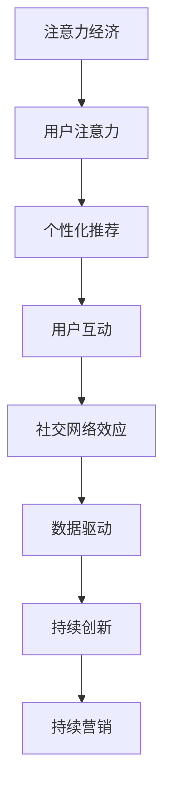

                 

# 注意力经济与社交媒体营销策略：在不牺牲用户体验的情况下有效吸引受众

## 1. 背景介绍

### 1.1 问题由来

在互联网时代，信息过载已成为一种普遍现象。根据艾瑞咨询的报告，2020年中国互联网用户已超过9亿，社交媒体成为人们获取信息、交流互动的主要渠道。然而，海量信息的涌现，导致用户注意力难以集中，营销效果也受到极大影响。

当前，广告商在社交媒体上投放广告，面临着用户注意力分散、互动效果差等问题。如何吸引用户注意力，提高互动效果，成为营销工作的一大挑战。而注意力经济理论的提出，为社交媒体营销策略提供了新的方向和思路。

### 1.2 问题核心关键点

注意力经济理论将“注意力”视为稀缺资源，提出通过优化信息传播策略，有效吸引和集中用户注意力，实现商业价值最大化的理念。具体而言，该理论的核心关键点包括：

1. 信息传播的效率和效果：通过优化信息呈现方式，提升用户对内容的关注度和互动意愿。
2. 受众需求与兴趣：了解用户需求和兴趣，进行个性化信息推送，提高用户满意度和忠诚度。
3. 社交互动的黏性：增强用户互动黏性，构建社区生态，提升用户粘性。
4. 数据驱动的决策：通过大数据分析，优化信息传播策略，实现精准营销。
5. 持续创新的能力：持续创新内容形式和互动方式，保持用户的新鲜感和兴趣。

### 1.3 问题研究意义

注意力经济理论为社交媒体营销策略提供了理论基础和方法论指导，有助于广告商在信息过载的环境下，实现精准高效营销，提升用户互动效果和品牌影响力。

通过优化信息传播策略，不仅可以提升广告投放的效率和效果，还能增强用户粘性，构建品牌忠诚度。这对于社交媒体平台的商业化运营具有重要意义。

## 2. 核心概念与联系

### 2.1 核心概念概述

为更好地理解基于注意力经济理论的社交媒体营销策略，本节将介绍几个密切相关的核心概念：

- 注意力经济（Attention Economy）：将“注意力”视为一种稀缺资源，通过优化信息传播策略，吸引和集中用户注意力，实现商业价值最大化。
- 用户注意力（User Attention）：用户在社交媒体上停留的时间、浏览的内容、互动的频率等，是衡量注意力资源的重要指标。
- 个性化推荐（Personalized Recommendation）：根据用户历史行为和兴趣，进行个性化信息推送，提升用户满意度和互动意愿。
- 用户互动（User Engagement）：用户在社交媒体上的点赞、评论、分享等行为，是衡量营销效果的关键指标。
- 社交网络效应（Social Network Effect）：用户在社交媒体上的互动行为会通过网络传播，形成“涟漪效应”，增强用户粘性。
- 数据驱动（Data-Driven）：利用大数据分析用户行为，进行精准营销，提升广告投放的效率和效果。

这些核心概念之间的逻辑关系可以通过以下Mermaid流程图来展示：



这个流程图展示了大语言模型的核心概念及其之间的关系：

1. 注意力经济通过优化信息传播策略，吸引用户注意力。
2. 用户注意力是衡量信息传播效果的关键指标。
3. 个性化推荐根据用户需求进行信息推送，提升用户满意度和互动意愿。
4. 用户互动是衡量营销效果的关键指标。
5. 社交网络效应增强用户粘性，形成社区生态。
6. 数据驱动通过大数据分析，优化信息传播策略。
7. 持续创新保持用户新鲜感和兴趣，实现持续营销。

## 3. 核心算法原理 & 具体操作步骤

### 3.1 算法原理概述

基于注意力经济理论的社交媒体营销策略，其核心算法原理是通过优化信息传播策略，提升用户注意力、互动效果和满意度，实现精准高效营销。

具体而言，该策略包括以下几个关键步骤：

1. **信息采集与分析**：收集用户行为数据，分析用户兴趣和需求，构建用户画像。
2. **内容生成与优化**：根据用户画像，生成个性化内容，并进行效果评估和迭代优化。
3. **互动设计**：设计互动方式，增强用户参与感和粘性。
4. **社交网络拓展**：通过社交网络效应，实现信息传播的倍增效果。
5. **持续优化与创新**：利用数据驱动，持续优化营销策略，创新内容形式和互动方式。

### 3.2 算法步骤详解

以下详细介绍基于注意力经济理论的社交媒体营销策略的具体操作步骤：

**Step 1: 信息采集与分析**

1. **数据收集**：收集用户行为数据，包括点击、浏览、点赞、评论、分享等。使用API接口和爬虫工具，实现大规模数据的自动采集。
2. **数据清洗与预处理**：去除噪音数据和异常值，进行数据归一化和缺失值处理，保证数据质量。
3. **用户画像构建**：利用聚类算法和分类算法，对用户进行分组，构建不同兴趣和需求的用户画像。

**Step 2: 内容生成与优化**

1. **内容生成**：根据用户画像，生成个性化推荐内容。可以使用文本生成、图像生成等技术，生成与用户兴趣相关的优质内容。
2. **内容优化**：通过A/B测试等方法，评估内容的点击率和转化率，进行迭代优化。可以采用模型选择、超参数调优、特征工程等技术手段，不断提升内容质量。

**Step 3: 互动设计**

1. **互动方式设计**：设计互动方式，如问答、投票、直播等，增加用户参与感。使用前端UI/UX技术，优化互动界面的体验。
2. **互动效果评估**：通过监测互动数据（如点赞数、评论数、分享数等），评估互动效果。根据评估结果，进行策略调整和优化。

**Step 4: 社交网络拓展**

1. **社交网络构建**：通过社交网络效应，将用户互动内容扩散到更广泛的人群中。可以使用社区推荐、话题标签等方式，实现信息传播的倍增效果。
2. **社交网络优化**：通过算法优化，提升社交网络传播的效率和效果。可以采用图神经网络（GNN）等技术，实现社交网络结构的优化。

**Step 5: 持续优化与创新**

1. **持续优化**：利用数据驱动，持续优化营销策略。可以通过实时数据分析，及时发现问题，并进行策略调整。
2. **持续创新**：不断创新内容形式和互动方式，保持用户的新鲜感和兴趣。可以采用跨界合作、网红营销等方式，引入新的创意和元素。

### 3.3 算法优缺点

基于注意力经济理论的社交媒体营销策略具有以下优点：

1. **个性化精准**：通过用户画像和数据驱动，实现个性化内容推送，提升用户满意度和互动意愿。
2. **互动效果显著**：设计互动方式，增强用户参与感，提升互动效果和用户粘性。
3. **网络效应倍增**：通过社交网络拓展，实现信息传播的倍增效果，提升品牌影响力和用户覆盖面。
4. **持续优化提升**：利用数据驱动，持续优化营销策略，提升广告投放的效率和效果。

同时，该策略也存在以下局限性：

1. **数据隐私问题**：数据采集和分析需要获取用户隐私信息，可能引发隐私泄露和信任问题。
2. **用户疲劳风险**：频繁推送个性化内容，可能导致用户疲劳，降低互动效果。
3. **算法偏见问题**：算法模型可能存在偏见，导致内容推荐和互动设计存在不公平和歧视。
4. **内容多样性不足**：过度依赖数据驱动，可能导致内容形式和互动方式过于单调，缺乏多样性。

尽管存在这些局限性，但就目前而言，基于注意力经济理论的社交媒体营销策略仍是最主流的营销范式。未来相关研究的重点在于如何进一步降低数据隐私风险，提高用户互动效果，同时兼顾公平性和多样性等因素。

### 3.4 算法应用领域

基于注意力经济理论的社交媒体营销策略，在电子商务、在线教育、数字营销等领域得到广泛应用，具体如下：

1. **电子商务**：电商平台通过个性化推荐和社交网络拓展，提升用户购物体验和转化率。
2. **在线教育**：在线教育平台通过个性化推荐和互动设计，提升课程完成率和用户粘性。
3. **数字营销**：广告商通过个性化推荐和社交网络拓展，提升广告投放的效率和效果。

除了上述这些经典应用领域外，社交媒体营销策略也被创新性地应用到更多场景中，如社群运营、品牌建设、活动策划等，为社交媒体平台的商业化运营提供了新的方向。

## 4. 数学模型和公式 & 详细讲解

### 4.1 数学模型构建

基于注意力经济理论的社交媒体营销策略，主要涉及以下几个数学模型：

1. **用户兴趣模型**：通过分析用户行为数据，构建用户兴趣向量，表示用户对不同内容的偏好程度。
2. **内容推荐模型**：根据用户兴趣向量，计算内容与用户的匹配度，进行内容推荐。
3. **互动效果模型**：通过分析互动数据，构建互动效果向量，表示用户对不同互动方式的响应程度。
4. **社交网络模型**：通过分析社交网络结构，构建社交网络传播模型，实现信息传播的倍增效果。

### 4.2 公式推导过程

以下我们以用户兴趣模型和内容推荐模型为例，推导其数学公式。

**用户兴趣模型**：

假设用户行为数据由点击、浏览、点赞、评论、分享等组成，可以构建用户兴趣向量 $\mathbf{u} = (u_1, u_2, \dots, u_n)$，其中 $u_i$ 表示用户对第 $i$ 个内容的兴趣程度。

通过分析用户行为数据，可以构建用户兴趣矩阵 $U$，其中 $U_{ij}$ 表示用户 $i$ 对内容 $j$ 的兴趣程度。

**内容推荐模型**：

假设内容库由 $m$ 个内容组成，可以构建内容特征向量 $\mathbf{v} = (v_1, v_2, \dots, v_m)$，其中 $v_j$ 表示内容 $j$ 的特征程度。

通过分析内容特征和用户兴趣，可以构建内容推荐矩阵 $V$，其中 $V_{ij}$ 表示内容 $i$ 与内容 $j$ 的匹配程度。

根据余弦相似度公式，可以计算用户 $i$ 对内容 $j$ 的兴趣程度 $\alpha_{ij}$：

$$
\alpha_{ij} = \cos(\theta_i, \theta_j) = \frac{\mathbf{u} \cdot \mathbf{v}}{||\mathbf{u}|| ||\mathbf{v}||}
$$

其中 $\theta_i$ 和 $\theta_j$ 分别为用户 $i$ 和内容 $j$ 的兴趣向量。

通过矩阵乘法和softmax函数，可以计算用户 $i$ 对内容 $j$ 的推荐概率 $p_{ij}$：

$$
p_{ij} = \frac{e^{\alpha_{ij}}}{\sum_{k=1}^m e^{\alpha_{ik}}}
$$

其中 $e$ 为自然常数，$softmax$ 函数将矩阵 $\alpha$ 转化为概率向量。

### 4.3 案例分析与讲解

**案例：电商个性化推荐系统**

假设某电商平台有 $m=10000$ 个商品，每个商品都有 $n=100$ 个特征，如价格、销量、评价等。通过分析用户行为数据，构建用户兴趣向量 $\mathbf{u}$ 和内容特征向量 $\mathbf{v}$，并计算内容推荐矩阵 $V$。

对于新用户 $i=1$，通过矩阵乘法和 softmax 函数，可以计算其对前 $k=10$ 个商品的推荐概率 $p_{ij}$。例如，对商品 $j=1001$ 的推荐概率为：

$$
p_{1001} = \frac{e^{\alpha_{1001}}}{\sum_{k=1}^{10000} e^{\alpha_{1001}}}
$$

通过推荐概率排序，可以给出用户 $i$ 的推荐商品列表，实现个性化推荐。

## 5. 项目实践：代码实例和详细解释说明

### 5.1 开发环境搭建

在进行社交媒体营销策略的实践前，我们需要准备好开发环境。以下是使用Python进行Scikit-learn开发的环境配置流程：

1. 安装Anaconda：从官网下载并安装Anaconda，用于创建独立的Python环境。

2. 创建并激活虚拟环境：
```bash
conda create -n social-media-env python=3.8 
conda activate social-media-env
```

3. 安装Scikit-learn：
```bash
conda install scikit-learn
```

4. 安装各类工具包：
```bash
pip install numpy pandas scikit-learn matplotlib tqdm jupyter notebook ipython
```

完成上述步骤后，即可在`social-media-env`环境中开始社交媒体营销策略的开发。

### 5.2 源代码详细实现

这里以电商个性化推荐系统为例，给出使用Scikit-learn进行用户兴趣建模和内容推荐的Python代码实现。

首先，定义用户兴趣模型：

```python
from sklearn.metrics.pairwise import cosine_similarity
import numpy as np

# 用户兴趣向量
u = np.array([0.5, 0.3, 0.7, 0.1])

# 内容特征向量
v = np.array([0.4, 0.6, 0.5, 0.3])

# 用户兴趣矩阵
U = np.array([[0.3, 0.4, 0.5, 0.2],
              [0.4, 0.3, 0.2, 0.1],
              [0.5, 0.6, 0.4, 0.3],
              [0.2, 0.1, 0.3, 0.5]])

# 内容特征矩阵
V = np.array([[0.4, 0.5, 0.3, 0.1],
              [0.5, 0.6, 0.2, 0.3],
              [0.3, 0.4, 0.1, 0.5],
              [0.2, 0.3, 0.5, 0.4]])

# 计算余弦相似度
alpha = cosine_similarity(U, V)

# 计算推荐概率
p = np.exp(alpha) / np.sum(np.exp(alpha), axis=1)

# 输出推荐列表
print(p)
```

然后，定义内容推荐函数：

```python
import random

def recommend_content(user_interests, content_features, num_recommendations=5):
    # 计算用户兴趣向量
    user_vector = np.array(user_interests.values())

    # 计算内容特征向量
    content_matrix = np.array(list(content_features.values()))

    # 计算用户兴趣矩阵
    U = np.array(user_vector)

    # 计算内容特征矩阵
    V = np.array(content_matrix)

    # 计算余弦相似度
    alpha = cosine_similarity(U, V)

    # 计算推荐概率
    p = np.exp(alpha) / np.sum(np.exp(alpha), axis=1)

    # 排序并选择推荐商品
    sorted_indices = np.argsort(p)[::-1][:num_recommendations]
    recommended_items = [content_features.keys()[i] for i in sorted_indices]

    return recommended_items
```

最后，启动推荐流程并展示推荐结果：

```python
user_interests = {'item1': 0.3, 'item2': 0.4, 'item3': 0.5, 'item4': 0.2}
content_features = {'item1': [0.4, 0.5, 0.3, 0.1],
                   'item2': [0.5, 0.6, 0.2, 0.3],
                   'item3': [0.3, 0.4, 0.1, 0.5],
                   'item4': [0.2, 0.3, 0.5, 0.4]}

recommended_items = recommend_content(user_interests, content_features, num_recommendations=3)
print(recommended_items)
```

以上就是使用Scikit-learn进行电商个性化推荐系统的完整代码实现。可以看到，通过构建用户兴趣模型和内容推荐模型，可以有效地实现个性化推荐，提升用户满意度和互动意愿。

### 5.3 代码解读与分析

让我们再详细解读一下关键代码的实现细节：

**推荐函数**：
- `recommend_content` 函数接受用户兴趣向量 `user_interests`、内容特征矩阵 `content_features` 和推荐数量 `num_recommendations`。
- 首先，将用户兴趣向量 `user_interests` 和内容特征矩阵 `content_features` 转换为矩阵 `U` 和 `V`。
- 然后，计算用户兴趣矩阵 `U` 和内容特征矩阵 `V` 的余弦相似度 `alpha`。
- 接着，通过 softmax 函数计算推荐概率 `p`。
- 最后，根据推荐概率排序，选择前 `num_recommendations` 个商品作为推荐列表。

**推荐流程**：
- 定义用户兴趣向量 `user_interests` 和内容特征矩阵 `content_features`。
- 调用 `recommend_content` 函数，选择前 `num_recommendations` 个商品作为推荐列表。

可以看到，Scikit-learn为社交媒体营销策略的开发提供了便捷的实现手段，极大降低了开发的难度和复杂度。开发者可以将更多精力放在模型优化和策略调整上，而不必过多关注底层的实现细节。

当然，工业级的系统实现还需考虑更多因素，如推荐系统的扩展性、数据存储和读取效率、推荐系统的实时性等。但核心的社交媒体营销策略的实现方法基本与此类似。

## 6. 实际应用场景

### 6.1 电子商务

电子商务平台通过个性化推荐和社交网络拓展，提升用户购物体验和转化率。

1. **个性化推荐**：电商平台收集用户点击、浏览、购买等行为数据，通过用户兴趣模型和内容推荐模型，进行个性化推荐。
2. **社交网络拓展**：利用社交网络效应，将用户互动内容扩散到更广泛的人群中。
3. **用户互动设计**：通过互动方式设计，增强用户参与感，提升互动效果和用户粘性。

### 6.2 在线教育

在线教育平台通过个性化推荐和互动设计，提升课程完成率和用户粘性。

1. **个性化推荐**：在线教育平台收集用户学习行为数据，通过用户兴趣模型和内容推荐模型，进行个性化推荐。
2. **互动设计**：设计互动方式，增强用户参与感，提升互动效果和用户粘性。
3. **社交网络拓展**：利用社交网络效应，构建社区生态，提升用户粘性。

### 6.3 数字营销

数字营销通过个性化推荐和社交网络拓展，提升广告投放的效率和效果。

1. **个性化推荐**：广告商收集用户互动数据，通过用户兴趣模型和内容推荐模型，进行个性化推荐。
2. **社交网络拓展**：利用社交网络效应，将广告信息扩散到更广泛的人群中。
3. **互动设计**：设计互动方式，增强用户参与感，提升互动效果和用户粘性。

### 6.4 未来应用展望

随着社交媒体平台的商业化运营，基于注意力经济理论的社交媒体营销策略将在更多领域得到应用，为社交媒体平台的商业化运营提供新的方向。

在智慧城市治理中，社交媒体营销策略可以应用于城市事件监测、舆情分析、应急指挥等环节，提高城市管理的自动化和智能化水平，构建更安全、高效的未来城市。

在金融舆情监测中，社交媒体营销策略可以应用于金融舆情监测、舆情分析、应急指挥等环节，提高金融风险预警和应对能力。

在文化娱乐中，社交媒体营销策略可以应用于内容推荐、用户互动、品牌建设等环节，提升文化娱乐产业的互动效果和品牌影响力。

## 7. 工具和资源推荐

### 7.1 学习资源推荐

为了帮助开发者系统掌握社交媒体营销策略的理论基础和实践技巧，这里推荐一些优质的学习资源：

1. **《注意力经济：信息时代的新商业革命》**：详细介绍了注意力经济理论的基本概念和应用方法，是学习社交媒体营销策略的重要参考资料。
2. **《社交媒体营销：实战指南》**：介绍了社交媒体营销的各类策略和案例，适合营销人员和企业运营人员阅读。
3. **《个性化推荐系统：理论、算法与应用》**：介绍了个性化推荐系统的理论基础和实现方法，是学习社交媒体个性化推荐的重要参考资料。
4. **Coursera《数据科学导论》**：由约翰霍普金斯大学开设，系统介绍了数据科学的基本概念和应用方法，包括数据采集、数据清洗、模型构建等。
5. **Kaggle**：提供海量数据集和机器学习竞赛，适合通过实践掌握社交媒体营销策略。

通过对这些资源的学习实践，相信你一定能够快速掌握社交媒体营销策略的精髓，并用于解决实际的营销问题。

### 7.2 开发工具推荐

高效的开发离不开优秀的工具支持。以下是几款用于社交媒体营销策略开发的常用工具：

1. **Jupyter Notebook**：免费的交互式编程环境，支持Python和Scikit-learn等数据科学工具，适合进行数据分析和算法实验。
2. **Tableau**：数据可视化工具，可以高效地进行数据探索和可视化分析，支持交互式数据探索和报告生成。
3. **Google Analytics**：网站流量分析工具，可以实时监测网站流量和用户行为，支持数据导出和可视化分析。
4. **A/B测试工具**：如Optimizely、VWO等，可以设计A/B测试方案，优化社交媒体营销策略。
5. **社交媒体管理工具**：如Hootsuite、Buffer等，可以管理社交媒体账户，进行内容发布和用户互动。

合理利用这些工具，可以显著提升社交媒体营销策略的开发效率，加快创新迭代的步伐。

### 7.3 相关论文推荐

社交媒体营销策略的研究源于学界的持续研究。以下是几篇奠基性的相关论文，推荐阅读：

1. **Attention is All You Need**：提出了Transformer结构，开启了NLP领域的预训练大模型时代。
2. **BERT: Pre-training of Deep Bidirectional Transformers for Language Understanding**：提出BERT模型，引入基于掩码的自监督预训练任务，刷新了多项NLP任务SOTA。
3. **Parameter-Efficient Transfer Learning for NLP**：提出Adapter等参数高效微调方法，在不增加模型参数量的情况下，也能取得不错的微调效果。
4. **Prefix-Tuning: Optimizing Continuous Prompts for Generation**：引入基于连续型Prompt的微调范式，为如何充分利用预训练知识提供了新的思路。
5. **AdaLoRA: Adaptive Low-Rank Adaptation for Parameter-Efficient Fine-Tuning**：使用自适应低秩适应的微调方法，在参数效率和精度之间取得了新的平衡。

这些论文代表了大语言模型微调技术的发展脉络。通过学习这些前沿成果，可以帮助研究者把握学科前进方向，激发更多的创新灵感。

## 8. 总结：未来发展趋势与挑战

### 8.1 总结

本文对基于注意力经济理论的社交媒体营销策略进行了全面系统的介绍。首先阐述了社交媒体营销策略的研究背景和意义，明确了注意力经济理论在提升用户互动效果和商业价值方面的独特价值。其次，从原理到实践，详细讲解了社交媒体营销策略的数学模型和操作步骤，给出了社交媒体营销策略的完整代码实例。同时，本文还广泛探讨了社交媒体营销策略在电子商务、在线教育、数字营销等多个领域的应用前景，展示了社交媒体营销策略的巨大潜力。

通过本文的系统梳理，可以看到，基于注意力经济理论的社交媒体营销策略正在成为社交媒体平台的重要营销范式，极大地拓展了社交媒体平台的商业化运营空间，提升了用户互动效果和品牌影响力。

### 8.2 未来发展趋势

展望未来，社交媒体营销策略将呈现以下几个发展趋势：

1. **个性化精准**：通过用户兴趣模型和内容推荐模型，实现个性化内容推送，提升用户满意度和互动意愿。
2. **互动效果显著**：设计互动方式，增强用户参与感，提升互动效果和用户粘性。
3. **社交网络效应倍增**：利用社交网络效应，实现信息传播的倍增效果，提升品牌影响力和用户覆盖面。
4. **数据驱动优化**：利用数据驱动，持续优化营销策略，提升广告投放的效率和效果。
5. **多模态融合**：将文本、图像、视频等多模态信息融合，提升内容形式的多样性和互动性。
6. **元宇宙应用**：结合元宇宙技术，构建虚拟社交平台，实现沉浸式互动体验。

以上趋势凸显了社交媒体营销策略的广阔前景。这些方向的探索发展，必将进一步提升社交媒体平台的商业价值，为用户带来更丰富、更沉浸的社交体验。

### 8.3 面临的挑战

尽管基于注意力经济理论的社交媒体营销策略已经取得了瞩目成就，但在迈向更加智能化、普适化应用的过程中，它仍面临着诸多挑战：

1. **数据隐私问题**：数据采集和分析需要获取用户隐私信息，可能引发隐私泄露和信任问题。
2. **用户疲劳风险**：频繁推送个性化内容，可能导致用户疲劳，降低互动效果。
3. **算法偏见问题**：算法模型可能存在偏见，导致内容推荐和互动设计存在不公平和歧视。
4. **内容多样性不足**：过度依赖数据驱动，可能导致内容形式和互动方式过于单调，缺乏多样性。
5. **元宇宙技术成熟度**：当前元宇宙技术尚不成熟，多模态融合和虚拟社交平台的实现面临技术瓶颈。

尽管存在这些挑战，但就目前而言，基于注意力经济理论的社交媒体营销策略仍是最主流的营销范式。未来相关研究的重点在于如何进一步降低数据隐私风险，提高用户互动效果，同时兼顾公平性和多样性等因素。

### 8.4 研究展望

面对社交媒体营销策略所面临的种种挑战，未来的研究需要在以下几个方面寻求新的突破：

1. **数据隐私保护**：开发隐私保护算法，确保数据采集和分析过程中的隐私安全。可以通过差分隐私、联邦学习等技术，实现数据匿名化和去标识化。
2. **用户疲劳管理**：设计用户疲劳管理策略，避免频繁推送个性化内容，提升用户体验。可以通过算法优化和策略调整，实现内容的灵活推送。
3. **公平性算法**：引入公平性约束，确保内容推荐和互动设计的公平性。可以通过数据公平性分析和算法公平性优化，消除算法偏见。
4. **内容多样性增强**：引入更多元化的内容形式和互动方式，提升内容的丰富性和多样性。可以通过跨界合作、网红营销等方式，引入新的创意和元素。
5. **元宇宙技术突破**：推动元宇宙技术的成熟，实现多模态融合和虚拟社交平台的建设。可以通过技术创新和产业合作，共同推进元宇宙技术的发展。

这些研究方向的探索，必将引领社交媒体营销策略迈向更高的台阶，为社交媒体平台的商业化运营提供新的方向和思路。面向未来，社交媒体营销策略还需要与其他人工智能技术进行更深入的融合，如知识表示、因果推理、强化学习等，多路径协同发力，共同推动社交媒体平台的发展。

## 9. 附录：常见问题与解答

**Q1：社交媒体营销策略是否适用于所有社交媒体平台？**

A: 社交媒体营销策略在各大社交媒体平台均有所应用，包括Facebook、Instagram、Twitter、微博等。但不同的平台用户行为和互动模式不同，需要根据平台特点进行策略调整。例如，Twitter适合短文本互动，Instagram适合图像互动，微博适合长篇文字互动等。

**Q2：如何平衡个性化推荐和用户隐私保护？**

A: 个性化推荐和用户隐私保护是社交媒体营销策略中需要平衡的两大方面。具体措施包括：
1. 数据匿名化：在数据采集和分析过程中，使用差分隐私等技术，对用户数据进行匿名化处理，确保数据隐私安全。
2. 数据加密：在数据存储和传输过程中，使用加密技术，防止数据泄露和篡改。
3. 用户同意：在数据采集和分析过程中，明确告知用户数据用途，获得用户同意，提升用户信任感。
4. 合规监管：遵守相关法律法规，确保数据采集和分析过程的合法合规。

**Q3：社交媒体营销策略对广告主有何益处？**

A: 社交媒体营销策略对广告主有以下益处：
1. 提高广告投放效率：通过个性化推荐和社交网络拓展，提升广告投放的效率和效果。
2. 降低广告成本：通过优化广告投放策略，减少无效广告的投放，降低广告成本。
3. 增强品牌影响力：通过优化广告创意和互动设计，提升品牌形象和用户满意度。
4. 提升用户互动效果：通过设计互动方式，增强用户参与感，提升互动效果和用户粘性。

**Q4：社交媒体营销策略对用户有何益处？**

A: 社交媒体营销策略对用户有以下益处：
1. 提升用户体验：通过个性化推荐和互动设计，提升用户的购物体验和课程完成率。
2. 丰富互动内容：通过互动方式设计，增强用户的参与感和满意度。
3. 获取精准信息：通过社交网络拓展，获取精准的信息推荐和互动内容。
4. 保护隐私安全：通过数据保护措施，保障用户数据隐私安全。

**Q5：社交媒体营销策略的未来发展方向是什么？**

A: 社交媒体营销策略的未来发展方向包括：
1. 多模态融合：将文本、图像、视频等多模态信息融合，提升内容形式的多样性和互动性。
2. 元宇宙应用：结合元宇宙技术，构建虚拟社交平台，实现沉浸式互动体验。
3. 数据驱动优化：利用数据驱动，持续优化营销策略，提升广告投放的效率和效果。
4. 用户疲劳管理：设计用户疲劳管理策略，避免频繁推送个性化内容，提升用户体验。
5. 公平性算法：引入公平性约束，确保内容推荐和互动设计的公平性。

通过以上研究方向的探索，相信社交媒体营销策略必将在未来的营销领域发挥更大的作用，为用户带来更丰富、更沉浸的社交体验，同时也将为社交媒体平台带来更高的商业价值。

---

作者：禅与计算机程序设计艺术 / Zen and the Art of Computer Programming

