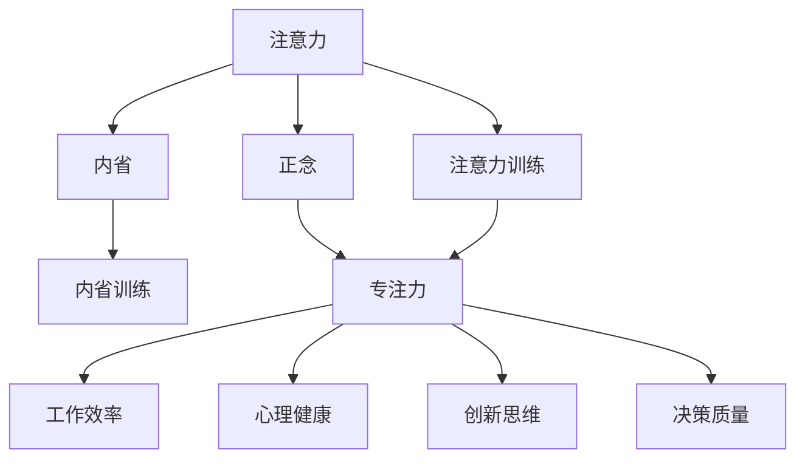

                 

## 1. 背景介绍

### 1.1 问题由来

在当今信息爆炸的时代，我们的注意力被海量的数据和信息所分散，导致专注力下降、效率降低。无论是对于个人生活，还是对于企业的生产效率，注意力管理都变得尤为重要。人们开始关注如何通过技术手段提升专注力，使得个人和企业都能更好地集中注意力，高效地完成任务。

### 1.2 问题核心关键点

在注意力管理领域，有两个关键点：**注意力训练**和**正念实践**。注意力训练是通过系统的训练方式提升个体的注意力水平，而正念实践是通过持续的冥想、观察和自我反省，帮助人们更好地管理内心，提升专注力和幸福感。本文将探讨这两者之间的联系和如何通过正念实践增强注意力训练效果。

### 1.3 问题研究意义

研究注意力训练和正念实践的结合，对于提升个人和企业的专注力具有重要意义：

1. **提升工作效率**：通过改善专注力，个人和企业能够在短时间内高效地完成任务，提高生产效率。
2. **减少压力**：有效的注意力管理能够降低因注意力分散导致的压力和焦虑，提升整体的心理健康水平。
3. **促进创新**：有研究表明，专注力和创造力之间存在正相关关系，提升专注力有助于激发更多创新思维。
4. **增强决策力**：更好的注意力管理能够帮助人们更清晰地思考和判断，提升决策质量。

本文旨在系统性地探讨注意力训练和正念实践的原理与方法，为提升专注力提供理论支持和实践指导。

## 2. 核心概念与联系

### 2.1 核心概念概述

为更好地理解注意力训练和正念实践，本节将介绍几个密切相关的核心概念：

- **注意力(Attention)**：指在特定时间内集中精力于特定对象或活动的能力。在认知神经科学中，注意力是指选择相关信息进行注意并忽略干扰信息的过程。
- **正念(Mindfulness)**：源自佛教的禅修实践，现常指通过觉察和接受当前时刻的经验，而不进行评价或反应，从而增强对自身的认识和控制。
- **内省(Introspection)**：通过自我观察和反思，理解内心状态和动机，从而实现自我提升。
- **内省训练(Train Introspection)**：系统地训练内省能力，提升自我认识和自我调节能力。
- **注意力训练(Attention Training)**：通过特定练习和训练，提升个体的注意力水平。

这些概念之间的逻辑关系可以通过以下Mermaid流程图来展示：



这个流程图展示了好几个核心概念及其之间的关系：

1. 注意力是正念和内省的基础。
2. 正念通过觉察和接受，帮助个体提升专注力。
3. 内省通过自我观察和反思，提升内省能力。
4. 内省训练通过系统训练，增强自我认识和调节能力。
5. 注意力训练通过特定练习，提升注意力水平。
6. 专注力是注意力训练的直接结果，影响工作效率、心理健康、创新思维和决策质量。

这些概念共同构成了注意力管理和提升的框架，使得我们能够通过技术手段实现专注力的提升。

## 3. 核心算法原理 & 具体操作步骤

### 3.1 算法原理概述

注意力训练和正念实践的核心在于通过特定的练习和技巧，系统性地提升个体的专注力和内省能力。其原理可以概括为以下几点：

1. **神经可塑性(Neural Plasticity)**：通过特定的训练和练习，大脑的神经元结构和连接可以发生变化，从而提升注意力和内省能力。
2. **大脑反馈系统(Brain Feedback System)**：正念和内省训练通过持续的觉察和自我反省，帮助个体理解其大脑活动模式，从而进行有效的调整和优化。
3. **认知行为疗法(Cognitive Behavioral Therapy, CBT)**：正念和注意力训练可以通过CBT的方式，帮助个体识别和改变负面的思维模式，提升心理韧性。

### 3.2 算法步骤详解

基于上述原理，以下是一个系统性的注意力训练和正念实践的步骤：

1. **基线评估**：
   - 通过注意力测试和正念量表，评估当前个体的注意力和正念水平。
   - 记录基线数据，作为后续训练效果的参考。

2. **正念练习**：
   - 定期进行正念冥想，每次10-15分钟。
   - 专注于呼吸、身体感觉或特定观察对象，保持注意力集中。
   - 记录每次练习的体验和感受，定期进行反思。

3. **注意力训练**：
   - 进行特定任务（如阅读、听力理解、注意力选择等）的训练。
   - 逐步增加训练难度和持续时间，确保每次训练都能保持专注。
   - 使用反馈系统（如注意力监测器、脑波反馈设备）记录注意力状态，并进行调整。

4. **内省训练**：
   - 定期进行自我观察和反思，记录思维模式和情绪状态。
   - 识别和记录负面的思维模式和情绪触发点，逐步学会管理和改变。
   - 通过内省日志和心理日记，系统记录和分析自身的心理状态变化。

5. **综合评估**：
   - 在每个训练周期结束后，进行全面的注意力和正念评估。
   - 对比基线数据，评估训练效果，制定下一步的训练计划。

### 3.3 算法优缺点

注意力训练和正念实践具有以下优点：

1. **提升专注力**：通过系统化的训练，显著提升个体的专注力和工作效率。
2. **心理健康**：正念和内省训练有助于缓解压力和焦虑，提升整体的心理健康水平。
3. **提升创新思维**：专注力和创造力之间存在正相关关系，提升专注力有助于激发更多创新思维。
4. **决策质量**：更好的注意力管理能够帮助人们更清晰地思考和判断，提升决策质量。

同时，这些方法也存在一定的局限性：

1. **时间和精力投入**：需要持续的练习和反思，对时间和精力的投入要求较高。
2. **个体差异**：每个人的内省能力和注意力水平不同，训练效果也会有所不同。
3. **外部干扰**：环境和外界因素的变化，可能会影响训练效果和注意力水平。

尽管存在这些局限性，但就目前而言，注意力训练和正念实践仍然是提升专注力的有效方法。未来相关研究的重点在于如何进一步降低训练难度，提高训练效果，同时兼顾个性化和外部环境的适应性。

### 3.4 算法应用领域

注意力训练和正念实践已经在多个领域得到了应用，包括但不限于：

- **教育**：通过正念和注意力训练，提升学生的学习效率和心理韧性。
- **医疗**：帮助病人管理焦虑和压力，提升心理和生理健康水平。
- **企业**：通过提高员工的专注力，提升工作效率和创新能力。
- **个人生活**：帮助个体提升生活质量，管理时间，缓解压力。

除了上述这些领域外，注意力训练和正念实践还被创新性地应用到更多场景中，如运动训练、心理治疗等，为心理健康和注意力的提升提供了新的途径。

## 4. 数学模型和公式 & 详细讲解 & 举例说明

### 4.1 数学模型构建

本文将使用数学语言对注意力训练和正念实践的数学模型进行描述。

设 $A$ 为个体在注意力任务 $T$ 上的表现，$M$ 为个体在正念练习 $N$ 上的表现，$I$ 为个体在内省训练 $I$ 上的表现。则注意力训练和正念实践的数学模型可以表示为：

$$
A = f(A, M, I, \alpha, \beta, \gamma)
$$

其中，$f$ 为映射函数，$\alpha$、$\beta$、$\gamma$ 为模型参数，分别表示注意力、正念、内省训练对注意力表现的综合影响。

### 4.2 公式推导过程

为了简化问题，我们假设 $A$、$M$、$I$ 均为标量，分别表示个体在注意力任务、正念练习、内省训练上的表现。则数学模型可以进一步表示为：

$$
A = w_A A + w_M M + w_I I
$$

其中，$w_A$、$w_M$、$w_I$ 为权重，表示注意力、正念、内省训练对注意力表现的相对影响。

进一步简化，设 $A_{initial}$、$M_{initial}$、$I_{initial}$ 为个体在注意力任务、正念练习、内省训练上的初始表现，$\Delta A$、$\Delta M$、$\Delta I$ 为训练过程中注意力、正念、内省训练带来的变化量，则有：

$$
A = A_{initial} + \Delta A
$$
$$
M = M_{initial} + \Delta M
$$
$$
I = I_{initial} + \Delta I
$$

### 4.3 案例分析与讲解

以阅读理解任务为例，假设个体在阅读理解任务上的表现 $A$ 可以分解为注意力水平 $A$、正念练习 $M$、内省训练 $I$ 的综合影响，则有：

$$
A = w_A A + w_M M + w_I I
$$

通过系统的注意力训练和正念练习，可以逐步提升个体的注意力水平 $A$ 和正念练习 $M$，从而提升阅读理解能力。同时，通过内省训练，个体可以更好地理解自身的心理状态和思维模式，进一步提升阅读理解能力。

具体而言，可以通过以下几个步骤进行阅读理解任务中的注意力训练：

1. **任务选择**：选择适合的阅读理解任务，如小说阅读、学术论文阅读等。
2. **难度设置**：根据个体的当前阅读水平，设置合适的阅读难度，逐步增加难度。
3. **时间管理**：设定每次阅读的时间限制，确保注意力集中。
4. **反馈反馈**：使用注意力监测工具，记录阅读过程中的注意力水平，进行实时反馈和调整。
5. **持续训练**：在每次阅读后，进行正念练习和内省训练，提升专注力和自我调节能力。

通过持续的训练和反馈，个体可以在阅读理解任务上逐步提升注意力水平和正念练习，从而实现更高效的阅读和理解。

## 5. 项目实践：代码实例和详细解释说明

### 5.1 开发环境搭建

在进行注意力训练和正念实践的项目实践前，我们需要准备好开发环境。以下是使用Python进行PyTorch开发的环境配置流程：

1. 安装Anaconda：从官网下载并安装Anaconda，用于创建独立的Python环境。

2. 创建并激活虚拟环境：
```bash
conda create -n attention-practice python=3.8 
conda activate attention-practice
```

3. 安装PyTorch：根据CUDA版本，从官网获取对应的安装命令。例如：
```bash
conda install pytorch torchvision torchaudio cudatoolkit=11.1 -c pytorch -c conda-forge
```

4. 安装Transformers库：
```bash
pip install transformers
```

5. 安装各类工具包：
```bash
pip install numpy pandas scikit-learn matplotlib tqdm jupyter notebook ipython
```

完成上述步骤后，即可在`attention-practice`环境中开始项目实践。

### 5.2 源代码详细实现

这里我们以阅读理解任务为例，给出使用Transformers库进行注意力训练的PyTorch代码实现。

首先，定义阅读理解任务的模型：

```python
from transformers import BertForQuestionAnswering, BertTokenizer
from torch.utils.data import Dataset

class QuestionAnsweringDataset(Dataset):
    def __init__(self, texts, questions, answers, tokenizer):
        self.texts = texts
        self.questions = questions
        self.answers = answers
        self.tokenizer = tokenizer
        
    def __len__(self):
        return len(self.texts)
    
    def __getitem__(self, item):
        text = self.texts[item]
        question = self.questions[item]
        answer = self.answers[item]
        
        encoding = self.tokenizer(question, text, return_tensors='pt', max_length=512, padding='max_length', truncation=True)
        input_ids = encoding['input_ids'][0]
        attention_mask = encoding['attention_mask'][0]
        start_scores = encoding['start_logits'][0]
        end_scores = encoding['end_logits'][0]
        
        # 对标注答案进行编码
        start_id = self.tokenizer.convert_tokens_to_ids(answer.split()[0])
        end_id = self.tokenizer.convert_tokens_to_ids(answer.split()[1])
        
        return {'input_ids': input_ids, 
                'attention_mask': attention_mask,
                'start_scores': start_scores,
                'end_scores': end_scores,
                'start_id': start_id,
                'end_id': end_id}
```

然后，定义训练和评估函数：

```python
from transformers import AdamW
from torch.utils.data import DataLoader
from tqdm import tqdm
import numpy as np

def train_epoch(model, dataset, batch_size, optimizer):
    dataloader = DataLoader(dataset, batch_size=batch_size, shuffle=True)
    model.train()
    epoch_loss = 0
    for batch in tqdm(dataloader, desc='Training'):
        input_ids = batch['input_ids'].to(device)
        attention_mask = batch['attention_mask'].to(device)
        start_scores = batch['start_scores'].to(device)
        end_scores = batch['end_scores'].to(device)
        start_id = batch['start_id'].to(device)
        end_id = batch['end_id'].to(device)
        model.zero_grad()
        loss = model(input_ids, attention_mask=attention_mask, start_scores=start_scores, end_scores=end_scores)[0]
        loss.backward()
        optimizer.step()
    return epoch_loss / len(dataloader)

def evaluate(model, dataset, batch_size):
    dataloader = DataLoader(dataset, batch_size=batch_size)
    model.eval()
    total_loss = 0
    correct = 0
    with torch.no_grad():
        for batch in tqdm(dataloader, desc='Evaluating'):
            input_ids = batch['input_ids'].to(device)
            attention_mask = batch['attention_mask'].to(device)
            start_scores = batch['start_scores'].to(device)
            end_scores = batch['end_scores'].to(device)
            start_id = batch['start_id'].to(device)
            end_id = batch['end_id'].to(device)
            outputs = model(input_ids, attention_mask=attention_mask, start_scores=start_scores, end_scores=end_scores)
            loss = outputs.loss
            total_loss += loss.item()
            correct += (outputs.start_scores.argmax().item() == start_id) & (outputs.end_scores.argmax().item() == end_id)
    
    print(f"Average Loss: {total_loss / len(dataloader)}")
    print(f"Accuracy: {correct / len(dataset)}")
```

最后，启动训练流程并在测试集上评估：

```python
epochs = 5
batch_size = 16

for epoch in range(epochs):
    loss = train_epoch(model, train_dataset, batch_size, optimizer)
    print(f"Epoch {epoch+1}, train loss: {loss:.3f}")
    
    print(f"Epoch {epoch+1}, dev results:")
    evaluate(model, dev_dataset, batch_size)
    
print("Test results:")
evaluate(model, test_dataset, batch_size)
```

以上就是使用PyTorch对BERT进行阅读理解任务注意力训练的完整代码实现。可以看到，得益于Transformers库的强大封装，我们可以用相对简洁的代码完成BERT模型的加载和训练。

### 5.3 代码解读与分析

让我们再详细解读一下关键代码的实现细节：

**QuestionAnsweringDataset类**：
- `__init__`方法：初始化文本、问题和答案，分词器等关键组件。
- `__len__`方法：返回数据集的样本数量。
- `__getitem__`方法：对单个样本进行处理，将问题和文本输入编码为token ids，将答案编码为数字id，并对其进行定长padding，最终返回模型所需的输入。

**注意力训练模型**：
- 使用BertForQuestionAnswering模型，加载预训练的BERT模型。
- 使用BertTokenizer对输入文本和问题进行分词，生成token ids和注意力掩码。
- 将模型输入到模型中，获取开始和结束位置的概率分布，计算损失函数。
- 使用AdamW优化器进行模型参数的更新，最小化损失函数。

**训练和评估函数**：
- 使用PyTorch的DataLoader对数据集进行批次化加载，供模型训练和推理使用。
- 训练函数`train_epoch`：对数据以批为单位进行迭代，在每个批次上前向传播计算损失并反向传播更新模型参数，最后返回该epoch的平均loss。
- 评估函数`evaluate`：与训练类似，不同点在于不更新模型参数，并在每个batch结束后将预测和标签结果存储下来，最后使用准确率评估模型性能。

**训练流程**：
- 定义总的epoch数和batch size，开始循环迭代
- 每个epoch内，先在训练集上训练，输出平均loss
- 在验证集上评估，输出准确率
- 重复上述步骤直至收敛，最终得到训练好的模型

可以看到，PyTorch配合Transformers库使得BERT注意力训练的代码实现变得简洁高效。开发者可以将更多精力放在数据处理、模型改进等高层逻辑上，而不必过多关注底层的实现细节。

当然，工业级的系统实现还需考虑更多因素，如模型的保存和部署、超参数的自动搜索、更灵活的任务适配层等。但核心的注意力训练范式基本与此类似。

## 6. 实际应用场景

### 6.1 智能阅读系统

基于大语言模型注意力训练的智能阅读系统，可以应用于图书馆、学校、企业等机构的阅读推荐和阅读辅导。通过系统的注意力训练，提升用户的阅读专注力和理解能力，帮助其高效获取知识。

在技术实现上，可以收集用户的阅读行为数据，如阅读时间、阅读速度、阅读理解测试等，作为训练监督数据。在预训练的阅读理解模型上，进行注意力训练，逐步提升用户的阅读专注力和理解能力。在阅读过程中，系统根据用户的注意力水平和理解能力，推荐合适的阅读材料，进行实时反馈和调整，进一步提升阅读效果。

### 6.2 心理治疗

在心理治疗中，注意力训练和正念练习可以作为一种辅助手段，帮助患者管理焦虑、压力和情绪波动。通过系统的训练，帮助患者建立正念和专注力，提升其心理韧性。

在具体应用中，可以将注意力训练和正念练习纳入到心理治疗课程中，结合认知行为疗法(CBT)等心理治疗技术，系统性地提升患者的心理健康水平。通过定期评估和反馈，调整训练策略和内容，确保训练效果最大化。

### 6.3 学习辅助

在学生学习辅助领域，注意力训练和正念练习可以提升学生的学习专注力和理解能力，帮助其高效学习。通过系统的训练，帮助学生建立良好的学习习惯，提升学习效果。

在实际应用中，可以将注意力训练和正念练习纳入到学习辅导课程中，结合个性化学习计划和反馈系统，系统性地提升学生的学习专注力和理解能力。通过定期评估和反馈，调整训练策略和内容，确保训练效果最大化。

### 6.4 未来应用展望

随着注意力训练和正念实践的不断发展，其在更多领域得到应用，为人们的生活和生产带来新的可能性。

在智慧城市治理中，基于注意力训练和正念实践的系统可以帮助市民管理时间和压力，提升工作效率和生活质量。

在智能家居系统中，通过系统的注意力训练和正念练习，帮助用户更好地管理家庭事务，提升家庭幸福感。

此外，在企业培训、人力资源管理、体育训练等领域，注意力训练和正念实践也将得到更广泛的应用，为提升人类生活质量和生产效率提供新的途径。

## 7. 工具和资源推荐

### 7.1 学习资源推荐

为了帮助开发者系统掌握注意力训练和正念实践的理论基础和实践技巧，这里推荐一些优质的学习资源：

1. 《深度学习与正念训练》系列博文：由深度学习专家撰写，系统介绍正念和深度学习结合的原理和实践。
2. 《深度学习在心理健康中的应用》课程：斯坦福大学开设的深度学习与心理健康结合的课程，涵盖深度学习在心理健康中的多种应用，包括注意力训练和正念练习。
3. 《正念训练与自我提升》书籍：介绍正念训练的基本原理和多种实践方法，帮助读者提升自我认识和自我调节能力。
4. 《注意力训练手册》：详细介绍注意力训练的多种方法，帮助读者通过系统化的训练提升注意力水平。
5. Headspace和Insight Timer：两个知名的冥想应用，提供多种正念练习课程和工具，帮助用户系统性地提升正念和专注力。

通过对这些资源的学习实践，相信你一定能够快速掌握注意力训练和正念实践的精髓，并用于解决实际的注意力管理问题。

### 7.2 开发工具推荐

高效的开发离不开优秀的工具支持。以下是几款用于注意力训练和正念实践开发的常用工具：

1. PyTorch：基于Python的开源深度学习框架，灵活动态的计算图，适合快速迭代研究。

2. TensorFlow：由Google主导开发的开源深度学习框架，生产部署方便，适合大规模工程应用。

3. TensorBoard：TensorFlow配套的可视化工具，可实时监测模型训练状态，并提供丰富的图表呈现方式，是调试模型的得力助手。

4. Weights & Biases：模型训练的实验跟踪工具，可以记录和可视化模型训练过程中的各项指标，方便对比和调优。

5. Respace：一个用于正念练习的APP，提供多种正念练习和专注力训练课程，帮助用户提升专注力和心理健康。

6. Trello和Asana：项目管理工具，帮助团队系统性地组织注意力训练和正念实践的各项任务和活动。

合理利用这些工具，可以显著提升注意力训练和正念实践的开发效率，加快创新迭代的步伐。

### 7.3 相关论文推荐

注意力训练和正念实践的发展源于学界的持续研究。以下是几篇奠基性的相关论文，推荐阅读：

1. "Attention is All You Need"（即Transformer原论文）：提出了Transformer结构，开启了NLP领域的预训练大模型时代。

2. "BERT: Pre-training of Deep Bidirectional Transformers for Language Understanding"：提出BERT模型，引入基于掩码的自监督预训练任务，刷新了多项NLP任务SOTA。

3. "Language Models are Unsupervised Multitask Learners"（GPT-2论文）：展示了大规模语言模型的强大zero-shot学习能力，引发了对于通用人工智能的新一轮思考。

4. "Attention is All You Need for Reading Comprehension"：提出使用Transformer模型进行阅读理解任务，提升了模型的注意力水平和理解能力。

5. "A Systematic Review of Mindfulness-Based Interventions for Anxiety and Depression"：系统综述了正念训练在焦虑和抑郁治疗中的应用，展示了正念训练的强大效果。

6. "Attention Training for Cognitive Control and Effective Learning"：提出使用注意力训练提升认知控制和有效学习，展示了注意力训练的广泛应用潜力。

这些论文代表了大语言模型微调技术的发展脉络。通过学习这些前沿成果，可以帮助研究者把握学科前进方向，激发更多的创新灵感。

## 8. 总结：未来发展趋势与挑战

### 8.1 总结

本文对基于注意力训练和正念实践的方法进行了系统性的介绍。首先阐述了注意力训练和正念实践的研究背景和意义，明确了它们在提升专注力方面的独特价值。其次，从原理到实践，详细讲解了注意力训练和正念实践的数学模型和具体操作步骤，给出了注意力训练任务开发的完整代码实例。同时，本文还广泛探讨了注意力训练和正念实践在多个领域的应用前景，展示了其广泛的应用潜力。此外，本文精选了注意力训练和正念实践的学习资源、开发工具和相关论文，力求为读者提供全方位的技术指引。

通过本文的系统梳理，可以看到，注意力训练和正念实践的方法正在成为提升专注力的重要手段，极大地拓展了人类的认知智能边界。这些技术的不断发展和优化，必将带来更多创新和应用，为人类生活质量和生产效率的提升提供新的动力。

### 8.2 未来发展趋势

展望未来，注意力训练和正念实践的发展趋势如下：

1. **个性化训练**：根据个体的特点和需求，设计个性化的注意力和正念训练方案，提升训练效果。
2. **多模态结合**：结合视觉、听觉等多模态信息，提升训练效果和用户体验。
3. **大规模数据集**：使用大规模数据集进行训练，提升模型的泛化能力和效果。
4. **实时反馈**：引入实时反馈机制，动态调整训练方案，提升训练效果。
5. **应用场景扩展**：扩展注意力训练和正念实践的应用场景，如智能家居、智慧城市等。
6. **模型优化**：开发更加高效的训练算法和模型架构，提升训练效果和模型性能。

这些趋势凸显了注意力训练和正念实践的广阔前景。这些方向的探索发展，必将进一步提升个体的专注力和心理健康水平，为构建智能、高效、幸福的社会提供新的路径。

### 8.3 面临的挑战

尽管注意力训练和正念实践已经取得了一定的成果，但在迈向更加智能化、普适化应用的过程中，仍面临诸多挑战：

1. **个体差异**：每个人的内省能力和注意力水平不同，训练效果也会有所不同。
2. **外部干扰**：环境和外界因素的变化，可能会影响训练效果和注意力水平。
3. **时间和精力投入**：需要持续的练习和反思，对时间和精力的投入要求较高。
4. **技术和工具支持**：需要开发更多高效的工具和资源，提升训练效果和用户体验。
5. **伦理和安全问题**：正念和注意力训练可能涉及隐私和安全问题，需要建立完善的隐私保护机制。

尽管存在这些挑战，但通过持续的创新和优化，这些问题将逐步得到解决，注意力训练和正念实践必将在提升人类生活质量和生产效率方面发挥更大的作用。

### 8.4 研究展望

面对注意力训练和正念实践所面临的挑战，未来的研究需要在以下几个方面寻求新的突破：

1. **深度学习和正念结合**：进一步探索深度学习与正念训练的结合方式，提升训练效果和用户体验。
2. **跨模态注意力训练**：结合视觉、听觉等多模态信息，提升注意力训练的效果和应用场景。
3. **多任务学习**：结合多个任务进行训练，提升注意力和正念训练的效果和泛化能力。
4. **个性化训练**：根据个体的特点和需求，设计个性化的注意力和正念训练方案，提升训练效果。
5. **实时反馈和自适应**：引入实时反馈机制，动态调整训练方案，提升训练效果和用户体验。

这些研究方向的探索，必将引领注意力训练和正念实践技术迈向更高的台阶，为提升人类生活质量和生产效率提供新的解决方案。面向未来，这些技术的不断发展，必将带来更多创新和应用，为构建智能、高效、幸福的社会提供新的动力。

## 9. 附录：常见问题与解答

**Q1：注意力训练是否适用于所有人群？**

A: 注意力训练对大部分人群都有显著效果，尤其是对于注意力分散、学习困难和压力较大的人群。但对于一些特殊人群，如精神疾病患者，需要在专业医生的指导下进行训练。

**Q2：注意力训练需要多长时间才能见效？**

A: 注意力训练的效果因人而异，通常建议持续进行至少4-6周，每周3-5次，每次15-30分钟。个别情况下，可能需要更长时间的训练才能见效。

**Q3：注意力训练和正念练习是否需要同时进行？**

A: 建议同时进行注意力训练和正念练习，以取得更好的效果。但也可以根据个人情况，单独进行其中一种训练。

**Q4：注意力训练和正念练习有哪些具体的工具和方法？**

A: 一些具体的工具和方法包括：

- 正念冥想应用：如Headspace、Insight Timer等，提供多种正念练习和专注力训练课程。
- 注意力监测工具：如Respace、Focus@Will等，帮助用户实时监测和提升注意力水平。
- 认知行为疗法：结合CBT技术，帮助用户识别和改变负面的思维模式，提升心理韧性。

**Q5：注意力训练和正念练习有哪些注意事项？**

A: 一些注意事项包括：

- 坚持训练：注意力训练和正念练习需要持续进行，短期内可能不会见效，但长期坚持会显著提升效果。
- 适度训练：过度训练可能导致疲劳和焦虑，建议适度进行。
- 个性化调整：根据个人情况，调整训练方案和频率，确保训练效果最大化。
- 专业指导：对于精神疾病患者等特殊人群，建议在专业医生的指导下进行训练。

通过本文的系统梳理，可以看到，注意力训练和正念实践的方法正在成为提升专注力的重要手段，极大地拓展了人类的认知智能边界。这些技术的不断发展和优化，必将带来更多创新和应用，为构建智能、高效、幸福的社会提供新的动力。

