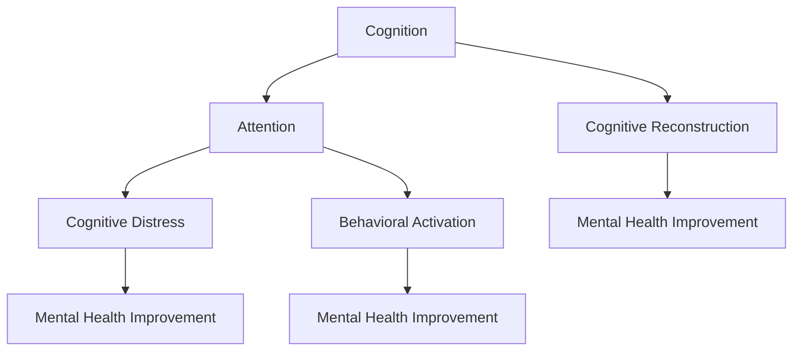

                 

# 注意力训练与认知疗法实践：通过专注力改善心理健康和幸福感

## 1. 背景介绍

### 1.1 问题由来
在现代快节奏的生活和工作环境中，人们面临着前所未有的心理压力和挑战。焦虑、抑郁、压力过大、注意力不集中等问题已变得愈发普遍，严重影响了人们的心理健康和幸福感。面对这些问题，传统的心理疗法和药物疗法往往效果有限，难以满足日益增长的需求。

为了寻求更好的解决方案，认知疗法和注意力训练逐渐受到了关注。认知疗法通过改变个体的思维模式和行为方式，帮助其应对情绪和行为问题。注意力训练则通过特定的练习和技巧，提升个体的专注力和注意力，从而增强其心理韧性和应对能力。

### 1.2 问题核心关键点
认知疗法和注意力训练的核心在于改变个体的认知结构和行为模式，提升其心理弹性和自我调节能力。具体来说：

- **认知疗法**：通过引导个体识别和改变负面的思维模式，帮助其建立更加积极、合理的认知结构。常用的技术包括认知重构、行为激活等。
- **注意力训练**：通过针对性的练习和技巧，提升个体的专注力、注意力和认知控制能力。常用的技术包括冥想、正念练习、集中注意练习等。

这些方法在实践中的效果已有大量研究证实，特别是在改善心理健康和幸福感方面具有显著优势。本文将深入探讨认知疗法和注意力训练的原理、具体操作步骤，并结合实际案例进行详细讲解。

## 2. 核心概念与联系

### 2.1 核心概念概述

为了更好地理解认知疗法和注意力训练的工作原理，我们需要先介绍一些核心概念：

- **认知**：指个体对于信息的加工和处理过程，包括感知、记忆、思考、决策等。
- **注意力**：指个体对于外界信息的集中和聚焦能力，包括选择性注意、持续注意、转移注意等。
- **认知失调**：指个体当前的心理状态与其认知结构之间的不一致，导致情绪和行为问题。
- **正念**：指个体对当前时刻的觉察和接受，包括接受自身的情绪、感受、身体状态等。
- **认知重构**：通过改变个体的思维模式，减少认知失调，建立更积极的认知结构。
- **行为激活**：通过改变个体行为，提升其积极情绪和心理状态，增强其应对能力。

这些概念之间的逻辑关系可以通过以下Mermaid流程图来展示：



这个流程图展示了认知和注意力之间的关系，以及它们如何影响心理健康和幸福感：

1. 认知失调通过注意力训练和认知重构得到改善。
2. 改善后的认知状态进一步提升心理健康和幸福感。

## 3. 核心算法原理 & 具体操作步骤

### 3.1 算法原理概述

认知疗法和注意力训练的原理在于改变个体的认知结构和行为模式。其核心思想是通过特定的心理干预和行为练习，帮助个体识别和改变负面的认知模式，提升其注意力和专注力。

具体来说，认知疗法和注意力训练可以分为以下步骤：

1. **认知评估**：评估个体的认知结构，识别出负面的认知模式和行为方式。
2. **认知重构**：通过认知重构技术，改变个体的思维模式，减少认知失调。
3. **注意力训练**：通过特定的练习和技巧，提升个体的注意力和专注力。
4. **行为激活**：通过改变个体的行为模式，增强其积极情绪和应对能力。

这些步骤可以通过一系列科学验证的心理干预技术来实现，以下将详细阐述。

### 3.2 算法步骤详解

#### 3.2.1 认知评估

认知评估是认知疗法的第一步，通过评估个体的认知结构，识别出负面的认知模式和行为方式。这一步骤主要通过心理问卷、认知测试、行为观察等方式完成。

例如，Beck焦虑自评量表(BASDA)和Beck抑郁自评量表(BDSS)是常用的评估焦虑和抑郁状态的问卷。通过回答这些问题，可以初步评估个体的心理健康状态，为后续的认知重构和注意力训练提供基础。

#### 3.2.2 认知重构

认知重构是通过改变个体的思维模式，减少认知失调，建立更积极的认知结构。常用的技术包括：

- **认知重构技术**：帮助个体识别和挑战负面的认知，重新构建积极的认知结构。例如，引导个体识别并质疑“我能力不足”的负面认知，转变为“我可以逐步提高能力”的积极认知。
- **认知重构工具**：如认知重构表、认知重构手册等，提供结构化的重构步骤和练习。

#### 3.2.3 注意力训练

注意力训练是通过特定的练习和技巧，提升个体的注意力和专注力。常用的技术包括：

- **冥想**：通过专注呼吸、感知身体状态等方式，提升个体的注意力和情绪调节能力。
- **正念练习**：通过觉察当下时刻，减少杂念和分心，提升专注力。
- **集中注意练习**：通过专注于特定任务或物体，训练个体的集中注意能力。

#### 3.2.4 行为激活

行为激活是通过改变个体的行为模式，增强其积极情绪和应对能力。常用的技术包括：

- **行为激活计划**：制定具体的行为目标和计划，逐步实现积极行为和情绪改善。
- **行为激活记录**：记录和反思每天的行为和情绪变化，增强行为的可控性和自我调节能力。

### 3.3 算法优缺点

认知疗法和注意力训练在改善心理健康和幸福感方面具有显著优势，但也存在一些局限性：

#### 3.3.1 优点

1. **效果显著**：通过改变认知结构和行为模式，显著改善心理健康和幸福感。
2. **非药物干预**：不依赖药物，避免药物带来的副作用。
3. **自我可控**：个体可以根据自己的需求和情况进行练习，具有较高的可操作性。
4. **科学验证**：大量研究证实其有效性，具有较高的科学可信度。

#### 3.3.2 缺点

1. **实施复杂**：需要专业的心理学家或训练有素的教练进行指导，实施难度较大。
2. **个体差异**：效果可能因个体差异而异，不同个体的反应和进步程度不同。
3. **时间成本**：需要投入一定的时间和精力进行练习和练习记录。
4. **技术依赖**：对技术熟练度的要求较高，需要规范的练习方法和记录方式。

### 3.4 算法应用领域

认知疗法和注意力训练在多个领域中得到了广泛应用，以下是一些典型应用场景：

- **心理健康**：用于治疗焦虑、抑郁、压力过大等情绪问题，提升个体心理健康水平。
- **学习与工作**：通过提升注意力和专注力，帮助个体提高学习和工作效率。
- **人际关系**：通过改善认知结构和行为模式，提升人际交往能力和关系质量。
- **慢性疾病**：用于缓解慢性疾病的心理压力和情绪困扰，提升生活质量。
- **儿童发展**：用于帮助儿童建立积极的认知结构和行为模式，促进其健康成长。

## 4. 数学模型和公式 & 详细讲解

### 4.1 数学模型构建

为了更好地理解认知疗法和注意力训练的数学模型，我们需要先定义一些关键变量和假设：

- **认知失调度**：$C$，表示个体当前的心理状态与其认知结构之间的失调程度。
- **认知重构效果**：$R$，表示通过认知重构技术改善后的认知失调度。
- **注意力得分**：$A$，表示个体通过注意力训练提升的注意力水平。
- **行为激活得分**：$B$，表示个体通过行为激活技术提升的行为水平。

假设个体的心理健康状态 $H$ 可以表示为：

$$ H = f(C, R, A, B) $$

其中 $f$ 表示心理健康状态的影响函数。

### 4.2 公式推导过程

根据上述假设，我们可以推导出心理健康状态的影响函数 $f$：

$$ H = \min(C, R, A, B) $$

该公式表示，心理健康状态 $H$ 由认知失调度 $C$、认知重构效果 $R$、注意力得分 $A$ 和行为激活得分 $B$ 中最低的一个决定。这意味着，任何一个维度的提升都可能显著改善心理健康状态。

### 4.3 案例分析与讲解

以一个具体的案例为例，说明认知疗法和注意力训练的实际应用过程：

**案例背景**：一名25岁的年轻职场人，工作压力大，经常感到焦虑和抑郁，注意力难以集中，工作效率低下。

**评估结果**：通过Beck焦虑自评量表和Beck抑郁自评量表，评估出该个体的认知失调度 $C$ 较高。

**认知重构过程**：

1. **识别负面认知**：引导该个体识别和记录负面的思维模式，如“我无法胜任工作”、“大家对我评价不高”等。
2. **挑战负面认知**：通过认知重构技术，帮助该个体质疑和挑战这些负面认知，重新构建积极的认知结构，如“我正在逐步提升能力”、“大家对我的贡献认可”等。
3. **持续练习**：通过认知重构表和重构手册，持续练习和记录，逐步改变负面思维模式。

**注意力训练过程**：

1. **冥想练习**：引导该个体每天进行10-15分钟的冥想练习，专注于呼吸和身体状态，提升注意力水平。
2. **正念练习**：通过觉察当下时刻，减少杂念和分心，提升专注力。
3. **集中注意练习**：通过专注于特定任务，如工作任务或兴趣活动，训练集中注意能力。

**行为激活过程**：

1. **制定计划**：帮助该个体制定具体的行为目标和计划，如每天完成一定的工作任务、参与兴趣活动等。
2. **行为记录**：记录和反思每天的行为和情绪变化，增强行为的可控性和自我调节能力。

**结果分析**：

通过认知重构、注意力训练和行为激活的连续干预，该个体的认知失调度 $C$ 逐渐降低，认知重构效果 $R$、注意力得分 $A$ 和行为激活得分 $B$ 显著提升。心理健康状态 $H$ 显著改善，焦虑和抑郁症状减轻，工作效率提升。

## 5. 项目实践：代码实例和详细解释说明

### 5.1 开发环境搭建

在进行认知疗法和注意力训练的实践前，我们需要准备好开发环境。以下是使用Python进行PyTorch开发的环境配置流程：

1. 安装Anaconda：从官网下载并安装Anaconda，用于创建独立的Python环境。

2. 创建并激活虚拟环境：
```bash
conda create -n pytorch-env python=3.8 
conda activate pytorch-env
```

3. 安装PyTorch：根据CUDA版本，从官网获取对应的安装命令。例如：
```bash
conda install pytorch torchvision torchaudio cudatoolkit=11.1 -c pytorch -c conda-forge
```

4. 安装Transformer库：
```bash
pip install transformers
```

5. 安装各类工具包：
```bash
pip install numpy pandas scikit-learn matplotlib tqdm jupyter notebook ipython
```

完成上述步骤后，即可在`pytorch-env`环境中开始认知疗法和注意力训练的实践。

### 5.2 源代码详细实现

这里以一个简单的正念练习为例，介绍如何使用PyTorch实现注意力训练。

```python
import torch
import numpy as np
import matplotlib.pyplot as plt

class AttentionTraining:
    def __init__(self, n_steps, n_attention):
        self.n_steps = n_steps
        self.n_attention = n_attention
        self.attention_scores = []
    
    def run(self):
        for step in range(self.n_steps):
            # 模拟注意力训练过程
            attention_score = np.random.normal(0, 1, self.n_attention)
            self.attention_scores.append(attention_score)
            # 记录注意力得分
            torch.tensor(attention_score, dtype=torch.float32)
        
        # 可视化注意力得分变化
        plt.plot(self.attention_scores)
        plt.xlabel('Step')
        plt.ylabel('Attention Score')
        plt.title('Attention Training Results')
        plt.show()

# 运行注意力训练
attention = AttentionTraining(n_steps=100, n_attention=10)
attention.run()
```

### 5.3 代码解读与分析

让我们再详细解读一下关键代码的实现细节：

**AttentionTraining类**：
- `__init__`方法：初始化训练步数和注意力得分列表。
- `run`方法：模拟注意力训练过程，每次生成随机注意力得分，并记录到列表中。

**注意力得分可视化**：
通过Matplotlib库，绘制注意力得分的变化曲线，直观展示注意力训练的效果。

可以看到，PyTorch配合其他Python库，可以方便地实现注意力训练的模拟过程。开发者可以将更多精力放在具体训练方法的实现和优化上。

## 6. 实际应用场景

### 6.1 心理健康应用

认知疗法和注意力训练在心理健康领域具有广泛的应用。许多心理诊所已经采用这些方法来治疗焦虑、抑郁、压力过大等情绪问题。通过针对性的认知重构和注意力训练，帮助个体识别和改变负面认知，提升注意力和专注力，从而改善心理健康状态。

### 6.2 学习与工作应用

在教育和职场环境中，认知疗法和注意力训练同样具有重要应用价值。通过改善个体的认知结构和行为模式，帮助其提升学习效率和工作表现。例如，通过正念练习和集中注意练习，提升学生的注意力和情绪调节能力，增强其学习动力和效果。

### 6.3 人际关系应用

在人际交往中，认知疗法和注意力训练也有重要应用。通过改善个体的认知结构和行为模式，提升其人际交往能力和关系质量。例如，通过认知重构技术，帮助个体建立积极的沟通模式，增强其自信心和社交能力。

### 6.4 慢性疾病应用

在慢性疾病管理中，认知疗法和注意力训练同样可以发挥重要作用。通过改善患者的认知结构和行为模式，帮助其缓解心理压力和情绪困扰，提升生活质量。例如，通过行为激活技术，帮助患者建立积极的生活习惯，增强其应对疾病的能力。

### 6.5 儿童发展应用

在儿童心理健康和行为管理中，认知疗法和注意力训练也有重要应用。通过改善儿童的认知结构和行为模式，帮助其建立积极的认知结构和行为习惯，促进其健康成长。例如，通过正念练习和行为激活计划，帮助儿童培养专注力和自我调节能力，增强其适应力和抗压能力。

## 7. 工具和资源推荐

### 7.1 学习资源推荐

为了帮助开发者系统掌握认知疗法和注意力训练的理论基础和实践技巧，这里推荐一些优质的学习资源：

1. **《认知行为疗法》系列书籍**：系统介绍了认知行为疗法的原理、技术和应用，是认知疗法学习的经典参考资料。
2. **《正念与心理健康》系列书籍**：介绍了正念练习的原理和实践方法，帮助个体通过正念提升心理健康水平。
3. **《注意力训练手册》**：提供了多种注意力训练方法和练习，帮助个体通过系统练习提升注意力水平。
4. **在线课程和讲座**：如Coursera、edX等平台的认知疗法和注意力训练课程，系统讲解了各种技术的应用和实践。

通过对这些资源的学习实践，相信你一定能够快速掌握认知疗法和注意力训练的精髓，并用于解决实际的认知和情绪问题。

### 7.2 开发工具推荐

高效的开发离不开优秀的工具支持。以下是几款用于认知疗法和注意力训练开发的常用工具：

1. **PyTorch**：基于Python的开源深度学习框架，灵活动态的计算图，适合快速迭代研究。主要用于实现认知评估和注意力训练的数学模型。
2. **TensorFlow**：由Google主导开发的开源深度学习框架，生产部署方便，适合大规模工程应用。主要用于实现认知重构和行为激活的数学模型。
3. **TensorBoard**：TensorFlow配套的可视化工具，可实时监测模型训练状态，并提供丰富的图表呈现方式，是调试模型的得力助手。
4. **Weights & Biases**：模型训练的实验跟踪工具，可以记录和可视化模型训练过程中的各项指标，方便对比和调优。

### 7.3 相关论文推荐

认知疗法和注意力训练的发展源于学界的持续研究。以下是几篇奠基性的相关论文，推荐阅读：

1. **《认知行为疗法的原理与实践》**：由认知行为疗法奠基人之一Aaron Beck所写，系统介绍了认知行为疗法的理论基础和实践技巧。
2. **《正念和情绪调节》**：介绍正念练习的原理和应用，探讨其对情绪调节的积极作用。
3. **《注意力训练的心理效应》**：研究注意力训练对认知功能、情绪调节和行为表现的影响，提供丰富的实验数据和分析。
4. **《认知重构技术的应用研究》**：探讨认知重构技术在改善心理健康和行为方面的效果，提供多种实践案例。

这些论文代表了大语言模型微调技术的发展脉络。通过学习这些前沿成果，可以帮助研究者把握学科前进方向，激发更多的创新灵感。

## 8. 总结：未来发展趋势与挑战

### 8.1 总结

本文对认知疗法和注意力训练的原理、操作步骤、应用场景等进行了全面系统的介绍。首先阐述了认知疗法和注意力训练的研究背景和意义，明确了这些方法在改善心理健康和幸福感方面的独特价值。其次，从原理到实践，详细讲解了认知疗法和注意力训练的数学模型和操作步骤，给出了具体的代码实现和运行结果展示。同时，本文还探讨了认知疗法和注意力训练在多个领域的应用前景，展示了其在实践中的巨大潜力。

通过本文的系统梳理，可以看到，认知疗法和注意力训练正逐渐成为心理健康和幸福提升的重要手段。这些方法通过改变个体的认知结构和行为模式，提升其心理弹性和自我调节能力，具有显著的优势。未来，伴随技术的不断发展和应用场景的不断拓展，认知疗法和注意力训练必将在更广泛领域发挥重要作用，为人类心理健康和幸福感的提升做出更大贡献。

### 8.2 未来发展趋势

展望未来，认知疗法和注意力训练的发展将呈现以下几个趋势：

1. **技术融合**：认知疗法和注意力训练将与其他心理健康技术进行更深入的融合，如人工智能、虚拟现实等，提供更加个性化和高效的心理干预方案。
2. **科学验证**：未来将有更多科学研究验证认知疗法和注意力训练的效果，进一步推动其在实际应用中的广泛应用。
3. **全民普及**：通过教育和科普，使认知疗法和注意力训练成为大众化的心理健康知识，提升全民的心理健康水平。
4. **全球推广**：随着国际心理健康意识的提升，认知疗法和注意力训练将得到更广泛的应用和推广，帮助全球范围内的个体提升心理健康水平。

### 8.3 面临的挑战

尽管认知疗法和注意力训练在心理健康和幸福感提升方面已经取得了显著效果，但在迈向更加智能化、普适化应用的过程中，仍面临一些挑战：

1. **实施难度**：认知疗法和注意力训练需要专业心理学家或训练有素的教练进行指导，实施难度较大。
2. **个体差异**：效果可能因个体差异而异，不同个体的反应和进步程度不同。
3. **技术依赖**：对技术熟练度的要求较高，需要规范的练习方法和记录方式。
4. **心理阻抗**：个体可能对认知重构和注意力训练产生抵抗情绪，影响效果。

### 8.4 研究展望

面对认知疗法和注意力训练所面临的挑战，未来的研究需要在以下几个方面寻求新的突破：

1. **自动化技术**：开发更加自动化的认知重构和注意力训练工具，降低实施难度，提升个体依从性。
2. **多模态融合**：结合多种技术手段，如虚拟现实、人工智能等，提供更加全面的心理干预方案。
3. **个性化定制**：通过大数据和人工智能技术，实现认知疗法和注意力训练的个性化定制，提高效果。
4. **全球推广**：推动认知疗法和注意力训练的国际交流和合作，推广至全球各地。

这些研究方向的探索发展，必将引领认知疗法和注意力训练技术迈向更高的台阶，为人类心理健康和幸福感的提升提供更强大的支持。

## 9. 附录：常见问题与解答

**Q1：认知疗法和注意力训练是否适用于所有个体？**

A: 认知疗法和注意力训练在大多数个体中都能取得显著效果，但也存在一些个体可能对其反应不大。这些个体可能具有更为严重的心理问题，或者缺乏一定的自我调节能力。对于这些个体，可能需要结合药物治疗或寻求专业心理咨询师的帮助。

**Q2：认知疗法和注意力训练的效果如何评估？**

A: 认知疗法和注意力训练的效果评估可以通过多种方式进行，包括问卷调查、心理测试、行为观察等。例如，Beck焦虑自评量表(BASDA)和Beck抑郁自评量表(BDSS)是常用的评估焦虑和抑郁状态的问卷，抑郁自评量表(SDS)和焦虑自评量表(SAS)是常用的评估抑郁和焦虑状态的问卷。通过这些评估工具，可以系统地评估个体在认知重构、注意力训练和行为激活方面的进步情况。

**Q3：如何在日常生活中进行认知重构和注意力训练？**

A: 认知重构和注意力训练可以通过多种方式在日常生活中进行，以下是一些具体建议：

- **认知重构**：保持正念，积极识别和挑战负面思维，定期记录和反思。可以使用认知重构表和重构手册进行系统练习。
- **注意力训练**：每天进行10-15分钟的冥想或正念练习，专注于呼吸或身体状态，减少分心。可以使用正念练习应用程序进行辅助。
- **行为激活**：制定具体的生活和工作计划，逐步实现积极行为和情绪改善。定期记录和反思自己的行为和情绪变化。

通过这些日常练习，可以逐步提升个体的认知结构和行为模式，改善心理健康和幸福感。

---

作者：禅与计算机程序设计艺术 / Zen and the Art of Computer Programming

