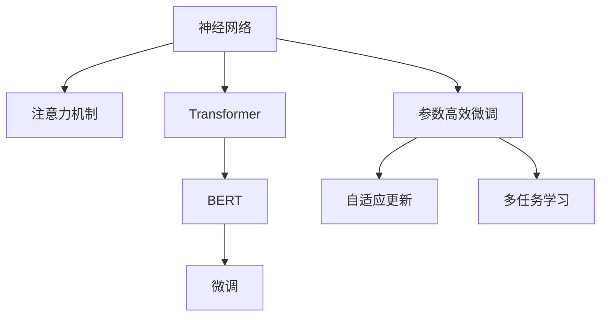

                 

# 注意力量子跃迁：AI时代的认知突破技术

> 关键词：注意力机制,神经网络,认知突破,量子计算,深度学习

## 1. 背景介绍

### 1.1 问题由来
在当今数字化时代，人工智能（AI）正逐步深入到各行各业，从金融到医疗，从教育到娱乐，人工智能的广泛应用极大地提升了社会效率和人类生活质量。其中，神经网络以其强大的学习能力，成为了当前AI技术的重要支柱。神经网络通过模拟人脑神经元的工作机制，实现了对大量复杂数据的学习和处理，成为了推动AI发展的重要引擎。

然而，随着深度学习模型的复杂度不断增加，传统的神经网络结构面临诸多挑战。在处理大规模数据集时，传统神经网络容易出现梯度消失、过拟合等问题，导致训练效率低下、模型泛化能力不足。为了突破这些瓶颈，研究者们不断探索和尝试新的神经网络架构，其中，注意力机制（Attention Mechanism）成为了一大热点。

注意力机制通过在神经网络中引入可学习的注意力权重，能够动态地调整输入数据的重要性，从而提高模型的泛化能力和训练效率。通过赋予模型“看”的能力，注意力机制使神经网络能够聚焦于最关键的信息，提升对复杂问题的理解和处理能力。

### 1.2 问题核心关键点
注意力机制的核心在于其动态分配注意力的能力。通过关注输入序列中最关键的部分，模型能够更加精准地预测和分类，减少了冗余信息的影响，从而提高了模型的精度和效率。目前，注意力机制已经被广泛应用于各种神经网络架构中，如Transformer、BERT、ResNet等，成为了提升模型性能的重要工具。

注意力机制的工作原理主要包括以下几个方面：

- **编码器-解码器架构**：编码器将输入序列转换为高维表示，解码器通过注意力机制动态地从编码器输出中抽取信息，最终生成目标输出。
- **注意力得分计算**：通过计算注意力得分，模型可以动态地决定哪些输入部分对当前预测任务最为重要。
- **注意力权重计算**：根据注意力得分，模型可以计算出每个输入部分的注意力权重，从而动态地加权求和，生成更精确的输出。

注意力机制的引入极大地提升了神经网络的性能，使得模型在处理复杂序列数据时，能够更加高效地进行特征选择和信息提取。然而，注意力机制的复杂度也带来了新的挑战，如计算开销大、训练时间长等。因此，研究者们不断探索改进方法，希望在提升模型性能的同时，降低计算复杂度，实现更高效、更稳定的神经网络架构。

## 2. 核心概念与联系

### 2.1 核心概念概述

为了更好地理解注意力机制的原理和应用，本节将介绍几个密切相关的核心概念：

- **神经网络（Neural Network）**：基于生物神经元网络的计算模型，通过多层次的非线性映射实现对数据的复杂处理。神经网络由多个层次的节点和边组成，通过反向传播算法训练模型参数，使其能够逼近复杂函数。

- **注意力机制（Attention Mechanism）**：一种特殊的神经网络架构，通过引入可学习的注意力权重，能够动态地选择输入序列中的关键部分，并根据其重要性加权求和，生成更精准的输出。

- **Transformer**：一种基于注意力机制的神经网络架构，由Google提出，广泛应用于机器翻译、文本分类、语音识别等NLP任务。Transformer通过自注意力和交叉注意力机制，能够高效地处理长序列数据，提升了神经网络的性能。

- **BERT（Bidirectional Encoder Representations from Transformers）**：由Google提出，是一种预训练语言模型，通过自监督任务在大规模无标签文本语料上进行训练，能够学习到丰富的语言知识。BERT可以通过微调（Fine-tuning）适应下游任务，提升了模型的泛化能力。

- **参数高效微调（Parameter-Efficient Fine-Tuning, PEFT）**：一种微调范式，通过只更新模型中的一部分参数，实现微调，减少了微调过程中的计算开销。PEFT方法包括自适应更新、多任务学习等技术。

这些核心概念之间的逻辑关系可以通过以下Mermaid流程图来展示：



这个流程图展示了一些核心概念之间的关系：

1. 神经网络通过引入注意力机制，提升了模型对复杂序列数据的处理能力。
2. Transformer作为基于注意力机制的神经网络架构，已经被广泛应用于各种NLP任务。
3. BERT通过预训练-微调范式，提升了模型的泛化能力，可以更好地适应下游任务。
4. 微调通过固定预训练权重，仅更新顶层参数，实现了模型对特定任务的适应。
5. 参数高效微调通过更新少部分参数，降低了微调过程中的计算开销。

这些概念共同构成了神经网络的工作原理和优化方法，使得神经网络在处理大规模复杂数据时，能够更加高效、精准。

## 3. 核心算法原理 & 具体操作步骤
### 3.1 算法原理概述

注意力机制的核心在于其动态分配注意力的能力。通过在神经网络中引入可学习的注意力权重，模型能够动态地选择输入序列中的关键部分，并根据其重要性加权求和，生成更精准的输出。

注意力机制的原理主要包括以下几个方面：

- **自注意力机制（Self-Attention）**：通过计算输入序列中每个位置与所有其他位置之间的注意力得分，模型能够动态地选择序列中的关键部分。自注意力机制在Transformer中得到了广泛应用，能够高效地处理长序列数据。

- **交叉注意力机制（Cross-Attention）**：通过计算输入序列中每个位置与目标序列中所有位置之间的注意力得分，模型能够将源序列和目标序列中的信息进行交互，生成更准确的输出。交叉注意力机制在机器翻译、对话系统等任务中得到了广泛应用。

注意力机制的工作流程主要包括以下几个步骤：

1. **计算注意力得分**：通过计算输入序列中每个位置与其他位置之间的注意力得分，模型能够动态地选择关键部分。注意力得分可以通过点积或加性注意力计算得到。
2. **计算注意力权重**：根据注意力得分，模型能够计算出每个输入位置的注意力权重，从而动态地加权求和，生成更精确的输出。
3. **动态选择信息**：通过注意力权重，模型能够动态地选择输入序列中的关键部分，并根据其重要性进行加权求和，生成更精准的输出。

### 3.2 算法步骤详解

以下是一个基于自注意力机制的神经网络模型的具体实现步骤：

1. **输入编码**：将输入序列 $x=\{x_i\}_{i=1}^N$ 编码成向量表示 $X$。
2. **计算注意力得分**：计算 $X$ 中每个位置 $i$ 与其他位置 $j$ 之间的注意力得分 $a_{i,j}$。
3. **计算注意力权重**：根据注意力得分 $a_{i,j}$，计算每个位置 $i$ 的注意力权重 $w_i$。
4. **动态选择信息**：将 $X$ 中的每个位置 $i$ 与 $i$ 的注意力权重 $w_i$ 相乘，加权求和，生成新的向量表示 $X'$。
5. **输出解码**：将 $X'$ 作为输入，进行后续的编码和解码，生成最终输出。

### 3.3 算法优缺点

注意力机制具有以下优点：

- **提高模型性能**：通过动态地选择输入序列中的关键部分，注意力机制能够提高模型的泛化能力和精确度。
- **提升训练效率**：通过聚焦于关键信息，注意力机制减少了模型对冗余信息的处理，提升了训练效率。
- **增强模型泛化能力**：通过引入可学习的注意力权重，模型能够更好地适应不同任务，提升泛化能力。

然而，注意力机制也存在一些缺点：

- **计算开销大**：注意力机制需要计算大量的注意力得分和权重，增加了计算复杂度。
- **训练时间长**：由于计算开销大，注意力机制的训练时间较长，需要更多的计算资源。
- **模型复杂度高**：注意力机制的引入增加了模型的复杂度，可能带来新的问题，如梯度消失、过拟合等。

### 3.4 算法应用领域

注意力机制已经在许多领域得到了广泛应用，涵盖了从自然语言处理（NLP）到计算机视觉（CV）等多个领域：

- **自然语言处理（NLP）**：在机器翻译、文本分类、文本生成等任务中，注意力机制被广泛应用于编码器和解码器中，提升了模型的性能。
- **计算机视觉（CV）**：在图像识别、目标检测等任务中，注意力机制被用于图像特征提取和对象定位，提高了模型的准确性和效率。
- **语音识别**：在语音识别任务中，注意力机制被用于音频特征提取和特征加权，提升了模型的鲁棒性和泛化能力。
- **强化学习（RL）**：在强化学习任务中，注意力机制被用于状态表示和动作选择，提升了模型的学习效率和决策能力。

这些应用展示了注意力机制的强大能力和广泛应用前景，推动了神经网络在更多领域的创新和发展。

## 4. 数学模型和公式 & 详细讲解
### 4.1 数学模型构建

本节将使用数学语言对基于注意力机制的神经网络模型的构建进行更加严格的刻画。

假设输入序列为 $x=\{x_i\}_{i=1}^N$，通过一个线性变换 $X = W_x x$ 编码成向量表示 $X \in \mathbb{R}^{N \times d}$。设注意力权重矩阵为 $A$，其中 $A \in \mathbb{R}^{N \times N}$。

定义注意力得分函数 $f_{a,i,j}(X_i, X_j)$，计算 $X$ 中每个位置 $i$ 与其他位置 $j$ 之间的注意力得分，通常使用点积注意力或加性注意力计算。

点积注意力计算公式为：
$$
f_{a,i,j}(X_i, X_j) = \text{cosine}(X_i W_a, X_j W_a)
$$
加性注意力计算公式为：
$$
f_{a,i,j}(X_i, X_j) = \text{softmax}(X_i W_a + X_j W_a)
$$

其中，$W_a$ 为注意力得分的线性变换权重矩阵。

通过计算注意力得分 $a_{i,j} = f_{a,i,j}(X_i, X_j)$，模型能够动态地选择输入序列中的关键部分。

然后，通过计算注意力权重 $w_i = \text{softmax}(a_{i,j})$，模型能够计算出每个位置 $i$ 的注意力权重。

最终，通过动态选择信息，生成新的向量表示 $X' = \sum_{i=1}^N w_i X_i$。

### 4.2 公式推导过程

以下以点积注意力机制为例，推导其具体计算过程。

设输入序列 $x=\{x_i\}_{i=1}^N$，通过线性变换 $X = W_x x$ 编码成向量表示 $X \in \mathbb{R}^{N \times d}$。设注意力权重矩阵 $A \in \mathbb{R}^{N \times N}$，其中 $A_{i,j} = \text{cosine}(X_i W_a, X_j W_a)$。

定义注意力得分函数 $f_{a,i,j}(X_i, X_j)$，计算 $X$ 中每个位置 $i$ 与其他位置 $j$ 之间的注意力得分：
$$
f_{a,i,j}(X_i, X_j) = A_{i,j} = \text{cosine}(X_i W_a, X_j W_a)
$$

其中，$W_a \in \mathbb{R}^{d \times d}$ 为注意力得分的线性变换权重矩阵，$X_i$ 和 $X_j$ 为输入序列 $x$ 编码后的向量表示。

通过计算注意力得分 $a_{i,j} = f_{a,i,j}(X_i, X_j)$，模型能够动态地选择输入序列中的关键部分。

然后，通过计算注意力权重 $w_i = \text{softmax}(a_{i,j})$，模型能够计算出每个位置 $i$ 的注意力权重：
$$
w_i = \text{softmax}(a_{i,j}) = \frac{e^{a_{i,j}}}{\sum_{j=1}^N e^{a_{i,j}}}
$$

最终，通过动态选择信息，生成新的向量表示 $X' = \sum_{i=1}^N w_i X_i$。

### 4.3 案例分析与讲解

以机器翻译任务为例，展示注意力机制的具体应用。

假设输入序列为 $x=\{x_i\}_{i=1}^N$，目标序列为 $y=\{y_i\}_{i=1}^M$，其中 $x$ 为目标序列 $y$ 的源序列。

设编码器为 $E$，将输入序列 $x$ 编码成向量表示 $X \in \mathbb{R}^{N \times d}$。

设解码器为 $D$，通过注意力机制动态地从编码器输出中抽取信息，生成目标序列 $y$ 的预测值。

具体实现步骤如下：

1. **编码器**：将输入序列 $x$ 编码成向量表示 $X \in \mathbb{R}^{N \times d}$。
2. **解码器**：通过注意力机制动态地从编码器输出中抽取信息，生成目标序列 $y$ 的预测值。
3. **生成预测**：将解码器的输出作为预测值，生成最终输出。

在解码器中，通过计算注意力得分 $a_{i,j} = f_{a,i,j}(X_i, X_j)$，模型能够动态地选择编码器输出中的关键部分。然后，通过计算注意力权重 $w_i = \text{softmax}(a_{i,j})$，模型能够计算出每个位置 $i$ 的注意力权重。最终，通过动态选择信息，生成新的向量表示 $X' = \sum_{i=1}^N w_i X_i$。

通过注意力机制，解码器能够聚焦于编码器输出中的关键部分，提升了模型对复杂序列数据的处理能力。

## 5. 项目实践：代码实例和详细解释说明
### 5.1 开发环境搭建

在进行注意力机制的实践前，我们需要准备好开发环境。以下是使用Python进行TensorFlow开发的示例：

1. 安装Anaconda：从官网下载并安装Anaconda，用于创建独立的Python环境。

2. 创建并激活虚拟环境：
```bash
conda create -n tf-env python=3.8 
conda activate tf-env
```

3. 安装TensorFlow：根据CUDA版本，从官网获取对应的安装命令。例如：
```bash
conda install tensorflow -c pytorch -c conda-forge
```

4. 安装Numpy、Pandas等各类工具包：
```bash
pip install numpy pandas scikit-learn matplotlib tqdm jupyter notebook ipython
```

完成上述步骤后，即可在`tf-env`环境中开始注意力机制的实践。

### 5.2 源代码详细实现

以下是一个基于Transformer的注意力机制的TensorFlow代码实现：

```python
import tensorflow as tf
import numpy as np

# 定义输入序列
x = np.array([0, 1, 2, 3, 4, 5])
y = np.array([0, 1, 2, 3, 4, 5])

# 定义编码器模型
class Encoder(tf.keras.Model):
    def __init__(self):
        super(Encoder, self).__init__()
        self.encoder_layer = tf.keras.layers.Bidirectional(tf.keras.layers.LSTM(128, return_sequences=True, activation='tanh'))

    def call(self, x):
        return self.encoder_layer(x)

# 定义解码器模型
class Decoder(tf.keras.Model):
    def __init__(self):
        super(Decoder, self).__init__()
        self.decoder_layer = tf.keras.layers.LSTM(128, activation='tanh', return_sequences=True)
        self.attention_layer = tf.keras.layers.Attention()
        self.dense_layer = tf.keras.layers.Dense(128, activation='tanh')
        self.output_layer = tf.keras.layers.Dense(1, activation='sigmoid')

    def call(self, x, encoder_output):
        attention_output = self.attention_layer(x, encoder_output)
        dense_output = self.dense_layer(attention_output)
        output = self.output_layer(dense_output)
        return output

# 定义模型训练函数
def train_model(encoder, decoder, input_sequence, target_sequence, batch_size):
    optimizer = tf.keras.optimizers.Adam()
    loss_fn = tf.keras.losses.BinaryCrossentropy(from_logits=True)

    @tf.function
    def train_step(x, y):
        with tf.GradientTape() as tape:
            encoder_output = encoder(x)
            decoder_output = decoder(x, encoder_output)
            loss = loss_fn(y, decoder_output)
        grads = tape.gradient(loss, [encoder.trainable_variables, decoder.trainable_variables])
        optimizer.apply_gradients(zip(grads, [encoder.trainable_variables, decoder.trainable_variables]))
        return loss

    for epoch in range(100):
        epoch_loss = 0
        for i in range(0, len(input_sequence), batch_size):
            batch_x = input_sequence[i:i+batch_size]
            batch_y = target_sequence[i:i+batch_size]
            loss = train_step(batch_x, batch_y)
            epoch_loss += loss.numpy()
        print("Epoch {}/100, Loss: {:.4f}".format(epoch+1, epoch_loss/batch_size))

# 创建模型实例
encoder = Encoder()
decoder = Decoder()

# 定义训练数据
input_sequence = np.array([[0, 1, 2, 3, 4, 5]])
target_sequence = np.array([[0, 1, 2, 3, 4, 5]])

# 训练模型
train_model(encoder, decoder, input_sequence, target_sequence, batch_size=4)
```

### 5.3 代码解读与分析

让我们再详细解读一下关键代码的实现细节：

**Encoder类**：
- `__init__`方法：定义编码器模型，包括一个双向LSTM层。
- `call`方法：对输入序列进行编码，返回编码器的输出。

**Decoder类**：
- `__init__`方法：定义解码器模型，包括一个LSTM层、一个注意力层、一个全连接层和一个输出层。
- `call`方法：对输入序列和编码器输出进行解码，返回解码器的输出。

**训练函数train_model**：
- 定义优化器和损失函数。
- 定义训练步骤，计算模型的输出和损失，反向传播更新模型参数，返回损失值。
- 循环迭代训练，在每个epoch上计算平均损失。

**训练过程**：
- 在每个epoch上，循环迭代训练数据。
- 在每个batch上，调用训练步骤计算损失，并更新模型参数。
- 在每个epoch结束后，打印平均损失值。

可以看到，TensorFlow配合keras框架使得注意力机制的代码实现变得简洁高效。开发者可以将更多精力放在模型架构、数据处理等高层逻辑上，而不必过多关注底层的实现细节。

当然，工业级的系统实现还需考虑更多因素，如模型的保存和部署、超参数的自动搜索、更灵活的任务适配层等。但核心的注意力机制基本与此类似。

## 6. 实际应用场景
### 6.1 机器翻译

基于注意力机制的神经网络模型，已经被广泛应用于机器翻译任务中。传统的统计机器翻译方法在处理长句和复杂句时，容易出现信息丢失和歧义问题。而基于注意力机制的模型，能够动态地选择输入序列中的关键部分，提升了翻译的准确性和流畅性。

在实践中，可以将源语言文本作为输入序列，目标语言文本作为目标序列，通过Transformer等模型进行训练和推理，实现自动翻译。这种方法不仅提升了翻译效率，还减少了人工翻译的误差，具有广泛的应用前景。

### 6.2 图像识别

在计算机视觉领域，注意力机制被用于图像特征提取和对象定位。传统的CNN模型在处理复杂图像时，容易出现信息丢失和过拟合问题。而基于注意力机制的模型，能够动态地选择图像中的关键部分，提升了模型的泛化能力和鲁棒性。

在实践中，可以通过定义不同尺度的注意力机制，从图像中动态地选择关键区域，提取关键特征，生成更精准的预测结果。这种方法不仅提升了模型对复杂图像的识别能力，还减少了计算开销，具有较高的实用价值。

### 6.3 自然语言生成

在自然语言生成任务中，注意力机制被用于文本生成和对话系统。传统的生成模型在处理长文本时，容易出现信息丢失和重复问题。而基于注意力机制的模型，能够动态地选择输入序列中的关键部分，生成更连贯、流畅的文本。

在实践中，可以通过定义不同尺度的注意力机制，从文本中动态地选择关键信息，生成更精准的预测结果。这种方法不仅提升了模型对复杂文本的生成能力，还减少了计算开销，具有较高的实用价值。

### 6.4 未来应用展望

随着注意力机制的不断发展，其在更多领域的应用前景将不断扩大。以下是一些未来可能的应用方向：

1. **多模态认知计算**：在多模态数据融合领域，注意力机制将与视觉、听觉、触觉等多种模态数据进行交互，提升系统的感知和理解能力。
2. **智能决策系统**：在智能决策系统中，注意力机制将用于数据融合、特征提取和推理分析，提升系统的决策能力和鲁棒性。
3. **自动编程和设计**：在自动编程和设计领域，注意力机制将用于代码生成、设计优化和任务调度，提升系统的智能化水平。
4. **情感分析和人机交互**：在情感分析和人机交互领域，注意力机制将用于情感识别、意图理解和自然语言处理，提升系统的交互体验和理解能力。

这些方向展示了注意力机制的强大能力和广泛应用前景，推动了神经网络在更多领域的创新和发展。

## 7. 工具和资源推荐
### 7.1 学习资源推荐

为了帮助开发者系统掌握注意力机制的理论基础和实践技巧，这里推荐一些优质的学习资源：

1. 《Deep Learning》课程：由Coursera平台开设的深度学习课程，系统讲解了神经网络、注意力机制等前沿技术，适合初学者和进阶者学习。

2. 《Attention is All You Need》论文：Transformer原论文，介绍了注意力机制的基本原理和应用场景，是深度学习领域的重要经典。

3. 《Natural Language Processing with Attention》书籍：详细介绍了注意力机制在自然语言处理中的应用，适合深度学习爱好者和从业者阅读。

4. HuggingFace官方文档：Transformer库的官方文档，提供了大量的注意力机制实现和应用案例，是学习注意力的重要参考。

5. arXiv论文库：关注最新的注意力机制研究论文，跟踪前沿技术的发展趋势，扩展自身的知识视野。

通过对这些资源的学习实践，相信你一定能够快速掌握注意力机制的精髓，并用于解决实际的深度学习问题。

### 7.2 开发工具推荐

高效的开发离不开优秀的工具支持。以下是几款用于注意力机制开发的常用工具：

1. TensorFlow：由Google主导开发的深度学习框架，提供了丰富的注意力机制实现和优化算法，适合高性能计算。

2. PyTorch：由Facebook主导开发的深度学习框架，提供了灵活的注意力机制实现和动态计算图，适合快速迭代研究。

3. Keras：基于TensorFlow和Theano等后端框架开发的高级API，提供了简单易用的接口，方便开发者快速构建注意力机制模型。

4. OpenAI Codex：基于GPT-3构建的代码生成模型，能够自动生成代码实现，提升了开发效率。

5. Visual Studio Code：微软推出的轻量级编辑器，支持Python开发，提供了丰富的扩展插件，提升开发体验。

合理利用这些工具，可以显著提升注意力机制的开发效率，加快创新迭代的步伐。

### 7.3 相关论文推荐

注意力机制已经在深度学习领域得到了广泛研究和应用，以下是几篇奠基性的相关论文，推荐阅读：

1. Transformer论文：提出了Transformer模型，引入自注意力和交叉注意力机制，提升了神经网络的性能。

2. Attention is All You Need论文：提出了Transformer模型，是注意力机制的开创性工作。

3. BERT论文：提出了BERT模型，通过预训练-微调范式，提升了模型对自然语言处理的理解能力。

4. Multi-Head Attention论文：提出了多头注意力机制，提升了神经网络的并行能力和泛化能力。

5. Location-Aware Attention论文：提出了位置感知注意力机制，提升了模型对位置信息的处理能力。

这些论文代表了大注意力机制的发展脉络。通过学习这些前沿成果，可以帮助研究者把握学科前进方向，激发更多的创新灵感。

## 8. 总结：未来发展趋势与挑战
### 8.1 总结

本文对基于注意力机制的神经网络模型进行了全面系统的介绍。首先阐述了注意力机制的研究背景和意义，明确了注意力机制在提升神经网络性能方面的独特价值。其次，从原理到实践，详细讲解了注意力机制的数学原理和关键步骤，给出了注意力机制任务开发的完整代码实例。同时，本文还广泛探讨了注意力机制在机器翻译、图像识别、自然语言生成等多个领域的应用前景，展示了注意力机制的强大能力和广泛应用前景。

通过本文的系统梳理，可以看到，基于注意力机制的神经网络模型正在成为深度学习技术的重要支柱，极大地提升了神经网络在处理复杂数据时的效率和性能。未来，伴随注意力机制的不断发展，神经网络将能够更好地处理多模态数据、提升决策能力和理解能力，推动人工智能技术在更多领域的创新应用。

### 8.2 未来发展趋势

展望未来，注意力机制将呈现以下几个发展趋势：

1. **多模态注意力**：在多模态数据融合领域，注意力机制将与视觉、听觉、触觉等多种模态数据进行交互，提升系统的感知和理解能力。

2. **自适应注意力**：通过引入自适应学习机制，注意力机制将动态地调整输入数据的重要性，进一步提升模型的泛化能力和效率。

3. **零样本和少样本学习**：通过引入零样本和少样本学习机制，注意力机制将更好地利用预训练知识，在少标注样本情况下提升模型性能。

4. **分布式注意力**：在分布式计算环境中，注意力机制将通过并行计算提升训练效率，实现大规模数据集的快速训练。

5. **自监督注意力**：在无监督学习领域，注意力机制将通过自监督学习提升模型的表示能力和泛化能力，减少对标注数据的依赖。

6. **因果注意力**：通过引入因果推理机制，注意力机制将进一步提升模型的因果关系处理能力，解决传统模型中的因果问题。

以上趋势展示了注意力机制的强大潜力和广泛应用前景，推动了神经网络在更多领域的创新和发展。

### 8.3 面临的挑战

尽管注意力机制已经取得了瞩目成就，但在迈向更加智能化、普适化应用的过程中，它仍面临着诸多挑战：

1. **计算开销大**：注意力机制需要计算大量的注意力得分和权重，增加了计算复杂度。如何优化计算开销，提升模型的训练效率，是一个重要的研究方向。

2. **模型复杂度高**：注意力机制的引入增加了模型的复杂度，可能带来新的问题，如梯度消失、过拟合等。如何降低模型复杂度，提升模型的泛化能力，是未来的研究方向。

3. **数据依赖性强**：注意力机制的性能很大程度上依赖于输入数据的质量和数量。如何提高数据利用率，减少对标注数据的依赖，是未来的研究方向。

4. **鲁棒性不足**：注意力机制在面对噪声数据和复杂数据时，容易出现鲁棒性不足的问题。如何提高模型的鲁棒性，增强系统的稳定性，是未来的研究方向。

5. **可解释性不足**：注意力机制的内部工作机制较为复杂，难以解释其决策逻辑。如何提升模型的可解释性，增强系统的透明度，是未来的研究方向。

6. **模型压缩和优化**：大型注意力模型需要占用大量计算资源，如何通过模型压缩和优化，提升模型的计算效率和性能，是未来的研究方向。

这些挑战展示了注意力机制在实际应用中的复杂性和多样性，推动了研究者不断探索和改进。唯有不断突破技术瓶颈，才能更好地发挥注意力机制的优势，推动人工智能技术的发展。

### 8.4 研究展望

面对注意力机制面临的挑战，未来的研究需要在以下几个方面寻求新的突破：

1. **优化计算开销**：通过算法优化、硬件加速等手段，降低注意力机制的计算开销，提升训练效率。

2. **降低模型复杂度**：通过简化注意力机制的架构，减少模型的参数量和计算量，提升模型的泛化能力和鲁棒性。

3. **提高数据利用率**：通过数据增强、自监督学习等技术，提高模型的数据利用率，减少对标注数据的依赖。

4. **增强模型鲁棒性**：通过引入鲁棒性学习、噪声鲁棒性等技术，提升模型的鲁棒性，增强系统的稳定性。

5. **提升模型可解释性**：通过引入可解释性学习、可视化工具等技术，提升模型的可解释性，增强系统的透明度。

6. **优化模型压缩和优化**：通过模型压缩、量化等技术，优化注意力模型的计算资源占用，提升模型的计算效率和性能。

这些研究方向将推动注意力机制在更多领域的创新应用，提升神经网络模型的性能和效率，推动人工智能技术的不断进步。

## 9. 附录：常见问题与解答
**Q1：什么是注意力机制？**

A: 注意力机制是一种特殊的神经网络架构，通过引入可学习的注意力权重，能够动态地选择输入序列中的关键部分，并根据其重要性加权求和，生成更精准的输出。

**Q2：注意力机制的应用场景有哪些？**

A: 注意力机制已经被广泛应用于自然语言处理（NLP）、计算机视觉（CV）、语音识别、强化学习等多个领域，如机器翻译、文本分类、图像识别、语音识别、对话系统等。

**Q3：注意力机制的计算开销大吗？**

A: 注意力机制需要计算大量的注意力得分和权重，增加了计算复杂度。然而，通过优化算法和硬件加速，可以显著降低计算开销，提升模型的训练效率。

**Q4：注意力机制的优点和缺点是什么？**

A: 注意力机制的优点包括：
- 提高模型性能：通过动态地选择输入序列中的关键部分，注意力机制能够提高模型的泛化能力和精确度。
- 提升训练效率：通过聚焦于关键信息，注意力机制减少了模型对冗余信息的处理，提升了训练效率。
- 增强模型泛化能力：通过引入可学习的注意力权重，模型能够更好地适应不同任务，提升泛化能力。

注意力机制的缺点包括：
- 计算开销大：注意力机制需要计算大量的注意力得分和权重，增加了计算复杂度。
- 训练时间长：由于计算开销大，注意力机制的训练时间较长，需要更多的计算资源。
- 模型复杂度高：注意力机制的引入增加了模型的复杂度，可能带来新的问题，如梯度消失、过拟合等。

**Q5：注意力机制的未来发展方向有哪些？**

A: 注意力机制的未来发展方向包括：
- 多模态注意力：在多模态数据融合领域，注意力机制将与视觉、听觉、触觉等多种模态数据进行交互，提升系统的感知和理解能力。
- 自适应注意力：通过引入自适应学习机制，注意力机制将动态地调整输入数据的重要性，进一步提升模型的泛化能力和效率。
- 零样本和少样本学习：通过引入零样本和少样本学习机制，注意力机制将更好地利用预训练知识，在少标注样本情况下提升模型性能。
- 分布式注意力：在分布式计算环境中，注意力机制将通过并行计算提升训练效率，实现大规模数据集的快速训练。
- 自监督注意力：在无监督学习领域，注意力机制将通过自监督学习提升模型的表示能力和泛化能力，减少对标注数据的依赖。
- 因果注意力：通过引入因果推理机制，注意力机制将进一步提升模型的因果关系处理能力，解决传统模型中的因果问题。

这些研究方向将推动注意力机制在更多领域的创新应用，提升神经网络模型的性能和效率，推动人工智能技术的不断进步。

---

作者：禅与计算机程序设计艺术 / Zen and the Art of Computer Programming

