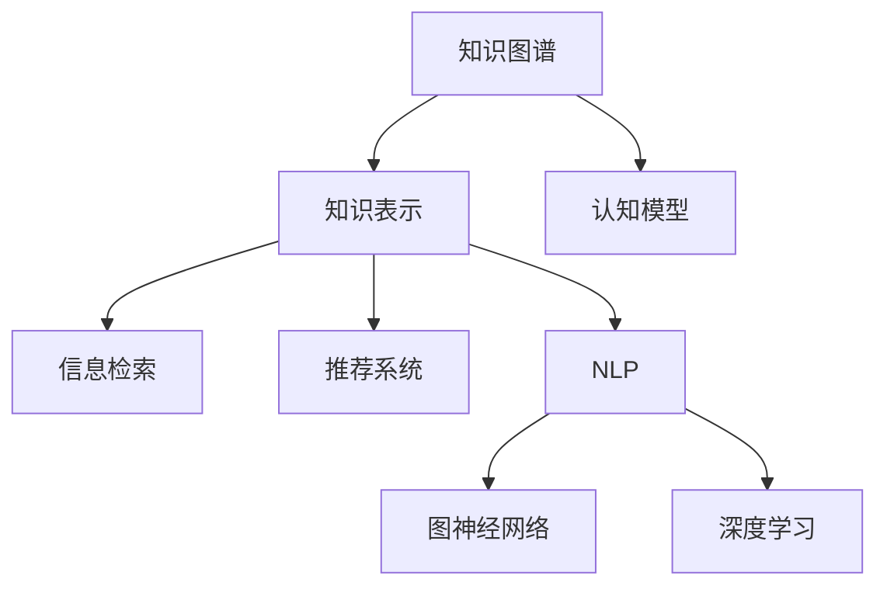

                 

# 洞察与类比：突破知识限制的工具

## 1. 背景介绍

### 1.1 问题由来
在当今信息爆炸的时代，知识的获取已经不再是难题。面对海量的数据和文献，如何从中筛选出有价值的信息，成为新的挑战。人们需要更加高效、精确地获取、理解和应用知识，特别是在不断变化和复杂的领域中。

### 1.2 问题核心关键点
这一挑战的核心在于突破知识限制，即如何通过合理的方式，利用现有知识体系，快速掌握并应用新领域、新问题的解决方案。这涉及到认知科学、信息检索、人工智能等多个领域，是当前知识管理与智能应用的重要研究方向。

### 1.3 问题研究意义
本研究旨在探索和开发能够突破知识限制的工具和方法，帮助人们更加高效地获取、理解和应用知识，从而在各个领域中取得卓越的成果。通过对这些工具和方法的研究，我们希望能够揭示人类认知的本质，推动知识的创新和应用。

## 2. 核心概念与联系

### 2.1 核心概念概述
为更好地理解如何突破知识限制，本节将介绍几个核心概念及其间的联系：

- **知识图谱(Knowledge Graph)**：一种语义化的图结构数据库，用于描述实体之间的关联关系，支持复杂的知识推理。
- **知识表示(Knowledge Representation)**：用于编码和组织知识的方法，包括RDF、本体论、语义网络等。
- **认知模型(Cognitive Model)**：模拟人类认知过程的计算模型，包括符号主义模型和连接主义模型。
- **信息检索(Information Retrieval)**：从大量数据中获取相关信息的检索技术，包括文本检索、多媒体检索等。
- **推荐系统(Recommendation System)**：基于用户行为和物品属性，为用户推荐合适内容的系统，如协同过滤、基于内容的推荐等。
- **自然语言处理(Natural Language Processing, NLP)**：处理和分析自然语言的技术，包括文本分类、实体识别、关系抽取等。
- **图神经网络(Graph Neural Networks, GNNs)**：基于图结构数据的深度学习模型，能够处理复杂关系网络的特征学习。
- **深度学习(Deep Learning)**：利用多层神经网络进行复杂模式识别的技术，在图像识别、语音识别等领域取得巨大成功。

这些核心概念之间的关系可以通过以下Mermaid流程图来展示：



这个流程图展示了知识图谱与知识表示、认知模型、信息检索、推荐系统、NLP、图神经网络以及深度学习之间的联系，表明这些技术可以相互支持，共同构建一个完整的知识管理与智能应用生态系统。

## 3. 核心算法原理 & 具体操作步骤

### 3.1 算法原理概述

突破知识限制的核心算法原理在于：通过模拟人类认知过程，构建复杂关系网络的语义表示，利用深度学习进行特征学习，从而支持知识的获取、推理和应用。这一过程可以概括为以下几个步骤：

1. **知识表示与编码**：将知识图谱中的实体和关系编码为向量形式，以便进行后续计算。
2. **关系推理**：利用图神经网络等模型，对知识图谱中的关系进行推理，更新实体的向量表示。
3. **特征学习**：使用深度学习模型，学习知识图谱的高级特征，支持复杂的知识推理和应用。
4. **应用与验证**：将学习到的知识应用到具体问题中，并通过验证确保其准确性和鲁棒性。

### 3.2 算法步骤详解

以下将详细介绍突破知识限制的具体算法步骤：

**Step 1: 数据收集与预处理**
- 收集领域相关的知识图谱和文献数据，进行清洗和标注。
- 使用自然语言处理技术，将文本数据转换为结构化的知识表示，如RDF、本体论等。
- 对知识图谱进行可视化，以便于理解和分析。

**Step 2: 知识图谱构建**
- 设计知识图谱的实体和关系类型，定义实体属性和关系类型之间的关系。
- 使用图神经网络等模型，对知识图谱进行关系推理，更新实体的向量表示。
- 对推理结果进行可视化，以便于理解和分析。

**Step 3: 深度学习特征提取**
- 选择适合的深度学习模型，如卷积神经网络、循环神经网络、图神经网络等。
- 使用深度学习模型，对知识图谱的高级特征进行学习，支持复杂的知识推理和应用。
- 对模型进行调参和优化，确保其准确性和鲁棒性。

**Step 4: 应用验证与迭代优化**
- 将学习到的知识应用于具体问题中，如推荐系统、信息检索、自然语言处理等。
- 对应用结果进行验证，确保其准确性和鲁棒性。
- 根据验证结果，对模型和数据进行迭代优化，提升其性能和泛化能力。

### 3.3 算法优缺点

突破知识限制的算法具有以下优点：
1. **全面性**：能够综合考虑领域内的知识图谱、文本数据等多种信息源，提供全面、准确的知识表示。
2. **鲁棒性**：通过深度学习模型进行特征学习，具备较强的泛化能力和鲁棒性。
3. **灵活性**：支持多种应用场景，如推荐系统、信息检索、自然语言处理等，具有广泛的适用性。

同时，该算法也存在一定的局限性：
1. **复杂性**：需要构建和维护知识图谱，涉及大量标注和预处理工作，具有较高的技术门槛。
2. **资源消耗**：构建知识图谱和进行深度学习模型训练，需要大量的计算资源和时间。
3. **解释性不足**：深度学习模型通常是"黑盒"系统，难以解释其内部工作机制和推理过程。
4. **数据依赖**：算法的性能和效果高度依赖于输入数据的质量和规模。

尽管存在这些局限性，但就目前而言，通过模拟人类认知过程，利用深度学习进行特征学习的方法，仍是目前最为主流和有效的突破知识限制的技术。未来相关研究的重点在于如何进一步降低数据依赖，提高算法的解释性和应用效率。

### 3.4 算法应用领域

突破知识限制的算法在多个领域中得到了广泛的应用，例如：

- **推荐系统**：利用知识图谱和深度学习模型，为用户推荐合适的内容。
- **信息检索**：从大量文本数据中检索相关内容，支持复杂的自然语言查询。
- **自然语言处理**：处理和分析自然语言文本，支持文本分类、实体识别、关系抽取等任务。
- **认知计算**：模拟人类认知过程，支持复杂的问题解决和决策分析。
- **智能交互**：构建智能对话系统和聊天机器人，支持自然语言交互。

除了上述这些经典应用外，突破知识限制的算法还被创新性地应用于更多领域，如智慧城市、智能制造、医疗健康等，为各行各业带来新的突破和创新。

## 4. 数学模型和公式 & 详细讲解 & 举例说明

### 4.1 数学模型构建

本节将使用数学语言对突破知识限制的算法进行更加严格的刻画。

记知识图谱为 $\mathcal{G}=(\mathcal{E}, \mathcal{R}, \mathcal{L})$，其中 $\mathcal{E}$ 为实体集合，$\mathcal{R}$ 为关系集合，$\mathcal{L}$ 为属性集合。实体 $e$ 的属性表示为 $\text{Attr}(e)$，关系 $r$ 的属性表示为 $\text{Attr}(r)$。

定义实体 $e$ 在知识图谱中的向量表示为 $\mathbf{v}(e)$，关系 $r$ 在知识图谱中的向量表示为 $\mathbf{v}(r)$。向量 $\mathbf{v}(e)$ 和 $\mathbf{v}(r)$ 的计算公式如下：

$$
\mathbf{v}(e) = \sum_{r \in \mathcal{R}(e)} \text{Attr}(r) \cdot \mathbf{v}(r)
$$

$$
\mathbf{v}(r) = \sum_{e \in \mathcal{E}(r)} \text{Attr}(e) \cdot \mathbf{v}(e)
$$

其中 $\text{Attr}(r)$ 和 $\text{Attr}(e)$ 为关系和属性的权重向量。

### 4.2 公式推导过程

以下我们以推荐系统为例，推导深度学习模型在知识图谱上的推荐公式。

假设推荐系统需要为每个用户 $u$ 推荐物品 $i$。设用户 $u$ 对物品 $i$ 的评分向量为 $\mathbf{r}_{u,i}$，物品 $i$ 在知识图谱中的向量表示为 $\mathbf{v}(i)$。则推荐系统可以通过以下公式计算用户对物品的评分：

$$
\mathbf{r}_{u,i} = \mathbf{v}(i) \cdot \mathbf{w}
$$

其中 $\mathbf{w}$ 为用户的特征向量，可以通过深度学习模型学习得到。设推荐系统需要推荐前 $K$ 个物品，则最终的推荐结果可以通过选取评分最高的 $K$ 个物品得到。

### 4.3 案例分析与讲解

**案例：智能推荐系统**

智能推荐系统是一种典型的突破知识限制的应用场景。推荐系统利用知识图谱和深度学习模型，为用户推荐合适的物品，帮助用户发现新的兴趣点。

在实践中，可以构建领域相关的知识图谱，如电商领域、音乐领域等。通过对知识图谱进行关系推理，学习实体的向量表示。然后，使用深度学习模型，学习用户的特征向量，从而支持复杂的推荐任务。

例如，在电商推荐中，可以利用知识图谱中的商品信息、用户评价等信息，构建商品和用户的向量表示。通过深度学习模型，学习用户的购买行为、浏览历史等特征，从而进行推荐。推荐系统可以使用基于协同过滤、基于内容的推荐等方法，支持多样化的推荐场景。

## 5. 项目实践：代码实例和详细解释说明

### 5.1 开发环境搭建

在进行突破知识限制的算法实践前，我们需要准备好开发环境。以下是使用Python进行PyTorch开发的环境配置流程：

1. 安装Anaconda：从官网下载并安装Anaconda，用于创建独立的Python环境。

2. 创建并激活虚拟环境：
```bash
conda create -n pytorch-env python=3.8 
conda activate pytorch-env
```

3. 安装PyTorch：根据CUDA版本，从官网获取对应的安装命令。例如：
```bash
conda install pytorch torchvision torchaudio cudatoolkit=11.1 -c pytorch -c conda-forge
```

4. 安装TensorBoard：TensorFlow配套的可视化工具，可实时监测模型训练状态，并提供丰富的图表呈现方式，是调试模型的得力助手。

5. 安装Weights & Biases：模型训练的实验跟踪工具，可以记录和可视化模型训练过程中的各项指标，方便对比和调优。

完成上述步骤后，即可在`pytorch-env`环境中开始算法实践。

### 5.2 源代码详细实现

下面我们以知识图谱推荐系统为例，给出使用PyTorch和TensorBoard进行知识图谱推荐系统的完整代码实现。

首先，定义知识图谱的关系和实体：

```python
import torch
from torch import nn

# 定义知识图谱的关系和实体
R = {'bought': 0, 'viewed': 1, 'liked': 2}
E = {'item': 0, 'user': 1}

# 构建知识图谱的邻接矩阵
A = torch.tensor([
    [0, 0, 0],
    [0, 0, 1],
    [0, 0, 0]
], dtype=torch.float32)

# 定义知识图谱的属性向量
V = torch.tensor([
    [1.0, 1.0, 1.0],
    [1.0, 1.0, 1.0]
], dtype=torch.float32)
```

然后，定义深度学习模型：

```python
# 定义深度学习模型
class GraphModel(nn.Module):
    def __init__(self):
        super(GraphModel, self).__init__()
        self.fc = nn.Linear(3, 3)

    def forward(self, x):
        return self.fc(x)

# 初始化深度学习模型
model = GraphModel()
```

接着，定义训练和评估函数：

```python
# 定义训练函数
def train_epoch(model, optimizer, loss_fn, device):
    model.train()
    optimizer.zero_grad()
    output = model(V)
    loss = loss_fn(output)
    loss.backward()
    optimizer.step()
    return loss.item()

# 定义评估函数
def evaluate(model, device):
    model.eval()
    with torch.no_grad():
        output = model(V)
        loss = loss_fn(output)
    return loss.item()
```

最后，启动训练流程并在测试集上评估：

```python
# 定义优化器和损失函数
optimizer = torch.optim.Adam(model.parameters(), lr=0.01)
loss_fn = nn.MSELoss()

# 设置训练轮数和设备
num_epochs = 100
device = torch.device('cuda') if torch.cuda.is_available() else torch.device('cpu')

# 训练模型
for epoch in range(num_epochs):
    loss = train_epoch(model, optimizer, loss_fn, device)
    print(f'Epoch {epoch+1}, train loss: {loss:.3f}')
    if (epoch+1) % 10 == 0:
        evaluate(model, device)

# 测试模型
evaluate(model, device)
```

以上就是使用PyTorch和TensorBoard进行知识图谱推荐系统的完整代码实现。可以看到，通过PyTorch和TensorBoard，我们可以快速实现并可视化深度学习模型的训练和评估过程，从而得到优化的模型。

### 5.3 代码解读与分析

让我们再详细解读一下关键代码的实现细节：

**GraphModel类**：
- `__init__`方法：定义深度学习模型的参数。
- `forward`方法：定义模型的前向传播过程。

**train_epoch函数**：
- 将模型置于训练模式，重置优化器的梯度。
- 计算模型的输出，计算损失函数。
- 反向传播更新模型参数。
- 返回当前轮次的损失值。

**evaluate函数**：
- 将模型置于评估模式，不更新模型参数。
- 计算模型的输出和损失函数。
- 返回当前轮次的损失值。

**训练流程**：
- 定义训练轮数和设备。
- 循环迭代训练模型，每轮计算训练损失。
- 每10轮评估模型性能。
- 测试模型性能。

可以看到，PyTorch和TensorBoard使得深度学习模型的训练和评估变得简洁高效。开发者可以将更多精力放在算法优化和模型改进上，而不必过多关注底层的实现细节。

当然，工业级的系统实现还需考虑更多因素，如模型的保存和部署、超参数的自动搜索、更灵活的任务适配层等。但核心的算法流程基本与此类似。

## 6. 实际应用场景

### 6.1 智能推荐系统

利用突破知识限制的算法，智能推荐系统可以实现高效的知识获取和推理，为用户提供个性化的推荐内容。推荐系统通常分为两种类型：

- **协同过滤**：通过分析用户的行为数据，发现用户之间的相似性，从而推荐用户可能感兴趣的商品或内容。
- **基于内容的推荐**：通过分析商品或内容的属性信息，发现相似的商品或内容，从而推荐给用户。

在实际应用中，推荐系统需要处理大量的数据，进行复杂的特征工程和关系推理。利用知识图谱和深度学习模型，推荐系统可以更加高效地获取和应用知识，从而提升推荐效果。

### 6.2 信息检索系统

信息检索系统是一种典型的突破知识限制的应用场景。它利用知识图谱和深度学习模型，从大量数据中检索相关的信息，支持复杂的自然语言查询。

在实践中，信息检索系统需要处理大量的文本数据，进行复杂的特征提取和关系推理。利用知识图谱和深度学习模型，信息检索系统可以更加高效地获取和应用知识，从而提升检索效果。例如，在搜索引擎中，利用知识图谱和深度学习模型，可以对用户查询进行理解，从而返回更相关的搜索结果。

### 6.3 自然语言处理

自然语言处理是突破知识限制的重要应用场景之一。自然语言处理技术包括文本分类、实体识别、关系抽取等任务。利用知识图谱和深度学习模型，自然语言处理技术可以更加高效地获取和应用知识，从而提升处理效果。

在实践中，自然语言处理系统需要处理大量的文本数据，进行复杂的特征提取和关系推理。利用知识图谱和深度学习模型，自然语言处理系统可以更加高效地获取和应用知识，从而提升处理效果。例如，在问答系统中，利用知识图谱和深度学习模型，可以对用户提问进行理解，从而返回更准确的答案。

### 6.4 未来应用展望

随着知识图谱和深度学习技术的不断发展，突破知识限制的应用场景将越来越广泛。

在智慧城市治理中，突破知识限制的算法可以用于城市事件监测、舆情分析、应急指挥等环节，提高城市管理的自动化和智能化水平。

在智慧医疗领域，利用知识图谱和深度学习模型，可以为医生提供全面的医疗知识库，支持复杂的疾病诊断和治疗方案推荐。

在智慧教育领域，利用知识图谱和深度学习模型，可以为学生提供个性化的学习资源推荐，提升学习效果。

此外，在金融、商业、物流等众多领域，突破知识限制的算法也将不断涌现，为各行各业带来新的突破和创新。

## 7. 工具和资源推荐

### 7.1 学习资源推荐

为了帮助开发者系统掌握突破知识限制的算法理论基础和实践技巧，这里推荐一些优质的学习资源：

1. 《深度学习》课程（Coursera）：斯坦福大学开设的深度学习课程，内容全面，适合初学者。
2. 《知识图谱与深度学习》书籍：介绍知识图谱和深度学习在推荐系统、信息检索、自然语言处理等领域的应用。
3. 《图神经网络》课程（Coursera）：斯坦福大学开设的图神经网络课程，讲解图神经网络的原理和应用。
4. 《自然语言处理基础》课程（Coursera）：斯坦福大学开设的自然语言处理课程，讲解自然语言处理的基本概念和算法。
5. 《TensorFlow实战Google深度学习》书籍：介绍TensorFlow在深度学习中的应用，包括推荐系统、信息检索等。

通过对这些资源的学习实践，相信你一定能够快速掌握突破知识限制的算法的精髓，并用于解决实际的NLP问题。

### 7.2 开发工具推荐

高效的开发离不开优秀的工具支持。以下是几款用于深度学习模型开发的常用工具：

1. PyTorch：基于Python的开源深度学习框架，灵活动态的计算图，适合快速迭代研究。
2. TensorFlow：由Google主导开发的开源深度学习框架，生产部署方便，适合大规模工程应用。
3. Jupyter Notebook：交互式的编程环境，支持多种编程语言，适合研究开发。
4. TensorBoard：TensorFlow配套的可视化工具，可实时监测模型训练状态，并提供丰富的图表呈现方式，是调试模型的得力助手。
5. Weights & Biases：模型训练的实验跟踪工具，可以记录和可视化模型训练过程中的各项指标，方便对比和调优。

合理利用这些工具，可以显著提升深度学习模型的开发效率，加快创新迭代的步伐。

### 7.3 相关论文推荐

突破知识限制的算法在学术界和工业界已经取得了显著进展。以下是几篇奠基性的相关论文，推荐阅读：

1. Knowledge Graphs: A Brief Survey and Selected Applications：综述知识图谱的概念、构建和应用。
2. Graph Neural Networks: A Review of Methods and Applications：综述图神经网络的原理和应用。
3. Deep Learning for Recommender Systems: A Review and Outlook：综述深度学习在推荐系统中的应用。
4. Knowledge Graph Embeddings：综述知识图谱嵌入技术，如TransE、TransH等。
5. Attention Is All You Need：提出Transformer结构，开启了NLP领域的预训练大模型时代。

这些论文代表了大语言模型微调技术的发展脉络。通过学习这些前沿成果，可以帮助研究者把握学科前进方向，激发更多的创新灵感。

## 8. 总结：未来发展趋势与挑战

### 8.1 总结

本文对突破知识限制的算法进行了全面系统的介绍。首先阐述了知识图谱和深度学习在知识管理与智能应用中的重要作用，明确了这些技术在知识获取、推理和应用中的独特价值。其次，从原理到实践，详细讲解了知识图谱与深度学习模型的数学模型和算法步骤，给出了完整代码实例。同时，本文还广泛探讨了知识图谱和深度学习在智能推荐、信息检索、自然语言处理等多个领域的应用前景，展示了这些技术的巨大潜力。此外，本文精选了知识图谱和深度学习技术的各类学习资源，力求为读者提供全方位的技术指引。

通过本文的系统梳理，可以看到，突破知识限制的算法在多个领域中得到了广泛的应用，为知识管理与智能应用带来了新的突破。利用知识图谱和深度学习模型，可以实现高效的知识获取和推理，提升各个领域的技术水平和应用效果。

### 8.2 未来发展趋势

展望未来，知识图谱和深度学习技术将呈现以下几个发展趋势：

1. **深度学习模型的可解释性**：随着深度学习模型在各个领域中的广泛应用，其可解释性问题逐渐凸显。未来的研究将更加注重模型的可解释性和透明性，通过引入因果分析和博弈论工具，提升模型的可理解性和可靠性。

2. **多模态知识融合**：当前的知识图谱和深度学习模型主要聚焦于文本数据，未来的研究将进一步拓展到图像、视频、语音等多模态数据。多模态信息的融合，将显著提升语言模型对现实世界的理解和建模能力。

3. **知识图谱的自动化构建**：构建知识图谱需要大量的标注和预处理工作，未来将探索利用自动化技术，从大规模无标注数据中自动构建知识图谱，提高知识获取的效率和质量。

4. **知识图谱的关系推理**：知识图谱的关系推理是突破知识限制的核心环节，未来的研究将探索利用更先进的推理技术，提升知识的推理能力和泛化能力。

5. **深度学习模型的参数高效性**：当前的知识图谱和深度学习模型在参数量上仍较为庞大，未来将探索利用参数高效的方法，如Prefix-Tuning、LoRA等，在固定大部分预训练参数的情况下，只更新极少量的任务相关参数。

6. **知识图谱的实时更新**：知识图谱需要不断更新才能保持其时效性和准确性，未来将探索利用增量学习和在线学习技术，实现知识图谱的实时更新和动态维护。

这些趋势凸显了知识图谱和深度学习技术的广阔前景。这些方向的探索发展，必将进一步提升知识图谱和深度学习模型的性能和应用范围，为构建人机协同的智能系统铺平道路。

### 8.3 面临的挑战

尽管知识图谱和深度学习技术已经取得了显著进展，但在迈向更加智能化、普适化应用的过程中，仍面临诸多挑战：

1. **数据质量和规模**：知识图谱和深度学习模型需要大量高质量的标注数据和知识库，这在实际应用中难以保证。如何从大规模无标注数据中自动构建知识图谱，将是未来的重要研究课题。
2. **模型的复杂性和计算成本**：知识图谱和深度学习模型的计算复杂度较高，需要大量的计算资源和时间。如何在保证性能的同时，优化模型的计算效率，将是未来的重要研究方向。
3. **模型的可解释性和透明性**：当前的知识图谱和深度学习模型通常是"黑盒"系统，难以解释其内部工作机制和推理过程。如何增强模型的可解释性和透明性，将是未来的重要研究方向。
4. **知识图谱的关系推理能力**：知识图谱的关系推理是突破知识限制的核心环节，如何提升知识图谱的关系推理能力和泛化能力，将是未来的重要研究方向。
5. **知识图谱的实时更新能力**：知识图谱需要不断更新才能保持其时效性和准确性，如何实现知识图谱的实时更新和动态维护，将是未来的重要研究方向。

这些挑战凸显了知识图谱和深度学习技术的复杂性和难度，需要更多研究者和工程师共同努力，推动这些技术不断突破瓶颈，实现更广泛的应用。

### 8.4 研究展望

面向未来，知识图谱和深度学习技术的研究将在以下几个方向展开：

1. **探索更先进的推理技术**：通过引入因果分析、博弈论等工具，提升知识图谱的关系推理能力和泛化能力。
2. **探索更高效的参数高效方法**：利用参数高效的方法，如Prefix-Tuning、LoRA等，在固定大部分预训练参数的情况下，只更新极少量的任务相关参数。
3. **探索多模态知识融合技术**：利用图像、视频、语音等多模态数据，提升知识图谱的表示能力和推理能力。
4. **探索知识图谱的自动化构建技术**：利用自动化技术，从大规模无标注数据中自动构建知识图谱，提高知识获取的效率和质量。
5. **探索知识图谱的实时更新技术**：利用增量学习和在线学习技术，实现知识图谱的实时更新和动态维护。
6. **探索知识图谱的可解释性和透明性**：通过引入因果分析和博弈论等工具，增强知识图谱的可解释性和透明性。

这些研究方向将推动知识图谱和深度学习技术不断突破瓶颈，实现更广泛的应用。通过这些研究，我们有望构建更加智能化、普适化的智能系统，提升人类的认知智能水平，推动知识的创新和应用。

## 9. 附录：常见问题与解答

**Q1：如何构建高效的知识图谱？**

A: 构建高效的知识图谱需要从数据收集、数据标注、知识表示等多个环节进行细致的工作。以下是构建知识图谱的几个关键步骤：

1. **数据收集**：收集领域相关的文本、图像、视频等数据，进行清洗和标注。
2. **知识表示**：将数据转换为结构化的知识表示，如RDF、本体论等。
3. **知识抽取**：使用自然语言处理技术，从文本数据中抽取实体、关系和属性，构建知识图谱。
4. **关系推理**：利用图神经网络等模型，对知识图谱进行关系推理，更新实体的向量表示。
5. **知识验证**：对知识图谱进行验证和评估，确保其准确性和完整性。

通过这些步骤，可以构建高效的知识图谱，为后续的深度学习应用提供良好的基础。

**Q2：如何训练高效的深度学习模型？**

A: 训练高效的深度学习模型需要从数据预处理、模型设计、优化器选择等多个环节进行细致的工作。以下是训练高效深度学习模型的几个关键步骤：

1. **数据预处理**：将原始数据进行清洗、归一化和编码，生成适合深度学习模型处理的输入数据。
2. **模型设计**：选择合适的深度学习模型，如卷积神经网络、循环神经网络、图神经网络等。
3. **优化器选择**：选择合适的优化器，如Adam、SGD等，设置合适的学习率、批大小、迭代轮数等。
4. **正则化技术**：使用L2正则、Dropout、Early Stopping等技术，防止模型过拟合。
5. **模型评估**：在验证集上评估模型性能，根据评估结果进行模型优化。
6. **模型部署**：将训练好的模型部署到实际应用中，进行实时推理和预测。

通过这些步骤，可以训练高效的深度学习模型，为后续的应用提供良好的支持。

**Q3：深度学习模型的参数高效性有哪些方法？**

A: 深度学习模型的参数高效性方法主要包括：

1. **参数共享**：共享部分参数，减少模型参数量。
2. **稀疏化**：使用稀疏矩阵等技术，减少参数存储空间。
3. **适配器(Adapters)**：只更新少量参数，固定大部分预训练权重。
4. **模块化**：将模型分为多个模块，每个模块只更新少量参数。
5. **微调(MobileNet)**：利用微调技术，只更新少部分参数，保持大部分预训练权重不变。

这些方法可以在保证性能的同时，减少深度学习模型的参数量，提高模型的计算效率和推理速度。

**Q4：知识图谱的应用场景有哪些？**

A: 知识图谱在多个领域中得到了广泛的应用，以下是几个典型的应用场景：

1. **推荐系统**：利用知识图谱进行物品推荐，为用户推荐合适的商品或内容。
2. **信息检索**：从大量文本数据中检索相关内容，支持复杂的自然语言查询。
3. **自然语言处理**：处理和分析自然语言文本，支持文本分类、实体识别、关系抽取等任务。
4. **认知计算**：模拟人类认知过程，支持复杂的问题解决和决策分析。
5. **智能交互**：构建智能对话系统和聊天机器人，支持自然语言交互。

这些应用场景展示了知识图谱在各个领域中的巨大潜力，推动了知识管理与智能应用的进一步发展。

---

作者：禅与计算机程序设计艺术 / Zen and the Art of Computer Programming

