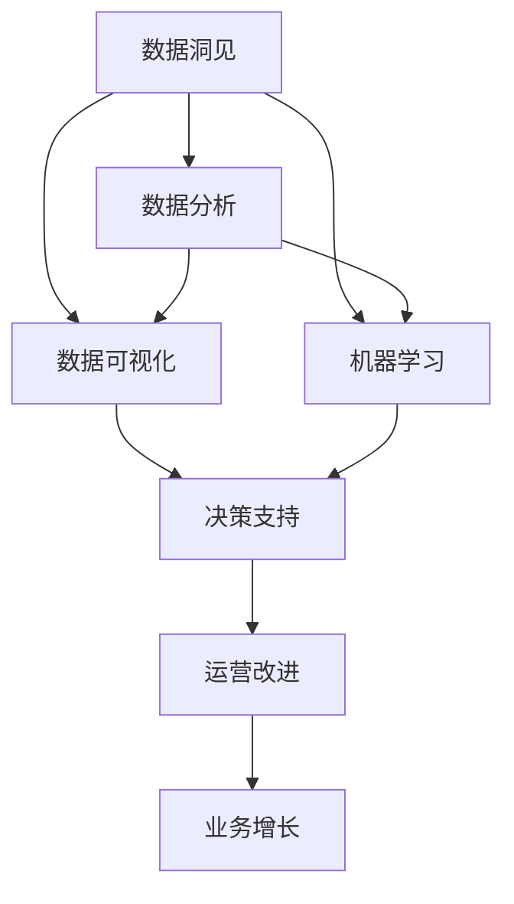

                 

## 1. 背景介绍

### 1.1 问题由来
在追求技术突破和商业成功的征途上，数据科学界和工程界一直在努力探索如何构建能够支持高效决策和持续改进的系统。数据驱动的洞察力，成为了连接过去和未来的关键桥梁。面对不断增长的数据量和复杂性，人们需要一种方法来提炼、分析和应用这些数据，以实现业务创新和竞争优势。

### 1.2 问题核心关键点
数据洞见的力量在于其能够帮助企业和组织洞察市场趋势、客户需求、运营状况以及竞争态势。有效的洞见有助于优化决策，驱动持续改进，并在快速变化的市场环境中保持竞争优势。然而，要获得这些洞见并非易事，既需要先进的技术，也需要明确的方法论和策略。

### 1.3 问题研究意义
研究和实践数据洞见的力量，对于提升数据驱动决策能力、优化运营流程、推动业务增长具有重要意义：

1. **提高决策质量**：通过数据洞见，企业可以基于实证数据而非直觉进行决策，提升决策的科学性和精确性。
2. **促进运营效率**：洞察运营中的瓶颈和问题，优化流程，提升整体运营效率。
3. **驱动业务增长**：理解市场和客户需求，及时调整策略，抓住增长机遇。
4. **增强竞争力**：通过持续改进和创新，保持市场领先地位。

## 2. 核心概念与联系

### 2.1 核心概念概述

为更好地理解数据洞见的力量，本节将介绍几个密切相关的核心概念：

- **数据洞见**：通过对大量数据进行分析和建模，提炼出有价值的见解和结论，用于指导决策和行动。
- **数据分析**：从原始数据中提取和呈现有价值的信息，包括统计分析、预测分析、描述性分析等。
- **数据可视化**：将复杂数据转换为直观的图表和图形，便于理解、分析及展示。
- **机器学习**：使用算法和模型从数据中自动学习和发现规律，预测未来趋势。
- **数据治理**：管理和保护数据质量、完整性、安全性及合规性，确保数据可用性和可信度。

这些核心概念之间的逻辑关系可以通过以下Mermaid流程图来展示：



这个流程图展示了几大核心概念及其之间的关系：

1. 数据洞见基于数据分析和机器学习，从原始数据中提炼洞察。
2. 数据分析和机器学习的结果通过数据可视化呈现，帮助理解和决策。
3. 数据洞见和可视化支持决策，提升运营效率和业务增长。

## 3. 核心算法原理 & 具体操作步骤
### 3.1 算法原理概述

数据洞见的力量源自于从海量数据中提取有价值信息的高级算法和策略。其核心在于：

- **数据预处理**：清洗、转换和集成数据，确保数据的质量和一致性。
- **统计分析**：使用统计方法探索数据中的模式、趋势和异常。
- **机器学习模型**：构建和应用机器学习模型，发现数据中的复杂关系和规律。
- **数据可视化技术**：利用图表和图形直观展示数据分析结果，辅助决策。

整体流程通常包括数据收集、预处理、建模、分析和应用五个阶段。以下详细介绍各个步骤的原理和实现。

### 3.2 算法步骤详解

1. **数据收集**：
   - 确定数据源：包括结构化数据库、非结构化文件、API接口等。
   - 数据收集工具：使用ETL工具、API调用、爬虫等手段收集数据。

2. **数据预处理**：
   - 数据清洗：去除噪声、错误和重复数据，确保数据质量。
   - 数据转换：将数据转换为机器学习算法所需的格式。
   - 数据集成：整合不同数据源的数据，形成统一的视图。

3. **建模**：
   - 选择模型：根据业务需求和数据特征选择合适的统计模型或机器学习模型。
   - 模型训练：使用历史数据训练模型，优化模型参数。
   - 模型评估：使用测试数据评估模型性能，调整模型参数。

4. **分析**：
   - 统计分析：计算均值、方差、相关性等统计量，探索数据特性。
   - 机器学习分析：应用机器学习模型预测未来趋势，发现数据中的模式。
   - 数据可视化：使用图表展示分析结果，直观展示数据洞见。

5. **应用**：
   - 决策支持：将洞见应用于决策过程，优化决策。
   - 运营改进：通过洞见指导运营策略，提升效率。
   - 业务增长：利用洞见指导业务创新和优化。

### 3.3 算法优缺点

数据洞见的力量具有以下优点：
1. **提升决策质量**：基于实证数据的决策更为科学和可靠。
2. **增强运营效率**：洞察运营中的问题和瓶颈，优化流程。
3. **促进业务增长**：及时捕捉市场和客户需求，抓住增长机会。
4. **提升竞争力**：通过持续改进和创新，保持竞争优势。

同时，也存在一些局限性：
1. **数据质量问题**：数据收集和清洗工作繁琐，需要耗费大量时间和精力。
2. **模型复杂性**：复杂的数据分析和机器学习模型对技术和资源要求较高。
3. **结果解释性**：模型结果的复杂性可能导致结果难以解释，影响决策。
4. **隐私与安全**：数据处理过程中可能涉及隐私和数据安全问题。

尽管存在这些局限性，但数据洞见的力量在实际应用中已被广泛认可，并不断得到完善和发展。

### 3.4 算法应用领域

数据洞见的力量已经广泛应用于多个领域，包括但不限于：

- **市场分析**：分析市场趋势、竞争态势、客户行为等，指导市场策略。
- **客户洞察**：理解客户需求、偏好和痛点，优化产品和服务。
- **风险管理**：识别潜在风险和异常，制定应对策略。
- **运营优化**：分析运营流程，识别瓶颈和改进点，提升效率。
- **财务分析**：洞察财务状况，优化财务决策。

这些应用领域充分展示了数据洞见在商业决策和运营优化中的重要性。

## 4. 数学模型和公式 & 详细讲解 & 举例说明

### 4.1 数学模型构建

本节将使用数学语言对数据洞见的力量进行更加严格的刻画。

记数据集为 $D=\{(x_i, y_i)\}_{i=1}^N$，其中 $x_i$ 为输入特征，$y_i$ 为输出标签。假设已知数据集 $D$ 上的训练模型为 $M_{\theta}$，其中 $\theta$ 为模型参数。

定义数据洞见 $S_{D}$ 为模型 $M_{\theta}$ 的输出，即：

$$
S_{D} = M_{\theta}(D)
$$

在实践中，我们通常使用机器学习模型对数据进行分析，如线性回归、逻辑回归、决策树、神经网络等。对于回归问题，常用的模型为线性回归模型，其数学表达式为：

$$
y_i = \theta_0 + \sum_{j=1}^n \theta_j x_{ij}
$$

对于分类问题，常用的模型为逻辑回归模型，其数学表达式为：

$$
\log\left(\frac{P(y_i=1|x_i)}{P(y_i=0|x_i)}\right) = \sum_{j=1}^n \theta_j x_{ij}
$$

### 4.2 公式推导过程

假设我们有训练集 $D$，使用逻辑回归模型 $M_{\theta}$ 进行建模，推导损失函数和梯度公式：

**损失函数**：
假设模型输出 $M_{\theta}(x_i)$ 与实际标签 $y_i$ 的差异通过二元交叉熵损失函数 $L$ 来衡量，则损失函数 $\mathcal{L}$ 定义为：

$$
\mathcal{L}(\theta) = -\frac{1}{N}\sum_{i=1}^N [y_i\log M_{\theta}(x_i) + (1-y_i)\log(1-M_{\theta}(x_i))]
$$

**梯度公式**：
损失函数对模型参数 $\theta$ 的梯度 $\nabla_{\theta}\mathcal{L}(\theta)$ 可以通过链式法则计算得到：

$$
\nabla_{\theta}\mathcal{L}(\theta) = -\frac{1}{N}\sum_{i=1}^N [(y_i-M_{\theta}(x_i))x_i]
$$

通过梯度下降等优化算法，不断更新模型参数 $\theta$，最小化损失函数 $\mathcal{L}$，直到模型收敛。

### 4.3 案例分析与讲解

以股票市场分析为例，展示数据洞见的力量。

**数据集**：
- 收集历史股价数据、公司财务数据、市场指数等，构成数据集 $D$。
- 数据预处理：清洗异常值、填补缺失值，转换数据格式。
- 建模：使用线性回归模型或神经网络模型预测未来股价走势。
- 分析：计算股价的均值、波动率、相关性等统计量，发现市场趋势和规律。
- 应用：利用洞见指导投资决策，优化投资策略，提升投资回报率。

通过这个案例，可以看到数据洞见的力量在于其能够从海量历史数据中提取有价值的规律，辅助决策和优化，实现业务目标。

## 5. 项目实践：代码实例和详细解释说明

### 5.1 开发环境搭建

在进行数据洞见项目开发前，我们需要准备好开发环境。以下是使用Python进行Pandas、NumPy、Scikit-learn等库的环境配置流程：

1. 安装Anaconda：从官网下载并安装Anaconda，用于创建独立的Python环境。

2. 创建并激活虚拟环境：
```bash
conda create -n data-insight python=3.8 
conda activate data-insight
```

3. 安装相关库：
```bash
conda install pandas numpy scikit-learn matplotlib seaborn jupyter notebook ipython
```

完成上述步骤后，即可在`data-insight`环境中开始数据洞见实践。

### 5.2 源代码详细实现

以下是一个使用Pandas和Scikit-learn进行数据预处理、建模和分析的示例代码：

```python
import pandas as pd
import numpy as np
from sklearn.linear_model import LinearRegression
from sklearn.metrics import mean_squared_error
from sklearn.model_selection import train_test_split
import matplotlib.pyplot as plt

# 读取数据
data = pd.read_csv('stock_data.csv')

# 数据预处理
data = data.dropna()
X = data[['open', 'close', 'volume']]
y = data['price']

# 划分训练集和测试集
X_train, X_test, y_train, y_test = train_test_split(X, y, test_size=0.2, random_state=42)

# 模型训练
model = LinearRegression()
model.fit(X_train, y_train)

# 模型评估
y_pred = model.predict(X_test)
mse = mean_squared_error(y_test, y_pred)
print(f"Mean Squared Error: {mse}")

# 数据可视化
plt.scatter(X_test, y_test, color='blue')
plt.plot(X_test, y_pred, color='red')
plt.xlabel('Feature')
plt.ylabel('Target')
plt.show()
```

### 5.3 代码解读与分析

让我们再详细解读一下关键代码的实现细节：

**数据读取与预处理**：
- `pd.read_csv`：使用Pandas库读取CSV文件，将数据转换为DataFrame对象。
- `data.dropna()`：删除缺失值。
- `train_test_split`：划分训练集和测试集。

**模型训练**：
- `LinearRegression`：定义线性回归模型。
- `model.fit(X_train, y_train)`：使用训练集数据拟合模型。

**模型评估**：
- `y_pred = model.predict(X_test)`：使用测试集数据进行预测。
- `mean_squared_error`：计算预测值与真实值之间的均方误差。

**数据可视化**：
- `plt.scatter`：绘制实际值与预测值的散点图。
- `plt.plot`：绘制预测值曲线。
- `plt.xlabel`和`plt.ylabel`：设置坐标轴标签。

**运行结果展示**：
- 输出预测结果的均方误差。
- 展示预测结果的散点图和拟合曲线。

通过以上代码示例，可以看到数据洞见的力量在于其能够将原始数据转换为模型输出，通过统计量和可视化工具，辅助决策和优化。

## 6. 实际应用场景

### 6.1 市场分析

在市场分析领域，数据洞见的力量可以帮助企业洞察市场趋势、预测价格波动，制定科学的投资策略。具体应用场景包括：

- **股票预测**：通过历史股价、财务数据、市场指数等，使用线性回归模型预测未来股价走势，辅助投资决策。
- **行业分析**：分析不同行业的发展趋势、竞争态势，评估行业投资价值。
- **经济预测**：利用宏观经济指标、政策变化等，预测经济走势，指导企业应对经济波动。

### 6.2 客户洞察

在客户洞察领域，数据洞见的力量可以帮助企业理解客户需求、偏好和行为，优化产品和服务。具体应用场景包括：

- **客户画像**：通过客户行为数据、购买记录等，建立客户画像，指导个性化营销。
- **客户细分**：分析客户特征，识别不同客户群体的需求和痛点，制定差异化策略。
- **市场细分**：识别市场细分领域，优化产品线和营销策略。

### 6.3 风险管理

在风险管理领域，数据洞见的力量可以帮助企业识别潜在风险和异常，制定应对策略。具体应用场景包括：

- **信用评估**：分析客户信用数据，预测信用风险，优化信贷审批流程。
- **欺诈检测**：识别异常交易行为，预防欺诈风险。
- **安全监控**：监控系统异常，识别潜在安全威胁，保障数据安全。

### 6.4 运营优化

在运营优化领域，数据洞见的力量可以帮助企业分析运营流程，识别瓶颈和改进点，提升效率。具体应用场景包括：

- **生产调度**：通过分析生产数据，优化生产计划和调度，提高生产效率。
- **供应链管理**：分析供应链数据，优化库存管理和物流调配，降低成本。
- **质量控制**：分析质量数据，优化生产过程，提升产品质量。

### 6.5 未来应用展望

随着数据洞见技术的不断进步，其在更多领域的应用前景将更加广阔。

- **医疗健康**：利用患者数据，洞察疾病趋势，指导医疗决策。
- **教育培训**：分析学生数据，优化教学策略，提升教育质量。
- **金融服务**：分析金融数据，预测市场走势，优化投资组合。
- **智能制造**：分析生产数据，优化生产流程，提升制造效率。
- **智慧城市**：分析城市数据，优化城市管理，提升城市运行效率。

## 7. 工具和资源推荐

### 7.1 学习资源推荐

为了帮助开发者系统掌握数据洞见的力量，这里推荐一些优质的学习资源：

1. 《Python数据分析基础》：入门Python数据分析和机器学习，包含Pandas、NumPy、Scikit-learn等库的详细教程。
2. 《统计学习基础》：介绍统计学基本概念和机器学习算法，适合初学者学习。
3. 《深度学习入门》：介绍深度学习框架TensorFlow和Keras，适合进阶学习者。
4. 《数据科学与数据洞见》课程：由Coursera提供，系统讲解数据洞见的基本原理和应用。
5. 《Kaggle竞赛指南》：涵盖Kaggle竞赛中的常见问题和解决方案，实战练习。

通过对这些资源的学习实践，相信你一定能够快速掌握数据洞见的力量，并用于解决实际问题。

### 7.2 开发工具推荐

高效的开发离不开优秀的工具支持。以下是几款用于数据洞见开发的常用工具：

1. Jupyter Notebook：开源的交互式计算环境，支持Python、R等多种语言，便于数据分析和可视化。
2. Tableau：强大的数据可视化工具，支持拖拽式操作，快速生成图表和仪表板。
3. Power BI：微软提供的数据可视化工具，适合BI分析师和企业级应用。
4. Google Data Studio：Google提供的免费数据可视化工具，易于使用且功能强大。
5. KNIME：开源的数据分析和机器学习平台，提供丰富的节点和工具。
6. Apache Spark：大数据处理框架，支持分布式计算，适合大规模数据分析。

合理利用这些工具，可以显著提升数据洞见的开发效率，加快创新迭代的步伐。

### 7.3 相关论文推荐

数据洞见的力量源自于对数据的深度分析和建模。以下是几篇奠基性的相关论文，推荐阅读：

1. **《A Survey on Data Mining and Statistical Learning Techniques》**：由哈佛大学学者撰写，全面综述了数据挖掘和统计学习的主要方法和应用。
2. **《Hands-On Statistics with Python》**：斯坦福大学提供的在线课程，详细讲解了Python在统计分析中的应用。
3. **《Machine Learning: A Probabilistic Perspective》**：MIT学者Tom Mitchell的经典著作，介绍了机器学习的基本原理和算法。
4. **《Data Science and Statistical Learning》**：由Coursera提供，由John Hunter教授讲授，涵盖数据科学和统计学习的基本概念和方法。
5. **《Statistical Learning with Python》**：使用Python实现统计学习的经典教材，包含丰富的代码示例和案例分析。

这些论文代表了大数据洞见技术的发展脉络。通过学习这些前沿成果，可以帮助研究者把握学科前进方向，激发更多的创新灵感。

## 8. 总结：未来发展趋势与挑战

### 8.1 总结

本文对数据洞见的力量进行了全面系统的介绍。首先阐述了数据洞见的重要性和实际应用，明确了其在提升决策质量、运营效率和业务增长方面的独特价值。其次，从原理到实践，详细讲解了数据洞见的数学模型和操作步骤，给出了数据洞见项目开发的完整代码实例。同时，本文还广泛探讨了数据洞见在市场分析、客户洞察、风险管理、运营优化等多个行业领域的应用前景，展示了数据洞见技术的巨大潜力。此外，本文精选了数据洞见技术的各类学习资源，力求为读者提供全方位的技术指引。

通过本文的系统梳理，可以看到，数据洞见的力量正在成为推动企业决策和运营的重要技术，极大地提升了数据的利用价值。未来，伴随技术的不断进步，数据洞见将在更多领域发挥更加重要的作用，深刻影响企业的战略决策和运营优化。

### 8.2 未来发展趋势

展望未来，数据洞见技术将呈现以下几个发展趋势：

1. **技术融合**：数据洞见与人工智能、大数据、云计算等技术的深度融合，推动智能决策和智慧运营。
2. **数据集成**：利用数据集成技术，整合异构数据源，形成统一的数据视图，支持全面分析。
3. **实时分析**：利用流数据处理技术，实现实时分析，支持快速响应。
4. **自动化分析**：通过自动机器学习（AutoML）技术，自动化数据建模和分析过程，降低技术门槛。
5. **多模态分析**：结合视觉、听觉、文本等多模态数据，提升分析深度和精度。
6. **隐私保护**：加强数据隐私保护和合规性管理，确保数据安全。

以上趋势凸显了数据洞见技术的广阔前景。这些方向的探索发展，必将进一步提升数据的利用价值，为企业的决策和运营带来更多支持。

### 8.3 面临的挑战

尽管数据洞见技术已经取得了瞩目成就，但在迈向更加智能化、普适化应用的过程中，它仍面临着诸多挑战：

1. **数据质量问题**：数据收集和清洗工作繁琐，需要耗费大量时间和精力。
2. **模型复杂性**：复杂的数据分析和机器学习模型对技术和资源要求较高。
3. **结果解释性**：模型结果的复杂性可能导致结果难以解释，影响决策。
4. **隐私与安全**：数据处理过程中可能涉及隐私和数据安全问题。
5. **资源消耗**：大规模数据分析和建模对计算资源和存储资源要求较高。
6. **数据孤岛**：不同系统之间的数据共享和集成存在困难，形成数据孤岛。

尽管存在这些挑战，但通过不断改进技术、优化流程和加强治理，相信数据洞见技术将逐步克服这些难题，为企业的决策和运营提供更加坚实的数据基础。

### 8.4 研究展望

未来，数据洞见技术的研究方向可以从以下几个方面进行探索：

1. **自动化数据治理**：利用自动化技术，提升数据治理效率和数据质量。
2. **自适应分析**：基于数据特征和业务需求，自动调整分析方法和模型。
3. **跨领域应用**：将数据洞见技术应用于更多领域，拓展应用范围。
4. **数据可视化创新**：开发新型数据可视化工具，提升用户体验。
5. **隐私保护技术**：研究数据隐私保护的新方法和新技术。
6. **多模态融合**：结合多种数据源和模态，提升分析深度和精度。

这些研究方向将推动数据洞见技术不断演进，提升其在商业决策和运营优化中的价值。

## 9. 附录：常见问题与解答

**Q1：数据洞见与数据驱动决策有什么区别？**

A: 数据洞见是通过分析数据提炼出的有价值见解，而数据驱动决策是基于这些洞见指导决策和行动的过程。数据洞见是数据驱动决策的基础，提供洞察和依据，而决策则是基于洞见采取的具体行动。

**Q2：数据洞见是否适用于所有业务场景？**

A: 数据洞见适用于数据量较大、业务需求明确、数据可获取性高的业务场景。但对于某些特定领域，如医学、法律等，由于数据敏感性和隐私保护问题，数据洞见的应用需要更加谨慎。

**Q3：如何确保数据的质量和完整性？**

A: 数据质量管理和数据治理是数据洞见的关键。通过数据清洗、数据标准化、数据校验等方法，确保数据质量和完整性。同时，利用数据质量管理工具，自动监控数据质量和数据质量指标。

**Q4：如何处理复杂的数据分析任务？**

A: 复杂数据分析任务通常需要跨领域的知识和技术。可以利用多种数据分析工具和方法，如Python、R、SQL、Tableau等，结合机器学习和统计学方法，逐步解决复杂问题。

**Q5：如何平衡数据隐私和数据洞见？**

A: 数据隐私保护是数据洞见过程中必须考虑的因素。可以采用数据匿名化、数据加密、差分隐私等技术，在保护隐私的前提下，获取数据洞见。同时，建立数据使用的合规性和监管机制，确保数据使用的透明性和可控性。

---

作者：禅与计算机程序设计艺术 / Zen and the Art of Computer Programming

