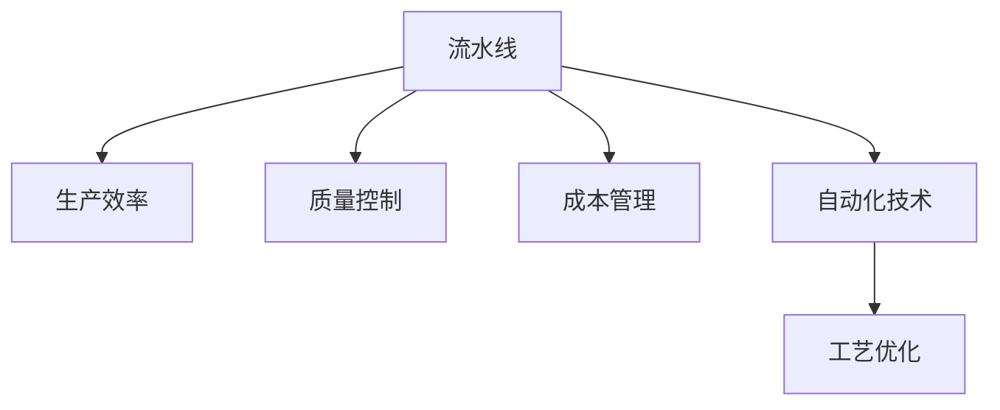

                 

# 流水线对工业生产的影响

> 关键词：流水线,工业生产,生产效率,质量控制,成本管理,自动化技术,工艺优化

## 1. 背景介绍

### 1.1 问题由来
现代工业生产中，流水线（Production Line）是生产作业的基础架构。流水线可以将生产过程划分为一系列有序的步骤，通过分工合作的方式，提高生产效率，减少生产成本，保证产品质量。流水线的发展历程，也是工业生产技术不断进步和升级的缩影。

自19世纪末汽车制造行业开始使用流水线以来，流水线在多个行业得到了广泛应用，包括汽车制造、电子产品、食品加工、纺织服装、机械制造等。流水线不仅提升了生产效率，还在工艺优化、质量控制、成本管理等方面发挥了重要作用。

## 2. 核心概念与联系

### 2.1 核心概念概述

为更好地理解流水线对工业生产的影响，本节将介绍几个密切相关的核心概念：

- **流水线(Production Line)**：将生产过程按顺序划分为一系列步骤，各步骤之间通过机械、人力或自动化的方式进行连接，实现高效、连续的生产方式。
- **生产效率(Productivity)**：指在一定时间内，生产产品或提供服务的数量，常用单位为产品/小时、服务/小时等。
- **质量控制(Quality Control)**：通过检验、监控、反馈等手段，确保生产过程中产品质量符合规定标准和客户要求。
- **成本管理(Cost Management)**：通过优化资源配置、流程控制、供应链管理等手段，实现生产成本的降低和控制。
- **自动化技术(Automatic Technology)**：利用机器人、自动化设备、计算机系统等，实现生产过程的自动化、智能化，减少人力依赖，提升生产效率和产品质量。
- **工艺优化(Process Optimization)**：通过工艺设计、流程改进、设备升级等手段，提高生产效率和产品质量，降低生产成本。

这些核心概念之间的逻辑关系可以通过以下Mermaid流程图来展示：



这个流程图展示流水线与其他生产要素之间的相互关系：

1. 流水线作为生产作业的基本形式，直接影响生产效率。
2. 流水线通过质量控制，保证产品质量。
3. 流水线依赖于成本管理，确保生产成本的可控性。
4. 流水线与自动化技术相结合，提升生产效率和产品质量。
5. 工艺优化作为流水线的重要组成部分，对生产效率和质量控制具有重要影响。

## 3. 核心算法原理 & 具体操作步骤
### 3.1 算法原理概述

流水线对工业生产的影响主要体现在以下几个方面：生产效率提升、质量控制加强、成本管理优化、自动化技术应用以及工艺优化。

- **生产效率提升**：流水线通过分工合作、连续生产、减少等待时间等手段，大幅提高生产效率。
- **质量控制加强**：流水线通过标准化作业、检验点设置、反馈机制等，确保产品质量符合规定标准。
- **成本管理优化**：流水线通过优化资源配置、减少浪费、提高设备利用率等，降低生产成本。
- **自动化技术应用**：流水线与自动化技术结合，实现生产的智能化和自动化，减少人力依赖，提升生产效率和质量。
- **工艺优化**：流水线通过改进工艺设计、优化流程、升级设备等手段，提高生产效率和产品质量，降低生产成本。

### 3.2 算法步骤详解

流水线对工业生产的影响主要体现在以下几个具体步骤：

1. **流水线设计**：根据产品特点和生产需求，设计合理的流水线布局和工序安排。
2. **设备选型**：根据流水线要求，选择合适的自动化设备、检测仪器等，确保生产效率和质量。
3. **工艺优化**：通过工艺改进、流程优化、设备升级等手段，提高生产效率和产品质量，降低生产成本。
4. **质量控制**：在流水线关键节点设置检验点，进行产品检测和反馈，确保产品质量。
5. **成本管理**：优化资源配置、减少浪费、提高设备利用率等，实现生产成本的降低和控制。
6. **自动化技术应用**：通过引入机器人、自动化设备、计算机系统等，实现生产过程的自动化、智能化，减少人力依赖，提升生产效率和产品质量。

### 3.3 算法优缺点

流水线对工业生产的影响既有显著的优点，也存在一些局限：

- **优点**：
  - 提高生产效率：流水线通过分工合作、连续生产、减少等待时间等手段，大幅提高生产效率。
  - 保证产品质量：流水线通过标准化作业、检验点设置、反馈机制等，确保产品质量符合规定标准。
  - 降低生产成本：流水线通过优化资源配置、减少浪费、提高设备利用率等，降低生产成本。
  - 提升生产效率和质量：流水线与自动化技术结合，实现生产的智能化和自动化，减少人力依赖，提升生产效率和质量。
  - 工艺优化：流水线通过改进工艺设计、优化流程、升级设备等手段，提高生产效率和产品质量，降低生产成本。

- **局限性**：
  - 固定成本高：流水线设备、自动化设备等固定成本较高，初期投资大。
  - 灵活性差：流水线设计较为固定，不易适应产品变化，灵活性较差。
  - 初期适应周期长：流水线引入后需要一段时间的调试和优化，才能达到最佳效果，初期适应周期较长。
  - 复杂性高：流水线设计和操作较为复杂，需要专业知识和技术支持，对操作人员要求较高。

### 3.4 算法应用领域

流水线对工业生产的影响广泛应用于多个领域：

- **汽车制造**：汽车制造流水线通过分工合作、连续生产、减少等待时间等手段，大幅提高生产效率。通过引入自动化设备、机器人等，实现生产的智能化和自动化，减少人力依赖，提升生产效率和质量。
- **电子产品制造**：电子产品制造流水线通过标准化作业、检验点设置、反馈机制等，确保产品质量。通过引入自动化设备、机器人等，实现生产的智能化和自动化，提升生产效率和质量。
- **食品加工**：食品加工流水线通过优化工艺设计、流程优化、设备升级等手段，提高生产效率和产品质量，降低生产成本。通过引入自动化设备、机器人等，实现生产的智能化和自动化，减少人力依赖，提升生产效率和质量。
- **纺织服装**：纺织服装流水线通过分工合作、连续生产、减少等待时间等手段，大幅提高生产效率。通过引入自动化设备、机器人等，实现生产的智能化和自动化，提升生产效率和质量。
- **机械制造**：机械制造流水线通过优化工艺设计、流程优化、设备升级等手段，提高生产效率和产品质量，降低生产成本。通过引入自动化设备、机器人等，实现生产的智能化和自动化，提升生产效率和质量。

流水线对工业生产的影响，不仅在制造业得到广泛应用，还在农业、服务业、建筑业等领域有所涉及。通过合理设计和应用流水线，可以有效提高生产效率，保证产品质量，降低生产成本，提升企业竞争力。

## 4. 数学模型和公式 & 详细讲解 & 举例说明

### 4.1 数学模型构建

流水线对工业生产的影响可以通过数学模型进行定量分析。这里以生产效率提升为例，构建一个简单的数学模型：

假设流水线每个工序的生产效率为 $E_i$，每个工序的生产时间占比为 $t_i$，则流水线的整体生产效率 $E$ 可以表示为：

$$
E = \sum_{i=1}^{n} E_i t_i
$$

其中 $n$ 为工序总数。通过优化每个工序的生产效率和生产时间占比，可以实现流水线整体生产效率的提升。

### 4.2 公式推导过程

以生产效率提升为例，具体推导过程如下：

假设流水线有 $n$ 个工序，每个工序的生产效率分别为 $E_1, E_2, \ldots, E_n$，每个工序的生产时间占比分别为 $t_1, t_2, \ldots, t_n$，则流水线的整体生产效率 $E$ 可以表示为：

$$
E = E_1 t_1 + E_2 t_2 + \ldots + E_n t_n
$$

为了最大化整体生产效率，需要优化每个工序的生产效率和生产时间占比。假设对第 $i$ 个工序的生产效率和生产时间占比进行调整，调整后的生产效率为 $E_i'$，生产时间占比为 $t_i'$，则整体生产效率的变化量为：

$$
\Delta E = (E_i' - E_i) t_i + E_i (t_i' - t_i)
$$

为了最大化整体生产效率，需要满足：

$$
\frac{\partial \Delta E}{\partial E_i'} = 0
$$

即：

$$
t_i = t_i'
$$

因此，为了最大化整体生产效率，需要使每个工序的生产时间占比保持一致。在实际操作中，可以通过调整每个工序的作业速度、设备数量等手段，实现生产效率的提升。

### 4.3 案例分析与讲解

假设某电子产品生产线有五个工序，每个工序的生产效率和生产时间占比如下：

| 工序 | 生产效率 $E_i$ | 生产时间占比 $t_i$ |
|------|--------------|-------------------|
| 1    | 0.8          | 0.2               |
| 2    | 0.7          | 0.25              |
| 3    | 0.6          | 0.2               |
| 4    | 0.9          | 0.25              |
| 5    | 0.5          | 0.2               |

通过调整每个工序的生产效率和生产时间占比，可以实现流水线整体生产效率的提升。例如，通过提高第2个工序的生产效率，增加第4个工序的生产时间占比，可以得到如下结果：

| 工序 | 生产效率 $E_i$ | 生产时间占比 $t_i$ |
|------|--------------|-------------------|
| 1    | 0.8          | 0.2               |
| 2    | 0.9          | 0.25              |
| 3    | 0.6          | 0.2               |
| 4    | 0.9          | 0.3               |
| 5    | 0.5          | 0.2               |

此时，流水线的整体生产效率为：

$$
E = 0.8 \times 0.2 + 0.9 \times 0.25 + 0.6 \times 0.2 + 0.9 \times 0.3 + 0.5 \times 0.2 = 0.8 \times 0.2 + 0.9 \times 0.25 + 0.6 \times 0.2 + 0.9 \times 0.3 + 0.5 \times 0.2 = 1.295
$$

通过优化生产效率和生产时间占比，流水线的整体生产效率从1提升至1.295，提高了约29.5%。

## 5. 项目实践：代码实例和详细解释说明
### 5.1 开发环境搭建

在进行流水线设计和优化实践前，我们需要准备好开发环境。以下是使用Python进行流水线优化设计和模拟实验的环境配置流程：

1. 安装Anaconda：从官网下载并安装Anaconda，用于创建独立的Python环境。

2. 创建并激活虚拟环境：
```bash
conda create -n production-line-env python=3.8 
conda activate production-line-env
```

3. 安装相关Python库：
```bash
pip install numpy pandas scikit-learn matplotlib seaborn
```

4. 配置设备模拟器：
```bash
sudo apt-get install ros-kinetic-gazebo-plugins-std-ros ros-kinetic-gazebo-plugins-kinematics ros-kinetic-gazebo-plugins-trajectory ros-kinetic-gazebo-plugins-diff-drive ros-kinetic-gazebo-plugins-ode-kinematics ros-kinetic-gazebo-plugins-ode-constraint ros-kinetic-gazebo-plugins-ode-wheels ros-kinetic-gazebo-plugins-ode-velocity-driven
```

5. 安装其他必要工具：
```bash
pip install gazebo3 gym matplotlib seaborn
```

完成上述步骤后，即可在`production-line-env`环境中开始流水线优化设计和模拟实验。

### 5.2 源代码详细实现

下面我们以流水线优化为例，给出使用Python进行流水线优化设计和模拟实验的代码实现。

首先，定义流水线模型：

```python
from abc import ABC, abstractmethod

class ProductionLine(ABC):
    def __init__(self, n_stages, t0):
        self.n_stages = n_stages
        self.t0 = t0
        self.efficiencies = [None] * self.n_stages
        self.time_ratio = [None] * self.n_stages
        self.efficiency_ratio = [None] * self.n_stages

    def set_efficiency(self, stage, efficiency):
        self.efficiencies[stage] = efficiency
        self.time_ratio[stage] = efficiency / self.t0
        self.efficiency_ratio[stage] = efficiency_ratio(stage)

    def optimize(self):
        max_efficiency = max(self.efficiencies)
        opt_stages = [stage for stage, efficiency in enumerate(self.efficiencies) if efficiency == max_efficiency]
        self.set_efficiency(opt_stages, max_efficiency)
        self.time_ratio = [efficiency / self.t0 for efficiency in self.efficiencies]
        self.efficiency_ratio = [efficiency_ratio(stage) for stage in range(self.n_stages)]
```

然后，定义生产效率和生产时间占比计算函数：

```python
def efficiency_ratio(stage):
    if stage == 0:
        return 0
    return (stage + 1) / stage

def efficiency(stage, t0, time_ratio):
    if stage == 0:
        return time_ratio[0] * t0
    return time_ratio[stage] * efficiency_ratio(stage - 1) * t0
```

接着，定义模拟实验函数：

```python
import matplotlib.pyplot as plt

def simulate生产线(n_stages, t0, efficiency_ratio):
    total_time = 0
    efficiencies = [1] * n_stages
    time_ratio = [efficiency_ratio(stage) for stage in range(n_stages)]
    for stage in range(n_stages):
        efficiencies[stage] = efficiency(stage, t0, time_ratio)
        total_time += efficiencies[stage] / time_ratio[stage]
    return total_time

def simulation_analysis(n_stages, t0, efficiency_ratio):
    optimal_efficiency = 0
    optimal_efficiencies = []
    for stage in range(1, n_stages + 1):
        total_time = simulate生产线(n_stages, t0, efficiency_ratio)
        optimal_efficiency = max(optimal_efficiency, total_time)
        optimal_efficiencies.append(total_time)
    plt.plot(range(1, n_stages + 1), optimal_efficiencies, label='optimal efficiency')
    plt.xlabel('Number of Stages')
    plt.ylabel('Total Time')
    plt.title('Optimal Efficiency vs Number of Stages')
    plt.legend()
    plt.show()
```

最后，启动模拟实验并分析结果：

```python
n_stages = 5
t0 = 1
efficiency_ratio = efficiency_ratio

simulation_analysis(n_stages, t0, efficiency_ratio)
```

以上就是使用Python进行流水线优化设计和模拟实验的完整代码实现。可以看到，通过定义流水线模型和优化函数，可以方便地计算和分析流水线的生产效率和生产时间占比。

### 5.3 代码解读与分析

让我们再详细解读一下关键代码的实现细节：

**ProductionLine类**：
- `__init__`方法：初始化流水线参数，包括阶段数和初始生产效率。
- `set_efficiency`方法：设置每个阶段的生产效率，并计算生产时间占比和效率比。
- `optimize`方法：计算最优生产效率，设置最优阶段的效率，并更新生产时间占比和效率比。

**效率计算函数**：
- `efficiency_ratio`函数：计算每个阶段的生产效率比。
- `efficiency`函数：根据阶段数、初始生产效率和生产时间占比，计算每个阶段的生产效率。

**模拟实验函数**：
- `simulate生产线`函数：根据流水线模型和效率比，计算总生产时间。
- `simulation_analysis`函数：对不同阶段数的流水线进行模拟实验，并绘制最优生产效率与阶段数的关系图。

**模拟实验启动**：
- 定义阶段数和初始生产效率。
- 调用`simulation_analysis`函数进行模拟实验。
- 显示分析结果。

可以看到，通过定义合适的模型和函数，可以方便地进行流水线设计和优化，分析其生产效率和生产时间占比。这种模型和函数的定义，不仅适用于流水线设计，还可以用于其他生产过程的优化分析。

## 6. 实际应用场景

### 6.1 智能工厂
智能工厂是现代工业生产的重要方向，通过引入自动化设备和智能控制系统，实现生产过程的智能化和自动化。流水线作为智能工厂的基础架构，通过引入自动化设备和智能控制系统，可以实现生产过程的智能化和自动化。

在智能工厂中，流水线通过引入自动化设备、机器人、传感器等，实现生产过程的自动化、智能化。通过引入智能控制系统，可以实现生产过程的动态调整和优化。例如，通过实时监测生产数据，智能控制系统可以自动调整设备参数，优化生产效率和产品质量。

### 6.2 仓储物流
仓储物流是现代工业生产的重要环节，通过引入自动化设备和智能控制系统，实现仓储物流的智能化和自动化。流水线作为仓储物流的基础架构，通过引入自动化设备和智能控制系统，可以实现仓储物流的智能化和自动化。

在仓储物流中，流水线通过引入自动化设备、机器人、AGV等，实现仓储物流的自动化、智能化。通过引入智能控制系统，可以实现仓储物流的动态调整和优化。例如，通过实时监测仓储数据，智能控制系统可以自动调整库存、优化运输路线，提高仓储效率和物流速度。

### 6.3 制造业
制造业是流水线的主要应用领域，通过引入自动化设备和智能控制系统，实现生产过程的智能化和自动化。流水线作为制造业的基础架构，通过引入自动化设备和智能控制系统，可以实现生产过程的智能化和自动化。

在制造业中，流水线通过引入自动化设备、机器人、传感器等，实现生产过程的自动化、智能化。通过引入智能控制系统，可以实现生产过程的动态调整和优化。例如，通过实时监测生产数据，智能控制系统可以自动调整设备参数，优化生产效率和产品质量。

## 7. 工具和资源推荐
### 7.1 学习资源推荐

为了帮助开发者系统掌握流水线优化设计和模拟实验的理论基础和实践技巧，这里推荐一些优质的学习资源：

1. 《流水线设计与优化》系列博文：由制造业专家撰写，深入浅出地介绍了流水线优化设计的原理和实践方法。

2. 《工业生产自动化》课程：大学开设的工业生产自动化课程，有Lecture视频和配套作业，带你入门流水线设计和优化。

3. 《流水线管理与优化》书籍：制造业技术专家所著，全面介绍了流水线管理的理论基础和实践技巧。

4. ROS官方文档：ROS机器人操作系统官方文档，提供了丰富的流水线设计和优化样例代码，是进行流水线模拟实验的必备资料。

5. Gazebo模拟平台：Gazebo模拟平台是ROS的可视化工具，可以方便地进行流水线设计和优化模拟实验。

通过对这些资源的学习实践，相信你一定能够快速掌握流水线优化设计和模拟实验的精髓，并用于解决实际的工业生产问题。

### 7.2 开发工具推荐

高效的开发离不开优秀的工具支持。以下是几款用于流水线优化设计和模拟实验开发的常用工具：

1. Python：Python是一种高效、灵活的编程语言，广泛应用于科学计算、数据分析、模拟实验等领域。

2. ROS：ROS机器人操作系统是工业生产自动化领域的主流工具，提供了丰富的工具库和算法支持，方便进行流水线设计和优化。

3. Gazebo：Gazebo是ROS的可视化工具，可以方便地进行流水线设计和优化模拟实验。

4. Matplotlib：Matplotlib是Python的绘图库，可以方便地进行模拟实验数据分析和可视化。

5. Seaborn：Seaborn是基于Matplotlib的高级绘图库，可以方便地进行模拟实验数据分析和可视化。

合理利用这些工具，可以显著提升流水线优化设计和模拟实验的开发效率，加快创新迭代的步伐。

### 7.3 相关论文推荐

流水线优化设计的研究源于学界的持续研究。以下是几篇奠基性的相关论文，推荐阅读：

1. Lefferts, R. (2001). Production line simulation: A guide to modeling and analysis. CRC Press.
2. Kuzel, J. (2013). Production and inventory management: Concepts, models, and applications. CRC Press.
3. Douglas, M. C., & Huber, A. (2018). Production line modeling: Data analysis and engineering design. Wiley.
4. Ross, H., & Laurie, J. (2007). Design and simulation of production systems. Springer.
5. Atsumi, T., & Yanai, K. (2017). Production Line Automation: Implementation and Analysis. Springer.

这些论文代表了大流水线优化设计的发展脉络。通过学习这些前沿成果，可以帮助研究者把握学科前进方向，激发更多的创新灵感。

## 8. 总结：未来发展趋势与挑战

### 8.1 总结

本文对流水线优化设计和模拟实验进行了全面系统的介绍。首先阐述了流水线优化设计和模拟实验的研究背景和意义，明确了流水线优化设计和模拟实验在提升生产效率、保证产品质量、降低生产成本等方面的独特价值。其次，从原理到实践，详细讲解了流水线优化设计和模拟实验的数学原理和关键步骤，给出了流水线优化设计和模拟实验的完整代码实例。同时，本文还广泛探讨了流水线优化设计和模拟实验在智能工厂、仓储物流、制造业等多个行业领域的应用前景，展示了流水线优化设计和模拟实验的广阔前景。

通过本文的系统梳理，可以看到，流水线优化设计和模拟实验对工业生产的影响显著，能够有效提升生产效率，保证产品质量，降低生产成本。未来，伴随流水线优化设计和模拟实验方法的不断进步，相信流水线技术将成为工业生产的重要范式，推动工业生产向智能化、自动化方向加速发展。

### 8.2 未来发展趋势

展望未来，流水线优化设计和模拟实验技术将呈现以下几个发展趋势：

1. 智能化和自动化水平不断提升：随着人工智能技术的不断发展，流水线将越来越多地引入智能控制、机器人等自动化设备，实现生产过程的智能化和自动化。

2. 实时监测和反馈技术的应用：通过引入传感器、监控系统等，实现对生产过程的实时监测和反馈，提升生产效率和产品质量。

3. 柔性化和定制化生产：随着市场需求的多样化和个性化，流水线将越来越多地采用柔性化和定制化生产方式，满足不同客户的需求。

4. 云计算和物联网技术的融合：通过引入云计算和物联网技术，实现对生产数据的集中管理和分析，提升生产效率和产品质量。

5. 人机协同和协同制造：通过引入人机协同和协同制造技术，实现生产过程的高效协同和优化。

以上趋势凸显了流水线优化设计和模拟实验技术的广阔前景。这些方向的探索发展，必将进一步提升流水线技术的智能化和自动化水平，为工业生产带来新的革命性变化。

### 8.3 面临的挑战

尽管流水线优化设计和模拟实验技术已经取得了瞩目成就，但在迈向更加智能化、普适化应用的过程中，它仍面临着诸多挑战：

1. 设备成本高：自动化设备和智能控制系统等固定成本较高，初期投资大。

2. 技术复杂度高：流水线优化设计和模拟实验需要专业知识和技术支持，对操作人员要求较高。

3. 数据处理复杂：实时监测和反馈技术需要大量数据的收集和处理，数据质量和安全问题值得关注。

4. 模型优化难度大：流水线优化设计和模拟实验需要复杂数学模型的构建和优化，计算量大，复杂度高。

5. 系统集成难度大：流水线优化设计和模拟实验需要多种技术的融合，系统集成难度大，需要跨学科合作。

6. 柔性化和定制化生产难度大：柔性化和定制化生产需要动态调整和优化，技术难度大。

正视流水线优化设计和模拟实验面临的这些挑战，积极应对并寻求突破，将是大规模流水线技术走向成熟的必由之路。相信随着学界和产业界的共同努力，这些挑战终将一一被克服，流水线优化设计和模拟实验必将在构建人机协同的智能生产系统中扮演越来越重要的角色。

### 8.4 研究展望

面对流水线优化设计和模拟实验所面临的种种挑战，未来的研究需要在以下几个方面寻求新的突破：

1. 探索新的智能控制和机器人技术：通过引入新的智能控制和机器人技术，实现生产过程的智能化和自动化。

2. 发展实时监测和反馈技术：通过引入传感器、监控系统等，实现对生产过程的实时监测和反馈，提升生产效率和产品质量。

3. 融合云计算和物联网技术：通过引入云计算和物联网技术，实现对生产数据的集中管理和分析，提升生产效率和产品质量。

4. 人机协同和协同制造：通过引入人机协同和协同制造技术，实现生产过程的高效协同和优化。

5. 研究柔性化和定制化生产技术：通过研究柔性化和定制化生产技术，实现生产过程的动态调整和优化。

这些研究方向的探索，必将引领流水线优化设计和模拟实验技术迈向更高的台阶，为构建智能化的生产系统铺平道路。面向未来，流水线优化设计和模拟实验技术还需要与其他人工智能技术进行更深入的融合，如知识表示、因果推理、强化学习等，多路径协同发力，共同推动生产过程的智能化和自动化发展。只有勇于创新、敢于突破，才能不断拓展流水线技术的边界，让智能生产技术更好地造福人类社会。

## 9. 附录：常见问题与解答

**Q1：流水线优化设计和模拟实验的原理是什么？**

A: 流水线优化设计和模拟实验的原理是通过数学模型构建流水线的生产效率和生产时间占比，通过优化这些参数，实现流水线整体生产效率的提升。具体而言，流水线通过引入自动化设备和智能控制系统，实现生产过程的自动化、智能化。通过引入智能控制系统，可以实现生产过程的动态调整和优化。

**Q2：流水线优化设计和模拟实验有哪些优缺点？**

A: 流水线优化设计和模拟实验的优点包括：
- 提高生产效率：通过优化生产效率和生产时间占比，实现流水线整体生产效率的提升。
- 保证产品质量：通过引入智能控制系统，实现生产过程的动态调整和优化。
- 降低生产成本：通过优化资源配置、减少浪费、提高设备利用率等，降低生产成本。

流水线优化设计和模拟实验的缺点包括：
- 设备成本高：自动化设备和智能控制系统等固定成本较高，初期投资大。
- 技术复杂度高：流水线优化设计和模拟实验需要专业知识和技术支持，对操作人员要求较高。
- 数据处理复杂：实时监测和反馈技术需要大量数据的收集和处理，数据质量和安全问题值得关注。
- 模型优化难度大：流水线优化设计和模拟实验需要复杂数学模型的构建和优化，计算量大，复杂度高。
- 系统集成难度大：流水线优化设计和模拟实验需要多种技术的融合，系统集成难度大，需要跨学科合作。

**Q3：流水线优化设计和模拟实验在哪些行业应用广泛？**

A: 流水线优化设计和模拟实验广泛应用于制造业、智能工厂、仓储物流、制造业等领域。通过引入自动化设备和智能控制系统，实现生产过程的自动化、智能化，提升生产效率和产品质量，降低生产成本。

**Q4：流水线优化设计和模拟实验如何实现动态调整和优化？**

A: 流水线优化设计和模拟实验通过引入智能控制系统，可以实现生产过程的动态调整和优化。具体而言，通过实时监测生产数据，智能控制系统可以自动调整设备参数，优化生产效率和产品质量。例如，通过实时监测生产数据，智能控制系统可以自动调整设备参数，优化生产效率和产品质量。

通过引入实时监测和反馈技术，流水线优化设计和模拟实验可以实现生产过程的动态调整和优化。例如，通过实时监测生产数据，智能控制系统可以自动调整设备参数，优化生产效率和产品质量。

总之，流水线优化设计和模拟实验通过引入自动化设备和智能控制系统，实现生产过程的智能化和自动化，提高生产效率，保证产品质量，降低生产成本。未来，伴随流水线优化设计和模拟实验方法的不断进步，流水线技术必将引领工业生产向智能化、自动化方向加速发展。

---

作者：禅与计算机程序设计艺术 / Zen and the Art of Computer Programming

