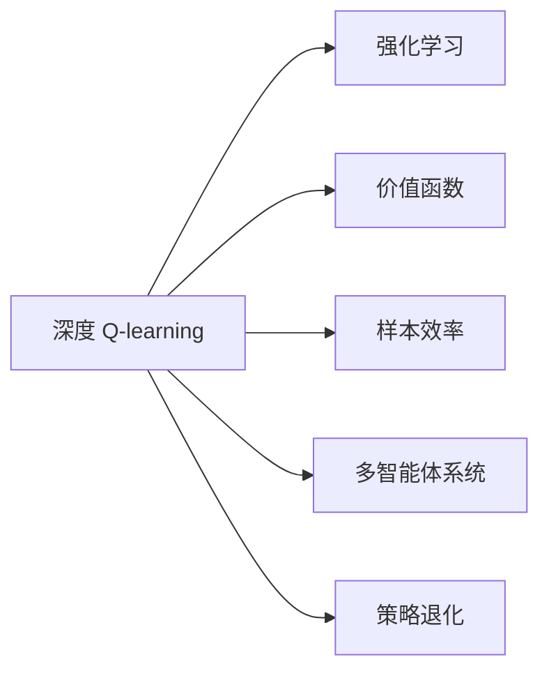

                 

## 1. 背景介绍

### 1.1 问题由来

深度 Q-learning（DQN）作为强化学习（RL）的里程碑式算法，在解决高维度、连续状态和动作空间下的决策优化问题上，取得了突破性的成果。从Atari游戏到机器人控制，DQN算法不断拓展其应用场景，成为人工智能和机器学习领域的核心技术之一。然而，随着研究的深入，DQN在应用中逐渐暴露出一些局限性，如收敛速度慢、样本效率低、策略退化等问题，这些问题也成为未来研究方向的重要内容。

### 1.2 问题核心关键点

未来深度 Q-learning 的发展方向主要集中在以下几个关键点：
- 样本效率的提升：如何提高DQN在稀疏奖励环境下的样本利用率。
- 多智能体协同：探索多智能体系统中DQN的扩展性和鲁棒性。
- 学习效率的加速：如何快速适应复杂环境，优化DQN的训练过程。
- 对抗性安全：如何防止模型被恶意攻击或误导。
- 可解释性增强：提升DQN模型的可解释性和可理解性。
- 泛化能力的加强：扩展DQN在未知环境中的泛化能力。

### 1.3 问题研究意义

深度 Q-learning 在多个应用场景中取得了显著的成果，提升了智能决策的效率和效果。然而，其在实际应用中仍存在诸多挑战。因此，研究未来深度 Q-learning 的发展方向，对于推动强化学习的进步，提高智能系统的决策能力，具有重要的理论和实践意义。

## 2. 核心概念与联系

### 2.1 核心概念概述

为了更好地理解深度 Q-learning 的发展方向，本节将介绍几个核心概念及其相互联系：

- **深度 Q-learning (DQN)**：基于深度神经网络优化强化学习决策模型的算法，通过近似Q值函数优化决策策略，以解决高维度、连续状态和动作空间下的决策问题。

- **强化学习 (RL)**：一种通过智能体与环境交互，不断调整策略以优化目标函数的学习框架。DQN是RL中一个重要的分支算法。

- **价值函数**：描述智能体在不同状态下获得长期奖励的预测模型，Q值函数是其特例，用于评估动作的价值。

- **样本效率**：指算法在给定训练样本量的情况下，获得最优策略的效率。

- **多智能体系统**：多个智能体在相同或不同的环境中进行决策和学习，通过协作或竞争，共同优化全局最优策略。

- **策略退化**：在训练过程中，模型出现的策略不稳定、波动较大的现象。

这些核心概念之间的逻辑关系可以通过以下Mermaid流程图来展示：



这个流程图展示了深度 Q-learning 的核心概念及其之间的联系：

1. DQN是强化学习的一种具体算法。
2. 通过价值函数和样本效率，DQN优化决策策略。
3. 多智能体系统拓展了DQN的应用范围。
4. 策略退化是DQN需要解决的问题之一。

## 3. 核心算法原理 & 具体操作步骤

### 3.1 算法原理概述

深度 Q-learning 的核心思想是通过深度神经网络逼近Q值函数，优化智能体在特定环境下的策略。其基本流程包括：
- 环境建模：定义智能体与环境交互的模型。
- 价值函数学习：通过近似Q值函数，学习智能体在不同状态下的期望奖励。
- 策略优化：选择最优策略，最大化期望奖励。
- 样本更新：根据Q值函数的输出，更新网络参数。

### 3.2 算法步骤详解

深度 Q-learning 的算法步骤如下：

**Step 1: 环境建模**
- 定义环境状态空间 $\mathcal{S}$，如Atari游戏中的像素数据、机器人控制中的关节角度等。
- 定义动作空间 $\mathcal{A}$，如Atari游戏中的按键动作、机器人控制中的关节速度等。

**Step 2: 初始化网络**
- 初始化Q值函数网络 $\theta$，参数 $\theta_0$ 为随机值。

**Step 3: 样本生成**
- 在每个时间步 $t$，观察当前状态 $s_t$，随机选择一个动作 $a_t$。
- 执行动作 $a_t$，观察下一个状态 $s_{t+1}$，获得奖励 $r_{t+1}$。

**Step 4: 策略更新**
- 根据Q值函数 $\hat{Q}^\theta(s_t, a_t)$，计算动作的预测奖励 $\hat{r}_t$。
- 如果 $\hat{r}_t$ 已经达到最大，直接返回 $s_t$，结束迭代。
- 否则，根据Q值函数，更新策略 $\pi(a_t|s_t)$。

**Step 5: 样本更新**
- 使用目标Q值函数 $Q^\theta$，计算目标动作值 $Q^\theta(s_t, a_t, s_{t+1})$。
- 更新当前Q值函数网络 $\theta$，以最小化预测误差 $L(\theta)$。

### 3.3 算法优缺点

深度 Q-learning 的优点包括：
- 解决高维度、连续状态和动作空间下的决策问题。
- 通过近似Q值函数，实现策略优化。
- 在特定环境下的样本利用率高，性能优越。

其缺点包括：
- 训练过程复杂，收敛速度较慢。
- 样本效率低，难以在稀疏奖励环境中快速学习。
- 策略不稳定，容易出现波动。

### 3.4 算法应用领域

深度 Q-learning 在多个领域中得到了广泛应用，如游戏智能、机器人控制、自动驾驶等。其应用领域包括：

- 游戏智能：通过DQN算法优化智能体在Atari游戏中的决策策略。
- 机器人控制：用于训练机器人执行复杂任务，如导航、抓取等。
- 自动驾驶：优化自动驾驶车辆在不同环境下的决策策略。
- 金融交易：通过DQN进行市场策略优化，提升交易效率和收益。
- 推荐系统：优化推荐模型，提高个性化推荐的准确性。

## 4. 数学模型和公式 & 详细讲解 & 举例说明

### 4.1 数学模型构建

深度 Q-learning 的数学模型主要包括以下几个关键部分：

- 状态表示：用 $s_t$ 表示时间步 $t$ 的环境状态。
- 动作选择：用 $a_t$ 表示时间步 $t$ 的动作。
- 状态转移：用 $s_{t+1}$ 表示时间步 $t+1$ 的状态。
- 奖励函数：用 $r_{t+1}$ 表示时间步 $t+1$ 的奖励。
- Q值函数：用 $Q^\theta$ 表示参数为 $\theta$ 的Q值函数。

### 4.2 公式推导过程

以下是深度 Q-learning 的数学公式推导：

1. **状态值函数**
   $$
   Q^\theta(s_t, a_t) = r_{t+1} + \gamma Q^\theta(s_{t+1}, a_{t+1})
   $$

2. **动作选择**
   $$
   a_t = \pi(a_t|s_t) = \arg\max_a Q^\theta(s_t, a)
   $$

3. **目标动作值**
   $$
   Q^\theta(s_t, a_t, s_{t+1}) = r_{t+1} + \gamma \max_a Q^\theta(s_{t+1}, a)
   $$

4. **策略更新**
   $$
   \theta \leftarrow \theta - \eta \nabla_\theta L(\theta)
   $$

5. **损失函数**
   $$
   L(\theta) = \mathbb{E}_{(s_t, a_t, r_{t+1}, s_{t+1}) \sim D}[(Q^\theta(s_t, a_t) - Q^\theta(s_t, a_t, s_{t+1}))^2]
   $$

通过这些公式，可以完整地描述深度 Q-learning 的数学模型及其优化过程。

### 4.3 案例分析与讲解

以Atari游戏中的DQN为例，解释深度 Q-learning 的实际应用。

在Atari游戏环境中，智能体需要根据当前状态 $s_t$ 选择一个动作 $a_t$，执行后观察下一个状态 $s_{t+1}$，并获得奖励 $r_{t+1}$。智能体通过Q值函数 $Q^\theta$ 预测每个动作的长期奖励，选择最大奖励的动作 $a_t$。

具体而言，智能体首先初始化Q值函数 $\theta$，然后通过模拟游戏环境生成样本，不断调整Q值函数参数，以最大化策略 $\pi(a_t|s_t)$。在实际应用中，DQN算法通过并行计算和异步更新策略网络，加速训练过程，并提高样本利用率。

## 5. 项目实践：代码实例和详细解释说明

### 5.1 开发环境搭建

进行深度 Q-learning 项目实践，需要搭建合适的开发环境：

1. **安装Python**：Python是深度学习开发的基础，需要安装最新版本的Python（如3.9以上）。
2. **安装TensorFlow或PyTorch**：这两个深度学习框架是目前主流的选择，可以通过pip安装。
3. **安装OpenAI Gym**：用于生成Atari游戏的模拟环境。
4. **安装Tensorboard**：用于可视化训练过程中的数据。
5. **安装其他必要的库**：如numpy、pandas、matplotlib等。

### 5.2 源代码详细实现

以下是一个简单的深度 Q-learning 代码实现：

```python
import numpy as np
import tensorflow as tf
from openai import gym

# 定义Q值函数
class QNetwork(tf.keras.Model):
    def __init__(self, state_dim, action_dim):
        super(QNetwork, self).__init__()
        self.fc1 = tf.keras.layers.Dense(256, activation='relu')
        self.fc2 = tf.keras.layers.Dense(256, activation='relu')
        self.fc3 = tf.keras.layers.Dense(action_dim, activation='linear')

    def call(self, inputs):
        x = self.fc1(inputs)
        x = self.fc2(x)
        return self.fc3(x)

# 定义DQN模型
class DQN:
    def __init__(self, state_dim, action_dim, learning_rate):
        self.state_dim = state_dim
        self.action_dim = action_dim
        self.learning_rate = learning_rate
        self.model = QNetwork(state_dim, action_dim)

    def choose_action(self, state, epsilon=0.1):
        if np.random.rand() < epsilon:
            return np.random.randint(0, self.action_dim)
        q_values = self.model(tf.constant(state))
        return np.argmax(q_values.numpy()[0])

    def update_model(self, state, action, reward, next_state, done):
        target_q = reward + 0.9 * np.max(self.model(tf.constant(next_state))[:1])
        q_values = self.model(tf.constant(state))
        q_values = tf.keras.optimizers.Adam(learning_rate=self.learning_rate).get_updates(q_values, None, target_q)[0]
        self.model.set_weights(q_values.numpy())

    def train(self, env, num_episodes):
        for episode in range(num_episodes):
            state = env.reset()
            state = np.reshape(state, [1, state_dim])
            done = False
            while not done:
                action = self.choose_action(state)
                next_state, reward, done, _ = env.step(action)
                next_state = np.reshape(next_state, [1, state_dim])
                self.update_model(state, action, reward, next_state, done)
                state = next_state
            print("Episode {}: Total reward = {}".format(episode, reward))

# 定义状态维度和动作维度
state_dim = 4
action_dim = 2
learning_rate = 0.001

# 初始化DQN模型
dqn = DQN(state_dim, action_dim, learning_rate)

# 初始化环境
env = gym.make('CartPole-v1')
env = env.unwrapped

# 训练DQN模型
dqn.train(env, 1000)
```

### 5.3 代码解读与分析

这段代码实现了一个简单的DQN模型，用于训练一个在CartPole环境中执行平衡任务的智能体。

**QNetwork类**：定义Q值函数的神经网络结构，包含三个全连接层，输出动作值。

**DQN类**：包含选择动作、更新模型、训练模型等功能。

**train方法**：在每个时间步，智能体选择动作，观察状态和奖励，并更新Q值函数。

**update_model方法**：计算目标动作值，并使用Adam优化器更新Q值函数参数。

**DQN模型的训练**：在CartPole环境中训练DQN模型，通过不断选择动作和更新模型，最终获得稳定的平衡策略。

## 6. 实际应用场景

### 6.1 游戏智能

深度 Q-learning 在Atari游戏等电子游戏中表现出色，可以优化智能体的决策策略，实现高级玩家水平的游戏表现。通过DQN，智能体能够在复杂和不确定的环境中获得最优策略。

### 6.2 机器人控制

深度 Q-learning 可以应用于机器人控制任务，如导航、抓取等。通过优化动作策略，机器人能够在动态环境中完成复杂任务。

### 6.3 自动驾驶

深度 Q-learning 可以用于自动驾驶车辆的控制决策，优化车辆在各种环境下的驾驶策略，提升驾驶安全性和舒适性。

### 6.4 金融交易

深度 Q-learning 可以用于金融市场策略优化，通过学习市场规律，提升交易效率和收益。

### 6.5 推荐系统

深度 Q-learning 可以优化推荐模型，通过预测用户行为，提升个性化推荐的准确性。

## 7. 工具和资源推荐

### 7.1 学习资源推荐

为了深入理解深度 Q-learning 的技术细节，以下是一些推荐的资源：

1. **《Deep Reinforcement Learning》书籍**：这是深度学习领域的一本经典教材，详细介绍了强化学习的各种算法和技术。

2. **《Reinforcement Learning: An Introduction》书籍**：由Richard S. Sutton和Andrew G. Barto合著，是强化学习领域的另一本经典教材，适合初学者和高级读者。

3. **DeepMind论文库**：DeepMind的研究团队是深度 Q-learning 的先驱之一，其多篇论文深入探讨了深度强化学习的前沿技术和应用。

4. **OpenAI博客**：OpenAI定期发布最新的研究论文和技术文章，涵盖了深度 Q-learning 等强化学习算法的发展和应用。

5. **arXiv论文库**：arXiv是一个开源的论文库，包含大量关于深度 Q-learning 和强化学习的最新研究论文。

### 7.2 开发工具推荐

以下是一些深度 Q-learning 项目开发中常用的工具：

1. **TensorFlow和PyTorch**：这两个深度学习框架都支持DQN的实现，提供了丰富的模型和算法库。

2. **TensorBoard**：用于可视化训练过程中的数据，帮助调试和优化模型。

3. **OpenAI Gym**：用于生成各种模拟环境，方便训练和测试DQN模型。

4. **Keras**：一个高级深度学习框架，提供了简单易用的API，适合初学者和快速原型开发。

5. **MXNet和PyTorch Lightning**：这两个框架也支持DQN的实现，提供了更多的功能性和可扩展性。

### 7.3 相关论文推荐

以下是一些关于深度 Q-learning 的代表性论文：

1. **Playing Atari with Deep Reinforcement Learning**：由DeepMind的研究团队发表，展示了DQN在Atari游戏上的出色表现。

2. **Human-level control through deep reinforcement learning**：同样由DeepMind发表，展示了DQN在控制机器人完成任务上的应用。

3. **Dueling Network Architectures for Deep Reinforcement Learning**：提出了一种改进的DQN算法，提高了训练效率和性能。

4. **Prioritized Experience Replay**：提出了一种基于优先级经验回放的DQN算法，提高了样本效率。

5. **Trust Region Policy Optimization**：提出了一种基于信任区域策略优化的方法，优化了DQN的训练过程。

## 8. 总结：未来发展趋势与挑战

### 8.1 研究成果总结

深度 Q-learning 在多个领域中取得了显著的成果，提升了智能决策的效率和效果。其核心思想是通过深度神经网络逼近Q值函数，优化智能体在不同状态下的决策策略。

### 8.2 未来发展趋势

未来深度 Q-learning 的发展方向主要集中在以下几个方面：

1. **样本效率的提升**：研究如何提高DQN在稀疏奖励环境下的样本利用率，减少训练时间和样本需求。

2. **多智能体协同**：探索多智能体系统中DQN的扩展性和鲁棒性，提高系统的协作能力。

3. **学习效率的加速**：如何快速适应复杂环境，优化DQN的训练过程，提高学习效率。

4. **对抗性安全**：如何防止模型被恶意攻击或误导，提高系统的安全性。

5. **可解释性增强**：提升DQN模型的可解释性和可理解性，增强系统的透明度和可信任度。

6. **泛化能力的加强**：扩展DQN在未知环境中的泛化能力，提高模型的适应性和鲁棒性。

### 8.3 面临的挑战

尽管深度 Q-learning 在多个应用场景中取得了显著的成果，但在实际应用中仍面临诸多挑战：

1. **训练时间长**：DQN的训练过程复杂，收敛速度较慢，训练时间较长。

2. **样本效率低**：DQN在稀疏奖励环境中难以快速学习，样本利用率较低。

3. **策略不稳定**：DQN的策略容易产生波动，训练过程中容易出现策略退化。

4. **计算资源需求高**：DQN需要大量的计算资源，训练和推理过程消耗较大。

5. **可解释性不足**：DQN模型的决策过程缺乏可解释性，难以理解其内部工作机制。

6. **鲁棒性差**：DQN模型在面对环境变化时，鲁棒性较差，容易产生策略退化。

### 8.4 研究展望

未来的研究需要在以下几个方面寻求新的突破：

1. **探索新的算法架构**：研究新的深度强化学习算法架构，提高样本效率和训练速度。

2. **引入新的人工智能技术**：结合人工智能的其他技术，如知识图谱、因果推理等，提升DQN模型的泛化能力和可解释性。

3. **优化训练过程**：研究新的训练策略，提高DQN的训练效率和鲁棒性。

4. **加强系统安全性**：引入安全机制，防止模型被恶意攻击或误导，提高系统的安全性。

5. **扩展应用场景**：研究DQN在更多实际场景中的应用，拓展其应用范围。

6. **提高模型的可解释性**：研究DQN模型的可解释性，增强系统的透明度和可信任度。

这些研究方向的探索，将推动深度 Q-learning 技术的不断进步，为人工智能和机器学习领域带来更多突破。

## 9. 附录：常见问题与解答

**Q1: DQN在实际应用中面临哪些挑战？**

A: DQN在实际应用中面临以下挑战：

1. **训练时间长**：DQN的训练过程复杂，收敛速度较慢，训练时间较长。
2. **样本效率低**：DQN在稀疏奖励环境中难以快速学习，样本利用率较低。
3. **策略不稳定**：DQN的策略容易产生波动，训练过程中容易出现策略退化。
4. **计算资源需求高**：DQN需要大量的计算资源，训练和推理过程消耗较大。
5. **可解释性不足**：DQN模型的决策过程缺乏可解释性，难以理解其内部工作机制。
6. **鲁棒性差**：DQN模型在面对环境变化时，鲁棒性较差，容易产生策略退化。

**Q2: 如何提高DQN在稀疏奖励环境下的样本利用率？**

A: 提高DQN在稀疏奖励环境下的样本利用率，可以从以下几个方面入手：

1. **引入优先级经验回放**：优先回放高奖励和低奖励的样本，提高样本的利用率。
2. **使用分布式训练**：通过分布式训练，加速模型训练，提高样本利用率。
3. **引入多任务学习**：通过多任务学习，利用不同任务的信息，提高样本利用率。
4. **优化网络结构**：优化Q值函数的神经网络结构，提高样本利用率。
5. **使用模型压缩技术**：通过模型压缩技术，减少计算资源的消耗，提高样本利用率。

**Q3: 如何防止DQN模型被恶意攻击或误导？**

A: 防止DQN模型被恶意攻击或误导，可以从以下几个方面入手：

1. **引入安全机制**：通过安全机制，防止恶意攻击和误导。
2. **数据脱敏技术**：使用数据脱敏技术，保护用户隐私和数据安全。
3. **模型鲁棒性测试**：进行模型鲁棒性测试，提高模型的鲁棒性。
4. **可解释性增强**：增强DQN模型的可解释性，增强系统的透明度和可信任度。

**Q4: 如何提高DQN模型的可解释性？**

A: 提高DQN模型的可解释性，可以从以下几个方面入手：

1. **引入可解释性技术**：引入可解释性技术，如LIME、SHAP等，增强模型的可解释性。
2. **简化模型结构**：通过简化模型结构，提高模型的可解释性。
3. **优化训练过程**：通过优化训练过程，提高模型的可解释性。

**Q5: 如何提高DQN模型的泛化能力？**

A: 提高DQN模型的泛化能力，可以从以下几个方面入手：

1. **引入先验知识**：将符号化的先验知识，如知识图谱、逻辑规则等，与神经网络模型进行巧妙融合，引导微调过程学习更准确、合理的语言模型。
2. **多模态融合**：将视觉、语音等多模态信息与文本信息进行协同建模，提高模型的泛化能力。
3. **引入对抗性训练**：通过引入对抗性训练，提高模型的鲁棒性和泛化能力。

**Q6: 如何改进DQN的训练过程？**

A: 改进DQN的训练过程，可以从以下几个方面入手：

1. **优化目标函数**：通过优化目标函数，提高模型的训练效率。
2. **引入正则化技术**：使用正则化技术，如L2正则、Dropout等，防止模型过度拟合。
3. **使用混合精度训练**：通过混合精度训练，提高模型的训练效率。
4. **引入模型压缩技术**：通过模型压缩技术，减少计算资源的消耗，提高模型的训练效率。

---

作者：禅与计算机程序设计艺术 / Zen and the Art of Computer Programming

