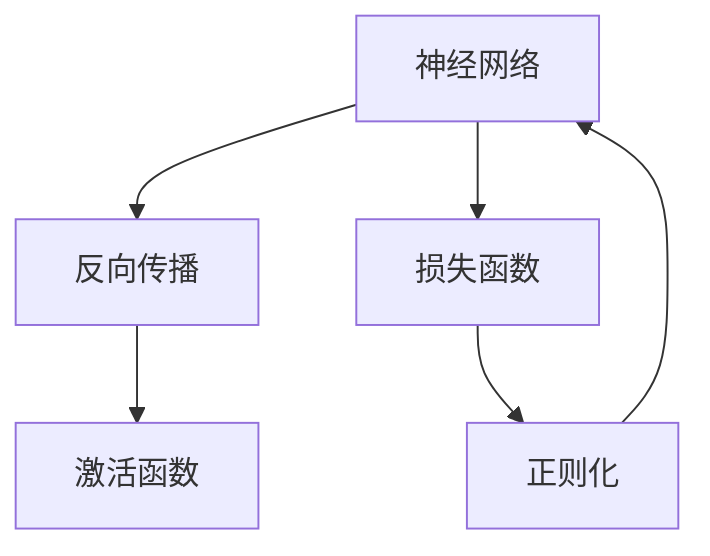

                 

## 1. 背景介绍

深度学习(Deep Learning)作为一种强大的机器学习方法，近年来在图像识别、语音处理、自然语言处理、推荐系统等诸多领域取得了显著进展。其背后的核心技术是多层神经网络，通过逐层提取输入数据的高级特征，从而实现自动化的复杂模式识别和预测。本文旨在全面介绍深度学习的原理，并结合代码实例讲解其实现过程。

## 2. 核心概念与联系

### 2.1 核心概念概述

为了更好地理解深度学习的核心概念，我们将从几个关键点进行阐述：

- **神经网络(Neural Network)**：由多层神经元构成的计算模型，通过学习输入数据的分布，实现从输入到输出的映射。
- **反向传播(Backpropagation)**：一种高效的反向传播算法，通过计算损失函数的梯度，更新神经网络中的权重，以最小化预测误差。
- **损失函数(Loss Function)**：用于衡量模型预测值与真实值之间的差异，是深度学习优化的关键指标。
- **激活函数(Activation Function)**：将神经元的输入映射到输出，引入非线性因素，增加模型的表达能力。
- **正则化(Regularization)**：防止模型过拟合的技术，如L2正则化、Dropout等。

这些核心概念构成了深度学习的理论基础，并在实际应用中得到了广泛应用。

### 2.2 核心概念原理和架构的 Mermaid 流程图



该流程图展示了神经网络、反向传播、损失函数和正则化之间的关系。神经网络通过反向传播计算损失函数梯度，并结合正则化技术进行优化。

## 3. 核心算法原理 & 具体操作步骤

### 3.1 算法原理概述

深度学习的核心算法是反向传播算法，其主要思想是通过链式法则，计算损失函数对模型参数的梯度，并反向传播更新参数，以最小化预测误差。

深度学习的优化过程通常包括以下步骤：

1. **前向传播(Forward Propagation)**：将输入数据通过神经网络，计算得到预测输出。
2. **计算损失(Loss Calculation)**：计算预测输出与真实标签之间的差异，得到损失值。
3. **反向传播(Backward Propagation)**：通过链式法则，计算损失函数对模型参数的梯度，更新模型权重。
4. **优化器(Optimizer)**：根据梯度信息，调整学习率等超参数，优化模型参数。

### 3.2 算法步骤详解

以图像分类任务为例，详细讲解深度学习的实现过程：

#### 3.2.1 数据准备

1. **数据集准备**：选择合适的大型公开数据集，如MNIST、CIFAR等，用于训练和测试。
2. **数据预处理**：对数据进行归一化、缩放、增广等预处理，确保数据质量。

#### 3.2.2 构建模型

1. **选择模型结构**：根据任务需求，选择合适的网络结构，如卷积神经网络(CNN)、残差网络(ResNet)等。
2. **定义模型层**：构建模型的各层结构，包括卷积层、池化层、全连接层等。
3. **配置超参数**：设置学习率、批大小、迭代轮数等超参数。

#### 3.2.3 训练模型

1. **加载数据集**：将数据集划分为训练集、验证集和测试集，并加载到内存。
2. **初始化模型**：使用随机初始化方法，如Xavier初始化，对模型参数进行初始化。
3. **训练模型**：使用反向传播算法，通过前向传播和反向传播更新模型参数。
4. **验证模型**：在验证集上评估模型性能，调整超参数以提高模型效果。

#### 3.2.4 测试模型

1. **加载测试集**：将测试集加载到内存，并对其进行预处理。
2. **评估模型**：在测试集上评估模型性能，比较训练集和验证集上的结果。

### 3.3 算法优缺点

深度学习的优点包括：

- **强大表达能力**：多层神经网络可以学习复杂的非线性关系，适用于多种任务。
- **自动特征提取**：无需手动提取特征，通过神经网络自动学习高级特征。
- **泛化能力强**：经过大规模数据训练，深度学习模型通常具有较强的泛化能力。

然而，深度学习也存在一些缺点：

- **数据需求量大**：需要大量标注数据进行训练，获取数据成本较高。
- **计算资源要求高**：大规模深度学习模型需要高性能计算设备，训练和推理开销大。
- **过拟合风险高**：模型参数多，易产生过拟合，需要正则化等方法进行缓解。
- **可解释性差**：深度学习模型通常被视为“黑盒”，难以解释内部决策过程。

### 3.4 算法应用领域

深度学习在多个领域得到了广泛应用，包括：

- **计算机视觉**：图像识别、物体检测、图像生成等。
- **自然语言处理**：机器翻译、情感分析、文本生成等。
- **语音处理**：语音识别、语音合成、声纹识别等。
- **推荐系统**：个性化推荐、广告推荐等。
- **强化学习**：智能游戏、机器人控制等。

## 4. 数学模型和公式 & 详细讲解

### 4.1 数学模型构建

以图像分类任务为例，深度学习模型通常包含以下几个主要组成部分：

- **输入层(Input Layer)**：接收输入数据，如图像的像素值。
- **隐藏层(Hidden Layer)**：进行特征提取和转换。
- **输出层(Output Layer)**：输出分类结果，如每个类别的概率分布。

### 4.2 公式推导过程

假设模型包含$L$个隐藏层，输入数据为$x$，输出为$y$，损失函数为$L$，激活函数为$\sigma$。则深度学习的训练过程可以表示为：

$$
y = \sigma_L(\sigma_{L-1}(\ldots\sigma_1(W_1x + b_1)\ldots + b_L))
$$

其中，$W$为权重矩阵，$b$为偏置向量，$\sigma$为激活函数。

通过反向传播算法，计算损失函数$L$对权重$W$和偏置$b$的梯度，更新模型参数：

$$
\frac{\partial L}{\partial W} = \frac{\partial L}{\partial z} \frac{\partial z}{\partial W}
$$

其中，$z$为激活函数前后的值。

### 4.3 案例分析与讲解

以LeNet-5模型为例，分析其在手写数字识别任务中的应用。LeNet-5是一种典型的卷积神经网络，由两个卷积层和三个全连接层组成。其训练过程如下：

1. **前向传播**：将输入图像通过卷积层和池化层，得到特征图，再通过全连接层输出分类结果。
2. **损失计算**：计算预测结果与真实标签之间的交叉熵损失。
3. **反向传播**：通过链式法则，计算损失函数对权重和偏置的梯度，并使用梯度下降等优化算法更新参数。
4. **验证评估**：在验证集上评估模型性能，调整超参数以提高模型效果。

## 5. 项目实践：代码实例和详细解释说明

### 5.1 开发环境搭建

为了实现深度学习项目，首先需要搭建开发环境。以下是一些常用的开发工具和环境搭建步骤：

1. **安装Python**：选择合适版本的Python，如3.7或3.8，并进行安装。
2. **安装TensorFlow**：TensorFlow是深度学习领域的主流框架，可以通过pip命令进行安装。
3. **安装Keras**：Keras是一个简单易用的深度学习框架，可以用于快速搭建和训练模型。
4. **安装PyTorch**：PyTorch是深度学习领域的另一个主流框架，具有动态计算图和高效的内存管理能力。
5. **配置GPU**：如果需要进行大规模深度学习训练，需要安装NVIDIA GPU并进行配置。

### 5.2 源代码详细实现

以手写数字识别为例，使用Keras框架实现LeNet-5模型：

```python
from keras.models import Sequential
from keras.layers import Conv2D, MaxPooling2D, Flatten, Dense
from keras.datasets import mnist
from keras.utils import to_categorical

# 加载MNIST数据集
(x_train, y_train), (x_test, y_test) = mnist.load_data()

# 数据预处理
x_train = x_train.reshape(-1, 28, 28, 1) / 255.0
x_test = x_test.reshape(-1, 28, 28, 1) / 255.0
y_train = to_categorical(y_train, 10)
y_test = to_categorical(y_test, 10)

# 构建LeNet-5模型
model = Sequential()
model.add(Conv2D(6, (5, 5), activation='relu', input_shape=(28, 28, 1)))
model.add(MaxPooling2D((2, 2)))
model.add(Conv2D(16, (5, 5), activation='relu'))
model.add(MaxPooling2D((2, 2)))
model.add(Flatten())
model.add(Dense(120, activation='relu'))
model.add(Dense(84, activation='relu'))
model.add(Dense(10, activation='softmax'))

# 编译模型
model.compile(optimizer='adam', loss='categorical_crossentropy', metrics=['accuracy'])

# 训练模型
model.fit(x_train, y_train, epochs=5, batch_size=64, validation_data=(x_test, y_test))

# 评估模型
loss, accuracy = model.evaluate(x_test, y_test)
print('Test Loss:', loss)
print('Test Accuracy:', accuracy)
```

### 5.3 代码解读与分析

上述代码实现了LeNet-5模型，并使用MNIST数据集进行训练和测试。具体解释如下：

1. **数据加载和预处理**：使用`mnist.load_data()`加载MNIST数据集，并进行数据预处理，包括归一化和标签编码。
2. **模型构建**：使用`Sequential()`搭建模型，并添加卷积层、池化层、全连接层等组件。
3. **模型编译**：使用`compile()`方法配置优化器、损失函数和评估指标。
4. **模型训练**：使用`fit()`方法进行模型训练，指定训练轮数和批次大小。
5. **模型评估**：使用`evaluate()`方法在测试集上评估模型性能，并输出测试损失和准确率。

## 6. 实际应用场景

### 6.4 未来应用展望

深度学习的应用场景还在不断扩展，未来有望在更多领域取得突破：

- **自动驾驶**：深度学习技术在自动驾驶领域将发挥重要作用，用于图像识别、目标检测、路径规划等任务。
- **医疗影像**：深度学习模型能够分析医学影像，进行疾病诊断、病理分析等，提升医疗水平。
- **金融预测**：深度学习模型可以分析金融数据，预测市场趋势、风险评估等，辅助金融决策。
- **虚拟现实**：深度学习技术在虚拟现实领域将带来沉浸式体验，如虚拟助手、虚拟会议等。
- **智能制造**：深度学习技术能够分析生产数据，进行故障预测、优化生产流程等，提升制造业智能化水平。

## 7. 工具和资源推荐

### 7.1 学习资源推荐

为了掌握深度学习的原理和实践，以下是一些推荐的学习资源：

1. **《深度学习》（Goodfellow, Bengio & Courville）**：深入浅出地介绍了深度学习的核心概念和算法。
2. **《动手学深度学习》**：由李沐等作者编写，提供了丰富的代码示例和实战练习。
3. **Coursera深度学习课程**：由Andrew Ng等教授讲授，涵盖深度学习基础和应用。
4. **Kaggle竞赛**：通过参与Kaggle竞赛，实践深度学习技术，提升实战能力。

### 7.2 开发工具推荐

以下是一些常用的深度学习开发工具：

1. **TensorFlow**：Google开源的深度学习框架，支持静态图和动态图，适合大规模工程应用。
2. **PyTorch**：Facebook开源的深度学习框架，支持动态计算图和高效的GPU加速，适合研究和快速原型开发。
3. **Keras**：基于TensorFlow和Theano的深度学习框架，简单易用，适合快速搭建和训练模型。
4. **MXNet**：由Apache基金会开源的深度学习框架，支持多种编程语言和分布式训练。
5. **Caffe**：由Berkeley Vision and Learning Center开发的深度学习框架，适用于计算机视觉任务。

### 7.3 相关论文推荐

以下是几篇深度学习领域的经典论文，推荐阅读：

1. **《深度学习》**：Goodfellow等作者，深度学习领域的经典著作，全面介绍了深度学习的原理和应用。
2. **《ImageNet大规模视觉识别挑战赛2020》**：Gao Huang等作者，介绍了深度学习在计算机视觉领域的应用和突破。
3. **《Attention is All You Need》**：Vaswani等作者，介绍了Transformer结构，展示了深度学习在自然语言处理领域的应用。
4. **《ResNet》**：He等作者，介绍了残差网络结构，展示了深度学习在计算机视觉领域的应用。

## 8. 总结：未来发展趋势与挑战

### 8.1 研究成果总结

深度学习自诞生以来，已经在多个领域取得了显著进展，成为人工智能技术的核心。其强大的表达能力和自动特征提取能力，使其在图像识别、语音处理、自然语言处理等领域表现出色。未来，深度学习技术将进一步发展，推动人工智能技术的普及和应用。

### 8.2 未来发展趋势

1. **更大规模的模型**：未来深度学习模型将更加复杂，参数量将不断增加，以处理更加复杂的任务。
2. **更高效的计算**：随着硬件设备的提升，深度学习模型的计算效率将进一步提升，训练和推理速度将显著加快。
3. **更广泛的领域**：深度学习将广泛应用于更多领域，如自动驾驶、医疗影像、金融预测等。
4. **更智能的模型**：深度学习模型将更加智能，具备更强的自我学习能力，适应更复杂的环境。
5. **更可靠的技术**：深度学习技术将更加可靠，具备更高的泛化能力和鲁棒性。

### 8.3 面临的挑战

尽管深度学习技术已经取得了显著进展，但仍面临一些挑战：

1. **数据质量问题**：深度学习模型需要大量高质量的数据进行训练，但数据获取和标注成本较高。
2. **计算资源需求高**：大规模深度学习模型需要高性能计算设备，训练和推理开销大。
3. **模型复杂度高**：深度学习模型的结构复杂，难以解释和调试，难以保证其鲁棒性和可解释性。
4. **模型过拟合问题**：深度学习模型参数多，易产生过拟合，需要正则化等方法进行缓解。
5. **伦理和隐私问题**：深度学习模型可能会产生歧视、误导性等伦理问题，如何保护用户隐私也是一个重要课题。

### 8.4 研究展望

未来深度学习技术的发展方向包括：

1. **无监督学习**：通过无监督学习范式，减少对标注数据的依赖，提高模型的自适应能力。
2. **迁移学习**：利用迁移学习技术，在少量标注数据上进行微调，提高模型的泛化能力。
3. **模型压缩**：通过模型压缩技术，降低模型参数量，提升模型的计算效率和可部署性。
4. **可解释性研究**：通过可解释性技术，提高模型的可解释性和可信度，增强用户信任。
5. **伦理和隐私保护**：通过隐私保护技术和伦理约束，确保深度学习模型在实际应用中的安全性。

## 9. 附录：常见问题与解答

### Q1：深度学习模型需要大量标注数据，如何获取高质量的数据集？

A: 获取高质量标注数据是深度学习模型训练的关键，以下是一些获取数据集的方法：

1. **公共数据集**：选择合适的大型公开数据集，如MNIST、CIFAR、IMDB等，这些数据集经过广泛验证，质量较高。
2. **数据增强**：通过数据增强技术，如旋转、平移、缩放等，扩充数据集，增加数据多样性。
3. **众包标注**：通过众包平台，如Amazon Mechanical Turk，获取标注数据，提高数据量。
4. **数据合成**：利用生成对抗网络(GAN)等技术，生成高质量的合成数据，用于训练和验证。

### Q2：深度学习模型容易产生过拟合，如何缓解过拟合问题？

A: 缓解深度学习模型过拟合的方法包括：

1. **数据增强**：通过数据增强技术，扩充训练集，增加数据多样性，减少模型过拟合。
2. **正则化**：使用L2正则化、Dropout等方法，防止模型过拟合。
3. **早停(Early Stopping)**：在验证集上监测模型性能，当性能不再提升时停止训练，避免过拟合。
4. **模型简化**：简化模型结构，减少参数量，提高模型泛化能力。
5. **迁移学习**：利用迁移学习技术，在少量标注数据上进行微调，提高模型泛化能力。

### Q3：如何选择合适的深度学习框架？

A: 选择合适的深度学习框架需要考虑以下因素：

1. **应用场景**：根据应用场景选择适合的框架，如计算机视觉任务选择Caffe或TensorFlow，自然语言处理任务选择Keras或PyTorch。
2. **开发效率**：选择简单易用的框架，如Keras，提高开发效率。
3. **模型灵活性**：选择灵活性高的框架，如PyTorch，方便模型调试和优化。
4. **社区支持**：选择有强大社区支持的框架，如TensorFlow，获得丰富的资源和文档支持。
5. **计算效率**：选择计算效率高的框架，如MXNet，适合大规模工程应用。

### Q4：如何理解深度学习的“黑盒”问题？

A: 深度学习模型通常被视为“黑盒”，难以解释其内部决策过程，以下是一些解决黑盒问题的方法：

1. **可视化工具**：使用可视化工具，如TensorBoard，观察模型的中间层输出，了解模型的特征提取过程。
2. **可解释性技术**：利用可解释性技术，如LIME、SHAP等，解释模型的决策过程，增强用户信任。
3. **模型简化**：通过简化模型结构，增加模型的可解释性，方便模型调试和优化。
4. **领域知识**：结合领域知识，解释模型的输出，增强用户理解。

### Q5：如何设计深度学习模型？

A: 设计深度学习模型需要考虑以下因素：

1. **任务需求**：根据任务需求选择适合的模型结构，如图像识别任务选择卷积神经网络，自然语言处理任务选择循环神经网络。
2. **数据特性**：根据数据特性选择合适的模型层，如数据维度高选择卷积层，数据序列长选择循环层。
3. **超参数配置**：选择合适的超参数，如学习率、批大小、迭代轮数等，影响模型训练效果。
4. **正则化技术**：选择合适的正则化技术，如L2正则化、Dropout等，防止模型过拟合。
5. **模型评估**：使用合适的评估指标，如准确率、召回率、F1值等，评估模型性能。

---

作者：禅与计算机程序设计艺术 / Zen and the Art of Computer Programming

