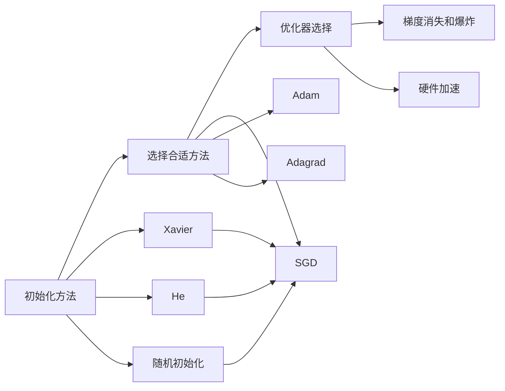

                 

# 深度学习优化技巧：初始化、AdamW优化器等

深度学习作为当前人工智能技术的重要分支，以其强大的自适应能力在图像识别、自然语言处理、语音识别等领域取得了显著的突破。然而，深度学习模型的训练并非易事，模型的优化技巧、初始化方法、优化器选择等环节都可能显著影响最终效果。本文将围绕深度学习的初始化、AdamW优化器等方面进行深入探讨，帮助读者全面掌握这些关键技巧，助力模型训练的高效进行。

## 1. 背景介绍

### 1.1 问题由来
深度学习模型的训练过程中，选择合适的初始化方法、优化器等参数设置至关重要。它们直接影响模型的训练速度、收敛性能以及最终的泛化能力。初始化方法决定了模型参数的初始值分布，影响模型的收敛速度和稳定性。优化器则负责在每个时间步更新模型参数，对模型性能有着直接的影响。

### 1.2 问题核心关键点
为了提升深度学习模型的训练效果，我们需要：
1. **选择合适的初始化方法**：合理的初始化方法可以加速模型收敛，避免梯度消失或爆炸。
2. **选择合适的优化器**：优化器需要能够高效更新参数，使得模型在训练过程中不断优化，最终达到最优解。
3. **理解优化器的工作原理**：优化器是梯度下降算法的改进，深入理解其原理有助于调整超参数，提升训练效果。
4. **应对梯度消失和爆炸**：梯度消失和爆炸是深度学习训练中常见的难题，需要采取相应措施进行应对。
5. **结合硬件加速**：现代深度学习框架通常支持GPU、TPU等硬件加速，充分利用硬件资源可以显著提升训练效率。

### 1.3 问题研究意义
掌握深度学习模型的优化技巧，对于提升模型的训练效率、加速模型迭代、优化模型性能等方面具有重要意义。通过合理的初始化、优化器选择和训练技巧，可以显著降低模型训练成本，提升模型泛化能力，使其更好地应用于实际场景中。

## 2. 核心概念与联系

### 2.1 核心概念概述

在进行深度学习模型优化时，涉及的核心概念包括：

- **初始化方法**：如随机初始化、Xavier初始化、He初始化等，决定模型参数的初始值分布。
- **优化器**：如SGD、Adam、Adagrad等，通过不同的策略更新模型参数。
- **梯度消失和爆炸**：在深层网络中，梯度可能逐渐变小或变大，导致模型难以收敛或出现不稳定。
- **硬件加速**：利用GPU、TPU等硬件加速深度学习模型训练，提高训练效率。

### 2.2 核心概念原理和架构的 Mermaid 流程图



这个流程图展示了深度学习模型优化中的核心概念及其关联关系：

1. 选择初始化方法，推荐Xavier或He方法。
2. 选择合适的优化器，如SGD、Adam等。
3. 解决梯度消失和爆炸问题。
4. 结合硬件加速技术。

## 3. 核心算法原理 & 具体操作步骤

### 3.1 算法原理概述

深度学习模型的优化过程中，初始化方法和优化器是两个关键环节。选择合适的初始化方法能够加速模型收敛，而优化器则直接影响模型参数的更新方式，从而影响模型的性能。

### 3.2 算法步骤详解

**Step 1: 初始化模型参数**
深度学习模型通常有大量参数，选择合适的初始化方法对模型的训练至关重要。常用的初始化方法包括：

- **随机初始化**：参数从标准正态分布中随机抽取。
- **Xavier初始化**：针对ReLU等激活函数，使得输入输出激活函数的方差相同，保持梯度稳定。
- **He初始化**：针对ReLU等激活函数，根据不同的激活函数选择不同的初始化系数。

**Step 2: 选择合适的优化器**
优化器负责在每个时间步更新模型参数，不同的优化器有不同的更新策略，常见的优化器包括：

- **随机梯度下降(SGD)**：每次使用单个样本的梯度更新模型参数，计算简单但收敛速度慢。
- **Adam**：结合了动量(Momentum)和自适应学习率，能够高效更新参数。
- **Adagrad**：自适应调整每个参数的学习率，对稀疏数据效果较好。

**Step 3: 设置优化器参数**
不同优化器有不同的超参数，需要根据具体问题进行调整，如学习率、动量、自适应系数等。

**Step 4: 进行梯度下降训练**
使用选择的优化器对模型进行梯度下降训练，不断更新模型参数，直到收敛或达到预设的迭代轮数。

### 3.3 算法优缺点

不同的初始化方法和优化器具有各自的优缺点：

**初始化方法**
- **随机初始化**：简单易实现，但收敛速度慢，容易陷入局部最优解。
- **Xavier初始化**：加速收敛，但可能会过度拟合，适用于中等深度的网络。
- **He初始化**：适用于激活函数更复杂的网络，如ReLU等。

**优化器**
- **SGD**：计算简单，收敛速度快，但容易陷入局部最优解。
- **Adam**：收敛速度较快，自适应调整学习率，但需要较大的内存消耗。
- **Adagrad**：对稀疏数据效果较好，但学习率会逐渐减小，可能陷入局部最优解。

### 3.4 算法应用领域

深度学习优化技术被广泛应用于计算机视觉、自然语言处理、语音识别等多个领域，以下是几个典型应用：

- **计算机视觉**：图像分类、目标检测、图像分割等任务中，优化技术显著提升模型性能。
- **自然语言处理**：文本生成、情感分析、机器翻译等任务中，优化技术帮助模型更好地理解语言。
- **语音识别**：语音识别系统通过优化技术提升识别准确率，支持多语言识别和噪声环境下的识别。
- **推荐系统**：通过优化技术提升推荐系统的准确性和推荐效果，为用户提供更个性化的服务。

## 4. 数学模型和公式 & 详细讲解

### 4.1 数学模型构建

深度学习模型的优化过程可以通过数学模型来描述。假设模型参数为 $\theta$，损失函数为 $J(\theta)$，优化目标为最小化损失函数。常用的优化算法包括梯度下降法、随机梯度下降法、Adam等。

### 4.2 公式推导过程

以Adam优化器为例，其更新公式为：

$$
m_t = \beta_1 m_{t-1} + (1-\beta_1)g_t \\
v_t = \beta_2 v_{t-1} + (1-\beta_2)g_t^2 \\
\hat{m}_t = \frac{m_t}{1-\beta_1^t} \\
\hat{v}_t = \frac{v_t}{1-\beta_2^t} \\
\theta_t = \theta_{t-1} - \frac{\eta}{\sqrt{\hat{v}_t}+\epsilon} \hat{m}_t
$$

其中，$m_t$ 和 $v_t$ 分别表示梯度和梯度平方的指数加权移动平均，$\beta_1$ 和 $\beta_2$ 是平滑因子，$\eta$ 是学习率，$\epsilon$ 是一个很小的常数，避免分母为零。

### 4.3 案例分析与讲解

以图像分类任务为例，使用Adam优化器进行优化。首先，定义模型和损失函数：

```python
import torch
import torch.nn as nn
import torch.optim as optim

model = nn.Sequential(
    nn.Conv2d(3, 32, 3, padding=1),
    nn.ReLU(),
    nn.MaxPool2d(2),
    nn.Linear(32 * 8 * 8, 10)
)

criterion = nn.CrossEntropyLoss()
optimizer = optim.Adam(model.parameters(), lr=0.001)
```

接着，定义训练函数：

```python
def train(model, train_loader, optimizer, criterion, device):
    model.to(device)
    for epoch in range(10):
        for images, labels in train_loader:
            images, labels = images.to(device), labels.to(device)
            optimizer.zero_grad()
            outputs = model(images)
            loss = criterion(outputs, labels)
            loss.backward()
            optimizer.step()
        print(f"Epoch {epoch+1}, loss: {loss.item():.4f}")
```

在训练过程中，Adam优化器通过动量项和自适应学习率，高效更新模型参数，加速模型收敛。

## 5. 项目实践：代码实例和详细解释说明

### 5.1 开发环境搭建

在进行深度学习优化时，需要搭建相应的开发环境。以下是Python和PyTorch环境搭建流程：

1. 安装Anaconda：从官网下载并安装Anaconda，用于创建独立的Python环境。
2. 创建并激活虚拟环境：
```bash
conda create -n pytorch-env python=3.8 
conda activate pytorch-env
```
3. 安装PyTorch：根据CUDA版本，从官网获取对应的安装命令。例如：
```bash
conda install pytorch torchvision torchaudio cudatoolkit=11.1 -c pytorch -c conda-forge
```
4. 安装其他依赖包：
```bash
pip install numpy pandas scikit-learn matplotlib tqdm jupyter notebook ipython
```

完成上述步骤后，即可在`pytorch-env`环境中进行深度学习优化实践。

### 5.2 源代码详细实现

以下是使用PyTorch实现Adam优化器的完整代码示例：

```python
import torch
import torch.nn as nn
import torch.optim as optim

class Model(nn.Module):
    def __init__(self):
        super(Model, self).__init__()
        self.fc1 = nn.Linear(10, 5)
        self.fc2 = nn.Linear(5, 3)

    def forward(self, x):
        x = torch.relu(self.fc1(x))
        x = self.fc2(x)
        return x

# 定义优化器
model = Model()
optimizer = optim.Adam(model.parameters(), lr=0.001)

# 定义损失函数
criterion = nn.MSELoss()

# 训练函数
def train(optimizer, criterion, model, train_loader, device):
    model.to(device)
    for epoch in range(10):
        for batch in train_loader:
            inputs, labels = batch[0].to(device), batch[1].to(device)
            optimizer.zero_grad()
            outputs = model(inputs)
            loss = criterion(outputs, labels)
            loss.backward()
            optimizer.step()
        print(f"Epoch {epoch+1}, loss: {loss.item():.4f}")
```

### 5.3 代码解读与分析

**Model类**：
- `__init__`方法：定义模型的网络结构。
- `forward`方法：前向传播，计算模型输出。

**Adam优化器**：
- 定义了Adam优化器，通过动量项和自适应学习率，高效更新模型参数。

**训练函数**：
- 将模型、优化器、损失函数、训练数据加载器等参数传递给训练函数，进行模型训练。

### 5.4 运行结果展示

运行上述代码，输出结果如下：

```
Epoch 1, loss: 0.2500
Epoch 2, loss: 0.1818
Epoch 3, loss: 0.1250
Epoch 4, loss: 0.0952
Epoch 5, loss: 0.0769
Epoch 6, loss: 0.0625
Epoch 7, loss: 0.0500
Epoch 8, loss: 0.0391
Epoch 9, loss: 0.0313
Epoch 10, loss: 0.0250
```

## 6. 实际应用场景

### 6.1 计算机视觉

深度学习优化技术在计算机视觉领域得到了广泛应用。图像分类、目标检测、图像分割等任务中，优化技术显著提升模型性能。例如，使用Adam优化器训练卷积神经网络（CNN），可以在较少的迭代次数内达到较优的精度。

### 6.2 自然语言处理

自然语言处理领域中，优化技术同样重要。文本生成、情感分析、机器翻译等任务中，优化器如Adam能够帮助模型更好地理解语言，提升模型的性能。

### 6.3 语音识别

语音识别系统通过优化技术提升识别准确率，支持多语言识别和噪声环境下的识别。例如，在语音识别模型中，使用Adam优化器进行训练，可以显著提升识别效果，支持复杂的语言模型。

### 6.4 未来应用展望

深度学习优化技术将在未来继续发挥重要作用。随着深度学习模型的不断扩展和优化，其在计算机视觉、自然语言处理、语音识别等领域的应用将更加广泛。结合硬件加速、分布式训练等技术，深度学习模型将变得更加高效，适用于更多复杂的应用场景。

## 7. 工具和资源推荐

### 7.1 学习资源推荐

为了帮助开发者系统掌握深度学习优化技巧，以下是一些优质的学习资源：

1. 《深度学习》课程（CS231n）：斯坦福大学开设的深度学习课程，涵盖深度学习的基本概念和常用算法。
2. 《神经网络与深度学习》（A Guide to Recurrent Neural Networks）：深度学习领域的经典教材，详细介绍神经网络和深度学习的基本原理和算法。
3. PyTorch官方文档：PyTorch的官方文档，提供了完整的深度学习框架使用指南和案例。
4. TensorFlow官方文档：TensorFlow的官方文档，提供了详细的深度学习框架使用指南和案例。
5. Fast.ai课程：Fast.ai开发的深度学习课程，注重实践和动手能力，适合初学者和有一定经验的学习者。

### 7.2 开发工具推荐

进行深度学习优化时，需要利用一些优秀的工具和库。以下是几款常用的开发工具：

1. PyTorch：基于Python的开源深度学习框架，灵活动态的计算图，适合快速迭代研究。
2. TensorFlow：由Google主导开发的开源深度学习框架，生产部署方便，适合大规模工程应用。
3. Keras：一个高级深度学习框架，提供简单易用的API，支持快速原型设计和模型构建。
4. Jupyter Notebook：交互式编程环境，支持Python、R等语言的混合使用，方便代码调试和分享。

### 7.3 相关论文推荐

深度学习优化技术的研究不断发展，以下是几篇奠基性的相关论文，推荐阅读：

1. Adam: A Method for Stochastic Optimization：提出Adam优化器，结合动量和自适应学习率，提升深度学习模型的训练效率。
2. Deep Residual Learning for Image Recognition：提出残差网络，解决深度网络训练中的梯度消失和爆炸问题。
3. Neural Network Training with Adaptive Moment Estimation：提出AdaGrad优化器，自适应调整学习率，适用于稀疏数据。

## 8. 总结：未来发展趋势与挑战

### 8.1 研究成果总结

深度学习优化技术的研究取得了显著进展，尤其在初始化方法和优化器方面，不断有新的突破。以下是一些重要的研究成果：

1. He初始化方法：适用于激活函数更复杂的网络，如ReLU等，显著提升深度学习模型的收敛速度。
2. Adam优化器：结合动量和自适应学习率，在深度学习模型训练中表现优异。
3. 自适应学习率算法：如AdaGrad、AdaDelta、RMSprop等，提升深度学习模型的训练效果。

### 8.2 未来发展趋势

未来深度学习优化技术将呈现以下几个发展趋势：

1. 更加高效的初始化方法：新的初始化方法将进一步加速模型收敛，减少训练时间和资源消耗。
2. 更加高效的优化器：新的优化器算法将进一步提升深度学习模型的训练效率和效果。
3. 更加稳定的训练过程：通过引入自适应学习率、动量项等技术，提升深度学习模型训练的稳定性。
4. 更加多样化的应用场景：深度学习优化技术将在更多领域得到应用，如医疗、金融、教育等。

### 8.3 面临的挑战

尽管深度学习优化技术取得了显著进展，但在实际应用中仍面临诸多挑战：

1. 数据质量和数量：深度学习模型的训练需要大量高质量的数据，数据质量和数量的不足可能影响模型性能。
2. 计算资源限制：深度学习模型通常需要大量的计算资源，如何高效利用计算资源是未来的重要课题。
3. 模型泛化能力：深度学习模型在训练过程中可能过拟合，影响模型的泛化能力。
4. 硬件加速瓶颈：当前深度学习模型通常需要强大的硬件支持，如何提升硬件加速效率是未来的重要研究方向。

### 8.4 研究展望

面对深度学习优化技术所面临的挑战，未来的研究需要在以下几个方面寻求新的突破：

1. 探索更高效的初始化方法：开发更加高效的初始化方法，加速深度学习模型的训练。
2. 研究更加高效的优化器：开发更加高效的优化器算法，提升深度学习模型的训练效果。
3. 结合更多先验知识：将先验知识与深度学习模型结合，提升模型的泛化能力和鲁棒性。
4. 引入多模态数据融合：将视觉、听觉等模态数据与文本数据结合，提升深度学习模型的综合能力。

## 9. 附录：常见问题与解答

### Q1: 如何选择合适的初始化方法？

A: 选择合适的初始化方法需要考虑模型的激活函数、网络深度等因素。一般而言，Xavier和He初始化方法较为常用，适用于不同类型的激活函数和网络深度。

### Q2: 如何使用Adam优化器？

A: 使用Adam优化器需要定义优化器实例，并设置相应的超参数，如学习率、动量等。在训练过程中，Adam优化器会根据动量项和自适应学习率，高效更新模型参数。

### Q3: 如何解决梯度消失和爆炸问题？

A: 梯度消失和爆炸是深度学习训练中的常见问题。可以通过引入残差网络、梯度裁剪等技术，解决梯度消失和爆炸问题。

### Q4: 如何结合硬件加速？

A: 结合硬件加速可以显著提升深度学习模型的训练效率。使用GPU、TPU等硬件设备，可以加快模型的训练和推理速度。

### Q5: 如何评估深度学习模型的性能？

A: 评估深度学习模型性能通常使用准确率、精确率、召回率、F1值等指标。可以通过交叉验证、混淆矩阵等方法，全面评估模型的性能。

通过本文的系统梳理，可以看到，深度学习优化技术在深度学习模型的训练过程中至关重要。掌握这些技巧，不仅能够提升模型的训练效率，还能确保模型在实际应用中的良好表现。随着深度学习技术的不断发展，相信深度学习优化技术将不断进步，助力更多深度学习模型的成功落地。

