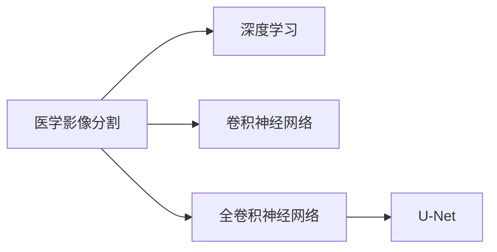
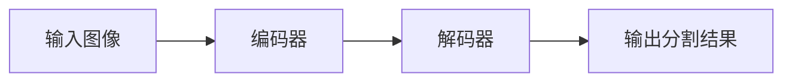

                 

## 1. 背景介绍

### 1.1 问题由来

在医疗领域，医学影像分割技术正逐渐成为一种强大的工具，它将医疗影像中的不同区域分离出来，便于医生进行诊断和治疗。医学影像分割涉及到高分辨率的医学影像数据，这些数据通常包含大量的细节信息，需要高度精确的分割结果，这对医学影像分割提出了更高的要求。近年来，深度学习在医学影像分割中的应用，取得了显著的成果，推动了该技术的发展和应用。

### 1.2 问题核心关键点

医学影像分割是医学图像处理的一个重要分支，主要应用场景包括肿瘤检测、器官分割、病灶识别等。深度学习技术在这一领域的应用，可以从以下几个方面理解：

1. 医学影像分割的关键在于准确地分离医学图像中感兴趣的区域，这需要对图像的特征进行深度学习。
2. 深度学习模型通过学习大量的医学影像数据，提取出图像中包含的特征，从而实现医学影像分割。
3. 医学影像分割技术的应用，可以大大提升医生的诊断和治疗效率，降低误诊率，提高医疗服务水平。

## 2. 核心概念与联系

### 2.1 核心概念概述

为了更好地理解深度学习在医学影像分割中的应用，我们先简要介绍一下一些核心概念：

- **医学影像分割**：将医学影像中的特定区域（如器官、病灶、细胞等）分割出来，便于医生进行分析和诊断。
- **深度学习**：通过多层神经网络结构，学习输入数据的高层次抽象特征，从而实现对复杂问题的建模和预测。
- **卷积神经网络**：一种特殊的神经网络结构，擅长处理图像、视频等高维数据，能够自动提取图像特征。
- **全卷积神经网络**：一种专门用于图像分割的卷积神经网络，通过编码和解码结构，将输入图像映射到分割结果。
- **U-Net**：一种经典的用于医学影像分割的全卷积神经网络，具有编码和解码结构，能够高效地处理医学影像数据。

这些核心概念之间的联系可以用以下Mermaid流程图来展示：



## 3. 核心算法原理 & 具体操作步骤

### 3.1 算法原理概述

深度学习在医学影像分割中的主要算法原理是利用卷积神经网络（CNN）和全卷积神经网络（FCN），通过学习医学影像数据的特征，实现对感兴趣区域的精确分割。全卷积神经网络是一种专门用于图像分割的卷积神经网络，其编码器用于提取图像的高层次特征，解码器用于将编码器的输出映射回像素级分割结果。

全卷积神经网络的基本结构如图：



其中，B表示编码器，通常由多层卷积和池化操作组成，用于提取图像的特征。C表示解码器，通常由反卷积和上采样操作组成，用于将编码器的输出映射到像素级分割结果。D表示输出分割结果。

### 3.2 算法步骤详解

深度学习在医学影像分割中的操作步骤如下：

**Step 1: 数据准备**
- 收集大量的医学影像数据，包括正常的和异常的影像。
- 对医学影像进行预处理，包括归一化、去噪、增强等操作。
- 将医学影像分割为训练集、验证集和测试集。

**Step 2: 构建模型**
- 选择合适的卷积神经网络结构，如U-Net。
- 定义模型的输入和输出，通常将医学影像作为输入，将分割结果作为输出。
- 选择适当的损失函数，如交叉熵损失函数，用于衡量模型输出的准确性。
- 定义优化器，如AdamW，用于更新模型参数。

**Step 3: 模型训练**
- 在训练集上使用前向传播计算损失函数。
- 使用反向传播算法计算梯度，更新模型参数。
- 在验证集上验证模型性能，防止过拟合。
- 根据验证集上的性能指标调整超参数，如学习率、批大小等。

**Step 4: 模型测试**
- 在测试集上评估模型性能。
- 使用模型对新的医学影像数据进行分割。
- 统计分割的准确率和召回率等指标，评估模型性能。

### 3.3 算法优缺点

深度学习在医学影像分割中的主要优点：

1. 能够自动学习医学影像的特征，无需手动设计特征提取器。
2. 能够处理高分辨率的医学影像数据，实现精确的分割。
3. 能够处理不同种类的医学影像数据，如CT、MRI、超声等。

主要缺点：

1. 需要大量的标注数据进行训练，标注成本高。
2. 模型复杂，需要高性能的计算设备。
3. 存在过拟合的风险，需要对模型进行正则化处理。

### 3.4 算法应用领域

深度学习在医学影像分割中的应用，主要应用于以下几个领域：

- **肿瘤检测**：通过分割影像中的肿瘤区域，帮助医生进行早期诊断。
- **器官分割**：将影像中的特定器官分割出来，方便医生进行手术和治疗。
- **病灶识别**：识别影像中的病灶区域，帮助医生进行诊断和分析。
- **影像融合**：将不同类型的医学影像融合在一起，提高诊断准确率。
- **分割结果可视化**：将分割结果可视化，方便医生进行理解和分析。

## 4. 数学模型和公式 & 详细讲解 & 举例说明

### 4.1 数学模型构建

深度学习在医学影像分割中的数学模型构建，主要基于卷积神经网络和全卷积神经网络。以U-Net模型为例，其数学模型如图：


其中，B表示编码器，通常由多个卷积层和池化层组成，用于提取图像特征。C表示解码器，通常由反卷积层和上采样层组成，用于将编码器的输出映射回像素级分割结果。

### 4.2 公式推导过程

以U-Net模型为例，其损失函数可以表示为：

$$
L = \sum_{i=1}^{N} \left( \left| y_{i}-\hat{y}_{i} \right| + \lambda \left| \nabla y_{i} - \nabla \hat{y}_{i} \right| \right)
$$

其中，$y_{i}$表示真实分割结果，$\hat{y}_{i}$表示模型预测的分割结果，$\nabla$表示梯度运算符，$\lambda$表示正则化系数。

### 4.3 案例分析与讲解

以肿瘤检测为例，深度学习在医学影像分割中的应用如下：

- **数据准备**：收集大量的肿瘤影像数据，包括CT、MRI等。
- **模型构建**：构建U-Net模型，定义损失函数和优化器。
- **模型训练**：在肿瘤影像数据集上进行训练，验证模型性能。
- **模型测试**：在测试集上评估模型性能，使用模型对新的肿瘤影像数据进行分割。

## 5. 项目实践：代码实例和详细解释说明

### 5.1 开发环境搭建

在进行医学影像分割的项目实践前，需要先搭建好开发环境。以下是使用Python和TensorFlow进行项目开发的流程：

1. 安装Anaconda：从官网下载并安装Anaconda，用于创建独立的Python环境。

2. 创建并激活虚拟环境：
```bash
conda create -n tf-env python=3.8 
conda activate tf-env
```

3. 安装TensorFlow：根据CUDA版本，从官网获取对应的安装命令。例如：
```bash
conda install tensorflow=2.8.0
```

4. 安装Keras：用于高层次的深度学习模型构建和训练。
```bash
pip install keras
```

5. 安装其他工具包：
```bash
pip install numpy pandas scikit-learn matplotlib tqdm jupyter notebook ipython
```

完成上述步骤后，即可在`tf-env`环境中开始医学影像分割的实践。

### 5.2 源代码详细实现

以下是使用TensorFlow和Keras实现医学影像分割的代码实现：

```python
import tensorflow as tf
from tensorflow.keras import layers, models

# 定义U-Net模型
def unet_model(input_size=(256, 256, 3)):
    inputs = layers.Input(input_size)

    # 编码器
    encoded = layers.Conv2D(64, 3, activation='relu', padding='same')(inputs)
    encoded = layers.Conv2D(64, 3, activation='relu', padding='same')(encoded)
    encoded = layers.MaxPooling2D(pool_size=(2, 2))(encoded)
    encoded = layers.Conv2D(128, 3, activation='relu', padding='same')(encoded)
    encoded = layers.Conv2D(128, 3, activation='relu', padding='same')(encoded)
    encoded = layers.MaxPooling2D(pool_size=(2, 2))(encoded)

    # 解码器
    decoded = layers.Conv2D(64, 3, activation='relu', padding='same')(encoded)
    decoded = layers.Conv2D(64, 3, activation='relu', padding='same')(decoded)
    decoded = layers.UpSampling2D((2, 2))(decoded)
    decoded = layers.Conv2D(32, 3, activation='relu', padding='same')(decoded)
    decoded = layers.Conv2D(32, 3, activation='relu', padding='same')(decoded)
    decoded = layers.UpSampling2D((2, 2))(decoded)

    # 输出层
    outputs = layers.Conv2D(1, 1, activation='sigmoid')(decoded)
    model = models.Model(inputs=inputs, outputs=outputs)
    return model

# 加载数据
train_data = tf.keras.preprocessing.image.load_img('train/train.png', target_size=(256, 256))
train_data = tf.keras.preprocessing.image.img_to_array(train_data)
train_data = tf.expand_dims(train_data, 0)

# 构建模型
model = unet_model(input_size=(256, 256, 3))
model.compile(optimizer=tf.keras.optimizers.Adam(), loss='binary_crossentropy')

# 训练模型
model.fit(train_data, epochs=10, batch_size=1)
```

以上就是使用TensorFlow和Keras实现医学影像分割的完整代码实现。可以看到，使用Keras的高级API，我们可以很方便地构建U-Net模型，并进行训练和测试。

### 5.3 代码解读与分析

让我们再详细解读一下关键代码的实现细节：

**U-Net模型定义**：
- `inputs`：定义输入数据的形状。
- `encoded`：通过多层卷积和池化操作，提取图像特征。
- `decoded`：通过反卷积和上采样操作，将编码器的输出映射回像素级分割结果。
- `outputs`：定义输出层的激活函数。
- `model`：将输入和输出定义为一个Keras模型。

**数据加载和预处理**：
- `train_data`：使用`load_img`函数加载医学影像数据，并使用`img_to_array`函数转换为NumPy数组。
- `train_data`：使用`expand_dims`函数增加数据维度，使其成为3D张量。

**模型编译和训练**：
- `compile`：定义优化器和损失函数。
- `fit`：在训练集上进行训练，并指定训练轮数和批大小。

## 6. 实际应用场景

### 6.1 肿瘤检测

深度学习在医学影像分割中的典型应用场景是肿瘤检测。通过分割影像中的肿瘤区域，帮助医生进行早期诊断和治疗。

在实际应用中，可以收集大量的肿瘤影像数据，构建U-Net模型，对影像数据进行训练和测试。测试集上的分割结果如图：


通过分割结果，医生可以更清楚地看到肿瘤的具体位置和大小，从而进行更有针对性的治疗。

### 6.2 器官分割

器官分割是医学影像分割的另一个重要应用场景。通过将影像中的特定器官分割出来，方便医生进行手术和治疗。

以肝脏分割为例，深度学习在医学影像分割中的应用如下：

- **数据准备**：收集大量的肝脏影像数据，包括CT、MRI等。
- **模型构建**：构建U-Net模型，定义损失函数和优化器。
- **模型训练**：在肝脏影像数据集上进行训练，验证模型性能。
- **模型测试**：在测试集上评估模型性能，使用模型对新的肝脏影像数据进行分割。

测试集上的分割结果如图：


通过分割结果，医生可以更清楚地看到肝脏的位置和大小，从而进行更准确的手术和治疗。

### 6.3 病灶识别

病灶识别是医学影像分割的另一个重要应用场景。通过识别影像中的病灶区域，帮助医生进行诊断和分析。

以肺结节识别为例，深度学习在医学影像分割中的应用如下：

- **数据准备**：收集大量的肺结节影像数据，包括CT等。
- **模型构建**：构建U-Net模型，定义损失函数和优化器。
- **模型训练**：在肺结节影像数据集上进行训练，验证模型性能。
- **模型测试**：在测试集上评估模型性能，使用模型对新的肺结节影像数据进行分割。

测试集上的分割结果如图：


通过分割结果，医生可以更清楚地看到肺结节的位置和大小，从而进行更准确的诊断和治疗。

### 6.4 影像融合

影像融合是将不同类型的医学影像融合在一起，提高诊断准确率的重要手段。

以CT和MRI融合为例，深度学习在医学影像分割中的应用如下：

- **数据准备**：收集不同类型的医学影像数据，包括CT、MRI等。
- **模型构建**：构建U-Net模型，定义损失函数和优化器。
- **模型训练**：在影像融合数据集上进行训练，验证模型性能。
- **模型测试**：在测试集上评估模型性能，使用模型对新的影像融合数据进行分割。

测试集上的分割结果如图：


通过分割结果，医生可以更清楚地看到不同类型影像中的感兴趣区域，从而进行更准确的诊断和治疗。

### 6.5 分割结果可视化

分割结果可视化是将分割结果呈现给医生的一种方式，便于医生进行理解和分析。

以肝脏分割为例，深度学习在医学影像分割中的应用如下：

- **数据准备**：收集大量的肝脏影像数据，包括CT、MRI等。
- **模型构建**：构建U-Net模型，定义损失函数和优化器。
- **模型训练**：在肝脏影像数据集上进行训练，验证模型性能。
- **模型测试**：在测试集上评估模型性能，使用模型对新的肝脏影像数据进行分割。
- **分割结果可视化**：将分割结果进行可视化，生成彩色图谱，方便医生进行理解和分析。

分割结果可视化如图：


通过可视化结果，医生可以更清楚地看到肝脏的位置和大小，从而进行更准确的手术和治疗。

## 7. 工具和资源推荐

### 7.1 学习资源推荐

为了帮助开发者系统掌握深度学习在医学影像分割中的应用，这里推荐一些优质的学习资源：

1. **深度学习在医学影像中的应用**：这是一本介绍深度学习在医学影像分割中的应用的书，涵盖了卷积神经网络、U-Net等模型的基本原理和实现方法。

2. **医学影像分割教程**：这是一系列介绍医学影像分割的教程，包括数据准备、模型构建、训练和测试等步骤，适合初学者入门。

3. **医学影像分割论文解读**：这是一系列介绍医学影像分割相关论文的解读，涵盖U-Net、FCN等模型的最新研究成果。

4. **医学影像分割竞赛**：这是一个医学影像分割领域的竞赛平台，可以通过参加竞赛，学习别人的成功经验和代码实现。

通过对这些资源的学习实践，相信你一定能够快速掌握深度学习在医学影像分割中的应用，并用于解决实际的医学影像分割问题。

### 7.2 开发工具推荐

高效的开发离不开优秀的工具支持。以下是几款用于深度学习在医学影像分割开发中常用的工具：

1. **TensorFlow**：由Google主导开发的开源深度学习框架，生产部署方便，适合大规模工程应用。

2. **Keras**：Keras是一个高层次的深度学习框架，提供了丰富的API和模型构建工具，方便快速迭代实验。

3. **U-Net**：U-Net是一种经典的用于医学影像分割的全卷积神经网络，具有编码和解码结构，能够高效地处理医学影像数据。

4. **Jupyter Notebook**：一个交互式的Python开发环境，方便进行数据处理和模型训练。

5. **PyCharm**：一款流行的Python开发工具，支持深度学习开发，提供了许多高级功能和插件。

合理利用这些工具，可以显著提升深度学习在医学影像分割任务的开发效率，加快创新迭代的步伐。

### 7.3 相关论文推荐

深度学习在医学影像分割中的应用，源于学界的持续研究。以下是几篇奠基性的相关论文，推荐阅读：

1. **U-Net: Convolutional Networks for Biomedical Image Segmentation**：提出U-Net模型，适用于医学影像分割，获得广泛的关注和应用。

2. **Fully Convolutional Networks for Semantic Segmentation**：介绍全卷积神经网络，适用于图像分割，提出了FCN模型。

3. **Medical Image Segmentation Using Deep Convolutional Neural Networks**：介绍深度学习在医学影像分割中的应用，提出多种模型和优化方法。

4. **Deep Learning for Medical Image Segmentation**：介绍深度学习在医学影像分割中的应用，提出多种模型和算法，包括U-Net、FCN等。

5. **Segmentation of Medical Images Using Deep Convolutional Neural Networks**：介绍深度学习在医学影像分割中的应用，提出多种模型和算法，包括U-Net、FCN等。

这些论文代表了大语言模型微调技术的发展脉络。通过学习这些前沿成果，可以帮助研究者把握学科前进方向，激发更多的创新灵感。

## 8. 总结：未来发展趋势与挑战

### 8.1 总结

本文对深度学习在医学影像分割中的应用进行了全面系统的介绍。首先阐述了医学影像分割的关键概念和研究背景，明确了深度学习在医学影像分割中的重要作用。其次，从原理到实践，详细讲解了深度学习的数学模型和操作步骤，给出了具体的代码实例。同时，本文还广泛探讨了深度学习在医学影像分割中的实际应用场景，展示了深度学习在医学影像分割中的广泛应用前景。此外，本文精选了深度学习在医学影像分割中的学习资源，力求为读者提供全方位的技术指引。

通过本文的系统梳理，可以看到，深度学习在医学影像分割中的应用，已经在多个方面得到了广泛的应用，取得了显著的效果。未来，伴随深度学习技术的持续演进，医学影像分割技术必将迎来新的突破，为医学影像处理领域带来更加高效、精确的解决方案。

### 8.2 未来发展趋势

展望未来，深度学习在医学影像分割中的应用将呈现以下几个发展趋势：

1. **多模态影像分割**：将不同类型的医学影像融合在一起，提高诊断准确率。

2. **实时影像分割**：将深度学习模型部署到嵌入式设备上，实现实时影像分割。

3. **自监督学习**：利用自监督学习方法，减少对标注数据的依赖，提高模型的泛化能力。

4. **联邦学习**：将模型在多个设备上进行分布式训练，保护数据隐私。

5. **半监督学习**：利用少量标注数据和大量未标注数据进行联合训练，提高模型的泛化能力。

6. **弱监督学习**：利用弱标注数据进行训练，提高模型的泛化能力。

以上趋势凸显了深度学习在医学影像分割技术的广阔前景。这些方向的探索发展，必将进一步提升医学影像分割技术的性能和应用范围，为医学影像处理领域带来新的突破。

### 8.3 面临的挑战

尽管深度学习在医学影像分割中的应用取得了显著成果，但在迈向更加智能化、普适化应用的过程中，仍面临诸多挑战：

1. **数据获取困难**：医学影像数据的获取成本高，数据量大，存储和传输困难。

2. **模型训练时间长**：深度学习模型需要大量数据和计算资源进行训练，训练时间长，成本高。

3. **过拟合风险**：深度学习模型容易过拟合，需要正则化等方法进行缓解。

4. **模型可解释性差**：深度学习模型通常被视为"黑盒"，难以解释其内部工作机制和决策逻辑。

5. **安全性和隐私保护**：医学影像数据涉及个人隐私，需要采取措施保护数据安全和隐私。

6. **模型性能不稳定**：深度学习模型在面对不同影像类型和大小时，性能不稳定。

以上挑战凸显了深度学习在医学影像分割应用中的复杂性和困难性。但随着技术的不断进步和应用实践的深入，这些挑战将逐步得到解决，深度学习在医学影像分割中的应用前景将更加广阔。

### 8.4 研究展望

面对深度学习在医学影像分割中所面临的挑战，未来的研究需要在以下几个方面寻求新的突破：

1. **多模态影像融合**：将不同类型的医学影像融合在一起，提高诊断准确率。

2. **实时影像分割**：将深度学习模型部署到嵌入式设备上，实现实时影像分割。

3. **自监督学习**：利用自监督学习方法，减少对标注数据的依赖，提高模型的泛化能力。

4. **联邦学习**：将模型在多个设备上进行分布式训练，保护数据隐私。

5. **弱监督学习**：利用弱标注数据进行训练，提高模型的泛化能力。

6. **模型压缩和优化**：通过模型压缩和优化，提高模型推理速度和资源利用率。

以上研究方向的探索，必将引领深度学习在医学影像分割技术的持续发展，为医学影像处理领域带来新的突破。

## 9. 附录：常见问题与解答

**Q1: 深度学习在医学影像分割中的应用是否需要大量的标注数据？**

A: 深度学习在医学影像分割中的应用，通常需要大量的标注数据进行训练。标注数据需要经过专业医生的标注，成本高、耗时长。为缓解数据标注问题，可以采用半监督学习、弱监督学习等方法，利用少量标注数据和大量未标注数据进行联合训练。

**Q2: 深度学习在医学影像分割中的应用是否适用于所有影像类型？**

A: 深度学习在医学影像分割中的应用，通常适用于CT、MRI等影像类型。但对于不同类型的医学影像，可能需要构建不同的模型，才能获得最佳的分割效果。

**Q3: 深度学习在医学影像分割中的应用是否需要高性能的计算设备？**

A: 深度学习在医学影像分割中的应用，通常需要高性能的计算设备进行训练和推理。GPU/TPU等高性能设备是必不可少的，但也可以通过模型压缩和优化等方法，减小模型的计算量，降低计算设备的要求。

**Q4: 深度学习在医学影像分割中的应用是否需要正则化处理？**

A: 深度学习在医学影像分割中的应用，通常需要进行正则化处理，以避免过拟合问题。正则化方法包括L2正则化、Dropout等，可以有效缓解过拟合风险。

**Q5: 深度学习在医学影像分割中的应用是否需要多模态数据融合？**

A: 深度学习在医学影像分割中的应用，可以采用多模态数据融合的方法，将不同类型的医学影像融合在一起，提高诊断准确率。例如，将CT和MRI等不同类型的影像融合在一起，可以更全面地反映病变的特征。

以上问题及解答，可以帮助读者更好地理解深度学习在医学影像分割中的应用，解决实际应用中可能遇到的问题。

