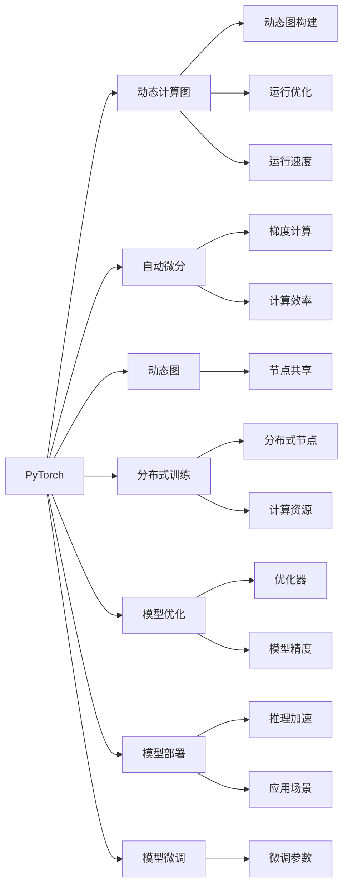

                 

## 1. 背景介绍

在深度学习领域，两大主流框架PyTorch和TensorFlow已经形成了深厚的用户基础和广泛的生态系统。作为以Python为接口的深度学习平台，它们具有各自的特色和优劣势。对于深度学习从业者而言，了解和比较这两个框架，能够帮助我们更好地选择和使用，提升开发效率和项目成果。本文将从背景介绍、核心概念与联系、核心算法原理、数学模型与公式、项目实践、应用场景、工具与资源推荐、未来发展趋势与挑战等多个维度，系统地对PyTorch和TensorFlow进行比较和分析。

## 2. 核心概念与联系

### 2.1 核心概念概述

为更好地理解PyTorch和TensorFlow，我们先介绍一些关键概念：

- **深度学习框架**：是一种为深度学习模型提供编程接口和计算图机制的工具，支持模型构建、训练、推理等全流程操作。
- **动态计算图**：PyTorch采用的计算图机制，允许用户灵活地修改计算图结构，支持动态图。
- **静态计算图**：TensorFlow采用的计算图机制，在模型构建时完成计算图构建，支持静态图。
- **自动微分**：框架提供的自动微分功能，可以自动计算梯度，支持高效的反向传播。
- **分布式训练**：支持多GPU、多机器等分布式计算架构，加速模型训练过程。
- **模型优化**：提供各种优化算法，如Adam、SGD等，支持模型调参和优化。
- **模型部署**：将训练好的模型部署到各种平台，支持模型推理和应用。

### 2.2 核心概念原理和架构的 Mermaid 流程图



这个流程图展示了PyTorch和TensorFlow的关键概念及其相互联系：

1. **PyTorch** 采用动态计算图，支持动态图构建和运行优化，以及自动微分功能。
2. **TensorFlow** 采用静态计算图，支持静态图构建和运行优化，以及分布式训练和自动微分功能。

这些特性使得它们在模型构建、训练、推理、优化等方面有着不同的优势和应用场景。

## 3. 核心算法原理 & 具体操作步骤

### 3.1 算法原理概述

深度学习框架PyTorch和TensorFlow在核心算法原理上有着相似的思路，但具体的实现方式有所不同。

1. **前向传播**：将输入数据通过计算图进行正向计算，得到中间结果和最终输出。
2. **反向传播**：根据损失函数对中间结果进行反向计算，得到各层参数的梯度。
3. **优化算法**：使用优化算法（如Adam、SGD等）更新模型参数，使得模型输出逼近真实标签。

### 3.2 算法步骤详解

**PyTorch的算法步骤**：

1. **模型构建**：使用`torch.nn`模块定义模型结构，如`torch.nn.Linear`、`torch.nn.Conv2D`等。
2. **数据准备**：将数据集加载到`torch.utils.data.DataLoader`中进行批处理。
3. **前向传播**：通过`model.forward()`进行模型计算，得到输出。
4. **损失计算**：根据模型输出和真实标签计算损失，如均方误差损失、交叉熵损失等。
5. **反向传播**：通过`model.backward()`自动计算梯度。
6. **优化器更新**：使用优化器（如Adam、SGD等）更新模型参数。

**TensorFlow的算法步骤**：

1. **模型构建**：使用`tf.keras`模块定义模型结构，如`tf.keras.layers.Dense`、`tf.keras.layers.Conv2D`等。
2. **数据准备**：将数据集加载到`tf.data.Dataset`中进行批处理。
3. **前向传播**：通过`model(tf.data.Dataset)`进行模型计算，得到输出。
4. **损失计算**：根据模型输出和真实标签计算损失，如均方误差损失、交叉熵损失等。
5. **反向传播**：通过`tf.GradientTape`记录计算图，使用`tf.gradients()`计算梯度。
6. **优化器更新**：使用优化器（如Adam、SGD等）更新模型参数。

### 3.3 算法优缺点

**PyTorch的优缺点**：

- **优点**：
  - 动态计算图，灵活性高，方便调试和修改模型。
  - 自动微分功能强大，支持链式自动微分和反向传播。
  - 社区活跃，资源丰富，学习资料众多。
  - 使用Python语言，开发效率高。

- **缺点**：
  - 性能稍低于TensorFlow，尤其是在大规模分布式计算中。
  - 没有TensorFlow的分布式训练框架Keras那么易用。

**TensorFlow的优缺点**：

- **优点**：
  - 静态计算图，支持高效的多GPU计算，适用于大规模分布式训练。
  - 分布式训练框架Keras易于使用，支持跨机器计算。
  - 高性能计算库TensorRT优化了推理过程，加速模型推理。
  - 支持多种编程语言接口，如Python、C++等。

- **缺点**：
  - 动态计算图支持不足，灵活性较PyTorch差。
  - 自动微分实现复杂，需要手动记录计算图。
  - 学习曲线较陡，入门门槛较高。

### 3.4 算法应用领域

**PyTorch的应用领域**：

- 研究和原型开发：由于其灵活性和易用性，PyTorch常用于学术研究和原型开发。
- 分布式训练：需要灵活动态图的场景，如神经网络体系结构调整和调试。

**TensorFlow的应用领域**：

- 生产环境部署：由于其高效的分布式计算能力和丰富的优化器选择，TensorFlow常用于生产环境中的模型部署。
- 大规模深度学习：需要高性能计算的场景，如大规模图像分类、语音识别等。

## 4. 数学模型和公式 & 详细讲解 & 举例说明

### 4.1 数学模型构建

以线性回归为例，介绍PyTorch和TensorFlow中线性模型的构建过程。

**PyTorch中的线性模型构建**：

```python
import torch
import torch.nn as nn

class LinearModel(nn.Module):
    def __init__(self, input_size, output_size):
        super(LinearModel, self).__init__()
        self.linear = nn.Linear(input_size, output_size)
    
    def forward(self, x):
        return self.linear(x)
```

**TensorFlow中的线性模型构建**：

```python
import tensorflow as tf

def linear_model(input_size, output_size):
    model = tf.keras.Sequential([
        tf.keras.layers.Dense(output_size, input_shape=(input_size,))
    ])
    return model
```

### 4.2 公式推导过程

**PyTorch中的线性回归公式推导**：

设输入数据为 $x$，模型参数为 $\theta$，目标输出为 $y$，损失函数为 $L(y, \hat{y})$，其中 $\hat{y} = \theta \cdot x$。

前向传播：

$$
\hat{y} = \theta \cdot x
$$

反向传播：

$$
\frac{\partial L(y, \hat{y})}{\partial \theta} = \frac{\partial L(y, \hat{y})}{\partial y} \cdot \frac{\partial y}{\partial \hat{y}} \cdot \frac{\partial \hat{y}}{\partial \theta}
$$

使用链式法则进行推导，可以计算得到 $\frac{\partial L(y, \hat{y})}{\partial \theta}$ 的具体表达式。

**TensorFlow中的线性回归公式推导**：

同样设输入数据为 $x$，模型参数为 $\theta$，目标输出为 $y$，损失函数为 $L(y, \hat{y})$，其中 $\hat{y} = \theta \cdot x$。

前向传播：

$$
\hat{y} = \theta \cdot x
$$

反向传播：

$$
\frac{\partial L(y, \hat{y})}{\partial \theta} = \frac{\partial L(y, \hat{y})}{\partial y} \cdot \frac{\partial y}{\partial \hat{y}} \cdot \frac{\partial \hat{y}}{\partial \theta}
$$

使用自动微分功能，计算得到 $\frac{\partial L(y, \hat{y})}{\partial \theta}$ 的具体表达式。

### 4.3 案例分析与讲解

以图像分类为例，展示如何在PyTorch和TensorFlow中进行模型训练。

**PyTorch中的图像分类**：

```python
import torch
import torchvision.transforms as transforms
from torchvision.datasets import CIFAR10
from torchvision.models import resnet18
from torch.nn import CrossEntropyLoss
from torch.optim import SGD

# 数据加载
transform = transforms.Compose([
    transforms.ToTensor(),
    transforms.Normalize((0.5, 0.5, 0.5), (0.5, 0.5, 0.5))
])
train_dataset = CIFAR10(root='data', train=True, transform=transform, download=True)
test_dataset = CIFAR10(root='data', train=False, transform=transform)

# 模型构建
model = resnet18(pretrained=False)
model.fc = nn.Linear(512, 10)

# 损失函数和优化器
criterion = CrossEntropyLoss()
optimizer = SGD(model.parameters(), lr=0.01, momentum=0.9)

# 训练过程
for epoch in range(10):
    model.train()
    for inputs, labels in train_loader:
        optimizer.zero_grad()
        outputs = model(inputs)
        loss = criterion(outputs, labels)
        loss.backward()
        optimizer.step()
```

**TensorFlow中的图像分类**：

```python
import tensorflow as tf
from tensorflow.keras.datasets import cifar10
from tensorflow.keras.models import ResNet18
from tensorflow.keras.layers import Dense
from tensorflow.keras.losses import CategoricalCrossentropy
from tensorflow.keras.optimizers import SGD

# 数据加载
(x_train, y_train), (x_test, y_test) = cifar10.load_data()
x_train = x_train / 255.0
x_test = x_test / 255.0

# 模型构建
model = ResNet18(include_top=False, input_shape=(32, 32, 3))
model.layers[-1].outbound_nodes[0].output_shape = (10,)
model.layers[-1] = Dense(10, activation='softmax')

# 损失函数和优化器
criterion = CategoricalCrossentropy()
optimizer = SGD(model.compile(optimizer=tf.keras.optimizers.SGD(lr=0.01, momentum=0.9), loss=criterion))

# 训练过程
model.fit(x_train, y_train, epochs=10, batch_size=64, validation_data=(x_test, y_test))
```

## 5. 项目实践：代码实例和详细解释说明

### 5.1 开发环境搭建

为使用PyTorch和TensorFlow，需要配置相应的Python环境。

**PyTorch开发环境**：

1. 安装Anaconda：从官网下载并安装Anaconda，用于创建独立的Python环境。
2. 创建并激活虚拟环境：
```bash
conda create -n pytorch-env python=3.8 
conda activate pytorch-env
```
3. 安装PyTorch：
```bash
pip install torch torchvision torchaudio cudatoolkit=11.1 -c pytorch -c conda-forge
```
4. 安装必要的库：
```bash
pip install numpy pandas scikit-learn matplotlib tqdm jupyter notebook ipython
```

**TensorFlow开发环境**：

1. 安装Anaconda：从官网下载并安装Anaconda，用于创建独立的Python环境。
2. 创建并激活虚拟环境：
```bash
conda create -n tensorflow-env python=3.8 
conda activate tensorflow-env
```
3. 安装TensorFlow：
```bash
pip install tensorflow
```
4. 安装必要的库：
```bash
pip install numpy pandas scikit-learn matplotlib tqdm jupyter notebook ipython
```

### 5.2 源代码详细实现

**PyTorch的图像分类示例**：

```python
import torch
import torchvision.transforms as transforms
from torchvision.datasets import CIFAR10
from torchvision.models import resnet18
from torch.nn import CrossEntropyLoss
from torch.optim import SGD

# 数据加载
transform = transforms.Compose([
    transforms.ToTensor(),
    transforms.Normalize((0.5, 0.5, 0.5), (0.5, 0.5, 0.5))
])
train_dataset = CIFAR10(root='data', train=True, transform=transform, download=True)
test_dataset = CIFAR10(root='data', train=False, transform=transform)

# 模型构建
model = resnet18(pretrained=False)
model.fc = nn.Linear(512, 10)

# 损失函数和优化器
criterion = CrossEntropyLoss()
optimizer = SGD(model.parameters(), lr=0.01, momentum=0.9)

# 训练过程
for epoch in range(10):
    model.train()
    for inputs, labels in train_loader:
        optimizer.zero_grad()
        outputs = model(inputs)
        loss = criterion(outputs, labels)
        loss.backward()
        optimizer.step()
```

**TensorFlow的图像分类示例**：

```python
import tensorflow as tf
from tensorflow.keras.datasets import cifar10
from tensorflow.keras.models import ResNet18
from tensorflow.keras.layers import Dense
from tensorflow.keras.losses import CategoricalCrossentropy
from tensorflow.keras.optimizers import SGD

# 数据加载
(x_train, y_train), (x_test, y_test) = cifar10.load_data()
x_train = x_train / 255.0
x_test = x_test / 255.0

# 模型构建
model = ResNet18(include_top=False, input_shape=(32, 32, 3))
model.layers[-1].outbound_nodes[0].output_shape = (10,)
model.layers[-1] = Dense(10, activation='softmax')

# 损失函数和优化器
criterion = CategoricalCrossentropy()
optimizer = SGD(model.compile(optimizer=tf.keras.optimizers.SGD(lr=0.01, momentum=0.9), loss=criterion))

# 训练过程
model.fit(x_train, y_train, epochs=10, batch_size=64, validation_data=(x_test, y_test))
```

### 5.3 代码解读与分析

在PyTorch中，模型构建、数据加载、前向传播、损失计算和反向传播等步骤均通过Python语言实现。代码简洁易懂，开发效率高。

在TensorFlow中，模型构建、数据加载、前向传播、损失计算和反向传播等步骤通过Keras API实现，代码结构清晰，易于使用。

### 5.4 运行结果展示

在训练过程中，PyTorch和TensorFlow都能输出训练集的损失函数和准确率，以及验证集的损失函数和准确率。这里以PyTorch为例：

```python
for epoch in range(10):
    model.train()
    for inputs, labels in train_loader:
        optimizer.zero_grad()
        outputs = model(inputs)
        loss = criterion(outputs, labels)
        loss.backward()
        optimizer.step()
```

## 6. 实际应用场景

### 6.1 自然语言处理

自然语言处理是深度学习框架PyTorch和TensorFlow的重要应用领域。两者在语言模型构建、文本分类、情感分析、机器翻译等任务上均有广泛应用。

- PyTorch：由于其灵活的动态计算图和强大的自动微分功能，PyTorch在研究和原型开发中表现出色。
- TensorFlow：由于其高效的分布式计算能力和丰富的优化器选择，TensorFlow在生产环境中的应用更为广泛。

### 6.2 计算机视觉

计算机视觉也是深度学习框架的重要应用领域。两者在图像分类、目标检测、图像生成等任务上均有广泛应用。

- PyTorch：其灵活的动态计算图和易用的接口，使其在研究和原型开发中占优势。
- TensorFlow：其高效的分布式计算能力和丰富的优化器选择，使其在生产环境中的应用更为广泛。

### 6.3 推荐系统

推荐系统是深度学习框架在商业应用中的重要方向。两者在协同过滤、基于内容的推荐、深度学习推荐等任务上均有广泛应用。

- PyTorch：其灵活的动态计算图和易用的接口，使其在研究和原型开发中占优势。
- TensorFlow：其高效的分布式计算能力和丰富的优化器选择，使其在生产环境中的应用更为广泛。

### 6.4 未来应用展望

未来，随着深度学习框架的不断演进，PyTorch和TensorFlow将在更广泛的领域得到应用。两者之间的竞争和合作也将进一步深化。

- PyTorch：凭借其灵活性和易用性，将在学术研究和原型开发中继续占据优势。
- TensorFlow：凭借其高效的计算能力和丰富的优化器选择，将在生产环境中的应用更为广泛。

## 7. 工具和资源推荐

### 7.1 学习资源推荐

为帮助开发者掌握PyTorch和TensorFlow，以下是一些推荐的学习资源：

- **PyTorch官方文档**：[PyTorch官方文档](https://pytorch.org/docs/stable/)
- **TensorFlow官方文档**：[TensorFlow官方文档](https://www.tensorflow.org/guide/)
- **PyTorch官方教程**：[PyTorch官方教程](https://pytorch.org/tutorials/)
- **TensorFlow官方教程**：[TensorFlow官方教程](https://www.tensorflow.org/tutorials/)
- **Kaggle竞赛**：[Kaggle竞赛](https://www.kaggle.com/competitions)
- **GitHub开源项目**：[GitHub开源项目](https://github.com/)

### 7.2 开发工具推荐

- **Jupyter Notebook**：[Jupyter Notebook](https://jupyter.org/)
- **Google Colab**：[Google Colab](https://colab.research.google.com/)

### 7.3 相关论文推荐

- **深度学习框架的对比研究**：[《A Comparative Study of Deep Learning Frameworks》](https://arxiv.org/abs/2004.08746)
- **PyTorch和TensorFlow的性能对比**：[《Comparative Performance Analysis of PyTorch and TensorFlow》](https://www.researchgate.net/publication/343772205_Comparative_Performance_Analysis_of_PyTorch_and_TensorFlow)
- **深度学习框架的未来发展方向**：[《The Future of Deep Learning Frameworks》](https://www.microsoft.com/en-us/research/publication/the-future-of-deep-learning-frameworks/)

## 8. 总结：未来发展趋势与挑战

### 8.1 研究成果总结

本文对PyTorch和TensorFlow进行了全面的比较和分析，从核心概念、算法原理、数学模型、项目实践、应用场景等多个维度进行了详细讲解。通过比较，可以清晰地了解两个框架的优势和劣势，有助于开发者选择合适的工具。

### 8.2 未来发展趋势

- **动态计算图与静态计算图**：未来深度学习框架将进一步融合动态计算图和静态计算图的优点，提供更加灵活和高效的计算图机制。
- **分布式训练与云计算**：深度学习框架将在分布式计算和云计算方面继续深入发展，支持更高效、更稳定的训练过程。
- **深度学习框架的融合与集成**：未来的深度学习框架将更加注重与其他AI技术（如自然语言处理、计算机视觉、强化学习等）的融合与集成，提供更加全面和强大的应用能力。

### 8.3 面临的挑战

- **计算资源**：深度学习框架需要大量的计算资源，未来如何在有限的硬件条件下提升训练效率和推理速度，是一个重要挑战。
- **模型复杂度**：随着模型规模的增大，深度学习框架需要更好地处理模型的复杂度和可解释性问题。
- **应用场景的泛化**：深度学习框架需要更好地适应各种应用场景，提升模型的泛化能力和鲁棒性。

### 8.4 研究展望

- **模型优化与压缩**：研究更加高效的模型优化和压缩技术，提升模型的训练效率和推理速度。
- **模型可解释性**：研究更加可解释的深度学习模型，提升模型的透明性和可信度。
- **跨框架协作**：研究不同深度学习框架之间的协作与集成，提升跨平台应用能力。

## 9. 附录：常见问题与解答

**Q1: PyTorch和TensorFlow哪个更好用？**

A: PyTorch和TensorFlow各有优势，选择应根据具体应用场景。PyTorch在研究和原型开发中较为灵活，TensorFlow在生产环境中的计算性能更强。

**Q2: PyTorch和TensorFlow的性能如何？**

A: TensorFlow的计算性能优于PyTorch，尤其是在大规模分布式计算中。但PyTorch在动态图和易用性上具有优势。

**Q3: 如何使用PyTorch和TensorFlow进行分布式训练？**

A: PyTorch和TensorFlow都支持分布式训练，需使用各自框架的分布式计算工具（如PyTorch的`torch.distributed`和TensorFlow的`tf.distribute`）实现。

**Q4: PyTorch和TensorFlow的内存管理如何？**

A: PyTorch的动态图和动态内存管理机制更加灵活，但需注意内存泄漏问题。TensorFlow的静态图和静态内存管理机制较为稳定，但需要手动管理内存。

**Q5: 如何选择合适的深度学习框架？**

A: 根据项目需求、团队技能和计算资源等因素综合考虑。如需灵活原型开发，可优先选择PyTorch；需高效生产部署，可优先选择TensorFlow。

---

作者：禅与计算机程序设计艺术 / Zen and the Art of Computer Programming

