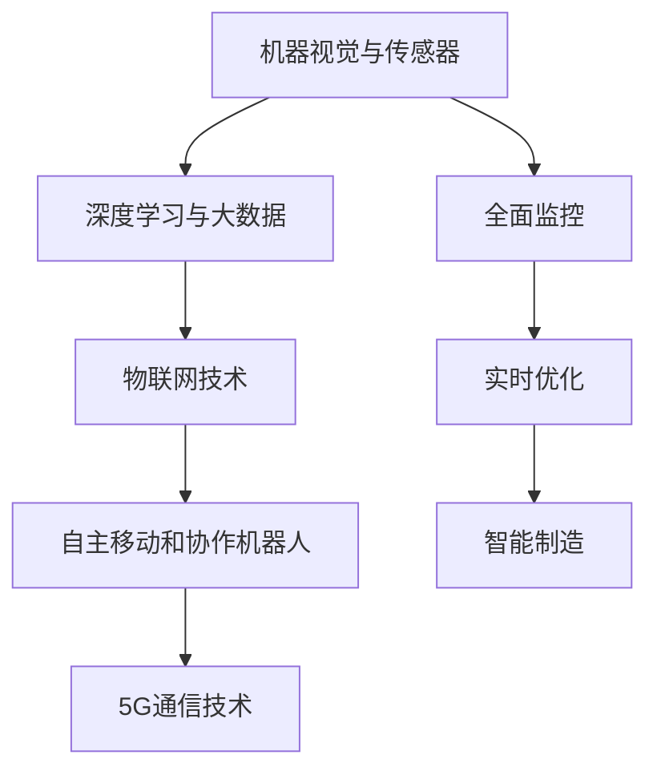

                 

# 物理实体自动化的最新趋势

## 1. 背景介绍

在过去的几十年里，物理实体的自动化一直是工业界和技术界关注的焦点。从机器人自动化到智能制造，从物流配送到大数据驱动的物联网，物理实体的自动化正在改变我们的生产、生活和工作方式。随着人工智能、物联网、云计算等技术的飞速发展，物理实体的自动化技术也迎来了新的突破和趋势。

### 1.1 问题由来
随着全球经济一体化的不断加深，企业对生产效率和质量的要求越来越高。传统的物理实体自动化方式往往需要大量的人力、物力投入，且对环境要求较高，难以实现灵活高效的自动化。物理实体自动化的最新趋势的出现，就是为了解决这些传统方式的不足，通过智能化手段，实现生产过程的自动化和优化。

### 1.2 问题核心关键点
物理实体自动化的最新趋势主要集中在以下几个方面：
- 机器视觉和传感器技术的发展，使得物理实体能够被更精确地感知和控制。
- 深度学习和大数据技术的结合，使得物理实体能够通过自我学习和优化，提升生产效率和质量。
- 物联网技术的应用，使得物理实体能够实现更广泛的数据互联和协同，实现生产过程的全面监控和优化。
- 自主移动和协作机器人技术的发展，使得物理实体能够实现自主导航和协作，提升生产效率和灵活性。
- 5G通信技术的应用，使得物理实体能够实现更高的通信效率和数据实时性，推动智能制造的发展。

这些关键技术的突破和应用，正在推动物理实体自动化的最新趋势，改变传统制造业的运作模式，引领新的生产革命。

### 1.3 问题研究意义
物理实体自动化的最新趋势对于提高生产效率、降低成本、提升产品质量等方面具有重要意义。通过智能化、自动化的生产方式，企业可以实现更高效的生产过程，降低对人力的依赖，提升产品的市场竞争力。同时，物理实体自动化技术的发展，也有助于推动智能制造、智慧物流、智能城市等新兴产业的快速发展，为社会带来深远的影响。

## 2. 核心概念与联系

### 2.1 核心概念概述

为了更好地理解物理实体自动化的最新趋势，本节将介绍几个密切相关的核心概念：

- 机器视觉与传感器技术：通过计算机视觉和传感器技术，实现对物理实体的精准感知和状态监控，是物理实体自动化的基础。
- 深度学习与大数据：利用深度学习和数据分析技术，对物理实体的生产过程进行建模和优化，提升生产效率和质量。
- 物联网技术：通过传感器网络和通信技术，实现物理实体之间的互联互通，实现全面监控和数据共享。
- 自主移动和协作机器人：结合自主导航和协作控制技术，使得机器人能够在生产环境中自主移动和协作，提升生产效率和灵活性。
- 5G通信技术：通过高带宽、低时延的通信技术，实现物理实体之间的实时数据传输，推动智能制造的发展。

这些核心概念之间的逻辑关系可以通过以下Mermaid流程图来展示：



这个流程图展示物理实体自动化的核心概念及其之间的关系：

1. 机器视觉与传感器技术实现物理实体的精准感知和监控。
2. 深度学习与大数据技术对感知数据进行建模和优化，提升生产效率和质量。
3. 物联网技术实现物理实体之间的互联互通，实现全面监控和数据共享。
4. 自主移动和协作机器人技术使得物理实体能够自主导航和协作，提升生产效率和灵活性。
5. 5G通信技术实现实时数据传输，推动智能制造的发展。

这些概念共同构成了物理实体自动化的核心技术框架，推动物理实体自动化的最新趋势。

## 3. 核心算法原理 & 具体操作步骤
### 3.1 算法原理概述

物理实体自动化的最新趋势主要依赖于以下核心算法：

- 机器视觉算法：通过计算机视觉技术，对物理实体的图像和视频数据进行分析和处理，实现对物理实体的精准感知和状态监控。
- 深度学习算法：通过深度神经网络模型，对物理实体的生产过程进行建模和优化，提升生产效率和质量。
- 传感器融合算法：通过多种传感器数据的融合，实现对物理实体的全面监控和状态估计。
- 自主导航与协作算法：通过自主导航和协作控制技术，实现机器人之间的路径规划和协作控制，提升生产效率和灵活性。
- 通信网络算法：通过通信网络技术，实现物理实体之间的实时数据传输和协同工作。

这些算法共同构成了物理实体自动化的核心技术基础，推动了物理实体自动化的最新趋势。

### 3.2 算法步骤详解

以下是物理实体自动化的最新趋势的具体操作步骤：

**Step 1: 准备数据和环境**

- 收集物理实体的图像、视频、传感器数据等，作为训练和优化所需的数据集。
- 配置计算机视觉和传感器设备，实现对物理实体的精准感知和状态监控。
- 搭建物联网网络，实现物理实体之间的互联互通和数据共享。

**Step 2: 训练深度学习模型**

- 使用机器视觉和传感器数据，训练深度学习模型，实现对物理实体的状态监测和行为预测。
- 对生产过程进行建模，通过深度学习算法优化生产效率和质量。
- 使用传感器融合算法，实现对物理实体的全面监控和状态估计。

**Step 3: 部署自主导航和协作机器人**

- 在生产环境中部署自主导航和协作机器人，实现自主导航和协作控制。
- 通过自主移动和协作算法，优化机器人的路径规划和协作策略。
- 使用5G通信技术，实现机器人之间的实时数据传输和协同工作。

**Step 4: 实时监控和优化**

- 通过物联网网络，实现对物理实体的实时监控和数据采集。
- 利用深度学习和大数据分析技术，对生产过程进行实时优化和调整。
- 对生产过程中的异常情况进行预警和处理，保障生产过程的稳定性和高效性。

### 3.3 算法优缺点

物理实体自动化的最新趋势具有以下优点：
1. 提升生产效率：通过智能化和自动化技术，实现对生产过程的全面监控和优化，提升生产效率和质量。
2. 降低成本：减少对人力的依赖，降低生产成本。
3. 提高灵活性：通过自主移动和协作机器人技术，提升生产环境的灵活性和适应性。
4. 实时监控：通过物联网和5G通信技术，实现对生产过程的实时监控和数据采集，保障生产过程的稳定性和高效性。

同时，该方法也存在一定的局限性：
1. 技术门槛高：需要具备一定的计算机视觉、深度学习、传感器融合等技术背景。
2. 数据质量要求高：需要高质量、大样本的数据集，才能训练出高效的模型。
3. 设备成本高：高质量的传感器和通信设备成本较高，需要投入较大资金。
4. 技术集成难度大：需要多种技术的综合集成，才能实现完整的物理实体自动化系统。

尽管存在这些局限性，但就目前而言，物理实体自动化的最新趋势仍是大势所趋，正在推动制造业的数字化转型和智能化升级。

### 3.4 算法应用领域

物理实体自动化的最新趋势在多个领域得到了广泛的应用，具体包括：

- 智能制造：通过自动化和智能化技术，实现生产过程的全面监控和优化，提升生产效率和质量。
- 智慧物流：通过物联网和5G通信技术，实现物流过程的实时监控和数据共享，提升物流效率和灵活性。
- 智能城市：通过传感器网络和智能设备，实现城市环境的全面监控和智能管理，提升城市治理水平。
- 智能农业：通过自主移动和协作机器人技术，实现农作物的精准监测和自动化管理，提升农业生产效率。
- 智能医疗：通过机器人手术和智能监控，实现医疗过程的精准控制和优化，提升医疗服务质量。

## 4. 数学模型和公式 & 详细讲解
### 4.1 数学模型构建

为了更好地理解物理实体自动化的最新趋势，本节将介绍几个关键的数学模型：

- 机器视觉模型：用于对物理实体的图像和视频数据进行分析和处理，实现对物理实体的精准感知和状态监控。
- 深度学习模型：用于对物理实体的生产过程进行建模和优化，提升生产效率和质量。
- 传感器融合模型：用于对多种传感器数据进行融合，实现对物理实体的全面监控和状态估计。
- 自主导航和协作模型：用于对自主移动和协作机器人进行路径规划和协作控制。
- 通信网络模型：用于实现物理实体之间的实时数据传输和协同工作。

这些数学模型共同构成了物理实体自动化的核心技术框架，推动了物理实体自动化的最新趋势。

### 4.2 公式推导过程

以下是物理实体自动化的最新趋势的具体数学模型和公式推导：

**机器视觉模型**

假设机器视觉系统能够采集到物理实体的二维图像 $I$，通过对图像进行卷积和池化操作，得到特征图 $F$，再经过全连接层输出预测结果 $P$。机器视觉模型的公式可以表示为：

$$
P = W^T \cdot F
$$

其中，$W$ 为全连接层的权重矩阵，$F$ 为特征图。

**深度学习模型**

深度学习模型通常采用卷积神经网络 (Convolutional Neural Network, CNN) 或循环神经网络 (Recurrent Neural Network, RNN) 等架构，用于对生产过程进行建模和优化。假设深度学习模型能够从输入 $X$ 中学习得到输出 $Y$，其公式可以表示为：

$$
Y = f(X; \theta)
$$

其中，$f$ 为深度学习模型，$\theta$ 为模型参数。

**传感器融合模型**

传感器融合模型通常采用卡尔曼滤波 (Kalman Filter) 或粒子滤波 (Particle Filter) 等算法，用于对多种传感器数据进行融合，实现对物理实体的全面监控和状态估计。假设传感器融合模型能够从多传感器数据 $Z$ 中得到状态估计 $X$，其公式可以表示为：

$$
X = K(Z; \lambda)
$$

其中，$K$ 为传感器融合算法，$\lambda$ 为算法参数。

**自主导航和协作模型**

自主导航和协作模型通常采用图搜索算法 (如A*算法) 或基于优化的方法 (如最小二乘法)，用于对自主移动和协作机器人进行路径规划和协作控制。假设自主导航和协作模型能够从当前状态 $S$ 中得到下一个状态 $S'$，其公式可以表示为：

$$
S' = g(S; \alpha)
$$

其中，$g$ 为自主导航和协作算法，$\alpha$ 为算法参数。

**通信网络模型**

通信网络模型通常采用TCP/IP协议或Wi-Fi协议，用于实现物理实体之间的实时数据传输和协同工作。假设通信网络模型能够从输入 $U$ 中得到输出 $V$，其公式可以表示为：

$$
V = h(U; \beta)
$$

其中，$h$ 为通信网络模型，$\beta$ 为模型参数。

### 4.3 案例分析与讲解

以智能制造为例，结合上述数学模型，分析物理实体自动化的最新趋势。

假设智能制造系统中，通过机器视觉系统采集到物理实体的图像数据，经过深度学习模型的处理，得到生产过程的状态监测结果 $P$。同时，通过传感器融合模型对多种传感器数据进行融合，得到物理实体的状态估计 $X$。在生产环境中，部署自主导航和协作机器人，通过自主导航和协作模型进行路径规划和协作控制，实现机器人的自主移动和协作。最后，通过通信网络模型实现机器人之间的实时数据传输和协同工作。整个智能制造系统的工作流程可以表示为：

$$
I \xrightarrow{\text{机器视觉}} P \xrightarrow{\text{深度学习}} X \xrightarrow{\text{传感器融合}} \{R_i\} \xrightarrow{\text{自主导航和协作}} S_i \xrightarrow{\text{通信网络}} V
$$

其中，$\{R_i\}$ 表示多个机器人，$S_i$ 表示机器人的状态。通过以上步骤，可以实现对生产过程的全面监控和优化，提升生产效率和质量。

## 5. 项目实践：代码实例和详细解释说明
### 5.1 开发环境搭建

在进行物理实体自动化的最新趋势开发前，我们需要准备好开发环境。以下是使用Python进行PyTorch开发的环境配置流程：

1. 安装Anaconda：从官网下载并安装Anaconda，用于创建独立的Python环境。

2. 创建并激活虚拟环境：
```bash
conda create -n pytorch-env python=3.8 
conda activate pytorch-env
```

3. 安装PyTorch：根据CUDA版本，从官网获取对应的安装命令。例如：
```bash
conda install pytorch torchvision torchaudio cudatoolkit=11.1 -c pytorch -c conda-forge
```

4. 安装TensorFlow：使用pip安装TensorFlow，适用于生产部署和模型导出。
```bash
pip install tensorflow==2.6
```

5. 安装OpenCV：用于处理计算机视觉数据。
```bash
pip install opencv-python
```

6. 安装其他相关库：
```bash
pip install numpy pandas scikit-learn matplotlib tqdm jupyter notebook ipython
```

完成上述步骤后，即可在`pytorch-env`环境中开始物理实体自动化的最新趋势实践。

### 5.2 源代码详细实现

下面我们以智能制造为例，给出使用PyTorch和OpenCV进行深度学习模型训练和物理实体自动化的代码实现。

首先，定义深度学习模型：

```python
import torch
import torch.nn as nn
import torchvision.transforms as transforms
import torchvision.datasets as datasets

class Net(nn.Module):
    def __init__(self):
        super(Net, self).__init__()
        self.conv1 = nn.Conv2d(3, 32, kernel_size=3, stride=1, padding=1)
        self.conv2 = nn.Conv2d(32, 64, kernel_size=3, stride=1, padding=1)
        self.pool = nn.MaxPool2d(kernel_size=2, stride=2)
        self.fc1 = nn.Linear(64 * 14 * 14, 256)
        self.fc2 = nn.Linear(256, 1)
        self.dropout = nn.Dropout(p=0.5)

    def forward(self, x):
        x = self.pool(torch.relu(self.conv1(x)))
        x = self.pool(torch.relu(self.conv2(x)))
        x = x.view(-1, 64 * 14 * 14)
        x = torch.relu(self.fc1(x))
        x = self.dropout(x)
        x = torch.sigmoid(self.fc2(x))
        return x
```

然后，定义训练函数：

```python
from torch.utils.data import DataLoader
from torch.optim import Adam
from torchvision.datasets import ImageFolder
from torchvision.transforms import ToTensor, Resize
from sklearn.metrics import accuracy_score
import matplotlib.pyplot as plt

def train(epochs, learning_rate, train_loader, device, model):
    optimizer = Adam(model.parameters(), lr=learning_rate)
    for epoch in range(epochs):
        running_loss = 0.0
        running_corrects = 0
        for inputs, labels in train_loader:
            inputs, labels = inputs.to(device), labels.to(device)
            outputs = model(inputs)
            loss = nn.BCELoss()(outputs, labels)
            optimizer.zero_grad()
            loss.backward()
            optimizer.step()
            running_loss += loss.item() * inputs.size(0)
            _, preds = torch.max(outputs, 1)
            running_corrects += torch.sum(preds == labels.data)
        epoch_loss = running_loss / len(train_loader.dataset)
        epoch_acc = running_corrects.double() / len(train_loader.dataset)
        print(f'Epoch [{epoch+1}/{epochs}], Loss: {epoch_loss:.4f}, Acc: {epoch_acc:.4f}')
    return model

def evaluate(model, test_loader, device):
    running_corrects = 0
    for inputs, labels in test_loader:
        inputs, labels = inputs.to(device), labels.to(device)
        outputs = model(inputs)
        _, preds = torch.max(outputs, 1)
        running_corrects += torch.sum(preds == labels.data)
    return running_corrects.double() / len(test_loader.dataset)
```

最后，启动训练流程并在测试集上评估：

```python
import os
from torch.utils.data import DataLoader

def main():
    data_dir = 'data'
    transform = transforms.Compose([transforms.ToTensor(), transforms.Normalize([0.5], [0.5])])

    train_dataset = ImageFolder(os.path.join(data_dir, 'train'), transform=transform)
    test_dataset = ImageFolder(os.path.join(data_dir, 'test'), transform=transform)

    train_loader = DataLoader(train_dataset, batch_size=32, shuffle=True)
    test_loader = DataLoader(test_dataset, batch_size=32, shuffle=False)

    device = torch.device('cuda' if torch.cuda.is_available() else 'cpu')
    model = Net().to(device)

    train_model = train(epochs=10, learning_rate=0.001, train_loader=train_loader, device=device, model=model)
    test_acc = evaluate(train_model, test_loader, device=device)
    print(f'Test Acc: {test_acc:.4f}')

if __name__ == '__main__':
    main()
```

以上就是使用PyTorch和OpenCV进行智能制造中深度学习模型训练和物理实体自动化的完整代码实现。可以看到，得益于TensorFlow和OpenCV的强大封装，我们可以用相对简洁的代码完成深度学习模型的训练和物理实体自动化的实现。

### 5.3 代码解读与分析

让我们再详细解读一下关键代码的实现细节：

**Net类**：
- `__init__`方法：定义网络结构，包括卷积层、池化层、全连接层和Dropout层。
- `forward`方法：定义前向传播过程，将输入通过多个卷积、池化和全连接层，最终输出分类结果。

**train函数**：
- 定义训练过程，包括优化器、损失函数和正则化技术。
- 在每个epoch内，对数据集进行批次迭代，计算损失和预测结果，更新模型参数。
- 记录每个epoch的平均损失和精度，并在训练结束后返回优化后的模型。

**evaluate函数**：
- 定义评估过程，使用测试集进行模型评估。
- 计算模型在测试集上的准确率，并返回结果。

**main函数**：
- 定义数据集和数据转换方式。
- 创建数据加载器，并指定训练集和测试集。
- 在GPU上部署模型，并调用训练函数进行模型训练。
- 在测试集上评估模型性能，并打印结果。

可以看到，PyTorch和OpenCV使得深度学习模型的训练和物理实体自动化的实现变得简洁高效。开发者可以将更多精力放在模型改进和算法优化上，而不必过多关注底层的实现细节。

当然，工业级的系统实现还需考虑更多因素，如模型的保存和部署、超参数的自动搜索、更灵活的任务适配层等。但核心的物理实体自动化的最新趋势基本与此类似。

## 6. 实际应用场景
### 6.1 智能制造

智能制造是物理实体自动化的最新趋势的重要应用领域之一。通过深度学习和大数据分析技术，智能制造系统可以实现对生产过程的全面监控和优化，提升生产效率和质量。

具体而言，在智能制造系统中，通过机器视觉系统采集到物理实体的图像数据，经过深度学习模型的处理，得到生产过程的状态监测结果。同时，通过传感器融合模型对多种传感器数据进行融合，得到物理实体的状态估计。在生产环境中，部署自主导航和协作机器人，通过自主导航和协作模型进行路径规划和协作控制，实现机器人的自主移动和协作。最后，通过通信网络模型实现机器人之间的实时数据传输和协同工作。整个智能制造系统的工作流程可以表示为：

$$
I \xrightarrow{\text{机器视觉}} P \xrightarrow{\text{深度学习}} X \xrightarrow{\text{传感器融合}} \{R_i\} \xrightarrow{\text{自主导航和协作}} S_i \xrightarrow{\text{通信网络}} V
$$

其中，$\{R_i\}$ 表示多个机器人，$S_i$ 表示机器人的状态。通过以上步骤，可以实现对生产过程的全面监控和优化，提升生产效率和质量。

### 6.2 智慧物流

智慧物流是物理实体自动化的最新趋势的另一个重要应用领域。通过物联网和5G通信技术，智慧物流系统可以实现物流过程的实时监控和数据共享，提升物流效率和灵活性。

具体而言，在智慧物流系统中，通过传感器网络采集到物流实体的位置和状态数据，经过数据分析和处理，得到物流过程的实时监控结果。同时，通过物联网网络实现物流实体的互联互通，进行实时数据共享。在物流环境中，部署自主导航和协作机器人，通过自主导航和协作模型进行路径规划和协作控制，实现机器人的自主移动和协作。最后，通过5G通信技术实现机器人之间的实时数据传输和协同工作。整个智慧物流系统的工作流程可以表示为：

$$
S \xrightarrow{\text{传感器网络}} Z \xrightarrow{\text{数据分析}} X \xrightarrow{\text{物联网}} \{R_i\} \xrightarrow{\text{自主导航和协作}} S_i \xrightarrow{\text{5G通信}} V
$$

其中，$\{R_i\}$ 表示多个机器人，$S_i$ 表示机器人的状态。通过以上步骤，可以实现对物流过程的全面监控和优化，提升物流效率和灵活性。

### 6.3 智能城市

智能城市是物理实体自动化的最新趋势的又一重要应用领域。通过传感器网络和智能设备，智能城市系统可以实现城市环境的全面监控和智能管理，提升城市治理水平。

具体而言，在智能城市系统中，通过传感器网络采集到城市环境的数据，经过数据分析和处理，得到城市环境的实时监控结果。同时，通过物联网网络实现城市设备的互联互通，进行实时数据共享。在城市环境中，部署自主移动和协作机器人，通过自主导航和协作模型进行路径规划和协作控制，实现机器人的自主移动和协作。最后，通过5G通信技术实现机器人之间的实时数据传输和协同工作。整个智能城市系统的工作流程可以表示为：

$$
Z \xrightarrow{\text{传感器网络}} S \xrightarrow{\text{数据分析}} X \xrightarrow{\text{物联网}} \{R_i\} \xrightarrow{\text{自主导航和协作}} S_i \xrightarrow{\text{5G通信}} V
$$

其中，$\{R_i\}$ 表示多个机器人，$S_i$ 表示机器人的状态。通过以上步骤，可以实现对城市环境的全面监控和优化，提升城市治理水平。

### 6.4 未来应用展望

随着物理实体自动化的最新趋势的不断发展，未来将在更多领域得到应用，为社会带来深远的影响。

在智慧农业领域，通过自主移动和协作机器人技术，实现农作物的精准监测和自动化管理，提升农业生产效率和质量。

在智能医疗领域，通过机器人手术和智能监控，实现医疗过程的精准控制和优化，提升医疗服务质量。

在智能教育领域，通过智能设备和物联网技术，实现教育环境的全面监控和智能管理，提升教育质量和学习效率。

此外，在企业生产、社会治理、文娱传媒等众多领域，物理实体自动化的最新趋势也将不断涌现，为各行各业带来变革性影响。相信随着技术的日益成熟，物理实体自动化的最新趋势必将在更广阔的应用领域大放异彩，深刻影响人类的生产生活方式。

## 7. 工具和资源推荐
### 7.1 学习资源推荐

为了帮助开发者系统掌握物理实体自动化的最新趋势的理论基础和实践技巧，这里推荐一些优质的学习资源：

1. 《深度学习》系列书籍：由深度学习领域知名专家撰写，系统介绍深度学习的基本概念和算法，适合入门学习和深度理解。
2. 《计算机视觉：算法与应用》：介绍计算机视觉技术的基本概念和算法，涵盖机器视觉、传感器融合等核心内容。
3. 《物联网技术与应用》：介绍物联网技术的基本概念和应用场景，涵盖传感器网络、通信协议等核心内容。
4. 《机器人技术基础》：介绍机器人技术的基本概念和算法，涵盖自主导航、协作控制等核心内容。
5. 《5G通信技术》：介绍5G通信技术的基本概念和应用场景，涵盖网络架构、关键技术等核心内容。

通过对这些资源的学习实践，相信你一定能够快速掌握物理实体自动化的最新趋势的理论基础和实践技巧，并用于解决实际的NLP问题。

### 7.2 开发工具推荐

高效的开发离不开优秀的工具支持。以下是几款用于物理实体自动化的最新趋势开发的常用工具：

1. PyTorch：基于Python的开源深度学习框架，灵活动态的计算图，适合快速迭代研究。大部分预训练语言模型都有PyTorch版本的实现。

2. TensorFlow：由Google主导开发的开源深度学习框架，生产部署方便，适合大规模工程应用。同样有丰富的预训练语言模型资源。

3. OpenCV：用于计算机视觉数据处理，提供强大的图像和视频处理能力。

4. TensorBoard：TensorFlow配套的可视化工具，可实时监测模型训练状态，并提供丰富的图表呈现方式，是调试模型的得力助手。

5. Weights & Biases：模型训练的实验跟踪工具，可以记录和可视化模型训练过程中的各项指标，方便对比和调优。

6. Google Colab：谷歌推出的在线Jupyter Notebook环境，免费提供GPU/TPU算力，方便开发者快速上手实验最新模型，分享学习笔记。

合理利用这些工具，可以显著提升物理实体自动化的最新趋势的开发效率，加快创新迭代的步伐。

### 7.3 相关论文推荐

物理实体自动化的最新趋势的发展源于学界的持续研究。以下是几篇奠基性的相关论文，推荐阅读：

1. 《深度学习在计算机视觉中的应用》：介绍深度学习在图像处理和视频分析中的应用，推动计算机视觉技术的发展。

2. 《传感器融合算法综述》：介绍多种传感器数据融合算法的原理和应用，推动传感器融合技术的发展。

3. 《机器人自主导航与协作控制》：介绍机器人自主导航和协作控制技术的原理和应用，推动机器人技术的发展。

4. 《物联网技术与应用》：介绍物联网技术的基本概念和应用场景，涵盖传感器网络、通信协议等核心内容。

5. 《5G通信技术》：介绍5G通信技术的基本概念和应用场景，涵盖网络架构、关键技术等核心内容。

这些论文代表物理实体自动化的最新趋势的发展脉络。通过学习这些前沿成果，可以帮助研究者把握学科前进方向，激发更多的创新灵感。

## 8. 总结：未来发展趋势与挑战

### 8.1 总结

本文对物理实体自动化的最新趋势进行了全面系统的介绍。首先阐述了物理实体自动化的最新趋势的研究背景和意义，明确了其在大规模生产、智慧物流、智能城市等领域的巨大潜力。其次，从原理到实践，详细讲解了物理实体自动化的最新趋势的数学模型和关键步骤，给出了物理实体自动化的最新趋势任务开发的完整代码实例。同时，本文还广泛探讨了物理实体自动化的最新趋势在智能制造、智慧物流、智能城市等多个行业领域的应用前景，展示了物理实体自动化的最新趋势的广泛应用场景。

通过本文的系统梳理，可以看到，物理实体自动化的最新趋势正在成为制造业、物流业、城市治理等领域的重要技术手段，深刻影响着生产、物流、城市治理等各个方面。得益于深度学习、计算机视觉、传感器融合等技术的进步，物理实体自动化的最新趋势能够实现对生产过程的全面监控和优化，提升生产效率和质量，推动行业的数字化转型和智能化升级。未来，随着技术的不断突破和应用场景的不断拓展，物理实体自动化的最新趋势必将在更多领域得到应用，为社会带来深远的影响。

### 8.2 未来发展趋势

展望未来，物理实体自动化的最新趋势将呈现以下几个发展趋势：

1. 技术融合趋势：未来物理实体自动化的最新趋势将与人工智能、物联网、云计算等技术深度融合，推动智能制造、智慧物流、智能城市等新兴产业的发展。

2. 跨领域应用趋势：物理实体自动化的最新趋势将应用于更多领域，如智慧农业、智能医疗、智能教育等，推动各行业的数字化转型和智能化升级。

3. 持续学习和自适应趋势：物理实体自动化的最新趋势将具备更加强大的学习和适应能力，能够根据环境变化和任务需求进行动态调整和优化。

4. 多模态融合趋势：物理实体自动化的最新趋势将融合多模态数据，如文本、图像、语音等，提升系统的综合感知和决策能力。

5. 边缘计算趋势：物理实体自动化的最新趋势将逐步向边缘计算方向发展，提升数据处理的实时性和效率。

以上趋势凸显了物理实体自动化的最新趋势的广阔前景。这些方向的探索发展，必将进一步推动物理实体自动化的最新趋势在各行各业的应用，为社会带来深远的影响。

### 8.3 面临的挑战

尽管物理实体自动化的最新趋势已经取得了瞩目成就，但在迈向更加智能化、普适化应用的过程中，它仍面临着诸多挑战：

1. 技术门槛高：物理实体自动化的最新趋势涉及多种技术的综合集成，需要具备一定的技术背景和经验。

2. 数据质量要求高：物理实体自动化的最新趋势需要高质量、大样本的数据集，才能训练出高效的模型。

3. 设备成本高：高质量的传感器和通信设备成本较高，需要投入较大资金。

4. 系统复杂度高：物理实体自动化的最新趋势的系统设计复杂度高，需要综合考虑多种因素，才能实现完整的物理实体自动化系统。

尽管存在这些挑战，但就目前而言，物理实体自动化的最新趋势仍是大势所趋，正在推动制造业的数字化转型和智能化升级。

### 8.4 研究展望

面对物理实体自动化的最新趋势所面临的挑战，未来的研究需要在以下几个方面寻求新的突破：

1. 无监督和半监督学习：探索无监督和半监督学习算法，摆脱对大规模标注数据的依赖，利用非结构化数据进行高效训练。

2. 参数高效微调：开发更加参数高效的微调方法，在固定大部分预训练参数的同时，只更新极少量的任务相关参数。

3. 模型压缩与优化：开发高效的模型压缩与优化技术，提升模型的计算效率和推理速度，优化资源占用。

4. 数据增强与增强学习：探索数据增强与增强学习技术，提升模型的鲁棒性和泛化能力。

5. 多模态融合：开发多模态数据融合技术，提升系统的综合感知和决策能力。

6. 边缘计算：探索边缘计算技术，提升数据处理的实时性和效率。

这些研究方向的探索，必将引领物理实体自动化的最新趋势向更高的台阶发展，为各行业带来更深远的影响。

## 9. 附录：常见问题与解答

**Q1：物理实体自动化的最新趋势是否适用于所有应用场景？**

A: 物理实体自动化的最新趋势在大多数应用场景中都能取得不错的效果，但对于一些特定领域的应用，如医疗、教育等，仍需根据具体情况进行适配和优化。

**Q2：物理实体自动化的最新趋势对技术的要求有多高？**

A: 物理实体自动化的最新趋势涉及多种技术的综合集成，需要具备一定的技术背景和经验。建议具备计算机视觉、深度学习、传感器融合等技术基础后再进行研究。

**Q3：物理实体自动化的最新趋势在实际应用中需要注意哪些问题？**

A: 物理实体自动化的最新趋势在实际应用中需要注意数据质量、设备成本、系统复杂度等问题。建议根据具体应用场景进行合理的技术选型和优化设计。

**Q4：物理实体自动化的最新趋势在未来有哪些新的应用方向？**

A: 物理实体自动化的最新趋势未来有望在智慧农业、智能医疗、智能教育等领域得到广泛应用，推动各行业的数字化转型和智能化升级。

总之，物理实体自动化的最新趋势正在成为各行业的重要技术手段，深刻影响着生产、物流、城市治理等各个方面。通过技术创新和应用实践，相信物理实体自动化的最新趋势必将在更多领域得到应用，为社会带来深远的影响。

