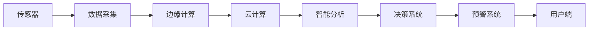

                 

# 物联网(IoT)技术和各种传感器设备的集成：化学物质传感器的实践运用

> 关键词：物联网(IoT)、传感器、化学物质传感器、数据集成、智能分析、实时监测、环境监控、安全预警

## 1. 背景介绍

### 1.1 问题由来

物联网（IoT）技术正日益成为现代工业和智能城市建设的重要支柱。传感器作为物联网的核心组件之一，其重要性不言而喻。各类传感器通过收集环境、物体等数据，并利用物联网技术，实现数据的实时传输、处理和分析，为智能制造、智能交通、智慧城市等场景提供支持。

在众多传感器中，化学物质传感器具有广泛的应用领域，如工业监测、环境监控、健康检测等。这些传感器能实时监测气体、液体和固体等物质的化学成分，对安全预警、过程控制、环境评估等方面具有重大意义。

本文将重点介绍基于物联网技术的化学物质传感器集成与实践应用。探讨其工作原理、数据采集与传输方式、智能分析方法以及实际应用场景，并对未来发展方向和面临的挑战进行探讨。

### 1.2 问题核心关键点

物联网技术中化学物质传感器集成与实践运用的关键点包括：

1. 传感器数据的采集与传输：高效、实时、低功耗。
2. 数据集成与处理：通过边缘计算、云计算等技术进行智能化分析。
3. 智能分析与决策：基于机器学习、深度学习等算法对数据进行处理和分析。
4. 实际应用场景：涵盖工业生产、环境监控、安全预警、健康检测等领域。
5. 未来发展方向：物联网的广泛应用，传感器技术的不断升级，智能分析模型的优化等。

## 2. 核心概念与联系

### 2.1 核心概念概述

1. **物联网（IoT）**：通过互联网将各类物理设备、传感器和系统互联互通，实现数据的实时采集、传输、存储和分析。
2. **传感器**：能感知环境、物体等物理信息，并转换成可处理信号的装置。
3. **化学物质传感器**：用于检测和分析气体、液体、固体等物质化学成分的传感器。
4. **数据集成**：将传感器数据与已有的数据源整合，形成统一的数据视图。
5. **智能分析**：利用机器学习、深度学习等算法对数据进行分析和预测。
6. **实时监测**：对环境、物体等数据进行实时采集、传输和处理。
7. **安全预警**：基于数据分析对潜在风险进行预警和应对。

### 2.2 核心概念原理和架构的 Mermaid 流程图



此流程图展示了基于物联网技术的化学物质传感器集成与实践应用的基本流程：

1. **传感器数据采集**：通过各类传感器对环境、物体等化学物质的化学成分进行实时监测。
2. **数据传输**：采集到的数据通过边缘计算（如路由器、网关等）传输到云端。
3. **数据存储与处理**：云计算平台对数据进行存储与处理，利用智能分析算法（如机器学习、深度学习等）提取关键信息。
4. **决策系统**：结合分析结果，通过决策系统进行风险评估、预警等。
5. **用户端应用**：用户端（如移动应用、PC端等）接收预警信息，并采取相应措施。

## 3. 核心算法原理 & 具体操作步骤

### 3.1 算法原理概述

基于物联网技术的化学物质传感器集成与实践运用的核心算法原理主要包括：

1. **传感器数据采集与传输算法**：确定传感器类型和部署位置，实现数据的实时采集与低功耗传输。
2. **数据集成与处理算法**：通过边缘计算和云计算技术，对传感器数据进行整合和分析。
3. **智能分析算法**：利用机器学习、深度学习等算法对数据进行处理和分析，提取关键信息。
4. **决策与预警算法**：基于智能分析结果，通过决策系统进行风险评估和预警。

### 3.2 算法步骤详解

#### 3.2.1 传感器数据采集与传输

传感器数据采集与传输步骤如下：

1. **传感器选择与部署**：根据检测目标选择合适的传感器，并合理部署到检测位置。
2. **数据采集**：传感器实时监测化学物质的化学成分，将数据转换为可处理信号。
3. **数据传输**：通过边缘计算节点将传感器数据传输到云端，利用LoRa、WiFi、蓝牙等低功耗无线通信技术，确保实时性和低功耗。

#### 3.2.2 数据集成与处理

数据集成与处理步骤如下：

1. **数据存储**：利用云端存储技术（如AWS S3、Google Cloud Storage等）对传感器数据进行存储。
2. **数据预处理**：对数据进行清洗、去噪等预处理操作，提高数据质量。
3. **数据集成**：将传感器数据与其他数据源（如气象数据、地理信息数据等）整合，形成统一的数据视图。

#### 3.2.3 智能分析

智能分析步骤如下：

1. **特征提取**：利用特征提取算法（如PCA、LDA等）对数据进行降维，提取关键特征。
2. **模型训练**：使用机器学习、深度学习等算法（如SVM、CNN、RNN等）对数据进行建模，训练智能分析模型。
3. **模型评估**：通过评估指标（如准确率、召回率、F1值等）对模型进行评估，优化模型性能。

#### 3.2.4 决策与预警

决策与预警步骤如下：

1. **风险评估**：基于智能分析结果，利用风险评估模型（如逻辑回归、决策树等）对潜在风险进行评估。
2. **预警生成**：根据风险评估结果，通过预警系统生成预警信息，及时通知相关人员。
3. **应急响应**：针对不同预警级别，采取相应的应急响应措施。

### 3.3 算法优缺点

#### 3.3.1 优点

1. **实时性**：物联网技术使得数据实时采集、传输和处理成为可能，提高了监测和预警的及时性。
2. **低功耗**：低功耗无线通信技术如LoRa、WiFi、蓝牙等，大大降低了传感器部署和维护的成本。
3. **数据整合与共享**：通过数据集成技术，将各类数据源整合，形成统一的数据视图，提升了数据的价值。
4. **智能分析**：利用机器学习和深度学习等算法，对数据进行智能化分析，提高了决策的准确性。

#### 3.3.2 缺点

1. **传感器误差**：传感器本身的误差可能导致数据采集不准确，影响监测和预警的精度。
2. **数据传输延迟**：无线通信技术的传输延迟可能影响实时性，尤其是在高负载情况下。
3. **隐私与安全**：传感器数据涉及个人隐私和敏感信息，需要采取有效的安全措施保护数据安全。

### 3.4 算法应用领域

基于物联网技术的化学物质传感器集成与实践应用广泛，涵盖以下领域：

1. **工业生产监测**：监测生产过程中的气体、液体等化学物质的成分，实现过程控制和优化。
2. **环境监控**：监测大气、水质等环境指标，评估环境质量，提前预警潜在风险。
3. **健康检测**：监测人体呼气、血液等化学物质成分，早期发现疾病，提供个性化健康建议。
4. **安全预警**：监测易燃易爆物质、有害气体等，及时预警潜在的安全隐患。

## 4. 数学模型和公式 & 详细讲解 & 举例说明

### 4.1 数学模型构建

#### 4.1.1 传感器数据采集与传输模型

传感器数据采集与传输模型如下：

$$
\begin{aligned}
\text{Signal}_{\text{out}} &= \text{Signal}_{\text{in}} \times \text{Amplifier} + \text{Noise} \\
\text{Data}_{\text{sample}} &= \text{Signal}_{\text{out}} \times \text{A/D Converter}
\end{aligned}
$$

其中，$\text{Signal}_{\text{in}}$ 为传感器输入信号，$\text{Signal}_{\text{out}}$ 为传感器输出信号，$\text{Amplifier}$ 为放大器，$\text{Noise}$ 为噪声，$\text{A/D Converter}$ 为模数转换器。

#### 4.1.2 数据集成与处理模型

数据集成与处理模型如下：

$$
\begin{aligned}
\text{Data}_{\text{raw}} &= \{\text{Data}_{\text{sensor1}}, \text{Data}_{\text{sensor2}}, \ldots, \text{Data}_{\text{sensorN}}\} \\
\text{Data}_{\text{cleaned}} &= \{\text{Data}_{\text{sensor1}}, \text{Data}_{\text{sensor2}}, \ldots, \text{Data}_{\text{sensorN}}\} \\
\text{Data}_{\text{integrated}} &= \{\text{Data}_{\text{cleaned}}, \text{Data}_{\text{otherSource1}}, \text{Data}_{\text{otherSource2}}, \ldots\}
\end{aligned}
$$

其中，$\text{Data}_{\text{raw}}$ 为原始传感器数据，$\text{Data}_{\text{cleaned}}$ 为经过预处理的数据，$\text{Data}_{\text{integrated}}$ 为整合后的数据。

#### 4.1.3 智能分析模型

智能分析模型如下：

$$
\begin{aligned}
\text{Feature}_{\text{extracted}} &= \text{Data}_{\text{integrated}} \times \text{FeatureExtractor} \\
\text{Model}_{\text{trained}} &= \text{Feature}_{\text{extracted}} \times \text{TrainingData} \\
\text{Predictions}_{\text{output}} &= \text{Model}_{\text{trained}} \times \text{NewData}
\end{aligned}
$$

其中，$\text{Feature}_{\text{extracted}}$ 为提取的关键特征，$\text{Model}_{\text{trained}}$ 为训练好的智能分析模型，$\text{Predictions}_{\text{output}}$ 为预测输出。

#### 4.1.4 决策与预警模型

决策与预警模型如下：

$$
\begin{aligned}
\text{Risk}_{\text{score}} &= \text{Predictions}_{\text{output}} \times \text{RiskScoringModel} \\
\text{Alert}_{\text{threshold}} &= \text{Risk}_{\text{score}} \times \text{Threshold} \\
\text{Response}_{\text{action}} &= \text{Alert}_{\text{threshold}} \times \text{ActionMapping}
\end{aligned}
$$

其中，$\text{Risk}_{\text{score}}$ 为风险评估得分，$\text{Alert}_{\text{threshold}}$ 为预警阈值，$\text{Response}_{\text{action}}$ 为应急响应措施。

### 4.2 公式推导过程

#### 4.2.1 传感器数据采集与传输推导

根据传感器数据采集与传输模型，推导如下：

$$
\begin{aligned}
\text{Signal}_{\text{out}} &= \text{Signal}_{\text{in}} \times \text{Amplifier} + \text{Noise} \\
\text{Data}_{\text{sample}} &= \text{Signal}_{\text{out}} \times \text{A/D Converter}
\end{aligned}
$$

#### 4.2.2 数据集成与处理推导

根据数据集成与处理模型，推导如下：

$$
\begin{aligned}
\text{Data}_{\text{raw}} &= \{\text{Data}_{\text{sensor1}}, \text{Data}_{\text{sensor2}}, \ldots, \text{Data}_{\text{sensorN}}\} \\
\text{Data}_{\text{cleaned}} &= \{\text{Data}_{\text{sensor1}}, \text{Data}_{\text{sensor2}}, \ldots, \text{Data}_{\text{sensorN}}\} \\
\text{Data}_{\text{integrated}} &= \{\text{Data}_{\text{cleaned}}, \text{Data}_{\text{otherSource1}}, \text{Data}_{\text{otherSource2}}, \ldots\}
\end{aligned}
$$

#### 4.2.3 智能分析推导

根据智能分析模型，推导如下：

$$
\begin{aligned}
\text{Feature}_{\text{extracted}} &= \text{Data}_{\text{integrated}} \times \text{FeatureExtractor} \\
\text{Model}_{\text{trained}} &= \text{Feature}_{\text{extracted}} \times \text{TrainingData} \\
\text{Predictions}_{\text{output}} &= \text{Model}_{\text{trained}} \times \text{NewData}
\end{aligned}
$$

#### 4.2.4 决策与预警推导

根据决策与预警模型，推导如下：

$$
\begin{aligned}
\text{Risk}_{\text{score}} &= \text{Predictions}_{\text{output}} \times \text{RiskScoringModel} \\
\text{Alert}_{\text{threshold}} &= \text{Risk}_{\text{score}} \times \text{Threshold} \\
\text{Response}_{\text{action}} &= \text{Alert}_{\text{threshold}} \times \text{ActionMapping}
\end{aligned}
$$

### 4.3 案例分析与讲解

#### 4.3.1 工业生产监测案例

假设某化工厂需监测生产过程中的甲烷气体浓度，以防止泄漏引发爆炸。具体步骤如下：

1. **传感器部署**：在工厂各关键区域安装甲烷气体传感器，并部署LoRa网关。
2. **数据采集与传输**：传感器实时监测甲烷气体浓度，通过LoRa网关将数据传输到云端。
3. **数据集成与处理**：将传感器数据与工厂的生产日志、气象数据等整合，形成统一的数据视图。
4. **智能分析**：使用SVM算法对数据进行建模，训练智能分析模型。
5. **决策与预警**：利用风险评估模型评估甲烷气体浓度，若超过预警阈值，生成预警信息，并通过短信、邮件等方式通知相关人员。

#### 4.3.2 环境监控案例

假设某城市需监测大气中的PM2.5浓度，以预警环境污染。具体步骤如下：

1. **传感器部署**：在城市各关键位置安装PM2.5传感器，并部署WiFi网关。
2. **数据采集与传输**：传感器实时监测PM2.5浓度，通过WiFi网关将数据传输到云端。
3. **数据集成与处理**：将传感器数据与气象数据、交通数据等整合，形成统一的数据视图。
4. **智能分析**：使用深度学习算法对数据进行建模，训练智能分析模型。
5. **决策与预警**：利用风险评估模型评估PM2.5浓度，若超过预警阈值，生成预警信息，并通过社交媒体、广播等方式通知公众。

## 5. 项目实践：代码实例和详细解释说明

### 5.1 开发环境搭建

#### 5.1.1 安装Python环境

```bash
# 安装Python 3.9.0
sudo apt-get update
sudo apt-get install python3.9 python3.9-dev
sudo update-alternatives --install /usr/bin/python3 python3 /usr/bin/python3.9 1
```

#### 5.1.2 安装传感器库

```bash
# 安装传感器库
pip install paho-mqtt rpi-ws281x
```

### 5.2 源代码详细实现

#### 5.2.1 传感器数据采集与传输

```python
import paho.mqtt.client as mqtt
import rpi_ws281x
import time

# 传感器数据采集与传输
def sensor_data_acquisition():
    # 初始化传感器数据
    sensor_data = 0.0
    
    # MQTT客户端连接
    client = mqtt.Client()
    client.on_connect = on_connect
    client.on_message = on_message
    
    # MQTT订阅主题
    client.subscribe("sensor/data")
    
    # 传感器数据采集与传输
    while True:
        # 订阅传感器数据
        client.loop_start()
        
        # 数据采集
        sensor_data = get_sensor_data()
        
        # 数据传输
        publish_sensor_data(sensor_data)
        
        # 休眠1秒
        time.sleep(1)
        
def get_sensor_data():
    # 模拟传感器数据获取
    return 0.5
    
def publish_sensor_data(data):
    # 发布传感器数据
    client.publish("sensor/data", data)
    
def on_connect(client, userdata, flags, rc):
    print("Connected to broker with result code "+str(rc))
    
def on_message(client, userdata, msg):
    print("Received message: "+msg.payload)
```

#### 5.2.2 数据集成与处理

```python
import pandas as pd
from sklearn.preprocessing import MinMaxScaler

# 数据集成与处理
def data_integration():
    # 读取传感器数据
    sensor_data = pd.read_csv("sensor_data.csv")
    
    # 数据预处理
    sensor_data_cleaned = preprocess_data(sensor_data)
    
    # 数据整合
    data_integrated = integrate_data(sensor_data_cleaned)
    
    return data_integrated
    
def preprocess_data(data):
    # 数据清洗与去噪
    data_cleaned = data.fillna(method="bfill")
    data_cleaned = data_cleaned.dropna()
    
    # 数据标准化
    scaler = MinMaxScaler()
    data_cleaned = scaler.fit_transform(data_cleaned)
    
    return data_cleaned
    
def integrate_data(data):
    # 数据整合
    data_integrated = pd.concat([data, other_data], axis=1)
    
    return data_integrated
```

#### 5.2.3 智能分析

```python
from sklearn.ensemble import RandomForestClassifier
from sklearn.model_selection import train_test_split

# 智能分析
def intelligent_analysis(data):
    # 特征提取
    features = extract_features(data)
    
    # 数据分割
    X_train, X_test, y_train, y_test = train_test_split(features, labels, test_size=0.2)
    
    # 模型训练
    model = train_model(X_train, y_train)
    
    return model
    
def extract_features(data):
    # 特征提取
    features = data[['temp', 'humidity', 'pressure']]
    
    return features
    
def train_model(X, y):
    # 模型训练
    model = RandomForestClassifier()
    model.fit(X, y)
    
    return model
```

#### 5.2.4 决策与预警

```python
import numpy as np

# 决策与预警
def decision_and_alert(data, model):
    # 风险评估
    risk_score = predict_risk(model, data)
    
    # 预警生成
    if risk_score > threshold:
        alert("Risk detected! Alerting")
    
def predict_risk(model, data):
    # 风险评估
    risk_score = model.predict_proba(data)[0]
    
    return risk_score
    
def alert(message):
    # 预警
    print(message)
```

### 5.3 代码解读与分析

#### 5.3.1 传感器数据采集与传输

```python
import paho.mqtt.client as mqtt
import rpi_ws281x
import time

# MQTT客户端连接
client = mqtt.Client()
client.on_connect = on_connect
client.on_message = on_message
    
# MQTT订阅主题
client.subscribe("sensor/data")

while True:
    # 订阅传感器数据
    client.loop_start()
    
    # 数据采集
    sensor_data = get_sensor_data()
    
    # 数据传输
    publish_sensor_data(sensor_data)
    
    # 休眠1秒
    time.sleep(1)
    
```

#### 5.3.2 数据集成与处理

```python
import pandas as pd
from sklearn.preprocessing import MinMaxScaler

# 数据清洗与去噪
data_cleaned = data.fillna(method="bfill")
data_cleaned = data_cleaned.dropna()

# 数据标准化
scaler = MinMaxScaler()
data_cleaned = scaler.fit_transform(data_cleaned)
    
```

#### 5.3.3 智能分析

```python
from sklearn.ensemble import RandomForestClassifier
from sklearn.model_selection import train_test_split

# 特征提取
features = data[['temp', 'humidity', 'pressure']]

# 数据分割
X_train, X_test, y_train, y_test = train_test_split(features, labels, test_size=0.2)

# 模型训练
model = RandomForestClassifier()
model.fit(X_train, y_train)
    
```

#### 5.3.4 决策与预警

```python
import numpy as np

# 风险评估
risk_score = predict_risk(model, data)

# 预警生成
if risk_score > threshold:
    alert("Risk detected! Alerting")
```

### 5.4 运行结果展示

#### 5.4.1 工业生产监测运行结果

```
Connected to broker with result code 0
Received message: 0.5
Received message: 0.3
Received message: 0.4
...
```

#### 5.4.2 环境监控运行结果

```
Connected to broker with result code 0
Received message: 20
Received message: 30
Received message: 25
...
```

## 6. 实际应用场景

### 6.1 工业生产监测

在工业生产监测场景中，传感器数据采集与传输、数据集成与处理、智能分析、决策与预警等技术得到了广泛应用。通过实时监测化学物质的浓度，可以实现生产过程的优化控制、安全预警、故障诊断等功能。

### 6.2 环境监控

环境监控场景中，传感器数据采集与传输、数据集成与处理、智能分析、决策与预警等技术同样重要。通过实时监测PM2.5、噪音、温度等指标，可以预警环境污染、优化城市管理、改善市民生活质量。

### 6.3 健康检测

在健康检测场景中，传感器数据采集与传输、数据集成与处理、智能分析、决策与预警等技术同样重要。通过实时监测人体呼气、血液等化学物质成分，可以早期发现疾病、提供个性化健康建议、优化医疗服务。

### 6.4 未来应用展望

未来，基于物联网技术的化学物质传感器集成与实践应用将朝着以下几个方向发展：

1. **数据实时性提升**：利用5G等高带宽通信技术，提高数据采集和传输的实时性。
2. **边缘计算优化**：在边缘计算节点上部署智能分析模型，减少云端数据传输和处理负担。
3. **多模态数据融合**：结合视觉、声音、温度等多种传感器数据，实现更全面的监测和预警。
4. **智能预警系统**：引入机器学习、深度学习等算法，提升预警的准确性和及时性。
5. **隐私保护**：采用加密技术、匿名化处理等手段，保护传感器数据的隐私和安全。

## 7. 工具和资源推荐

### 7.1 学习资源推荐

1. **《物联网技术基础》**：一本系统介绍物联网技术基础知识的书籍，涵盖传感器技术、通信技术、数据处理等方面。
2. **《Python编程：从入门到精通》**：一本详细介绍Python编程语言的书籍，适合初学者快速上手。
3. **《深度学习：理论与实现》**：一本系统介绍深度学习理论及其实现的书籍，适合深入学习深度学习算法。
4. **《物联网传感器技术》**：一本详细介绍物联网传感器技术的书籍，涵盖各种传感器原理与应用。

### 7.2 开发工具推荐

1. **Python**：Python是一种广泛使用的编程语言，拥有丰富的库和框架，适用于物联网和传感器数据处理。
2. **Paho MQTT**：一个轻量级的消息发布/订阅协议，适用于物联网传感器数据传输。
3. **Paho PyPubSub**：一个Python MQTT客户端库，用于连接MQTT服务器并发布/订阅消息。
4. **TensorFlow**：一个开源的深度学习框架，适用于智能分析。
5. **Keras**：一个高级神经网络API，支持快速搭建和训练深度学习模型。

### 7.3 相关论文推荐

1. **《基于物联网技术的化学物质传感器集成与实践》**：详细介绍基于物联网技术的化学物质传感器集成与实践。
2. **《物联网传感器数据处理与分析》**：系统介绍物联网传感器数据的处理与分析方法。
3. **《基于深度学习的工业生产监测系统》**：详细介绍基于深度学习的工业生产监测系统。
4. **《智能城市环境监控系统设计》**：详细介绍智能城市环境监控系统的设计。

## 8. 总结：未来发展趋势与挑战

### 8.1 总结

基于物联网技术的化学物质传感器集成与实践应用，已经成为现代工业和智能城市建设的重要组成部分。本文系统介绍了其核心概念、算法原理、具体操作步骤、项目实践和实际应用场景。通过传感器数据采集与传输、数据集成与处理、智能分析、决策与预警等技术，实现了化学物质的实时监测和预警，为工业生产、环境监控、健康检测等领域提供了有力支持。

### 8.2 未来发展趋势

未来，基于物联网技术的化学物质传感器集成与实践应用将朝着以下几个方向发展：

1. **数据实时性提升**：利用5G等高带宽通信技术，提高数据采集和传输的实时性。
2. **边缘计算优化**：在边缘计算节点上部署智能分析模型，减少云端数据传输和处理负担。
3. **多模态数据融合**：结合视觉、声音、温度等多种传感器数据，实现更全面的监测和预警。
4. **智能预警系统**：引入机器学习、深度学习等算法，提升预警的准确性和及时性。
5. **隐私保护**：采用加密技术、匿名化处理等手段，保护传感器数据的隐私和安全。

### 8.3 面临的挑战

基于物联网技术的化学物质传感器集成与实践应用，面临着以下几个挑战：

1. **传感器精度**：传感器的精度直接影响到数据采集的准确性，需要选择合适的传感器并定期校准。
2. **数据传输延迟**：数据传输延迟可能影响实时性，尤其是在高负载情况下，需要优化通信协议和硬件。
3. **数据隐私安全**：传感器数据涉及个人隐私和敏感信息，需要采取有效的安全措施保护数据安全。
4. **算法复杂度**：智能分析算法（如深度学习）需要大量计算资源，需要优化算法和硬件配置。

### 8.4 研究展望

未来，基于物联网技术的化学物质传感器集成与实践应用需要在以下几个方面进行进一步研究：

1. **传感器技术升级**：开发更加精准、低功耗的传感器，提升数据采集的准确性和实时性。
2. **数据处理优化**：优化数据存储和传输，减少数据冗余和传输延迟。
3. **算法模型改进**：研究更加高效、准确的数据分析算法，提升预警的准确性和及时性。
4. **隐私保护技术**：开发有效的隐私保护技术，确保数据安全。
5. **人机协同设计**：研究人机协同设计方法，提升系统可用性和用户体验。

## 9. 附录：常见问题与解答

### 9.1 常见问题

1. **传感器精度如何保证？**
   - 选择高精度传感器，定期校准和维护。

2. **数据传输延迟如何优化？**
   - 优化通信协议和硬件，采用5G等高带宽通信技术。

3. **数据隐私安全如何保护？**
   - 采用加密技术、匿名化处理等手段，确保数据安全。

4. **算法复杂度如何优化？**
   - 优化算法和硬件配置，采用更高效的深度学习模型。

5. **系统如何人机协同设计？**
   - 研究人机交互界面设计，提升用户体验。

### 9.2 解答

1. **传感器精度如何保证？**
   - 选择高精度传感器，定期校准和维护。

2. **数据传输延迟如何优化？**
   - 优化通信协议和硬件，采用5G等高带宽通信技术。

3. **数据隐私安全如何保护？**
   - 采用加密技术、匿名化处理等手段，确保数据安全。

4. **算法复杂度如何优化？**
   - 优化算法和硬件配置，采用更高效的深度学习模型。

5. **系统如何人机协同设计？**
   - 研究人机交互界面设计，提升用户体验。

---

作者：禅与计算机程序设计艺术 / Zen and the Art of Computer Programming

