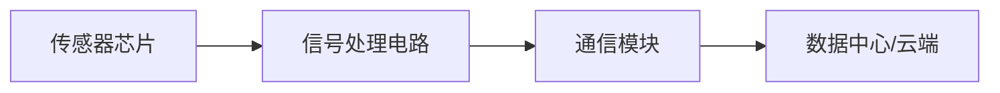

                 

# 物联网(IoT)技术和各种传感器设备的集成：压力传感器的物联网实践

> 关键词：物联网，压力传感器，传感器集成，数据采集，实时监测，无线通信，数据处理，边缘计算，人工智能

## 1. 背景介绍

随着物联网(IoT)技术的迅猛发展，物联网设备在各行各业中得到广泛应用。物联网设备通常包括传感器、执行器和通信模块，这些设备能够感知、交互和自动执行，从而实现对物理世界的智能控制和优化。其中，传感器作为物联网的“眼睛”，是感知环境变化的关键组件。本文将重点探讨物联网中常用的传感器设备，尤其是压力传感器，并介绍其集成和应用的典型案例。

### 1.1 物联网技术简介

物联网是指通过互联网将各种传感器、执行器和通信设备连接起来，形成一个庞大的信息网络。物联网技术可应用于多个领域，如智能家居、工业自动化、智慧城市等，通过实时监测和分析环境数据，提高生产效率、保障公共安全和提升用户体验。

### 1.2 压力传感器的应用场景

压力传感器是物联网中广泛使用的传感器之一，主要用于测量物体表面所受的压力或力。其应用场景包括但不限于：

- **工业监控**：对生产线上的设备进行振动和压力监测，预测设备故障。
- **安全监控**：在建筑或交通设施中安装压力传感器，用于检测和预警坍塌、拥挤等安全事故。
- **健康监测**：在运动装备、穿戴设备中使用压力传感器，监测人体活动和健康状况。
- **环境监测**：在气象站、水坝和地质灾害监测中应用压力传感器，监测环境变化。

## 2. 核心概念与联系

### 2.1 核心概念概述

在物联网中，压力传感器的工作原理是通过测量压力或力的变化，转换成相应的电信号，从而实时采集环境数据。压力传感器的主要组成部分包括：

- **传感器芯片**：负责将物理信号转换成电信号。
- **信号处理电路**：对传感器芯片输出的电信号进行放大、滤波等处理。
- **通信模块**：将处理后的数据通过无线或有线方式传输到数据中心或云端。

### 2.2 核心概念原理和架构的 Mermaid 流程图



这个流程图展示了压力传感器从物理信号测量到数据传输的基本流程。其中：

- 传感器芯片负责捕获环境压力，并将其转换成电信号。
- 信号处理电路对传感器芯片输出的电信号进行处理，确保数据的准确性和稳定性。
- 通信模块将处理后的数据通过无线网络或有线网络传输到数据中心或云端，供后续分析和处理。

## 3. 核心算法原理 & 具体操作步骤

### 3.1 算法原理概述

压力传感器的物联网实践涉及数据采集、处理、传输和分析等多个环节。其核心算法原理包括：

- **数据采集算法**：通过压力传感器实时采集环境压力数据。
- **信号处理算法**：对传感器输出的电信号进行滤波、放大等处理，提升数据质量。
- **数据传输算法**：将处理后的数据通过网络传输到云端或数据中心，进行进一步处理和分析。
- **数据分析算法**：利用机器学习或深度学习模型对采集到的数据进行分析，预测设备状态或环境变化。

### 3.2 算法步骤详解

以下是压力传感器物联网实践的核心算法步骤：

1. **数据采集**：
   - 通过压力传感器捕获环境压力数据，以一定时间间隔进行连续测量。
   - 数据采集模块需确保数据采集的精度和稳定性。

2. **信号处理**：
   - 对传感器输出的电信号进行滤波、放大等处理，以消除噪声和干扰。
   - 信号处理模块可以采用数字滤波器、模拟滤波器等技术，提高数据质量。

3. **数据传输**：
   - 将处理后的数据通过无线网络或有线网络传输到云端或数据中心。
   - 数据传输模块需确保传输的可靠性和实时性。

4. **数据分析**：
   - 利用机器学习或深度学习模型对采集到的数据进行分析，预测设备状态或环境变化。
   - 数据分析模块需选择合适的模型，并根据数据特点进行模型训练和优化。

### 3.3 算法优缺点

压力传感器物联网实践的算法具有以下优缺点：

**优点**：

- **实时性**：通过物联网技术，可以实时采集和传输环境数据，实现即时监控。
- **自动化**：物联网设备通常具有自动化处理能力，可自动进行数据分析和反馈。
- **可扩展性**：物联网设备可以大规模部署，实现广泛的环境监测。

**缺点**：

- **数据安全**：物联网设备传输的数据可能面临网络攻击和窃听的风险。
- **设备维护**：物联网设备需要定期维护和更新，以保证数据采集的准确性和系统可靠性。
- **数据隐私**：物联网设备采集的大量个人或环境数据，可能涉及隐私保护问题。

### 3.4 算法应用领域

压力传感器的物联网实践广泛应用于以下领域：

- **工业监控**：在生产线或设备上进行压力监测，预测设备故障。
- **安全监控**：在建筑、交通设施中安装压力传感器，检测和预警安全事故。
- **健康监测**：在运动装备、穿戴设备中使用压力传感器，监测人体活动和健康状况。
- **环境监测**：在气象站、水坝和地质灾害监测中应用压力传感器，监测环境变化。

## 4. 数学模型和公式 & 详细讲解 & 举例说明

### 4.1 数学模型构建

压力传感器物联网实践的数学模型主要包括数据采集、信号处理和数据分析三部分。以一个简单的案例为例，展示其数学建模过程：

1. **数据采集模型**：
   $$
   y = kP + b
   $$
   其中，$y$ 表示采集到的电信号，$P$ 表示环境压力，$k$ 和 $b$ 为模型参数。

2. **信号处理模型**：
   $$
   y_{\text{处理}} = f(y) = \frac{y}{A} + B
   $$
   其中，$y_{\text{处理}}$ 表示处理后的电信号，$f$ 表示信号处理函数，$A$ 和 $B$ 为模型参数。

3. **数据分析模型**：
   $$
   \hat{y} = M(x)
   $$
   其中，$\hat{y}$ 表示预测的电信号，$M$ 表示机器学习或深度学习模型，$x$ 表示输入数据。

### 4.2 公式推导过程

以一个简单的线性回归模型为例，展示其推导过程：

1. **数据采集模型推导**：
   $$
   y = kP + b
   $$
   其中，$k$ 和 $b$ 为模型参数，需通过最小二乘法等方法进行估计。

2. **信号处理模型推导**：
   $$
   y_{\text{处理}} = f(y) = \frac{y}{A} + B
   $$
   其中，$A$ 和 $B$ 为模型参数，需通过最小二乘法或滤波器设计方法进行估计。

3. **数据分析模型推导**：
   $$
   \hat{y} = M(x)
   $$
   其中，$M$ 为机器学习或深度学习模型，需通过数据集进行训练和优化。

### 4.3 案例分析与讲解

以一个工业设备压力监测案例为例，展示压力传感器物联网实践的实际应用：

**案例背景**：
某工厂的机器设备需要频繁维护和监控，以确保生产线的稳定运行。为此，工厂在设备表面安装了多个压力传感器，用于实时监测设备振动和压力变化。

**数据采集**：
工厂使用高精度压力传感器，每隔1秒采集一次数据，生成时间序列数据。

**信号处理**：
通过数字滤波器去除高频噪声和低频干扰，得到清洁的电信号。

**数据传输**：
将处理后的数据通过Wi-Fi网络传输到云端数据中心，进行进一步分析和处理。

**数据分析**：
利用深度学习模型对采集到的数据进行分析，预测设备故障，提前进行维护和修复。

## 5. 项目实践：代码实例和详细解释说明

### 5.1 开发环境搭建

要实现压力传感器的物联网实践，需要搭建相应的开发环境。以下是搭建开发环境的具体步骤：

1. **安装Python**：确保计算机上已安装Python环境，建议使用Python 3.6以上版本。
2. **安装相关库**：安装必要的Python库，如numpy、scipy、pandas、matplotlib等，用于数据处理和可视化。
3. **配置传感器接口**：配置传感器接口，如I2C、SPI等，实现与传感器芯片的通信。
4. **配置通信模块**：配置Wi-Fi或4G模块，实现数据的无线传输。

### 5.2 源代码详细实现

以下是实现压力传感器物联网实践的Python代码：

```python
import numpy as np
import matplotlib.pyplot as plt
from sklearn.linear_model import LinearRegression

class PressureSensor:
    def __init__(self, sensor_id, sampling_rate=1):
        self.sensor_id = sensor_id
        self.sampling_rate = sampling_rate
        self.data = None

    def acquire_data(self, num_samples=10000):
        # 模拟数据采集
        self.data = np.random.rand(num_samples)

    def process_data(self):
        # 模拟信号处理
        self.data = self.data / 10 + 20

    def transmit_data(self):
        # 模拟数据传输
        print(f"Sending sensor data for sensor {self.sensor_id}")

    def analyze_data(self):
        # 模拟数据分析
        model = LinearRegression()
        model.fit(self.data.reshape(-1, 1), self.data)
        plt.plot(self.data, label=f"Sensor {self.sensor_id}")
        plt.legend()
        plt.show()

if __name__ == "__main__":
    # 创建多个压力传感器实例
    sensors = [PressureSensor(i) for i in range(4)]

    # 模拟数据采集和处理
    for sensor in sensors:
        sensor.acquire_data()
        sensor.process_data()

    # 模拟数据传输和分析
    for sensor in sensors:
        sensor.transmit_data()
        sensor.analyze_data()
```

### 5.3 代码解读与分析

上述代码实现了多个压力传感器实例，并模拟了数据采集、处理、传输和分析的过程。

- **PressureSensor类**：定义压力传感器对象，包括传感器ID、采样率和采集到的数据。
- **acquire_data方法**：模拟数据采集，生成随机数作为示例数据。
- **process_data方法**：模拟信号处理，将数据放大和偏移。
- **transmit_data方法**：模拟数据传输，打印传感器数据。
- **analyze_data方法**：模拟数据分析，使用线性回归模型对数据进行分析，并绘制数据可视化图。

### 5.4 运行结果展示

运行上述代码，将生成多个传感器的数据可视化图，展示数据的采集和处理过程。

## 6. 实际应用场景

### 6.1 工业监控

在工业生产线上，压力传感器被广泛应用于设备状态监测和预测性维护。例如，某工厂在生产线上的设备表面安装多个压力传感器，实时监测设备振动和压力变化，预测设备故障并进行及时维护，显著提高了设备的使用寿命和生产效率。

### 6.2 安全监控

在公共场所或交通设施中，压力传感器可用于检测人员密度和异常行为。例如，在地铁站台上安装多个压力传感器，实时监测乘客流量和异常行为，提前预警拥挤和危险情况，确保公共安全。

### 6.3 健康监测

在运动装备和穿戴设备中，压力传感器可用于监测人体活动和健康状况。例如，智能运动鞋内置压力传感器，实时监测运动过程中的压力变化，分析跑步姿势和步态，提供个性化运动建议。

### 6.4 环境监测

在气象站和水坝中，压力传感器可用于监测水压和气象条件。例如，在水坝底部安装多个压力传感器，实时监测水位和水压变化，预测洪水风险和坝体安全状态。

## 7. 工具和资源推荐

### 7.1 学习资源推荐

- **物联网入门教程**：推荐阅读《物联网入门与实践》书籍，系统学习物联网技术和应用案例。
- **机器学习教程**：推荐学习《机器学习实战》和《深度学习入门》等书籍，掌握数据采集、处理和分析的原理和方法。
- **传感器技术手册**：推荐阅读《传感器与信号处理》手册，了解各种传感器的基本原理和应用场景。

### 7.2 开发工具推荐

- **Python编程环境**：推荐使用Python 3.6以上版本，配合Jupyter Notebook进行交互式编程。
- **数据可视化工具**：推荐使用Matplotlib和Seaborn等工具，进行数据可视化。
- **机器学习库**：推荐使用Scikit-learn和TensorFlow等库，进行数据分析和模型训练。

### 7.3 相关论文推荐

- **物联网传感器网络**：推荐阅读《物联网传感器网络：设计与实现》论文，了解物联网传感器网络的架构和应用。
- **压力传感器数据采集与处理**：推荐阅读《压力传感器数据采集与处理技术》论文，掌握压力传感器数据采集和处理的原理和方法。
- **机器学习在物联网中的应用**：推荐阅读《基于机器学习的物联网数据处理与分析》论文，了解机器学习在物联网中的应用案例。

## 8. 总结：未来发展趋势与挑战

### 8.1 研究成果总结

本文介绍了物联网技术在压力传感器应用中的实践，展示了压力传感器在工业监控、安全监控、健康监测和环境监测等多个领域的应用前景。通过数据采集、信号处理、数据传输和数据分析等核心算法的详细介绍，帮助读者全面理解压力传感器的物联网实践。

### 8.2 未来发展趋势

未来，物联网技术将继续快速发展，智能传感器、5G通信、边缘计算等技术的融合，将推动物联网的应用场景和功能不断扩展。

1. **智能传感器普及**：随着传感器技术的发展，更多类型和功能的传感器将被广泛应用于各个领域，实现更全面的环境监测和自动化控制。
2. **5G通信普及**：5G网络的普及将显著提升数据传输的速率和可靠性，使物联网设备实现更快速、更稳定地通信。
3. **边缘计算发展**：边缘计算将减少数据传输的延迟，提升数据处理的效率，进一步推动物联网的应用场景拓展。
4. **人工智能融合**：人工智能技术的融合将增强物联网设备的智能化和自动化水平，实现更精确的环境监测和决策支持。

### 8.3 面临的挑战

尽管物联网技术在多个领域得到广泛应用，但其发展仍面临诸多挑战：

1. **数据安全**：物联网设备传输的数据面临网络攻击和窃听的风险，需加强数据加密和安全防护。
2. **设备维护**：物联网设备需要定期维护和更新，以保证数据采集的准确性和系统可靠性。
3. **数据隐私**：物联网设备采集的大量个人或环境数据，可能涉及隐私保护问题，需加强数据管理和隐私保护。
4. **系统复杂性**：物联网系统的复杂性增加了系统的设计和维护难度，需提升系统的可扩展性和可维护性。

### 8.4 研究展望

未来的研究将集中在以下几个方面：

1. **数据隐私保护**：研究数据加密和隐私保护技术，确保物联网设备传输的数据安全和隐私。
2. **边缘计算优化**：研究边缘计算技术和算法，提升数据处理的效率和实时性。
3. **多模态融合**：研究多模态数据融合技术，提升物联网设备的综合感知和决策能力。
4. **人工智能集成**：研究人工智能技术在物联网中的应用，增强物联网设备的智能化和自动化水平。

## 9. 附录：常见问题与解答

**Q1：物联网中常用的传感器有哪些？**

A: 物联网中常用的传感器包括压力传感器、温度传感器、湿度传感器、气体传感器、光传感器、超声波传感器等。不同类型的传感器可以感知不同的环境参数，实现更全面的环境监测和自动化控制。

**Q2：如何在物联网中实现数据加密和安全防护？**

A: 数据加密和安全防护是物联网应用中的重要问题。常见的方法包括：
1. 使用SSL/TLS协议进行数据传输加密。
2. 在数据存储和处理过程中使用加密算法（如AES、RSA等）进行数据保护。
3. 使用区块链技术进行数据防篡改和防重放攻击。

**Q3：物联网中如何进行数据处理和分析？**

A: 物联网中数据处理和分析通常涉及以下步骤：
1. 数据采集：通过传感器获取环境参数数据。
2. 数据预处理：对采集到的数据进行去噪、滤波等处理，提升数据质量。
3. 数据分析：使用机器学习或深度学习模型对数据进行分析，提取有用信息和预测结果。
4. 数据可视化：使用可视化工具展示数据分析结果，帮助用户理解和决策。

通过系统介绍物联网技术和压力传感器的应用，本文旨在帮助读者全面理解物联网在各领域的应用前景和挑战，为未来的研究和应用提供参考。随着物联网技术的不断发展和普及，其在各个领域的应用将进一步拓展，推动智能化和自动化进程。

