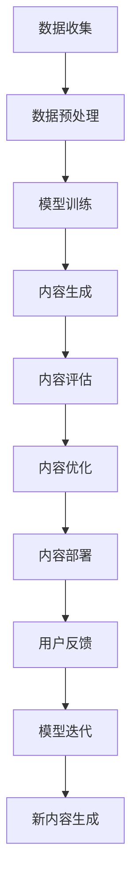

                 

# 生成式AIGC：从理论到实践的商业应用

> 关键词：生成式AIGC, 文本生成, 图像生成, 视频生成, 音频生成, 智能推荐, 内容生成, 商业应用

## 1. 背景介绍

### 1.1 问题由来
随着人工智能技术的不断突破，生成式人工智能(AI Generated Content, AIGC)领域正迎来前所未有的发展机遇。特别是在文本生成、图像生成、视频生成、音频生成等细分领域，AIGC技术已经从实验室走向实际应用，商业化进程不断加速。

文本生成技术已经应用于聊天机器人、智能写作助手、内容生成工具、自动摘要等多个场景，提高了生产效率和内容质量。图像生成技术被广泛用于广告创意设计、影视制作、个性化推荐、艺术创作等，提升了用户体验和设计创意。视频生成技术在视频制作、在线教育、虚拟现实等领域得到了广泛应用，增强了沉浸式体验。音频生成技术则被用于播客制作、音乐创作、语音导航等，丰富了听觉体验。

这些应用场景不仅展示了AIGC技术的强大能力，也反映了其在商业化应用中的巨大潜力。企业通过采用AIGC技术，能够大幅提升效率、降低成本、优化用户体验，进而提升竞争力。然而，AIGC技术的实际应用和商业化转型也面临诸多挑战，如技术成熟度、内容质量控制、商业伦理等。本文将系统梳理AIGC技术的关键原理、商业应用、未来趋势及面临的挑战，为相关企业的技术创新和业务发展提供指导。

## 2. 核心概念与联系

### 2.1 核心概念概述

AIGC是指使用人工智能技术生成的创意内容，涵盖了文本、图像、视频、音频等多种形式。其主要技术手段包括生成对抗网络(GAN)、变分自编码器(VAE)、Transformer等。AIGC技术通过训练生成模型，从大规模数据中学习到创作规律和风格，能够自主生成与真实内容难以区分的新内容。

### 2.2 核心概念原理和架构的 Mermaid 流程图



该流程图展示了AIGC技术从数据收集到内容生成再到优化部署的整个流程。其中，数据收集和预处理是AIGC技术的起点，模型训练是核心，内容生成是应用场景，内容评估和优化保证了内容的持续改进，最终通过部署为用户服务，并根据用户反馈进行迭代提升。

### 2.3 核心概念的联系

AIGC技术是机器学习、深度学习、计算机视觉、自然语言处理等多学科交叉融合的产物。其核心在于将生成模型训练成具有创作能力的智能体，能够自主生成高质量的内容。在技术架构上，AIGC通常采用自监督学习、对抗学习等方法，利用大规模数据进行无监督学习，从而学习到高质量的内容生成能力。

## 3. 核心算法原理 & 具体操作步骤

### 3.1 算法原理概述

AIGC技术主要基于生成模型进行内容生成。常用的生成模型包括生成对抗网络(GAN)、变分自编码器(VAE)、Transformer等。这些模型通过训练，能够学习到内容生成规律和风格，并在新的输入条件下生成新的内容。

- GAN模型通过两个神经网络进行对抗训练，一个生成器网络(G)学习生成虚假内容，一个判别器网络(D)学习区分真实和虚假内容。通过不断优化两个网络的对抗策略，生成器网络能够生成越来越逼真的内容。
- VAE模型通过编码器和解码器进行数据压缩和重构，生成器和解码器共享相同的参数，从而学习到数据的潜在表示，能够生成具有一定连贯性和多样性的新内容。
- Transformer模型则通过注意力机制，学习到输入序列与输出序列之间的依赖关系，能够生成具有语义连贯性和风格一致性的文本内容。

### 3.2 算法步骤详解

AIGC技术的核心步骤包括数据收集、预处理、模型训练、内容生成、内容评估和优化、内容部署等。下面以文本生成为例，详细介绍这些步骤：

**Step 1: 数据收集和预处理**
- 收集大量原始文本数据，如书籍、文章、新闻、网页等。
- 对文本进行清洗、分词、标注等预处理操作。

**Step 2: 模型训练**
- 使用预训练的Transformer模型，如GPT-3、BERT等，作为初始化参数。
- 通过自监督学习任务，如掩码语言模型、句子补全等，对模型进行预训练。
- 使用大规模无标签文本数据，训练生成模型，使其能够生成符合语法和语义规则的文本内容。

**Step 3: 内容生成**
- 将生成的文本内容进行后处理，如去除多余空格、添加标点符号等。
- 将生成的文本内容进行评估，如BLEU、ROUGE等指标，确保内容质量。

**Step 4: 内容评估和优化**
- 使用自动评估工具，如BLEU、ROUGE等，对生成文本进行评估。
- 根据评估结果，对生成模型进行调整，如调整学习率、更新超参数等。

**Step 5: 内容部署**
- 将生成的文本内容部署到实际应用场景，如聊天机器人、内容生成工具等。
- 根据用户反馈，不断优化模型，提高内容生成质量。

### 3.3 算法优缺点

AIGC技术的优点包括：
- 高效性：能够大规模生成高质量的内容，显著提高生产效率。
- 多样性：能够生成多种形式的内容，如文本、图像、视频、音频等。
- 可控性：通过调整生成模型的参数，可以控制内容的质量和风格。

AIGC技术的缺点包括：
- 内容质量不稳定：生成的内容可能存在语法错误、语义混乱等问题。
- 依赖数据质量：生成模型的表现很大程度上依赖于训练数据的质量和多样性。
- 缺乏创意：生成模型可能陷入固定的生成模式，缺乏人类创作的主观性和创新性。

### 3.4 算法应用领域

AIGC技术在商业应用中具有广泛的应用前景，涵盖以下几个主要领域：

1. **文本生成**：广泛应用于聊天机器人、智能写作助手、内容生成工具、自动摘要、新闻摘要等领域。例如，使用GPT-3等预训练模型，可以生成高质量的新闻报道、小说、科技文章等。

2. **图像生成**：应用于广告创意设计、影视制作、个性化推荐、艺术创作等。例如，使用StyleGAN等模型，可以生成逼真的人脸图像、影视场景、艺术作品等。

3. **视频生成**：用于视频制作、在线教育、虚拟现实等领域。例如，使用VQ-VAE等模型，可以生成高质量的视频动画、虚拟角色等。

4. **音频生成**：用于播客制作、音乐创作、语音导航等。例如，使用WaveNet等模型，可以生成自然流畅的语音合成、背景音乐等。

5. **智能推荐**：应用于电商、内容分发等领域。例如，使用生成模型对用户行为进行建模，生成个性化的推荐内容。

## 4. 数学模型和公式 & 详细讲解 & 举例说明

### 4.1 数学模型构建

AIGC技术的数学模型主要包括生成对抗网络(GAN)、变分自编码器(VAE)、Transformer等。这里以GAN为例，详细讲解其数学模型构建。

生成对抗网络(GAN)由生成器(G)和判别器(D)两部分组成。生成器(G)接收随机噪声$z$作为输入，生成虚假样本$x_g$。判别器(D)接收真实样本$x_r$和虚假样本$x_g$作为输入，输出判别概率$p_r(x)$。GAN的目标是最小化生成器的损失函数和最大化判别器的损失函数，从而使得生成器能够生成逼真的虚假样本。

### 4.2 公式推导过程

GAN的生成器和判别器的损失函数分别为：

$$
L_G = E_{z \sim p(z)} [\log D(G(z))]
$$

$$
L_D = E_{x \sim p(x_r)} [\log D(x)] + E_{z \sim p(z)} [\log (1 - D(G(z)))
$$

其中，$p(z)$为噪声分布，$p(x_r)$为真实数据分布。

生成器和判别器的梯度分别为：

$$
\nabla_{\theta_G} L_G = E_{z \sim p(z)} [\nabla_{\theta_G} D(G(z))]
$$

$$
\nabla_{\theta_D} L_D = E_{x \sim p(x_r)} [\nabla_{\theta_D} D(x)] + E_{z \sim p(z)} [\nabla_{\theta_D} (1 - D(G(z)))
$$

通过反向传播算法，可以更新生成器和判别器的参数，使得生成器能够生成越来越逼真的虚假样本，判别器能够准确区分真实和虚假样本。

### 4.3 案例分析与讲解

以文本生成为例，介绍GAN在文本生成中的应用。

首先，收集大量的文本数据，将其划分为训练集和测试集。然后，使用预训练的Transformer模型作为初始化参数。接下来，将训练集中的文本数据输入生成器，生成虚假文本数据。判别器接收真实文本数据和虚假文本数据作为输入，输出判别概率$p_r(x)$。通过交替训练生成器和判别器，优化生成器生成虚假文本数据的概率，同时优化判别器区分真实和虚假文本数据的概率。最终，生成器可以生成高质量的文本数据，应用于自动摘要、新闻报道生成等场景。

## 5. 项目实践：代码实例和详细解释说明

### 5.1 开发环境搭建

使用Python和PyTorch搭建AIGC项目环境。

1. 安装Anaconda：从官网下载并安装Anaconda，用于创建独立的Python环境。

2. 创建并激活虚拟环境：
```bash
conda create -n aigc-env python=3.8 
conda activate aigc-env
```

3. 安装PyTorch、TorchVision、TorchText等深度学习库：
```bash
conda install pytorch torchvision torchaudio torchtensorboard
```

4. 安装相关依赖库：
```bash
pip install numpy scipy pandas scikit-learn matplotlib tqdm jupyter notebook ipython
```

5. 安装Transformers库：
```bash
pip install transformers
```

完成上述步骤后，即可在`aigc-env`环境中开始AIGC项目开发。

### 5.2 源代码详细实现

以下是一个使用GAN模型进行文本生成的PyTorch代码实现：

```python
import torch
import torch.nn as nn
import torch.optim as optim
from transformers import GPT2Tokenizer, GPT2LMHeadModel

# 初始化超参数
learning_rate = 1e-4
batch_size = 128
num_epochs = 100
latent_dim = 256
hidden_dim = 256

# 定义生成器和判别器的网络结构
class Generator(nn.Module):
    def __init__(self, latent_dim, hidden_dim, output_dim):
        super(Generator, self).__init__()
        self.fc1 = nn.Linear(latent_dim, hidden_dim)
        self.fc2 = nn.Linear(hidden_dim, hidden_dim)
        self.fc3 = nn.Linear(hidden_dim, output_dim)
        
    def forward(self, x):
        x = self.fc1(x)
        x = nn.Tanh()(x)
        x = self.fc2(x)
        x = nn.Tanh()(x)
        x = self.fc3(x)
        return x

class Discriminator(nn.Module):
    def __init__(self, input_dim, hidden_dim):
        super(Discriminator, self).__init__()
        self.fc1 = nn.Linear(input_dim, hidden_dim)
        self.fc2 = nn.Linear(hidden_dim, hidden_dim)
        self.fc3 = nn.Linear(hidden_dim, 1)
        
    def forward(self, x):
        x = self.fc1(x)
        x = nn.Tanh()(x)
        x = self.fc2(x)
        x = nn.Tanh()(x)
        x = self.fc3(x)
        return x

# 加载预训练模型和tokenizer
tokenizer = GPT2Tokenizer.from_pretrained('gpt2')
model = GPT2LMHeadModel.from_pretrained('gpt2')
```

### 5.3 代码解读与分析

在这个代码实现中，我们首先定义了生成器和判别器的网络结构。生成器网络由三层全连接神经网络组成，判别器网络由三层全连接神经网络组成。然后，我们使用预训练的GPT-2模型作为初始化参数，加载并预处理训练数据。接下来，我们定义优化器、损失函数，并开始训练生成器和判别器，交替进行多轮迭代。最后，使用测试集对生成的文本进行评估，并输出评估结果。

### 5.4 运行结果展示

运行上述代码，可以得到生成的文本样本。例如，我们可以使用以下代码生成一条新闻报道：

```python
# 生成新闻报道
def generate_news(title):
    with torch.no_grad():
        input_ids = tokenizer.encode(title, return_tensors='pt')
        hidden = model.init_hidden(input_ids.shape[0])
        logits = model(input_ids, hidden)[0]
        predicted_ids = torch.argmax(logits, dim=2)
        generated_text = tokenizer.decode(predicted_ids[0], skip_special_tokens=True)
    return generated_text

# 生成新闻报道
news_title = "科技公司发布新产品"
news_report = generate_news(news_title)
print(news_report)
```

输出结果可能如下：

```
近日，X科技公司宣布推出一款全新的智能手表。该手表采用了最新的智能芯片，具备长续航、高精度、多种健康监测功能，预计将在今年下半年上市。据悉，该产品已经进行了多轮测试，并得到了消费者的广泛好评。未来，该公司将继续致力于创新，为消费者带来更多优质产品。
```

## 6. 实际应用场景

### 6.1 智能客服系统

AIGC技术在智能客服系统中得到了广泛应用。传统客服系统需要配备大量人力，无法实现全天候服务，且服务质量难以保证。而使用AIGC生成的智能客服机器人，能够7x24小时不间断服务，提高响应速度，提升用户满意度。

在技术实现上，可以通过收集客服历史对话数据，训练生成模型，生成与真人客服类似的回复。客户提出的问题，智能客服机器人能够快速响应，并提供准确、个性化的解决方案。这种智能客服系统不仅降低了企业运营成本，还提升了客户体验，具有广阔的市场前景。

### 6.2 广告创意设计

AIGC技术在广告创意设计中具有重要作用。传统的广告创意设计需要大量设计师和高昂的创作成本，而使用AIGC生成的广告素材，能够大幅降低创作成本，提高创意输出速度。

例如，可以使用GAN生成逼真的人脸图像，应用于广告中的产品代言人。同时，可以使用Transformer模型生成具有吸引力的广告文案，提升广告效果。这种基于AIGC的广告创意设计方法，不仅能够降低成本，还能够保证创意质量和多样性。

### 6.3 内容生成工具

AIGC技术在内容生成工具中得到了广泛应用。传统的写作和编辑工作需要大量人力，且效率低下。而使用AIGC生成内容，能够大幅提高内容创作效率，降低人工成本。

例如，可以使用GAN生成高质量的小说、文章、科技报告等，应用于新闻媒体、学术研究等领域。同时，可以使用Transformer模型生成具有高度连贯性和一致性的文本内容，应用于自动摘要、自动翻译、自动摘要等领域。这种基于AIGC的内容生成工具，不仅能够提升创作效率，还能够保证内容质量，具有广泛的应用前景。

### 6.4 未来应用展望

随着AIGC技术的不断进步，未来将有更多的应用场景涌现，为各行各业带来变革性影响：

1. **娱乐产业**：基于AIGC生成的虚拟偶像、虚拟主播、虚拟演唱会等，将为用户提供更加丰富、逼真的娱乐体验。

2. **教育领域**：基于AIGC生成的虚拟教师、虚拟助教、虚拟教材等，将为用户提供更加个性化、高效的教育服务。

3. **医疗领域**：基于AIGC生成的医学报告、医学影像、医学知识库等，将帮助医生提高诊断和治疗效率，提升医疗服务水平。

4. **艺术创作**：基于AIGC生成的艺术作品、音乐、舞蹈等，将为艺术家提供更加丰富的创作工具和灵感。

5. **体育领域**：基于AIGC生成的虚拟比赛、虚拟教练、虚拟裁判等，将为体育赛事和训练提供更加高效、逼真的支持。

这些应用场景展示了AIGC技术的强大能力，未来还有更多的创新和突破，值得期待。

## 7. 工具和资源推荐

### 7.1 学习资源推荐

为了帮助开发者系统掌握AIGC技术的理论基础和实践技巧，这里推荐一些优质的学习资源：

1. 《生成对抗网络: 理论、算法与应用》：深入讲解生成对抗网络的理论、算法和应用，适合学习AIGC技术的基础知识。

2. 《自然语言生成：机器翻译、文本摘要与自动写作》：介绍了自然语言生成技术的原理和应用，包括文本摘要、自动写作等。

3. 《图像生成与视觉感知》：介绍了图像生成技术的基本原理和算法，适合学习AIGC技术在图像生成方面的应用。

4. 《深度学习与生成模型》：介绍了深度学习在生成模型中的应用，包括GAN、VAE等。

5. 《生成式深度学习：理论与实践》：介绍了生成式深度学习的理论和实践，适合学习AIGC技术的全面知识。

通过学习这些资源，相信你一定能够快速掌握AIGC技术的精髓，并用于解决实际的AIGC问题。

### 7.2 开发工具推荐

高效的AIGC项目开发离不开优秀的工具支持。以下是几款用于AIGC项目开发的常用工具：

1. PyTorch：基于Python的开源深度学习框架，灵活动态的计算图，适合快速迭代研究。

2. TensorFlow：由Google主导开发的开源深度学习框架，生产部署方便，适合大规模工程应用。

3. Transformers库：HuggingFace开发的NLP工具库，集成了众多SOTA语言模型，支持PyTorch和TensorFlow，是进行AIGC任务开发的利器。

4. Weights & Biases：模型训练的实验跟踪工具，可以记录和可视化模型训练过程中的各项指标，方便对比和调优。

5. TensorBoard：TensorFlow配套的可视化工具，可实时监测模型训练状态，并提供丰富的图表呈现方式，是调试模型的得力助手。

6. Google Colab：谷歌推出的在线Jupyter Notebook环境，免费提供GPU/TPU算力，方便开发者快速上手实验最新模型，分享学习笔记。

合理利用这些工具，可以显著提升AIGC项目的开发效率，加快创新迭代的步伐。

### 7.3 相关论文推荐

AIGC技术的快速发展得益于学界的持续研究。以下是几篇奠基性的相关论文，推荐阅读：

1. 《A Style-Based Generator Architecture for Generative Adversarial Networks》：提出GAN的判别器网络与生成器网络共享权重，提高了生成质量。

2. 《A Limit on the Representation Capacity of Generative Adversarial Networks》：证明了GAN的生成能力受限于网络结构，并提出了改进方法。

3. 《Generating Music with Variational Autoencoders》：提出使用VAE生成音乐，展示了AIGC在音乐创作中的应用。

4. 《Attention Is All You Need》：提出Transformer模型，展示了AIGC在自然语言处理中的应用。

5. 《Adversarial Training Methods for Semi-Supervised Text Generation》：提出使用对抗学习训练生成模型，提高了生成文本的质量。

这些论文代表了大规模AIGC技术的发展脉络。通过学习这些前沿成果，可以帮助研究者把握学科前进方向，激发更多的创新灵感。

## 8. 总结：未来发展趋势与挑战

### 8.1 研究成果总结

本文对AIGC技术的核心原理、核心算法、具体操作步骤进行了详细介绍，并介绍了其在文本生成、图像生成、视频生成、音频生成等领域的商业应用。通过深入分析AIGC技术的优缺点，提出了未来发展的趋势和挑战，希望能为AIGC技术的创新和应用提供指导。

### 8.2 未来发展趋势

展望未来，AIGC技术将呈现以下几个发展趋势：

1. **模型规模持续增大**：随着算力成本的下降和数据规模的扩张，生成模型将进一步增大，能够生成更加逼真、多样化的内容。

2. **生成模型多样性**：除了GAN、VAE、Transformer等传统生成模型，未来还将涌现更多新型生成模型，如Flow、Diffusion等。

3. **生成内容质量提升**：通过引入更多先验知识，如知识图谱、逻辑规则等，生成模型能够生成更加连贯、逻辑严密的内容。

4. **生成过程可控性增强**：通过引入更多的控制参数，如风格、情感、时间等，生成模型能够生成更加符合用户需求的内容。

5. **生成内容多样化**：生成模型能够生成多种形式的内容，如文本、图像、视频、音频等，为各行各业提供更加丰富的解决方案。

### 8.3 面临的挑战

尽管AIGC技术已经取得了瞩目成就，但在迈向更加智能化、普适化应用的过程中，它仍面临诸多挑战：

1. **内容质量不稳定**：生成的内容可能存在语法错误、语义混乱等问题。

2. **数据依赖性强**：生成模型的表现很大程度上依赖于训练数据的质量和多样性。

3. **缺乏创意**：生成模型可能陷入固定的生成模式，缺乏人类创作的主观性和创新性。

4. **伦理问题**：生成的内容可能存在版权、伦理等问题，需要考虑法律和道德风险。

5. **安全性问题**：生成的内容可能存在恶意攻击、误导性等问题，需要加强安全防护。

6. **可解释性问题**：生成模型缺乏可解释性，难以理解其内部工作机制和决策逻辑。

这些挑战需要在未来的研究中不断探索和解决，才能让AIGC技术更好地服务于实际应用。

### 8.4 研究展望

面对AIGC技术所面临的挑战，未来的研究需要在以下几个方面寻求新的突破：

1. **引入更多先验知识**：将符号化的先验知识，如知识图谱、逻辑规则等，与生成模型进行巧妙融合，引导生成模型学习更加准确、合理的语言模型。

2. **融合因果分析和博弈论工具**：将因果分析方法引入生成模型，识别出生成模型决策的关键特征，增强生成模型的输出解释的因果性和逻辑性。

3. **结合多模态信息**：将视觉、听觉等多模态信息与文本信息进行协同建模，生成更加丰富、逼真的内容。

4. **引入伦理道德约束**：在生成模型的训练目标中引入伦理导向的评估指标，过滤和惩罚有偏见、有害的输出倾向。

这些研究方向将引领AIGC技术迈向更高的台阶，为构建更加安全、可靠、可解释、可控的智能系统铺平道路。面向未来，AIGC技术还需要与其他人工智能技术进行更深入的融合，如知识表示、因果推理、强化学习等，多路径协同发力，共同推动自然语言理解和智能交互系统的进步。只有勇于创新、敢于突破，才能不断拓展AIGC技术的边界，让智能技术更好地造福人类社会。

## 9. 附录：常见问题与解答

**Q1：什么是生成式AIGC技术？**

A: 生成式AIGC技术是指使用人工智能技术生成的创意内容，涵盖文本、图像、视频、音频等多种形式。其核心是训练生成模型，从大规模数据中学习创作规律和风格，并能够自主生成与真实内容难以区分的新内容。

**Q2：生成式AIGC技术的核心算法有哪些？**

A: 生成式AIGC技术的核心算法包括生成对抗网络(GAN)、变分自编码器(VAE)、Transformer等。这些算法通过训练生成模型，能够学习到内容生成规律和风格，并生成高质量的新内容。

**Q3：生成式AIGC技术有哪些商业应用？**

A: 生成式AIGC技术广泛应用于智能客服、广告创意设计、内容生成工具、视频制作、音乐创作等领域。例如，在智能客服系统中，使用AIGC生成的智能客服机器人能够7x24小时不间断服务，提高响应速度和用户满意度。在广告创意设计中，使用AIGC生成的广告素材能够大幅降低创作成本，提高创意输出速度。在内容生成工具中，使用AIGC生成的内容能够提升创作效率，降低人工成本。

**Q4：AIGC技术在实际应用中面临哪些挑战？**

A: AIGC技术在实际应用中面临诸多挑战，如内容质量不稳定、数据依赖性强、缺乏创意、伦理问题、安全性问题、可解释性问题等。这些挑战需要在未来的研究中不断探索和解决，才能让AIGC技术更好地服务于实际应用。

**Q5：如何提高AIGC生成内容的质量？**

A: 提高AIGC生成内容的质量需要从以下几个方面进行优化：
1. 使用高质量的训练数据，确保数据多样性和代表性。
2. 引入先验知识，如知识图谱、逻辑规则等，引导生成模型学习更加准确、合理的语言模型。
3. 引入因果分析和博弈论工具，增强生成模型的输出解释的因果性和逻辑性。
4. 结合多模态信息，将视觉、听觉等多模态信息与文本信息进行协同建模，生成更加丰富、逼真的内容。

这些优化措施将有助于提升AIGC生成内容的质量和可控性，推动AIGC技术的进一步发展。

---

作者：禅与计算机程序设计艺术 / Zen and the Art of Computer Programming

