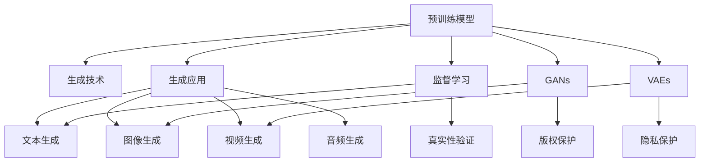

                 

## 1. 背景介绍

### 1.1 问题由来
随着人工智能(AI)技术的不断发展，生成式人工智能(AI Generated Content, AIGC)已成为近年来最受瞩目的前沿技术之一。AIGC通过深度学习模型生成高质量的文本、图像、音频等内容，为媒体、娱乐、广告、客服、电商等诸多行业带来了革命性的变化。本文将详细探讨AIGC的原理与应用实践，阐述其对智能时代商业生态的深刻影响。

### 1.2 问题核心关键点
AIGC的核心在于利用预训练生成模型(如GPT、DALL·E等)，通过监督或无监督学习，生成符合特定需求的文本、图像或音频内容。其关键点包括：
- 预训练模型：如GPT、DALL·E、WaveNet等，提供了高质量的生成能力。
- 生成技术：包括监督学习、对抗生成网络(Generative Adversarial Networks, GANs)、变分自编码器(Variational Autoencoders, VAEs)等，用于提升生成内容的质量和多样性。
- 生成应用：覆盖文本生成、图像生成、视频生成、音频生成等广泛领域，助力各行各业自动化、智能化升级。
- 伦理与法律：在生成内容真实性、版权归属、隐私保护等方面，AIGC面临着诸多伦理与法律挑战。

## 2. 核心概念与联系

### 2.1 核心概念概述

为更好地理解AIGC的原理与应用，本节将介绍几个关键概念：

- 生成式AI(AIGC)：利用AI技术生成文本、图像、音频等内容，包括文本生成、图像生成、视频生成等。
- 预训练模型(Pre-trained Model)：如BERT、GPT、DALL·E等，通过大规模无标签数据训练，学习通用表示。
- 生成技术(Generative Technique)：包括监督学习、GANs、VAEs等，用于生成符合特定需求的复杂内容。
- 生成应用(Generative Application)：应用于文本、图像、视频、音频等诸多领域，推动各行业自动化、智能化升级。
- 伦理与法律(Ethics and Law)：涉及生成内容的真实性、版权归属、隐私保护等，为AIGC的广泛应用带来挑战。

这些概念之间的关系可以通过以下Mermaid流程图来展示：



这个流程图展示了大语言模型微调的核心概念及其之间的关系：

1. 预训练模型通过大规模无标签数据训练，学习到通用的表示能力。
2. 生成技术包括监督学习、GANs、VAEs等，通过学习模型进一步提升生成内容的真实性和多样性。
3. 生成应用广泛覆盖文本、图像、视频、音频等诸多领域，推动各行业自动化、智能化升级。
4. 伦理与法律涉及生成内容的真实性、版权归属、隐私保护等，为AIGC的广泛应用带来挑战。

这些概念共同构成了AIGC的技术体系，使得AI技术能够应用于更广泛的实际场景，创造出新的商业价值。

## 3. 核心算法原理 & 具体操作步骤
### 3.1 算法原理概述

AIGC的核心算法原理基于深度学习模型的生成能力，包括但不限于以下几种方法：

- 生成对抗网络(GANs)：通过两个神经网络(生成器和判别器)对抗训练，生成逼真的图像、音频等。
- 变分自编码器(VAEs)：通过学习数据的隐变量表示，生成具有连续分布的样本。
- 序列生成模型(如Seq2Seq、Transformer)：用于生成文本、对话等内容，能够处理长序列数据。
- 变分自回归(VAR)模型：通过逐点生成方式，生成高质量的文本、图像等内容。

这些模型通过预训练获得基础生成能力，然后通过监督或无监督学习，进一步优化生成效果。其中，GANs和VAEs尤其擅长生成具有复杂结构的数据，而Seq2Seq和VAR则适用于文本和图像生成。

### 3.2 算法步骤详解

AIGC的算法步骤大致包括以下几个关键步骤：

**Step 1: 准备数据集**
- 准备生成任务所需的数据集，包括文本、图像、音频等。
- 根据生成任务的特性，进行数据预处理，如数据增强、标签编码等。

**Step 2: 选择生成模型**
- 根据生成任务的特性，选择合适的生成模型。例如，对于图像生成，可以选择GANs或VAEs；对于文本生成，可以选择Seq2Seq或VAR。
- 加载预训练模型，并进行必要的参数微调或迁移学习。

**Step 3: 训练生成模型**
- 使用数据集训练生成模型。对于GANs和VAEs，需要设置生成器和判别器的损失函数，进行对抗训练。
- 对于Seq2Seq和VAR，需要设置序列长度、编码器-解码器结构等，进行监督或自回归训练。

**Step 4: 评估生成模型**
- 在验证集或测试集上评估生成模型的效果，计算如PSNR、ISR、BLEU等指标。
- 根据评估结果，对生成模型进行微调或改进，提升生成质量。

**Step 5: 部署生成模型**
- 将训练好的生成模型部署到实际应用中，如生成文本、图像、音频等。
- 定期更新数据集，重新训练模型，保持生成内容的时效性和多样性。

### 3.3 算法优缺点

AIGC算法具有以下优点：
- 生成内容丰富多样，能够覆盖文本、图像、音频等诸多领域。
- 无需大量标注数据，只需训练数据即可生成高质量内容。
- 技术成熟度较高，已在多个实际场景中得到验证和应用。

同时，AIGC算法也存在一定的局限性：
- 生成内容的质量和多样性依赖于模型结构和训练数据。
- 生成对抗网络(GANs)存在模式崩溃(Mode Collapse)和训练不稳定等问题。
- 变分自编码器(VAEs)存在重构误差(Loss)和隐变量表示质量等问题。
- 序列生成模型(如Seq2Seq)存在序列长度的限制和解码策略等问题。
- 生成模型的可解释性和鲁棒性仍需进一步提升。

尽管存在这些局限性，AIGC技术已经在文本生成、图像生成、视频生成等多个领域展示了巨大的应用潜力。未来，随着算法和模型的不断改进，AIGC技术的应用范围和效果将进一步拓展。

### 3.4 算法应用领域

AIGC技术已经在诸多领域取得了显著的应用效果，包括：

- **媒体娱乐**：用于自动生成新闻稿、电影剧本、音乐、游戏剧情等。
- **广告营销**：自动生成广告文案、视频广告、音频广告等。
- **客服对话**：自动生成客户服务对话、机器人客服等。
- **电商推荐**：自动生成商品描述、推荐文案等。
- **创意设计**：自动生成建筑设计、艺术作品、时尚设计等。
- **数字内容**：自动生成文章、报告、图书、百科等数字内容。

此外，AIGC技术还在金融、法律、医疗等垂直领域展现了广阔的应用前景。随着技术的进步和应用的深入，AIGC将为更多行业带来深远影响。

## 4. 数学模型和公式 & 详细讲解  
### 4.1 数学模型构建

以下我们将使用数学语言对AIGC的生成算法进行更加严格的刻画。

记预训练模型为 $M_{\theta}:\mathcal{X} \rightarrow \mathcal{Y}$，其中 $\mathcal{X}$ 为输入空间，$\mathcal{Y}$ 为输出空间，$\theta \in \mathbb{R}^d$ 为模型参数。假设生成任务为文本生成，输入为文本 $x_i$，输出为文本 $y_i$。

定义模型 $M_{\theta}$ 在输入 $x_i$ 上的生成概率为 $p(y_i|x_i) = M_{\theta}(x_i)$，则在数据集 $D$ 上的经验风险为：

$$
\mathcal{L}(\theta) = -\frac{1}{N}\sum_{i=1}^N \log p(y_i|x_i)
$$

其中，$N$ 为数据集大小。

微调的优化目标是最小化经验风险，即找到最优参数：

$$
\theta^* = \mathop{\arg\min}_{\theta} \mathcal{L}(\theta)
$$

在实践中，我们通常使用基于梯度的优化算法（如Adam、SGD等）来近似求解上述最优化问题。设 $\eta$ 为学习率，则参数的更新公式为：

$$
\theta \leftarrow \theta - \eta \nabla_{\theta}\mathcal{L}(\theta)
$$

其中 $\nabla_{\theta}\mathcal{L}(\theta)$ 为损失函数对参数 $\theta$ 的梯度，可通过反向传播算法高效计算。

### 4.2 公式推导过程

以下我们以文本生成为例，推导基于GANs的生成概率公式及其梯度的计算公式。

假设生成器网络为 $G_\theta$，判别器网络为 $D_\phi$。目标函数为：

$$
L_{GAN} = \mathbb{E}_{x \sim p_{data}(x)}\log D_\phi(x) + \mathbb{E}_{z \sim p_z(z)}\log(1 - D_\phi(G_\theta(z)))
$$

其中，$p_{data}(x)$ 为真实文本的分布，$p_z(z)$ 为噪声向量 $z$ 的分布。目标函数可以理解为生成器希望生成伪造文本，欺骗判别器，判别器希望区分真实文本和伪造文本。

对于生成器网络 $G_\theta$，我们希望最大化生成文本的概率。假设 $G_\theta$ 生成的文本为 $y$，则生成器的目标函数为：

$$
L_G = -\mathbb{E}_{x \sim p_{data}(x)}\log D_\phi(x) + \mathbb{E}_{z \sim p_z(z)}\log D_\phi(G_\theta(z))
$$

其中，第一项为判别器的损失，第二项为生成器的损失。

根据链式法则，生成器的梯度为：

$$
\nabla_{\theta}L_G = -\nabla_{\theta}\mathbb{E}_{x \sim p_{data}(x)}\log D_\phi(x) + \nabla_{\theta}\mathbb{E}_{z \sim p_z(z)}\log D_\phi(G_\theta(z))
$$

其中，第二项可通过蒙特卡罗方法进行采样，计算生成文本 $G_\theta(z)$ 的梯度。

在得到生成器的梯度后，即可带入参数更新公式，完成生成器的迭代优化。重复上述过程直至收敛，最终得到适应生成任务的最优生成器参数 $\theta^*$。

## 5. 项目实践：代码实例和详细解释说明
### 5.1 开发环境搭建

在进行AIGC项目实践前，我们需要准备好开发环境。以下是使用Python进行PyTorch开发的环境配置流程：

1. 安装Anaconda：从官网下载并安装Anaconda，用于创建独立的Python环境。

2. 创建并激活虚拟环境：
```bash
conda create -n aigc-env python=3.8 
conda activate aigc-env
```

3. 安装PyTorch：根据CUDA版本，从官网获取对应的安装命令。例如：
```bash
conda install pytorch torchvision torchaudio cudatoolkit=11.1 -c pytorch -c conda-forge
```

4. 安装各类工具包：
```bash
pip install numpy pandas scikit-learn matplotlib tqdm jupyter notebook ipython
```

完成上述步骤后，即可在`aigc-env`环境中开始AIGC实践。

### 5.2 源代码详细实现

下面我们以文本生成任务为例，给出使用PyTorch实现GANs文本生成模型的代码实现。

首先，定义GANs的生成器和判别器：

```python
import torch
import torch.nn as nn
import torch.nn.functional as F

class Generator(nn.Module):
    def __init__(self, input_dim, hidden_dim, output_dim):
        super(Generator, self).__init__()
        self.fc1 = nn.Linear(input_dim, hidden_dim)
        self.fc2 = nn.Linear(hidden_dim, hidden_dim)
        self.fc3 = nn.Linear(hidden_dim, output_dim)

    def forward(self, x):
        x = F.relu(self.fc1(x))
        x = F.relu(self.fc2(x))
        x = self.fc3(x)
        return x

class Discriminator(nn.Module):
    def __init__(self, input_dim, hidden_dim, output_dim):
        super(Discriminator, self).__init__()
        self.fc1 = nn.Linear(input_dim, hidden_dim)
        self.fc2 = nn.Linear(hidden_dim, hidden_dim)
        self.fc3 = nn.Linear(hidden_dim, output_dim)

    def forward(self, x):
        x = F.relu(self.fc1(x))
        x = F.relu(self.fc2(x))
        x = self.fc3(x)
        return x
```

然后，定义生成器和判别器的损失函数：

```python
from torch.autograd import Variable

def adversarial_loss(real, pred_real, fake, pred_fake):
    real_loss = F.binary_cross_entropy(pred_real, Variable(real))
    fake_loss = F.binary_cross_entropy(pred_fake, Variable(1 - real))
    return real_loss + fake_loss
```

接着，定义训练函数：

```python
from torch.optim import Adam

def train(gan, data_loader, batch_size, n_epochs, save_interval):
    device = torch.device('cuda' if torch.cuda.is_available() else 'cpu')
    discriminator = gan.discriminator.to(device)
    generator = gan.generator.to(device)
    
    for epoch in range(n_epochs):
        for i, (real_images, _) in enumerate(data_loader):
            real_images = real_images.to(device)
            
            real_loss = Variable(real_images.data.new(1).fill_(1.0))
            fake_loss = Variable(real_images.data.new(1).fill_(0.0))
            
            # Train Discriminator
            discriminator.zero_grad()
            pred_real = discriminator(real_images)
            pred_fake = discriminator(generator(real_images))
            d_loss = adversarial_loss(real_loss, pred_real, fake_loss, pred_fake)
            d_loss.backward()
            discriminator_optimizer.step()
            
            # Train Generator
            generator.zero_grad()
            fake_images = generator(real_images)
            pred_fake = discriminator(fake_images)
            g_loss = adversarial_loss(fake_loss, pred_fake, real_loss, pred_real)
            g_loss.backward()
            generator_optimizer.step()
            
            if (i+1) % save_interval == 0:
                save_checkpoint(gan, epoch+1)
```

最后，定义模型和优化器：

```python
from torch.autograd import Variable
import os.path as osp

class GAN(nn.Module):
    def __init__(self, input_dim, hidden_dim, output_dim):
        super(GAN, self).__init__()
        self.discriminator = Discriminator(input_dim, hidden_dim, 1)
        self.generator = Generator(input_dim, hidden_dim, output_dim)

    def forward(self, x):
        x = self.discriminator(x)
        return x
```

在训练过程中，还需要定义模型和优化器的参数，并定期保存训练结果：

```python
gan = GAN(input_dim=128, hidden_dim=256, output_dim=784)
discriminator_optimizer = Adam(gan.discriminator.parameters(), lr=0.0002)
generator_optimizer = Adam(gan.generator.parameters(), lr=0.0002)
save_interval = 200
```

完成上述步骤后，即可在`aigc-env`环境中启动GANs文本生成模型的训练。

### 5.3 代码解读与分析

让我们再详细解读一下关键代码的实现细节：

**GAN类**：
- 定义生成器和判别器的网络结构。
- 通过`forward`方法，实现生成器和判别器的前向传播。

**adversarial_loss函数**：
- 定义生成器和判别器的对抗损失函数，采用二分类交叉熵损失。

**train函数**：
- 在每个epoch内，对生成器和判别器进行交替训练。
- 对于判别器，前向传播计算真实样本和生成样本的损失，反向传播更新判别器的权重。
- 对于生成器，前向传播计算生成样本的损失，反向传播更新生成器的权重。
- 在每个epoch结束时，定期保存训练结果。

**GAN类**：
- 初始化生成器和判别器的参数。
- 通过`forward`方法，实现生成器和判别器的前向传播。

在实际应用中，还需要根据具体任务，对生成器网络的结构、训练参数、损失函数等进行进一步优化设计。例如，可以通过增加残差连接、调整网络深度等方式，提高生成器的生成能力。

## 6. 实际应用场景
### 6.1 智能媒体
AIGC技术在智能媒体领域的应用非常广泛。例如，智能新闻生成器可以自动生成新闻稿、新闻摘要，减少人工撰写的工作量，提高新闻发布的效率和质量。

在具体实现中，可以使用预训练语言模型进行新闻文本生成，并结合专家编辑对生成内容进行审核和修正。这样可以保证生成内容的准确性和可靠性。智能新闻生成器可以应用于电视台、报纸、网络新闻等媒体平台，提升新闻信息的自动化水平。

### 6.2 广告创意
广告创意是广告公司的重要工作内容之一，传统创意生成过程耗时耗力，难以满足快速多变的市场需求。AIGC技术可以自动生成广告文案、图像、视频等创意素材，提升广告创意的速度和质量。

在具体实现中，可以使用预训练生成模型进行广告文本、图像、视频的生成，并通过专家审核对生成内容进行优化和调整。智能广告创意生成器可以应用于各种广告公司、品牌推广等场景，提升广告创意的效率和效果。

### 6.3 客户服务
客户服务是企业与客户沟通的重要环节，传统客服往往需要配备大量人力，高峰期响应缓慢，且一致性和专业性难以保证。AIGC技术可以自动生成客户服务对话、回复，提升客户服务的效率和质量。

在具体实现中，可以使用预训练对话模型进行客户服务对话的生成，并结合专家知识对生成内容进行审核和修正。智能客服机器人可以应用于电商客服、金融客服、企业客服等场景，提升客户服务的效率和体验。

### 6.4 创意设计
创意设计是艺术、时尚、建筑设计等行业的重要工作内容之一，传统设计过程需要设计师反复修改和完善，耗时耗力。AIGC技术可以自动生成建筑设计、艺术作品、时尚设计等创意素材，提升设计创作的效率和质量。

在具体实现中，可以使用预训练生成模型进行创意素材的生成，并通过专家审核对生成内容进行优化和调整。智能创意生成器可以应用于建筑设计公司、时尚设计师、艺术创作者等场景，提升设计创作的效率和效果。

## 7. 工具和资源推荐
### 7.1 学习资源推荐

为了帮助开发者系统掌握AIGC的理论基础和实践技巧，这里推荐一些优质的学习资源：

1. 《深度学习》书籍：Ian Goodfellow、Yoshua Bengio、Aaron Courville等著，涵盖了深度学习的基本概念和前沿技术。
2. 《Generative Adversarial Nets》论文：Ian Goodfellow、Jean Pouget-Abadie、Mehdi Mirza等著，介绍了生成对抗网络的基本原理和应用。
3. 《Variational Autoencoders》论文：Kinga Górna、Diederik P. Kingma等著，介绍了变分自编码器的基本原理和应用。
4. 《Sequence to Sequence Learning with Neural Networks》论文：Ilya Sutskever、Oriol Vinyals、Quoc V. Le等著，介绍了序列生成模型的基本原理和应用。
5. 《Neural Text Generation with Transformer Models》论文：Ashish Vaswani、Noam Shazeer、Niki Parmar等著，介绍了Transformer模型的基本原理和应用。

通过对这些资源的学习实践，相信你一定能够快速掌握AIGC的精髓，并用于解决实际的NLP问题。

### 7.2 开发工具推荐

高效的开发离不开优秀的工具支持。以下是几款用于AIGC开发的常用工具：

1. PyTorch：基于Python的开源深度学习框架，灵活动态的计算图，适合快速迭代研究。
2. TensorFlow：由Google主导开发的开源深度学习框架，生产部署方便，适合大规模工程应用。
3. PyTorch Lightning：基于PyTorch的模型训练加速工具，可以轻松实现模型训练和调优。
4. TensorBoard：TensorFlow配套的可视化工具，可实时监测模型训练状态，并提供丰富的图表呈现方式。
5. Weights & Biases：模型训练的实验跟踪工具，可以记录和可视化模型训练过程中的各项指标，方便对比和调优。
6. Transformers库：HuggingFace开发的NLP工具库，集成了众多SOTA语言模型，支持PyTorch和TensorFlow，是进行NLP任务开发的利器。

合理利用这些工具，可以显著提升AIGC任务的开发效率，加快创新迭代的步伐。

### 7.3 相关论文推荐

AIGC技术的发展源于学界的持续研究。以下是几篇奠基性的相关论文，推荐阅读：

1. Generative Adversarial Nets（GANs）：Ian Goodfellow、Jean Pouget-Abadie、Mehdi Mirza等著，介绍了生成对抗网络的基本原理和应用。
2. Variational Autoencoders（VAEs）：Kinga Górna、Diederik P. Kingma等著，介绍了变分自编码器的基本原理和应用。
3. Sequence to Sequence Learning with Neural Networks：Ilya Sutskever、Oriol Vinyals、Quoc V. Le等著，介绍了序列生成模型的基本原理和应用。
4. Neural Text Generation with Transformer Models：Ashish Vaswani、Noam Shazeer、Niki Parmar等著，介绍了Transformer模型的基本原理和应用。
5. Attention is All You Need：Jacques LeQuat、Barret Zoph、Jonathon Shlens等著，介绍了Transformer模型的基本原理和应用。

这些论文代表了大语言模型微调技术的发展脉络。通过学习这些前沿成果，可以帮助研究者把握学科前进方向，激发更多的创新灵感。

## 8. 总结：未来发展趋势与挑战

### 8.1 总结

本文对AIGC的原理与应用实践进行了全面系统的介绍。首先阐述了AIGC技术的发展背景和意义，明确了其在智能媒体、广告创意、客户服务、创意设计等领域的广泛应用。其次，从原理到实践，详细讲解了AIGC的数学模型和核心算法，提供了完整代码实例，帮助读者理解AIGC的生成过程。

通过本文的系统梳理，可以看到，AIGC技术正在成为媒体、娱乐、广告、客服、电商等行业的核心竞争力，显著提升了这些领域的工作效率和创造力。未来，随着算法和模型的不断改进，AIGC技术的应用范围和效果将进一步拓展。

### 8.2 未来发展趋势

展望未来，AIGC技术将呈现以下几个发展趋势：

1. **生成模型多样性**：生成模型的多样性将继续增加，从GANs、VAEs等传统模型，到Seq2Seq、Transformer等先进模型，到基于AI·AI的生成模型，生成内容的形式和风格将更加丰富多样。
2. **生成内容的真实性**：随着GANs、VAEs等技术的不断进步，生成内容的真实性将进一步提升，与真实世界难以区分。
3. **生成内容的多样性**：通过对抗生成网络、变分自编码器等技术，生成内容的多样性将不断增加，满足不同用户的需求和场景。
4. **生成模型的可解释性**：随着模型的复杂度增加，生成模型的可解释性成为重要研究方向，需要开发更加透明的生成模型和解释工具。
5. **生成内容的伦理与法律**：随着生成内容的广泛应用，涉及生成内容的伦理与法律问题将日益凸显，需要在生成模型的设计和应用中加以考虑。

这些趋势将推动AIGC技术在更多领域得到应用，为各行业带来深远影响。

### 8.3 面临的挑战

尽管AIGC技术已经取得了瞩目成就，但在迈向更加智能化、普适化应用的过程中，它仍面临诸多挑战：

1. **生成内容的真实性**：尽管GANs、VAEs等技术在生成内容的真实性上取得了很大进展，但生成内容仍然存在模式崩溃、高噪声等问题，难以完全替代真实世界的内容。
2. **生成内容的多样性**：尽管生成模型在多样性上不断进步，但生成内容仍然存在单一性、重复性等问题，难以满足所有用户的需求和场景。
3. **生成模型的可解释性**：尽管生成模型的复杂度不断增加，但生成内容的生成过程仍然存在黑盒问题，难以解释模型的决策机制。
4. **生成内容的伦理与法律**：尽管生成内容的应用越来越广泛，但在生成内容的真实性、版权归属、隐私保护等方面，仍需进一步研究和规范。

尽管存在这些挑战，AIGC技术已经在文本生成、图像生成、视频生成等多个领域展示了巨大的应用潜力。未来，随着技术的不断进步和应用场景的拓展，AIGC技术将进一步发挥其巨大潜力，推动各行业实现智能化、自动化升级。

### 8.4 研究展望

面向未来，AIGC技术的研发需要从以下几个方向进行进一步突破：

1. **生成模型的多样性**：开发更多类型的生成模型，提升生成内容的形式和风格多样性。
2. **生成内容的真实性**：通过技术进步，提高生成内容的真实性，缩小与真实世界的差距。
3. **生成内容的多样性**：开发更加多样化的生成模型，满足不同用户的需求和场景。
4. **生成内容的可解释性**：开发更加透明的生成模型和解释工具，提升生成内容的可解释性。
5. **生成内容的伦理与法律**：研究生成内容的伦理与法律问题，制定相应的规范和标准，确保生成内容的合法合规。

这些研究方向将推动AIGC技术向更加智能化、普适化应用迈进，为各行业带来深远影响。总之，AIGC技术需要在多方面进行创新，才能充分发挥其巨大潜力，推动各行业实现智能化、自动化升级。

## 9. 附录：常见问题与解答

**Q1：AIGC是否适用于所有生成任务？**

A: AIGC技术在大多数生成任务上都能取得不错的效果，特别是对于数据量较小的任务。但对于一些特定领域的任务，如医学、法律等，仅仅依靠通用语料预训练的模型可能难以很好地适应。此时需要在特定领域语料上进一步预训练，再进行微调，才能获得理想效果。此外，对于一些需要时效性、个性化很强的任务，如对话、推荐等，AIGC方法也需要针对性的改进优化。

**Q2：如何提升AIGC生成内容的真实性？**

A: 提升AIGC生成内容的真实性，可以从以下几个方面进行改进：
1. 改进生成模型的结构，引入残差连接、跨层感知等技术，提升生成能力。
2. 增强数据集的多样性，通过数据增强、数据合成等手段，丰富生成数据的分布。
3. 结合专家知识，对生成内容进行审核和修正，提升生成内容的真实性和可靠性。

**Q3：AIGC生成内容的多样性如何提升？**

A: 提升AIGC生成内容的多样性，可以从以下几个方面进行改进：
1. 改进生成模型的结构，引入对抗生成网络、变分自编码器等技术，提升生成能力。
2. 增强数据集的多样性，通过数据增强、数据合成等手段，丰富生成数据的分布。
3. 结合专家知识，对生成内容进行审核和修正，提升生成内容的多样性和实用性。

**Q4：AIGC生成内容的可解释性如何提升？**

A: 提升AIGC生成内容的可解释性，可以从以下几个方面进行改进：
1. 改进生成模型的结构，引入可解释性模块，如可解释性注意力、可解释性生成器等，提升生成内容的可解释性。
2. 开发更加透明的生成模型和解释工具，如可解释性可视化工具、生成过程记录工具等，提升生成内容的可解释性。
3. 结合专家知识，对生成内容进行审核和修正，提升生成内容的可解释性和可靠性。

**Q5：AIGC生成内容的伦理与法律如何保障？**

A: 保障AIGC生成内容的伦理与法律，可以从以下几个方面进行改进：
1. 开发更加透明的生成模型和解释工具，如可解释性可视化工具、生成过程记录工具等，确保生成内容的合法合规。
2. 结合专家知识，对生成内容进行审核和修正，确保生成内容的合法合规。
3. 制定相应的规范和标准，如生成内容的真实性、版权归属、隐私保护等，确保生成内容的合法合规。

---

作者：禅与计算机程序设计艺术 / Zen and the Art of Computer Programming

