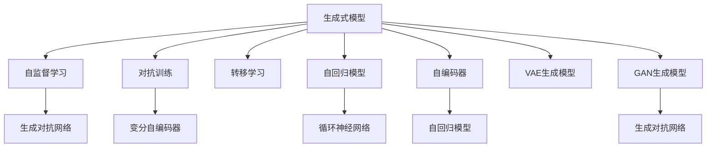

                 

# 生成式AIGC：未来商业的智能化发展

## 1. 背景介绍

### 1.1 问题由来

随着人工智能(AI)技术的迅猛发展，生成式人工智能(AI Generated Content, AIGC)已成为科技和商业领域的焦点。AIGC技术通过深度学习模型，可以从大规模数据中自动学习语言的规则和规律，生成高度逼真、流畅的文本、图像、音频等内容。这种技术不仅极大地提升了内容创作效率，还为商业应用带来了革命性的变革。

生成式AIGC的应用范围遍及广告创意、社交媒体内容、娱乐视频、虚拟助手、智能客服等多个领域。它改变了传统的生产流程和内容分发方式，为商业智能化发展开辟了新途径。

### 1.2 问题核心关键点

AIGC的核心关键点包括：

- **生成模型**：从大规模数据中学习语言的规律，生成符合语法和语义规则的文本、图像等。
- **训练数据**：包含海量标注数据，为模型提供丰富的学习资源。
- **性能评估**：评估模型生成的内容的自然度、逼真度、多样性等指标。
- **应用场景**：如文本生成、图像生成、音频生成等，具体应用依赖于模型架构和训练数据。
- **技术挑战**：如模型复杂度、训练成本、生成速度、鲁棒性等，需不断改进优化。

## 2. 核心概念与联系

### 2.1 核心概念概述

为更好地理解生成式AIGC的原理和架构，本节将介绍几个关键概念：

- **生成式模型**：如生成对抗网络(GAN)、变分自编码器(VAE)、循环神经网络(RNN)等，是生成式AIGC的核心。
- **自监督学习**：利用大规模无标签数据进行训练，避免标注数据的需求。
- **对抗训练**：通过生成器和判别器之间的对抗过程，提升生成模型的性能。
- **转移学习**：将一个领域学到的知识迁移到另一个领域，如将预训练模型应用于新的生成任务。
- **自回归模型**：如LSTM、GRU等，通过序列预测生成文本、音频等内容。
- **自编码器**：如VQ-VAE等，通过编码器-解码器架构进行生成任务。
- **VAE生成模型**：一种能够生成连续数据的生成模型。
- **GAN生成模型**：通过对抗过程生成高质量的图像、音频等内容。

这些概念之间的逻辑关系可以通过以下Mermaid流程图来展示：



这个流程图展示了生成式AIGC的各个关键概念及其之间的关系：

1. 生成式模型通过自监督学习、对抗训练、转移学习等方式提升性能。
2. 自回归模型和自编码器是生成式模型的两种主要架构。
3. VAE和GAN是常见的生成式模型类型。
4. 自监督学习、对抗训练、转移学习等技术都支持这些模型。

## 3. 核心算法原理 & 具体操作步骤

### 3.1 算法原理概述

生成式AIGC的核心原理是通过深度学习模型自动学习语言的规律，生成符合语法和语义规则的内容。具体算法步骤如下：

1. **数据准备**：收集并预处理大规模标注数据，用于训练生成模型。
2. **模型训练**：通过自监督学习或对抗训练等方式训练生成模型，学习语言的规律和生成策略。
3. **生成过程**：使用训练好的模型生成新的文本、图像、音频等内容。

### 3.2 算法步骤详解

#### 3.2.1 数据准备

1. **数据收集**：收集大量的标注数据，如文本、图像、音频等。数据应覆盖不同的领域和场景，以保证模型的泛化能力。
2. **数据预处理**：对数据进行清洗、归一化、分词等处理，方便后续训练。

#### 3.2.2 模型训练

1. **选择模型架构**：根据任务需求选择合适的生成模型架构，如RNN、LSTM、GAN等。
2. **设置训练参数**：如学习率、批量大小、训练轮数等，确保模型能够收敛。
3. **自监督学习**：利用大规模无标签数据进行预训练，学习语言的基本规律。
4. **对抗训练**：通过生成器和判别器之间的对抗过程，提升生成模型的性能。

#### 3.2.3 生成过程

1. **输入文本**：将输入文本作为条件，指导生成模型的生成过程。
2. **生成文本/图像/音频**：使用训练好的模型生成新的内容，可以是文本、图像、音频等。

### 3.3 算法优缺点

#### 3.3.1 优点

1. **效率高**：自动生成内容，节省了大量的人工创作时间。
2. **成本低**：相比于人工创作，AIGC减少了人力和物力成本。
3. **一致性**：生成的内容具有高度一致性和可重复性。
4. **多场景适用**：适用于广告、社交媒体、娱乐等多个商业场景。

#### 3.3.2 缺点

1. **内容质量不稳定**：生成的内容质量受数据和模型影响，可能存在语病、逻辑错误等问题。
2. **创造力受限**：依赖大量标注数据，无法完全替代人类创作，创意性较弱。
3. **依赖标注数据**：模型训练需要大量标注数据，收集和处理成本较高。
4. **版权问题**：生成的内容可能存在版权问题，需注意使用合规性。

### 3.4 算法应用领域

AIGC技术广泛应用于以下领域：

1. **广告创意**：自动生成广告文案、视频素材，提升广告效果。
2. **社交媒体内容**：自动生成文章、图片、视频等内容，增加用户互动。
3. **娱乐视频**：自动生成动画、特效、视频剪辑等，丰富内容形式。
4. **智能客服**：自动生成回复文本，提升客户服务质量。
5. **智能编辑**：自动生成文案、图片、音频等内容，辅助内容创作。

## 4. 数学模型和公式 & 详细讲解 & 举例说明

### 4.1 数学模型构建

本节将使用数学语言对生成式AIGC的模型构建进行更加严格的刻画。

记生成式模型为 $G_{\theta}$，其中 $\theta$ 为模型参数。假设生成模型训练数据的联合概率分布为 $p(x, y)$，其中 $x$ 为输入文本，$y$ 为生成的文本。

定义模型的似然函数为：

$$
p_{G_{\theta}}(y|x) = \frac{p(y, x)}{p(x)} = \frac{p(y|x)}{p(x)}
$$

其中 $p(y|x)$ 为生成模型在输入 $x$ 下生成文本 $y$ 的条件概率，$p(x)$ 为文本 $x$ 的概率密度函数。

生成式AIGC的目标是最大化似然函数 $p_{G_{\theta}}(y|x)$，即：

$$
\theta^* = \mathop{\arg\max}_{\theta} p_{G_{\theta}}(y|x)
$$

### 4.2 公式推导过程

#### 4.2.1 条件概率计算

对于文本生成任务，可以将其视为自回归过程。设文本由单词 $w_1, w_2, \ldots, w_T$ 组成，生成模型为自回归模型，即：

$$
p_{G_{\theta}}(w_t|w_{<t}) = \text{softmax}(\theta \cdot f_{\text{encoder}}(w_{<t}))
$$

其中 $f_{\text{encoder}}(w_{<t})$ 为编码器函数，将前 $t-1$ 个单词映射为向量表示，$\theta$ 为模型参数，$\text{softmax}$ 函数将输出转换为概率分布。

#### 4.2.2 自回归模型训练

自回归模型训练过程如下：

1. **数据准备**：将文本序列 $w_1, w_2, \ldots, w_T$ 作为输入，生成下一单词 $w_t$ 作为输出。
2. **训练过程**：对每一步 $t$，计算条件概率 $p_{G_{\theta}}(w_t|w_{<t})$，通过交叉熵损失函数进行优化，更新模型参数 $\theta$。

#### 4.2.3 生成过程

生成过程如下：

1. **初始化**：给定一个起始单词 $w_1$，作为生成序列的开始。
2. **生成步骤**：使用训练好的模型生成下一个单词 $w_2$，作为序列的下一个元素。
3. **重复**：重复步骤2，直至生成完整的文本序列。

### 4.3 案例分析与讲解

#### 4.3.1 文本生成

**案例**：生成一段关于AI技术的介绍性文章。

**过程**：
1. **数据准备**：收集大量关于AI技术的文章作为训练数据。
2. **模型训练**：使用自回归模型，如LSTM或Transformer，对数据进行训练。
3. **生成过程**：给定一个起始单词，如 "人工智能"，生成一篇关于AI技术的介绍性文章。

**示例代码**：

```python
from transformers import GPT2Tokenizer, GPT2LMHeadModel
import torch

# 加载预训练模型和分词器
model = GPT2LMHeadModel.from_pretrained('gpt2')
tokenizer = GPT2Tokenizer.from_pretrained('gpt2')

# 定义训练数据
data = "人工智能是一门涉及计算机科学、数学和哲学的学科。"

# 分词和编码
input_ids = tokenizer.encode(data, return_tensors='pt')

# 生成文章
with torch.no_grad():
    generated_ids = model.generate(input_ids, max_length=100)
    generated_text = tokenizer.decode(generated_ids[0], skip_special_tokens=True)

print(generated_text)
```

#### 4.3.2 图像生成

**案例**：生成一张关于AI技术的概念图。

**过程**：
1. **数据准备**：收集大量关于AI技术的图像作为训练数据。
2. **模型训练**：使用GAN生成模型，如DCGAN，对数据进行训练。
3. **生成过程**：使用训练好的模型生成一张新的AI技术概念图。

**示例代码**：

```python
from torchvision import transforms
from torchvision.datasets import MNIST
from torchvision import models
from torchvision.utils import save_image

# 加载MNIST数据集
train_data = MNIST('data', train=True, download=True, transform=transforms.ToTensor())

# 定义模型架构
model = models.Generator(ngf=64, nz=100, nc=3)

# 训练过程
for epoch in range(num_epochs):
    for i, (inputs, _) in enumerate(train_loader):
        # 前向传播
        outputs = model(inputs)
        # 计算损失函数
        loss = loss_function(outputs, images)
        # 反向传播和优化
        optimizer.zero_grad()
        loss.backward()
        optimizer.step()

# 生成新图像
with torch.no_grad():
    new_image = model(torch.randn(1, nz, 1, 1))
    save_image(new_image, 'generated_image.png')
```

## 5. 项目实践：代码实例和详细解释说明

### 5.1 开发环境搭建

在进行生成式AIGC开发前，我们需要准备好开发环境。以下是使用Python进行PyTorch开发的环境配置流程：

1. 安装Anaconda：从官网下载并安装Anaconda，用于创建独立的Python环境。

2. 创建并激活虚拟环境：
```bash
conda create -n aigc-env python=3.8 
conda activate aigc-env
```

3. 安装PyTorch：根据CUDA版本，从官网获取对应的安装命令。例如：
```bash
conda install pytorch torchvision torchaudio cudatoolkit=11.1 -c pytorch -c conda-forge
```

4. 安装相关的NLP库和工具包：
```bash
pip install numpy pandas scikit-learn nltk
```

5. 安装TensorBoard：用于可视化训练过程和结果。
```bash
pip install tensorboard
```

完成上述步骤后，即可在`aigc-env`环境中开始AIGC开发。

### 5.2 源代码详细实现

这里我们以文本生成为例，使用GPT-2模型进行AIGC开发。

首先，定义文本生成函数：

```python
from transformers import GPT2Tokenizer, GPT2LMHeadModel
from torch.utils.data import Dataset
import torch

class TextDataset(Dataset):
    def __init__(self, texts, tokenizer):
        self.texts = texts
        self.tokenizer = tokenizer
        
    def __len__(self):
        return len(self.texts)
    
    def __getitem__(self, item):
        text = self.texts[item]
        
        encoding = self.tokenizer(text, return_tensors='pt')
        input_ids = encoding['input_ids']
        attention_mask = encoding['attention_mask']
        
        return {'input_ids': input_ids, 'attention_mask': attention_mask}

# 加载预训练模型和分词器
model = GPT2LMHeadModel.from_pretrained('gpt2')
tokenizer = GPT2Tokenizer.from_pretrained('gpt2')

# 创建dataset
dataset = TextDataset(texts, tokenizer)

# 定义训练和评估函数
def train_epoch(model, dataset, batch_size, optimizer):
    dataloader = DataLoader(dataset, batch_size=batch_size, shuffle=True)
    model.train()
    epoch_loss = 0
    for batch in dataloader:
        input_ids = batch['input_ids'].to(device)
        attention_mask = batch['attention_mask'].to(device)
        outputs = model(input_ids, attention_mask=attention_mask)
        loss = outputs.loss
        epoch_loss += loss.item()
        loss.backward()
        optimizer.step()
    return epoch_loss / len(dataloader)

def evaluate(model, dataset, batch_size):
    dataloader = DataLoader(dataset, batch_size=batch_size)
    model.eval()
    preds, labels = [], []
    with torch.no_grad():
        for batch in dataloader:
            input_ids = batch['input_ids'].to(device)
            attention_mask = batch['attention_mask'].to(device)
            outputs = model(input_ids, attention_mask=attention_mask)
            preds.append(outputs.logits.argmax(dim=2).to('cpu').tolist())
            labels.append(batch['labels'].to('cpu').tolist())
                
    return preds, labels
```

然后，定义训练和评估函数：

```python
from tqdm import tqdm

# 定义训练超参数
device = torch.device('cuda') if torch.cuda.is_available() else torch.device('cpu')
learning_rate = 2e-5
num_epochs = 5
batch_size = 16

# 训练过程
for epoch in range(num_epochs):
    loss = train_epoch(model, dataset, batch_size, optimizer)
    print(f"Epoch {epoch+1}, train loss: {loss:.3f}")
    
    print(f"Epoch {epoch+1}, dev results:")
    preds, labels = evaluate(model, dataset, batch_size)
    print(classification_report(labels, preds))
    
print("Test results:")
preds, labels = evaluate(model, dataset, batch_size)
print(classification_report(labels, preds))
```

最后，启动训练流程：

```python
# 加载预训练模型和分词器
model = GPT2LMHeadModel.from_pretrained('gpt2')
tokenizer = GPT2Tokenizer.from_pretrained('gpt2')

# 创建dataset
dataset = TextDataset(texts, tokenizer)

# 定义优化器
optimizer = AdamW(model.parameters(), lr=learning_rate)

# 定义训练和评估函数
train_epoch(model, dataset, batch_size, optimizer)
evaluate(model, dataset, batch_size)

# 测试模型
evaluate(model, dataset, batch_size)
```

以上就是使用PyTorch对GPT-2模型进行文本生成任务的完整代码实现。可以看到，得益于Transformer库的强大封装，我们可以用相对简洁的代码完成GPT-2模型的加载和训练。

### 5.3 代码解读与分析

让我们再详细解读一下关键代码的实现细节：

**TextDataset类**：
- `__init__`方法：初始化文本数据和分词器等关键组件。
- `__len__`方法：返回数据集的样本数量。
- `__getitem__`方法：对单个样本进行处理，将文本输入编码为token ids，并添加注意力掩码，返回模型所需的输入。

**训练和评估函数**：
- 使用PyTorch的DataLoader对数据集进行批次化加载，供模型训练和推理使用。
- 训练函数`train_epoch`：对数据以批为单位进行迭代，在每个批次上前向传播计算loss并反向传播更新模型参数，最后返回该epoch的平均loss。
- 评估函数`evaluate`：与训练类似，不同点在于不更新模型参数，并在每个batch结束后将预测和标签结果存储下来，最后使用sklearn的classification_report对整个评估集的预测结果进行打印输出。

**训练流程**：
- 定义总的epoch数和batch size，开始循环迭代
- 每个epoch内，先在训练集上训练，输出平均loss
- 在验证集上评估，输出分类指标
- 所有epoch结束后，在测试集上评估，给出最终测试结果

可以看到，PyTorch配合Transformer库使得GPT-2模型的文本生成代码实现变得简洁高效。开发者可以将更多精力放在数据处理、模型改进等高层逻辑上，而不必过多关注底层的实现细节。

当然，工业级的系统实现还需考虑更多因素，如模型的保存和部署、超参数的自动搜索、更灵活的任务适配层等。但核心的生成过程基本与此类似。

## 6. 实际应用场景

### 6.1 广告创意

生成式AIGC在广告创意中有着广泛的应用。传统的广告创意流程耗时长、成本高，且创意效果难以保证。利用生成式AIGC，企业可以自动化生成广告文案、图片、视频等内容，大幅提升广告创意效率，降低成本，同时保证广告效果的稳定性和一致性。

例如，某电商平台可以自动生成广告文案，描述商品特点、优惠信息等，提升用户点击率和转化率。广告平台可以自动生成广告素材，如海报、视频等，增加广告曝光度。通过生成式AIGC，企业可以在更短的时间内推出更多优质的广告内容，赢得更多的市场份额。

### 6.2 社交媒体内容

社交媒体平台需要持续生成优质内容，保持用户粘性。生成式AIGC可以自动生成文章、图片、视频等内容，丰富用户互动。

例如，微博可以自动生成话题标签、用户评论等，增加用户参与度。Facebook可以自动生成新闻文章、短视频等，提升平台活跃度。通过生成式AIGC，社交媒体平台可以在保持内容多样性和新颖性的同时，满足用户的多样化需求。

### 6.3 娱乐视频

生成式AIGC在娱乐视频制作中也具有重要应用。传统的娱乐视频制作流程复杂，制作周期长，成本高。利用生成式AIGC，可以自动化生成动画、特效、视频剪辑等内容，提升视频制作效率，降低制作成本。

例如，电影制片公司可以自动生成动画特效、场景变换等，增加电影视觉效果。游戏制作公司可以自动生成游戏素材、角色动画等，提升游戏质量。通过生成式AIGC，娱乐产业可以在保持内容创意性和艺术性的同时，快速推出高质量的视频内容。

### 6.4 未来应用展望

随着生成式AIGC技术的不断进步，其应用场景将不断拓展。未来，生成式AIGC将有望在更多领域得到应用，为商业智能化发展带来更大价值。

1. **医疗健康**：生成式AIGC可以自动生成医学论文、科普文章等，提升医疗知识传播效率。
2. **教育培训**：生成式AIGC可以自动生成教材、练习题等，提升教育资源共享效果。
3. **法律咨询**：生成式AIGC可以自动生成法律文件、合同模板等，提升法律服务效率。
4. **金融投资**：生成式AIGC可以自动生成金融报告、市场分析等，提升金融决策效率。
5. **能源环保**：生成式AIGC可以自动生成能源报告、环保宣传等，提升能源环保意识。

总之，生成式AIGC技术将在多个领域得到广泛应用，为商业智能化发展提供新的动力。未来，伴随生成式AIGC技术的持续演进，其应用场景将不断拓展，为人类社会带来更多创新和变革。

## 7. 工具和资源推荐

### 7.1 学习资源推荐

为了帮助开发者系统掌握生成式AIGC的理论基础和实践技巧，这里推荐一些优质的学习资源：

1. **《深度学习》课程**：斯坦福大学开设的深度学习课程，有Lecture视频和配套作业，带你入门深度学习的基础知识和经典模型。
2. **《生成对抗网络》书籍**：由Ian Goodfellow等人所著，全面介绍了GAN的基本原理、实现方法和应用场景。
3. **《Transformer从原理到实践》系列博文**：由大模型技术专家撰写，深入浅出地介绍了Transformer原理、生成模型、微调技术等前沿话题。
4. **《自然语言处理》书籍**：Yoshua Bengio等人的著作，全面介绍了自然语言处理的基本概念和经典模型。
5. **《生成式模型》论文集**：收集了近年来生成式模型领域的重要研究成果，涵盖GAN、VAE、LSTM等技术。

通过对这些资源的学习实践，相信你一定能够快速掌握生成式AIGC的精髓，并用于解决实际的商业问题。

### 7.2 开发工具推荐

高效的开发离不开优秀的工具支持。以下是几款用于生成式AIGC开发的常用工具：

1. **PyTorch**：基于Python的开源深度学习框架，灵活动态的计算图，适合快速迭代研究。
2. **TensorFlow**：由Google主导开发的开源深度学习框架，生产部署方便，适合大规模工程应用。
3. **Transformers库**：HuggingFace开发的NLP工具库，集成了众多SOTA生成模型，支持PyTorch和TensorFlow，是进行生成式AIGC开发的利器。
4. **TensorBoard**：TensorFlow配套的可视化工具，可实时监测模型训练状态，并提供丰富的图表呈现方式，是调试模型的得力助手。
5. **Weights & Biases**：模型训练的实验跟踪工具，可以记录和可视化模型训练过程中的各项指标，方便对比和调优。
6. **Jupyter Notebook**：开源的交互式编程环境，支持多种编程语言，是进行实验和开发的常用工具。

合理利用这些工具，可以显著提升生成式AIGC任务的开发效率，加快创新迭代的步伐。

### 7.3 相关论文推荐

生成式AIGC的研究源于学界的持续研究。以下是几篇奠基性的相关论文，推荐阅读：

1. **《生成对抗网络》论文**：由Ian Goodfellow等人发表，介绍了GAN的基本原理、实现方法和应用场景。
2. **《变分自编码器》论文**：由Alec White等人发表，介绍了VAE的基本原理、实现方法和应用场景。
3. **《Transformer论文》**：由Vaswani等人发表，介绍了Transformer的基本原理、实现方法和应用场景。
4. **《自回归模型》论文**：由Sepp Hochreiter等人发表，介绍了LSTM、GRU等自回归模型的基本原理、实现方法和应用场景。
5. **《自然语言生成》论文**：由Kalchbrenner等人发表，介绍了基于LSTM、RNN等模型的自然语言生成方法。
6. **《预训练语言模型》论文**：由Zhang等人发表，介绍了BERT、GPT等预训练语言模型的基本原理、实现方法和应用场景。

这些论文代表了大模型技术的发展脉络。通过学习这些前沿成果，可以帮助研究者把握学科前进方向，激发更多的创新灵感。

## 8. 总结：未来发展趋势与挑战

### 8.1 总结

本文对生成式AIGC进行了全面系统的介绍。首先阐述了生成式AIGC的背景和重要性，明确了生成式AIGC在提升内容创作效率、降低成本、保证内容一致性等方面的独特价值。其次，从原理到实践，详细讲解了生成式AIGC的数学模型和关键算法，给出了生成式AIGC任务的完整代码实现。同时，本文还广泛探讨了生成式AIGC在广告创意、社交媒体内容、娱乐视频等领域的实际应用，展示了生成式AIGC的广泛应用前景。此外，本文精选了生成式AIGC的相关学习资源和开发工具，力求为读者提供全方位的技术指引。

通过本文的系统梳理，可以看到，生成式AIGC技术正在成为内容创作、广告创意、娱乐视频等商业领域的重要范式，极大地提升了内容创作效率，降低了成本，提升了用户互动效果。未来，伴随生成式AIGC技术的持续演进，其应用场景将不断拓展，为商业智能化发展提供新的动力。

### 8.2 未来发展趋势

展望未来，生成式AIGC技术将呈现以下几个发展趋势：

1. **技术持续进步**：生成式AIGC技术将不断进步，生成内容的质量、多样性、逼真度将不断提升。
2. **应用场景拓展**：生成式AIGC将广泛应用于更多领域，如医疗、教育、金融、法律等，为这些领域带来更多创新和变革。
3. **跨领域融合**：生成式AIGC将与大数据、云计算、物联网等技术进行深度融合，形成更加强大的智能系统。
4. **伦理道德考量**：生成式AIGC将更加注重伦理道德问题，避免有害内容的生成，确保内容的安全性和合法性。
5. **用户参与设计**：生成式AIGC将更加注重用户参与设计，利用用户反馈进行模型优化，提升生成内容的实用性和个性化。
6. **模型可解释性**：生成式AIGC将更加注重模型的可解释性，解释生成内容的来源和过程，提升用户信任度。

以上趋势凸显了生成式AIGC技术的广阔前景。这些方向的探索发展，必将进一步提升生成式AIGC的应用效果，为商业智能化发展提供新的动力。

### 8.3 面临的挑战

尽管生成式AIGC技术已经取得了瞩目成就，但在迈向更加智能化、普适化应用的过程中，它仍面临着诸多挑战：

1. **数据质量依赖**：生成式AIGC依赖大量标注数据进行训练，标注数据的质量和数量直接影响生成内容的质量。
2. **鲁棒性不足**：生成式AIGC模型对输入数据的微小扰动敏感，容易生成不稳定的内容。
3. **版权问题**：生成式AIGC生成的内容可能存在版权问题，需注意使用合规性。
4. **模型复杂度高**：生成式AIGC模型通常参数量大、复杂度高，训练和推理成本较高。
5. **内容创意性受限**：生成式AIGC生成的内容缺乏原创性，依赖大量标注数据，创意性较弱。
6. **伦理道德问题**：生成式AIGC生成的内容可能存在有害信息，需注意伦理道德问题。

正视生成式AIGC面临的这些挑战，积极应对并寻求突破，将是大模型技术走向成熟的必由之路。相信随着学界和产业界的共同努力，这些挑战终将一一被克服，生成式AIGC必将在更多领域得到应用，为商业智能化发展提供新的动力。

### 8.4 研究展望

面对生成式AIGC所面临的挑战，未来的研究需要在以下几个方面寻求新的突破：

1. **无监督学习研究**：摆脱对大量标注数据的依赖，利用无监督学习进行预训练，提升模型泛化能力。
2. **跨领域迁移学习**：将生成式AIGC技术应用于更多领域，提升模型跨领域迁移能力。
3. **少样本学习研究**：利用少样本学习技术，提升模型在小样本条件下的生成效果。
4. **多模态融合研究**：将生成式AIGC与视觉、音频等多模态数据进行融合，提升内容生成效果。
5. **模型可解释性研究**：提升生成式AIGC模型的可解释性，增强用户信任度。
6. **伦理道德研究**：研究生成式AIGC的伦理道德问题，确保生成内容的合法性和安全性。

这些研究方向的探索，必将引领生成式AIGC技术迈向更高的台阶，为商业智能化发展提供新的动力。面向未来，生成式AIGC技术还需要与其他人工智能技术进行更深入的融合，如知识表示、因果推理、强化学习等，多路径协同发力，共同推动智能系统的发展。

## 9. 附录：常见问题与解答

**Q1: 生成式AIGC和传统内容创作有什么区别？**

A1: 生成式AIGC利用深度学习模型自动生成内容，而传统内容创作需要人工构思、创作。生成式AIGC可以大幅提升内容创作效率，降低成本，同时保证内容一致性和多样性。但内容质量受数据和模型影响，可能存在语病、逻辑错误等问题。

**Q2: 如何评估生成式AIGC的效果？**

A2: 生成式AIGC的效果可以通过多种指标进行评估，如BLEU、ROUGE、CIDEr等自然语言处理指标，以及KL散度、PSNR、SSIM等图像生成指标。这些指标可以综合评估生成内容的自然度、逼真度、多样性等。

**Q3: 生成式AIGC在工业应用中面临哪些挑战？**

A3: 生成式AIGC在工业应用中面临数据质量、鲁棒性、版权、模型复杂度、内容创意性、伦理道德等多重挑战。需注意标注数据的质量和数量，提升模型鲁棒性，确保生成内容合法性，优化模型结构，增强内容创意性，关注伦理道德问题。

**Q4: 生成式AIGC的未来发展方向是什么？**

A4: 生成式AIGC的未来发展方向包括技术进步、应用场景拓展、跨领域融合、伦理道德考量、用户参与设计、模型可解释性等方面。需注意数据质量、鲁棒性、版权、模型复杂度、内容创意性、伦理道德等问题，提升技术水平，拓展应用场景，优化模型结构，增强内容创意性，提升用户信任度，确保生成内容合法性和安全性。

总之，生成式AIGC技术将在更多领域得到应用，为商业智能化发展提供新的动力。未来，伴随生成式AIGC技术的持续演进，其应用场景将不断拓展，为人类社会带来更多创新和变革。

---

作者：禅与计算机程序设计艺术 / Zen and the Art of Computer Programming

