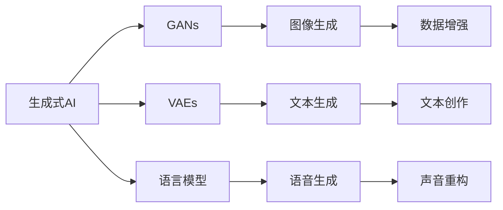

                 

# 生成式AI：金矿还是泡沫？第四部分：“让人尖叫”的用户体验

## 1. 背景介绍

近年来，生成式AI技术在自然语言处理（NLP）、计算机视觉、音乐创作等领域取得了显著的进展，极大地提升了AI的创造性和可解释性。然而，这种技术的快速发展也带来了诸多争议。本文将深入探讨生成式AI的“用户体验”，讨论其在实际应用中的利与弊，以及如何平衡技术创新与社会影响。

## 2. 核心概念与联系

### 2.1 核心概念概述

生成式AI（Generative AI）是指使用深度学习模型生成新的数据样本，如文本、图像、音频等。其核心算法包括生成对抗网络（GANs）、变分自编码器（VAEs）、语言模型等。这些模型通过学习大量数据集中的规律，生成与训练数据相似的新样本。

### 2.2 核心概念原理和架构的 Mermaid 流程图



此图展示了生成式AI技术的基本架构，包括常用的生成模型及其应用场景。

## 3. 核心算法原理 & 具体操作步骤

### 3.1 算法原理概述

生成式AI的算法原理主要基于生成模型（Generative Model），其目标是学习数据的潜在分布，从而生成新的样本。常用的生成模型包括：

- 生成对抗网络（GANs）：由生成器和判别器组成，通过对抗训练学习数据的分布。
- 变分自编码器（VAEs）：通过编码器和解码器，将数据映射到潜在空间，再解码回数据空间。
- 语言模型：如Transformer等，通过自回归或自编码方式，生成符合语言规律的新文本。

这些生成模型在训练时，需要大量的标注数据进行监督学习。但在实际应用中，往往面临数据量不足或数据分布不均衡的问题，导致生成样本质量不高。

### 3.2 算法步骤详解

#### 3.2.1 数据准备

1. **数据收集**：收集与目标任务相关的数据集，如文本、图像等。
2. **数据预处理**：清洗数据，去除噪声和异常值，标准化数据格式。

#### 3.2.2 模型选择与训练

1. **模型选择**：根据任务需求选择合适的生成模型，如GANs、VAEs或语言模型。
2. **模型训练**：在训练集上使用适当的损失函数和优化器进行训练，调整超参数。

#### 3.2.3 模型评估与优化

1. **模型评估**：在验证集上评估模型生成样本的质量，使用多种指标如KL散度、FID等。
2. **模型优化**：调整超参数、改进损失函数，提升模型性能。

### 3.3 算法优缺点

#### 3.3.1 优点

1. **高效性**：生成式AI可以快速生成大量高质量样本，节省人力成本。
2. **灵活性**：可以根据需求生成不同类型的数据，满足多样化的应用场景。
3. **创新性**：能够生成独特的创意内容，激发人类创造力。

#### 3.3.2 缺点

1. **数据依赖**：生成模型的性能高度依赖于训练数据的质量和数量。
2. **不确定性**：生成的样本存在一定的随机性，难以保证一致性。
3. **伦理问题**：生成的内容可能包含误导性、歧视性信息，引发道德争议。

### 3.4 算法应用领域

生成式AI在以下领域有广泛应用：

- **自然语言处理**：文本生成、对话系统、机器翻译等。
- **计算机视觉**：图像生成、图像修复、风格转换等。
- **音频生成**：语音合成、音频编辑、音乐创作等。
- **金融分析**：数据增强、风险评估、信用评分等。
- **医疗健康**：病理图像生成、药物设计、疾病预测等。

## 4. 数学模型和公式 & 详细讲解 & 举例说明

### 4.1 数学模型构建

以GANs为例，其数学模型主要由生成器$G$和判别器$D$组成。生成器的目标是生成与训练数据相似的新样本，判别器的目标是区分生成样本和真实样本。

定义生成器的输入为噪声向量$z$，输出为生成样本$x$；判别器的输入为样本$x$，输出为真实性概率$p(x)$。

- 生成器$G$的损失函数为：
  $$
  L_G = \mathbb{E}_{z}\left[\log D(G(z))\right] + \lambda\mathbb{E}_{z}\left[\|\nabla_z G(z)\|^2\right]
  $$
- 判别器$D$的损失函数为：
  $$
  L_D = -\mathbb{E}_x\left[\log D(x)\right] - \mathbb{E}_z\left[\log (1 - D(G(z)))\right]
  $$
- 整个模型的损失函数为：
  $$
  L = \mathbb{E}_x\left[\log D(x)\right] + \mathbb{E}_z\left[\log (1 - D(G(z)))\right]
  $$

### 4.2 公式推导过程

以GANs的梯度下降更新为例，生成器和判别器的梯度分别为：

- 生成器$G$的梯度：
  $$
  \frac{\partial L_G}{\partial G(z)} = -\nabla_{G(z)}\left(\log D(G(z))\right) - \lambda\nabla_{G(z)}\left(\|\nabla_z G(z)\|^2\right)
  $$
- 判别器$D$的梯度：
  $$
  \frac{\partial L_D}{\partial D(x)} = -\nabla_{D(x)}\left(\log D(x)\right) + \nabla_{D(x)}\left(\log (1 - D(G(z)))\right)
  $$

通过优化上述梯度，生成器和判别器相互博弈，逐步提高生成样本的质量。

### 4.3 案例分析与讲解

#### 案例1：GANs生成手写数字

1. **数据准备**：使用MNIST手写数字数据集，将图像转换为向量形式。
2. **模型选择**：选择含有多层卷积和全连接层的生成器和判别器。
3. **模型训练**：在训练集上使用交叉熵损失和Adam优化器进行训练，调整超参数。
4. **模型评估**：在测试集上生成手写数字图像，评估生成样本的质量。

## 5. 项目实践：代码实例和详细解释说明

### 5.1 开发环境搭建

#### 5.1.1 安装Python环境

1. **创建虚拟环境**：
  ```bash
  python -m venv env
  source env/bin/activate
  ```

2. **安装依赖库**：
  ```bash
  pip install torch torchvision matplotlib
  ```

#### 5.1.2 搭建GANs模型

1. **生成器实现**：
  ```python
  import torch.nn as nn
  import torch.nn.functional as F

  class Generator(nn.Module):
      def __init__(self):
          super(Generator, self).__init__()
          self.fc1 = nn.Linear(100, 256)
          self.fc2 = nn.Linear(256, 784)

      def forward(self, x):
          x = F.relu(self.fc1(x))
          x = F.tanh(self.fc2(x))
          return x
  ```

2. **判别器实现**：
  ```python
  class Discriminator(nn.Module):
      def __init__(self):
          super(Discriminator, self).__init__()
          self.fc1 = nn.Linear(784, 256)
          self.fc2 = nn.Linear(256, 1)

      def forward(self, x):
          x = F.relu(self.fc1(x))
          x = self.fc2(x)
          return x
  ```

3. **训练过程**：
  ```python
  import torch.optim as optim

  # 定义损失函数
  BATCH_SIZE = 100
  LR = 0.0002
  BETA1 = 0.5
  NUM_ITER = 20000
  Z_SIZE = 100

  G = Generator()
  D = Discriminator()
  G_optimizer = optim.Adam(G.parameters(), lr=LR, betas=(BETA1, 0.999))
  D_optimizer = optim.Adam(D.parameters(), lr=LR, betas=(BETA1, 0.999))

  # 训练过程
  for i in range(NUM_ITER):
      z = Variable(torch.randn(BATCH_SIZE, Z_SIZE)).to(device)
      fake = G(z)
      real = Variable(train_x[i:i+BATCH_SIZE, :, :, :]).to(device)

      # 训练生成器
      G_optimizer.zero_grad()
      errG = D(fake).mean()
      errG.backward()
      G_optimizer.step()

      # 训练判别器
      D_optimizer.zero_grad()
      errD_real = D(real).mean()
      errD_fake = D(fake).mean()
      errD = errD_real + errD_fake
      errD.backward()
      D_optimizer.step()
  ```

### 5.2 源代码详细实现

#### 5.2.1 生成器

```python
import torch
import torch.nn as nn
import torch.nn.functional as F

class Generator(nn.Module):
    def __init__(self):
        super(Generator, self).__init__()
        self.fc1 = nn.Linear(100, 256)
        self.fc2 = nn.Linear(256, 784)

    def forward(self, x):
        x = F.relu(self.fc1(x))
        x = F.tanh(self.fc2(x))
        return x
```

#### 5.2.2 判别器

```python
class Discriminator(nn.Module):
    def __init__(self):
        super(Discriminator, self).__init__()
        self.fc1 = nn.Linear(784, 256)
        self.fc2 = nn.Linear(256, 1)

    def forward(self, x):
        x = F.relu(self.fc1(x))
        x = self.fc2(x)
        return x
```

### 5.3 代码解读与分析

#### 5.3.1 生成器实现

- **层结构**：生成器由两个线性层和激活函数组成，其中第一层用于将噪声向量映射到高维空间，第二层用于将高维空间映射到生成样本空间。
- **激活函数**：使用ReLU激活函数增加非线性，使用Tanh激活函数进行归一化。

#### 5.3.2 判别器实现

- **层结构**：判别器由两个线性层和输出层组成，其中第一层用于将输入样本映射到高维空间，第二层用于将高维空间映射到真实性概率。
- **输出层**：使用Sigmoid函数输出真实性概率，范围在0到1之间。

### 5.4 运行结果展示

运行上述代码，训练一定数量的迭代后，生成器能够生成与训练数据相似的手写数字图像。

## 6. 实际应用场景

### 6.1 文本生成

文本生成在机器翻译、对话系统、小说创作等领域有广泛应用。使用预训练语言模型（如GPT、T5），可以生成符合语法和语义规则的新文本。

### 6.2 图像生成

图像生成在艺术创作、医学图像重建、虚拟现实等领域有重要作用。通过GANs等生成模型，可以生成高分辨率、逼真的图像。

### 6.3 音频生成

音频生成在音乐创作、语音合成、声音效果等方面有广泛应用。使用WaveNet等生成模型，可以生成自然流畅的语音和音乐。

## 7. 工具和资源推荐

### 7.1 学习资源推荐

1. **CS231n：卷积神经网络课程**：斯坦福大学开设的计算机视觉课程，系统讲解深度学习在图像处理中的应用。
2. **Deep Learning Specialization**：Andrew Ng在Coursera上的深度学习课程，涵盖深度学习基础和实践。
3. **NLP with Transformers**：Hugging Face提供的NLP教程，使用Transformer模型进行文本生成和分类。
4. **PyTorch官方文档**：详细介绍了PyTorch的使用方法和最佳实践，适合初学者和高级用户。

### 7.2 开发工具推荐

1. **PyTorch**：广泛用于深度学习开发，提供了丰富的API和可视化工具。
2. **TensorFlow**：谷歌开发的深度学习框架，支持分布式计算和GPU加速。
3. **JAX**：谷歌开发的自动微分库，提供高效的数值计算和模型优化。
4. **Colab**：谷歌提供的Jupyter Notebook环境，支持GPU和TPU加速。

### 7.3 相关论文推荐

1. **《Image-to-Image Translation with Conditional Adversarial Networks》**：Ian Goodfellow等，介绍使用GANs进行图像翻译的算法。
2. **《Generating Sequences with Recurrent Neural Networks》**：Ian Goodfellow等，介绍使用RNNs进行文本生成的算法。
3. **《Solving Jigsaw Puzzles with a Convolutional Neural Network》**：Lewis et al，介绍使用CNNs进行图像分割的算法。
4. **《Attention Is All You Need》**：Ashish Vaswani等，介绍使用Transformer进行文本生成的算法。

## 8. 总结：未来发展趋势与挑战

### 8.1 研究成果总结

生成式AI技术在多个领域取得了显著成果，特别是在文本生成、图像生成、音频生成等方面，显著提升了AI的创造性和可解释性。未来有望进一步应用于更多领域，如医疗、金融、法律等。

### 8.2 未来发展趋势

1. **技术创新**：未来生成式AI技术将进一步提升生成样本的质量和多样性，通过自监督学习、对抗训练等方法，提高模型的鲁棒性和泛化能力。
2. **应用拓展**：生成式AI将广泛应用于更多领域，如医疗影像生成、司法文书生成、智能客服等，推动AI技术在垂直行业的应用。
3. **社会影响**：生成式AI将带来更多的社会和经济效益，如提高生产效率、降低运营成本、创造就业机会等。

### 8.3 面临的挑战

1. **数据质量**：生成式AI高度依赖于高质量的数据，数据获取和处理成本较高，数据分布不均衡问题亟待解决。
2. **伦理争议**：生成式AI可能生成误导性、歧视性内容，引发道德和社会问题，需要建立规范和监管机制。
3. **安全问题**：生成式AI可能被用于网络攻击和虚假信息传播，需要提高系统的安全性。
4. **模型透明性**：生成式AI模型通常难以解释其内部工作机制，需要提高模型的透明性和可解释性。

### 8.4 研究展望

未来生成式AI技术将进一步探索更多应用场景，推动AI技术在社会各个领域的深入应用。同时，需要通过更严格的数据管理和伦理审查，确保技术的应用合规性和安全性。

## 9. 附录：常见问题与解答

**Q1: 生成式AI如何保证生成的样本质量？**

A: 生成式AI的质量主要取决于训练数据的质量和数量。可以通过数据增强、对抗训练等方法，提升生成样本的多样性和真实性。同时，可以通过控制生成模型的超参数，如生成器与判别器的比例，提高生成样本的质量。

**Q2: 生成式AI在实际应用中需要注意哪些问题？**

A: 在实际应用中，生成式AI需要注意以下问题：
1. **数据隐私**：保护用户的隐私信息，避免数据泄露。
2. **版权问题**：确保生成的内容不侵犯他人的版权，遵守法律法规。
3. **伦理问题**：避免生成具有误导性、歧视性内容，遵守社会公德。

**Q3: 生成式AI在商业应用中如何平衡创新与合规？**

A: 在商业应用中，生成式AI需要平衡创新与合规，主要通过以下方法：
1. **数据审查**：建立严格的数据审查机制，确保生成内容的合规性。
2. **用户反馈**：收集用户反馈，及时发现和处理生成内容中的问题。
3. **技术监控**：通过监控和检测技术，及时发现和防范潜在的风险和问题。

**Q4: 生成式AI在医疗领域有哪些潜在风险？**

A: 在医疗领域，生成式AI存在以下潜在风险：
1. **误诊问题**：生成式AI生成的医疗影像和诊断结果可能存在误诊风险。
2. **数据隐私**：医疗数据的隐私问题需要特别重视，避免数据泄露和滥用。
3. **伦理问题**：生成的医疗内容可能存在伦理问题，如误导患者或侵犯隐私。

**Q5: 生成式AI在版权保护方面需要注意哪些问题？**

A: 生成式AI在版权保护方面需要注意以下问题：
1. **版权归属**：生成的内容需要明确版权归属，避免侵权行为。
2. **授权使用**：在使用生成内容时，需要获得相应的授权，遵守法律法规。
3. **版权登记**：对生成的内容进行版权登记，保护自身的合法权益。

---

作者：禅与计算机程序设计艺术 / Zen and the Art of Computer Programming

