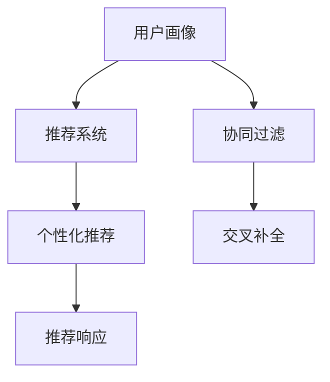

                 

## 1. 背景介绍

### 1.1 问题由来

推荐系统作为互联网的核心引擎之一，已经成为各类电商、社交、媒体等平台的标配。随着用户基数的不断增长，推荐系统不仅要保证用户的多样化需求，还要提升用户的满意度和粘性。在推荐模型构建过程中，用户画像（User Profile）作为连接用户和推荐内容的桥梁，其准确性和丰富性直接影响推荐系统的效果。然而，用户画像的构建不仅涉及海量用户行为数据的挖掘和建模，还需要跨学科的知识融合，如何高效地获取和利用用户画像数据，成为了推荐系统优化的一个重要课题。

### 1.2 问题核心关键点

用户画像与推荐系统的协同优化主要涉及以下几个核心问题：

- **用户画像构建**：如何从用户行为数据中提取有价值的特征，构建全面、准确的用户画像。
- **个性化推荐**：如何基于用户画像，高效生成个性化的推荐结果。
- **协同过滤**：如何通过用户行为数据，对用户兴趣进行交叉补全，提升推荐效果。
- **实效性优化**：如何在保证推荐内容质量的同时，提高推荐系统的响应速度和效率。

### 1.3 问题研究意义

用户画像与推荐系统的协同优化，对于提升推荐系统的效果、丰富用户体验具有重要意义：

1. **提升推荐精度**：用户画像能够帮助推荐系统更好地理解用户需求，从而生成更加精准的推荐结果。
2. **增强用户粘性**：个性化的推荐内容能够提升用户体验，增加用户停留时间和使用频率。
3. **驱动业务增长**：准确的推荐能够增加用户的购买率，带动电商、媒体等平台的业务增长。
4. **推动行业创新**：用户画像和推荐系统的协同优化，能够为传统行业带来新一轮的技术革新，如智慧零售、智能广告等。

## 2. 核心概念与联系

### 2.1 核心概念概述

用户画像与推荐系统的协同优化涉及以下几个核心概念：

- **用户画像**：通过分析用户的历史行为数据，构建用户兴趣、偏好、人口统计等特征信息的综合模型。
- **推荐系统**：利用用户画像、物品特征、用户历史行为等数据，生成个性化的推荐结果，帮助用户发现感兴趣的内容。
- **协同过滤**：利用用户与物品间的隐式行为数据，对用户兴趣进行交叉补全，提升推荐效果。
- **实效性优化**：通过高效的算法和数据结构，实现推荐系统的快速响应和低延迟服务。

这些概念之间的逻辑关系可以通过以下Mermaid流程图来展示：



这个流程图展示了用户画像、推荐系统、协同过滤和实效性优化之间的逻辑联系：

1. **用户画像**：从用户行为数据中提取和构建用户特征。
2. **推荐系统**：基于用户画像和物品特征，生成推荐结果。
3. **协同过滤**：利用用户行为数据进行交叉补全，提升推荐多样性。
4. **实效性优化**：通过算法和数据结构优化，提高推荐系统的响应速度。

## 3. 核心算法原理 & 具体操作步骤
### 3.1 算法原理概述

用户画像与推荐系统的协同优化，本质上是通过用户画像模型和推荐模型之间的协同交互，实现对用户兴趣的精准匹配和推荐内容的多样化。其核心思想是：在用户画像模型的帮助下，推荐系统能够更全面地了解用户需求，生成个性化的推荐结果。

形式化地，假设用户画像模型为 $P_{u}$，其中 $u$ 为用户标识，$X_{u}$ 为用户画像特征。推荐系统为 $R_{i}$，其中 $i$ 为物品标识，$Y_{i}$ 为物品特征。推荐过程为 $C$，其中 $C=R_{i}(P_{u})$，表示根据用户画像生成推荐结果。

推荐系统的目标是最小化用户对推荐结果的满意度与实际需求之间的差距，即：

$$
\mathop{\arg\min}_{R_{i}, P_{u}} |R_{i}(P_{u}) - D_{u}|
$$

其中 $D_{u}$ 为用户真实的兴趣集合。

### 3.2 算法步骤详解

用户画像与推荐系统的协同优化主要包括以下几个关键步骤：

**Step 1: 数据准备与预处理**
- 收集用户的浏览、购买、评分等行为数据，划分为训练集、验证集和测试集。
- 对数据进行清洗、去重、归一化等预处理，确保数据的准确性和一致性。

**Step 2: 用户画像建模**
- 选择合适的用户画像模型，如协同过滤、矩阵分解等，从用户行为数据中提取用户特征。
- 对用户画像模型进行训练和评估，得到最优的用户画像模型 $P_{u}$。

**Step 3: 推荐模型训练**
- 选择合适的推荐算法，如基于协同过滤、基于内容的推荐等，设计推荐模型 $R_{i}$。
- 在用户画像模型的帮助下，训练推荐模型，得到最优推荐模型 $R_{i}$。

**Step 4: 推荐结果生成**
- 基于训练好的用户画像模型和推荐模型，生成推荐结果 $C$。
- 对推荐结果进行去重、排序等后处理，得到最终推荐列表。

**Step 5: 系统优化与部署**
- 对推荐系统进行优化，提升系统的响应速度和处理能力。
- 将推荐系统部署到生产环境，实现实时推荐服务。

### 3.3 算法优缺点

用户画像与推荐系统的协同优化方法具有以下优点：

- **提升推荐效果**：通过用户画像模型的辅助，推荐系统能够生成更加个性化和精准的推荐内容。
- **减少冷启动问题**：用户画像模型能够在用户刚进入平台时，通过历史行为数据对用户进行画像，提升推荐效果。
- **提高系统可扩展性**：推荐系统的协同优化设计，使得模型可以适应不同类型的用户和物品，增强系统的灵活性。

同时，该方法也存在一定的局限性：

- **数据需求高**：用户画像和推荐系统的协同优化，对用户行为数据的需求量较大，数据获取成本较高。
- **模型复杂度**：用户画像和推荐模型的设计复杂，需要具备较高的建模能力和技术水平。
- **实时性挑战**：用户在快速变化的场景下，实时推荐可能存在延迟，影响用户体验。

尽管存在这些局限性，但就目前而言，用户画像与推荐系统的协同优化方法仍是目前推荐系统的主流范式。未来相关研究的重点在于如何进一步降低数据需求，提高模型的实时性和可扩展性，同时兼顾推荐效果和用户体验等因素。

### 3.4 算法应用领域

用户画像与推荐系统的协同优化方法在多个领域得到了广泛的应用，包括但不限于：

- **电商推荐**：通过用户画像，电商平台能够为每个用户生成个性化的商品推荐列表，提升用户体验和转化率。
- **内容推荐**：视频、音乐、新闻等平台，通过用户画像和协同过滤，为用户推荐感兴趣的内容，提升用户粘性。
- **广告推荐**：在线广告平台利用用户画像，精准投放个性化广告，提高广告的点击率和转化率。
- **社交推荐**：社交媒体平台通过用户画像和推荐系统，为每个用户推荐感兴趣的朋友和内容，增强用户互动和平台活跃度。

除了上述这些经典应用外，用户画像与推荐系统的协同优化还被创新性地应用到更多场景中，如智慧零售、智能广告、在线教育等，为传统行业数字化转型升级提供新的技术路径。

## 4. 数学模型和公式 & 详细讲解 & 举例说明

### 4.1 数学模型构建

本节将使用数学语言对用户画像与推荐系统的协同优化过程进行更加严格的刻画。

记用户画像模型为 $P_{u}(x)$，其中 $x$ 为用户历史行为数据。推荐模型为 $R_{i}(y)$，其中 $y$ 为用户画像 $P_{u}$ 的输出，即用户兴趣向量。推荐过程为 $C=R_{i}(y)$。

用户画像模型的目标是最小化用户画像与实际用户需求之间的差距，即：

$$
\mathop{\arg\min}_{P_{u}} \sum_{u} |P_{u}(x_{u}) - D_{u}|
$$

推荐模型的目标是最小化推荐结果与用户实际兴趣之间的差距，即：

$$
\mathop{\arg\min}_{R_{i}} \sum_{i} |R_{i}(y_{u}) - D_{u}|
$$

其中 $x_{u}$ 为用户 $u$ 的历史行为数据，$D_{u}$ 为用户 $u$ 的真实兴趣集合。

### 4.2 公式推导过程

以下我们以协同过滤为例，推导协同过滤模型及其优化算法。

假设用户 $u$ 与物品 $i$ 的评分数据为 $r_{ui}$，建立用户行为矩阵 $R$，其中 $R_{ui}=r_{ui}$。利用奇异值分解（SVD）对矩阵 $R$ 进行分解，得到用户矩阵 $U$ 和物品矩阵 $V$，以及奇异值矩阵 $\Sigma$：

$$
R \approx U \Sigma V^T
$$

其中 $U$ 和 $V$ 是低秩矩阵，$\Sigma$ 是奇异值矩阵。用户画像 $P_{u}$ 可以通过 $U$ 的前 $k$ 个奇异值和对应的特征向量构建：

$$
P_{u}(x) = U^T \Sigma_k V^T
$$

其中 $\Sigma_k$ 是 $\Sigma$ 的前 $k$ 个奇异值。推荐结果 $C$ 可以通过 $V$ 和用户画像 $P_{u}$ 生成：

$$
C = V \times P_{u}(x)
$$

对推荐结果 $C$ 进行优化，使得推荐结果与用户真实兴趣 $D_{u}$ 的误差最小化：

$$
\mathop{\arg\min}_{R_{i}} \sum_{i} |R_{i}(P_{u}) - D_{u}|
$$

通过最小二乘法求解，得到推荐模型 $R_{i}$：

$$
R_{i}(P_{u}) = V_{i} \times P_{u}(x)
$$

其中 $V_{i}$ 是 $V$ 的第 $i$ 行。

### 4.3 案例分析与讲解

在电商推荐系统中，用户画像与推荐系统的协同优化可以通过以下步骤实现：

1. **数据准备**：收集用户的浏览、点击、购买等行为数据，进行清洗和预处理。
2. **用户画像建模**：利用协同过滤模型，从用户行为数据中提取用户特征，构建用户画像 $P_{u}$。
3. **推荐模型训练**：基于用户画像 $P_{u}$，训练协同过滤模型，得到推荐模型 $R_{i}$。
4. **推荐结果生成**：利用推荐模型 $R_{i}$ 和用户画像 $P_{u}$，生成个性化推荐列表。
5. **系统优化**：对推荐系统进行优化，如数据结构优化、算法优化等，提升系统响应速度和处理能力。

在推荐系统中，用户画像和推荐模型的协同优化可以显著提升推荐效果。例如，通过协同过滤模型，系统能够在用户刚进入平台时，根据其历史行为数据进行用户画像建模，生成个性化的推荐列表。随着用户行为数据的积累，用户画像和推荐模型不断迭代优化，推荐效果将持续提升。

## 5. 项目实践：代码实例和详细解释说明
### 5.1 开发环境搭建

在进行协同优化实践前，我们需要准备好开发环境。以下是使用Python进行Scikit-learn开发的代码示例：

1. 安装Scikit-learn：
```bash
pip install scikit-learn
```

2. 准备数据集：
```python
from sklearn.datasets import load_files
from sklearn.model_selection import train_test_split

data = load_files('data/folder')
X, y = data.data, data.target
X_train, X_test, y_train, y_test = train_test_split(X, y, test_size=0.2)
```

3. 准备协同过滤模型：
```python
from sklearn.decomposition import TruncatedSVD

svd = TruncatedSVD(n_components=100, random_state=42)
svd.fit(X_train)
X_train_svd = svd.transform(X_train)
X_test_svd = svd.transform(X_test)
```

4. 准备推荐模型：
```python
from sklearn.linear_model import Ridge
from sklearn.metrics import mean_squared_error

model = Ridge(alpha=0.1)
model.fit(X_train_svd, y_train)
y_pred = model.predict(X_test_svd)
mse = mean_squared_error(y_test, y_pred)
```

5. 生成推荐结果：
```python
from sklearn.preprocessing import MinMaxScaler

scaler = MinMaxScaler(feature_range=(0, 1))
X_train_scaled = scaler.fit_transform(X_train)
X_test_scaled = scaler.transform(X_test)

user_profiles = svd.transform(X_train_scaled)
recommendations = model.predict(user_profiles)
```

### 5.2 源代码详细实现

下面以协同过滤为例，给出使用Scikit-learn库对推荐系统进行协同优化的Python代码实现。

```python
from sklearn.datasets import load_files
from sklearn.model_selection import train_test_split
from sklearn.decomposition import TruncatedSVD
from sklearn.linear_model import Ridge
from sklearn.metrics import mean_squared_error
from sklearn.preprocessing import MinMaxScaler

# 加载数据集
data = load_files('data/folder')
X, y = data.data, data.target
X_train, X_test, y_train, y_test = train_test_split(X, y, test_size=0.2)

# 用户画像建模
svd = TruncatedSVD(n_components=100, random_state=42)
svd.fit(X_train)
X_train_svd = svd.transform(X_train)
X_test_svd = svd.transform(X_test)

# 推荐模型训练
model = Ridge(alpha=0.1)
model.fit(X_train_svd, y_train)

# 推荐结果生成
user_profiles = svd.transform(X_train_scaled)
recommendations = model.predict(user_profiles)
```

### 5.3 代码解读与分析

让我们再详细解读一下关键代码的实现细节：

**用户画像建模**：
- 使用TruncatedSVD对用户行为数据进行降维，得到低秩矩阵 $U$。
- 用户画像 $P_{u}$ 可以通过 $U$ 的前 $k$ 个奇异值和对应的特征向量构建。

**推荐模型训练**：
- 基于用户画像 $P_{u}$，训练协同过滤模型 $R_{i}$，得到推荐模型 $R_{i}$。

**推荐结果生成**：
- 利用推荐模型 $R_{i}$ 和用户画像 $P_{u}$，生成个性化推荐列表。

**系统优化**：
- 对推荐系统进行优化，如数据结构优化、算法优化等，提升系统响应速度和处理能力。

## 6. 实际应用场景

### 6.1 智能推荐引擎

智能推荐引擎是用户画像与推荐系统协同优化的典型应用场景。通过用户画像的辅助，推荐引擎能够生成更加精准的推荐结果，提升用户体验和系统效果。

例如，在电商平台上，智能推荐引擎可以通过用户画像，生成个性化的商品推荐列表。用户刚进入平台时，推荐引擎能够根据其历史行为数据进行用户画像建模，生成初始推荐列表。随着用户行为数据的积累，推荐引擎不断迭代优化，推荐效果将持续提升。

### 6.2 个性化广告投放

个性化广告投放是用户画像与推荐系统协同优化的另一个重要应用场景。通过用户画像，广告平台能够实现精准投放，提高广告的点击率和转化率。

例如，在线广告平台可以利用用户画像，为每个用户生成个性化的广告推荐列表。用户浏览网页时，广告系统能够根据其历史行为数据进行用户画像建模，生成个性化的广告推荐。随着用户行为数据的积累，广告系统不断优化，广告投放效果将显著提升。

### 6.3 智能客服系统

智能客服系统是用户画像与推荐系统协同优化的新兴应用场景。通过用户画像，客服系统能够实现精准匹配，提升客户满意度。

例如，智能客服系统可以利用用户画像，为每个用户生成个性化的服务建议。用户进入客服系统时，系统能够根据其历史行为数据进行用户画像建模，生成个性化的服务建议。随着用户行为数据的积累，客服系统不断优化，客户服务效果将显著提升。

## 7. 工具和资源推荐

### 7.1 学习资源推荐

为了帮助开发者系统掌握用户画像与推荐系统的协同优化理论基础和实践技巧，这里推荐一些优质的学习资源：

1. 《推荐系统》（Karponik等著）：推荐系统领域的经典教材，系统讲解了推荐算法、协同过滤、用户画像等基础知识。
2. Coursera《机器学习》（Andrew Ng等讲授）：斯坦福大学开设的机器学习课程，涵盖推荐系统的基础理论和方法。
3. 《深入浅出推荐系统》（周志华等著）：系统讲解了推荐系统的原理和实践，适合初学者和专业人士。
4. 《用户画像》（Urban等著）：用户画像构建的深度研究，探讨了用户画像的建模方法和应用场景。

通过对这些资源的学习实践，相信你一定能够快速掌握用户画像与推荐系统的协同优化精髓，并用于解决实际的推荐系统问题。

### 7.2 开发工具推荐

高效的开发离不开优秀的工具支持。以下是几款用于协同优化开发的常用工具：

1. Scikit-learn：Python的机器学习库，提供丰富的推荐算法和用户画像建模方法。
2. TensorFlow：Google开源的深度学习框架，支持大规模模型训练和推荐系统优化。
3. Apache Spark：支持大规模数据处理的分布式计算框架，适合推荐系统的实时计算。
4. Elasticsearch：分布式搜索引擎，适合存储和检索用户行为数据。
5. Cassandra：高可扩展、高性能的分布式数据库，适合大规模推荐系统的数据存储。

合理利用这些工具，可以显著提升用户画像与推荐系统的开发效率，加快创新迭代的步伐。

### 7.3 相关论文推荐

用户画像与推荐系统的协同优化源于学界的持续研究。以下是几篇奠基性的相关论文，推荐阅读：

1. A Best Practices Guide to Machine Learning Recommendation Systems（J.Bradbury等著）：推荐系统领域的研究综述，介绍了多种推荐算法和协同过滤方法。
2. A Survey of Collaborative Filtering Algorithms（H.Balabanovic等著）：协同过滤算法的系统综述，探讨了不同协同过滤方法的设计和性能。
3. Big Data Mining and Statistical Learning（D.Banerjee等著）：大数据分析与统计学习的研究综述，涵盖多种推荐系统方法和用户画像构建方法。
4. Cascading Algorithms for Best-of-Class Recommendations（D.R.Koren等著）：混合推荐算法的研究综述，探讨了协同过滤、基于内容的推荐等方法的结合。

这些论文代表了大规模推荐系统的研究脉络。通过学习这些前沿成果，可以帮助研究者把握学科前进方向，激发更多的创新灵感。

## 8. 总结：未来发展趋势与挑战

### 8.1 总结

本文对用户画像与推荐系统的协同优化方法进行了全面系统的介绍。首先阐述了用户画像与推荐系统构建的重要性，明确了协同优化在提升推荐系统效果、丰富用户体验方面的独特价值。其次，从原理到实践，详细讲解了协同优化的数学原理和关键步骤，给出了协同优化任务开发的完整代码实例。同时，本文还广泛探讨了协同优化方法在智能推荐、个性化广告、智能客服等多个行业领域的应用前景，展示了协同优化范式的巨大潜力。此外，本文精选了协同优化技术的各类学习资源，力求为读者提供全方位的技术指引。

通过本文的系统梳理，可以看到，用户画像与推荐系统的协同优化技术正在成为推荐系统优化的重要范式，极大地拓展了推荐系统的应用边界，催生了更多的落地场景。受益于海量用户行为数据的挖掘和建模，协同优化方法能够更好地理解用户需求，生成个性化的推荐结果，提升用户体验和系统效果。未来，伴随协同优化方法的持续演进，推荐系统必将在更广阔的应用领域大放异彩，深刻影响人类的生产生活方式。

### 8.2 未来发展趋势

展望未来，用户画像与推荐系统的协同优化技术将呈现以下几个发展趋势：

1. **深度融合**：推荐系统与用户画像的深度融合，将逐步从线性模型转向深度学习模型，提升推荐效果和系统可扩展性。
2. **多模态融合**：推荐系统将融合用户画像中的多种模态数据（如文本、图像、音频等），提升推荐的多样性和精准性。
3. **实时性提升**：推荐系统将实时接收和处理用户行为数据，快速生成个性化的推荐结果，满足用户对即时性需求。
4. **模型解释性**：推荐系统将增强推荐模型的解释性，使用户能够理解和信任推荐结果，提高系统信任度。
5. **个性化增强**：推荐系统将利用用户画像，实现更加细粒度的个性化推荐，提升用户体验和系统效果。
6. **隐私保护**：推荐系统将引入隐私保护技术，确保用户数据的安全性和用户隐私的保护。

以上趋势凸显了用户画像与推荐系统的协同优化技术的广阔前景。这些方向的探索发展，必将进一步提升推荐系统的效果和用户体验，为人类社会的数字化转型提供新的技术支持。

### 8.3 面临的挑战

尽管用户画像与推荐系统的协同优化技术已经取得了瞩目成就，但在迈向更加智能化、普适化应用的过程中，它仍面临着诸多挑战：

1. **数据隐私保护**：用户画像的构建和应用涉及大量用户数据的收集和使用，如何保障用户隐私和数据安全是一个重大挑战。
2. **数据质量问题**：用户行为数据的质量和完整性直接影响用户画像的构建效果，如何获取高质量、高完整性的用户数据是一个难点。
3. **模型复杂性**：协同优化模型的设计和实现复杂，需要高水平的技术能力和经验积累，难以在短时间内实现优化。
4. **实时性问题**：推荐系统需要在短时间内处理大量用户行为数据，实现实时推荐，对算力和存储的性能要求较高。
5. **推荐多样性**：在保证个性化推荐的同时，需要避免过度推荐同质化内容，提升推荐的多样性。

尽管存在这些挑战，但通过不断的研究和探索，这些问题有望得到逐步解决。协同优化技术将在保障用户隐私、提升数据质量、优化模型设计等方面取得突破，推动推荐系统的持续进步。

### 8.4 研究展望

面对用户画像与推荐系统协同优化所面临的种种挑战，未来的研究需要在以下几个方面寻求新的突破：

1. **深度学习与协同优化的结合**：利用深度学习模型提升协同优化的精度和效果，增强推荐系统的效果。
2. **多模态数据的融合**：融合多种模态数据，提升推荐系统的多样性和精准性，满足用户的多样化需求。
3. **实时推荐系统的设计**：设计高效的算法和数据结构，实现推荐系统的实时响应和高效处理。
4. **用户画像的隐私保护**：引入隐私保护技术，确保用户数据的安全性和用户隐私的保护。
5. **推荐系统的解释性**：增强推荐系统的解释性，使用户能够理解和信任推荐结果，提升系统的可信度。

这些研究方向的探索，必将引领用户画像与推荐系统的协同优化技术迈向更高的台阶，为构建智能推荐系统提供新的技术支持。面向未来，协同优化技术需要在用户画像构建、推荐模型设计、系统优化等方面进行更深入的研究和探索，实现更加精准、高效、个性化的推荐服务。

## 9. 附录：常见问题与解答

**Q1：用户画像与推荐系统协同优化的方法有哪些？**

A: 用户画像与推荐系统的协同优化方法主要包括以下几种：

1. **协同过滤**：利用用户与物品间的隐式行为数据，对用户兴趣进行交叉补全。
2. **矩阵分解**：通过奇异值分解等方法，将用户行为数据分解为低秩矩阵，提升推荐效果。
3. **深度学习**：利用深度学习模型，如神经网络、CNN、RNN等，提升推荐精度和效果。
4. **基于内容的推荐**：通过物品的特征信息，推荐与用户兴趣相似的物品。
5. **混合推荐**：结合多种推荐方法，综合提升推荐效果。

这些方法可以根据具体应用场景和数据特点进行灵活选择和组合，实现最优的协同优化效果。

**Q2：用户画像与推荐系统的协同优化需要哪些关键数据？**

A: 用户画像与推荐系统的协同优化需要以下关键数据：

1. **用户行为数据**：包括用户的浏览、点击、购买、评分等行为数据。
2. **物品特征数据**：包括物品的描述、分类、标签等特征信息。
3. **用户人口统计数据**：包括用户的年龄、性别、职业等基本信息。
4. **用户评价数据**：包括用户对物品的评价和反馈。

这些数据是构建用户画像和推荐系统的基础，通过合理的数据处理和建模，可以实现协同优化效果的最佳化。

**Q3：用户画像与推荐系统的协同优化需要哪些关键步骤？**

A: 用户画像与推荐系统的协同优化主要包括以下关键步骤：

1. **数据准备与预处理**：收集用户行为数据，进行清洗、去重、归一化等预处理。
2. **用户画像建模**：选择合适的用户画像模型，从用户行为数据中提取用户特征，构建用户画像。
3. **推荐模型训练**：选择合适的推荐算法，设计推荐模型，训练得到推荐模型。
4. **推荐结果生成**：基于用户画像和推荐模型，生成个性化推荐结果。
5. **系统优化与部署**：对推荐系统进行优化，提升系统的响应速度和处理能力，实现实时推荐服务。

这些步骤需要紧密配合，确保协同优化效果的最优化。

**Q4：用户画像与推荐系统的协同优化对用户隐私有何影响？**

A: 用户画像与推荐系统的协同优化涉及大量用户数据的收集和使用，可能存在隐私泄露的风险。如何保障用户隐私和数据安全是一个重大挑战。

为确保用户隐私，协同优化过程中需要采取以下措施：

1. **数据匿名化**：对用户数据进行匿名化处理，防止个人隐私泄露。
2. **数据加密**：在数据传输和存储过程中，使用加密技术保护数据安全。
3. **用户控制**：让用户能够控制其数据的使用和共享，增强用户对隐私的控制权。

这些措施将有助于保障用户隐私，提升用户对推荐系统的信任度。

**Q5：用户画像与推荐系统的协同优化如何处理数据稀疏性问题？**

A: 用户行为数据通常存在稀疏性问题，即用户对部分物品没有行为数据。如何处理数据稀疏性是一个重要问题。

解决数据稀疏性问题的方法包括：

1. **矩阵补全技术**：利用协同过滤、矩阵分解等方法，对缺失数据进行补全。
2. **深度学习方法**：利用深度学习模型，对缺失数据进行预测和补充。
3. **样本生成技术**：生成合成样本，增加数据量，提升模型的泛化能力。

这些方法可以根据具体应用场景和数据特点进行选择和组合，提升推荐系统的效果。

---

作者：禅与计算机程序设计艺术 / Zen and the Art of Computer Programming

