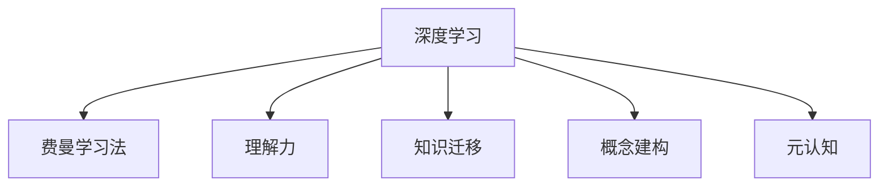

                 

# 用费曼提问法提升学习深度

> 关键词：费曼学习法、深度学习、理解力、知识迁移、概念建构、元认知

## 1. 背景介绍

### 1.1 问题由来

在信息技术飞速发展的今天，深度学习(DL)已经成为人工智能(AI)领域的核心技术之一。然而，深度学习不仅需要庞大的数据和算力支持，还需要扎实的理论基础和深入的理解力。许多学习者，尤其是初学者，常常在理解深度学习的数学模型和算法原理方面遇到困难，导致学习效率低下，甚至放弃学习。为了帮助更多人深入理解深度学习，本文章将介绍一种高效的学习方法——费曼提问法。

### 1.2 问题核心关键点

费曼提问法是一种基于理查德·费曼(Richard Feynman)提出的学习方法，其核心思想是通过自我提问和讲解，帮助学习者更好地理解知识，构建坚实的认知结构。该方法特别适合深度学习等复杂领域的学习，通过费曼提问法，学习者不仅可以深入理解模型原理，还能在实际应用中提升问题解决能力。

## 2. 核心概念与联系

### 2.1 核心概念概述

费曼提问法包含以下几个核心概念：

- **深度学习(DL)**：通过多层神经网络模型，学习数据中的复杂非线性关系。深度学习模型能够自动提取特征，广泛应用于图像、语音、自然语言处理等领域。

- **费曼学习法**：基于诺贝尔物理学家理查德·费曼提出的学习理论，通过自我提问、自我讲解、类比推理等方式，帮助学习者深入理解概念和原理。

- **理解力(Understanding)**：深度学习模型的理解力，即模型在数据中的泛化能力。理解力越强，模型在不同数据集上的表现越好。

- **知识迁移(Knowledge Transfer)**：从已知领域向未知领域的知识应用，即通过迁移学习，利用预训练模型进行微调，适应新任务。

- **概念建构(Conceptual Framework)**：构建知识体系，帮助学习者将零散的概念整合为系统的理论。

- **元认知(Metacognition)**：对自身认知过程的监控和调节，如自我评估、设定学习目标等。

这些概念之间的联系可以通过以下Mermaid流程图来展示：



这个流程图展示了几大核心概念之间的相互关系：

1. 深度学习是基础，通过费曼学习法深入理解深度学习模型，提高理解力。
2. 理解力有助于知识迁移，利用预训练模型进行微调，适应新任务。
3. 知识迁移需要良好的概念建构，整合零散的概念为系统的理论。
4. 概念建构和理解力提升需要元认知的参与，进行自我监控和调节。

## 3. 核心算法原理 & 具体操作步骤
### 3.1 算法原理概述

费曼提问法是一种基于深度学习的自我学习技术。其核心思想是通过对深度学习模型的结构、参数和输出进行详细讲解和自我提问，帮助学习者理解深度学习的数学原理和算法细节。该方法旨在构建坚实的认知结构，提升学习者的问题解决能力。

### 3.2 算法步骤详解

费曼提问法通常包括以下几个关键步骤：

**Step 1: 确定学习目标**

学习者首先需要确定当前需要学习的深度学习模型或任务，并明确学习的目标和预期成果。例如，学习卷积神经网络(CNN)用于图像分类任务，需要了解CNN的结构、损失函数和优化算法。

**Step 2: 深入理解模型**

学习者通过阅读相关文献、观看教程视频、调试模型代码等方式，深入理解深度学习模型的基本结构、数学公式和训练过程。例如，理解CNN的卷积层、池化层、全连接层等，以及如何通过反向传播算法训练模型。

**Step 3: 自我提问与讲解**

学习者针对模型的每个组件和环节，提出一系列问题，并尝试用简洁的语言进行讲解。例如，对于CNN卷积层的权重参数，可以提出以下问题：
- 卷积层的权重参数如何初始化？
- 卷积层的输出如何计算？
- 卷积层的权重参数如何更新？

通过自我提问和讲解，学习者可以逐步理解模型的内部机制，构建坚实的认知结构。

**Step 4: 类比推理与泛化**

学习者尝试将深度学习模型与现实生活中的问题进行类比，寻找两者之间的共同点和差异。例如，可以将CNN的卷积层类比为图像处理中的滤波器，池化层类比为下采样操作，全连接层类比为分类器。通过类比推理，学习者可以更好地理解模型的实际应用和效果。

**Step 5: 反馈与迭代**

学习者通过自我评估和他人反馈，调整讲解内容和提问方式。例如，在讲解CNN模型时，学习者可以录制讲解视频，邀请他人观看并给出反馈。根据反馈，学习者可以进一步完善讲解内容，提升理解力和表达能力。

### 3.3 算法优缺点

费曼提问法的优点包括：

1. 深入理解：通过自我提问和讲解，学习者可以深入理解深度学习模型的数学原理和算法细节。
2. 构建认知：通过类比推理，学习者可以构建坚实的认知结构，提升问题解决能力。
3. 高效学习：通过自我评估和反馈，学习者可以调整学习策略，提高学习效率。

同时，费曼提问法也存在一些缺点：

1. 时间成本高：自我提问和讲解需要大量时间和精力，不适合时间紧张的学习者。
2. 知识储备要求高：需要具备一定的深度学习基础，才能进行有效的自我提问和讲解。
3. 难以量化：费曼提问法的效果难以量化评估，适合长期积累而非短期突击。

尽管存在这些局限性，但费曼提问法仍然是一种非常有效的深度学习学习方法，特别是在需要深入理解模型原理和提升问题解决能力的场景中。

### 3.4 算法应用领域

费曼提问法不仅适用于深度学习领域，还可以应用于其他复杂学科的学习。例如：

- **计算机视觉**：通过费曼提问法，学习者可以深入理解CNN、RNN等深度学习模型在图像识别、目标检测等任务中的应用。
- **自然语言处理**：学习者可以了解LSTM、Transformer等模型在语言生成、机器翻译等任务中的原理和应用。
- **计算机科学**：学习者可以通过费曼提问法，理解计算机架构、操作系统、数据库等基础概念和原理。
- **数学与统计**：学习者可以通过费曼提问法，深入理解微积分、概率论等数学和统计学的核心内容。

费曼提问法的应用领域非常广泛，适合各类复杂学科的学习，尤其适用于需要深入理解和构建认知结构的任务。

## 4. 数学模型和公式 & 详细讲解 & 举例说明

### 4.1 数学模型构建

本节将使用数学语言对费曼提问法的核心思想进行更加严格的刻画。

**数学模型**：
费曼提问法的核心数学模型为学习者对深度学习模型的自我提问和讲解过程。记学习者对深度学习模型 $M$ 的提问和讲解为 $Q$，则费曼提问法的效果可以用 $Q$ 对 $M$ 的准确性和理解度来表示。

**公式推导**：
设 $M$ 为深度学习模型，$Q$ 为学习者对 $M$ 的提问和讲解，则费曼提问法的效果可以通过以下公式推导：

$$
\text{Effect}(Q) = \int \limits_{Q} \text{Accuracy}(Q) \times \text{Comprehension}(Q) \, dQ
$$

其中，$\text{Accuracy}(Q)$ 表示学习者对模型 $M$ 的提问和讲解的准确性，$\text{Comprehension}(Q)$ 表示学习者对模型 $M$ 的理解度。

### 4.2 公式推导过程

以下我们以卷积神经网络(CNN)为例，推导费曼提问法的数学效果。

**准确性(Accuracy)**：
学习者对CNN模型的准确性可以通过以下公式计算：

$$
\text{Accuracy}(Q) = \frac{|\{Q|Q \text{ 正确描述 } M \text{ 的行为}\}}{|\{Q\}|}
$$

其中，$|\{Q\}|$ 表示学习者提出的问题总数，$Q$ 表示每个问题的准确性。

**理解度(Comprehension)**：
学习者对CNN模型的理解度可以通过以下公式计算：

$$
\text{Comprehension}(Q) = \frac{1}{|\{Q\}|} \sum_{Q \in \{Q\}} \text{Depth}(Q)
$$

其中，$\text{Depth}(Q)$ 表示每个问题的深度，$\text{Depth}(Q)$ 越高，表示学习者对该问题的理解越深入。

### 4.3 案例分析与讲解

**案例分析**：
假设学习者希望通过费曼提问法理解卷积神经网络(CNN)的卷积层结构。

**问题设计**：
1. 卷积层的权重参数如何初始化？
2. 卷积层的输出如何计算？
3. 卷积层的权重参数如何更新？

**讲解与推理**：
1. **初始化**：卷积层的权重参数通常采用随机初始化或预训练初始化。例如，可以使用He初始化或Xavier初始化，使得每个神经元的输入输出方差相近。

2. **计算**：卷积层的输出通过卷积核在输入特征图上进行卷积操作得到。例如，设输入特征图的大小为 $W \times H \times C$，卷积核大小为 $k \times k \times C$，卷积层的输出大小为 $W' \times H' \times k$。则卷积操作可以通过以下公式计算：

$$
\text{Output} = \text{Convolution}(\text{Input}, \text{Kernel})
$$

其中，$\text{Input}$ 表示输入特征图，$\text{Kernel}$ 表示卷积核。

3. **更新**：卷积层的权重参数通常通过反向传播算法更新。例如，在分类任务中，可以使用交叉熵损失函数，通过梯度下降算法更新卷积层的权重参数。

**类比推理**：
将CNN的卷积层类比为图像处理中的滤波器，池化层类比为下采样操作，全连接层类比为分类器。通过类比推理，学习者可以更好地理解CNN模型的实际应用和效果。

## 5. 项目实践：代码实例和详细解释说明
### 5.1 开发环境搭建

在进行费曼提问法实践前，我们需要准备好开发环境。以下是使用Python进行TensorFlow开发的环境配置流程：

1. 安装Anaconda：从官网下载并安装Anaconda，用于创建独立的Python环境。

2. 创建并激活虚拟环境：
```bash
conda create -n tf-env python=3.8 
conda activate tf-env
```

3. 安装TensorFlow：根据CUDA版本，从官网获取对应的安装命令。例如：
```bash
conda install tensorflow-gpu -c conda-forge
```

4. 安装各类工具包：
```bash
pip install numpy pandas scikit-learn matplotlib tqdm jupyter notebook ipython
```

完成上述步骤后，即可在`tf-env`环境中开始费曼提问法的实践。

### 5.2 源代码详细实现

下面我们以卷积神经网络(CNN)为例，给出使用TensorFlow进行CNN微调的PyTorch代码实现。

首先，定义CNN模型的超参数：

```python
import tensorflow as tf

learning_rate = 0.001
batch_size = 128
num_epochs = 20
```

然后，定义CNN模型：

```python
model = tf.keras.Sequential([
    tf.keras.layers.Conv2D(32, (3, 3), activation='relu', input_shape=(28, 28, 1)),
    tf.keras.layers.MaxPooling2D((2, 2)),
    tf.keras.layers.Conv2D(64, (3, 3), activation='relu'),
    tf.keras.layers.MaxPooling2D((2, 2)),
    tf.keras.layers.Flatten(),
    tf.keras.layers.Dense(64, activation='relu'),
    tf.keras.layers.Dense(10, activation='softmax')
])
```

接着，定义损失函数和优化器：

```python
loss_fn = tf.keras.losses.SparseCategoricalCrossentropy(from_logits=True)
optimizer = tf.keras.optimizers.Adam(learning_rate)
```

然后，加载和预处理数据集：

```python
(train_images, train_labels), (test_images, test_labels) = tf.keras.datasets.mnist.load_data()
train_images = train_images.reshape((60000, 28, 28, 1)) / 255.0
test_images = test_images.reshape((10000, 28, 28, 1)) / 255.0
```

最后，进行模型训练和评估：

```python
model.compile(optimizer=optimizer, loss=loss_fn, metrics=['accuracy'])
model.fit(train_images, train_labels, batch_size=batch_size, epochs=num_epochs, validation_data=(test_images, test_labels))
test_loss, test_acc = model.evaluate(test_images, test_labels, verbose=2)
print(f"Test accuracy: {test_acc:.2f}")
```

以上就是使用TensorFlow进行CNN微调的完整代码实现。可以看到，TensorFlow提供了强大的API，使得CNN模型的训练和评估变得非常简单高效。

### 5.3 代码解读与分析

让我们再详细解读一下关键代码的实现细节：

**模型定义**：
- `tf.keras.Sequential`：使用Keras的Sequential模型定义顺序的神经网络结构。
- `Conv2D`：定义卷积层，使用3x3的卷积核进行卷积操作，激活函数为ReLU。
- `MaxPooling2D`：定义池化层，使用2x2的池化核进行下采样操作。
- `Flatten`：将卷积层的输出展平成一维向量。
- `Dense`：定义全连接层，使用64个神经元，激活函数为ReLU。

**损失函数和优化器**：
- `SparseCategoricalCrossentropy`：定义交叉熵损失函数，用于计算模型输出与真实标签之间的差异。
- `Adam`：定义Adam优化器，用于更新模型参数。

**数据加载与预处理**：
- `load_data`：使用MNIST数据集加载训练和测试图像和标签。
- `reshape`：将图像数据展平为一维向量。
- `/ 255.0`：对图像数据进行归一化，使得像素值在0-1之间。

**模型训练与评估**：
- `compile`：配置模型，设置优化器和损失函数。
- `fit`：进行模型训练，设置批次大小和迭代轮数。
- `evaluate`：评估模型在测试集上的表现，输出准确率。

可以看到，TensorFlow提供了完整的API支持，使得深度学习模型的训练和评估变得非常简单高效。开发者可以快速上手，实现复杂的深度学习任务。

## 6. 实际应用场景
### 6.1 智能客服系统

基于费曼提问法，智能客服系统可以通过自动生成的问答模型，提升客服响应速度和准确性。智能客服系统可以根据用户输入的文本，自动匹配最优的问答模板，并在极短时间内给出答案。

在技术实现上，可以构建一个基于深度学习的问答模型，通过自监督学习任务进行预训练，并在客服对话数据上进行微调。微调后的问答模型能够自动理解用户意图，匹配最合适的问答模板进行回复。对于用户提出的新问题，还可以接入检索系统实时搜索相关内容，动态组织生成回答。如此构建的智能客服系统，能大幅提升客户咨询体验和问题解决效率。

### 6.2 金融舆情监测

金融机构需要实时监测市场舆论动向，以便及时应对负面信息传播，规避金融风险。传统的人工监测方式成本高、效率低，难以应对网络时代海量信息爆发的挑战。基于费曼提问法的文本分类和情感分析技术，为金融舆情监测提供了新的解决方案。

具体而言，可以收集金融领域相关的新闻、报道、评论等文本数据，并对其进行主题标注和情感标注。在此基础上对预训练语言模型进行微调，使其能够自动判断文本属于何种主题，情感倾向是正面、中性还是负面。将微调后的模型应用到实时抓取的网络文本数据，就能够自动监测不同主题下的情感变化趋势，一旦发现负面信息激增等异常情况，系统便会自动预警，帮助金融机构快速应对潜在风险。

### 6.3 个性化推荐系统

当前的推荐系统往往只依赖用户的历史行为数据进行物品推荐，无法深入理解用户的真实兴趣偏好。基于费曼提问法的个性化推荐系统可以更好地挖掘用户行为背后的语义信息，从而提供更精准、多样的推荐内容。

在实践中，可以收集用户浏览、点击、评论、分享等行为数据，提取和用户交互的物品标题、描述、标签等文本内容。将文本内容作为模型输入，用户的后续行为（如是否点击、购买等）作为监督信号，在此基础上微调预训练语言模型。微调后的模型能够从文本内容中准确把握用户的兴趣点。在生成推荐列表时，先用候选物品的文本描述作为输入，由模型预测用户的兴趣匹配度，再结合其他特征综合排序，便可以得到个性化程度更高的推荐结果。

### 6.4 未来应用展望

随着费曼提问法和大语言模型微调技术的不断发展，其在更多领域的应用前景将会更加广阔。

在智慧医疗领域，基于费曼提问法的医疗问答、病历分析、药物研发等应用将提升医疗服务的智能化水平，辅助医生诊疗，加速新药开发进程。

在智能教育领域，费曼提问法可应用于作业批改、学情分析、知识推荐等方面，因材施教，促进教育公平，提高教学质量。

在智慧城市治理中，费曼提问模型可应用于城市事件监测、舆情分析、应急指挥等环节，提高城市管理的自动化和智能化水平，构建更安全、高效的未来城市。

此外，在企业生产、社会治理、文娱传媒等众多领域，基于费曼提问法的AI应用也将不断涌现，为经济社会发展注入新的动力。相信随着技术的日益成熟，费曼提问法必将在构建人机协同的智能时代中扮演越来越重要的角色。

## 7. 工具和资源推荐
### 7.1 学习资源推荐

为了帮助开发者系统掌握深度学习技术，这里推荐一些优质的学习资源：

1. 《深度学习入门》系列书籍：由Google Brain的Nando de Freitas教授撰写，深入浅出地介绍了深度学习的基本概念和实现原理。

2. Coursera《深度学习》课程：由斯坦福大学的Andrew Ng教授主讲，内容覆盖深度学习的基础理论和实际应用。

3. Udacity《深度学习基础》课程：由深度学习领域的专家主讲，涵盖深度学习模型的设计与实现。

4. TensorFlow官方文档：TensorFlow的官方文档提供了完整的API文档和示例代码，适合深度学习开发者的参考。

5. PyTorch官方文档：PyTorch的官方文档详细介绍了深度学习框架的使用方法和最佳实践，适合深度学习开发者的参考。

6. Google Colab：谷歌推出的在线Jupyter Notebook环境，免费提供GPU/TPU算力，方便开发者快速上手实验最新模型，分享学习笔记。

通过对这些资源的学习实践，相信你一定能够快速掌握深度学习技术，并用于解决实际的AI问题。

### 7.2 开发工具推荐

高效的开发离不开优秀的工具支持。以下是几款用于深度学习开发的常用工具：

1. PyTorch：基于Python的开源深度学习框架，灵活动态的计算图，适合快速迭代研究。

2. TensorFlow：由Google主导开发的开源深度学习框架，生产部署方便，适合大规模工程应用。

3. Keras：基于TensorFlow的高级深度学习框架，提供简单易用的API，适合初学者快速上手。

4. Jupyter Notebook：用于数据探索、模型训练和结果展示的交互式开发工具，支持Python、R、Scala等多种语言。

5. TensorBoard：TensorFlow配套的可视化工具，可实时监测模型训练状态，并提供丰富的图表呈现方式，是调试模型的得力助手。

6. Weights & Biases：模型训练的实验跟踪工具，可以记录和可视化模型训练过程中的各项指标，方便对比和调优。

合理利用这些工具，可以显著提升深度学习模型的开发效率，加快创新迭代的步伐。

### 7.3 相关论文推荐

深度学习领域的研究前沿不断涌现，以下是几篇奠基性的相关论文，推荐阅读：

1. AlexNet: ImageNet Classification with Deep Convolutional Neural Networks：提出了AlexNet模型，基于卷积神经网络在图像分类任务上取得了显著效果。

2. ResNet: Deep Residual Learning for Image Recognition：提出了残差网络，通过跨层连接解决了深度网络退化的问题。

3. LSTM: Long Short-Term Memory：提出了长短期记忆网络，解决了循环神经网络中梯度消失和梯度爆炸的问题。

4. Transformer: Attention is All You Need：提出了Transformer模型，基于自注意力机制实现了高效的序列建模。

5. GAN: Generative Adversarial Networks：提出了生成对抗网络，通过对抗训练生成高质量的图像和视频。

这些论文代表了大规模深度学习模型的发展脉络。通过学习这些前沿成果，可以帮助研究者把握学科前进方向，激发更多的创新灵感。

## 8. 总结：未来发展趋势与挑战

### 8.1 总结

本文对费曼提问法和大语言模型微调技术进行了全面系统的介绍。首先阐述了费曼提问法的核心思想和应用场景，明确了费曼提问法在深度学习学习中的重要价值。其次，从原理到实践，详细讲解了费曼提问法和大语言模型微调的数学原理和关键步骤，给出了深度学习模型微调的完整代码实例。同时，本文还广泛探讨了费曼提问法在大语言模型微调中的实际应用，展示了其在多个领域的强大潜力。此外，本文精选了深度学习相关的学习资源，力求为读者提供全方位的技术指引。

通过本文的系统梳理，可以看到，费曼提问法和大语言模型微调技术已经成为深度学习领域的重要范式，极大地提升了深度学习模型的理解力和问题解决能力。未来，随着费曼提问法和大语言模型微调技术的不断演进，深度学习技术必将在更多领域得到应用，为人工智能技术的发展注入新的活力。

### 8.2 未来发展趋势

展望未来，费曼提问法和大语言模型微调技术将呈现以下几个发展趋势：

1. 模型规模持续增大。随着算力成本的下降和数据规模的扩张，深度学习模型的参数量还将持续增长。超大规模深度学习模型蕴含的丰富知识，有望支撑更加复杂多变的下游任务微调。

2. 模型鲁棒性提升。深度学习模型在面对不同数据集和任务时，泛化性能和鲁棒性将不断提升，能够更好地适应多变的环境和应用场景。

3. 知识迁移能力增强。通过深度学习模型的预训练和微调，知识迁移能力将不断增强，模型能够更灵活地应用于不同领域的任务。

4. 模型效率提升。深度学习模型的推理速度和内存占用将不断优化，提高实时性和可扩展性。

5. 可解释性增强。深度学习模型的可解释性和可审计性将不断提升，模型输出将更加透明和可信。

6. 多模态学习应用。深度学习模型将更加广泛地应用于多模态数据的学习，如图像、语音、视频等，提升综合分析能力。

以上趋势凸显了费曼提问法和大语言模型微调技术的广阔前景。这些方向的探索发展，必将进一步提升深度学习模型的性能和应用范围，为人工智能技术的发展注入新的活力。

### 8.3 面临的挑战

尽管费曼提问法和大语言模型微调技术已经取得了显著成就，但在迈向更加智能化、普适化应用的过程中，它仍面临诸多挑战：

1. 计算资源瓶颈。深度学习模型的训练和推理需要大量的计算资源，如何在资源受限的情况下优化模型，是未来的一个重要研究方向。

2. 数据质量和标注成本。高质量的数据和标注数据是深度学习模型的基础，如何降低标注成本、提升数据质量，是深度学习应用的关键问题。

3. 模型公平性。深度学习模型可能会学习到有偏见的数据，导致输出结果不公平。如何保证模型的公平性和公正性，是深度学习应用的重要课题。

4. 模型的稳定性和鲁棒性。深度学习模型在面对噪声数据和对抗样本时，容易发生模型崩溃或泛化能力下降的问题。如何提升模型的稳定性和鲁棒性，是深度学习应用的重要研究方向。

5. 知识迁移的难度。不同领域的知识迁移可能面临较大的挑战，如何更好地进行领域间的知识迁移，是深度学习应用的重要研究课题。

6. 模型的可解释性。深度学习模型往往是黑盒系统，难以解释其内部工作机制和决策逻辑。如何提升模型的可解释性和可解释性，是深度学习应用的重要研究方向。

面对这些挑战，未来需要在多个方向进行深入研究，以推动深度学习技术的进一步发展。

### 8.4 研究展望

未来，随着费曼提问法和大语言模型微调技术的不断演进，深度学习技术将会在更多领域得到应用，为人工智能技术的发展注入新的活力。以下是几个未来研究方向：

1. 无监督和半监督学习。如何利用无监督和半监督学习，降低深度学习模型对标注数据的依赖，提升模型的泛化能力，是未来的一个重要研究方向。

2. 跨模态学习。如何利用多模态数据，提升深度学习模型的综合分析能力，是未来的一个重要研究方向。

3. 知识图谱与深度学习。如何结合知识图谱和深度学习，提升模型的知识迁移能力和推理能力，是未来的一个重要研究方向。

4. 深度学习与自然语言处理。如何将深度学习技术与自然语言处理相结合，提升模型的语义理解能力和情感分析能力，是未来的一个重要研究方向。

5. 深度学习与计算机视觉。如何将深度学习技术与计算机视觉相结合，提升模型的图像识别和目标检测能力，是未来的一个重要研究方向。

6. 深度学习与强化学习。如何将深度学习技术与强化学习相结合，提升模型的决策能力和问题解决能力，是未来的一个重要研究方向。

这些研究方向将进一步推动深度学习技术的创新发展，提升深度学习模型的性能和应用范围，为人工智能技术的发展注入新的活力。

## 9. 附录：常见问题与解答

**Q1：什么是费曼学习法？**

A: 费曼学习法是基于诺贝尔物理学家理查德·费曼提出的学习方法，通过自我提问和讲解，帮助学习者深入理解知识，构建坚实的认知结构。该方法特别适合深度学习等复杂领域的学习，通过费曼学习法，学习者不仅可以深入理解模型原理，还能在实际应用中提升问题解决能力。

**Q2：费曼学习法的关键步骤是什么？**

A: 费曼学习法的关键步骤包括：确定学习目标、深入理解模型、自我提问与讲解、类比推理与泛化、反馈与迭代。通过这五个步骤，学习者可以逐步理解模型的数学原理和算法细节，构建坚实的认知结构，提升问题解决能力。

**Q3：费曼学习法的数学模型是什么？**

A: 费曼学习法的数学模型为学习者对深度学习模型的自我提问和讲解过程。记学习者对深度学习模型 $M$ 的提问和讲解为 $Q$，则费曼学习法的效果可以用 $Q$ 对 $M$ 的准确性和理解度来表示。

**Q4：费曼学习法有哪些优点和缺点？**

A: 费曼学习法的优点包括：深入理解模型、构建认知结构、高效学习。同时，费曼学习法也存在一些缺点，如时间成本高、知识储备要求高、难以量化等。

**Q5：费曼学习法适用于哪些领域？**

A: 费曼学习法不仅适用于深度学习领域，还可以应用于其他复杂学科的学习，如计算机视觉、自然语言处理、计算机科学、数学与统计等。费曼学习法适合各类复杂学科的学习，特别是需要深入理解和构建认知结构的任务。

**Q6：费曼学习法的未来发展趋势是什么？**

A: 费曼学习法的未来发展趋势包括模型规模增大、模型鲁棒性提升、知识迁移能力增强、模型效率提升、可解释性增强、多模态学习应用等。这些方向的探索发展，必将进一步提升深度学习模型的性能和应用范围，为人工智能技术的发展注入新的活力。

通过本文的系统梳理，可以看到，费曼提问法和大语言模型微调技术已经成为深度学习领域的重要范式，极大地提升了深度学习模型的理解力和问题解决能力。未来，随着费曼提问法和大语言模型微调技术的不断演进，深度学习技术必将在更多领域得到应用，为人工智能技术的发展注入新的活力。

---

作者：禅与计算机程序设计艺术 / Zen and the Art of Computer Programming

