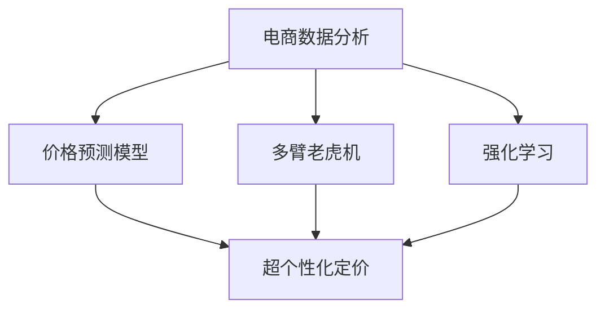

                 

# 电商价格策略的技术优化

## 1. 背景介绍

### 1.1 问题由来
电商平台的竞争日益激烈，价格策略成为了其竞争的核心之一。精准的价格定位不仅能够提高转化率，还能增加客户的忠诚度，从而提升销售额。传统的价格策略主要依赖于经验判断和市场调研，但这种基于人工直觉的方式，无法快速响应市场变化，且容易出错。随着机器学习和大数据技术的成熟，电商行业开始探索利用技术手段优化价格策略。

### 1.2 问题核心关键点
电商价格策略的优化核心在于如何利用数据科学的方法，结合业务规则，构建高效的预测模型，实现对价格的精准调优。该过程需要综合考虑用户行为、市场趋势、竞争对手定价、库存成本等因素，从而制定合理的调价方案。

### 1.3 问题研究意义
优化电商价格策略，对于提升电商平台的用户体验、增加销售收益、优化库存管理等方面具有重要意义：

1. **提升用户体验**：合理的价格策略能增加用户满意度，减少因价格不合理带来的用户流失。
2. **增加销售收益**：精准调价能够有效提升销售额，增加利润。
3. **优化库存管理**：通过预测库存需求，合理定价，避免过多库存积压或缺货。
4. **应对市场变化**：利用数据驱动的模型，快速响应市场变化，保持竞争力。
5. **提升决策效率**：数据驱动的决策过程，能够降低人工干预，提升决策速度和准确性。

## 2. 核心概念与联系

### 2.1 核心概念概述

为了更好地理解电商价格策略的技术优化方法，本节将介绍几个密切相关的核心概念：

- **电商数据分析**：指对电商平台上的交易数据、用户行为数据、市场数据等进行分析，挖掘有用的信息，为价格策略提供数据支撑。
- **价格预测模型**：通过机器学习算法构建的预测模型，能够基于历史数据预测未来价格，从而为调价提供依据。
- **多臂老虎机(MAB)**：一种多变量优化算法，用于在多个可调变量中寻找最优解，如价格调整、促销活动等。
- **强化学习**：通过智能体与环境互动，不断优化决策策略，适应市场变化，实现自动调价。
- **超个性化定价**：利用用户数据，实现对每个用户或用户群体定制化的定价策略，提升用户体验和满意度。
- **多目标优化**：在价格策略优化过程中，考虑多个目标（如销售额、用户满意度、库存水平等），综合平衡各方因素，优化决策结果。

这些核心概念之间的逻辑关系可以通过以下Mermaid流程图来展示：



这个流程图展示了几类电商价格策略优化方法及其相互关系：

1. 电商数据分析为价格策略提供数据基础。
2. 价格预测模型基于历史数据构建，用于预测未来价格。
3. 多臂老虎机和强化学习用于多变量优化，寻找最优调价方案。
4. 超个性化定价利用用户数据，实现定制化定价。
5. 多目标优化考虑多个目标，综合平衡决策结果。

## 3. 核心算法原理 & 具体操作步骤

### 3.1 算法原理概述

电商价格策略的技术优化，本质上是一个基于数据的机器学习问题。其核心思想是：通过构建预测模型，利用历史销售数据和市场信息，预测不同价格下的销售效果，从而选择最优价格，提升销售收益。

形式化地，假设电商平台上有 $N$ 种商品，每种商品在不同价格 $p_i$ 下的销售量 $q_i$ 已知，目标是找到一个最优的价格 $p^*$，最大化总体销售额：

$$
p^* = \mathop{\arg\min}_{p_i} \sum_{i=1}^N (p_i - C_i)q_i
$$

其中 $C_i$ 为商品的成本。

### 3.2 算法步骤详解

基于电商数据分析和预测模型，价格策略优化的算法步骤如下：

**Step 1: 数据准备**
- 收集电商平台的历史销售数据、用户行为数据、市场趋势数据等，构建训练集。
- 数据预处理，包括缺失值处理、数据标准化等。

**Step 2: 构建预测模型**
- 选择合适的机器学习算法，如线性回归、决策树、随机森林、神经网络等，构建价格预测模型。
- 利用训练集数据训练模型，获取价格-销售量映射关系。

**Step 3: 多目标优化**
- 定义多个优化目标，如销售额最大化、库存周转率提升、用户满意度增加等。
- 利用多目标优化算法，如NSGA-II、MOEAs等，综合平衡各个目标。

**Step 4: 实时调价**
- 利用训练好的预测模型，实时计算不同价格下的销售预测值。
- 基于多目标优化结果，自动调价系统调整商品价格，发布新价格策略。

**Step 5: 效果评估**
- 在测试集上评估调价效果，对比不同价格策略下的销售表现。
- 持续收集反馈数据，不断优化价格策略。

### 3.3 算法优缺点

电商价格策略的技术优化方法具有以下优点：

1. **高效精准**：利用数据驱动的预测模型，能够快速响应市场变化，实现精准调价。
2. **实时性**：实时计算和调价，能够迅速捕捉市场机会，提升销售收益。
3. **个性化**：通过超个性化定价，提升用户体验和满意度。
4. **综合优化**：多目标优化算法，综合考虑多个业务目标，实现全面最优。

同时，该方法也存在一定的局限性：

1. **数据依赖性**：模型训练和调价依赖于高质量的数据，数据质量问题可能影响调价效果。
2. **市场复杂性**：电商市场的变化多端，预测模型可能无法准确预测所有情况。
3. **成本问题**：数据采集、模型训练、实时计算等，需要一定的技术投入和成本。
4. **用户接受度**：超个性化定价可能引发用户反感，影响品牌形象。

尽管存在这些局限性，但就目前而言，基于数据驱动的电商价格策略优化方法仍是主流范式，其高效性和实时性带来的显著优势，使得该方法在电商平台中得到了广泛应用。

### 3.4 算法应用领域

基于电商数据分析和预测模型的价格策略优化方法，已经在电商平台中得到了广泛的应用，具体包括：

- **商品定价优化**：根据历史销售数据和市场趋势，预测最优价格，提升销售额。
- **促销活动设计**：通过多臂老虎机算法，优化促销活动策略，实现最大化收益。
- **库存管理**：预测库存需求，制定合理的库存水平和价格策略，避免过多库存积压。
- **个性化推荐**：利用用户行为数据，实现超个性化定价，提升用户体验。
- **广告投放优化**：利用强化学习算法，优化广告投放策略，实现高ROI广告效果。
- **市场趋势预测**：分析市场数据，预测未来趋势，指导产品开发和市场策略。

除了上述这些经典应用外，电商价格策略优化技术还被创新性地应用到更多场景中，如需求预测、反欺诈检测、个性化推荐等，为电商平台带来了全新的突破。随着技术的不断进步，电商价格策略优化方法将在更多领域得到应用，提升电商平台的运营效率和用户满意度。

## 4. 数学模型和公式 & 详细讲解 & 举例说明

### 4.1 数学模型构建

本节将使用数学语言对电商价格策略优化问题进行更加严格的刻画。

假设电商平台上有 $N$ 种商品，每种商品在不同价格 $p_i$ 下的销售量 $q_i$ 已知，目标是找到一个最优的价格 $p^*$，最大化总体销售额：

$$
p^* = \mathop{\arg\min}_{p_i} \sum_{i=1}^N (p_i - C_i)q_i
$$

其中 $C_i$ 为商品的成本。

### 4.2 公式推导过程

以下我们以线性回归模型为例，推导价格预测的数学公式及其梯度计算过程。

设线性回归模型为：

$$
y_i = w_0 + w_1 p_i + \epsilon_i
$$

其中 $y_i$ 为销售量，$p_i$ 为价格，$w_0$ 和 $w_1$ 为模型参数，$\epsilon_i$ 为误差项。

线性回归的损失函数为：

$$
\mathcal{L} = \frac{1}{2N} \sum_{i=1}^N (y_i - w_0 - w_1 p_i)^2
$$

利用梯度下降法求解最优参数，得：

$$
\frac{\partial \mathcal{L}}{\partial w_0} = \frac{1}{N} \sum_{i=1}^N (y_i - w_0 - w_1 p_i)
$$

$$
\frac{\partial \mathcal{L}}{\partial w_1} = \frac{1}{N} \sum_{i=1}^N -2p_i(y_i - w_0 - w_1 p_i)
$$

将 $p_i$ 替换为 $p^*$，即可得到价格优化模型。

### 4.3 案例分析与讲解

假设某电商平台有三种商品 A、B、C，它们在不同价格下的销售量如表所示：

| 商品  | 价格   | 销售量 |
|-------|--------|-------|
| A     | 100    | 100   |
| A     | 200    | 50    |
| A     | 300    | 25    |
| B     | 50     | 150   |
| B     | 100    | 100   |
| B     | 150    | 50    |
| C     | 20     | 200   |
| C     | 30     | 100   |
| C     | 40     | 75    |

通过线性回归模型拟合，得到销售量预测公式为：

$$
y = -10p + 280
$$

当价格 $p=200$ 时，销售量 $y=50$。此时成本 $C=120$，预测误差 $\epsilon=50-50=0$，因此最优价格 $p^*=200$。

## 5. 项目实践：代码实例和详细解释说明

### 5.1 开发环境搭建

在进行电商价格策略优化实践前，我们需要准备好开发环境。以下是使用Python进行Scikit-Learn开发的环境配置流程：

1. 安装Anaconda：从官网下载并安装Anaconda，用于创建独立的Python环境。

2. 创建并激活虚拟环境：
```bash
conda create -n price-env python=3.8 
conda activate price-env
```

3. 安装Scikit-Learn：
```bash
conda install scikit-learn
```

4. 安装其他必要库：
```bash
pip install numpy pandas matplotlib seaborn
```

完成上述步骤后，即可在`price-env`环境中开始电商价格策略优化实践。

### 5.2 源代码详细实现

下面以线性回归模型为例，给出使用Scikit-Learn进行电商价格策略优化的PyTorch代码实现。

```python
import numpy as np
import pandas as pd
from sklearn.linear_model import LinearRegression

# 加载数据
data = pd.read_csv('sales_data.csv')

# 数据预处理
X = data[['price']]
y = data['sales']

# 构建线性回归模型
model = LinearRegression()
model.fit(X, y)

# 预测新价格下的销售量
new_price = np.array([200])
predicted_sales = model.predict(new_price)

# 计算最优价格
optimal_price = predicted_sales[0] + 120
print(f"最优价格为：{optimal_price}")
```

### 5.3 代码解读与分析

让我们再详细解读一下关键代码的实现细节：

**数据准备**：
- `data.read_csv`方法：从文件中读取数据，构建训练集。
- `X`和`y`变量：分别代表价格和销售量，数据进行标准化处理，以便模型训练。

**模型构建**：
- `LinearRegression`：使用Scikit-Learn的线性回归模型，构建价格预测模型。
- `model.fit`方法：训练模型，得到价格-销售量映射关系。

**价格预测**：
- `new_price`：定义要预测的新价格。
- `predicted_sales`：使用训练好的模型，预测新价格下的销售量。

**最优价格计算**：
- `optimal_price`：根据预测销售量和成本，计算最优价格。

可以看到，Scikit-Learn库提供了强大的数据处理和模型训练能力，能够快速构建价格预测模型，并应用于实际场景中。

## 6. 实际应用场景

### 6.1 电商促销活动设计

电商平台在节假日、特定商品上经常会推出各种促销活动，如打折、满减、赠品等。通过多臂老虎机算法，可以优化促销活动策略，实现最大化收益。

具体而言，将每种促销活动视为一个臂，通过A/B测试等方式，评估不同活动组合的表现，选择最优活动策略。例如，可以设计三种活动组合：

1. 优惠20%，赠品10元抵用券
2. 优惠10%，满减10元
3. 全价销售

在用户点击活动链接时，随机选择一种组合进行展示，记录用户点击和购买情况。通过多臂老虎机算法，逐步优化活动策略，选择最优组合。

### 6.2 个性化推荐

电商平台的个性化推荐系统，能够根据用户的历史行为和兴趣，推荐相关商品。通过超个性化定价，可以进一步提升推荐效果，增加销售额。

具体而言，可以利用用户浏览、点击、购买等行为数据，训练推荐模型，得到用户兴趣向量。在生成推荐结果时，结合商品的价格预测模型，动态调整推荐价格，实现超个性化定价。例如，对于喜欢高端用户的推荐商品，可以略高于市场平均价格，提升用户体验。

### 6.3 库存管理

电商平台的库存管理需要兼顾销售量和库存水平，避免过多积压或缺货。通过预测模型，可以预测不同价格下的销售量，制定合理的库存策略。

具体而言，可以构建基于线性回归的价格预测模型，预测每种商品在不同价格下的销售量。结合库存水平，计算最优库存量，并在缺货或过多库存时自动调整价格，优化库存管理。例如，预测某商品在当前价格下销量不足，可以降低价格吸引顾客购买，同时保持库存水平。

### 6.4 未来应用展望

随着电商市场的不断扩大，电商价格策略优化技术将在更多领域得到应用，为电商平台带来新的增长点：

1. **智能客服**：利用价格预测模型，智能推荐最优价格，提升客户满意度。
2. **市场拓展**：结合地域特征，动态调整价格策略，进入新市场。
3. **精准营销**：利用用户画像和行为数据，实现超个性化定价，提高转化率。
4. **供应链优化**：结合库存预测，优化供应链管理，减少物流成本。
5. **反欺诈检测**：通过价格波动分析，识别异常订单，提升安全防护。

此外，在智能制造、智慧物流等更多领域，电商价格策略优化技术也将发挥重要作用，推动各行各业的数字化转型升级。

## 7. 工具和资源推荐

### 7.1 学习资源推荐

为了帮助开发者系统掌握电商价格策略优化方法，这里推荐一些优质的学习资源：

1. 《机器学习实战》系列书籍：由Kaggle数据科学竞赛冠军撰写，深入浅出地介绍了机器学习的基本概念和算法，适合电商数据处理和预测模型构建。

2. Coursera《数据科学导论》课程：由约翰霍普金斯大学开设的课程，涵盖了数据处理、机器学习、数据分析等基本技能，适合电商领域的基础学习。

3. Kaggle电商数据集：包含电商交易数据、用户行为数据等，提供丰富的电商数据处理和模型构建样例，适合实战练习。

4. UCI机器学习库：包含大量电商数据集，提供丰富的电商数据处理和模型训练样例，适合深入学习。

通过对这些资源的学习实践，相信你一定能够快速掌握电商价格策略优化的核心方法，并用于解决实际的电商问题。

### 7.2 开发工具推荐

高效的开发离不开优秀的工具支持。以下是几款用于电商价格策略优化开发的常用工具：

1. Jupyter Notebook：免费的开源笔记本工具，支持Python等语言，适合快速迭代研究。

2. PyTorch：基于Python的开源深度学习框架，灵活动态的计算图，适合快速迭代研究。

3. Scikit-Learn：简单易用的机器学习库，包含大量常用的预测模型，适合电商价格预测模型构建。

4. Pandas：数据处理和分析库，支持大规模数据集操作，适合电商数据预处理。

5. TensorBoard：TensorFlow配套的可视化工具，可实时监测模型训练状态，提供丰富的图表呈现方式，适合模型调试和优化。

合理利用这些工具，可以显著提升电商价格策略优化任务的开发效率，加快创新迭代的步伐。

### 7.3 相关论文推荐

电商价格策略优化技术的发展得益于学界的持续研究。以下是几篇奠基性的相关论文，推荐阅读：

1. "Reinforcement Learning in Dynamic Environments"：提出强化学习在动态环境中的应用，为电商价格策略优化提供理论支持。

2. "A Survey on Price Optimization in E-commerce"：总结了电商价格策略优化的经典方法和最新研究进展，适合深入了解。

3. "Multi-Armed Bandit Algorithms for Dynamic Pricing"：介绍多臂老虎机算法在动态定价中的应用，适合电商促销活动设计。

4. "Machine Learning in E-commerce"：总结了机器学习在电商领域的应用，适合全面了解电商数据处理和预测模型构建。

这些论文代表了大电商价格策略优化技术的发展脉络。通过学习这些前沿成果，可以帮助研究者把握学科前进方向，激发更多的创新灵感。

## 8. 总结：未来发展趋势与挑战

### 8.1 总结

本文对电商价格策略的技术优化方法进行了全面系统的介绍。首先阐述了电商价格策略优化的背景和意义，明确了价格策略优化在提升用户体验、增加销售收益、优化库存管理等方面的重要价值。其次，从原理到实践，详细讲解了电商价格策略优化的数学原理和关键步骤，给出了电商价格策略优化的完整代码实例。同时，本文还广泛探讨了电商价格策略优化方法在电商促销活动设计、个性化推荐、库存管理等多个电商应用中的具体应用，展示了电商价格策略优化的巨大潜力。此外，本文精选了电商价格策略优化的各类学习资源，力求为读者提供全方位的技术指引。

通过本文的系统梳理，可以看到，基于机器学习和预测模型的电商价格策略优化方法已经成为电商行业的重要范式，极大地提升了电商平台的运营效率和用户满意度。未来，伴随技术的不断进步，电商价格策略优化方法还将继续拓展应用场景，推动电商行业的发展。

### 8.2 未来发展趋势

展望未来，电商价格策略优化技术将呈现以下几个发展趋势：

1. **智能化水平提升**：利用深度学习、强化学习等高级算法，构建更智能化的价格预测模型，实现更加精准的价格调优。
2. **实时性增强**：引入实时数据流处理技术，如Apache Kafka、Apache Flink等，实现价格策略的实时调整和优化。
3. **个性化增强**：利用用户画像和行为数据，实现更精准的超个性化定价，提升用户体验。
4. **多目标平衡**：在价格优化过程中，综合考虑销售额、库存水平、用户满意度等多个目标，实现全面优化。
5. **数据驱动**：更多利用大数据和机器学习技术，构建数据驱动的价格策略优化范式，降低人工干预。
6. **集成化设计**：结合电商领域的多种应用，构建一体化价格策略优化平台，提升系统集成度。

以上趋势凸显了电商价格策略优化技术的广阔前景。这些方向的探索发展，必将进一步提升电商平台的运营效率和用户满意度，推动电商行业的发展。

### 8.3 面临的挑战

尽管电商价格策略优化技术已经取得了瞩目成就，但在迈向更加智能化、普适化应用的过程中，它仍面临着诸多挑战：

1. **数据质量问题**：电商数据存在缺失、异常等问题，影响模型训练效果。如何提升数据质量，确保数据准确性，是关键挑战。
2. **市场动态性**：电商市场变化多端，价格预测模型难以适应所有市场情况。如何构建更具鲁棒性的模型，提高预测准确性，是重要挑战。
3. **计算成本**：电商价格策略优化需要处理大规模数据集，计算资源需求高。如何降低计算成本，提高算法效率，是关键问题。
4. **用户接受度**：超个性化定价可能引发用户反感，影响品牌形象。如何平衡个性化和用户接受度，是重要挑战。
5. **模型复杂性**：深度学习模型复杂度高，难以解释和调试。如何降低模型复杂性，提高可解释性，是重要挑战。

尽管存在这些挑战，但就目前而言，基于数据驱动的电商价格策略优化方法仍是主流范式，其高效性和实时性带来的显著优势，使得该方法在电商平台中得到了广泛应用。

### 8.4 研究展望

面对电商价格策略优化所面临的种种挑战，未来的研究需要在以下几个方面寻求新的突破：

1. **数据治理**：提升电商数据质量，确保数据准确性、完整性、一致性，为模型训练和预测提供可靠的基础。
2. **算法优化**：开发更高效、鲁棒性更强的算法，提升模型预测准确性，降低计算成本。
3. **实时优化**：引入实时数据流处理技术，实现价格策略的实时调整和优化。
4. **用户接受度**：利用用户画像和行为数据，实现更精准的超个性化定价，提升用户体验。
5. **模型解释性**：引入模型解释性技术，降低模型复杂性，提高决策可解释性。

这些研究方向的探索，必将引领电商价格策略优化技术迈向更高的台阶，为构建高效、智能、可解释的电商价格策略优化系统铺平道路。面向未来，电商价格策略优化技术还需要与其他人工智能技术进行更深入的融合，如自然语言处理、计算机视觉等，多路径协同发力，共同推动电商价格策略优化技术的发展。

## 9. 附录：常见问题与解答

**Q1：电商价格策略优化是否适用于所有电商平台？**

A: 电商价格策略优化方法适用于大多数电商平台，特别是在数据量较大、需求多样化的平台中，能够显著提升运营效率。但对于一些小型电商平台，由于数据量不足，可能需要结合人工经验进行优化。

**Q2：如何应对电商市场的动态变化？**

A: 电商市场的动态变化需要通过模型实时更新来应对。可以使用强化学习等在线学习算法，在不断收集新数据的同时，不断更新模型，保持预测精度。同时，引入多臂老虎机等优化算法，实时调整促销策略。

**Q3：电商价格策略优化是否会引发价格战？**

A: 电商价格策略优化不是简单地降低价格，而是通过精准调价，提升整体收益。价格战会降低整体收益，是不可持续的。价格策略优化应当在提升用户体验和增加收益之间找到平衡。

**Q4：电商价格策略优化是否会增加运营成本？**

A: 电商价格策略优化需要一定的技术投入和数据收集成本，但能够显著提升运营效率和收益，总体上是降低运营成本的。特别是通过数据驱动的决策，能够减少人工干预，提升决策效率。

**Q5：电商价格策略优化是否会对品牌形象产生负面影响？**

A: 超个性化定价和精准调价，能够提升用户体验和满意度，但对品牌形象的影响需要慎重考虑。可以通过公开透明的调价策略，提升用户信任度，减少负面影响。

---

作者：禅与计算机程序设计艺术 / Zen and the Art of Computer Programming

