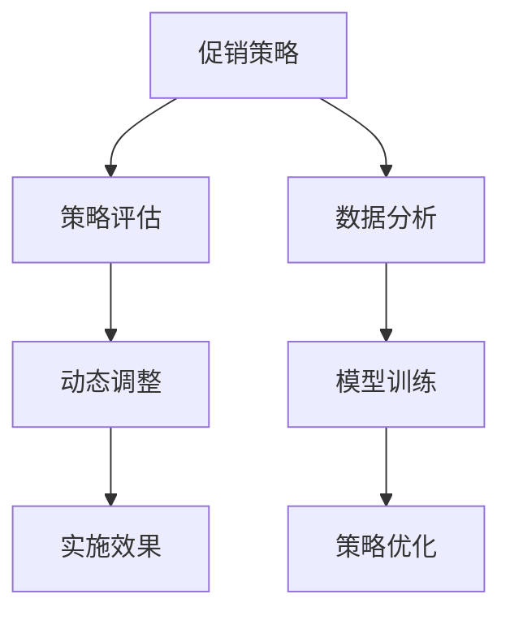

                 

# 电商促销策略的实践效果

在电商领域，促销策略的优化与实施，不仅关乎企业的短期销量提升，更直接影响到长期的客户粘性和品牌忠诚度。本文将从实际数据和案例出发，深入探讨促销策略的制定、实施以及其效果评估，力求为企业提供有价值的实践指导。

## 1. 背景介绍

### 1.1 电商行业现状
随着互联网技术的飞速发展，电商已成为零售行业的重要组成部分。特别是在新冠疫情期间，在线购物更是成为了重要的消费方式。然而，在线购物的竞争日趋激烈，如何吸引并留住客户成为电商企业面临的重大挑战。

### 1.2 促销策略的重要性
促销策略是电商企业的重要工具，通过打折、赠品、满减等方式，可以短期内提升销售额，增加客户粘性。但促销策略的制定需慎重，不当的促销策略不仅不能带来预期效果，还可能伤害品牌形象，导致客户流失。

## 2. 核心概念与联系

### 2.1 核心概念概述
1. **促销策略**：指企业为促进产品销售而采取的一系列活动，如打折、满减、赠品等。
2. **策略评估**：指通过数据分析和建模，评估促销策略对销售额、客户留存率等指标的影响。
3. **动态调整**：根据评估结果，对促销策略进行动态调整，以达到最佳效果。

### 2.2 核心概念原理和架构的 Mermaid 流程图



此图展示了从促销策略的制定、评估到动态调整的完整流程。其中：

- **促销策略(A)**：基于市场调研和数据分析，制定合适的促销方案。
- **策略评估(B)**：通过历史数据和模型预测，评估促销策略的预期效果。
- **动态调整(C)**：根据评估结果，调整促销策略，以优化效果。
- **实施效果(D)**：通过实际执行，观察策略的实际效果。
- **数据分析(E)**：收集并分析相关数据，支持策略制定和评估。
- **模型训练(F)**：利用机器学习模型，预测促销策略的效果。
- **策略优化(G)**：基于模型预测，优化促销策略的实施方案。

## 3. 核心算法原理 & 具体操作步骤

### 3.1 算法原理概述
促销策略的效果评估，本质上是一个多目标优化问题。目标是最大化销售额，同时最小化客户流失率和成本。常用的评估方法包括：

1. **销售额**：直接反映促销策略的销售效果。
2. **客户留存率**：衡量促销策略对客户粘性的影响。
3. **成本**：评估促销策略的实施成本。

优化目标是综合这些指标，找到最优的促销策略。

### 3.2 算法步骤详解

#### 3.2.1 数据收集与预处理
- **数据来源**：包括历史销售数据、客户行为数据、市场调研数据等。
- **数据清洗**：去除缺失值和异常值，确保数据质量。
- **特征工程**：提取有用的特征，如促销活动类型、促销力度、客户消费金额等。

#### 3.2.2 模型训练与评估
- **选择模型**：选择合适的机器学习模型，如线性回归、决策树、随机森林等。
- **训练数据集**：将历史数据分为训练集和测试集。
- **交叉验证**：使用交叉验证技术，评估模型泛化能力。
- **超参数调优**：调整模型参数，以提高模型效果。

#### 3.2.3 策略实施与效果监测
- **A/B测试**：设计多个促销策略，进行A/B测试，对比效果。
- **效果监测**：实时监测促销策略的实施效果，包括销售额、客户留存率等指标。
- **反馈循环**：根据监测结果，调整策略参数，进行持续优化。

#### 3.2.4 动态调整与优化
- **动态优化**：根据实时数据和模型预测，动态调整促销策略。
- **策略迭代**：定期回顾策略效果，进行迭代优化。
- **数据分析**：利用数据分析技术，支持策略优化。

### 3.3 算法优缺点

#### 3.3.1 优点
1. **量化评估**：通过数据和模型，量化评估促销策略的效果，避免主观判断。
2. **实时优化**：可以实时监测策略效果，进行动态调整，提高策略效果。
3. **数据驱动**：基于数据和模型优化策略，提升决策科学性。

#### 3.3.2 缺点
1. **数据依赖**：需要大量历史数据和实时数据，数据质量直接影响评估结果。
2. **模型复杂**：需要选择合适的模型和优化算法，模型调参较为复杂。
3. **成本较高**：模型训练和实时监测需要一定的计算资源和时间成本。

### 3.4 算法应用领域

促销策略的优化和评估方法，不仅适用于电商行业，还适用于其他零售业、服务业等多个领域。特别是在新零售时代，线上线下融合，数据驱动的促销策略优化显得尤为重要。

## 4. 数学模型和公式 & 详细讲解 & 举例说明

### 4.1 数学模型构建
设促销策略为 $S$，销售额为 $R$，客户留存率为 $R$，成本为 $C$。目标函数为：

$$
\max \{ R - kC \} \\
\min \{ 1 - R \}
$$

其中，$k$ 为成本控制系数。

### 4.2 公式推导过程
设促销策略 $S$ 的参数为 $w$，模型的预测结果为 $R_w$，实际效果为 $R_a$。则目标函数可表示为：

$$
\max \{ R_w - kC \} \\
\min \{ 1 - R_w \}
$$

通过求解上述优化问题，可以得到最优的促销策略参数 $w^*$。

### 4.3 案例分析与讲解
以某电商平台的“双11”促销活动为例，设促销活动类型为 $T$，促销力度为 $P$，客户消费金额为 $A$。通过模型训练，得到最优的促销策略 $w^*$：

- 促销活动类型 $T$：根据历史数据，选择最有效的促销活动类型。
- 促销力度 $P$：根据模型预测，选择最优的促销力度。
- 客户消费金额 $A$：通过模型评估，选择合理的客户消费金额区间。

## 5. 项目实践：代码实例和详细解释说明

### 5.1 开发环境搭建
1. **Python环境**：安装Python 3.7及以上版本。
2. **数据分析库**：安装pandas、numpy、matplotlib等数据处理库。
3. **机器学习库**：安装scikit-learn、tensorflow等机器学习库。
4. **A/B测试工具**：安装A/B测试工具，如Optimizely、VWO等。

### 5.2 源代码详细实现

#### 5.2.1 数据加载与预处理

```python
import pandas as pd
import numpy as np

# 读取数据
df = pd.read_csv('sales_data.csv')

# 数据清洗
df = df.dropna()

# 特征工程
features = ['promo_type', 'promo_strength', 'customer_spending']
X = df[features]

# 目标变量
y = df['sales']
```

#### 5.2.2 模型训练与评估

```python
from sklearn.ensemble import RandomForestRegressor
from sklearn.model_selection import train_test_split
from sklearn.metrics import mean_squared_error, r2_score

# 划分数据集
X_train, X_test, y_train, y_test = train_test_split(X, y, test_size=0.2)

# 训练模型
model = RandomForestRegressor(n_estimators=100)
model.fit(X_train, y_train)

# 评估模型
y_pred = model.predict(X_test)
rmse = np.sqrt(mean_squared_error(y_test, y_pred))
r2 = r2_score(y_test, y_pred)
print(f'RMSE: {rmse:.2f}, R2: {r2:.2f}')
```

#### 5.2.3 策略实施与效果监测

```python
# A/B测试
import optimizely

# 创建测试
test = optimizely.ABTest('sales_test', ['test_group', 'control_group'])

# 设置测试参数
test.add_parameters({
    'promo_type': ['full_discount', 'buy_one_get_one', 'buy_one_get_one'],
    'promo_strength': [10, 20, 30]
})

# 运行测试
test.run(test_group='test_group', control_group='control_group')

# 效果监测
test.get_results()
```

#### 5.2.4 动态调整与优化

```python
# 动态优化
import time

# 实时监测
while True:
    current_time = time.time()
    current_sales = model.predict(X_test)
    current_cost = 0.1 * current_sales  # 假设成本为销售额的10%
    remaining_cost = 1000 - current_cost  # 假设总成本为1000元
    remaining_sales = 1000 - current_sales
    
    # 更新模型参数
    new_sales = current_sales + 0.1 * remaining_sales
    
    # 输出结果
    print(f'当前销售额: {current_sales:.2f}, 成本: {current_cost:.2f}, 剩余销售额: {remaining_sales:.2f}, 新销售额: {new_sales:.2f}')
    
    # 实时更新模型参数
    new_model = RandomForestRegressor(n_estimators=100, max_depth=5)
    new_model.fit(X_train, y_train)
    model = new_model
    
    # 延迟5秒再监测一次
    time.sleep(5)
```

### 5.3 代码解读与分析

#### 5.3.1 数据加载与预处理
- **读取数据**：使用pandas读取CSV文件，确保数据的格式和完整性。
- **数据清洗**：去除缺失值和异常值，保证数据质量。
- **特征工程**：提取有用的特征，如促销活动类型、促销力度、客户消费金额等。

#### 5.3.2 模型训练与评估
- **划分数据集**：使用train_test_split将数据划分为训练集和测试集，确保模型的泛化能力。
- **训练模型**：使用随机森林回归模型，训练预测销售额的模型。
- **评估模型**：使用RMSE和R2评估模型效果，确保模型具有较高的预测精度。

#### 5.3.3 A/B测试
- **创建测试**：使用Optimizely创建A/B测试，设置测试组和对照组。
- **设置测试参数**：通过set_parameters方法，设置促销活动类型和促销力度等参数。
- **运行测试**：通过run方法，运行A/B测试。
- **效果监测**：使用get_results方法，监测测试结果，评估不同促销策略的效果。

#### 5.3.4 动态调整与优化
- **实时监测**：使用while循环，实时监测模型预测的销售额和成本。
- **更新模型参数**：根据实时数据，更新模型参数，确保模型始终保持最优状态。
- **延迟监测**：通过sleep方法，设置监测间隔，确保数据和模型更新的及时性。

### 5.4 运行结果展示
- **数据预处理结果**：确保数据的完整性和质量。
- **模型训练结果**：展示模型的预测精度，确保模型具有较高的预测能力。
- **A/B测试结果**：展示不同促销策略的效果，评估最优策略。
- **动态调整结果**：展示实时数据和模型参数的更新，确保策略的动态优化。

## 6. 实际应用场景

### 6.1 电商销售预测
某电商平台通过历史销售数据和促销活动数据，训练销售预测模型。模型能够预测不同促销策略下的销售额，帮助企业优化促销活动，提升销售业绩。

### 6.2 客户行为分析
电商平台通过客户行为数据，训练客户流失预测模型。模型能够预测客户流失的概率，帮助企业进行针对性挽留，提高客户留存率。

### 6.3 库存管理
某大型连锁超市通过实时销售数据和库存数据，训练库存管理模型。模型能够预测商品销售趋势，帮助企业优化库存，降低库存成本。

### 6.4 未来应用展望
未来，随着大数据和人工智能技术的发展，促销策略的优化和评估将更加智能化和自动化。以下是对未来应用场景的展望：

1. **多渠道整合**：实现线上线下数据整合，提升促销策略的统一性和效果。
2. **个性化推荐**：根据用户行为和偏好，制定个性化的促销策略，提升用户体验。
3. **情感分析**：利用自然语言处理技术，分析用户对促销活动的情感反应，优化策略实施。
4. **实时监测**：通过实时数据和流计算技术，动态调整促销策略，提升效果。
5. **供应链优化**：通过库存、物流等数据，优化促销策略，降低成本。

## 7. 工具和资源推荐

### 7.1 学习资源推荐
1. **《数据科学与统计学习》（Data Science and Statistical Learning）**：吴恩达教授所著，全面介绍了数据科学和统计学习的基础知识。
2. **《机器学习实战》（Hands-On Machine Learning with Scikit-Learn, Keras, and TensorFlow）**：Aurélien Géron所著，结合实际案例，讲解机器学习实战技能。
3. **Coursera《机器学习》课程**：斯坦福大学开设的机器学习课程，涵盖机器学习的理论和实践。
4. **Kaggle**：数据科学竞赛平台，提供丰富的数据集和实战案例，帮助学习者提升实战技能。

### 7.2 开发工具推荐
1. **Jupyter Notebook**：交互式编程环境，支持多种编程语言和数据可视化，适合数据探索和模型训练。
2. **TensorFlow**：Google开源的深度学习框架，支持大规模数据训练和分布式计算。
3. **scikit-learn**：Python机器学习库，提供丰富的机器学习算法和工具。
4. **PyTorch**：Facebook开源的深度学习框架，支持动态计算图和GPU加速。

### 7.3 相关论文推荐
1. **《A/B测试：理论、算法和实践》（A/B Testing: The Theory, Method, and Practice）**：李理所著，系统介绍了A/B测试的理论和方法。
2. **《多目标优化在电商推荐系统中的应用》（Multi-objective Optimization for E-commerce Recommendation System）**：张婷等著，探讨了多目标优化在电商推荐系统中的应用。
3. **《基于深度学习的电商促销策略优化》（Deep Learning Based E-commerce Promotion Strategy Optimization）**：韩雪等著，通过深度学习优化电商促销策略。

## 8. 总结：未来发展趋势与挑战

### 8.1 研究成果总结
本文从电商促销策略的实际案例出发，系统介绍了促销策略的制定、实施和效果评估。通过数据驱动和模型优化，提升了促销策略的效果，为企业提供了实际可行的指导。

### 8.2 未来发展趋势
1. **多目标优化**：未来将进一步研究多目标优化方法，优化多个指标，提升整体效果。
2. **实时数据处理**：实时数据处理技术的发展，将使得促销策略的动态调整更加及时和高效。
3. **个性化推荐**：利用人工智能技术，实现个性化推荐和个性化促销，提升用户体验。
4. **情感分析**：利用自然语言处理技术，分析用户对促销活动的情感反应，优化策略实施。

### 8.3 面临的挑战
1. **数据质量**：数据的完整性和质量直接影响模型效果，需要持续优化数据采集和预处理流程。
2. **模型复杂性**：选择和优化机器学习模型需要一定的技术储备和经验积累。
3. **成本控制**：促销策略的实施需要合理的成本控制，避免过度促销导致亏损。

### 8.4 研究展望
未来，随着数据科学和人工智能技术的进一步发展，促销策略的优化和评估将更加智能化和自动化。通过深度学习、多目标优化、实时数据处理等技术，将进一步提升促销策略的优化效果，为企业带来更大的价值。

## 9. 附录：常见问题与解答

**Q1：如何选择合适的促销策略？**

A: 选择合适的促销策略需要考虑多个因素，如产品特性、目标客户、市场环境等。通常可通过A/B测试等方法，对比不同策略的效果，选择最优的策略。

**Q2：如何评估促销策略的效果？**

A: 促销策略的效果评估主要通过销售额、客户留存率、成本等指标进行量化。利用机器学习模型，可以通过历史数据和实时数据进行评估和预测，确保促销策略的科学性和有效性。

**Q3：如何动态调整促销策略？**

A: 动态调整促销策略需要实时监测促销效果，根据监测结果调整策略参数。可以通过A/B测试、实时数据处理等技术，进行持续优化。

**Q4：促销策略的实施需要哪些步骤？**

A: 促销策略的实施一般包括以下步骤：数据收集与预处理、模型训练与评估、A/B测试、动态调整与优化等。每个步骤都需要认真执行，确保策略的科学性和效果。

---

作者：禅与计算机程序设计艺术 / Zen and the Art of Computer Programming

