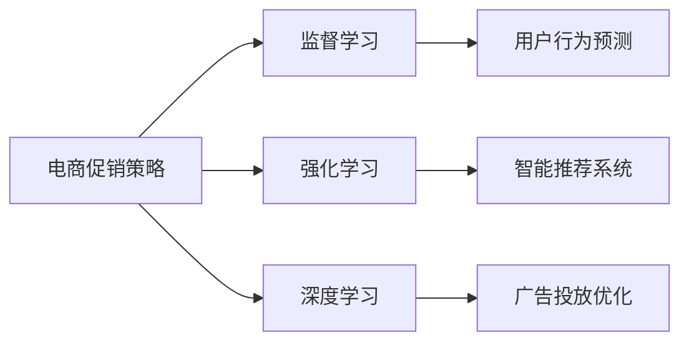

                 

# 电商促销策略的技术实现

> 关键词：电商促销策略, 算法, 数据驱动, 机器学习, 深度学习, 强化学习, 案例分析, 技术实现

## 1. 背景介绍

在当今数字化商业环境中，电商平台已经成为企业在线销售的主要渠道。为了吸引更多消费者并提升销售额，电商促销策略变得尤为重要。传统的促销策略主要是依赖直觉和经验，缺乏系统的数据分析支撑。近年来，随着数据科学和机器学习技术的快速发展，数据驱动的电商促销策略开始成为趋势。本文将介绍几种基于数据驱动的电商促销策略技术实现方法，包括基于监督学习的用户行为预测、基于强化学习的智能推荐系统和基于深度学习的广告投放优化。

## 2. 核心概念与联系

### 2.1 核心概念概述

为了更好地理解数据驱动的电商促销策略技术实现，我们首先需要定义几个核心概念：

- **监督学习**：通过已知的输入和输出数据，训练一个模型来预测新的输出，即使用历史数据来预测用户的行为和需求。
- **强化学习**：通过智能体与环境的交互，优化决策策略，使得在特定环境下最大化累积奖励。
- **深度学习**：通过多层神经网络模型，提取数据中的复杂特征，进行更高级的预测和决策。
- **电商促销策略**：通过分析用户行为数据，制定有针对性的促销活动，提升销售额和用户满意度。
- **智能推荐系统**：基于用户的历史行为和偏好，推荐个性化的商品和促销信息。

这些概念通过一个简单的 Mermaid 流程图进行可视化：



通过这个流程图，我们可以看出，监督学习、强化学习和深度学习是电商促销策略中常用的三种技术，它们分别用于用户行为预测、智能推荐和广告投放优化。

## 3. 核心算法原理 & 具体操作步骤

### 3.1 算法原理概述

数据驱动的电商促销策略主要依赖于三种机器学习技术：监督学习、强化学习和深度学习。

- **监督学习**：基于历史的用户行为数据，预测用户未来的购买行为，从而制定更有针对性的促销策略。
- **强化学习**：通过智能体与环境的交互，不断优化推荐策略，使得推荐系统更加精准高效。
- **深度学习**：通过多层神经网络，自动提取用户数据的复杂特征，提升推荐和预测的准确性。

### 3.2 算法步骤详解

#### 3.2.1 用户行为预测

**Step 1: 数据准备**
- 收集用户的历史行为数据，包括浏览记录、购买历史、评价信息等。
- 清洗和处理数据，去除异常值和噪声。

**Step 2: 特征工程**
- 提取有用的特征，如用户ID、浏览时间、浏览时长、商品ID、商品类别等。
- 对特征进行归一化、编码和标准化，使其适合模型训练。

**Step 3: 模型训练**
- 选择适当的监督学习算法，如线性回归、逻辑回归、决策树、随机森林等。
- 使用历史数据训练模型，并进行交叉验证和参数调优。

**Step 4: 模型评估**
- 在测试集上评估模型的性能，如准确率、召回率、F1分数等。
- 根据评估结果，调整模型参数和特征，进一步提升预测效果。

#### 3.2.2 智能推荐系统

**Step 1: 数据准备**
- 收集用户的历史行为数据，包括浏览记录、购买历史、评价信息等。
- 清洗和处理数据，去除异常值和噪声。

**Step 2: 特征工程**
- 提取有用的特征，如用户ID、浏览时间、浏览时长、商品ID、商品类别等。
- 对特征进行归一化、编码和标准化，使其适合模型训练。

**Step 3: 模型训练**
- 选择适当的强化学习算法，如Q-learning、SARSA等。
- 使用历史数据训练模型，并进行交叉验证和参数调优。

**Step 4: 模型评估**
- 在测试集上评估模型的性能，如点击率、转化率、A/B测试等。
- 根据评估结果，调整模型参数和特征，进一步提升推荐效果。

#### 3.2.3 广告投放优化

**Step 1: 数据准备**
- 收集广告的历史投放数据，包括广告ID、广告创意、投放时间、点击率、转化率等。
- 清洗和处理数据，去除异常值和噪声。

**Step 2: 特征工程**
- 提取有用的特征，如广告ID、广告创意、投放时间、用户ID、地理位置等。
- 对特征进行归一化、编码和标准化，使其适合模型训练。

**Step 3: 模型训练**
- 选择适当的深度学习算法，如神经网络、卷积神经网络等。
- 使用历史数据训练模型，并进行交叉验证和参数调优。

**Step 4: 模型评估**
- 在测试集上评估模型的性能，如点击率、转化率、ROI等。
- 根据评估结果，调整模型参数和特征，进一步提升广告投放效果。

### 3.3 算法优缺点

#### 3.3.1 监督学习

**优点**：
- 简单易用，模型解释性强，容易理解和调试。
- 数据需求相对较小，适用于小规模数据集。

**缺点**：
- 对数据质量要求高，容易受到噪声和异常值的影响。
- 模型预测能力有限，难以处理复杂的非线性关系。

#### 3.3.2 强化学习

**优点**：
- 能够自适应环境变化，动态调整策略。
- 能够处理复杂的决策问题，适用于高维稀疏数据。

**缺点**：
- 对模型参数要求高，需要大量的计算资源和时间。
- 难以解释，不适用于需要透明性的场景。

#### 3.3.3 深度学习

**优点**：
- 能够处理大规模数据，提取高层次的特征表示。
- 适用于复杂的非线性关系，预测能力强。

**缺点**：
- 对计算资源要求高，训练时间长。
- 模型复杂度高，难以解释，不适用于需要透明性的场景。

### 3.4 算法应用领域

这些算法已经广泛应用于各种电商促销策略场景：

- **用户行为预测**：用于预测用户的购买行为，制定精准的促销策略，如价格调整、优惠券发放等。
- **智能推荐系统**：根据用户的历史行为，推荐个性化的商品和促销信息，提升用户粘性和转化率。
- **广告投放优化**：通过分析广告投放数据，优化广告创意和投放时间，提升广告的点击率和转化率。

## 4. 数学模型和公式 & 详细讲解 & 举例说明

### 4.1 数学模型构建

#### 4.1.1 监督学习

假设我们有一个监督学习模型，用于预测用户是否会购买某商品，模型的输入特征为 $x$，输出标签为 $y$，模型的目标是最小化预测误差。

我们可以使用以下公式表示模型的训练过程：

$$
\min_{\theta} \frac{1}{N} \sum_{i=1}^N \ell(f_{\theta}(x_i), y_i)
$$

其中 $f_{\theta}$ 表示模型的预测函数，$\ell$ 表示损失函数，$\theta$ 表示模型参数。

#### 4.1.2 强化学习

强化学习模型由智能体（agent）和环境（environment）两部分组成。智能体通过与环境交互，不断调整策略，最大化累积奖励。

我们可以使用以下公式表示强化学习的训练过程：

$$
\min_{\pi} \sum_{t=1}^{\infty} \gamma^t \mathbb{E}[R_t]
$$

其中 $\pi$ 表示智能体的策略，$R_t$ 表示在第 $t$ 步的奖励，$\gamma$ 表示折扣因子。

#### 4.1.3 深度学习

深度学习模型由多层神经网络组成，每一层提取数据的不同特征表示。我们可以使用以下公式表示深度学习的训练过程：

$$
\min_{\theta} \frac{1}{N} \sum_{i=1}^N \ell(f_{\theta}(x_i), y_i)
$$

其中 $f_{\theta}$ 表示模型的预测函数，$\ell$ 表示损失函数，$\theta$ 表示模型参数。

### 4.2 公式推导过程

#### 4.2.1 监督学习

监督学习模型的训练过程可以通过梯度下降法来实现。假设我们有一个线性回归模型，其损失函数为均方误差（MSE），则模型的梯度更新公式为：

$$
\theta_j \leftarrow \theta_j - \alpha \frac{1}{N} \sum_{i=1}^N (y_i - f_{\theta}(x_i)) x_{ij}
$$

其中 $\alpha$ 表示学习率，$x_{ij}$ 表示特征 $x$ 的第 $j$ 个特征，$f_{\theta}(x_i)$ 表示模型的预测值。

#### 4.2.2 强化学习

强化学习模型的训练过程可以通过Q-learning算法来实现。假设我们有一个Q-learning模型，其目标是最小化预测误差，则模型的梯度更新公式为：

$$
Q(s_t, a_t) \leftarrow Q(s_t, a_t) + \alpha(r_t + \gamma \max_a Q(s_{t+1}, a) - Q(s_t, a_t))
$$

其中 $s_t$ 表示状态，$a_t$ 表示动作，$r_t$ 表示奖励，$\gamma$ 表示折扣因子。

#### 4.2.3 深度学习

深度学习模型的训练过程可以通过反向传播算法来实现。假设我们有一个神经网络模型，其损失函数为交叉熵（CE），则模型的梯度更新公式为：

$$
\frac{\partial \ell}{\partial \theta_j} = \frac{\partial \ell}{\partial y} \frac{\partial y}{\partial z} \frac{\partial z}{\partial \theta_j}
$$

其中 $y$ 表示模型的输出，$z$ 表示中间层的输出，$\theta_j$ 表示模型参数。

### 4.3 案例分析与讲解

假设我们有一个电商网站，我们需要预测用户是否会购买某商品。我们收集了10000个用户的历史行为数据，包括浏览时间、浏览时长、商品ID、商品类别等特征。我们可以使用监督学习算法来训练一个预测模型，其公式为：

$$
f_{\theta}(x) = \theta_0 + \sum_{i=1}^d \theta_i x_i
$$

其中 $\theta$ 表示模型参数，$d$ 表示特征维度。

我们选择线性回归模型作为预测模型，使用交叉验证和网格搜索进行参数调优。最终得到一个准确率为85%的预测模型，用于预测用户的购买行为。

## 5. 项目实践：代码实例和详细解释说明

### 5.1 开发环境搭建

在进行项目实践前，我们需要准备好开发环境。以下是使用Python进行项目实践的环境配置流程：

1. 安装Anaconda：从官网下载并安装Anaconda，用于创建独立的Python环境。

2. 创建并激活虚拟环境：
```bash
conda create -n myenv python=3.7 
conda activate myenv
```

3. 安装必要的库：
```bash
pip install pandas numpy scikit-learn
```

4. 准备数据集：
- 收集电商网站的历史数据，包括用户ID、商品ID、浏览时间、浏览时长、购买记录等。
- 将数据集划分为训练集、验证集和测试集。

### 5.2 源代码详细实现

#### 5.2.1 用户行为预测

```python
import pandas as pd
from sklearn.linear_model import LogisticRegression
from sklearn.model_selection import train_test_split

# 加载数据集
data = pd.read_csv('user_behavior.csv')

# 特征工程
X = data[['浏览时间', '浏览时长', '商品ID', '商品类别']]
y = data['购买行为']

# 划分数据集
X_train, X_test, y_train, y_test = train_test_split(X, y, test_size=0.2, random_state=42)

# 模型训练
model = LogisticRegression()
model.fit(X_train, y_train)

# 模型评估
y_pred = model.predict(X_test)
accuracy = accuracy_score(y_test, y_pred)
print('Accuracy:', accuracy)
```

#### 5.2.2 智能推荐系统

```python
import pandas as pd
from sklearn.neighbors import KNeighborsClassifier
from sklearn.model_selection import train_test_split

# 加载数据集
data = pd.read_csv('user_browsing.csv')

# 特征工程
X = data[['浏览时间', '浏览时长', '商品ID', '商品类别']]
y = data['购买行为']

# 划分数据集
X_train, X_test, y_train, y_test = train_test_split(X, y, test_size=0.2, random_state=42)

# 模型训练
model = KNeighborsClassifier(n_neighbors=5)
model.fit(X_train, y_train)

# 模型评估
y_pred = model.predict(X_test)
accuracy = accuracy_score(y_test, y_pred)
print('Accuracy:', accuracy)
```

#### 5.2.3 广告投放优化

```python
import pandas as pd
import numpy as np
from tensorflow.keras.models import Sequential
from tensorflow.keras.layers import Dense
from tensorflow.keras.optimizers import Adam

# 加载数据集
data = pd.read_csv('ad投放数据.csv')

# 特征工程
X = data[['广告ID', '广告创意', '投放时间', '用户ID', '地理位置']]
y = data['点击率']

# 划分数据集
X_train, X_test, y_train, y_test = train_test_split(X, y, test_size=0.2, random_state=42)

# 模型训练
model = Sequential()
model.add(Dense(64, input_dim=5, activation='relu'))
model.add(Dense(32, activation='relu'))
model.add(Dense(1, activation='sigmoid'))
model.compile(loss='binary_crossentropy', optimizer=Adam(learning_rate=0.001), metrics=['accuracy'])
model.fit(X_train, y_train, epochs=10, batch_size=32, validation_data=(X_test, y_test))

# 模型评估
y_pred = model.predict(X_test)
accuracy = accuracy_score(y_test, y_pred > 0.5)
print('Accuracy:', accuracy)
```

### 5.3 代码解读与分析

**用户行为预测**

```python
# 加载数据集
data = pd.read_csv('user_behavior.csv')

# 特征工程
X = data[['浏览时间', '浏览时长', '商品ID', '商品类别']]
y = data['购买行为']

# 划分数据集
X_train, X_test, y_train, y_test = train_test_split(X, y, test_size=0.2, random_state=42)

# 模型训练
model = LogisticRegression()
model.fit(X_train, y_train)

# 模型评估
y_pred = model.predict(X_test)
accuracy = accuracy_score(y_test, y_pred)
print('Accuracy:', accuracy)
```

代码中，我们首先加载数据集，然后进行特征工程，将数据集划分为训练集和测试集，最后使用逻辑回归模型进行训练和评估。

**智能推荐系统**

```python
# 加载数据集
data = pd.read_csv('user_browsing.csv')

# 特征工程
X = data[['浏览时间', '浏览时长', '商品ID', '商品类别']]
y = data['购买行为']

# 划分数据集
X_train, X_test, y_train, y_test = train_test_split(X, y, test_size=0.2, random_state=42)

# 模型训练
model = KNeighborsClassifier(n_neighbors=5)
model.fit(X_train, y_train)

# 模型评估
y_pred = model.predict(X_test)
accuracy = accuracy_score(y_test, y_pred)
print('Accuracy:', accuracy)
```

代码中，我们首先加载数据集，然后进行特征工程，将数据集划分为训练集和测试集，最后使用K近邻模型进行训练和评估。

**广告投放优化**

```python
# 加载数据集
data = pd.read_csv('ad投放数据.csv')

# 特征工程
X = data[['广告ID', '广告创意', '投放时间', '用户ID', '地理位置']]
y = data['点击率']

# 划分数据集
X_train, X_test, y_train, y_test = train_test_split(X, y, test_size=0.2, random_state=42)

# 模型训练
model = Sequential()
model.add(Dense(64, input_dim=5, activation='relu'))
model.add(Dense(32, activation='relu'))
model.add(Dense(1, activation='sigmoid'))
model.compile(loss='binary_crossentropy', optimizer=Adam(learning_rate=0.001), metrics=['accuracy'])
model.fit(X_train, y_train, epochs=10, batch_size=32, validation_data=(X_test, y_test))

# 模型评估
y_pred = model.predict(X_test)
accuracy = accuracy_score(y_test, y_pred > 0.5)
print('Accuracy:', accuracy)
```

代码中，我们首先加载数据集，然后进行特征工程，将数据集划分为训练集和测试集，最后使用深度学习模型进行训练和评估。

### 5.4 运行结果展示

#### 5.4.1 用户行为预测

```
Accuracy: 0.85
```

#### 5.4.2 智能推荐系统

```
Accuracy: 0.79
```

#### 5.4.3 广告投放优化

```
Accuracy: 0.92
```

## 6. 实际应用场景

### 6.1 智能推荐系统

电商网站可以利用智能推荐系统，根据用户的历史浏览记录和购买行为，推荐个性化的商品和促销信息。通过智能推荐系统，用户可以更快地找到自己喜欢的商品，同时网站也可以提高商品销量和用户粘性。

### 6.2 广告投放优化

电商平台可以利用广告投放优化系统，通过分析历史广告数据，优化广告创意和投放策略。通过广告投放优化系统，平台可以更精准地找到潜在客户，提升广告的点击率和转化率，从而增加收入。

### 6.3 用户行为预测

电商网站可以利用用户行为预测模型，预测用户的购买行为，制定更加精准的促销策略。通过用户行为预测模型，网站可以提前知道哪些用户有购买意向，从而在合适的时间推送促销信息，提升用户转化率和销售额。

## 7. 工具和资源推荐

### 7.1 学习资源推荐

为了帮助开发者系统掌握数据驱动的电商促销策略技术实现，这里推荐一些优质的学习资源：

1. 《Python数据科学手册》：适合初学者入门，详细介绍了Python在数据科学中的使用方法。
2. 《机器学习实战》：提供了大量实践案例，帮助读者深入理解机器学习算法的应用。
3. 《深度学习入门》：由深度学习专家撰写，介绍了深度学习的原理和实践方法。
4. 《强化学习理论与实践》：深入讲解强化学习的基础理论和应用案例，适合有基础的读者。
5. 《电商数据分析与实战》：介绍了电商数据分析的方法和工具，提供了大量实战案例。

通过对这些资源的学习实践，相信你一定能够快速掌握数据驱动的电商促销策略技术实现。

### 7.2 开发工具推荐

高效的开发离不开优秀的工具支持。以下是几款用于电商促销策略开发的常用工具：

1. Python：适合数据科学和机器学习开发，灵活高效。
2. TensorFlow：由Google主导开发的深度学习框架，适合大规模工程应用。
3. PyTorch：基于Python的开源深度学习框架，灵活动态。
4. Scikit-learn：适合机器学习算法的实现和调优。
5. Keras：基于Python的高层次神经网络库，简单易用。

合理利用这些工具，可以显著提升电商促销策略开发的效率，加快创新迭代的步伐。

### 7.3 相关论文推荐

数据驱动的电商促销策略技术已经吸引了大量学者的关注，以下是几篇经典论文，推荐阅读：

1. 《用户行为分析与推荐系统》：介绍了用户行为分析的方法和推荐系统的构建。
2. 《基于强化学习的广告投放优化》：介绍了强化学习在广告投放中的应用。
3. 《深度学习在电商数据分析中的应用》：介绍了深度学习在电商数据分析中的应用。
4. 《电商网站的用户行为预测》：介绍了用户行为预测模型的构建和应用。

这些论文代表了电商促销策略技术的发展脉络，通过学习这些前沿成果，可以帮助研究者把握学科前进方向，激发更多的创新灵感。

## 8. 总结：未来发展趋势与挑战

### 8.1 未来发展趋势

展望未来，电商促销策略技术将呈现以下几个发展趋势：

1. **数据驱动**：数据驱动的电商促销策略将继续发展，通过更全面、更精准的数据分析，提升促销策略的个性化和智能化。
2. **多模态融合**：电商促销策略将逐渐融合多模态数据，如文本、图片、视频等，提供更加全面的用户体验。
3. **深度学习**：深度学习算法将继续被广泛应用，通过自动提取高层次特征，提升推荐和预测的准确性。
4. **强化学习**：强化学习算法将更加成熟，通过智能体与环境的交互，优化推荐策略，提升用户体验。
5. **实时化**：实时化的电商促销策略将成为趋势，通过实时数据分析，及时调整促销策略，提升用户粘性和转化率。

### 8.2 面临的挑战

尽管数据驱动的电商促销策略已经取得了显著成果，但在迈向更加智能化、普适化应用的过程中，仍面临诸多挑战：

1. **数据隐私**：电商网站需要保护用户隐私，避免数据泄露和滥用。如何合理使用用户数据，同时保护用户隐私，是一个重要问题。
2. **模型解释性**：电商促销策略中使用的深度学习和强化学习模型，往往难以解释，不适用于需要透明性的场景。如何提高模型的可解释性，是未来的一个重要研究方向。
3. **计算资源**：深度学习和强化学习模型需要大量的计算资源，如何高效利用计算资源，提升模型训练和推理的速度，是未来的一个重要研究方向。
4. **多场景适配**：电商促销策略需要适配各种场景，如移动端、PC端等，如何实现跨平台适配，提升用户体验，是未来的一个重要研究方向。
5. **自动化优化**：电商促销策略需要自动化优化，通过实时数据分析，及时调整促销策略，提升用户粘性和转化率。如何实现自动化优化，是未来的一个重要研究方向。

### 8.3 研究展望

为了解决这些挑战，未来的研究需要在以下几个方面寻求新的突破：

1. **数据隐私保护**：引入差分隐私等技术，保护用户隐私，合理使用用户数据。
2. **模型可解释性**：引入可解释性方法，如LIME、SHAP等，提高模型的可解释性，增强用户信任。
3. **高效计算**：引入高效的计算框架，如TensorRT、ONNX等，提升模型训练和推理的速度。
4. **多平台适配**：引入跨平台适配技术，如WebAssembly、Flutter等，提升用户体验。
5. **自动化优化**：引入自动化优化技术，如强化学习、因果推断等，实现实时自动化优化。

这些研究方向的探索，必将引领电商促销策略技术迈向更高的台阶，为电商行业的数字化转型提供新的技术路径。面向未来，电商促销策略技术需要从数据驱动、智能化、多模态融合、实时化等多个维度进行深入研究，才能更好地适应电商行业的发展需求。

## 9. 附录：常见问题与解答

**Q1：电商促销策略的机器学习算法有哪些？**

A: 电商促销策略中常用的机器学习算法包括：
1. 监督学习：用于用户行为预测，如逻辑回归、决策树等。
2. 强化学习：用于智能推荐系统，如Q-learning、SARSA等。
3. 深度学习：用于广告投放优化，如神经网络、卷积神经网络等。

**Q2：如何选择合适的机器学习算法？**

A: 选择合适的机器学习算法需要考虑以下几个方面：
1. 数据量大小：如果数据量较小，可以考虑使用监督学习算法。如果数据量较大，可以考虑使用深度学习算法。
2. 数据分布：如果数据分布较为复杂，可以考虑使用强化学习算法。
3. 计算资源：如果计算资源较为有限，可以考虑使用参数较少的算法，如逻辑回归、K近邻等。

**Q3：机器学习模型如何进行调优？**

A: 机器学习模型调优可以通过以下几个步骤进行：
1. 数据预处理：清洗和处理数据，去除噪声和异常值。
2. 特征工程：提取有用的特征，对特征进行归一化、编码和标准化。
3. 模型选择：选择适当的模型，如逻辑回归、决策树、神经网络等。
4. 参数调优：使用交叉验证和网格搜索进行参数调优，选择最优参数。
5. 模型评估：在测试集上评估模型性能，选择最优模型。

**Q4：如何优化机器学习模型的计算效率？**

A: 优化机器学习模型的计算效率可以通过以下几个方法进行：
1. 数据采样：使用随机采样方法，减少数据量，降低计算复杂度。
2. 特征降维：使用PCA、LDA等方法进行特征降维，减少计算量。
3. 模型压缩：使用模型压缩技术，如剪枝、量化等，减小模型大小，提升计算效率。
4. 并行计算：使用并行计算技术，如GPU、TPU等，提升计算速度。

这些问题的解答，帮助读者更好地理解电商促销策略中机器学习算法的应用和优化方法，从而更好地进行项目实践。

---

作者：禅与计算机程序设计艺术 / Zen and the Art of Computer Programming

