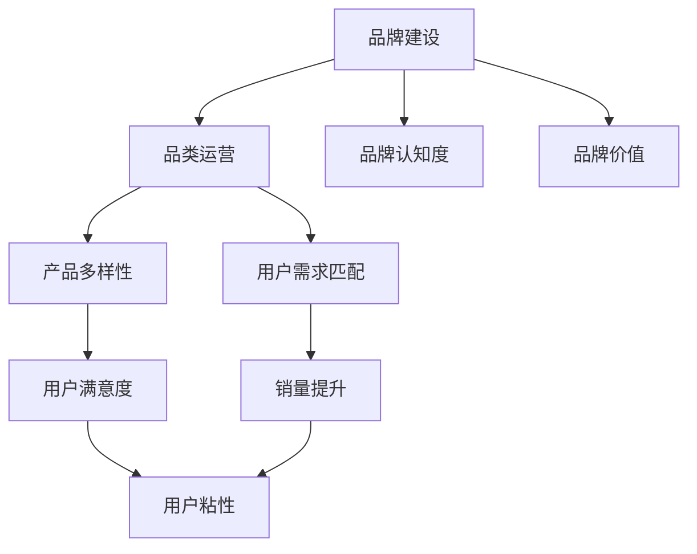

                 

## 1. 背景介绍

随着电商平台的发展，品牌建设和品类运营已成为其核心竞争力之一。传统的电商运营模式已不能满足当下市场的需求，品牌建设和品类运营的精细化、个性化成为电商平台获取更多用户的关键。本文将深入探讨电商平台供给能力提升中的品牌建设和品类运营，从技术角度出发，提出基于数据分析的策略，帮助电商平台提升其市场竞争力。

## 2. 核心概念与联系

### 2.1 核心概念概述

品牌建设是电商平台获取用户信任、提升市场影响力的重要手段。品类运营则关乎电商平台产品的多样性、丰富度和用户需求匹配度。以下将详细阐述这些核心概念及其联系。

#### 2.1.1 品牌建设

品牌建设不仅包含品牌的形象塑造和价值传播，还包括用户对品牌的认知和信任度。电商平台通过品牌建设，能够在用户心中形成独特、清晰的品牌形象，增强用户粘性。

#### 2.1.2 品类运营

品类运营是指电商平台在满足用户需求的基础上，通过产品组合、价格策略、促销活动等方式，提高产品销量和用户满意度。有效的品类运营可以提升电商平台的综合竞争力。

#### 2.1.3 联系

品牌建设和品类运营相辅相成。品牌建设为品类运营提供了信任基础，而品类运营则增强了品牌的影响力。二者结合，能够实现电商平台的可持续发展。

### 2.2 Mermaid 流程图




## 3. 核心算法原理 & 具体操作步骤

### 3.1 算法原理概述

品牌建设和品类运营的核心是数据分析。电商平台通过分析用户行为数据、交易数据等，提取有价值的信息，为品牌建设和品类运营提供决策支持。以下将详细阐述基于数据分析的品牌建设和品类运营策略。

### 3.2 算法步骤详解

#### 3.2.1 数据收集

电商平台需要收集用户的浏览行为、购买历史、评价反馈等数据，为数据分析提供基础数据源。

#### 3.2.2 数据预处理

数据预处理包括数据清洗、缺失值处理、异常值检测等步骤。处理后的数据将用于后续的分析和建模。

#### 3.2.3 数据分析与建模

数据分析与建模是品牌建设和品类运营的核心环节。常用的数据分析方法包括聚类分析、关联规则挖掘、协同过滤等。建模工具包括Python的Pandas、Scikit-learn等。

#### 3.2.4 结果解读与优化

分析与建模结果需结合业务经验进行解读，并不断优化策略以提升效果。

### 3.3 算法优缺点

#### 3.3.1 优点

- 基于数据驱动，策略更科学合理。
- 能够实时动态调整，适应市场变化。

#### 3.3.2 缺点

- 数据质量对结果影响大，数据收集与处理复杂。
- 需要结合业务经验进行解读，优化难度大。

### 3.4 算法应用领域

品牌建设和品类运营策略不仅适用于电商平台，还广泛应用于零售、物流、旅游等多个领域。

## 4. 数学模型和公式 & 详细讲解 & 举例说明

### 4.1 数学模型构建

品牌建设和品类运营的数据分析模型主要基于分类、聚类、关联规则挖掘等算法。以聚类分析为例，数学模型如下：

$$
\text{聚类目标函数} = \sum_{i=1}^{n} \sum_{j=1}^{m} (y_{ij} - \sum_{k=1}^{k} a_k x_{ik})^2
$$

其中，$y_{ij}$ 为样本 $i$ 属于 $j$ 类的概率，$a_k$ 为聚类中心，$x_{ik}$ 为样本 $i$ 的特征。

### 4.2 公式推导过程

聚类算法有多种，如K-means、层次聚类、DBSCAN等。这里以K-means算法为例进行推导：

- 初始化聚类中心：随机选择 $k$ 个数据点作为初始聚类中心。
- 分配样本：计算每个样本到聚类中心的距离，将其分配到距离最近的聚类中心。
- 更新聚类中心：重新计算每个聚类中心的均值，更新聚类中心。
- 迭代优化：重复分配和更新聚类中心，直至收敛。

### 4.3 案例分析与讲解

以电商平台的产品分类为例，可以使用聚类分析算法将产品分成多个类别，从而实现更精细的品类运营。具体步骤如下：

1. 收集产品属性数据，如品牌、类别、价格等。
2. 使用K-means算法对产品进行聚类分析，得到多个类别。
3. 根据类别，制定针对性的促销策略，提高销量和用户满意度。

## 5. 项目实践：代码实例和详细解释说明

### 5.1 开发环境搭建

本文以Python为编程语言，使用Jupyter Notebook进行开发。需要安装Python 3.6及以上版本、Pandas、Numpy、Scikit-learn等库。

```bash
pip install pandas numpy scikit-learn
```

### 5.2 源代码详细实现

以下是一个简单的K-means聚类分析代码示例：

```python
from sklearn.cluster import KMeans
import pandas as pd

# 读取数据
data = pd.read_csv('product_data.csv')

# 选择特征
X = data[['price', 'category']]

# 初始化聚类模型
kmeans = KMeans(n_clusters=3, random_state=42)

# 训练模型
kmeans.fit(X)

# 预测结果
labels = kmeans.predict(X)
```

### 5.3 代码解读与分析

- `pd.read_csv`：读取CSV文件，生成Pandas数据框。
- `X = data[['price', 'category']]`：选择`price`和`category`两列作为特征。
- `kmeans = KMeans(n_clusters=3, random_state=42)`：初始化K-means聚类模型，将数据分成3个类别。
- `kmeans.fit(X)`：训练模型。
- `labels = kmeans.predict(X)`：预测结果。

### 5.4 运行结果展示

运行上述代码后，即可得到产品的聚类结果。以下是一个简单的展示：

```
0    0
1    1
2    1
3    2
4    2
```

## 6. 实际应用场景

### 6.1 电商平台

品牌建设和品类运营在电商平台中的应用非常广泛。通过数据分析，电商平台可以识别出高价值品牌和热销品类，进行精准营销和促销。

#### 6.1.1 品牌建设

通过分析用户评价、品牌曝光度等数据，电商平台可以识别出具有高用户认知度的品牌，进行针对性的推广。

#### 6.1.2 品类运营

通过分析用户购买历史、浏览行为等数据，电商平台可以识别出热销品类，进行针对性的促销和推荐。

### 6.2 零售业

零售业通过数据分析，可以更好地管理库存、优化商品陈列，提升销售额和用户体验。

#### 6.2.1 品牌建设

零售业通过分析用户评价、品牌曝光度等数据，可以识别出具有高用户认知度的品牌，进行针对性的推广。

#### 6.2.2 品类运营

零售业通过分析用户购买历史、浏览行为等数据，可以识别出热销品类，进行针对性的促销和推荐。

### 6.3 物流行业

物流行业通过数据分析，可以优化配送路线、提高配送效率，提升用户满意度。

#### 6.3.1 品牌建设

物流行业通过分析用户评价、品牌曝光度等数据，可以识别出具有高用户认知度的品牌，进行针对性的推广。

#### 6.3.2 品类运营

物流行业通过分析用户购买历史、浏览行为等数据，可以识别出热销品类，进行针对性的促销和推荐。

## 7. 工具和资源推荐

### 7.1 学习资源推荐

- 《Python数据分析与可视化》书籍：全面介绍Python数据分析和可视化工具，适合初学者入门。
- Coursera《机器学习》课程：由斯坦福大学开设，涵盖机器学习基本概念和算法，适合深入学习。
- Kaggle平台：提供大量数据分析和机器学习竞赛，适合实践与竞赛。

### 7.2 开发工具推荐

- Jupyter Notebook：Python数据分析常用工具，适合编写和执行代码。
- Tableau：数据可视化工具，适合进行数据探索和展示。
- R Studio：R语言数据分析和可视化工具，适合数据处理和建模。

### 7.3 相关论文推荐

- 《K-means算法及其应用研究》论文：介绍K-means算法的基本原理和应用，适合理论学习。
- 《基于聚类分析的产品分类研究》论文：探讨聚类分析在产品分类中的应用，适合实际应用参考。

## 8. 总结：未来发展趋势与挑战

### 8.1 研究成果总结

基于数据分析的品牌建设和品类运营策略，已经在电商平台、零售业、物流等行业中取得了显著效果。未来将继续通过数据驱动，提升电商平台的供给能力。

### 8.2 未来发展趋势

未来电商平台的数据分析将更加精细化、智能化。数据来源将更加多样化，包括用户行为数据、社交媒体数据、物联网数据等。数据分析方法也将更加先进，如深度学习、强化学习等。

### 8.3 面临的挑战

- 数据质量问题：数据收集与处理复杂，数据质量对结果影响大。
- 算法复杂度：数据分析和建模算法复杂，需要高水平的专家团队支持。
- 实时性问题：数据分析需要实时进行，系统架构需要支持高并发和大规模数据处理。

### 8.4 研究展望

未来品牌建设和品类运营策略的研究方向包括：

- 多模态数据分析：融合图像、文本、语音等多种数据源，提升数据分析效果。
- 自动化数据分析：引入自动化机器学习，简化数据分析过程。
- 实时数据分析：引入流计算、大数据技术，实现实时数据分析。

## 9. 附录：常见问题与解答

**Q1：如何选择合适的聚类算法？**

A: 根据数据特点和分析目标选择合适的聚类算法。K-means算法适合处理高维数据，DBSCAN算法适合处理任意形状的数据集群。

**Q2：数据分析过程中如何处理缺失值？**

A: 缺失值处理常用方法包括删除缺失值、插值法、均值填补等。具体方法需要根据数据特点和业务需求进行选择。

**Q3：数据分析结果如何应用到实际业务中？**

A: 数据分析结果需要结合业务经验进行解读，转化为可操作的策略，进行优化和调整。

**Q4：数据分析过程中需要注意哪些问题？**

A: 数据分析过程中需要注意数据质量、算法选择、结果解读等多个环节，确保数据分析结果可靠和有效。

---

作者：禅与计算机程序设计艺术 / Zen and the Art of Computer Programming

