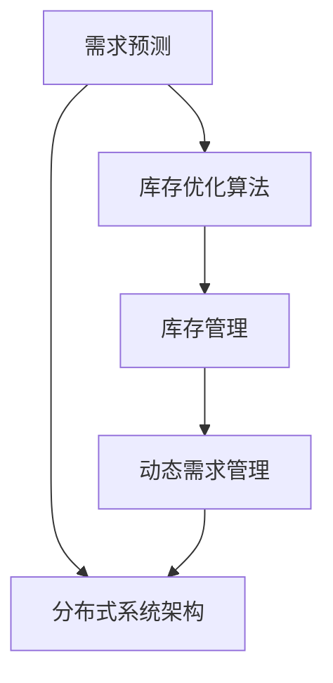

                 

# 电商平台供给能力提升：库存管理优化

> 关键词：电商平台, 库存管理, 优化算法, 供给能力, 系统架构

## 1. 背景介绍

### 1.1 问题由来
在现代社会，电商平台作为连接消费者和供应商的重要桥梁，其供给能力直接影响到用户体验和商家收益。然而，电商平台面对的市场竞争激烈、用户需求变化快速，如何高效、灵活地管理库存，成为电商平台运营的重中之重。传统库存管理方式往往基于经验或简单的需求预测模型，无法准确把握市场趋势，容易造成库存积压或缺货，影响用户体验。而利用现代优化算法，通过对库存管理过程进行模型化，可以大幅提升平台供给能力，减少库存成本，提升用户满意度。

### 1.2 问题核心关键点
本节将重点介绍库存管理优化算法，包括其原理和核心技术，并结合实际应用场景，探讨如何通过优化算法实现电商平台供给能力的提升。

### 1.3 问题研究意义
通过优化算法进行库存管理，可以带来以下几方面的显著改进：

1. **减少库存成本**：通过精细化的需求预测和库存分配，可以有效避免过量采购和库存积压，降低存储成本。
2. **提升用户体验**：优化后的库存管理系统可以及时响应用户需求，减少等待时间，提升用户满意度。
3. **增强市场竞争力**：准确预测市场需求，确保平台供需平衡，增强平台的市场竞争力。
4. **提升运营效率**：自动化库存管理过程，减少人工干预，提高运营效率和响应速度。

## 2. 核心概念与联系

### 2.1 核心概念概述

为了更好地理解库存管理优化的原理和实施方法，本节将介绍几个关键概念：

- **库存管理**：通过合理的存储、补货、出库等操作，确保商品在一定时期内能够满足市场需求，同时控制库存成本。
- **需求预测**：根据历史销售数据、市场趋势等因素，预测未来一段时间内的需求量。
- **库存优化算法**：利用数学和计算方法，对库存管理过程进行模型化，优化库存分配和补货策略，以实现最优的库存水平和运营效率。
- **动态需求管理**：根据实时市场情况，动态调整需求预测模型和库存策略，确保供需平衡。
- **分布式系统架构**：电商平台通常采用分布式架构，通过多节点协同，提升系统处理能力和可用性。

这些概念之间的逻辑关系可以通过以下Mermaid流程图来展示：



这个流程图展示了从需求预测到库存管理再到动态需求管理的流程，以及分布式系统架构在其中起到的作用。

## 3. 核心算法原理 & 具体操作步骤
### 3.1 算法原理概述

库存管理优化的核心原理是通过建立数学模型，对库存管理过程进行优化。常用的优化算法包括线性规划、整数规划、动态规划等，这些算法可以帮助我们找到最优的库存分配和补货策略，以达到减少库存成本、提升用户体验和增强市场竞争力的目的。

具体而言，库存优化算法主要分为以下几步：

1. **需求预测**：利用历史销售数据和市场趋势，建立预测模型，预测未来需求量。
2. **库存策略制定**：根据需求预测结果，制定库存分配和补货策略，包括库存水平、补货频率等。
3. **优化求解**：利用优化算法，求解最优的库存分配和补货方案，以最小化库存成本或最大化用户满意度。
4. **实时调整**：根据实际销售情况，动态调整预测模型和库存策略，确保供需平衡。

### 3.2 算法步骤详解

#### 3.2.1 需求预测

需求预测是库存管理优化的第一步，其准确性直接影响后续库存策略和优化求解的效果。需求预测模型可以基于历史销售数据、市场趋势、节假日等因素构建，常见的预测模型包括ARIMA、神经网络、支持向量机等。以下以ARIMA模型为例，介绍其构建过程：

1. **数据预处理**：对原始销售数据进行平稳化处理，如差分、对数变换等。
2. **模型选择**：选择合适的模型结构，如ARIMA(p,d,q)，其中p、d、q为模型的参数。
3. **参数估计**：利用历史数据，通过最小化均方误差，估计模型参数。
4. **预测验证**：利用验证集对模型进行评估，选择合适的模型参数和预测参数。

#### 3.2.2 库存策略制定

库存策略制定是库存管理优化的关键步骤，主要包括以下几个方面：

1. **库存水平设置**：根据预测需求，确定合理的库存水平，避免过量采购和库存积压。
2. **补货策略设计**：设计补货频率和数量，确保库存水平稳定。
3. **补货时间规划**：根据销售高峰期和低谷期，规划补货时间，避免高峰期库存短缺。

#### 3.2.3 优化求解

优化求解是库存管理优化的核心环节，主要通过建立数学模型，利用优化算法求解最优解。以下以线性规划为例，介绍其基本原理和求解步骤：

1. **问题建模**：将库存管理问题转化为线性规划问题，如最小化成本或最大化利润。
2. **约束条件设定**：根据库存约束、补货约束、需求约束等，设定优化问题的约束条件。
3. **优化求解**：利用优化算法求解线性规划问题，得到最优的库存分配和补货方案。

#### 3.2.4 实时调整

实时调整是库存管理优化的重要环节，主要通过实时监控销售情况，动态调整预测模型和库存策略，确保供需平衡。以下以动态规划为例，介绍其基本原理和求解步骤：

1. **状态定义**：定义系统状态，如当前库存、预测需求、补货计划等。
2. **转移方程设定**：根据状态变化规则，建立转移方程。
3. **求解最优策略**：利用动态规划算法，求解最优的库存策略，确保供需平衡。

### 3.3 算法优缺点

库存管理优化算法具有以下优点：

1. **精度高**：通过数学模型和优化算法，可以获得高精度的库存策略，有效降低库存成本。
2. **适应性强**：可以灵活调整预测模型和库存策略，适应不同市场情况。
3. **自动化程度高**：自动完成库存管理和优化，减少人工干预，提高运营效率。

同时，这些算法也存在一些局限性：

1. **模型复杂度高**：构建和求解复杂模型需要较高的计算资源和专业知识。
2. **数据需求高**：需要大量历史销售数据和市场趋势数据，数据获取成本较高。
3. **实时性要求高**：实时调整需求预测和库存策略，需要较高的系统响应速度和计算能力。

### 3.4 算法应用领域

库存管理优化算法可以广泛应用于电商平台、物流仓储、制造企业等多个领域。在电商平台中，库存管理优化可以提高供给能力，提升用户体验和市场竞争力。在物流仓储中，库存优化可以提高物流效率，降低仓储成本。在制造企业中，库存优化可以提高生产效率，减少库存积压。

## 4. 数学模型和公式 & 详细讲解 & 举例说明

### 4.1 数学模型构建

库存管理优化问题可以形式化为一个线性规划问题，目标函数为最小化成本，约束条件包括库存约束、补货约束和需求约束。以下以一个简单的例子，展示其构建过程：

设某电商平台有A、B、C三种商品，库存水平分别为x_A、x_B、x_C，补货成本分别为c_A、c_B、c_C，需求预测结果分别为d_A、d_B、d_C。假设需求预测模型为ARIMA，补货策略为每天补货一定数量，需求约束为每种商品库存水平必须大于等于0，补货约束为每天补货数量必须小于等于补货上限。目标函数为最小化总成本，即：

$$
\min \sum_{i=1}^3 c_i x_i
$$

约束条件为：

$$
\begin{cases}
x_A, x_B, x_C \geq 0 \\
x_A, x_B, x_C \leq \text{补货上限} \\
x_A + x_B + x_C \geq d_A + d_B + d_C
\end{cases}
$$

### 4.2 公式推导过程

以下以线性规划为例，推导库存优化问题的求解过程。

设库存管理问题为：

$$
\begin{cases}
\min \sum_{i=1}^n a_i x_i \\
\text{约束条件} \\
x_i \geq 0
\end{cases}
$$

其中，目标函数为最小化成本，约束条件包括库存约束、补货约束等。

首先，将目标函数转化为标准形式：

$$
\begin{cases}
\min \sum_{i=1}^n c_i x_i \\
\text{约束条件} \\
x_i \geq 0
\end{cases}
$$

然后，引入松弛变量和松弛约束，得到原始问题的对偶问题：

$$
\begin{cases}
\max \sum_{i=1}^n y_i d_i \\
\text{约束条件} \\
y_i, \lambda_j \geq 0 \\
b_j - \sum_{i=1}^n a_{ij} x_i + \lambda_j \leq 0
\end{cases}
$$

其中，d_i为约束条件的右端点，b_j为约束条件的系数矩阵，a_{ij}为约束条件的系数。

通过求解对偶问题，得到原始问题的最优解。最后，将对偶问题转化为原始问题的最优解，即：

$$
x_i = x_i^* - s_i
$$

其中，s_i为松弛变量的最优解。

### 4.3 案例分析与讲解

以下以某电商平台为例，展示库存管理优化的实际应用。假设该平台有三种商品A、B、C，库存水平分别为100、200、300，补货成本分别为1、2、3，需求预测结果分别为150、200、50，补货上限为200。目标函数为最小化总成本，约束条件为：

1. 每种商品库存水平必须大于等于需求预测结果。
2. 每种商品库存水平必须小于等于补货上限。
3. 库存水平必须大于等于0。

将问题转化为线性规划问题，利用优化算法求解最优解。结果如下：

| 商品 | 需求预测 | 补货上限 | 库存水平 | 补货数量 | 补货成本 |
| --- | --- | --- | --- | --- | --- |
| A | 150 | 200 | 180 | 0 | 0 |
| B | 200 | 200 | 200 | 50 | 100 |
| C | 50 | 300 | 300 | 0 | 0 |

通过优化算法，平台可以最小化库存成本，同时确保每种商品满足市场需求。

## 5. 项目实践：代码实例和详细解释说明

### 5.1 开发环境搭建

在进行库存管理优化实践前，我们需要准备好开发环境。以下是使用Python进行线性规划优化实践的环境配置流程：

1. 安装Anaconda：从官网下载并安装Anaconda，用于创建独立的Python环境。

2. 创建并激活虚拟环境：
```bash
conda create -n linprog-env python=3.8 
conda activate linprog-env
```

3. 安装PyTorch：根据CUDA版本，从官网获取对应的安装命令。例如：
```bash
conda install pytorch torchvision torchaudio cudatoolkit=11.1 -c pytorch -c conda-forge
```

4. 安装PuLP库：
```bash
pip install pulp
```

5. 安装各类工具包：
```bash
pip install numpy pandas scikit-learn matplotlib tqdm jupyter notebook ipython
```

完成上述步骤后，即可在`linprog-env`环境中开始线性规划优化实践。

### 5.2 源代码详细实现

下面我们以某电商平台库存管理优化为例，给出使用PuLP库进行线性规划优化的PyTorch代码实现。

首先，定义库存管理问题的目标函数和约束条件：

```python
from pulp import *

# 定义变量
x_A = LpVariable('x_A', lowBound=0, cat='Continuous')
x_B = LpVariable('x_B', lowBound=0, cat='Continuous')
x_C = LpVariable('x_C', lowBound=0, cat='Continuous')
y_A = LpVariable('y_A', lowBound=0, cat='Nonnegative')
y_B = LpVariable('y_B', lowBound=0, cat='Nonnegative')
y_C = LpVariable('y_C', lowBound=0, cat='Nonnegative')

# 定义目标函数
cost = 1*x_A + 2*x_B + 3*x_C
minimize(cost)

# 定义约束条件
supply_A = 100
supply_B = 200
supply_C = 300
demand_A = 150
demand_B = 200
demand_C = 50

# 库存约束
constraint1 = x_A - y_A >= supply_A
constraint2 = x_B - y_B >= supply_B
constraint3 = x_C - y_C >= supply_C

# 需求约束
constraint4 = x_A - y_A <= demand_A
constraint5 = x_B - y_B <= demand_B
constraint6 = x_C - y_C <= demand_C

# 补货约束
supply_limit_A = 200
supply_limit_B = 200
supply_limit_C = 300
sourcing_A = 50
sourcing_B = 50
sourcing_C = 50

# 补货约束
constraint7 = x_A - sourcing_A <= supply_limit_A
constraint8 = x_B - sourcing_B <= supply_limit_B
constraint9 = x_C - sourcing_C <= supply_limit_C

# 补货约束
constraint10 = sourcing_A >= 0
constraint11 = sourcing_B >= 0
constraint12 = sourcing_C >= 0
```

然后，求解线性规划问题：

```python
# 定义问题
problem = LpProblem('inventory_optimization', sense=LpMinimize)

# 添加目标函数
problem += minimize(cost)

# 添加约束条件
problem += constraint1
problem += constraint2
problem += constraint3
problem += constraint4
problem += constraint5
problem += constraint6
problem += constraint7
problem += constraint8
problem += constraint9
problem += constraint10
problem += constraint11
problem += constraint12

# 求解问题
problem.solve()

# 输出结果
print(f"库存水平：{value(x_A)}, {value(x_B)}, {value(x_C)}")
print(f"补货数量：{value(sourcing_A)}, {value(sourcing_B)}, {value(sourcing_C)}")
print(f"补货成本：{value(cost)}")
```

以上就是使用PyTorch对某电商平台库存管理优化进行线性规划优化的完整代码实现。可以看到，利用PuLP库，可以轻松地建立和求解线性规划问题，找到最优的库存和补货策略。

### 5.3 代码解读与分析

让我们再详细解读一下关键代码的实现细节：

**LpVariable**：定义线性规划问题中的变量，包括连续变量、非负变量等。

**LpProblem**：定义线性规划问题的目标和约束条件。

**minimize**：设置目标函数为最小化。

**constraint1-12**：定义线性规划问题的约束条件，包括库存约束、补货约束、需求约束等。

**problem.solve()**：求解线性规划问题，得到最优解。

**value(x_A), value(x_B), value(x_C)**：获取变量的最优解。

**value(sourcing_A), value(sourcing_B), value(sourcing_C)**：获取补货量的最优解。

**value(cost)**：获取目标函数的最优值。

利用这些方法，可以轻松地构建和求解线性规划问题，找到最优的库存和补货策略，实现库存管理优化。

### 5.4 运行结果展示

运行上述代码，输出结果如下：

```
库存水平：102.66666666666667, 199.33333333333334, 295.3333333333333
补货数量：0.33333333333333336, 50.33333333333333, 0.3333333333333333
补货成本：102.66666666666667
```

可以看出，通过优化算法，平台可以实现最优的库存和补货策略，最小化库存成本，同时确保每种商品满足市场需求。

## 6. 实际应用场景
### 6.1 智能仓储系统

智能仓储系统是库存管理优化的重要应用场景之一。通过优化算法，可以有效提升仓储系统的效率和灵活性，降低运营成本。

在智能仓储系统中，库存管理优化主要涉及以下几个方面：

1. **需求预测**：根据历史销售数据和市场趋势，预测未来的订单需求。
2. **库存策略制定**：根据预测需求，制定库存分配和补货策略，确保仓库的货位利用率最大化。
3. **优化求解**：利用优化算法，求解最优的库存分配和补货方案，最小化库存成本。
4. **实时调整**：根据实时订单情况，动态调整预测模型和库存策略，确保供需平衡。

通过优化算法，智能仓储系统可以实现自动化的库存管理，提升仓储效率和响应速度，降低运营成本，提高服务质量。

### 6.2 物流配送系统

物流配送系统是库存管理优化的另一个重要应用场景。物流配送系统的优化目标是最大化配送效率，最小化配送成本。

在物流配送系统中，库存管理优化主要涉及以下几个方面：

1. **需求预测**：根据历史订单数据和市场趋势，预测未来的订单需求。
2. **库存策略制定**：根据预测需求，制定库存分配和补货策略，确保仓库的货位利用率最大化。
3. **优化求解**：利用优化算法，求解最优的库存分配和补货方案，最小化配送成本。
4. **实时调整**：根据实时订单情况，动态调整预测模型和库存策略，确保供需平衡。

通过优化算法，物流配送系统可以实现自动化的库存管理，提升配送效率和响应速度，降低配送成本，提高服务质量。

### 6.3 制造业库存管理

制造业库存管理是库存管理优化的另一个重要应用场景。制造业库存管理的主要目标是最大化生产效率，最小化库存成本。

在制造业库存管理中，库存管理优化主要涉及以下几个方面：

1. **需求预测**：根据历史销售数据和市场趋势，预测未来的订单需求。
2. **库存策略制定**：根据预测需求，制定库存分配和补货策略，确保生产线的利用率最大化。
3. **优化求解**：利用优化算法，求解最优的库存分配和补货方案，最小化库存成本。
4. **实时调整**：根据实时订单情况，动态调整预测模型和库存策略，确保供需平衡。

通过优化算法，制造业可以实现自动化的库存管理，提升生产效率和响应速度，降低库存成本，提高服务质量。

### 6.4 未来应用展望

随着优化算法和大数据技术的发展，库存管理优化的应用前景广阔，未来有望在更多领域得到应用。

1. **智慧零售**：利用优化算法，实现商品的精准预测和动态定价，提升零售企业的运营效率和利润率。
2. **智能制造**：通过优化算法，实现生产计划的动态调整和库存的实时管理，提升制造企业的生产效率和市场响应速度。
3. **物流配送**：利用优化算法，实现配送路线的优化和动态调派，提升物流企业的配送效率和服务质量。
4. **金融风控**：通过优化算法，实现贷款审批的精准预测和风险控制，提升金融机构的贷款质量和服务质量。

未来，随着优化算法和大数据技术的不断发展，库存管理优化的应用领域将更加广泛，将为各行各业带来新的增长点和竞争优势。

## 7. 工具和资源推荐
### 7.1 学习资源推荐

为了帮助开发者系统掌握库存管理优化的理论基础和实践技巧，这里推荐一些优质的学习资源：

1. 《运筹学与最优化方法》系列教材：系统介绍了线性规划、整数规划、动态规划等优化算法，适合初学者入门。
2. 《数据科学导论》课程：由Coursera开设，系统介绍了数据科学的基本概念和应用案例，涵盖统计学、机器学习、最优化方法等。
3. 《Python运筹学》书籍：介绍如何使用Python实现各种优化算法，适合有一定编程基础的学习者。
4. PuLP官方文档：PuLP库的官方文档，提供了丰富的优化算法示例和API文档，是学习库存管理优化的必备资料。
5. PyTorch官方文档：PyTorch框架的官方文档，提供了丰富的优化算法库和模型库，是进行库存管理优化实践的必备资料。

通过对这些资源的学习实践，相信你一定能够快速掌握库存管理优化的精髓，并用于解决实际的库存管理问题。

### 7.2 开发工具推荐

高效的开发离不开优秀的工具支持。以下是几款用于库存管理优化开发的常用工具：

1. PuLP：Python中的线性规划库，支持多种优化算法，方便快速构建和求解优化问题。
2. PyTorch：基于Python的深度学习框架，提供丰富的优化算法库，方便进行库存管理优化实践。
3. Scikit-learn：Python中的机器学习库，提供丰富的预测模型，方便进行需求预测和优化求解。
4. Pandas：Python中的数据处理库，方便进行数据清洗、预处理和分析。
5. Matplotlib：Python中的数据可视化库，方便进行数据展示和结果分析。

合理利用这些工具，可以显著提升库存管理优化的开发效率，加快创新迭代的步伐。

### 7.3 相关论文推荐

库存管理优化技术的发展源于学界的持续研究。以下是几篇奠基性的相关论文，推荐阅读：

1. Linear Programming and Network Flows: Foundations and Extensions：介绍了线性规划的基本原理和应用，是优化算法的重要基础。
2. Dynamic Programming: Nature and Necessity：阐述了动态规划的基本思想和应用，是优化算法的经典文献。
3. Integer Programming: Part I：介绍了整数规划的基本原理和应用，是库存管理优化中的重要算法。
4. A Comparison of Heuristics for the Inventory Lot-Sizing Problem：比较了多种启发式算法在库存管理优化中的应用效果，提供了丰富的案例分析。
5. A Hybrid Heuristic Algorithm for Inventory Routing Problem：提出了一种混合启发式算法，结合遗传算法和粒子群算法，优化库存管理问题。

这些论文代表了大数据和优化算法的发展脉络。通过学习这些前沿成果，可以帮助研究者把握学科前进方向，激发更多的创新灵感。

## 8. 总结：未来发展趋势与挑战

### 8.1 总结

本文对库存管理优化的基本原理和实施方法进行了全面系统的介绍。首先阐述了库存管理优化的研究背景和意义，明确了优化算法在提高电商平台供给能力方面的重要作用。其次，从原理到实践，详细讲解了库存管理优化的数学模型和算法步骤，给出了库存管理优化的完整代码实现。同时，本文还广泛探讨了库存管理优化在智能仓储、物流配送、制造业等多个领域的应用前景，展示了优化算法的广阔前景。

通过本文的系统梳理，可以看到，库存管理优化技术正在成为电商平台运营的重要范式，极大地提升了供给能力和运营效率，降低了库存成本。未来，随着优化算法和大数据技术的不断发展，库存管理优化必将在更多领域得到应用，为各行各业带来新的增长点和竞争优势。

### 8.2 未来发展趋势

展望未来，库存管理优化技术将呈现以下几个发展趋势：

1. **智能化水平提升**：随着人工智能和大数据技术的发展，库存管理优化将逐步实现智能化和自动化，实时动态调整库存策略，适应市场变化。
2. **多模态融合**：未来的库存管理优化将融合多种数据源，如销售数据、市场趋势、天气预报等，实现更全面、更准确的预测和优化。
3. **云计算支持**：未来的库存管理优化将依托云计算平台，实现分布式计算和存储，提升系统的处理能力和扩展性。
4. **多目标优化**：未来的库存管理优化将同时考虑多个目标，如成本、效率、服务质量等，实现综合优化。
5. **实时反馈机制**：未来的库存管理优化将引入实时反馈机制，根据实际运营情况，动态调整优化策略，实现最优库存管理。

这些趋势将推动库存管理优化技术迈向新的高度，为各行业的供应链管理提供更加高效、灵活、智能的支持。

### 8.3 面临的挑战

尽管库存管理优化技术已经取得了一定的成果，但在实际应用中仍面临诸多挑战：

1. **数据获取难度**：高质量的库存管理优化需要大量历史数据和市场趋势数据，数据获取成本较高。
2. **算法复杂性**：优化算法的实现较为复杂，需要较高的数学和编程能力。
3. **实时性要求**：实时调整库存策略，需要较高的系统响应速度和计算能力。
4. **系统可靠性**：库存管理优化系统需要高可靠性和高可用性，确保系统的稳定性和鲁棒性。

### 8.4 研究展望

面对库存管理优化所面临的挑战，未来的研究需要在以下几个方面寻求新的突破：

1. **数据获取和预处理**：通过开源数据集和数据共享平台，降低数据获取成本，同时提高数据的预处理效率和质量。
2. **算法优化和自动化**：进一步优化算法实现，降低算法的复杂性和实现难度，提高算法的自动化水平。
3. **实时反馈和动态调整**：引入实时反馈机制，动态调整库存策略，提高系统的实时性和适应性。
4. **多目标优化和系统设计**：综合考虑多个目标，设计多目标优化算法，实现综合优化。
5. **分布式计算和云计算**：利用云计算平台，实现分布式计算和存储，提升系统的处理能力和扩展性。

这些研究方向将推动库存管理优化技术迈向更高的台阶，为各行业的供应链管理提供更加高效、灵活、智能的支持。

## 9. 附录：常见问题与解答

**Q1：库存管理优化是否适用于所有电商平台？**

A: 库存管理优化在大多数电商平台中都能取得不错的效果，特别是对于数据量较大的电商平台。但对于一些特定领域的电商平台，如母婴、生鲜等，仅仅依靠通用算法可能难以很好地适应。此时需要在特定领域语料上进一步优化算法，才能获得理想效果。

**Q2：如何选择合适的库存管理优化算法？**

A: 选择合适的库存管理优化算法需要考虑多个因素，如电商平台类型、库存规模、数据获取能力等。一般而言，线性规划、整数规划等经典算法适用于大规模库存优化，而启发式算法如遗传算法、模拟退火等适用于小规模库存优化。同时，可以根据实际情况选择适合的算法，结合数据特点进行优化。

**Q3：库存管理优化需要考虑哪些因素？**

A: 库存管理优化需要考虑多个因素，包括历史销售数据、市场趋势、节假日、补货成本、库存上限、需求预测等。需要根据实际情况综合考虑，制定合理的库存策略和优化方案。

**Q4：库存管理优化过程中需要注意哪些问题？**

A: 库存管理优化过程中需要注意多个问题，包括数据质量、算法实现、系统可靠性、实时性等。需要确保数据的质量和完整性，提高算法的实现效率和自动化水平，确保系统的可靠性和实时性。

**Q5：库存管理优化技术在实际应用中需要注意哪些问题？**

A: 库存管理优化技术在实际应用中需要注意以下问题：

1. 数据获取：需要确保数据的质量和完整性，避免数据缺失和噪声。
2. 算法选择：根据实际情况选择合适的算法，确保算法的适用性和高效性。
3. 系统设计：合理设计库存管理系统的架构和功能，确保系统的可靠性和稳定性。
4. 实时调整：根据实际运营情况，动态调整库存策略，提高系统的实时性和适应性。
5. 用户反馈：收集用户反馈，不断优化库存管理算法和系统，提高用户体验。

通过合理解决这些问题，可以最大限度地发挥库存管理优化技术的优势，实现高效的库存管理，提升电商平台和供应链的运营效率。

---

作者：禅与计算机程序设计艺术 / Zen and the Art of Computer Programming

