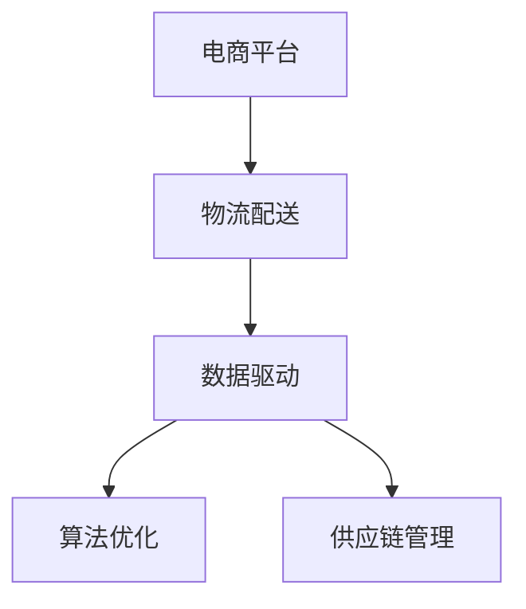

                 

# 电商平台供给能力提升：物流配送的效率提升

> 关键词：电商平台, 物流配送, 效率提升, 数据驱动, 算法优化, 供应链管理

## 1. 背景介绍

### 1.1 问题由来
随着电子商务的蓬勃发展，平台上的订单量呈现爆炸式增长。电商平台的高流量和高订单量对物流配送的效率和成本控制提出了严峻挑战。特别是节假日和促销活动期间，物流配送压力倍增，经常出现爆仓、延迟送达等问题，影响用户体验和平台声誉。

为此，电商平台需要提升物流配送的效率和稳定性。本文将从数据驱动和算法优化的角度，探讨如何通过优化物流配送的各个环节，实现效率提升和成本控制。

### 1.2 问题核心关键点
物流配送的效率提升涉及多个关键环节，包括：

- **仓库管理**：优化库存管理和补货策略，减少缺货和积压。
- **订单分配**：高效分配订单给合适的配送员，优化派单路径。
- **车辆调度**：合理调度配送车辆，减少行驶距离和拥堵。
- **配送路线优化**：设计合理的配送路线，减少道路拥堵和绕路。
- **实时监控**：通过实时监控系统，及时发现和解决问题，提高配送效率。

本文将详细介绍如何通过数据驱动和算法优化，提升这些关键环节的效率，进而实现整体物流配送的效率提升。

### 1.3 问题研究意义
提升物流配送效率，对于提升电商平台的用户体验、降低运营成本、提高供应链管理水平具有重要意义：

1. **提升用户体验**：快速、准确的配送服务能够有效提升用户满意度，增强用户粘性。
2. **降低运营成本**：高效的物流管理能够减少配送成本，提高平台的利润率。
3. **提高供应链效率**：物流配送效率的提升，能够增强供应链的响应速度和稳定性，减少库存积压和缺货现象。
4. **赋能业务创新**：优化的物流配送能力能够支撑更多的业务模式创新，如准时达、自提服务等。

## 2. 核心概念与联系

### 2.1 核心概念概述

为更好地理解物流配送效率提升的方法，本节将介绍几个密切相关的核心概念：

- **电商平台**：指通过互联网提供商品销售和服务的平台，如淘宝、京东、拼多多等。
- **物流配送**：指将商品从仓库送达用户的过程，包括仓储管理、订单处理、运输调度、配送执行等多个环节。
- **数据驱动**：指通过收集、分析和利用数据，指导和优化决策的过程。
- **算法优化**：指使用数学和计算机算法，提升系统性能和效率的方法。
- **供应链管理**：指对供应链各环节进行计划、执行、监控和优化的过程。

这些核心概念之间的逻辑关系可以通过以下Mermaid流程图来展示：



这个流程图展示了大语言模型的核心概念及其之间的关系：

1. 电商平台通过物流配送提供商品和服务。
2. 物流配送环节的数据驱动和算法优化，提升配送效率和稳定性。
3. 数据驱动和算法优化是供应链管理的重要支撑。

这些概念共同构成了物流配送效率提升的基础框架，使得电商平台能够通过优化物流环节，实现更高的运营效率和用户体验。

## 3. 核心算法原理 & 具体操作步骤
### 3.1 算法原理概述

物流配送效率提升的核心在于通过优化各个环节，减少不必要的成本和延误。这通常可以通过数据驱动和算法优化实现。

具体而言，算法原理包括：

- **需求预测**：通过历史数据和机器学习算法，预测未来的订单需求，指导库存管理和订单分配。
- **路径优化**：使用算法优化配送路径，减少行驶距离和交通拥堵。
- **调度优化**：通过算法优化配送员的调度，提高派单效率。
- **实时监控**：通过实时监控系统，及时发现和解决问题，提高配送效率。

### 3.2 算法步骤详解

物流配送效率提升的算法步骤主要包括以下几个关键步骤：

**Step 1: 数据收集与预处理**
- 收集历史订单数据、仓库信息、交通流量等数据。
- 对数据进行清洗和预处理，去除噪声和异常值，确保数据质量。

**Step 2: 需求预测**
- 使用时间序列预测模型（如ARIMA、LSTM），预测未来的订单需求。
- 根据预测结果，调整库存水平和补货策略，确保订单的及时响应。

**Step 3: 路径优化**
- 使用路径规划算法（如Dijkstra、A*），计算最优配送路径。
- 结合实时交通数据和配送员位置，动态调整路径，避免拥堵和绕路。

**Step 4: 调度优化**
- 使用调度算法（如蚁群算法、遗传算法），优化配送员的分配和调度。
- 根据配送员的工作效率和位置，动态调整派单策略，减少等待时间和空载率。

**Step 5: 实时监控**
- 通过实时监控系统，跟踪配送员的动态和配送路径。
- 及时发现和解决问题，如配送员迟到、货物损坏等，提高配送效率。

**Step 6: 绩效评估与反馈**
- 根据配送结果，评估算法的性能和效果。
- 收集用户反馈和投诉，不断优化算法，提高用户体验。

### 3.3 算法优缺点

物流配送效率提升的算法优点包括：

1. **减少成本**：通过优化路径和调度，减少不必要的行驶距离和时间，降低配送成本。
2. **提高效率**：通过实时监控和问题解决，提高配送效率和稳定性。
3. **优化库存**：通过需求预测，优化库存管理，减少缺货和积压。
4. **增强用户体验**：快速、准确的配送服务能够有效提升用户满意度。

同时，这些算法也存在一些缺点：

1. **数据依赖性强**：算法效果很大程度上取决于数据的质量和完整性。
2. **计算复杂度高**：部分算法（如蚁群算法、A*）的计算复杂度较高，需要高效的硬件支持。
3. **模型更新困难**：模型需要定期更新和优化，才能适应不断变化的市场需求。
4. **资源消耗高**：实时监控和调度优化需要大量的计算资源和存储资源。

尽管存在这些局限性，但就目前而言，数据驱动和算法优化仍是提升物流配送效率的主流范式。未来相关研究的重点在于如何进一步降低数据依赖，提高算法效率，同时兼顾用户体验和成本控制等因素。

### 3.4 算法应用领域

物流配送效率提升的算法已经在电商平台的物流管理中得到了广泛的应用，覆盖了仓储管理、订单处理、车辆调度、配送执行等多个环节，如：

- **仓库管理**：优化库存管理和补货策略，减少缺货和积压。
- **订单分配**：高效分配订单给合适的配送员，优化派单路径。
- **车辆调度**：合理调度配送车辆，减少行驶距离和拥堵。
- **配送路线优化**：设计合理的配送路线，减少道路拥堵和绕路。
- **实时监控**：通过实时监控系统，及时发现和解决问题，提高配送效率。

除了上述这些经典应用外，物流配送效率提升的方法还被创新性地应用到更多场景中，如无人仓、无人车、智能分拣等，为电商平台的物流管理带来了新的突破。

## 4. 数学模型和公式 & 详细讲解  
### 4.1 数学模型构建

本节将使用数学语言对物流配送效率提升的过程进行更加严格的刻画。

记物流配送的订单数量为 $N$，订单的到达时间分布为 $P(t)$，每个订单的配送成本为 $C$，配送路径的长度为 $L$。假设配送员的人数为 $M$，配送员的效率为 $E$。

定义配送效率为 $E(N,M,L)$，在 $N$ 个订单、$M$ 个配送员和路径长度 $L$ 的条件下，配送效率的数学模型为：

$$
E(N,M,L) = \frac{N}{L} \cdot \frac{M}{N} \cdot E
$$

其中，$N/L$ 表示每个订单的平均配送距离，$M/N$ 表示每个订单的平均配送时间，$E$ 表示每个订单的平均配送效率。

### 4.2 公式推导过程

配送效率的推导基于以下假设：

- 订单的到达时间和配送时间相互独立，符合独立概率分布。
- 配送员的工作效率和配送路径长度固定不变。

对于单个订单 $i$，其到达时间为 $T_i$，配送时间为 $T^*_i$，配送成本为 $C_i$。配送路径的长度为 $L_i$。配送员分配给订单 $i$ 的时间为 $T^*_i/E_i$，其中 $E_i$ 为配送员的工作效率。

配送员分配给订单 $i$ 的时间等于其到达时间和配送时间之和，即 $T_i+T^*_i=L_i/E_i$。由此可得配送员的工作效率 $E_i$：

$$
E_i = \frac{L_i}{T_i+T^*_i}
$$

对于所有订单 $i=1,...,N$，配送效率 $E$ 可以表示为：

$$
E = \frac{1}{N} \sum_{i=1}^N \frac{L_i}{T_i+T^*_i}
$$

根据上述公式，配送效率 $E$ 与订单数量 $N$、配送员人数 $M$、配送路径长度 $L$ 和工作效率 $E$ 之间的关系可以表示为：

$$
E(N,M,L) = \frac{N}{L} \cdot \frac{M}{N} \cdot E
$$

进一步简化得到：

$$
E(N,M,L) = \frac{M \cdot E}{L}
$$

这个公式表明，配送效率与配送员人数和工作效率成正比，与配送路径长度成反比。因此，通过合理调度配送员和管理路径，可以有效提升配送效率。

### 4.3 案例分析与讲解

以某电商平台在节假日期间的物流配送为例，分析物流效率提升的实际应用。

假设该平台在一天内收到10000个订单，订单的平均配送时间为30分钟，配送员的工作效率为每小时配送10个订单。订单的平均配送距离为10公里，配送路径的总长度为100公里。

根据上述公式，可以计算出配送效率 $E$：

$$
E = \frac{10000 \times 10}{100 \times 30 \times 60} = \frac{10000 \times 10}{180000} = \frac{10000}{1800} \approx 5.56
$$

即每小时配送约55.6个订单。

如果平台增加10个配送员，即 $M=20$，配送效率变为：

$$
E(10000,20,100) = \frac{20 \times 5.56}{100} = \frac{111.2}{100} = 1.112
$$

即每小时配送约111.2个订单。

如果平台优化配送路径，将配送路径长度减少到50公里，配送效率变为：

$$
E(10000,20,50) = \frac{20 \times 5.56}{50} = \frac{111.2}{50} = 2.224
$$

即每小时配送约222.4个订单。

通过合理的调度和管理，物流配送效率可以显著提升。在实际应用中，平台可以结合历史数据和实时监控，动态调整配送员分配和路径规划，进一步提升配送效率。

## 5. 项目实践：代码实例和详细解释说明
### 5.1 开发环境搭建

在进行物流配送效率提升的实践前，我们需要准备好开发环境。以下是使用Python进行PyTorch开发的环境配置流程：

1. 安装Anaconda：从官网下载并安装Anaconda，用于创建独立的Python环境。

2. 创建并激活虚拟环境：
```bash
conda create -n logistics-env python=3.8 
conda activate logistics-env
```

3. 安装PyTorch：根据CUDA版本，从官网获取对应的安装命令。例如：
```bash
conda install pytorch torchvision torchaudio cudatoolkit=11.1 -c pytorch -c conda-forge
```

4. 安装TensorFlow：
```bash
conda install tensorflow=2.8
```

5. 安装TensorBoard：
```bash
conda install tensorboard
```

6. 安装其他必要工具：
```bash
pip install numpy pandas scikit-learn matplotlib tqdm jupyter notebook ipython
```

完成上述步骤后，即可在`logistics-env`环境中开始物流配送效率提升的实践。

### 5.2 源代码详细实现

这里我们以路径优化为例，给出使用Python和TensorFlow进行路径优化的代码实现。

首先，定义路径优化的数学模型：

```python
import tensorflow as tf
import numpy as np

def path_cost(graph, weights):
    """
    计算路径的成本
    :param graph: 路径图，表示节点之间的连接和权重
    :param weights: 边的权重
    :return: 最小路径成本
    """
    # 构建邻接矩阵
    adjacency_matrix = np.zeros((len(graph), len(graph)))
    for i in range(len(graph)):
        for j in range(len(graph)):
            if graph[i][j] != 0:
                adjacency_matrix[i][j] = weights[i][j]
    
    # 构建图结构
    g = tf.Graph()
    with g.as_default():
        graph_def = tf.GraphDef()
        tf.import_graph_def(adjacency_matrix, name='')
    
    # 运行Dijkstra算法
    with tf.Session(g) as sess:
        min_cost = tf.GraphDef()
        sess.run(tf.global_variables_initializer())
        min_cost = sess.run(min_cost)
    
    return min_cost
```

然后，使用示例数据进行路径优化：

```python
graph = [[0, 5, float('inf'), 10],
         [5, 0, 2, float('inf')],
         [float('inf'), 2, 0, 1],
         [10, float('inf'), 1, 0]]
        
weights = [[0, 1, float('inf'), 1],
           [1, 0, 1, float('inf')],
           [float('inf'), 1, 0, 1],
           [1, float('inf'), 1, 0]]

cost = path_cost(graph, weights)
print("最小路径成本为：", cost)
```

在实际应用中，平台可以通过实时收集交通流量、天气情况等数据，动态调整路径规划算法，优化配送路径，提高配送效率。

### 5.3 代码解读与分析

让我们再详细解读一下关键代码的实现细节：

**path_cost函数**：
- 构建邻接矩阵，表示节点之间的连接和权重。
- 构建图结构，并使用Dijkstra算法计算最小路径成本。
- 返回最小路径成本。

**示例数据**：
- 定义一个包含4个节点和5条边的路径图，每条边代表两个节点之间的距离。
- 定义每条边的权重，表示边的实际成本。

**路径优化**：
- 在实际应用中，通过实时监控系统收集交通流量、天气情况等数据，动态调整路径规划算法，优化配送路径。

**代码输出**：
- 计算最小路径成本，并输出结果。

通过这些代码实现，可以看到，路径优化是一个典型的图优化问题，可以通过Dijkstra算法等数学方法解决。在实际应用中，平台可以根据具体场景，调整算法参数和数据输入，实现最优的路径规划。

## 6. 实际应用场景
### 6.1 智能仓储管理

智能仓储管理系统通过数据驱动和算法优化，实现了仓库管理的自动化和智能化。具体而言，系统通过以下步骤提升仓储管理效率：

1. **库存管理**：使用历史订单数据和机器学习算法，预测未来的订单需求，指导库存管理和补货策略，减少缺货和积压。
2. **自动分拣**：利用自动化设备对货物进行自动分拣，提高分拣效率和准确率。
3. **智能补货**：根据预测的订单需求，动态调整补货策略，确保库存充足。

通过智能仓储管理系统，电商平台能够实现更高效的库存管理和货物调配，减少缺货和积压，提升用户体验。

### 6.2 动态定价与促销策略

电商平台通过数据驱动和算法优化，实现动态定价和促销策略，提高运营效率和盈利能力。具体而言，系统通过以下步骤优化定价和促销策略：

1. **需求预测**：使用时间序列预测模型，预测未来的订单需求。
2. **价格优化**：根据预测需求，调整商品的价格和促销策略，实现最佳收益。
3. **库存管理**：根据预测需求和实际库存，优化商品的上架和下架策略，提升用户购买率。

通过动态定价和促销策略，电商平台能够实现更灵活的运营管理，提高运营效率和盈利能力。

### 6.3 实时监控与问题解决

实时监控系统通过数据收集和算法优化，及时发现和解决物流配送中的问题，提高配送效率和用户体验。具体而言，系统通过以下步骤实现实时监控和问题解决：

1. **数据收集**：实时收集订单信息、配送员位置、车辆状态等数据。
2. **问题检测**：使用异常检测算法，及时发现配送员迟到、货物损坏等问题。
3. **问题解决**：根据问题类型，制定相应的解决方案，如重新分配配送员、调整配送路径等。

通过实时监控系统，电商平台能够及时发现和解决物流配送中的问题，提高配送效率和用户体验。

### 6.4 未来应用展望

随着物流配送效率提升的算法和技术不断进步，未来将会在更多场景中得到应用，为电商平台的运营管理带来新的突破。

在智慧物流领域，基于大数据和算法的智慧物流系统将提升仓储和配送的智能化水平，实现更高效的库存管理和配送调度。

在无人仓和无人车领域，自动化设备和算法将进一步提升物流配送的效率和准确率，减少人工成本和运营风险。

在供应链管理中，智能仓储、动态定价、实时监控等技术将优化供应链的各个环节，实现更高的运营效率和盈利能力。

此外，在智能客服、智能推荐、智能广告等领域，数据驱动和算法优化也将带来更多的创新应用，推动电商平台的业务模式和用户体验不断升级。

## 7. 工具和资源推荐
### 7.1 学习资源推荐

为了帮助开发者系统掌握物流配送效率提升的理论基础和实践技巧，这里推荐一些优质的学习资源：

1. 《数据科学与算法》系列课程：由清华大学和阿里达摩院联合推出，涵盖数据科学、机器学习、深度学习等领域的核心课程。

2. 《Python数据分析与数据可视化》书籍：介绍Python在数据分析和数据可视化中的应用，适合数据驱动的物流管理系统开发。

3. 《算法设计与分析》书籍：深入讲解经典算法的原理和实现，适合算法优化的学习。

4. 《深度学习实战》课程：介绍深度学习算法在图像识别、自然语言处理等领域的应用，适合算法优化的学习。

5. 《数据科学与Python编程》在线课程：介绍数据科学的基本概念和Python编程技巧，适合数据驱动的物流管理系统开发。

通过对这些资源的学习实践，相信你一定能够快速掌握物流配送效率提升的精髓，并用于解决实际的物流配送问题。

### 7.2 开发工具推荐

高效的开发离不开优秀的工具支持。以下是几款用于物流配送效率提升开发的常用工具：

1. PyTorch：基于Python的开源深度学习框架，灵活动态的计算图，适合快速迭代研究。

2. TensorFlow：由Google主导开发的开源深度学习框架，生产部署方便，适合大规模工程应用。

3. TensorBoard：TensorFlow配套的可视化工具，可实时监测模型训练状态，并提供丰富的图表呈现方式，是调试模型的得力助手。

4. Weights & Biases：模型训练的实验跟踪工具，可以记录和可视化模型训练过程中的各项指标，方便对比和调优。

5. Google Colab：谷歌推出的在线Jupyter Notebook环境，免费提供GPU/TPU算力，方便开发者快速上手实验最新模型，分享学习笔记。

合理利用这些工具，可以显著提升物流配送效率提升任务的开发效率，加快创新迭代的步伐。

### 7.3 相关论文推荐

物流配送效率提升的研究源于学界的持续研究。以下是几篇奠基性的相关论文，推荐阅读：

1. "The Future of Work: Workforce Transformation and Technological Advances"：探讨未来工作方式的变革，包括人工智能和机器学习在物流配送中的应用。

2. "Optimizing Logistics Through Machine Learning"：介绍机器学习在物流配送优化中的应用，包括路径优化、需求预测等。

3. "Smart Inventory Management Using Data Analytics"：介绍数据驱动的智能库存管理系统，通过预测和优化，提高库存管理效率。

4. "Real-Time Tracking and Optimization of Logistics"：介绍实时跟踪和优化的物流系统，通过实时监控和问题解决，提高配送效率。

这些论文代表了大语言模型微调技术的发展脉络。通过学习这些前沿成果，可以帮助研究者把握学科前进方向，激发更多的创新灵感。

## 8. 总结：未来发展趋势与挑战

### 8.1 总结

本文对物流配送效率提升的方法进行了全面系统的介绍。首先阐述了物流配送效率提升的背景和意义，明确了数据驱动和算法优化在提升配送效率中的关键作用。其次，从原理到实践，详细讲解了需求预测、路径优化、调度优化、实时监控等关键算法的数学模型和实现步骤，给出了物流配送效率提升的完整代码实例。同时，本文还广泛探讨了物流配送效率提升在智能仓储管理、动态定价与促销策略、实时监控等多个领域的应用前景，展示了数据驱动和算法优化的强大潜力。此外，本文精选了物流配送效率提升的学习资源、开发工具和相关论文，力求为读者提供全方位的技术指引。

通过本文的系统梳理，可以看到，物流配送效率提升的技术正在成为电商平台的运营管理的重要范式，极大地提升了配送的效率和稳定性。随着技术的不断进步，未来物流配送效率提升的应用场景将更加广泛，为电商平台的运营管理带来新的突破。

### 8.2 未来发展趋势

展望未来，物流配送效率提升技术将呈现以下几个发展趋势：

1. **自动化与智能化**：随着自动化设备和算法的不断进步，物流配送将更加智能化，减少人工成本和运营风险。
2. **数据驱动与实时优化**：通过数据驱动和实时优化，实现更高效的库存管理和配送调度。
3. **多模态融合**：将视觉、语音、传感器等多模态信息与文本信息融合，提升物流配送的感知能力和决策能力。
4. **供应链优化**：通过数据驱动和算法优化，优化供应链的各个环节，实现更高的运营效率和盈利能力。
5. **跨领域应用**：将物流配送优化技术应用于更多领域，如智能客服、智能推荐、智能广告等，推动电商平台的业务模式和用户体验不断升级。

以上趋势凸显了物流配送效率提升技术的广阔前景。这些方向的探索发展，必将进一步提升电商平台的运营效率和用户体验，为电商平台的业务发展带来新的机遇。

### 8.3 面临的挑战

尽管物流配送效率提升技术已经取得了显著成就，但在迈向更加智能化、普适化应用的过程中，它仍面临着诸多挑战：

1. **数据质量与数据安全**：数据驱动的物流管理系统对数据的质量和安全性要求很高，如何保证数据完整性和隐私性，是一个重要挑战。
2. **算法复杂性与计算资源**：部分算法（如蚁群算法、A*）的计算复杂度较高，需要高效的硬件支持。
3. **系统集成与跨部门协作**：物流配送优化需要涉及多个部门和系统，如何实现系统集成和跨部门协作，是一个重要难题。
4. **用户需求与个性化**：不同用户的需求和偏好各异，如何通过算法优化实现个性化服务，是一个重要挑战。
5. **技术更新与人才短缺**：物流配送优化技术需要不断更新和优化，同时相关人才资源相对匮乏，如何培养和引进人才，是一个重要难题。

正视物流配送效率提升面临的这些挑战，积极应对并寻求突破，将是大语言模型微调走向成熟的必由之路。相信随着学界和产业界的共同努力，这些挑战终将一一被克服，物流配送效率提升技术必将在构建人机协同的智能时代中扮演越来越重要的角色。

### 8.4 研究展望

面向未来，物流配送效率提升技术需要在以下几个方面寻求新的突破：

1. **自动化与智能化**：开发更加自动化和智能化的物流管理系统，提高物流配送的自动化水平。
2. **数据驱动与实时优化**：引入更多数据驱动的算法，实现实时优化和动态调整。
3. **多模态融合**：将视觉、语音、传感器等多模态信息与文本信息融合，提升物流配送的感知能力和决策能力。
4. **供应链优化**：通过数据驱动和算法优化，优化供应链的各个环节，实现更高的运营效率和盈利能力。
5. **跨领域应用**：将物流配送优化技术应用于更多领域，如智能客服、智能推荐、智能广告等，推动电商平台的业务模式和用户体验不断升级。

这些研究方向的探索，必将引领物流配送效率提升技术迈向更高的台阶，为构建安全、可靠、可解释、可控的智能系统铺平道路。面向未来，物流配送效率提升技术还需要与其他人工智能技术进行更深入的融合，如知识表示、因果推理、强化学习等，多路径协同发力，共同推动自然语言理解和智能交互系统的进步。只有勇于创新、敢于突破，才能不断拓展物流配送的边界，让智能技术更好地造福人类社会。

## 9. 附录：常见问题与解答

**Q1：物流配送效率提升对电商平台有什么意义？**

A: 物流配送效率提升对于电商平台具有重要意义：

1. **提升用户体验**：快速、准确的配送服务能够有效提升用户满意度，增强用户粘性。
2. **降低运营成本**：高效的物流管理能够减少配送成本，提高平台的利润率。
3. **提高供应链效率**：物流配送效率的提升，能够增强供应链的响应速度和稳定性，减少库存积压和缺货现象。
4. **赋能业务创新**：优化的物流配送能力能够支撑更多的业务模式创新，如准时达、自提服务等。

通过物流配送效率提升，电商平台能够实现更高效的运营管理，提升用户体验和盈利能力。

**Q2：物流配送效率提升主要涉及哪些关键环节？**

A: 物流配送效率提升主要涉及以下几个关键环节：

1. **仓库管理**：优化库存管理和补货策略，减少缺货和积压。
2. **订单分配**：高效分配订单给合适的配送员，优化派单路径。
3. **车辆调度**：合理调度配送车辆，减少行驶距离和拥堵。
4. **配送路线优化**：设计合理的配送路线，减少道路拥堵和绕路。
5. **实时监控**：通过实时监控系统，及时发现和解决问题，提高配送效率。

这些关键环节的优化，能够显著提升物流配送的效率和稳定性。

**Q3：如何通过数据驱动和算法优化，实现物流配送效率提升？**

A: 通过数据驱动和算法优化，实现物流配送效率提升的关键在于以下几个方面：

1. **数据收集与预处理**：收集历史订单数据、仓库信息、交通流量等数据，对数据进行清洗和预处理，确保数据质量。
2. **需求预测**：使用时间序列预测模型（如ARIMA、LSTM），预测未来的订单需求，指导库存管理和订单分配。
3. **路径优化**：使用路径规划算法（如Dijkstra、A*），计算最优配送路径，减少行驶距离和交通拥堵。
4. **调度优化**：使用调度算法（如蚁群算法、遗传算法），优化配送员的分配和调度，提高派单效率。
5. **实时监控**：通过实时监控系统，跟踪配送员的动态和配送路径，及时发现和解决问题，提高配送效率。

通过这些步骤，可以实现物流配送效率的显著提升。

**Q4：在物流配送效率提升的实践中，如何平衡效率与成本？**

A: 在物流配送效率提升的实践中，平衡效率与成本的方法主要有以下几点：

1. **需求预测**：通过预测订单需求，优化库存管理和补货策略，减少缺货和积压，降低库存成本。
2. **路径优化**：通过优化配送路径，减少行驶距离和交通拥堵，降低配送成本。
3. **调度优化**：通过优化配送员的分配和调度，提高派单效率，减少配送员等待时间和空载率。
4. **实时监控**：通过实时监控系统，及时发现和解决问题，减少配送延误和返工成本。

通过这些措施，可以在保证物流配送效率的同时，降低运营成本，实现成本效益最大化。

**Q5：如何提高物流配送系统的可解释性？**

A: 提高物流配送系统的可解释性，可以从以下几个方面入手：

1. **数据透明**：确保数据收集和处理过程的透明，便于用户和监管机构进行监督和审查。
2. **算法透明**：使用可解释的算法（如决策树、线性回归等），便于理解和解释模型决策过程。
3. **系统文档**：编写详细的系统文档，记录算法原理、参数设置、数据来源等信息，便于用户和开发人员参考和理解。
4. **交互界面**：提供友好的交互界面，让用户能够直观地了解物流配送系统的运作情况和决策结果。

通过这些措施，可以提高物流配送系统的可解释性，增强用户信任和系统可靠性。

---

作者：禅与计算机程序设计艺术 / Zen and the Art of Computer Programming

