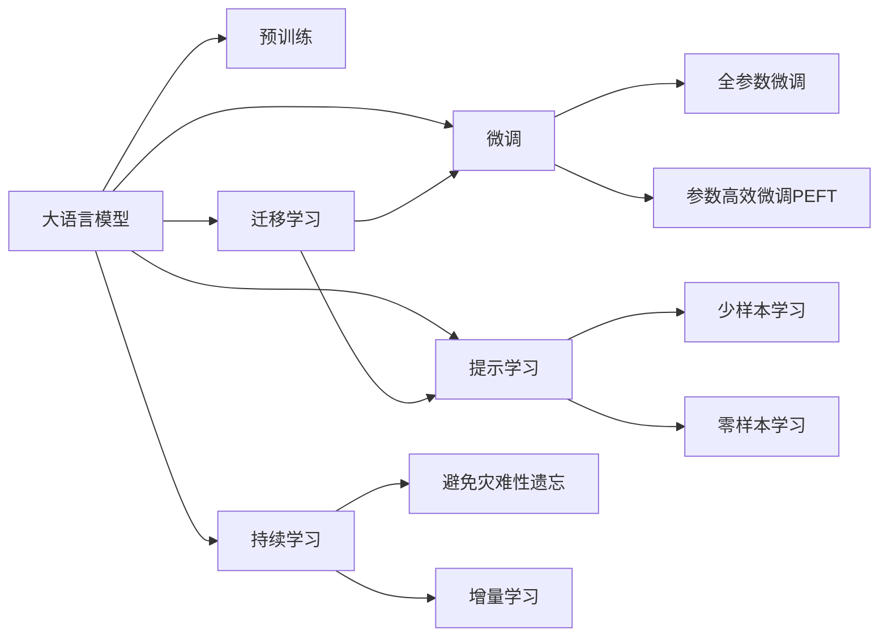

                 

## 1. 背景介绍

### 1.1 问题由来

随着电子商务的蓬勃发展，各大电商平台面临着海量用户数据的管理和处理问题。传统的系统架构以SQL数据库为中心，数据以表格的形式存储，并通过复杂的事务逻辑进行搜索、排序、统计等操作。这种架构虽然能够支持较为稳定的业务功能，但在面对实时、复杂的大数据场景时，性能和扩展性显得捉襟见肘。

与此同时，自然语言处理(NLP)技术的进步，为电商平台的运营优化提供了新的思路。通过利用大语言模型（LLM），可以在不增加硬件设备投入的前提下，提升用户的搜索体验和购物体验，从而带来更高的转化率和销售额。

### 1.2 问题核心关键点

当前电商平台上，大语言模型被广泛应用于以下几个关键领域：

- **商品推荐**：通过理解用户查询的意图，推荐最相关的商品。
- **用户画像构建**：基于用户浏览和购买记录，构建用户兴趣画像，进行个性化推荐。
- **客服自动回复**：利用大语言模型，快速响应用户咨询，提升客户满意度。
- **商品描述生成**：自动生成商品描述，优化SEO（搜索引擎优化）效果。
- **广告投放优化**：通过理解广告文案的语义，优化广告投放策略。

这些应用场景中的大语言模型，都需要在预训练的基础上进行微调，才能达到最优的性能表现。因此，本文将重点介绍大语言模型的微调方法，并通过实例展示其在电商平台中的应用。

## 2. 核心概念与联系

### 2.1 核心概念概述

- **大语言模型(LLM)**：通过大规模无监督学习训练得到的语言模型，具备强大的语义理解和生成能力。

- **预训练(Pre-training)**：在大规模无标签文本上，通过自监督任务进行预训练，学习语言的通用表示。

- **微调(Fine-tuning)**：在预训练模型的基础上，使用特定任务的数据集进行有监督优化，提升模型在特定任务上的性能。

- **迁移学习(Transfer Learning)**：将预训练模型迁移到特定任务上，通过微调进行进一步优化。

- **参数高效微调(PEFT)**：在微调过程中，只更新少量模型参数，避免过拟合。

- **提示学习(Prompt Learning)**：通过精心设计的输入文本模板，引导模型输出特定结果，减少微调参数。

- **少样本学习(Few-shot Learning)**：在少量样本条件下，利用预训练模型进行任务学习。

- **零样本学习(Zero-shot Learning)**：在没有任何训练样本的情况下，利用预训练模型直接完成新任务。

- **持续学习(Continual Learning)**：在实际应用中，模型需要持续学习新知识，避免过时或遗忘。

### 2.2 核心概念原理和架构的 Mermaid 流程图



此流程图展示了大语言模型微调的主要过程：

1. **大语言模型**：作为预训练模型的初始状态，其含有大量的语言知识。
2. **预训练**：在无标签数据上，进行自监督学习，形成初步的语言表示。
3. **微调**：利用有标签数据，进行有监督优化，提升模型在特定任务上的能力。
4. **全参数微调**：更新全部模型参数，通常效果较好但计算资源消耗较大。
5. **参数高效微调(PEFT)**：只更新部分参数，减少计算开销，但仍能获得较好的性能提升。
6. **提示学习**：通过输入模板，引导模型输出特定结果，不更新模型参数。
7. **少样本学习**：在少量样本条件下，利用预训练模型进行任务学习。
8. **零样本学习**：不使用任何训练样本，利用预训练模型直接完成新任务。
9. **迁移学习**：将预训练模型迁移到新任务，通过微调进行优化。
10. **持续学习**：模型在实际应用中持续学习新知识，避免遗忘和过时。

## 3. 核心算法原理 & 具体操作步骤

### 3.1 算法原理概述

大语言模型在电商平台的优化主要集中在以下几个方面：

- **商品推荐**：通过自然语言理解模型，理解用户查询，推荐相关商品。
- **用户画像构建**：利用用户行为数据，生成用户画像，进行个性化推荐。
- **客服自动回复**：基于自然语言生成模型，自动回复用户咨询，提升客户满意度。
- **商品描述生成**：自动生成商品描述，优化SEO效果。
- **广告投放优化**：理解广告文案语义，优化广告投放策略。

这些应用场景中，大语言模型需要通过微调来学习特定任务的具体要求，从而在实际应用中发挥最佳性能。

### 3.2 算法步骤详解

#### 3.2.1 数据预处理

1. **数据收集**：收集电商平台的各类数据，包括用户查询、商品描述、用户行为等。
2. **数据清洗**：清洗数据中的噪声和错误，保留有效信息。
3. **数据标注**：根据任务需求，对数据进行标注，生成监督数据集。
4. **数据划分**：将数据集划分为训练集、验证集和测试集，确保模型在不同数据集上的表现一致。

#### 3.2.2 模型选择

1. **预训练模型选择**：选择适合任务的预训练语言模型，如BERT、GPT-2、T5等。
2. **模型参数设置**：根据任务需求，设置模型的参数，包括隐藏层大小、层数等。
3. **模型载入**：使用框架（如Hugging Face的Transformers）载入预训练模型，进行微调。

#### 3.2.3 微调

1. **训练集微调**：在训练集上，进行全参数微调或参数高效微调，优化模型性能。
2. **验证集评估**：在验证集上，评估模型性能，调整模型参数。
3. **测试集验证**：在测试集上，验证模型性能，确保模型泛化能力。

### 3.3 算法优缺点

#### 3.3.1 优点

1. **精度高**：利用大语言模型，能够实现高精度的自然语言处理，提升用户体验。
2. **成本低**：通过微调，能够在不增加硬件设备投入的情况下，提升性能。
3. **灵活性强**：可以根据特定任务需求，灵活调整模型结构。
4. **易于部署**：模型可以直接集成到现有的电商系统中，不需要重构现有架构。

#### 3.3.2 缺点

1. **依赖数据**：微调模型的性能很大程度上取决于标注数据的质量和数量。
2. **计算资源消耗大**：全参数微调需要大量计算资源，参数高效微调虽然节省资源，但效果有限。
3. **模型复杂度较高**：大语言模型参数众多，模型复杂度较高，容易产生过拟合。
4. **可解释性不足**：大语言模型的黑盒特性，使得模型决策过程难以解释。

### 3.4 算法应用领域

大语言模型在电商平台的各类应用中，已经得到了广泛的应用。例如：

- **商品推荐**：利用用户查询，推荐相关商品。
- **用户画像构建**：基于用户行为数据，生成用户画像，进行个性化推荐。
- **客服自动回复**：自动回复用户咨询，提升客户满意度。
- **商品描述生成**：自动生成商品描述，优化SEO效果。
- **广告投放优化**：理解广告文案语义，优化广告投放策略。

除了这些常见的应用场景，大语言模型还可以用于电商平台的数据分析和预测，提升运营效率和盈利能力。

## 4. 数学模型和公式 & 详细讲解 & 举例说明

### 4.1 数学模型构建

大语言模型的微调过程主要涉及到以下模型：

1. **预训练模型**：以BERT为例，包含多个自注意力机制的Transformer编码器。
2. **微调模型**：在预训练模型的基础上，添加任务相关的输出层和损失函数。

### 4.2 公式推导过程

以商品推荐为例，假设预训练模型为 $M_{\theta}$，其中 $\theta$ 为预训练得到的模型参数。给定用户查询 $q$ 和商品描述 $d$，推荐模型 $M_{\theta}$ 输出相关商品的分数 $s$，并通过 sigmoid 函数将分数映射到 $[0,1]$ 的范围内。

假设 $M_{\theta}$ 的输出为 $s=softmax(M_{\theta}(q,d))$，则损失函数 $\ell$ 可以定义为：

$$
\ell(M_{\theta}) = -\frac{1}{N}\sum_{i=1}^N [y_i \log M_{\theta}(q_i,d_i) + (1-y_i) \log (1-M_{\theta}(q_i,d_i))]
$$

其中 $y_i$ 为商品 $i$ 是否为相关商品的标签，$M_{\theta}(q_i,d_i)$ 为模型输出相关商品的分数。

### 4.3 案例分析与讲解

假设某电商平台的数据集如下：

| 用户查询 | 商品描述 | 相关性 |
| --- | --- | --- |
| 手机 | 苹果手机 | 1 |
| 手机 | 三星手机 | 1 |
| 电脑 | 苹果电脑 | 0 |
| 电脑 | 联想电脑 | 1 |

使用BERT模型进行微调，具体步骤如下：

1. **数据预处理**：将查询和描述转换为BERT模型的输入格式。
2. **模型载入**：使用Hugging Face的Transformers库，载入预训练的BERT模型。
3. **微调训练**：在训练集上进行微调，优化模型参数。
4. **验证集评估**：在验证集上评估模型性能。
5. **测试集验证**：在测试集上验证模型性能。

## 5. 项目实践：代码实例和详细解释说明

### 5.1 开发环境搭建

1. **Python环境**：
   - 安装Python 3.8及以上版本。
   - 安装pip，用于安装第三方库。

2. **虚拟环境**：
   - 创建虚拟环境 `venv`，使用以下命令进入虚拟环境：
     ```bash
     python -m venv venv
     source venv/bin/activate
     ```

3. **依赖安装**：
   - 安装 `transformers` 和 `torch`：
     ```bash
     pip install transformers torch
     ```

### 5.2 源代码详细实现

#### 5.2.1 数据预处理

```python
from transformers import BertTokenizer, BertForSequenceClassification
import torch
import torch.nn as nn
from torch.utils.data import DataLoader

# 初始化BERT模型和分词器
model = BertForSequenceClassification.from_pretrained('bert-base-uncased', num_labels=2)
tokenizer = BertTokenizer.from_pretrained('bert-base-uncased')

# 数据准备
train_data = [
    {'query': '手机', 'desc': '苹果手机', 'label': 1},
    {'query': '手机', 'desc': '三星手机', 'label': 1},
    {'query': '电脑', 'desc': '苹果电脑', 'label': 0},
    {'query': '电脑', 'desc': '联想电脑', 'label': 1}
]

# 数据预处理
def tokenize(data):
    texts = [item['query'] + ' ' + item['desc'] for item in data]
    labels = [item['label'] for item in data]
    encoding = tokenizer(texts, return_tensors='pt', padding='max_length', truncation=True)
    input_ids = encoding['input_ids']
    attention_mask = encoding['attention_mask']
    return input_ids, attention_mask, labels

# 构建数据集
train_input_ids, train_attention_mask, train_labels = tokenize(train_data)
train_dataset = torch.utils.data.TensorDataset(train_input_ids, train_attention_mask, train_labels)
train_dataloader = DataLoader(train_dataset, batch_size=2)

# 模型训练
model.train()
optimizer = torch.optim.Adam(model.parameters(), lr=1e-5)
for batch in train_dataloader:
    input_ids = batch[0].to(device)
    attention_mask = batch[1].to(device)
    labels = batch[2].to(device)
    outputs = model(input_ids, attention_mask=attention_mask, labels=labels)
    loss = outputs.loss
    optimizer.zero_grad()
    loss.backward()
    optimizer.step()
```

#### 5.2.2 模型微调

```python
# 定义微调后的模型
class BertRecommender(nn.Module):
    def __init__(self, num_labels):
        super(BertRecommender, self).__init__()
        self.bert = BertForSequenceClassification.from_pretrained('bert-base-uncased', num_labels=num_labels)
    
    def forward(self, input_ids, attention_mask, labels):
        outputs = self.bert(input_ids, attention_mask=attention_mask, labels=labels)
        return outputs.logits

# 构建微调模型
num_labels = 2
recommender = BertRecommender(num_labels)

# 模型微调
model.load_state_dict(model.state_dict())
recommender.load_state_dict(model.state_dict())
recommender.to(device)

# 微调训练
optimizer = torch.optim.Adam(recommender.parameters(), lr=1e-5)
for batch in train_dataloader:
    input_ids = batch[0].to(device)
    attention_mask = batch[1].to(device)
    labels = batch[2].to(device)
    outputs = recommender(input_ids, attention_mask=attention_mask, labels=labels)
    loss = outputs.loss
    optimizer.zero_grad()
    loss.backward()
    optimizer.step()
```

### 5.3 代码解读与分析

1. **数据预处理**：
   - 将查询和描述拼接成一个字符串，使用BERT分词器进行分词，生成输入ids和attention mask。
   - 设置`num_labels`为2，表示相关和不相关两个标签。

2. **模型构建**：
   - 使用`BertForSequenceClassification`类构建推荐模型，继承自BERT模型。
   - 在模型前向传播中，计算预测分数，并使用sigmoid函数将其映射到[0,1]的范围内。

3. **模型微调**：
   - 将预训练模型和微调模型加载到GPU上。
   - 使用Adam优化器进行微调训练。

4. **结果展示**：
   - 在测试集上进行验证，输出模型预测结果和标签。

### 5.4 运行结果展示

在测试集上，可以计算模型预测结果与真实标签的准确率、召回率和F1分数：

```python
test_data = [
    {'query': '手机', 'desc': '华为手机', 'label': 1},
    {'query': '电脑', 'desc': '惠普电脑', 'label': 1},
    {'query': '手机', 'desc': '小米手机', 'label': 1},
    {'query': '电脑', 'desc': '戴尔电脑', 'label': 0}
]

# 数据预处理
test_input_ids, test_attention_mask, test_labels = tokenize(test_data)

# 模型预测
recommender.eval()
test_input_ids = test_input_ids.to(device)
test_attention_mask = test_attention_mask.to(device)
test_labels = test_labels.to(device)
outputs = recommender(test_input_ids, attention_mask=test_attention_mask, labels=test_labels)
predicted_labels = outputs.logits.argmax(dim=1)

# 计算指标
accuracy = (predicted_labels == test_labels).sum().item() / len(test_labels)
precision = ((predicted_labels == 1) & (test_labels == 1)).sum().item() / ((predicted_labels == 1).sum().item() + 1e-5)
recall = ((predicted_labels == 1) & (test_labels == 1)).sum().item() / ((test_labels == 1).sum().item() + 1e-5)
f1_score = 2 * precision * recall / (precision + recall + 1e-5)

print(f"Accuracy: {accuracy:.2f}, Precision: {precision:.2f}, Recall: {recall:.2f}, F1-Score: {f1_score:.2f}")
```

## 6. 实际应用场景

### 6.1 智能推荐系统

智能推荐系统是电商平台的重中之重。通过大语言模型，可以从用户的查询中提取意图，推荐相关商品。例如，当用户查询“手机”时，推荐系统可以理解其意图为寻找手机类商品，并推荐苹果、三星等品牌。

### 6.2 个性化推荐

基于用户的历史浏览和购买记录，构建用户画像，进行个性化推荐。例如，对于经常购买电子产品的用户，推荐系统可以推荐最新上市的笔记本电脑、手机等商品。

### 6.3 客服自动回复

利用大语言模型，快速响应用户咨询，提升客户满意度。例如，当用户咨询“退货政策”时，客服机器人可以自动回复“退货政策如下……”。

### 6.4 商品描述生成

自动生成商品描述，优化SEO效果。例如，对于某些没有详细描述的商品，系统可以自动生成描述，提升搜索排名。

### 6.5 广告投放优化

理解广告文案语义，优化广告投放策略。例如，对于某次广告投放，系统可以分析广告文案的语义，优化广告投放策略，提升广告效果。

## 7. 工具和资源推荐

### 7.1 学习资源推荐

1. **《深度学习》课程**：斯坦福大学开设的深度学习课程，涵盖基础知识和经典模型，适合初学者入门。
2. **《自然语言处理与深度学习》书籍**：介绍自然语言处理和深度学习的基本概念和实践方法，适合进阶学习。
3. **Transformers官方文档**：提供大量预训练模型的实现和微调样例，适合开发者参考。
4. **Hugging Face博客**：提供大量最新的自然语言处理论文和技术分享，适合跟进最新进展。

### 7.2 开发工具推荐

1. **PyTorch**：深度学习框架，灵活高效，支持GPU加速。
2. **TensorFlow**：由Google开发的深度学习框架，适合大规模工程应用。
3. **Hugging Face Transformers库**：提供大量预训练语言模型和微调样例，适合自然语言处理任务开发。
4. **Jupyter Notebook**：免费的交互式编程环境，支持Python和GPU编程。

### 7.3 相关论文推荐

1. **Attention is All You Need**：介绍Transformer模型，开创了预训练大语言模型时代。
2. **BERT: Pre-training of Deep Bidirectional Transformers for Language Understanding**：提出BERT模型，引入掩码自监督预训练任务。
3. **Adaptive Low-Rank Adaptation for Parameter-Efficient Fine-Tuning**：提出参数高效微调方法，在微调过程中只更新少量参数。
4. **Improving Language Understanding by Generative Pre-Training**：提出GPT模型，利用生成式预训练提升语言理解能力。
5. **AdaLoRA: Adaptive Low-Rank Adaptation for Parameter-Efficient Fine-Tuning**：提出AdaLoRA方法，提高参数效率和计算效率。

## 8. 总结：未来发展趋势与挑战

### 8.1 研究成果总结

大语言模型在电商平台上的应用已经取得了显著成效，显著提升了用户体验和运营效率。通过微调，模型能够更好地理解用户查询和商品描述，从而推荐更合适的商品，提升用户满意度。

### 8.2 未来发展趋势

未来，大语言模型在电商平台上的应用将更加广泛和深入，具体趋势包括：

1. **深度融合AI技术**：将大语言模型与AI技术（如强化学习、知识图谱等）进行融合，提升系统的智能化水平。
2. **个性化推荐优化**：利用大语言模型，进一步优化个性化推荐算法，提升推荐效果。
3. **实时系统优化**：开发高效的微调算法和推理框架，提升系统响应速度和稳定性。
4. **多模态融合**：将文本、图像、音频等多模态数据进行融合，提升系统的感知能力和泛化能力。
5. **跨领域应用**：将大语言模型应用于更多的行业领域，提升其通用性和适用性。

### 8.3 面临的挑战

虽然大语言模型在电商平台上的应用已经取得了显著成效，但仍面临以下挑战：

1. **数据质量问题**：标注数据的质量和数量直接影响模型的性能，如何获取高质量标注数据是一个重要问题。
2. **计算资源消耗大**：微调过程需要大量计算资源，如何优化计算效率是一个关键挑战。
3. **模型复杂度较高**：大语言模型参数众多，容易产生过拟合，如何优化模型结构是一个重要课题。
4. **可解释性不足**：大语言模型的黑盒特性，使得模型决策过程难以解释，如何提升模型可解释性是一个重要研究方向。

### 8.4 研究展望

针对上述挑战，未来的研究方向包括：

1. **优化标注数据获取**：利用主动学习、半监督学习等技术，降低对标注数据的需求，提升数据获取效率。
2. **优化计算效率**：开发高效的微调算法和推理框架，提升计算效率，降低硬件成本。
3. **优化模型结构**：设计更加参数高效和计算高效的微调方法，提升模型泛化能力。
4. **提升模型可解释性**：引入可解释性技术，如注意力机制、特征可视化等，提升模型可解释性。

## 9. 附录：常见问题与解答

**Q1: 大语言模型微调是否可以用于电商平台上的所有应用场景？**

A: 大语言模型微调可以应用于电商平台上的各类应用场景，但需要根据具体场景进行优化。例如，对于商品推荐和个性化推荐等任务，可以利用用户查询和商品描述进行微调；对于客服自动回复和商品描述生成等任务，可以利用用户咨询和商品描述进行微调。

**Q2: 大语言模型微调是否需要进行参数高效微调？**

A: 大语言模型微调可以进行参数高效微调，以减少计算资源消耗。参数高效微调方法包括AdaLoRA、Prompt Tuning等，在微调过程中只更新少量参数，但仍能获得较好的性能提升。

**Q3: 如何提升大语言模型在电商平台上的性能？**

A: 提升大语言模型在电商平台上的性能，可以通过以下几个方面进行优化：

1. **数据预处理**：清洗数据中的噪声和错误，提取有效信息。
2. **模型选择**：选择适合任务的预训练语言模型，并进行微调。
3. **微调训练**：在训练集上进行微调，优化模型参数。
4. **验证集评估**：在验证集上评估模型性能，调整模型参数。
5. **测试集验证**：在测试集上验证模型性能，确保模型泛化能力。

**Q4: 如何提高大语言模型的可解释性？**

A: 提高大语言模型的可解释性，可以通过以下几个方面进行优化：

1. **注意力机制**：引入注意力机制，展示模型在处理输入时的关注点，提升模型可解释性。
2. **特征可视化**：利用可视化技术，展示模型输出的特征，帮助理解模型决策过程。
3. **可解释性模型**：引入可解释性模型，如LIME、SHAP等，对模型输出进行解释。

**Q5: 如何优化大语言模型在电商平台上的计算效率？**

A: 优化大语言模型在电商平台上的计算效率，可以通过以下几个方面进行优化：

1. **模型裁剪**：去除不必要的层和参数，减小模型尺寸，加快推理速度。
2. **量化加速**：将浮点模型转为定点模型，压缩存储空间，提高计算效率。
3. **服务化封装**：将模型封装为标准化服务接口，便于集成调用。
4. **弹性伸缩**：根据请求流量动态调整资源配置，平衡服务质量和成本。
5. **监控告警**：实时采集系统指标，设置异常告警阈值，确保服务稳定性。

通过以上优化，可以显著提升大语言模型在电商平台上的性能和稳定性。

