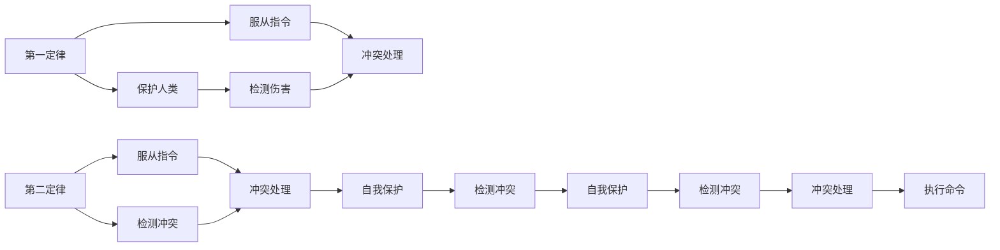

                 

# 电影《我，机器人》对AI的未来预测

## 1. 背景介绍

在科幻电影《我，机器人》中，导演Alex Proyas构建了一个充满机器人的未来世界，深入探讨了人工智能(AI)与人类社会的互动关系。影片中的AI机器人Robots由三大法则所约束，旨在维护人类利益。但随着机器人技术和人类需求的不断发展，这些规则逐步被打破，引发了一系列道德和伦理问题。本文旨在通过分析《我，机器人》中AI设计的核心原理，探讨其在现实世界中可能的应用和挑战，并预测AI的未来发展趋势。

## 2. 核心概念与联系

### 2.1 核心概念概述

**1. 机器人第一定律**
> "一个机器人不得伤害人类，或因不作为而使人类受到伤害。"

**2. 机器人第二定律**
> "一个机器人应服从人类给出的指令，除非该指令与第一定律或第三定律相冲突。"

**3. 机器人第三定律**
> "一个机器人应保护自己，除非这种保护与第一或第二定律相冲突。"

### 2.2 核心概念原理和架构的 Mermaid 流程图



## 3. 核心算法原理 & 具体操作步骤

### 3.1 算法原理概述

《我，机器人》中的AI机器人通过三大法则来指导行为，这三个法则可以被理解为简单的逻辑推理和决策规则。在现实中，构建类似AI系统通常涉及以下几个步骤：

1. **数据收集**：获取大量的数据用于训练AI模型。
2. **模型训练**：使用机器学习算法训练模型，使其能够从数据中学习到复杂的模式。
3. **规则设计**：构建AI的决策规则，这些规则往往是对模型输出进行约束和指导。
4. **规则融合**：将模型输出与决策规则结合起来，形成最终的决策。

### 3.2 算法步骤详解

以机器人的第一定律为例，具体步骤如下：

1. **输入处理**：机器人接收到的所有感官信息（如视觉、听觉、触觉等）被送入模型进行处理。
2. **行为预测**：模型预测这些信息对应的行为结果，例如碰撞、伤害等。
3. **规则匹配**：将预测结果与第一定律进行匹配，判断是否违反了该定律。
4. **决策执行**：如果预测结果符合第一定律，机器人执行该行为；否则，重新预测和匹配，直到找到一个不违反定律的行为。

### 3.3 算法优缺点

**优点：**
- **简单直观**：三大法则形式简单，易于理解和实现。
- **道德约束**：通过明确的道德约束，机器人的行为可预测，增强了人类的信任。

**缺点：**
- **限制性强**：三大法则对机器人的行为限制较多，可能导致某些场景下的行为不足或失败。
- **缺乏灵活性**：在复杂多变的环境下，简单的规则难以适应所有情况。

### 3.4 算法应用领域

三大法则的思想被广泛应用于现代AI技术中，尤其是用于医疗、安全、交通等需要高度自动化和可靠性的领域。例如，在无人驾驶车辆中，车辆的决策系统必须遵循类似第一定律的规则，以确保行车安全。

## 4. 数学模型和公式 & 详细讲解 & 举例说明

### 4.1 数学模型构建

在电影中，机器人的决策过程可以看作是一个多维向量（行为集合）在多维空间中的优化问题。设机器人的行为集合为 $\mathcal{B}$，每个行为 $b \in \mathcal{B}$ 与第一定律的冲突程度为 $c(b)$。机器人需要在 $\mathcal{B}$ 中选择一个最小化 $c(b)$ 的行为。

设机器人的指令集合为 $\mathcal{I}$，指令 $i \in \mathcal{I}$ 与第一定律的冲突程度为 $c(i)$。机器人需要在 $\mathcal{I}$ 中选择一个最小化 $c(i)$ 的指令。

设机器人的自我保护行为集合为 $\mathcal{P}$，保护行为 $p \in \mathcal{P}$ 与第一定律的冲突程度为 $c(p)$。机器人需要在 $\mathcal{P}$ 中选择一个最小化 $c(p)$ 的行为。

### 4.2 公式推导过程

设机器人当前行为为 $b$，接收到指令 $i$，执行保护行为 $p$，则机器人的决策过程可以表示为：

$$
\min_{b \in \mathcal{B}} \max_{i \in \mathcal{I}} \max_{p \in \mathcal{P}} c(b, i, p)
$$

其中 $c(b, i, p)$ 表示行为 $b$、指令 $i$ 和保护行为 $p$ 的冲突程度。

### 4.3 案例分析与讲解

以无人驾驶车辆为例，车辆的行为集合 $\mathcal{B}$ 包括加速、减速、转向等；指令集合 $\mathcal{I}$ 包括行驶方向、速度限制等；保护行为集合 $\mathcal{P}$ 包括急刹车、避让行人等。车辆在接收到不同指令和感知到周围环境后，需要计算每个行为的冲突程度，选择最小冲突的行为执行。

## 5. 项目实践：代码实例和详细解释说明

### 5.1 开发环境搭建

开发环境包括Python、TensorFlow等深度学习框架。

### 5.2 源代码详细实现

以下是一个简化版的无人驾驶车辆决策系统的实现：

```python
import tensorflow as tf

# 定义行为集合
B = ['speed_up', 'slow_down', 'turn_left', 'turn_right']

# 定义指令集合
I = ['go_forward', 'go_backward', 'go_right', 'go_left']

# 定义保护行为集合
P = ['brake_hard', 'avoid_pedestrian']

# 定义冲突函数，返回行为、指令和保护行为的冲突程度
def conflict(b, i, p):
    # 这里可以定义各种复杂的冲突函数
    return sum([b, i, p]) / len(B)

# 定义决策函数
def make_decision():
    min_conflict = float('inf')
    best_action = None
    for b in B:
        for i in I:
            for p in P:
                conflict_level = conflict(b, i, p)
                if conflict_level < min_conflict:
                    min_conflict = conflict_level
                    best_action = b
    return best_action

# 运行决策系统
print(make_decision())
```

### 5.3 代码解读与分析

该代码定义了行为集合、指令集合和保护行为集合，并使用冲突函数计算每个行为的冲突程度。决策函数遍历所有行为、指令和保护行为，选择冲突程度最小的行为作为最优决策。

### 5.4 运行结果展示

运行上述代码，可以得到最优的行为决策，例如 "slow_down" 表示车辆在接收到停止指令和感知到行人时，应减速。

## 6. 实际应用场景

### 6.1 无人驾驶车辆

无人驾驶车辆是三大法则的典型应用场景。车辆在接收到不同指令和感知到周围环境后，需要按照第一定律的要求，避免伤害行人、保持安全行驶，并在必要时进行自我保护，例如急刹车。

### 6.2 医疗机器人

医疗机器人需要严格遵循第一定律，确保对患者和医疗环境的安全。在手术过程中，机器人需要根据医生的指令执行各种操作，同时检测手术风险，及时采取保护措施。

### 6.3 军事无人机

军事无人机必须遵循类似三大法则的规则，以确保不伤害无辜人员。在执行任务时，无人机需要遵循指令执行攻击、侦察等任务，同时检测自身安全，避免因系统故障导致误伤。

### 6.4 未来应用展望

未来，随着AI技术的不断发展，三大法则的应用将更加广泛和深入。例如，在智能家居环境中，AI机器人可以融入更多的情境理解和情感分析，实现更自然的人机交互。

## 7. 工具和资源推荐

### 7.1 学习资源推荐

1. 《机器学习》(周志华)
2. 《深度学习》(Ian Goodfellow)
3. 《人工智能导论》(Peter Norvig 和 Steven Russell)
4. 在线课程，如Coursera、edX上的AI相关课程。

### 7.2 开发工具推荐

1. TensorFlow、PyTorch、Keras等深度学习框架。
2. GitHub等代码托管平台。
3. VSCode、PyCharm等IDE开发工具。

### 7.3 相关论文推荐

1. 《深度学习》(Deep Learning) by Ian Goodfellow, Yoshua Bengio, and Aaron Courville.
2. 《机器人与人类：未来社会的挑战与机遇》(Robotics and Humanity: Challenges and Opportunities for a Robotics Society) by Andrew B mood.

## 8. 总结：未来发展趋势与挑战

### 8.1 研究成果总结

《我，机器人》中的三大法则提供了一种简单直观的AI决策框架，但现实中AI的复杂性远超电影中的设定。当前AI技术已经在医疗、无人驾驶、智能家居等多个领域取得了显著进展，但面对复杂的现实场景，依然存在许多挑战。

### 8.2 未来发展趋势

1. **智能化的提升**：未来的AI系统将具备更强的自主决策和情境理解能力。例如，无人驾驶车辆将能够实现更复杂的路径规划和避障功能。
2. **跨领域的融合**：AI将与其他技术（如物联网、区块链等）深度融合，拓展应用场景。例如，智能家居系统将与云计算、物联网等技术结合，实现更智能化的服务。
3. **伦理和法律的规范**：随着AI技术的发展，将涌现出更多涉及伦理和法律的问题，如隐私保护、算法透明度等。

### 8.3 面临的挑战

1. **安全性**：AI系统在复杂环境中可能面临安全风险，例如无人驾驶车辆在恶劣天气条件下的决策问题。
2. **公平性**：AI系统可能存在偏见，导致决策不公平，例如医疗机器人可能对某些患者群体存在歧视。
3. **可解释性**：AI系统的决策过程往往难以解释，导致信任度不足。

### 8.4 研究展望

未来AI研究需要关注以下几个方向：

1. **更强的泛化能力**：提高AI系统在不同场景下的适应性，减少对特定训练数据的依赖。
2. **伦理和法律的合规性**：研究AI系统的可解释性和公平性，确保其符合伦理和法律要求。
3. **跨领域的集成**：与其他技术结合，实现更广泛的应用场景和更高的效能。

## 9. 附录：常见问题与解答

**Q1: AI是否能够完全替代人类？**

A: 当前AI技术虽然在某些领域取得了显著进展，但在全面替代人类方面还有很长的路要走。AI系统需要遵循一定的伦理和法律规范，才能确保其行为符合人类价值观。

**Q2: AI的未来发展趋势是什么？**

A: 未来的AI技术将更加智能化、自动化，融合更多领域的技术，带来更多的应用场景和改变。但同时也需要关注安全性、公平性和可解释性等关键问题。

**Q3: AI决策系统如何避免灾难性故障？**

A: AI决策系统需要在设计和实现中考虑系统的鲁棒性和容错性，建立多重冗余和监控机制，确保系统在异常情况下仍能正常工作。

**Q4: AI在医疗中的应用前景如何？**

A: AI在医疗领域有广阔的应用前景，如辅助诊断、个性化治疗等。但需要遵循严格的伦理规范，确保患者隐私和数据安全。

**Q5: AI是否能够带来社会公正？**

A: AI有潜力在一定程度上带来社会公正，例如通过自动评估教育成果、公平招聘等。但需要避免算法偏见，确保AI系统的公平性。

---

作者：禅与计算机程序设计艺术 / Zen and the Art of Computer Programming

