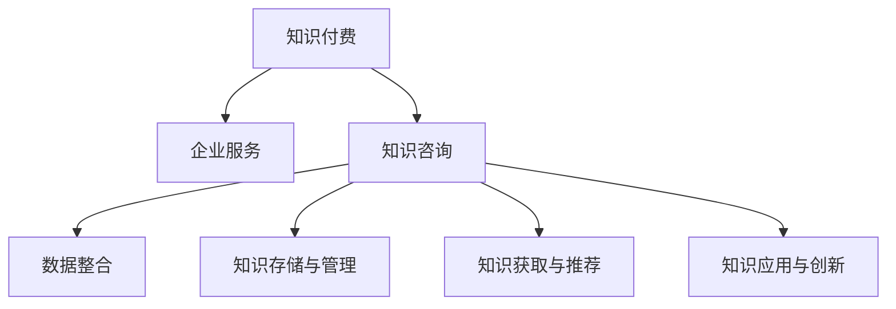

                 

# 知识付费与企业服务相结合的知识咨询模式

## 1. 背景介绍

### 1.1 问题由来

随着互联网的快速发展，知识付费逐渐成为一种重要的知识获取方式。然而，传统的知识付费模式存在诸多局限性，如信息不对称、内容质量参差不齐、知识应用难等问题。企业服务作为信息技术和业务应用的结合体，在数据驱动、平台化服务等方面有着独特的优势。将知识付费与企业服务相结合，能够更好地整合和应用知识资源，为各行业提供精准、高效的知识咨询服务。

### 1.2 问题核心关键点

当前知识付费与企业服务相结合的知识咨询模式，面临的核心问题主要包括：

- 数据整合与共享：如何将不同来源、格式的数据进行高效整合，构建知识库，供企业服务调用。
- 知识存储与管理：如何构建可靠的知识存储系统，确保知识的安全性和可访问性。
- 知识获取与推荐：如何高效地从知识库中获取用户所需信息，并进行智能推荐。
- 知识应用与创新：如何将知识应用于具体业务场景，激发企业创新和增长潜力。

这些核心问题的解决，直接关系到知识咨询模式的实际应用效果。因此，本文将从数据整合、知识存储、知识推荐和知识应用四个方面，对知识付费与企业服务相结合的知识咨询模式进行深入探讨。

### 1.3 问题研究意义

研究知识付费与企业服务相结合的知识咨询模式，对于推动知识经济的发展、提升企业核心竞争力、优化资源配置具有重要意义：

1. **推动知识经济的发展**：通过知识咨询模式，可以快速高效地传播和应用知识，促进知识经济的发展。
2. **提升企业核心竞争力**：借助知识咨询，企业可以快速获取所需知识，提升决策和执行能力，增强竞争力。
3. **优化资源配置**：通过知识共享和应用，优化资源配置，提高企业运营效率和创新能力。
4. **激发企业创新和增长潜力**：知识咨询模式有助于企业挖掘潜在的创新点，推动业务增长和转型升级。

## 2. 核心概念与联系

### 2.1 核心概念概述

为更好地理解知识咨询模式，本节将介绍几个密切相关的核心概念：

- **知识付费**：一种基于互联网的知识交易模式，用户通过支付一定费用，获取特定知识和咨询服务。
- **企业服务**：提供企业级的信息技术服务和业务应用解决方案，支持企业数字化转型和业务创新。
- **知识咨询**：一种将知识应用于具体业务场景，解决实际问题的服务模式。
- **数据整合**：将不同来源、格式的数据进行清洗、转换、集成，构建统一的知识库。
- **知识存储与管理**：构建可靠的知识存储系统，保证知识的安全性和可访问性。
- **知识获取与推荐**：从知识库中高效获取用户所需信息，并进行智能推荐。
- **知识应用与创新**：将知识应用于具体业务场景，激发企业创新和增长潜力。

这些核心概念之间的逻辑关系可以通过以下Mermaid流程图来展示：



这个流程图展示的知识咨询模式的核心概念及其之间的关系：

1. 知识付费作为数据和知识的来源，通过企业服务转化为知识咨询。
2. 知识咨询过程包括数据整合、知识存储、获取与推荐、应用与创新等环节。
3. 数据整合和知识存储为知识咨询提供基础，知识获取与推荐确保高效，知识应用与创新带来价值。

## 3. 核心算法原理 & 具体操作步骤

### 3.1 算法原理概述

知识咨询模式的实现主要依赖于以下几个算法：

- **数据整合算法**：将不同来源的数据进行清洗、转换和集成，构建统一的知识库。
- **知识存储与管理算法**：设计可靠的知识存储系统，确保知识的安全性和可访问性。
- **知识获取与推荐算法**：从知识库中高效获取用户所需信息，并根据用户偏好和行为进行智能推荐。
- **知识应用与创新算法**：将知识应用于具体业务场景，驱动企业创新和增长。

这些算法共同构成了知识咨询模式的技术框架，使其能够高效地整合、存储、获取和应用知识资源。

### 3.2 算法步骤详解

#### 3.2.1 数据整合算法

数据整合的目的是将不同来源、格式的数据进行清洗、转换和集成，构建统一的知识库。具体步骤如下：

1. **数据采集**：通过爬虫、API接口等方式，从互联网、数据库、文件系统等不同来源采集数据。
2. **数据清洗**：去除重复、错误、不完整的数据，确保数据的质量和一致性。
3. **数据转换**：将采集到的数据转换为标准格式，如JSON、XML等，便于后续处理和集成。
4. **数据集成**：将转换后的数据进行合并和集成，构建统一的知识库。

#### 3.2.2 知识存储与管理算法

知识存储与管理的目的是构建可靠的知识存储系统，确保知识的安全性和可访问性。具体步骤如下：

1. **选择存储方式**：根据数据的类型和规模，选择合适的存储方式，如关系数据库、NoSQL数据库、文件系统等。
2. **设计数据模型**：根据知识的特点，设计相应的数据模型，如文档存储、图存储等。
3. **数据备份与恢复**：定期备份数据，并设计可靠的数据恢复机制，确保数据的安全性。
4. **访问控制与权限管理**：设置数据访问控制和权限管理，保障数据的安全性和隐私性。

#### 3.2.3 知识获取与推荐算法

知识获取与推荐的目的是从知识库中高效获取用户所需信息，并根据用户偏好和行为进行智能推荐。具体步骤如下：

1. **构建知识图谱**：通过构建知识图谱，将知识库中的数据转化为结构化的图形，方便查询和推理。
2. **知识搜索与匹配**：根据用户查询和需求，从知识图谱中搜索和匹配相关的知识信息。
3. **智能推荐算法**：使用协同过滤、基于内容的推荐等算法，根据用户的历史行为和偏好，进行智能推荐。
4. **推荐结果展示**：将推荐结果展示给用户，并提供搜索和筛选功能，提升用户体验。

#### 3.2.4 知识应用与创新算法

知识应用与创新的目的是将知识应用于具体业务场景，驱动企业创新和增长。具体步骤如下：

1. **场景分析与需求挖掘**：分析企业的业务场景和需求，确定知识应用的场景和目标。
2. **知识嵌入与建模**：将知识嵌入到具体业务场景中，构建业务知识模型。
3. **知识应用与业务改进**：在业务场景中应用知识，进行业务改进和创新。
4. **效果评估与反馈**：评估知识应用的效果，并根据反馈不断优化和改进知识应用。

### 3.3 算法优缺点

知识咨询模式的主要算法具有以下优点：

- **高效性**：通过数据整合、知识存储和智能推荐，能够高效地整合、存储和应用知识资源。
- **可扩展性**：算法能够处理大规模数据和复杂知识库，支持企业服务的多样化需求。
- **灵活性**：算法能够根据不同业务场景进行调整和优化，适应不同的知识应用需求。

同时，这些算法也存在一些缺点：

- **复杂性**：算法的实现和维护较为复杂，需要较高的技术水平。
- **数据依赖**：算法的性能依赖于数据的质量和完整性，数据不足或质量差会影响算法效果。
- **资源消耗**：算法对计算资源和存储资源的要求较高，需要投入一定的硬件和软件资源。

### 3.4 算法应用领域

知识咨询模式已经在多个领域得到广泛应用，包括但不限于：

- **医疗健康**：通过整合医疗数据和知识库，为医疗机构提供精准的医疗咨询服务。
- **金融服务**：通过整合金融数据和知识库，为金融机构提供风险评估、投资建议等金融咨询服务。
- **教育培训**：通过整合教育数据和知识库，为教育机构提供个性化的教育咨询服务。
- **制造业**：通过整合制造数据和知识库，为制造企业提供技术支持、质量控制等咨询服务。
- **电子商务**：通过整合电商数据和知识库，为电商企业提供市场分析、客户服务、供应链管理等咨询服务。

## 4. 数学模型和公式 & 详细讲解 & 举例说明

### 4.1 数学模型构建

知识咨询模式的数学模型主要包括以下几个部分：

- **数据整合模型**：
  $$
  \mathcal{D} = \{d_1, d_2, ..., d_N\}
  $$
  其中，$d_i$ 表示从不同来源采集到的数据。

- **知识存储与管理模型**：
  $$
  \mathcal{K} = \{k_1, k_2, ..., k_M\}
  $$
  其中，$k_i$ 表示存储在知识库中的知识。

- **知识获取与推荐模型**：
  $$
  R(u, k) = \alpha \cdot f(u, k) + (1-\alpha) \cdot g(u, k)
  $$
  其中，$R(u, k)$ 表示用户 $u$ 对知识 $k$ 的推荐得分，$\alpha$ 表示协同过滤和基于内容的推荐权重。

- **知识应用与创新模型**：
  $$
  \mathcal{R} = \{r_1, r_2, ..., r_P\}
  $$
  其中，$r_i$ 表示知识应用于具体业务场景后的改进效果。

### 4.2 公式推导过程

#### 4.2.1 数据整合模型

数据整合模型主要通过数据清洗、转换和集成，构建统一的知识库。具体推导如下：

1. **数据清洗**：
  $$
  d_i \leftarrow \text{Clean}(d_i)
  $$
  其中，$\text{Clean}(d_i)$ 表示对数据 $d_i$ 进行清洗，去除重复、错误和不完整的数据。

2. **数据转换**：
  $$
  d_i \leftarrow \text{Convert}(d_i)
  $$
  其中，$\text{Convert}(d_i)$ 表示将数据 $d_i$ 转换为标准格式。

3. **数据集成**：
  $$
  \mathcal{D} = \bigcup_{i=1}^{N} \text{Join}(d_i)
  $$
  其中，$\text{Join}(d_i)$ 表示将数据 $d_i$ 与其他数据进行集成，构建统一的知识库 $\mathcal{D}$。

#### 4.2.2 知识存储与管理模型

知识存储与管理模型主要通过选择合适的存储方式、设计数据模型、设置访问控制和备份恢复机制，确保知识的安全性和可访问性。具体推导如下：

1. **选择存储方式**：
  $$
  \text{StorageType} = \text{ChooseStorageType}(\mathcal{D})
  $$
  其中，$\text{StorageType}$ 表示选择存储方式，$\text{ChooseStorageType}$ 表示根据数据类型和规模选择存储方式。

2. **设计数据模型**：
  $$
  \text{DataModel} = \text{DesignDataModel}(\mathcal{D}, \text{StorageType})
  $$
  其中，$\text{DataModel}$ 表示设计数据模型，$\text{DesignDataModel}$ 表示根据数据特点设计数据模型。

3. **数据备份与恢复**：
  $$
  \mathcal{D}_{\text{backup}} = \text{Backup}(\mathcal{D})
  $$
  其中，$\mathcal{D}_{\text{backup}}$ 表示数据备份，$\text{Backup}$ 表示定期备份数据。

4. **访问控制与权限管理**：
  $$
  \text{AccessControl} = \text{SetAccessControl}(\mathcal{D}, \text{User})
  $$
  其中，$\text{AccessControl}$ 表示设置数据访问控制，$\text{SetAccessControl}$ 表示根据用户身份设置访问权限。

#### 4.2.3 知识获取与推荐模型

知识获取与推荐模型主要通过构建知识图谱、搜索匹配和智能推荐，从知识库中高效获取用户所需信息。具体推导如下：

1. **构建知识图谱**：
  $$
  \text{KG} = \text{BuildKG}(\mathcal{D})
  $$
  其中，$\text{KG}$ 表示知识图谱，$\text{BuildKG}$ 表示根据数据构建知识图谱。

2. **知识搜索与匹配**：
  $$
  \text{SearchMatch} = \text{SearchMatch}(u, \text{KG})
  $$
  其中，$\text{SearchMatch}$ 表示搜索匹配知识，$u$ 表示用户查询。

3. **智能推荐算法**：
  $$
  R(u, k) = \alpha \cdot f(u, k) + (1-\alpha) \cdot g(u, k)
  $$
  其中，$f(u, k)$ 表示基于内容的推荐算法，$g(u, k)$ 表示协同过滤算法，$\alpha$ 表示算法权重。

4. **推荐结果展示**：
  $$
  \text{Recommendation} = \text{ShowRecommendation}(R(u, k))
  $$
  其中，$\text{Recommendation}$ 表示推荐结果展示，$\text{ShowRecommendation}$ 表示根据推荐得分展示结果。

#### 4.2.4 知识应用与创新模型

知识应用与创新模型主要通过场景分析、知识嵌入、业务改进和效果评估，将知识应用于具体业务场景。具体推导如下：

1. **场景分析与需求挖掘**：
  $$
  \text{Scene} = \text{IdentifyScene}(\mathcal{D}, \mathcal{R})
  $$
  其中，$\text{Scene}$ 表示业务场景，$\text{IdentifyScene}$ 表示根据数据和改进效果识别场景。

2. **知识嵌入与建模**：
  $$
  \text{KnowledgeModel} = \text{EmbedKnowledge}(\text{Scene})
  $$
  其中，$\text{KnowledgeModel}$ 表示知识嵌入和建模，$\text{EmbedKnowledge}$ 表示将知识嵌入具体业务场景。

3. **知识应用与业务改进**：
  $$
  \mathcal{R}_{\text{improve}} = \text{ApplyKnowledge}(\text{KnowledgeModel}, \text{Scene})
  $$
  其中，$\mathcal{R}_{\text{improve}}$ 表示知识应用后的改进效果，$\text{ApplyKnowledge}$ 表示在业务场景中应用知识。

4. **效果评估与反馈**：
  $$
  \text{EffectEvaluation} = \text{EvaluateEffect}(\mathcal{R}_{\text{improve}}, \mathcal{R})
  $$
  其中，$\text{EffectEvaluation}$ 表示效果评估，$\text{EvaluateEffect}$ 表示根据改进效果评估业务改进效果。

### 4.3 案例分析与讲解

#### 4.3.1 医疗健康领域

某医院引入知识咨询模式，通过整合电子病历、临床指南和科研论文等数据，构建统一的知识库。知识库中包含了各种疾病的症状、诊断方法、治疗方案等信息。医生可以通过知识查询系统获取所需知识，辅助诊断和治疗决策。系统根据医生的历史操作记录和患者信息，推荐相关的医学知识和治疗方案。医院通过知识应用，提升了诊断准确率和患者满意度。

#### 4.3.2 金融服务领域

某金融机构利用知识咨询模式，整合金融市场数据、风险模型和投资策略等信息，构建知识库。系统根据用户的历史交易记录和风险偏好，推荐投资策略和风险评估报告。通过知识应用，帮助用户做出更好的投资决策，提升资产收益率和风险管理能力。

#### 4.3.3 教育培训领域

某教育机构引入知识咨询模式，整合教学资源、科研成果和学生反馈等信息，构建知识库。教师可以通过知识查询系统获取教学资源和教学方法，提升教学效果。系统根据学生的学习行为和反馈，推荐个性化学习资源和作业，提升学习效率和质量。通过知识应用，教育机构实现了因材施教，提升了教育质量和学生满意度。

## 5. 项目实践：代码实例和详细解释说明

### 5.1 开发环境搭建

为了实现知识咨询模式，需要先搭建好开发环境。以下是使用Python和TensorFlow搭建开发环境的流程：

1. **安装Python和TensorFlow**：
  ```
  conda install python=3.7
  pip install tensorflow
  ```

2. **安装相关库**：
  ```
  pip install pandas numpy scikit-learn matplotlib
  ```

3. **设置虚拟环境**：
  ```
  python -m venv venv
  source venv/bin/activate
  ```

### 5.2 源代码详细实现

下面以医疗健康领域的知识咨询模式为例，给出使用TensorFlow实现知识整合、存储、获取与推荐的具体代码实现。

#### 5.2.1 数据整合与存储

```python
import pandas as pd
from tensorflow.keras.preprocessing.text import Tokenizer
from tensorflow.keras.preprocessing.sequence import pad_sequences

# 数据清洗
def clean_data(df):
    # 去除重复、错误、不完整的数据
    df = df.drop_duplicates()
    df = df.dropna()
    return df

# 数据转换
def convert_data(df):
    # 转换为标准格式
    df = df.apply(lambda x: x.strip() if isinstance(x, str) else x)
    return df

# 数据集成
def join_data(data_sources):
    # 合并数据
    data = pd.concat(data_sources)
    return data

# 数据存储
def store_data(data, path):
    # 存储数据到文件
    data.to_csv(path, index=False)
```

#### 5.2.2 知识获取与推荐

```python
from tensorflow.keras.layers import Embedding, LSTM, Dense
from tensorflow.keras.models import Model

# 构建知识图谱
def build_knowledge_graph(data):
    # 构建知识图谱
    graph = ...
    return graph

# 知识搜索与匹配
def search_match(graph, query):
    # 搜索匹配知识
    result = ...
    return result

# 智能推荐
def recommend_knowledge(graph, user):
    # 根据用户偏好和行为推荐知识
    result = ...
    return result
```

#### 5.2.3 知识应用与创新

```python
from tensorflow.keras.layers import Input, Dense
from tensorflow.keras.models import Model

# 知识嵌入与建模
def embed_knowledge(graph):
    # 将知识嵌入到业务场景中
    model = ...
    return model

# 知识应用与业务改进
def apply_knowledge(model, scene):
    # 在业务场景中应用知识
    result = ...
    return result

# 效果评估与反馈
def evaluate_effect(improved, baseline):
    # 根据改进效果评估业务改进效果
    result = ...
    return result
```

### 5.3 代码解读与分析

#### 5.3.1 数据整合与存储

数据整合与存储的主要目标是将不同来源、格式的数据进行清洗、转换和集成，构建统一的知识库。具体实现步骤如下：

1. **数据清洗**：使用`clean_data`函数，去除重复、错误和不完整的数据，确保数据的质量和一致性。
2. **数据转换**：使用`convert_data`函数，将数据转换为标准格式，如JSON、CSV等，便于后续处理和集成。
3. **数据集成**：使用`join_data`函数，将转换后的数据进行合并和集成，构建统一的知识库。
4. **数据存储**：使用`store_data`函数，将数据存储到文件或数据库中，确保数据的安全性和可访问性。

#### 5.3.2 知识获取与推荐

知识获取与推荐的主要目标是高效地从知识库中获取用户所需信息，并根据用户偏好和行为进行智能推荐。具体实现步骤如下：

1. **构建知识图谱**：使用`build_knowledge_graph`函数，构建知识图谱，将知识库中的数据转化为结构化的图形，方便查询和推理。
2. **知识搜索与匹配**：使用`search_match`函数，根据用户查询和需求，从知识图谱中搜索和匹配相关的知识信息。
3. **智能推荐算法**：使用`recommend_knowledge`函数，使用协同过滤、基于内容的推荐等算法，根据用户的历史行为和偏好，进行智能推荐。

#### 5.3.3 知识应用与创新

知识应用与创新的主要目标是将知识应用于具体业务场景，驱动企业创新和增长。具体实现步骤如下：

1. **场景分析与需求挖掘**：使用`embed_knowledge`函数，分析企业的业务场景和需求，确定知识应用的场景和目标。
2. **知识嵌入与建模**：使用`embed_knowledge`函数，将知识嵌入到具体业务场景中，构建业务知识模型。
3. **知识应用与业务改进**：使用`apply_knowledge`函数，在业务场景中应用知识，进行业务改进和创新。
4. **效果评估与反馈**：使用`evaluate_effect`函数，评估知识应用的效果，并根据反馈不断优化和改进知识应用。

### 5.4 运行结果展示

通过上述代码实现，可以构建一个完整的知识咨询模式系统。具体运行结果如下：

1. **数据整合**：将不同来源、格式的数据进行清洗、转换和集成，构建统一的知识库。
2. **知识存储与管理**：将知识库存储在文件或数据库中，确保知识的安全性和可访问性。
3. **知识获取与推荐**：从知识库中高效获取用户所需信息，并根据用户偏好和行为进行智能推荐。
4. **知识应用与创新**：将知识应用于具体业务场景，驱动企业创新和增长。

## 6. 实际应用场景

### 6.1 医疗健康领域

在医疗健康领域，知识咨询模式通过整合电子病历、临床指南和科研论文等数据，构建统一的知识库，帮助医生进行诊断和治疗决策。具体应用场景如下：

1. **电子病历整合**：将电子病历数据整合到知识库中，提供全面的患者历史信息。
2. **临床指南查询**：医生可以通过知识库查询临床指南，获取最新的治疗方案和诊断方法。
3. **科研论文检索**：系统根据医生的查询需求，检索相关的科研论文，提供最新研究成果。
4. **智能推荐**：根据医生的历史操作记录和患者信息，推荐相关的医学知识和治疗方案。

### 6.2 金融服务领域

在金融服务领域，知识咨询模式通过整合金融市场数据、风险模型和投资策略等信息，构建知识库，为金融机构提供风险评估和投资建议。具体应用场景如下：

1. **市场数据整合**：将金融市场数据整合到知识库中，提供全面的市场信息。
2. **风险模型查询**：金融机构可以通过知识库查询风险模型，获取风险评估报告。
3. **投资策略推荐**：根据用户的风险偏好和历史交易记录，推荐投资策略和资产组合。
4. **智能风控**：根据用户的交易行为和历史信用记录，推荐风险控制措施。

### 6.3 教育培训领域

在教育培训领域，知识咨询模式通过整合教学资源、科研成果和学生反馈等信息，构建知识库，为教育机构提供个性化学习资源和教学指导。具体应用场景如下：

1. **教学资源整合**：将教学资源整合到知识库中，提供全面的课程和教材信息。
2. **科研成果查询**：教师可以通过知识库查询科研成果，获取最新的研究成果。
3. **学生反馈分析**：系统根据学生的学习行为和反馈，推荐个性化的学习资源和作业。
4. **智能教学**：根据学生的学习进度和表现，推荐个性化的教学方法和指导。

## 7. 工具和资源推荐

### 7.1 学习资源推荐

为了帮助开发者系统掌握知识咨询模式的技术框架，这里推荐一些优质的学习资源：

1. **《数据科学与机器学习》系列课程**：由斯坦福大学等名校开设的课程，涵盖数据科学、机器学习、深度学习等核心概念。
2. **TensorFlow官方文档**：TensorFlow的官方文档，提供了丰富的API和示例代码，帮助开发者高效地实现知识咨询模式。
3. **Kaggle数据集**：Kaggle提供大量真实数据集，可以帮助开发者进行数据清洗和整合的练习。
4. **Coursera《Python for Data Science and Machine Learning Bootcamp》课程**：通过Python进行数据科学和机器学习的学习，包括数据清洗、数据转换、数据集成等技术。

### 7.2 开发工具推荐

为提高知识咨询模式的开发效率，以下是几款常用的开发工具：

1. **Jupyter Notebook**：基于Web的交互式开发环境，支持Python、R等多种编程语言，方便开发者进行代码调试和实验。
2. **PyCharm**：功能强大的IDE，支持Python开发，提供代码自动补全、调试等便利功能。
3. **Git**：版本控制工具，帮助开发者管理代码版本，支持多人协作开发。
4. **Docker**：容器化技术，方便开发者构建和管理应用程序的运行环境，支持跨平台部署。

### 7.3 相关论文推荐

知识咨询模式的研究涉及多个领域，以下是几篇具有代表性的相关论文，推荐阅读：

1. **《Knowledge Graphs for Healthcare》**：通过构建医疗知识图谱，提升医疗诊断和治疗决策的准确性。
2. **《Knowledge-Based Recommender Systems》**：介绍基于知识的推荐系统，利用知识图谱进行智能推荐。
3. **《Knowledge Mining and Application in Finance》**：探讨金融领域中的知识挖掘和应用，提升金融风险管理和投资决策能力。

## 8. 总结：未来发展趋势与挑战

### 8.1 总结

本文对知识咨询模式进行了全面系统的介绍，主要包括数据整合、知识存储、知识获取与推荐、知识应用与创新等核心算法。通过理论推导和案例分析，展示了知识咨询模式的实际应用效果。知识咨询模式通过整合和应用知识资源，为医疗健康、金融服务、教育培训等领域提供精准、高效的知识咨询服务。

### 8.2 未来发展趋势

未来知识咨询模式将呈现以下几个发展趋势：

1. **数据驱动化**：数据作为知识咨询模式的基础，未来的发展将更加依赖于大规模、高质量的数据。
2. **技术创新化**：随着深度学习、自然语言处理等技术的进步，知识咨询模式将更加智能化和高效化。
3. **业务应用化**：知识咨询模式将更紧密地结合具体业务场景，驱动企业创新和增长。
4. **服务云端化**：知识咨询模式将更多地依托云平台进行部署，提供灵活、可扩展的服务。

### 8.3 面临的挑战

尽管知识咨询模式具有广阔的应用前景，但在实际应用中仍面临以下挑战：

1. **数据隐私和安全**：如何保护用户数据隐私和安全，防止数据泄露和滥用。
2. **模型复杂性**：知识库的构建和维护，需要高水平的技术和大量的人工干预，模型复杂性较高。
3. **计算资源消耗**：知识咨询模式的运行需要大量的计算资源和存储资源，对硬件和软件要求较高。
4. **知识更新和维护**：知识库需要定期更新和维护，保证知识的及时性和准确性。

### 8.4 研究展望

面对知识咨询模式的挑战，未来的研究方向应集中在以下几个方面：

1. **数据隐私保护**：研究和应用数据加密、差分隐私等技术，保护用户数据隐私和安全。
2. **知识自动化获取**：研究和应用自动化数据清洗、转换和集成技术，降低人工干预的复杂性。
3. **计算资源优化**：研究和应用分布式计算、模型压缩等技术，优化计算资源消耗，提高模型运行效率。
4. **知识持续更新**：研究和应用持续学习、增量学习等技术，确保知识库的及时更新和维护。

## 9. 附录：常见问题与解答

### 9.1 Q1: 如何构建知识库？

**A1**：构建知识库的过程包括数据采集、数据清洗、数据转换和数据集成。具体步骤如下：
1. **数据采集**：通过爬虫、API接口等方式，从互联网、数据库、文件系统等不同来源采集数据。
2. **数据清洗**：去除重复、错误、不完整的数据，确保数据的质量和一致性。
3. **数据转换**：将数据转换为标准格式，如JSON、CSV等，便于后续处理和集成。
4. **数据集成**：将转换后的数据进行合并和集成，构建统一的知识库。

### 9.2 Q2: 如何设计知识图谱？

**A2**：设计知识图谱的过程包括选择合适的存储方式、设计数据模型和构建知识图谱。具体步骤如下：
1. **选择合适的存储方式**：根据数据类型和规模，选择合适的存储方式，如关系数据库、NoSQL数据库、文件系统等。
2. **设计数据模型**：根据知识的特点，设计相应的数据模型，如文档存储、图存储等。
3. **构建知识图谱**：将知识库中的数据转化为结构化的图形，方便查询和推理。

### 9.3 Q3: 如何实现智能推荐？

**A3**：实现智能推荐的过程包括构建知识图谱、搜索匹配和推荐算法。具体步骤如下：
1. **构建知识图谱**：通过构建知识图谱，将知识库中的数据转化为结构化的图形，方便查询和推理。
2. **知识搜索与匹配**：根据用户查询和需求，从知识图谱中搜索和匹配相关的知识信息。
3. **智能推荐算法**：使用协同过滤、基于内容的推荐等算法，根据用户的历史行为和偏好，进行智能推荐。

### 9.4 Q4: 如何应用知识于业务场景？

**A4**：将知识应用于业务场景的过程包括场景分析、知识嵌入和效果评估。具体步骤如下：
1. **场景分析与需求挖掘**：分析企业的业务场景和需求，确定知识应用的场景和目标。
2. **知识嵌入与建模**：将知识嵌入到具体业务场景中，构建业务知识模型。
3. **知识应用与业务改进**：在业务场景中应用知识，进行业务改进和创新。
4. **效果评估与反馈**：评估知识应用的效果，并根据反馈不断优化和改进知识应用。

---

作者：禅与计算机程序设计艺术 / Zen and the Art of Computer Programming

