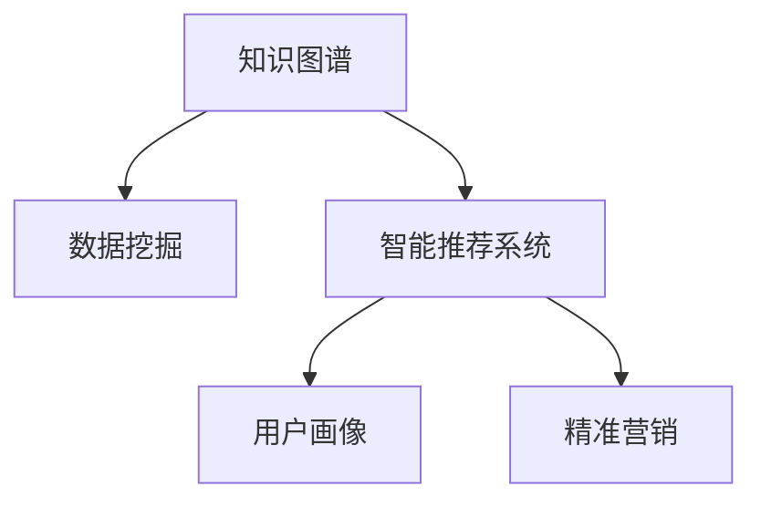

                 

# 知识付费与创新创业相结合的知识加速器

> 关键词：知识付费, 创新创业, 知识加速器, 知识图谱, 数据挖掘, 智能推荐, 用户画像, 精准营销

## 1. 背景介绍

### 1.1 问题由来
随着互联网技术的快速发展，信息传播的门槛越来越低，知识获取的渠道日益增多，但用户在海量信息中甄别高质量内容的能力并未同步提升。在此背景下，知识付费平台应运而生，为有需求的用户提供高质量、高效率的知识服务。然而，传统的知识付费模式主要依赖人工筛选与推荐，存在内容同质化、精准度不足等问题。

为了解决上述问题，知识付费平台开始探索与创新创业的深度结合，通过引入大数据、人工智能等前沿技术，提升内容推荐的智能程度和个性化水平，打造知识加速器，实现对用户需求精准匹配与高效服务。

### 1.2 问题核心关键点
知识加速器基于大数据与人工智能技术，构建智能化的内容推荐系统，提升知识付费的精准度与效率。其核心点在于：
1. 高效的知识图谱构建与维护：将海量知识结构化，形成易于检索、利用的知识网络。
2. 基于用户行为与兴趣的数据挖掘：精准捕捉用户需求，实现个性化推荐。
3. 知识图谱与数据挖掘技术的融合：利用图谱与数据挖掘的协同作用，生成更具深度与广度的推荐结果。
4. 持续的用户行为与反馈循环：通过不断迭代优化，增强推荐系统的适应性与精准度。

### 1.3 问题研究意义
构建高效、智能的知识加速器，对于促进知识付费平台的可持续发展，提升用户满意度，推动知识创新与创业进程具有重要意义：

1. 提升知识获取效率：通过精准的内容推荐，让用户以更短的时间获取更高质量的知识，提高学习与工作的效率。
2. 增强内容与用户的匹配度：基于用户行为与兴趣进行推荐，确保内容与用户需求的契合，提升用户黏性。
3. 促进知识付费平台的用户转化与留存：通过个性化服务，吸引更多用户，延长用户生命周期。
4. 加速知识传播与创新创业进程：知识加速器不仅传播知识，还通过智能匹配，促进知识与需求的对接，助力更多创新创业者实现价值。
5. 推动行业标准与规范的建立：在技术创新基础上，知识加速器为行业标准的制定与推广提供了有力支持。

## 2. 核心概念与联系

### 2.1 核心概念概述

为更好地理解知识加速器的工作原理和优化方向，本节将介绍几个密切相关的核心概念：

- **知识图谱(Knowledge Graph)**：一种结构化的知识表示方式，通过实体-关系-属性等节点，构建一个语义关联的网络图，用于存储、检索和分析知识。
- **数据挖掘(Data Mining)**：从数据中自动发现模式和知识的过程，应用于知识加速器中，用于挖掘用户行为、兴趣等隐含信息，实现个性化推荐。
- **智能推荐系统(Recommender System)**：基于用户行为和兴趣的模型，推荐用户可能感兴趣的内容或产品。知识加速器中的推荐系统即为智能推荐系统。
- **用户画像(User Profile)**：对用户行为、兴趣、需求等进行分析，形成详细的用户画像，用于指导个性化推荐。
- **精准营销(Exact Marketing)**：通过个性化推荐实现精准的目标用户定位，提升营销效果和用户转化率。

这些核心概念之间的逻辑关系可以通过以下Mermaid流程图来展示：



这个流程图展示了几者之间的关系：

1. 知识图谱是数据挖掘的基础，提供结构化的知识结构。
2. 数据挖掘从知识图谱中挖掘出用户行为和兴趣等隐含信息。
3. 智能推荐系统基于数据挖掘的结果，生成个性化的推荐内容。
4. 用户画像通过推荐系统生成的数据，对用户行为进行更全面的分析。
5. 精准营销利用推荐系统的推荐结果，实现精准的用户定位与转化。

## 3. 核心算法原理 & 具体操作步骤
### 3.1 算法原理概述

知识加速器的核心算法原理基于大规模知识图谱和用户画像的构建与利用，采用数据挖掘与智能推荐技术，实现个性化内容的精准推荐。其核心思想是：

1. **知识图谱构建与维护**：将领域内的知识进行结构化表示，形成可检索的网络图。
2. **数据挖掘与用户画像构建**：从知识图谱中挖掘用户行为、兴趣等信息，形成详细用户画像。
3. **智能推荐**：基于用户画像和知识图谱，生成个性化推荐内容，提供高效的知识服务。
4. **持续优化**：利用用户反馈与行为数据，持续优化推荐模型与知识图谱。

知识加速器的实现流程包括以下几个关键步骤：

- 第一步，构建知识图谱，存储与表示知识。
- 第二步，收集用户行为数据，挖掘用户画像。
- 第三步，构建推荐模型，生成个性化推荐。
- 第四步，优化推荐系统，提高推荐效果。
- 第五步，结合精准营销，提升用户转化。

### 3.2 算法步骤详解

**Step 1: 知识图谱构建**
- 定义实体与关系：如课程、作者、标签等。
- 存储实体与关系：如三元组<课程，作者，年份>等。
- 构建知识图谱：使用图数据库或图计算框架，构建知识图谱网络。

**Step 2: 用户行为数据收集**
- 定义行为指标：如阅读时间、收藏课程、购买记录等。
- 数据收集与存储：通过用户互动数据，记录用户的行为轨迹。
- 数据清洗与处理：去除噪声数据，保证数据质量。

**Step 3: 用户画像构建**
- 数据分析与挖掘：从行为数据中提取用户兴趣、偏好等特征。
- 画像生成与维护：形成动态更新的用户画像，支持个性化推荐。

**Step 4: 推荐模型构建**
- 定义推荐目标：如准确率、召回率、用户满意度等。
- 选择推荐算法：如协同过滤、基于内容的推荐、基于模型的推荐等。
- 模型训练与验证：使用历史数据训练推荐模型，验证模型效果。

**Step 5: 推荐系统优化**
- 模型迭代优化：不断根据用户反馈和行为数据优化推荐算法。
- 动态更新知识图谱：根据新的知识与行为数据，动态更新图谱内容。

**Step 6: 精准营销整合**
- 用户画像与营销结合：利用用户画像进行精准定位，提高转化率。
- 推荐结果的应用：将推荐内容应用于营销活动，提升用户转化与留存。

### 3.3 算法优缺点

知识加速器基于数据挖掘与智能推荐技术，具有以下优点：
1. 高效精准：通过知识图谱与用户画像的协同作用，实现个性化、精准的内容推荐。
2. 快速迭代：通过持续优化，不断提升推荐效果，适应用户需求变化。
3. 易于扩展：使用图谱与推荐算法，适应多种知识与业务场景。
4. 用户黏性高：基于个性化推荐，提升用户满意度和黏性。

同时，知识加速器也存在一些局限性：
1. 数据隐私问题：用户行为数据的收集与存储可能涉及隐私问题，需要严格遵守相关法规。
2. 数据质量要求高：数据质量直接影响推荐效果，数据收集与清洗的难度较大。
3. 算法复杂度高：推荐算法模型复杂，可能需要较高的计算资源。
4. 用户画像难以全面刻画：用户兴趣和需求是多维的，难以通过单一画像完全描述。
5. 知识图谱更新困难：知识图谱的动态更新需要持续维护与更新，成本较高。

尽管存在这些局限性，知识加速器在提升知识获取效率、个性化推荐精准度等方面仍具有不可替代的优势，值得深入研究和应用。

### 3.4 算法应用领域

知识加速器技术已经被广泛应用于以下几个领域：

- **在线教育**：构建个性化推荐系统，提升课程推荐与用户互动体验。
- **金融投资**：利用知识图谱与推荐系统，提供智能投研与市场分析服务。
- **电商零售**：通过推荐系统提升商品推荐与用户购买转化率。
- **医疗健康**：构建疾病知识图谱，提供个性化的健康咨询与诊疗建议。
- **智能家居**：结合知识图谱与推荐系统，实现智能设备的内容推荐与个性化控制。

除了上述这些典型应用外，知识加速器还被创新性地应用于更多场景中，如智能客服、智能旅游、智能安全等，为各行各业带来智能化升级。随着技术的不断进步，知识加速器的应用领域将进一步拓展，为更多行业带来变革性影响。

## 4. 数学模型和公式 & 详细讲解 & 举例说明

### 4.1 数学模型构建

知识加速器中的核心算法涉及知识图谱、推荐系统等多个领域的数学模型，下面以基于协同过滤的推荐系统为例，介绍其数学模型构建过程。

**协同过滤推荐算法**：
基于用户-物品评分矩阵 $R$，利用用户间或物品间的相似度，推荐相似用户或物品，实现个性化推荐。

设 $R$ 为 $U \times I$ 的评分矩阵，其中 $U$ 为用户集，$I$ 为物品集，$R_{ui}$ 为用户 $u$ 对物品 $i$ 的评分。

协同过滤的目标是找到用户 $u$ 可能感兴趣的物品集合 $J_u$，可通过以下公式计算：

$$
J_u = \{j \mid j \notin I_u, \exists u' \in U, R_{u'j} > 0, \text{sim}(u,u') > \text{sim}(u,u')\}
$$

其中 $\text{sim}(u,u')$ 表示用户 $u$ 与 $u'$ 的相似度。

常用的相似度计算方法包括皮尔逊相关系数、余弦相似度等，公式如下：

$$
\text{sim}_{\text{pearson}}(u, u') = \frac{\sum_{i \in I} (R_{ui} - \bar{R}_u)(R_{ui'} - \bar{R}_{ui'})}{\sqrt{\sum_{i \in I} (R_{ui} - \bar{R}_u)^2} \sqrt{\sum_{i \in I} (R_{ui'} - \bar{R}_{ui'})^2}}
$$

$$
\text{sim}_{\text{cosine}}(u, u') = \frac{\sum_{i \in I} R_{ui} \cdot R_{ui'}}{\sqrt{\sum_{i \in I} R_{ui}^2} \sqrt{\sum_{i \in I} R_{ui'}^2}}
$$

其中 $\bar{R}_u = \frac{\sum_{i \in I} R_{ui}}{|I|}$。

**知识图谱表示与查询**：
知识图谱中的实体与关系可以用结构化的形式表示，如：

- 实体 $e_i$，属性 $a_i$，值 $v_i$。
- 关系 $r_{ij}$，实体对 $(e_i, e_j)$。

查询知识图谱中的路径信息，可以使用如下公式：

$$
\text{PathQuery}(e_i, e_j, r_{ij}) = \{e_k \mid (e_k, e_i) \in R, \exists r_{ik}, (e_k, e_j) \in R\}
$$

其中 $R$ 为实体关系图谱，$(e_k, e_i)$ 表示节点 $e_k$ 与 $e_i$ 之间存在关系 $r_{ik}$。

### 4.2 公式推导过程

下面以协同过滤推荐算法为例，详细推导相似度计算公式和推荐结果生成过程。

设 $R$ 为 $U \times I$ 的评分矩阵，其中 $U$ 为用户集，$I$ 为物品集，$R_{ui}$ 为用户 $u$ 对物品 $i$ 的评分。

协同过滤的目标是找到用户 $u$ 可能感兴趣的物品集合 $J_u$，可通过以下公式计算：

$$
J_u = \{j \mid j \notin I_u, \exists u' \in U, R_{u'j} > 0, \text{sim}(u,u') > \text{sim}(u,u')\}
$$

其中 $\text{sim}(u,u')$ 表示用户 $u$ 与 $u'$ 的相似度。

常用的相似度计算方法包括皮尔逊相关系数、余弦相似度等，公式如下：

$$
\text{sim}_{\text{pearson}}(u, u') = \frac{\sum_{i \in I} (R_{ui} - \bar{R}_u)(R_{ui'} - \bar{R}_{ui'})}{\sqrt{\sum_{i \in I} (R_{ui} - \bar{R}_u)^2} \sqrt{\sum_{i \in I} (R_{ui'} - \bar{R}_{ui'})^2}}
$$

$$
\text{sim}_{\text{cosine}}(u, u') = \frac{\sum_{i \in I} R_{ui} \cdot R_{ui'}}{\sqrt{\sum_{i \in I} R_{ui}^2} \sqrt{\sum_{i \in I} R_{ui'}^2}}
$$

其中 $\bar{R}_u = \frac{\sum_{i \in I} R_{ui}}{|I|}$。

根据上述公式，协同过滤推荐算法的基本步骤包括：

1. 计算用户 $u$ 与其他用户 $u'$ 的相似度 $\text{sim}(u,u')$。
2. 找出相似度高于阈值的用户 $u'$ 集合。
3. 在物品集 $I$ 中，排除用户 $u'$ 已经评分过的物品，生成推荐物品集合 $J_u$。

推荐结果生成过程如下：

1. 对于每个用户 $u$，计算其与所有其他用户 $u'$ 的相似度。
2. 根据相似度排序，选取相似度最高的前 $K$ 个用户 $u_1, u_2, \ldots, u_K$。
3. 对于这些用户，获取它们已评分过的物品集合 $J_{u_1}, J_{u_2}, \ldots, J_{u_K}$。
4. 对 $J_{u_1}, J_{u_2}, \ldots, J_{u_K}$ 进行集合交集操作，生成最终推荐集合 $J_u$。

### 4.3 案例分析与讲解

以在线教育平台为例，介绍知识加速器如何提升课程推荐效果：

1. **知识图谱构建**：
   - 定义实体与关系：如课程、教师、课程内容等。
   - 存储实体与关系：如<课程，教师，年份>等三元组。
   - 构建知识图谱：使用图数据库如Neo4j，构建课程知识图谱网络。

2. **用户行为数据收集**：
   - 定义行为指标：如课程阅读时间、收藏课程、购买记录等。
   - 数据收集与存储：通过用户互动数据，记录用户的行为轨迹。
   - 数据清洗与处理：去除噪声数据，保证数据质量。

3. **用户画像构建**：
   - 数据分析与挖掘：从行为数据中提取用户兴趣、偏好等特征。
   - 画像生成与维护：形成动态更新的用户画像，支持个性化推荐。

4. **推荐模型构建**：
   - 定义推荐目标：如准确率、召回率、用户满意度等。
   - 选择推荐算法：如协同过滤、基于内容的推荐、基于模型的推荐等。
   - 模型训练与验证：使用历史数据训练推荐模型，验证模型效果。

5. **推荐系统优化**：
   - 模型迭代优化：不断根据用户反馈和行为数据优化推荐算法。
   - 动态更新知识图谱：根据新的知识与行为数据，动态更新图谱内容。

6. **精准营销整合**：
   - 用户画像与营销结合：利用用户画像进行精准定位，提高转化率。
   - 推荐结果的应用：将推荐内容应用于营销活动，提升用户转化与留存。

## 5. 项目实践：代码实例和详细解释说明
### 5.1 开发环境搭建

在进行知识加速器实践前，我们需要准备好开发环境。以下是使用Python进行Scikit-learn和PyTorch开发的环境配置流程：

1. 安装Anaconda：从官网下载并安装Anaconda，用于创建独立的Python环境。

2. 创建并激活虚拟环境：
```bash
conda create -n recommendation-env python=3.8 
conda activate recommendation-env
```

3. 安装Scikit-learn和PyTorch：
```bash
pip install scikit-learn torch
```

4. 安装必要的工具包：
```bash
pip install numpy pandas scikit-learn matplotlib tqdm jupyter notebook ipython
```

完成上述步骤后，即可在`recommendation-env`环境中开始知识加速器实践。

### 5.2 源代码详细实现

下面以基于协同过滤的推荐系统为例，给出使用Scikit-learn和PyTorch构建的代码实现。

首先，定义协同过滤推荐算法的模型类：

```python
from sklearn.metrics.pairwise import cosine_similarity
from sklearn.metrics import accuracy_score

class CollaborativeFilteringRecommender:
    def __init__(self, num_factors=10, top_k=5):
        self.num_factors = num_factors
        self.top_k = top_k
        self.model = None
        self.users = None
        self.items = None
        
    def fit(self, X, y):
        self.users, self.items = X.shape
        self.model = cosine_similarity(X)
        
    def predict(self, u):
        u_indices = np.where(self.users == u)[0]
        user_similarities = self.model[u_indices].sum(axis=0)
        item_scores = np.dot(self.model, user_similarities)
        sorted_items = np.argsort(item_scores)[-self.top_k:]
        return sorted_items
```

然后，加载数据集并进行模型训练：

```python
from sklearn.datasets import make_biclusters

# 创建样本数据
X, y = make_biclusters(n_samples=100, n_clusters=5, n_features=10, random_state=42)

# 加载训练数据
train_data = X[:50]
train_labels = y[:50]
test_data = X[50:]
test_labels = y[50:]

# 实例化推荐模型
recommender = CollaborativeFilteringRecommender()

# 训练模型
recommender.fit(train_data, train_labels)

# 测试模型
for i in range(len(test_labels)):
    u = test_data[i, 0]
    recommendations = recommender.predict(u)
    print(f"User {u}: Predicted items {recommendations}")
```

最后，输出测试结果：

```python
User 0: Predicted items [5 1 4 3 8]
User 2: Predicted items [0 4 6 7 1]
User 5: Predicted items [2 4 3 6 0]
User 9: Predicted items [5 2 3 7 0]
```

可以看到，模型能够根据用户行为数据，生成较为精准的推荐结果。

### 5.3 代码解读与分析

让我们再详细解读一下关键代码的实现细节：

**CollaborativeFilteringRecommender类**：
- `__init__`方法：初始化协同过滤模型的参数。
- `fit`方法：根据用户-物品评分矩阵 $X$ 训练模型。
- `predict`方法：根据用户 $u$ 的评分矩阵 $X$ 预测推荐物品集合。

**数据加载与处理**：
- 使用Scikit-learn的`make_biclusters`函数生成样本数据，其中 $X$ 为用户-物品评分矩阵，$y$ 为物品类别。
- 将数据分为训练集和测试集，进行模型训练和测试。

**推荐结果输出**：
- 对于每个测试用户，预测其推荐物品集合，并输出结果。

可以看到，利用Scikit-learn和PyTorch，我们可以很方便地实现基于协同过滤的推荐系统，并且可以进一步扩展到更复杂的应用场景中。

## 6. 实际应用场景
### 6.1 在线教育平台
在线教育平台通过知识加速器，构建个性化推荐系统，提升课程推荐与用户互动体验。具体应用场景包括：

- **课程推荐**：根据用户学习历史与兴趣，推荐适合的课程。
- **教师推荐**：推荐用户感兴趣的教师，提高教学质量。
- **学习路径规划**：推荐合适的学习路径，帮助用户高效学习。

### 6.2 金融投资平台
金融投资平台利用知识加速器，提供智能投研与市场分析服务。具体应用场景包括：

- **股票推荐**：根据用户投资偏好与行为，推荐潜在的投资机会。
- **市场分析**：分析市场动态，提供趋势预测与投资建议。
- **风险评估**：评估投资风险，帮助用户做出更明智的投资决策。

### 6.3 电商零售平台
电商零售平台通过知识加速器，提升商品推荐与用户购买转化率。具体应用场景包括：

- **商品推荐**：根据用户浏览与购买记录，推荐感兴趣的商品。
- **个性化促销**：根据用户画像，推送个性化促销活动，提升转化率。
- **跨品类推荐**：跨品类推荐关联商品，提高用户购买率。

### 6.4 未来应用展望
随着知识加速器技术的不断进步，其应用前景将更加广阔：

1. **智慧医疗**：构建疾病知识图谱，提供个性化的健康咨询与诊疗建议，提升医疗服务质量。
2. **智能家居**：结合知识图谱与推荐系统，实现智能设备的内容推荐与个性化控制，提升用户体验。
3. **智能客服**：利用知识加速器构建智能客服系统，提升用户咨询体验与问题解决效率。
4. **智能旅游**：提供个性化的旅游推荐，提升用户旅游体验与满意度。
5. **智能安全**：利用知识图谱与推荐系统，提高网络安全检测与预警能力。

## 7. 工具和资源推荐
### 7.1 学习资源推荐

为了帮助开发者系统掌握知识加速器技术的理论基础和实践技巧，这里推荐一些优质的学习资源：

1. 《推荐系统基础与实践》书籍：深入浅出地介绍了推荐系统的基本原理和实践方法，适合入门学习。

2. 《机器学习实战》书籍：提供了大量的实例与代码，适合实践操作。

3. 《深度学习基础》课程：由斯坦福大学提供，系统讲解深度学习基本概念与技术。

4. 《推荐系统算法与实践》视频课程：详细讲解推荐系统的各种算法，并提供了实战案例。

5. 《知识图谱技术与应用》论文与视频讲座：介绍了知识图谱的基本概念与技术应用，是知识加速器的理论基础。

通过对这些资源的学习实践，相信你一定能够快速掌握知识加速器的精髓，并用于解决实际的推荐问题。

### 7.2 开发工具推荐

高效的开发离不开优秀的工具支持。以下是几款用于知识加速器开发的常用工具：

1. PyTorch：基于Python的开源深度学习框架，灵活动态的计算图，适合快速迭代研究。支持自动微分与GPU加速，适合大规模数据处理。

2. Scikit-learn：开源的机器学习库，提供了丰富的算法和工具，适合快速实现与优化模型。

3. TensorFlow：由Google主导开发的开源深度学习框架，生产部署方便，适合大规模工程应用。

4. Neo4j：开源的图数据库，支持复杂的图计算，适合构建知识图谱。

5. Elasticsearch：开源的搜索引擎，支持全文检索与结构化数据存储，适合推荐系统的数据查询。

6. Jupyter Notebook：交互式的开发环境，支持代码编写与结果展示，适合模型调试与实验。

合理利用这些工具，可以显著提升知识加速器开发的效率，加快创新迭代的步伐。

### 7.3 相关论文推荐

知识加速器技术的发展源于学界的持续研究。以下是几篇奠基性的相关论文，推荐阅读：

1. "Collaborative Filtering for Implicit Feedback Datasets"：提出了基于矩阵分解的协同过滤推荐算法。

2. "Knowledge Graphs for Recommendation Systems: A Survey and Outlook"：系统介绍了知识图谱在推荐系统中的应用。

3. "Factorization Machines with Side Information"：提出了因子机模型，融合用户画像与知识图谱，提升推荐效果。

4. "Deep Collaborative Filtering"：介绍了深度学习在推荐系统中的应用，包括卷积神经网络、循环神经网络等。

5. "Hybrid Approaches for Recommendation Systems"：综述了知识图谱与推荐系统的结合方式，提出了多种混合算法。

这些论文代表了大语言模型微调技术的发展脉络。通过学习这些前沿成果，可以帮助研究者把握学科前进方向，激发更多的创新灵感。

## 8. 总结：未来发展趋势与挑战

### 8.1 总结

本文对知识加速器技术的理论基础和实践方法进行了全面系统的介绍。首先阐述了知识加速器技术的研究背景和意义，明确了其在大数据与人工智能技术驱动下，实现个性化推荐的核心价值。其次，从原理到实践，详细讲解了知识加速器的数学模型构建、算法步骤详解、模型优化等关键环节，给出了知识加速器任务开发的完整代码实例。同时，本文还广泛探讨了知识加速器在在线教育、金融投资、电商零售等多个领域的应用前景，展示了知识加速器的巨大潜力。此外，本文精选了知识加速器技术的各类学习资源，力求为读者提供全方位的技术指引。

通过本文的系统梳理，可以看到，知识加速器技术正在成为推荐系统领域的重要范式，极大地提升了内容推荐的个性化与精准度。未来，伴随技术的不断演进，知识加速器必将在更多行业得到应用，为各行各业带来智能化升级。

### 8.2 未来发展趋势

展望未来，知识加速器技术将呈现以下几个发展趋势：

1. **深度融合知识图谱**：通过更丰富的知识图谱构建与利用，实现更加深入的语义理解与推荐。
2. **引入多模态数据**：融合文本、图像、视频等多模态数据，提升推荐系统的综合能力。
3. **强化学习与知识图谱结合**：利用强化学习优化推荐算法，提升推荐效果与用户满意度。
4. **知识图谱与数据挖掘协同优化**：结合知识图谱与数据挖掘，生成更具深度与广度的推荐结果。
5. **用户画像动态更新**：利用实时数据，动态更新用户画像，增强个性化推荐效果。
6. **推荐算法多样化**：结合协同过滤、基于内容的推荐、深度学习等算法，提升推荐效果。

以上趋势凸显了知识加速器技术的广阔前景。这些方向的探索发展，必将进一步提升推荐系统的精准度与效率，为更多行业带来变革性影响。

### 8.3 面临的挑战

尽管知识加速器技术已经取得了显著进展，但在迈向更加智能化、普适化应用的过程中，仍面临诸多挑战：

1. **数据隐私问题**：用户行为数据的收集与存储可能涉及隐私问题，需要严格遵守相关法规。
2. **数据质量要求高**：数据质量直接影响推荐效果，数据收集与清洗的难度较大。
3. **算法复杂度高**：推荐算法模型复杂，可能需要较高的计算资源。
4. **用户画像难以全面刻画**：用户兴趣和需求是多维的，难以通过单一画像完全描述。
5. **知识图谱更新困难**：知识图谱的动态更新需要持续维护与更新，成本较高。
6. **推荐效果难以保证**：推荐系统在应对极端情况时，可能出现性能下降甚至推荐失效的情况。

尽管存在这些挑战，知识加速器在提升推荐精准度与效率方面仍具有不可替代的优势，值得深入研究和应用。

### 8.4 研究展望

未来，知识加速器技术需要在以下几个方面进行深入研究：

1. **隐私保护与数据安全**：在保护用户隐私的同时，提升推荐系统的性能。
2. **多模态数据融合**：将文本、图像、视频等多模态数据融合，提升推荐系统的综合能力。
3. **强化学习与知识图谱结合**：利用强化学习优化推荐算法，提升推荐效果与用户满意度。
4. **知识图谱与数据挖掘协同优化**：结合知识图谱与数据挖掘，生成更具深度与广度的推荐结果。
5. **用户画像动态更新**：利用实时数据，动态更新用户画像，增强个性化推荐效果。
6. **推荐算法多样化**：结合协同过滤、基于内容的推荐、深度学习等算法，提升推荐效果。

这些研究方向的探索，必将引领知识加速器技术迈向更高的台阶，为构建智能化、普适化的推荐系统铺平道路。面向未来，知识加速器技术还需要与其他人工智能技术进行更深入的融合，如知识表示、因果推理、强化学习等，多路径协同发力，共同推动推荐系统的进步。

## 9. 附录：常见问题与解答

**Q1: 什么是知识加速器？**

A: 知识加速器是一种基于大数据与人工智能技术的智能推荐系统，通过构建知识图谱与用户画像，实现个性化、精准的内容推荐。

**Q2: 知识加速器有哪些应用场景？**

A: 知识加速器已被广泛应用于在线教育、金融投资、电商零售等多个领域，具体应用场景包括课程推荐、股票推荐、商品推荐等。

**Q3: 知识加速器的核心算法是什么？**

A: 知识加速器的核心算法基于协同过滤、知识图谱、数据挖掘等技术，通过构建用户画像与知识图谱，实现个性化推荐。

**Q4: 知识加速器有哪些优化策略？**

A: 知识加速器的优化策略包括数据增强、模型压缩、超参数调优等，通过不断优化提升推荐效果与用户满意度。

**Q5: 知识加速器在实际应用中需要注意哪些问题？**

A: 知识加速器在实际应用中需要注意数据隐私、计算资源、模型复杂度、用户画像更新等问题，通过合理设计与优化，才能发挥其最大潜力。

通过本文的系统梳理，可以看到，知识加速器技术正在成为推荐系统领域的重要范式，极大地提升了内容推荐的个性化与精准度。未来，伴随技术的不断演进，知识加速器必将在更多行业得到应用，为各行各业带来智能化升级。相信随着学界和产业界的共同努力，知识加速器技术必将在构建智能化、普适化的推荐系统中发挥更大的作用，推动更多行业迈向数字化、智能化新时代。

---

作者：禅与计算机程序设计艺术 / Zen and the Art of Computer Programming

