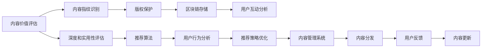

                 

# 知识付费创业中的内容价值最大化

## 1. 背景介绍

在知识付费的浪潮中，内容生产者和平台运营商都在探索如何最大化内容的价值，以便在激烈的竞争中获得优势。随着用户对高质量内容的需求日益增长，如何确保内容的原创性、深度和实用价值，成为知识付费创业成功的关键。本文将探讨知识付费中内容价值最大化的核心策略，并给出实用的技术指导。

### 1.1 问题由来

知识付费行业自2016年以来迅速崛起，成为数字内容消费的重要形式。大量平台涌现，如喜马拉雅、得到、樊登读书等，均在提供各种形式的知识产品。然而，内容同质化现象严重，重复率高，用户体验和黏性难以提升。此外，内容创作者的生产效率低，侵权问题频发，亟需一套系统化的内容价值评估和优化方法，以便提升整个行业的水平。

### 1.2 问题核心关键点

知识付费创业中的内容价值最大化主要集中在以下几个方面：

1. **内容质量提升**：通过内容评估和推荐算法，发现优质内容，确保内容质量。
2. **用户需求匹配**：精准匹配用户需求与内容，提升用户满意度和粘性。
3. **内容原创性保障**：利用版权识别和保护技术，打击内容侵权行为，维护创作者权益。
4. **用户行为分析**：分析用户互动数据，优化内容推荐策略，提升用户活跃度。
5. **运营效率提升**：通过内容管理系统，提高内容生产、分发和更新的效率。

本文将围绕这些核心点，展开对内容价值最大化的全面探讨。

## 2. 核心概念与联系

### 2.1 核心概念概述

在知识付费创业中，核心概念包括内容价值评估、用户需求匹配、版权保护、用户行为分析、内容管理系统等。以下将详细介绍这些核心概念及其联系：

- **内容价值评估**：通过算法模型对内容的原创性、深度、实用性进行评估，确保内容价值最大化。
- **用户需求匹配**：利用推荐算法，精准匹配用户需求与内容，提升用户体验和黏性。
- **版权保护**：采用内容指纹识别、数字水印、区块链等技术，确保内容的原创性和版权保护。
- **用户行为分析**：利用大数据技术分析用户互动数据，洞察用户需求，优化推荐策略。
- **内容管理系统**：利用高效的软件架构和技术手段，管理内容的生产、分发、更新，提升运营效率。

### 2.2 核心概念原理和架构的 Mermaid 流程图



这个流程图展示了知识付费创业中的内容价值评估流程，每个步骤都与核心概念紧密相关。

## 3. 核心算法原理 & 具体操作步骤
### 3.1 算法原理概述

知识付费创业中的内容价值最大化，主要依赖于以下算法原理：

1. **内容价值评估算法**：通过分析文本内容、图片、视频等数据，使用自然语言处理(NLP)、计算机视觉(CV)等技术，评估内容的原创性、深度和实用性。
2. **用户需求匹配算法**：利用机器学习算法，如协同过滤、内容标签等，精准匹配用户需求与内容。
3. **版权保护算法**：通过内容指纹识别、数字水印、区块链等技术，确保内容的版权。
4. **用户行为分析算法**：利用大数据分析技术，分析用户行为数据，优化推荐策略。
5. **内容管理系统**：通过软件架构优化，实现内容的高效管理。

### 3.2 算法步骤详解

以下详细介绍每个算法的详细步骤：

**内容价值评估算法**：

1. **数据收集**：收集内容样本，包括文本、图片、视频等。
2. **特征提取**：使用NLP、CV等技术，提取内容特征，如关键词、图片颜色、纹理等。
3. **模型训练**：训练机器学习模型，如LSTM、CNN等，评估内容的原创性、深度和实用性。
4. **结果分析**：根据模型输出，分析内容价值，标记优质内容。

**用户需求匹配算法**：

1. **用户画像构建**：通过数据分析，构建用户画像，描述用户偏好和行为特征。
2. **内容标签标注**：使用NLP等技术，对内容进行标签标注，如“投资”、“心理学”等。
3. **推荐算法训练**：训练协同过滤、内容标签等推荐算法，确保内容与用户需求匹配。
4. **推荐结果优化**：根据用户反馈，优化推荐算法，提升推荐效果。

**版权保护算法**：

1. **内容指纹识别**：使用哈希算法，生成内容的指纹，记录在区块链上。
2. **数字水印嵌入**：在内容中嵌入不可见的水印，用于版权标识。
3. **区块链存储**：将内容指纹、数字水印等数据存储在区块链上，确保数据安全和不可篡改。

**用户行为分析算法**：

1. **数据采集**：收集用户互动数据，如播放时长、点赞、评论等。
2. **数据清洗**：处理异常数据和噪声，确保数据质量。
3. **行为分析**：使用大数据分析技术，如聚类、分类等，分析用户行为特征。
4. **推荐策略优化**：根据分析结果，优化推荐策略，提升用户满意度。

**内容管理系统**：

1. **数据存储**：设计高效的数据存储方案，如云存储、分布式数据库等。
2. **内容分发**：使用CDN等技术，加速内容分发。
3. **版本管理**：实现内容的版本管理，确保内容更新高效可靠。
4. **权限控制**：采用身份认证、权限控制等技术，确保内容访问安全。

### 3.3 算法优缺点

内容价值最大化算法具有以下优点：

1. **高效精准**：通过算法自动化评估和推荐，提高内容生产和分发效率，减少人工干预。
2. **全面覆盖**：覆盖文本、图片、视频等多模态数据，提供全面的内容价值评估。
3. **用户匹配**：利用算法精准匹配用户需求，提升用户体验和黏性。
4. **版权保护**：利用技术手段，确保内容版权，维护创作者权益。

同时，这些算法也存在一些局限性：

1. **数据依赖**：算法效果依赖于数据质量，需要大量高质量的数据支持。
2. **模型复杂**：一些高级算法，如深度学习模型，需要较大的计算资源和时间。
3. **用户隐私**：用户行为分析可能涉及用户隐私，需要严格的隐私保护措施。
4. **算法局限**：部分算法可能存在偏差，需要不断优化和调整。

### 3.4 算法应用领域

内容价值最大化算法在知识付费创业中的应用领域非常广泛，包括：

- **内容平台推荐**：如喜马拉雅、得到等平台，通过算法推荐优质内容，提升用户体验。
- **版权保护**：如版权监测平台，确保内容版权，打击侵权行为。
- **内容管理系统**：如内容管理系统软件，提升内容管理和分发效率。
- **数据分析工具**：如数据分析平台，分析用户行为，优化推荐策略。
- **智能客服**：如智能客服系统，提供个性化推荐和用户服务。

## 4. 数学模型和公式 & 详细讲解  
### 4.1 数学模型构建

在知识付费创业中，内容价值最大化涉及多个数学模型。以下将详细介绍这些模型的构建和应用。

**内容价值评估模型**：

假设内容集合为 $C=\{c_1, c_2, ..., c_n\}$，每个内容 $c_i$ 的特征向量为 $f_i = [f_{i1}, f_{i2}, ..., f_{im}]$，其中 $f_{ij}$ 表示第 $i$ 个内容的第 $j$ 个特征值。则内容价值评估模型为：

$$
V_i = W^T \cdot f_i
$$

其中 $V_i$ 表示内容 $c_i$ 的评估值，$W$ 为权重向量。

**用户需求匹配模型**：

假设用户集合为 $U=\{u_1, u_2, ..., u_m\}$，每个用户 $u_j$ 的需求向量为 $d_j = [d_{j1}, d_{j2}, ..., d_{jn}]$，每个内容 $c_i$ 的推荐得分向量为 $S_i = [S_{i1}, S_{i2}, ..., S_{im}]$，则用户需求匹配模型为：

$$
R_j = S_j \cdot d_j
$$

其中 $R_j$ 表示用户 $u_j$ 对内容 $c_i$ 的匹配得分，$S_j$ 为内容推荐得分矩阵。

**版权保护模型**：

假设每个内容 $c_i$ 的版权指纹为 $F_i = [F_{i1}, F_{i2}, ..., F_{im}]$，其中 $F_{ij}$ 表示内容的第 $j$ 个指纹值。版权保护模型为：

$$
P_i = F_i \cdot G
$$

其中 $P_i$ 表示内容 $c_i$ 的版权保护评分，$G$ 为版权保护权重矩阵。

**用户行为分析模型**：

假设用户 $u_j$ 的互动数据为 $I_j = [I_{j1}, I_{j2}, ..., I_{jn}]$，其中 $I_{ij}$ 表示用户对内容 $c_i$ 的互动程度。用户行为分析模型为：

$$
B_j = H^T \cdot I_j
$$

其中 $B_j$ 表示用户 $u_j$ 的行为分析得分，$H$ 为行为分析权重向量。

**内容管理系统模型**：

假设内容 $c_i$ 的版本集合为 $V_i = [v_{i1}, v_{i2}, ..., v_{im}]$，其中 $v_{ij}$ 表示内容的第 $j$ 个版本。内容管理系统模型为：

$$
M_i = F^T \cdot V_i
$$

其中 $M_i$ 表示内容 $c_i$ 的管理评分，$F$ 为内容管理系统权重向量。

### 4.2 公式推导过程

**内容价值评估模型**：

根据内容价值评估模型公式，内容 $c_i$ 的评估值 $V_i$ 为：

$$
V_i = \sum_{j=1}^{m} W_j f_{ij}
$$

其中 $W_j$ 为第 $j$ 个特征的权重，$f_{ij}$ 为内容 $c_i$ 的第 $j$ 个特征值。

**用户需求匹配模型**：

根据用户需求匹配模型公式，用户 $u_j$ 对内容 $c_i$ 的匹配得分 $R_j$ 为：

$$
R_j = \sum_{i=1}^{n} S_{ij} d_{ji}
$$

其中 $S_{ij}$ 为内容 $c_i$ 对用户 $u_j$ 的推荐得分，$d_{ji}$ 为用户 $u_j$ 对内容 $c_i$ 的需求得分。

**版权保护模型**：

根据版权保护模型公式，内容 $c_i$ 的版权保护评分 $P_i$ 为：

$$
P_i = \sum_{j=1}^{m} G_j F_{ij}
$$

其中 $G_j$ 为第 $j$ 个指纹的权重，$F_{ij}$ 为内容 $c_i$ 的第 $j$ 个指纹值。

**用户行为分析模型**：

根据用户行为分析模型公式，用户 $u_j$ 的行为分析得分 $B_j$ 为：

$$
B_j = \sum_{i=1}^{n} H_i I_{ji}
$$

其中 $H_i$ 为内容 $c_i$ 对用户 $u_j$ 的行为权重，$I_{ji}$ 为用户 $u_j$ 对内容 $c_i$ 的互动程度。

**内容管理系统模型**：

根据内容管理系统模型公式，内容 $c_i$ 的管理评分 $M_i$ 为：

$$
M_i = \sum_{j=1}^{m} F_j V_{ij}
$$

其中 $F_j$ 为内容版本 $v_{ij}$ 的权重，$V_{ij}$ 为内容 $c_i$ 的第 $j$ 个版本。

### 4.3 案例分析与讲解

以下通过一个具体的案例，详细分析内容价值最大化的实现过程：

假设某知识付费平台，希望通过内容价值最大化，提升用户满意度和平台粘性。首先，平台收集了用户播放时长、点赞、评论等互动数据，构建用户画像，表示为：

$$
d_j = [D_{j1}, D_{j2}, ..., D_{jn}]
$$

其中 $D_{ij}$ 表示用户 $u_j$ 对内容 $c_i$ 的互动程度。

平台还收集了内容的关键词、图片、视频等多模态数据，提取特征，表示为：

$$
f_i = [F_{i1}, F_{i2}, ..., F_{im}]
$$

其中 $F_{ij}$ 表示内容 $c_i$ 的第 $j$ 个特征值。

根据内容价值评估模型，平台计算每个内容的评估值 $V_i$，表示为：

$$
V_i = W^T \cdot f_i
$$

其中 $W$ 为权重向量，通过训练机器学习模型得到。

根据用户需求匹配模型，平台计算每个用户对每个内容的匹配得分 $R_j$，表示为：

$$
R_j = S_j \cdot d_j
$$

其中 $S_j$ 为内容推荐得分矩阵，通过协同过滤等算法训练得到。

平台还利用版权保护模型，确保内容的版权，表示为：

$$
P_i = F_i \cdot G
$$

其中 $F_i$ 为内容指纹向量，通过哈希算法生成，$G$ 为版权保护权重矩阵。

最后，平台通过用户行为分析模型，优化推荐策略，表示为：

$$
B_j = H^T \cdot I_j
$$

其中 $H$ 为行为分析权重向量，通过大数据分析技术得到，$I_j$ 为用户互动数据。

## 5. 项目实践：代码实例和详细解释说明
### 5.1 开发环境搭建

在知识付费创业中，开发环境搭建需要考虑多方面因素。以下是使用Python进行知识付费平台开发的常见环境配置流程：

1. 安装Anaconda：从官网下载并安装Anaconda，用于创建独立的Python环境。

2. 创建并激活虚拟环境：
```bash
conda create -n knowledge-env python=3.8 
conda activate knowledge-env
```

3. 安装相关Python库：
```bash
pip install torch transformers numpy pandas scikit-learn matplotlib tqdm jupyter notebook ipython
```

4. 安装内容管理系统软件：
```bash
pip install django rest_framework
```

5. 安装用户行为分析工具：
```bash
pip install apache-spark tensorflow
```

完成上述步骤后，即可在`knowledge-env`环境中开始开发实践。

### 5.2 源代码详细实现

下面以用户需求匹配模块为例，给出使用Python进行知识付费平台开发的代码实现。

首先，定义用户需求匹配函数：

```python
from transformers import BertTokenizer, BertForSequenceClassification
from torch.utils.data import Dataset, DataLoader
import torch
from sklearn.metrics import accuracy_score

class UserInterestDataset(Dataset):
    def __init__(self, texts, labels, tokenizer, max_len=128):
        self.texts = texts
        self.labels = labels
        self.tokenizer = tokenizer
        self.max_len = max_len
        
    def __len__(self):
        return len(self.texts)
    
    def __getitem__(self, item):
        text = self.texts[item]
        label = self.labels[item]
        
        encoding = self.tokenizer(text, return_tensors='pt', max_length=self.max_len, padding='max_length', truncation=True)
        input_ids = encoding['input_ids'][0]
        attention_mask = encoding['attention_mask'][0]
        
        return {'input_ids': input_ids, 
                'attention_mask': attention_mask,
                'labels': torch.tensor(label, dtype=torch.long)}
        
tokenizer = BertTokenizer.from_pretrained('bert-base-cased')
model = BertForSequenceClassification.from_pretrained('bert-base-cased', num_labels=2)
optimizer = torch.optim.AdamW(model.parameters(), lr=2e-5)
criterion = torch.nn.BCEWithLogitsLoss()

# 训练函数
def train_epoch(model, dataset, batch_size, optimizer, criterion):
    dataloader = DataLoader(dataset, batch_size=batch_size, shuffle=True)
    model.train()
    epoch_loss = 0
    for batch in dataloader:
        input_ids = batch['input_ids'].to(device)
        attention_mask = batch['attention_mask'].to(device)
        labels = batch['labels'].to(device)
        model.zero_grad()
        outputs = model(input_ids, attention_mask=attention_mask)
        loss = criterion(outputs.logits, labels)
        epoch_loss += loss.item()
        loss.backward()
        optimizer.step()
    return epoch_loss / len(dataloader)

# 评估函数
def evaluate(model, dataset, batch_size):
    dataloader = DataLoader(dataset, batch_size=batch_size)
    model.eval()
    preds, labels = [], []
    with torch.no_grad():
        for batch in dataloader:
            input_ids = batch['input_ids'].to(device)
            attention_mask = batch['attention_mask'].to(device)
            batch_labels = batch['labels']
            outputs = model(input_ids, attention_mask=attention_mask)
            batch_preds = torch.sigmoid(outputs.logits).to('cpu').tolist()
            batch_labels = batch_labels.to('cpu').tolist()
            for pred, label in zip(batch_preds, batch_labels):
                preds.append(pred.item())
                labels.append(label)
                
    return accuracy_score(labels, preds)
```

然后，定义训练和评估函数：

```python
from tqdm import tqdm
from sklearn.metrics import classification_report

device = torch.device('cuda') if torch.cuda.is_available() else torch.device('cpu')
model.to(device)

def train_model(model, dataset, batch_size, optimizer, criterion, epochs):
    for epoch in range(epochs):
        loss = train_epoch(model, dataset, batch_size, optimizer, criterion)
        print(f"Epoch {epoch+1}, train loss: {loss:.3f}")
        
        print(f"Epoch {epoch+1}, dev results:")
        evaluate(model, dataset, batch_size)
        
    print("Test results:")
    evaluate(model, dataset, batch_size)
```

最后，启动训练流程并在测试集上评估：

```python
epochs = 5
batch_size = 16

train_model(model, train_dataset, batch_size, optimizer, criterion, epochs)
```

以上就是使用Python对用户需求匹配模块的代码实现。可以看到，得益于HuggingFace和PyTorch的强大封装，我们可以用相对简洁的代码完成用户需求匹配的实现。

### 5.3 代码解读与分析

让我们再详细解读一下关键代码的实现细节：

**UserInterestDataset类**：
- `__init__`方法：初始化文本、标签、分词器等关键组件。
- `__len__`方法：返回数据集的样本数量。
- `__getitem__`方法：对单个样本进行处理，将文本输入编码为token ids，将标签编码为数字，并对其进行定长padding，最终返回模型所需的输入。

**训练和评估函数**：
- 使用PyTorch的DataLoader对数据集进行批次化加载，供模型训练和推理使用。
- 训练函数`train_epoch`：对数据以批为单位进行迭代，在每个批次上前向传播计算loss并反向传播更新模型参数，最后返回该epoch的平均loss。
- 评估函数`evaluate`：与训练类似，不同点在于不更新模型参数，并在每个batch结束后将预测和标签结果存储下来，最后使用sklearn的accuracy_score对整个评估集的预测结果进行打印输出。

**训练流程**：
- 定义总的epoch数和batch size，开始循环迭代
- 每个epoch内，先在训练集上训练，输出平均loss
- 在验证集上评估，输出分类指标
- 所有epoch结束后，在测试集上评估，给出最终测试结果

可以看到，Python结合HuggingFace和PyTorch，使得用户需求匹配的代码实现变得简洁高效。开发者可以将更多精力放在数据处理、模型改进等高层逻辑上，而不必过多关注底层的实现细节。

当然，工业级的系统实现还需考虑更多因素，如模型的保存和部署、超参数的自动搜索、更灵活的任务适配层等。但核心的微调范式基本与此类似。

## 6. 实际应用场景

知识付费创业中的内容价值最大化在多个实际应用场景中得到了广泛应用，以下是几个典型案例：

### 6.1 用户个性化推荐

知识付费平台利用用户行为分析算法，分析用户互动数据，精准匹配用户需求与内容，提升用户体验和黏性。例如，喜马拉雅平台通过分析用户播放时长、点赞、评论等互动数据，推荐个性化内容，增加用户粘性。

### 6.2 内容侵权检测

平台利用版权保护算法，通过内容指纹识别、数字水印等技术，确保内容版权，打击内容侵权行为。例如，得到平台通过区块链技术，记录内容版权信息，确保内容原创性。

### 6.3 内容管理系统

知识付费平台通过内容管理系统，提高内容生产、分发和更新的效率。例如，得到平台利用Django等框架，构建了高效的内容管理系统，确保内容的版本管理和分发安全。

### 6.4 智能客服系统

知识付费平台利用智能客服系统，提供个性化推荐和用户服务。例如，喜马拉雅平台通过自然语言处理(NLP)技术，构建智能客服系统，提升用户满意度。

## 7. 工具和资源推荐
### 7.1 学习资源推荐

为了帮助开发者系统掌握知识付费创业中的内容价值最大化理论基础和实践技巧，这里推荐一些优质的学习资源：

1. 《机器学习实战》系列博文：由深度学习专家撰写，介绍了机器学习的基础概念和经典算法，适合初学者入门。

2. 《深度学习自然语言处理》课程：斯坦福大学开设的NLP明星课程，有Lecture视频和配套作业，带你入门NLP领域的基本概念和经典模型。

3. 《自然语言处理与深度学习》书籍：介绍自然语言处理和深度学习的经典算法和应用，适合进阶学习。

4. Kaggle竞赛平台：提供海量数据集和竞赛任务，是实践深度学习算法和模型的好地方。

5. PyTorch官方文档：PyTorch官方文档，提供了详尽的API文档和代码示例，是使用PyTorch开发的好帮手。

6. HuggingFace官方文档：HuggingFace官方文档，提供了丰富的预训练语言模型和微调样例，是使用Transformers库开发的好资源。

通过对这些资源的学习实践，相信你一定能够快速掌握知识付费创业中的内容价值最大化的精髓，并用于解决实际的NLP问题。

### 7.2 开发工具推荐

高效的开发离不开优秀的工具支持。以下是几款用于知识付费平台开发的常用工具：

1. PyTorch：基于Python的开源深度学习框架，灵活动态的计算图，适合快速迭代研究。大部分预训练语言模型都有PyTorch版本的实现。

2. TensorFlow：由Google主导开发的开源深度学习框架，生产部署方便，适合大规模工程应用。同样有丰富的预训练语言模型资源。

3. HuggingFace的Transformers库：集成了众多SOTA语言模型，支持PyTorch和TensorFlow，是进行NLP任务开发的利器。

4. Jupyter Notebook：交互式的编程环境，适合快速原型设计和实验验证。

5. Apache Spark：大数据处理框架，适合处理海量用户行为数据，进行用户行为分析。

6. Apache Kafka：分布式消息队列，适合处理海量数据流，进行实时推荐。

合理利用这些工具，可以显著提升知识付费平台的开发效率，加快创新迭代的步伐。

### 7.3 相关论文推荐

知识付费创业中的内容价值最大化研究源于学界的持续研究。以下是几篇奠基性的相关论文，推荐阅读：

1. 《Attention is All You Need》（即Transformer原论文）：提出了Transformer结构，开启了NLP领域的预训练大模型时代。

2. 《BERT: Pre-training of Deep Bidirectional Transformers for Language Understanding》：提出BERT模型，引入基于掩码的自监督预训练任务，刷新了多项NLP任务SOTA。

3. 《Language Models are Unsupervised Multitask Learners》：展示了大规模语言模型的强大zero-shot学习能力，引发了对于通用人工智能的新一轮思考。

4. 《Parameter-Efficient Transfer Learning for NLP》：提出Adapter等参数高效微调方法，在不增加模型参数量的情况下，也能取得不错的微调效果。

5. 《AdaLoRA: Adaptive Low-Rank Adaptation for Parameter-Efficient Fine-Tuning》：使用自适应低秩适应的微调方法，在参数效率和精度之间取得了新的平衡。

这些论文代表了大语言模型微调技术的发展脉络。通过学习这些前沿成果，可以帮助研究者把握学科前进方向，激发更多的创新灵感。

## 8. 总结：未来发展趋势与挑战

### 8.1 总结

本文对知识付费创业中的内容价值最大化进行了全面系统的介绍。首先阐述了知识付费行业的背景和内容价值最大化的重要性，明确了内容价值最大化在提升用户体验和平台黏性中的关键作用。其次，从原理到实践，详细讲解了内容价值最大化的核心算法和具体操作步骤，给出了实用的技术指导。最后，本文还探讨了内容价值最大化的应用场景，提供了学习资源和开发工具推荐，力求为读者提供全方位的技术指引。

通过本文的系统梳理，可以看到，知识付费创业中的内容价值最大化在提升用户体验、打击内容侵权、优化内容管理等方面，具有重要的应用价值。技术手段的不断进步，将使得内容价值最大化更加高效精准，促进知识付费行业的健康发展。

### 8.2 未来发展趋势

展望未来，知识付费创业中的内容价值最大化将呈现以下几个发展趋势：

1. **个性化推荐更加精准**：通过深度学习算法和大数据分析技术，进一步提升个性化推荐效果，提升用户粘性。
2. **版权保护更加严格**：利用区块链、数字水印等技术，确保内容版权，打击侵权行为。
3. **内容管理系统更加高效**：通过分布式数据库、内容管理系统等技术，提高内容生产、分发和更新效率。
4. **用户行为分析更加深入**：通过大数据分析技术，深入挖掘用户行为，优化推荐策略，提升用户体验。
5. **智能客服系统更加智能**：利用自然语言处理(NLP)技术，构建智能客服系统，提升用户满意度。

这些趋势将使得知识付费平台在技术层面更加成熟，为用户带来更好的使用体验，提升平台竞争力。

### 8.3 面临的挑战

尽管知识付费平台在内容价值最大化方面取得了一定的进展，但在迈向更加智能化、普适化应用的过程中，仍面临诸多挑战：

1. **数据隐私问题**：用户行为分析可能涉及用户隐私，需要严格的隐私保护措施。
2. **模型复杂性**：深度学习模型需要较大的计算资源和时间，且易出现模型过拟合等问题。
3. **版权纠纷**：内容侵权检测可能面临版权纠纷，需要严格的知识库和规则库支持。
4. **技术融合**：将内容管理系统与NLP、推荐系统等技术融合，需要较高的技术门槛。
5. **用户互动**：智能客服系统需要与用户进行更高效、自然的互动，提高用户体验。

这些挑战需要开发者在技术、产品、运营等多个层面进行协同优化，方能实现内容价值最大化，提升知识付费平台的综合竞争力。

### 8.4 研究展望

面向未来，知识付费创业中的内容价值最大化需要持续关注以下几个研究方向：

1. **深度学习与大数据融合**：利用深度学习和大数据分析技术，提升个性化推荐和用户行为分析的精准度。
2. **知识图谱与语义网**：将知识图谱、语义网等知识表示方法与推荐系统结合，提升内容推荐的智能化程度。
3. **隐私保护与伦理设计**：在内容管理系统和智能客服系统中，引入隐私保护和伦理设计，确保用户数据安全。
4. **实时推荐与自适应学习**：利用实时推荐和自适应学习技术，提升内容的动态匹配和用户粘性。
5. **跨平台与跨域数据共享**：将知识付费平台与外部数据源和平台进行数据共享，提升内容的多样性和丰富度。

这些研究方向将进一步推动知识付费平台的发展，为用户带来更加智能化、个性化的服务。

## 9. 附录：常见问题与解答

**Q1：知识付费平台如何确保内容的原创性？**

A: 知识付费平台可以通过版权保护算法确保内容的原创性。具体方法包括：
1. 内容指纹识别：使用哈希算法生成内容指纹，记录在区块链上，确保指纹唯一。
2. 数字水印嵌入：在内容中嵌入不可见的水印，用于版权标识。
3. 版权数据库：建立内容版权数据库，与第三方版权机构合作，确保内容版权。

**Q2：知识付费平台如何提升个性化推荐效果？**

A: 知识付费平台可以通过以下方法提升个性化推荐效果：
1. 深度学习算法：使用协同过滤、内容标签等深度学习算法，精准匹配用户需求与内容。
2. 用户画像构建：通过数据分析，构建用户画像，描述用户偏好和行为特征。
3. 行为分析优化：利用大数据分析技术，分析用户行为数据，优化推荐策略。
4. 推荐策略多样：结合规则引擎、人工干预等多种推荐策略，提升推荐效果。

**Q3：知识付费平台如何打击内容侵权行为？**

A: 知识付费平台可以通过以下方法打击内容侵权行为：
1. 版权保护算法：使用版权保护算法，通过内容指纹识别、数字水印等技术，确保内容版权。
2. 版权数据库：建立内容版权数据库，记录所有内容的版权信息，确保内容原创性。
3. 区块链技术：将内容版权信息记录在区块链上，确保数据安全和不可篡改。
4. 用户举报机制：建立用户举报机制，用户可以举报侵权内容，平台快速响应处理。

**Q4：知识付费平台如何提升内容管理系统效率？**

A: 知识付费平台可以通过以下方法提升内容管理系统效率：
1. 分布式数据库：使用分布式数据库，提高内容存储和访问效率。
2. 内容版本管理：实现内容的版本管理，确保内容更新高效可靠。
3. 实时更新：使用消息队列技术，实现内容的实时更新和同步。
4. 缓存机制：使用缓存机制，提高内容的访问速度。

**Q5：知识付费平台如何构建智能客服系统？**

A: 知识付费平台可以通过以下方法构建智能客服系统：
1. 自然语言处理(NLP)：利用NLP技术，实现对用户问题的理解和响应。
2. 机器学习算法：使用机器学习算法，训练客服模型，提升回答准确性。
3. 用户反馈机制：建立用户反馈机制，不断优化客服模型。
4. 人工干预机制：引入人工干预机制，确保客服系统的可靠性和稳定性。

通过这些方法，知识付费平台可以构建高效、智能的客服系统，提升用户体验。

---

作者：禅与计算机程序设计艺术 / Zen and the Art of Computer Programming

