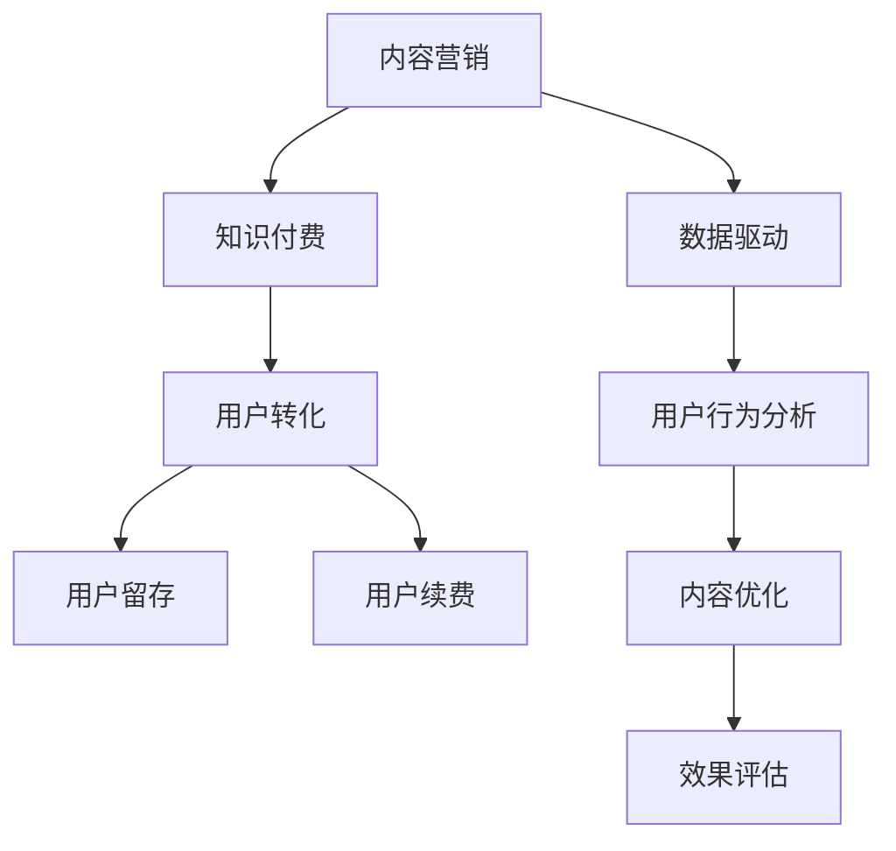

                 

# 知识付费创业中的内容营销ROI优化

> 关键词：内容营销, 知识付费, ROI优化, 用户转化, 数据驱动

## 1. 背景介绍

### 1.1 问题由来
随着互联网和移动互联网的迅猛发展，知识付费市场正在经历一次新的浪潮。与传统的在线教育模式不同，知识付费更加强调个性化、针对性和高效性，以帮助用户解决实际问题、提升职业技能、满足兴趣爱好。然而，在知识付费创业中，如何有效营销内容、吸引用户并提高转化率，成为许多创业者面临的难题。

### 1.2 问题核心关键点
内容营销是知识付费创业中不可或缺的一部分。优质的内容不仅能够吸引潜在用户，还能提高用户的粘性和续费率，从而提升整体营收。然而，传统的内容营销策略往往依赖于经验和直觉，难以量化评估ROI（投资回报率）。如何通过数据驱动优化内容营销策略，提高ROI，成为当前亟需解决的关键问题。

### 1.3 问题研究意义
优化内容营销的ROI，能够显著提升知识付费创业的效果，帮助企业更好地把握用户需求，实现业务增长。具体来说：

- **提高用户转化率**：通过精准的营销策略，吸引更多潜在用户转化为付费用户。
- **提升用户留存率**：优质的内容能够提升用户满意度，减少流失率。
- **增加用户续费率**：高质量的持续内容输出，能够满足用户长期需求，提高续费意愿。
- **优化资源配置**：通过数据驱动的决策，可以更合理地分配营销资源，避免资源浪费。

## 2. 核心概念与联系

### 2.1 核心概念概述

为更好地理解内容营销ROI优化的理论基础和实践方法，本节将介绍几个密切相关的核心概念：

- **内容营销(Content Marketing)**：通过创造和分发有价值、相关和一致的内容，吸引和留住明确定义的受众，从而推动有利可图的客户行动。
- **知识付费(Knowledge-Pay-As-You-Go)**：用户为获取有价值的学习内容或技能而支付的费用模式。
- **投资回报率(Return on Investment, ROI)**：衡量投资活动是否具有经济价值的指标，等于投资产生的收益与投资成本之比。
- **用户转化率(User Conversion Rate)**：指用户从接触到购买或完成某项行为的转化比例。
- **用户留存率(User Retention Rate)**：指用户在一定时间内继续使用产品或服务的比例。
- **用户续费率(User Renewal Rate)**：指现有用户在初次付费后的续费比例。

这些核心概念之间的逻辑关系可以通过以下Mermaid流程图来展示：



这个流程图展示了这个系统的工作流程：

1. 内容营销是知识付费创业的入口。
2. 通过精准的内容吸引用户，提升用户转化率。
3. 通过优质内容提高用户满意度和留存率。
4. 通过持续输出高质量内容，增加用户续费率。
5. 采用数据驱动的优化方法，不断提升营销效果。

## 3. 核心算法原理 & 具体操作步骤
### 3.1 算法原理概述

内容营销ROI优化的核心思想是利用数据驱动的方法，通过分析用户行为和内容反馈，不断优化营销策略，最大化ROI。其基本流程包括：

1. **数据收集**：收集用户与内容互动的数据，如观看时长、点击率、评论等。
2. **行为分析**：分析用户行为数据，识别出用户对内容的偏好和需求。
3. **内容优化**：根据行为分析结果，对内容进行优化调整，如标题、摘要、发布时间等。
4. **效果评估**：评估内容优化后的效果，如用户转化率、留存率、续费率等指标的变化。
5. **策略迭代**：根据效果评估结果，进一步调整优化策略，循环迭代。

### 3.2 算法步骤详解

以下将详细介绍内容营销ROI优化的详细步骤：

**Step 1: 数据收集与处理**
- 从知识付费平台收集用户与内容互动的数据，如观看时长、点击率、评分、评论等。
- 对数据进行清洗、去重和标准化处理，确保数据的准确性和一致性。
- 存储数据至数据库或数据仓库，便于后续分析和查询。

**Step 2: 用户行为分析**
- 对收集到的用户行为数据进行统计分析，如用户的观看次数、平均观看时长、点击率、评论内容等。
- 使用数据挖掘技术，如聚类、关联规则、时间序列分析等，识别出用户的兴趣和需求。
- 分析不同内容类型（如视频、文章、音频）的受欢迎程度，以及不同内容形式（如图文、视频、直播）的效果差异。

**Step 3: 内容优化策略制定**
- 根据用户行为分析结果，制定针对性的内容优化策略，如调整标题、优化摘要、发布时间安排等。
- 利用A/B测试等方法，测试不同优化策略的效果，选择最优方案。
- 设计并实施内容更新计划，定期发布和更新优质内容，保持用户的兴趣和粘性。

**Step 4: 效果评估与迭代优化**
- 使用指标（如用户转化率、留存率、续费率等）评估内容优化后的效果。
- 分析不同策略的效果差异，识别出影响ROI的关键因素。
- 根据效果评估结果，进一步调整优化策略，循环迭代。

### 3.3 算法优缺点

内容营销ROI优化的主要优点包括：
1. **量化评估**：通过数据驱动的方法，可以准确衡量不同内容策略的效果，提供可靠的决策依据。
2. **精准营销**：利用用户行为分析，能够更加精准地定位用户需求，提升营销效果。
3. **持续改进**：通过持续优化和迭代，不断提高内容质量和用户满意度，实现业务的长期增长。
4. **资源节约**：通过数据驱动的优化，可以避免资源浪费，提升投资回报率。

然而，该方法也存在一定的局限性：
1. **数据隐私**：在收集和处理用户数据时，需要注意数据隐私和用户权益保护。
2. **数据质量**：数据的准确性和完整性对分析结果的影响较大，需要严格的数据管理措施。
3. **模型复杂性**：数据挖掘和行为分析需要复杂的技术手段，对团队技术和资源要求较高。
4. **用户行为多样性**：不同用户的行为差异较大，难以通过统一模型解释。

尽管如此，数据驱动的内容营销策略仍然是当前最有效的方法之一，能够帮助知识付费创业企业实现更高的ROI。

### 3.4 算法应用领域

内容营销ROI优化的方法已经被广泛应用于知识付费创业的多个领域，如在线教育、职业技能培训、兴趣爱好课程等。具体应用包括：

- **课程推荐系统**：通过用户行为分析，推荐与用户兴趣匹配的课程，提升用户转化率。
- **内容发布计划**：根据用户行为数据，制定内容发布和更新计划，保持用户粘性。
- **广告投放策略**：通过数据分析，优化广告投放策略，提高广告转化率。
- **社区互动**：分析用户社区互动数据，提升用户参与度和满意度。
- **个性化营销**：基于用户行为数据，定制个性化营销方案，提升用户满意度。

## 4. 数学模型和公式 & 详细讲解 & 举例说明

### 4.1 数学模型构建

为更好地理解内容营销ROI优化的数学模型，我们假设：

- **内容类型**：分为视频、文章、音频三种。
- **用户行为**：包括观看时长、点击率、评分、评论等。
- **指标**：包括用户转化率、留存率、续费率等。

记用户行为数据为 $D=\{(x_i,y_i)\}_{i=1}^N$，其中 $x_i$ 为用户行为特征向量，$y_i$ 为标签（如观看时长、点击率、评分等）。

定义内容优化策略为 $f(x)$，则ROI优化目标为：

$$
ROI = \frac{\text{用户收益} - \text{内容制作成本} - \text{营销成本}}{\text{内容制作成本} + \text{营销成本}}
$$

其中，用户收益可以通过用户转化率、留存率和续费率等指标计算得到。

### 4.2 公式推导过程

接下来，我们将具体推导如何通过用户行为数据和内容优化策略来提升ROI。

假设内容优化策略 $f(x)$ 在用户行为 $x$ 上的转化率为 $C(x)$，则用户转化率 $R_{\text{转化}}$ 可以表示为：

$$
R_{\text{转化}} = \frac{C(x)}{C_{\text{总}}}
$$

其中 $C_{\text{总}}$ 为所有内容的用户转化率总和。

同样，用户留存率 $R_{\text{留存}}$ 和续费率 $R_{\text{续费}}$ 可以表示为：

$$
R_{\text{留存}} = \frac{L(x)}{L_{\text{总}}}
$$

$$
R_{\text{续费}} = \frac{F(x)}{F_{\text{总}}}
$$

其中 $L_{\text{总}}$ 和 $F_{\text{总}}$ 分别为所有内容的用户留存率和续费率总和。

假设内容制作和营销的总成本为 $C_{\text{总}}$，则ROI可以表示为：

$$
ROI = \frac{R_{\text{转化}} \times L(x) \times F(x) - C_{\text{总}}}{C_{\text{总}}}
$$

为了最大化ROI，我们需要优化 $f(x)$，使其最大化 $R_{\text{转化}} \times L(x) \times F(x)$，同时最小化 $C_{\text{总}}$。

### 4.3 案例分析与讲解

下面以在线教育平台的内容营销为例，分析如何通过数据驱动优化ROI。

假设在线教育平台有视频课程、图文教程和音频讲座三种内容形式，收集了用户观看时长、点击率、评分和评论等数据。通过对这些数据的分析，发现视频课程的用户转化率最高，但制作成本也最高；图文教程制作成本最低，但用户留存率和续费率一般；音频讲座则介于两者之间。

此时，平台可以采取以下优化策略：

1. **视频课程**：保持高转化率的同时，优化制作流程，降低成本。可以通过提升制作效率、减少录制成本、利用现有素材等方式实现。
2. **图文教程**：通过优化内容和呈现形式，提高用户留存率和续费率。可以通过增加互动元素、引入更多实例、制作系列教程等方式实现。
3. **音频讲座**：结合视频课程和图文教程的优点，设计更加丰富和灵活的音频内容形式，提升用户满意度和留存率。

通过这些策略，平台能够更合理地配置资源，最大化ROI。

## 5. 项目实践：代码实例和详细解释说明
### 5.1 开发环境搭建

在进行内容营销ROI优化的项目实践前，我们需要准备好开发环境。以下是使用Python进行数据分析和机器学习的开发环境配置流程：

1. 安装Anaconda：从官网下载并安装Anaconda，用于创建独立的Python环境。

2. 创建并激活虚拟环境：
```bash
conda create -n roi-env python=3.8 
conda activate roi-env
```

3. 安装相关库：
```bash
conda install pandas numpy scikit-learn matplotlib seaborn jupyter notebook ipython
```

4. 安装TensorFlow和PyTorch：
```bash
conda install tensorflow==2.0 pytorch==1.9
```

5. 安装数据处理和可视化工具：
```bash
conda install dask-ml fastparquet
```

完成上述步骤后，即可在`roi-env`环境中开始项目实践。

### 5.2 源代码详细实现

以下是一个简化的示例代码，展示如何使用Python进行内容营销ROI优化的数据处理和分析。

首先，导入必要的库：

```python
import pandas as pd
import numpy as np
from sklearn.model_selection import train_test_split
from sklearn.linear_model import LogisticRegression
from sklearn.metrics import roc_auc_score
```

然后，加载数据：

```python
data = pd.read_csv('user_data.csv')
```

接着，进行数据清洗和预处理：

```python
# 删除缺失数据
data = data.dropna()

# 数据标准化
data = (data - data.mean()) / data.std()
```

然后，进行特征工程：

```python
# 提取特征
X = data[['观看时长', '点击率', '评分', '评论内容']]
y = data['用户转化率']
```

接下来，进行模型训练和评估：

```python
# 数据分割
X_train, X_test, y_train, y_test = train_test_split(X, y, test_size=0.2, random_state=42)

# 训练模型
model = LogisticRegression()
model.fit(X_train, y_train)

# 评估模型
y_pred = model.predict_proba(X_test)[:, 1]
auc = roc_auc_score(y_test, y_pred)
print(f"AUC: {auc}")
```

最后，进行结果展示：

```python
# 可视化结果
import matplotlib.pyplot as plt
plt.plot(y_test, y_pred)
plt.xlabel('True Label')
plt.ylabel('Predicted Probability')
plt.show()
```

以上就是使用Python进行内容营销ROI优化的简要代码实现。可以看到，通过数据清洗、特征工程、模型训练和评估等步骤，我们可以实现对内容优化策略的优化和ROI提升。

### 5.3 代码解读与分析

让我们再详细解读一下关键代码的实现细节：

**数据加载**：
- `pd.read_csv()`方法用于加载用户数据，读取CSV文件。

**数据清洗**：
- `dropna()`方法用于删除缺失数据，保证数据的完整性。
- `(data - data.mean()) / data.std()`方法用于对数据进行标准化处理，避免数据分布不一致对模型训练的影响。

**特征提取**：
- `X`和`y`分别表示用户行为数据和标签，用于训练模型。

**模型训练和评估**：
- `train_test_split()`方法用于将数据集分割为训练集和测试集。
- `LogisticRegression()`方法用于训练逻辑回归模型。
- `predict_proba()`方法用于获取模型预测的概率，用于计算AUC值。
- `roc_auc_score()`方法用于计算ROC曲线下的面积（AUC），评估模型性能。

**结果展示**：
- `matplotlib`库用于绘制ROC曲线，直观展示模型性能。

可以看到，通过这些步骤，我们可以实现对内容优化策略的优化和ROI提升。当然，实际应用中还需要考虑更多因素，如多模态数据的融合、模型的可解释性等。

## 6. 实际应用场景

### 6.1 在线教育平台

在线教育平台是内容营销ROI优化的典型应用场景。通过数据分析和模型训练，平台能够实时调整内容策略，提升用户转化率、留存率和续费率，最大化ROI。具体应用包括：

- **课程推荐系统**：利用用户行为数据，推荐与用户兴趣匹配的课程，提升用户转化率。
- **内容发布计划**：根据用户行为数据，制定内容发布和更新计划，保持用户粘性。
- **广告投放策略**：通过数据分析，优化广告投放策略，提高广告转化率。
- **社区互动**：分析用户社区互动数据，提升用户参与度和满意度。

### 6.2 职业培训平台

职业培训平台通过提供有价值的技能培训内容，帮助用户提升职业技能，满足就业需求。通过内容营销ROI优化，平台能够更加精准地定位用户需求，提升用户转化率和满意度。具体应用包括：

- **技能培训课程**：根据用户职业需求，推荐合适的培训课程，提升用户转化率。
- **职业发展指导**：提供职业发展建议和规划，提高用户满意度。
- **企业合作**：与企业合作，提供定制化培训方案，提升用户续费率。

### 6.3 兴趣爱好社区

兴趣爱好社区通过分享知识和经验，满足用户的兴趣爱好和社交需求。通过内容营销ROI优化，平台能够吸引更多用户参与互动，提升用户留存率和续费率。具体应用包括：

- **内容激励机制**：通过积分、奖励等激励机制，鼓励用户生成和分享内容，提升用户参与度。
- **社区活动策划**：根据用户行为数据，策划社区活动，提升用户粘性。
- **付费会员服务**：提供高级会员服务，如优先发布内容、个性化推荐等，提升用户续费率。

## 7. 工具和资源推荐
### 7.1 学习资源推荐

为了帮助开发者系统掌握内容营销ROI优化的理论基础和实践技巧，这里推荐一些优质的学习资源：

1. **《数据驱动的内容营销》**：是一本系统介绍内容营销ROI优化的书籍，涵盖数据收集、数据清洗、特征工程、模型训练和效果评估等多个方面。
2. **《Python数据分析实战》**：是一本实战性的Python数据分析入门书籍，详细介绍了数据处理、数据可视化和机器学习等技术。
3. **Kaggle**：一个全球知名的数据科学竞赛平台，提供了大量真实场景下的数据集和竞赛项目，有助于提升实际应用能力。
4. **Coursera**：提供多门数据科学和机器学习的在线课程，涵盖从入门到高级的内容，适合不同层次的学习者。
5. **Udacity**：提供多门数据科学和机器学习的在线课程，注重实战项目和项目实践，有助于提升实际应用能力。

通过对这些资源的学习实践，相信你一定能够快速掌握内容营销ROI优化的精髓，并用于解决实际的商业问题。

### 7.2 开发工具推荐

高效的开发离不开优秀的工具支持。以下是几款用于内容营销ROI优化的常用工具：

1. **Python**：作为数据科学和机器学习的主流语言，Python有着丰富的数据处理和分析库，如Pandas、NumPy、Scikit-Learn等。
2. **Jupyter Notebook**：一个交互式的数据分析和机器学习开发工具，支持代码块、图形和图表的混合展示，便于数据探索和模型实验。
3. **TensorFlow**：由Google主导开发的开源机器学习框架，支持分布式计算和大规模数据处理，适合复杂的数据模型训练。
4. **PyTorch**：由Facebook开发的开源机器学习框架，支持动态计算图和灵活的模型结构，适合快速原型设计和研究。
5. **Matplotlib**：一个Python的数据可视化库，支持绘制各种类型的图表，便于数据展示和分析。

合理利用这些工具，可以显著提升内容营销ROI优化的开发效率，加快创新迭代的步伐。

### 7.3 相关论文推荐

内容营销ROI优化的研究方向涉及多个领域，以下是几篇奠基性的相关论文，推荐阅读：

1. **《内容营销的ROI优化》**：一篇关于内容营销ROI优化的综述论文，总结了当前的研究进展和方法。
2. **《用户行为数据分析与建模》**：一篇关于用户行为数据分析的论文，介绍了各种数据挖掘和建模技术。
3. **《基于机器学习的内容推荐系统》**：一篇关于基于机器学习的内容推荐系统的论文，详细介绍了推荐模型的设计和使用。
4. **《知识付费平台的个性化推荐系统》**：一篇关于知识付费平台个性化推荐系统的论文，讨论了推荐算法的实现和优化。
5. **《内容营销的算法优化》**：一篇关于内容营销算法优化的论文，探讨了不同算法对内容营销效果的影响。

这些论文代表了大数据和机器学习在内容营销中的应用，提供了丰富的理论基础和实践经验，值得深入学习和参考。

## 8. 总结：未来发展趋势与挑战
### 8.1 总结

本文对内容营销ROI优化的方法进行了全面系统的介绍。首先阐述了内容营销在知识付费创业中的重要性，明确了通过数据驱动优化ROI的关键意义。其次，从原理到实践，详细讲解了内容营销ROI优化的数学模型和操作步骤，给出了完整的项目实现代码。同时，本文还广泛探讨了内容营销ROI优化的实际应用场景，展示了其在知识付费、职业培训、兴趣爱好等多个领域的应用前景。此外，本文精选了内容营销ROI优化的各类学习资源，力求为读者提供全方位的技术指引。

通过本文的系统梳理，可以看到，数据驱动的内容营销方法正在成为知识付费创业中的重要范式，极大地提升了内容营销的效果和效率，帮助企业实现更高的ROI。未来，伴随数据科学的不断进步和技术的持续演进，内容营销ROI优化必将在更多场景中得到应用，为知识付费和信息服务行业带来革命性影响。

### 8.2 未来发展趋势

展望未来，内容营销ROI优化技术将呈现以下几个发展趋势：

1. **个性化推荐系统**：通过深度学习和推荐算法，更加精准地定位用户需求，提升用户转化率和满意度。
2. **实时数据分析**：利用流数据处理技术，实现实时分析和反馈，动态调整内容策略。
3. **多模态融合**：结合文本、图像、视频等多种数据形式，提升内容的丰富度和用户粘性。
4. **跨平台协同**：实现不同平台（如网站、App、社交媒体等）的内容协同，提升整体效果。
5. **情感分析**：利用自然语言处理技术，分析用户情感和反馈，优化内容策略。
6. **交互式内容**：通过增强现实、虚拟现实等技术，实现更加互动和沉浸式的用户体验。

这些趋势展示了内容营销ROI优化的广阔前景，预示着未来的内容营销将更加个性化、实时化和智能化，更好地满足用户需求，提升整体效果。

### 8.3 面临的挑战

尽管内容营销ROI优化技术已经取得了显著成效，但在迈向更加智能化、普适化应用的过程中，仍面临诸多挑战：

1. **数据隐私问题**：在数据收集和处理过程中，需要严格遵守用户隐私保护法规，避免数据泄露和滥用。
2. **数据质量问题**：数据的准确性和完整性对分析结果的影响较大，需要严格的数据清洗和预处理措施。
3. **模型复杂度问题**：复杂的数据模型和算法需要高性能计算资源，对硬件和软件要求较高。
4. **用户行为多样性问题**：不同用户的需求和行为差异较大，难以通过统一模型解释。
5. **成本问题**：数据处理和模型训练需要一定的技术资源和计算资源，成本较高。

尽管如此，内容营销ROI优化技术仍然具有广阔的应用前景，通过不断优化和创新，这些挑战最终将被克服，实现更高的ROI和更优质的用户体验。

### 8.4 研究展望

面对内容营销ROI优化所面临的挑战，未来的研究需要在以下几个方面寻求新的突破：

1. **多模态数据融合**：结合文本、图像、视频等多种数据形式，提升内容的丰富度和用户粘性。
2. **跨平台协同**：实现不同平台（如网站、App、社交媒体等）的内容协同，提升整体效果。
3. **实时数据分析**：利用流数据处理技术，实现实时分析和反馈，动态调整内容策略。
4. **情感分析**：利用自然语言处理技术，分析用户情感和反馈，优化内容策略。
5. **增强现实和虚拟现实**：通过增强现实、虚拟现实等技术，实现更加互动和沉浸式的用户体验。

这些研究方向将进一步推动内容营销ROI优化技术的发展，为知识付费和信息服务行业带来更深远的变革。通过不断创新和优化，内容营销ROI优化必将在未来的商业实践中发挥更大的作用。

## 9. 附录：常见问题与解答

**Q1：内容营销ROI优化的数据来源有哪些？**

A: 内容营销ROI优化的数据来源主要包括：
1. **平台数据**：包括用户注册、登录、观看时长、点击率、评分、评论等行为数据。
2. **外部数据**：如公开的行业报告、用户调查数据等。
3. **社交媒体数据**：如用户社交媒体互动数据、用户评论数据等。
4. **第三方数据**：如行业数据、市场调研数据等。

这些数据通过数据清洗和整合，可以用于用户行为分析和内容优化策略的制定。

**Q2：内容营销ROI优化的数据质量如何保证？**

A: 确保内容营销ROI优化的数据质量，需要采取以下措施：
1. **数据清洗**：删除缺失、错误、异常数据，保证数据的完整性和准确性。
2. **数据标准化**：统一数据格式和单位，便于后续分析和处理。
3. **数据采集频率**：保证数据采集的频率和连续性，避免数据不均衡。
4. **数据存储安全**：确保数据存储的安全性和隐私保护，避免数据泄露和滥用。

通过严格的数据管理和清洗，可以提升数据的质量，提高内容营销ROI优化的效果。

**Q3：内容营销ROI优化的模型如何选择？**

A: 选择适合的内容营销ROI优化模型，需要考虑以下几个因素：
1. **数据类型**：不同的数据类型（如文本、图像、视频等）需要不同的模型进行处理。
2. **问题类型**：分类、回归、聚类等问题类型需要不同的模型解决。
3. **算法复杂度**：模型复杂度需要与计算资源匹配，避免资源浪费。
4. **性能指标**：选择合适的模型，需要评估其性能指标（如准确率、召回率、AUC等），与业务需求相匹配。

常见的模型包括逻辑回归、随机森林、支持向量机、神经网络等，具体选择需要根据业务需求和数据特点进行评估。

**Q4：内容营销ROI优化的效果如何评估？**

A: 内容营销ROI优化的效果可以通过以下指标进行评估：
1. **用户转化率**：衡量用户从接触到购买或完成某项行为的转化比例。
2. **用户留存率**：衡量用户在一定时间内继续使用产品或服务的比例。
3. **用户续费率**：衡量用户初次购买后的续费比例。
4. **用户满意度**：通过用户反馈和评分，评估用户对内容的满意度。
5. **营销成本**：评估内容营销的总体成本，包括内容制作成本和营销成本。

通过综合评估这些指标，可以全面了解内容营销ROI优化的效果，不断优化策略，提升业务效益。

**Q5：内容营销ROI优化的技术难点有哪些？**

A: 内容营销ROI优化的技术难点主要包括：
1. **数据隐私保护**：在数据收集和处理过程中，需要严格遵守用户隐私保护法规，避免数据泄露和滥用。
2. **数据质量管理**：数据的准确性和完整性对分析结果的影响较大，需要严格的数据清洗和预处理措施。
3. **模型复杂度**：复杂的数据模型和算法需要高性能计算资源，对硬件和软件要求较高。
4. **用户行为多样性**：不同用户的需求和行为差异较大，难以通过统一模型解释。
5. **成本控制**：数据处理和模型训练需要一定的技术资源和计算资源，成本较高。

通过不断优化和创新，这些技术难点最终将被克服，实现更高的ROI和更优质的用户体验。

---

作者：禅与计算机程序设计艺术 / Zen and the Art of Computer Programming

