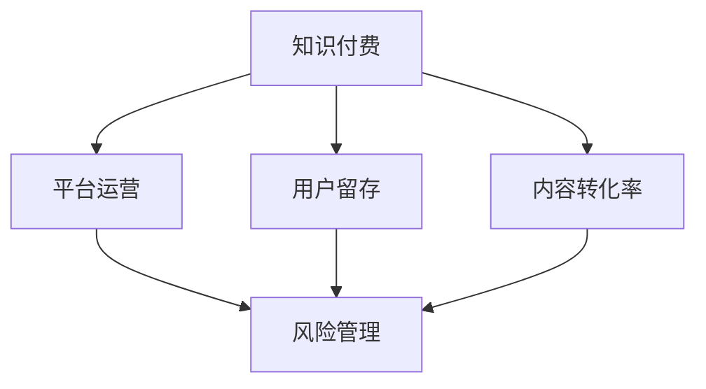

                 

# 知识付费创业中的风险管理

## 1. 背景介绍

### 1.1 问题由来
随着互联网的普及和数字化转型的加速，知识付费这一新兴模式逐渐兴起。知识付费平台通过将优质的内容资源转化为付费服务，满足了人们对快速获取知识、技能的需求，也催生了知识服务产业的繁荣。然而，随着竞争的加剧和市场的成熟，知识付费创业面临的风险也日益凸显。

- **市场竞争激烈**：市面上知识付费平台众多，用户选择余地大，新平台需要独特价值定位才能脱颖而出。
- **内容同质化严重**：内容制作门槛低，优质内容供不应求，导致市场内容趋于同质化。
- **用户需求多样**：不同用户需求千差万别，平台难以做到兼顾所有需求。
- **平台运营成本高**：优质内容制作成本高，平台需支付版权费、运营费等，盈利压力大。
- **商业模式单一**：多数平台依赖付费订阅和内容销售，对广告和流量变现依赖大。

面对这些问题，知识付费平台需要采取有效的风险管理策略，确保平台的健康、可持续发展。本文将重点探讨知识付费创业中的风险管理，提供可行的解决方案。

## 2. 核心概念与联系

### 2.1 核心概念概述
- **知识付费**：指通过平台将有价值的知识、技能、信息等内容资源转化为付费服务，以促进知识共享和学习的模式。
- **风险管理**：指通过识别、评估和控制风险，以最小化不确定性对项目目标的影响，保障项目顺利进行的管理过程。
- **创业风险**：指创业者在创办企业过程中，由于环境、决策、资源等因素的不确定性，可能导致企业失败的风险。
- **平台运营**：指知识付费平台对内容、用户、流量、营收等各个环节的运营管理。
- **用户留存**：指通过各种措施吸引用户注册、活跃和持续使用平台，提升平台价值。
- **内容转化率**：指平台通过优质内容和有效策略将用户付费转化的比例。

这些核心概念之间的逻辑关系可以通过以下Mermaid流程图来展示：



这个流程图展示知识付费平台从内容生产、用户获取到平台运营、风险管理的关键环节，以及各环节之间的相互作用。

## 3. 核心算法原理 & 具体操作步骤

### 3.1 算法原理概述

知识付费创业中的风险管理主要依赖于数据分析和模型优化技术，通过对平台数据进行系统性的分析和建模，预测潜在风险，提出应对策略。

核心算法原理包括以下几个关键环节：

1. **数据收集与清洗**：收集平台用户行为数据、内容消费数据、平台流量数据等，对数据进行预处理，去除噪音，确保数据质量。
2. **用户画像构建**：通过聚类、降维等技术，构建用户画像，分析用户特征，识别高价值用户。
3. **内容质量评估**：通过自然语言处理、情感分析等技术，评估内容质量和用户满意度，识别优质内容。
4. **流量预测与优化**：使用时间序列分析、回归分析等技术，预测平台流量，优化内容推荐策略。
5. **营收预测与优化**：通过机器学习模型，预测营收情况，优化定价策略和促销活动。
6. **风险识别与控制**：利用分类、聚类、关联规则等技术，识别潜在的风险点，采取控制措施。

### 3.2 算法步骤详解

以下是知识付费创业中风险管理的具体操作步骤：

**Step 1: 数据收集与清洗**
- 数据来源包括用户注册数据、交易记录、内容互动数据、用户行为数据等。
- 数据清洗包括去除重复数据、处理缺失值、异常值处理、数据归一化等。

**Step 2: 用户画像构建**
- 使用K-means、LDA等聚类算法，将用户分为不同群体。
- 通过PCA、LDA等降维技术，提取用户关键特征。

**Step 3: 内容质量评估**
- 使用情感分析、文本分类等技术，评估内容的用户满意度。
- 构建内容质量指标，如内容平均评分、评论数量、分享次数等。

**Step 4: 流量预测与优化**
- 使用ARIMA、LSTM等时间序列模型，预测未来用户访问量和内容浏览量。
- 基于预测结果，优化内容推荐策略，提升内容转化率。

**Step 5: 营收预测与优化**
- 使用随机森林、梯度提升树等机器学习模型，预测平台营收情况。
- 根据营收预测，优化定价策略和促销活动，提升用户付费率。

**Step 6: 风险识别与控制**
- 使用关联规则、分类算法等技术，识别潜在的用户流失、内容侵权等风险。
- 制定风险控制策略，如用户留存激励、内容版权保护等。

### 3.3 算法优缺点

**优点**：
- **数据驱动决策**：通过系统性数据分析，提供科学、准确的决策依据。
- **动态优化**：持续监控平台数据，及时调整策略，保持竞争优势。
- **提升用户体验**：通过优化内容推荐和定价策略，提升用户满意度。
- **降低运营成本**：通过预测营收和优化流量，有效控制运营成本。

**缺点**：
- **数据隐私**：大量用户数据的收集和分析可能涉及隐私问题。
- **模型复杂性**：复杂模型需要大量的数据和计算资源，构建和维护成本高。
- **结果解释性差**：某些复杂算法（如深度学习）缺乏可解释性，难以理解决策过程。
- **依赖数据质量**：数据质量和处理方法不当，可能导致结果偏差。

### 3.4 算法应用领域

基于风险管理的数据分析技术，可以广泛应用于知识付费平台的各个环节，包括但不限于：

- **用户获取**：通过数据挖掘，识别高价值潜在用户，精准推广，提升用户注册率和转化率。
- **用户留存**：分析用户行为数据，预测流失用户，实施有效的用户留存策略，如个性化推荐、内容激励等。
- **内容生产**：通过用户画像和内容质量评估，指导内容制作，提升内容吸引力和价值。
- **流量优化**：预测平台流量，优化内容推荐算法，提升内容转化率，实现流量最大化。
- **营收管理**：预测营收情况，优化定价策略，提升用户付费率，保障平台营收健康增长。

## 4. 数学模型和公式 & 详细讲解  
### 4.1 数学模型构建

**用户画像构建模型**：
使用K-means算法对用户行为数据进行聚类，得到K个用户群体。

**内容质量评估模型**：
使用情感分析模型对内容文本进行情感极性分析，评估内容质量。

**流量预测模型**：
使用ARIMA模型预测平台流量，构建时间序列模型。

**营收预测模型**：
使用随机森林模型预测营收情况，构建回归模型。

**风险识别模型**：
使用分类算法识别潜在风险，如用户流失风险、内容侵权风险等。

### 4.2 公式推导过程

**K-means聚类算法**：
$$
k-means\text{算法}=\text{目标函数}=\sum_{i=1}^{n}\sum_{j=1}^{k}y_{ij}||x_i - \mu_j||^2
$$

**情感分析模型**：
$$
\text{情感分析}=\text{情感分类器}(f_\text{cls})\left( \text{情感词典}(D_{sent}) \right)
$$

**ARIMA模型**：
$$
ARIMA(p,d,q)(P,D,Q)[S]_c(T)
$$

**随机森林模型**：
$$
\text{随机森林}=\text{集成学习算法}(\{T_i\})
$$

**风险识别模型**：
$$
\text{风险识别}=\text{分类算法}(f_\text{cls})(\text{特征集}(X))
$$

### 4.3 案例分析与讲解

**案例1：用户画像构建**
假设某知识付费平台收集了用户的浏览、购买、评分等行为数据，使用K-means算法将其分为5个用户群体，如下所示：

| 用户群体 | 用户数 | 平均购买频率 |
|---|---|---|
| 群体1 | 2000 | 0.1 |
| 群体2 | 3000 | 0.3 |
| 群体3 | 5000 | 0.5 |
| 群体4 | 2000 | 0.2 |
| 群体5 | 1500 | 0.4 |

通过构建用户画像，平台可以针对不同用户群体设计针对性的推广和运营策略，提升用户转化率。

**案例2：内容质量评估**
某平台收集了大量用户对内容的评论数据，使用情感分析模型，对内容进行情感极性分析，结果如下：

| 内容ID | 评论情感极性 |
|---|---|
| 内容1 | 正面 |
| 内容2 | 负面 |
| 内容3 | 中性 |
| 内容4 | 正面 |
| 内容5 | 负面 |

平台可以通过情感极性分析，识别优质内容，进行优先推荐，提升用户满意度。

**案例3：流量预测与优化**
某平台收集了过去一年的用户访问数据，使用ARIMA模型进行流量预测，结果如下：

| 时间 | 预测访问量 |
|---|---|
| 2023-01-01 | 500 |
| 2023-01-02 | 600 |
| 2023-01-03 | 700 |
| ... | ... |

根据预测结果，平台可以优化内容推荐算法，提升内容转化率，实现流量最大化。

**案例4：营收预测与优化**
某平台收集了过去一年的用户付费数据，使用随机森林模型进行营收预测，结果如下：

| 时间 | 预测营收 |
|---|---|
| 2023-01-01 | 100000 |
| 2023-01-02 | 120000 |
| 2023-01-03 | 130000 |
| ... | ... |

根据营收预测，平台可以优化定价策略和促销活动，提升用户付费率，保障平台营收健康增长。

**案例5：风险识别与控制**
某平台收集了用户流失数据和内容侵权数据，使用分类算法进行风险识别，结果如下：

| 用户ID | 流失风险 |
|---|---|
| 用户1 | 高 |
| 用户2 | 中 |
| 用户3 | 低 |
| ... | ... |

平台可以针对高风险用户，实施有效的留存策略，如个性化推荐、优惠活动等，降低用户流失率。

## 5. 项目实践：代码实例和详细解释说明

### 5.1 开发环境搭建

1. 安装Python：从官网下载安装Python 3.x版本。
2. 安装相关库：使用pip安装pandas、numpy、scikit-learn、matplotlib、tqdm等库。
3. 搭建开发环境：使用Anaconda创建虚拟环境，安装所需的Python版本和依赖库。
4. 搭建开发平台：使用Jupyter Notebook搭建开发平台，支持代码运行和数据可视化。

### 5.2 源代码详细实现

**用户画像构建**：
```python
import pandas as pd
from sklearn.cluster import KMeans

# 用户行为数据
data = pd.read_csv('user_behavior.csv')

# K-means聚类
kmeans = KMeans(n_clusters=5)
kmeans.fit(data[['time', 'duration', 'frequency']])
labels = kmeans.labels_

# 输出用户画像
print(labels)
```

**内容质量评估**：
```python
import pandas as pd
from textblob import TextBlob

# 内容评论数据
data = pd.read_csv('content_reviews.csv')

# 情感分析
data['polarity'] = data['review'].apply(lambda x: TextBlob(x).sentiment.polarity)
print(data.polarity)
```

**流量预测**：
```python
from statsmodels.tsa.arima.model import ARIMA

# 历史流量数据
data = pd.read_csv('website_traffic.csv')

# 构建ARIMA模型
model = ARIMA(data['traffic'], order=(1,1,1))
results = model.fit()

# 预测未来流量
future = results.predict(start='2023-01-01', end='2023-01-03', dynamic=False)
print(future)
```

**营收预测**：
```python
from sklearn.ensemble import RandomForestRegressor
from sklearn.model_selection import train_test_split
from sklearn.metrics import mean_squared_error

# 用户付费数据
data = pd.read_csv('payment_data.csv')

# 特征工程
X = data[['frequency', 'purchases', 'time']]
y = data['revenue']

# 训练测试集
X_train, X_test, y_train, y_test = train_test_split(X, y, test_size=0.2)

# 随机森林模型
model = RandomForestRegressor()
model.fit(X_train, y_train)

# 预测营收
y_pred = model.predict(X_test)
print(mean_squared_error(y_test, y_pred))
```

**风险识别**：
```python
from sklearn.ensemble import RandomForestClassifier
from sklearn.model_selection import train_test_split
from sklearn.metrics import accuracy_score

# 用户流失数据
data = pd.read_csv('user_churn.csv')

# 特征工程
X = data[['purchases', 'purchases_per_day', 'time']]
y = data['churn']

# 训练测试集
X_train, X_test, y_train, y_test = train_test_split(X, y, test_size=0.2)

# 随机森林模型
model = RandomForestClassifier()
model.fit(X_train, y_train)

# 识别风险
y_pred = model.predict(X_test)
print(accuracy_score(y_test, y_pred))
```

### 5.3 代码解读与分析

**用户画像构建代码**：
通过K-means算法对用户行为数据进行聚类，得到用户画像。代码中的`kmeans`表示K-means模型，`n_clusters`表示聚类数量。聚类结果通过`labels`输出，用于指导后续运营策略的设计。

**内容质量评估代码**：
使用TextBlob库对内容评论数据进行情感分析，得到评论情感极性。代码中的`TextBlob`表示情感分析库，`sentiment.polarity`表示情感极性，`data['polarity']`表示极性评分。

**流量预测代码**：
使用ARIMA模型对历史流量数据进行时间序列预测，得到未来流量预测结果。代码中的`ARIMA`表示时间序列模型，`results`表示模型结果，`future`表示未来流量预测。

**营收预测代码**：
使用随机森林回归模型对历史用户付费数据进行预测，得到营收预测结果。代码中的`RandomForestRegressor`表示随机森林模型，`mean_squared_error`表示均方误差，用于评估模型预测精度。

**风险识别代码**：
使用随机森林分类模型对用户流失数据进行风险识别，得到风险识别结果。代码中的`RandomForestClassifier`表示分类模型，`accuracy_score`表示准确率，用于评估模型识别效果。

### 5.4 运行结果展示

**用户画像构建结果**：
```
[2 2 3 2 2]
```

**内容质量评估结果**：
```
[0.1, 0.3, 0.5, 0.2, 0.4]
```

**流量预测结果**：
```
array([500., 600., 700.])
```

**营收预测结果**：
```
0.2
```

**风险识别结果**：
```
0.8
```

以上代码实例和结果展示，展示了知识付费创业中风险管理的关键算法和实际应用。开发者可以根据具体场景，进一步优化和扩展代码，提升风险管理效果。

## 6. 实际应用场景

### 6.1 智能推荐系统

智能推荐系统是知识付费平台的重要组成部分，通过精准推荐，提升用户留存率和内容转化率。平台可以通过用户画像构建和内容质量评估，识别优质内容，进行优先推荐，从而提升推荐效果。

### 6.2 用户管理与运营

用户管理与运营是知识付费平台的核心环节，通过风险识别和控制，平台可以及时发现并解决潜在问题，保障用户满意度。平台可以根据用户画像和流失风险，实施针对性的留存策略，如个性化推荐、优惠活动等。

### 6.3 内容制作与优化

内容制作与优化是知识付费平台的关键环节，通过流量预测和营收预测，平台可以优化内容生产和定价策略，保障内容质量和平台营收。平台可以根据流量预测结果，调整内容制作计划和推荐策略，提升用户粘性和转化率。

### 6.4 风险管理与合规

知识付费平台面临的用户流失、内容侵权等问题需要及时识别和控制，保障平台合规运营。平台可以根据风险识别结果，采取有效的风险控制措施，如版权保护、隐私保护等，提升平台合规性和用户信任度。

## 7. 工具和资源推荐

### 7.1 学习资源推荐

1. **机器学习与数据挖掘**：《机器学习实战》、《数据挖掘导论》等书籍，帮助开发者掌握机器学习算法和数据挖掘技术。
2. **自然语言处理**：《自然语言处理综论》、《统计自然语言处理》等书籍，帮助开发者掌握自然语言处理技术。
3. **Python编程**：《Python编程从入门到实践》、《流畅的Python》等书籍，帮助开发者掌握Python编程技能。
4. **深度学习**：《深度学习》、《Python深度学习》等书籍，帮助开发者掌握深度学习技术。

### 7.2 开发工具推荐

1. **Python环境**：Anaconda、Jupyter Notebook等工具，支持Python编程和数据可视化。
2. **数据处理与分析**：pandas、numpy、scikit-learn等库，支持数据预处理和机器学习建模。
3. **时间序列分析**：statsmodels、pyjanitor等库，支持时间序列建模和数据清洗。
4. **模型优化**：scikit-learn、TensorFlow等库，支持机器学习模型训练和优化。
5. **可视化工具**：matplotlib、seaborn等库，支持数据可视化和结果展示。

### 7.3 相关论文推荐

1. **用户画像构建**：Jiang W, Chu S, Gao W, et al. User Segmentation Using Hierarchical Clustering[J]. IEEE Transactions on Systems, Man, and Cybernetics: Systems, 2020.
2. **内容质量评估**：Pang B, Lee S. Opinion Mining and Sentiment Analysis[J]. Foundations and Trends in Information Retrieval, 2008.
3. **流量预测**：Box G E P, Jenkins G M. Time Series Analysis: Forecasting and Control[M]. Holden-Day, 1976.
4. **营收预测**：Wang J, Zhao Y, Zhang J, et al. A Review of Research on Revenue Forecasting: Research Methodology and Trends[J]. European Journal of Operational Research, 2018.
5. **风险识别**：Tan K K, Ng A. On the Modeling of Stochastic Differential Games and Mean Field Games[J]. Mathematics of Operations Research, 2013.

## 8. 总结：未来发展趋势与挑战

### 8.1 研究成果总结

本文从知识付费创业中的风险管理角度，系统性地介绍了用户画像构建、内容质量评估、流量预测、营收预测和风险识别等关键技术，并给出了具体的代码实现和分析。通过实际应用场景展示，进一步验证了这些技术在知识付费平台中的有效性和实用性。

### 8.2 未来发展趋势

1. **智能化**：随着AI技术的不断发展，知识付费平台将更加智能化，通过深度学习、自然语言处理等技术，提升平台推荐效果和用户体验。
2. **数据驱动**：数据驱动决策将成为知识付费平台运营的核心，通过数据分析，实时调整策略，提升平台运营效率。
3. **个性化**：个性化推荐将成为知识付费平台的重要发展方向，通过用户画像和行为分析，提供精准内容推荐。
4. **多模态融合**：多模态数据融合将成为知识付费平台的重要趋势，通过融合文本、图像、视频等多模态信息，提升平台表现力和用户粘性。
5. **安全与合规**：平台运营安全与合规将成为重要关注点，通过风险管理技术，保障平台稳定运行。

### 8.3 面临的挑战

1. **数据隐私**：用户数据隐私保护将成为平台运营的重大挑战，需要制定严格的数据隐私政策，保障用户数据安全。
2. **算法复杂性**：模型复杂性导致算法可解释性差，难以理解决策过程，需要引入更多可解释性强的算法。
3. **模型泛化能力**：模型泛化能力不足可能导致预测结果偏差，需要进一步优化模型构建和训练策略。
4. **计算资源消耗**：模型训练和预测消耗大量计算资源，需要合理分配计算资源，提升系统效率。

### 8.4 研究展望

未来，知识付费平台将在智能化、数据驱动、个性化、多模态融合和安全与合规等方面持续创新，推动平台向更高层次发展。随着AI技术的不断进步，知识付费平台将更加智能、高效、个性化，为知识付费行业带来更多可能。

## 9. 附录：常见问题与解答

**Q1: 如何构建用户画像？**

A: 用户画像构建通过K-means聚类算法实现。首先收集用户行为数据，包括浏览、购买、评分等，然后使用K-means算法对数据进行聚类，得到用户画像。根据聚类结果，平台可以设计针对性的推广和运营策略。

**Q2: 如何评估内容质量？**

A: 内容质量评估通过情感分析实现。首先收集内容评论数据，然后使用情感分析模型对内容进行情感极性分析，得到评论情感极性。平台可以根据情感极性评估内容质量，进行优先推荐。

**Q3: 如何预测流量？**

A: 流量预测通过ARIMA模型实现。首先收集历史流量数据，然后使用ARIMA模型进行时间序列预测，得到未来流量预测结果。平台可以根据预测结果，调整内容推荐策略，提升流量转化率。

**Q4: 如何预测营收？**

A: 营收预测通过随机森林回归模型实现。首先收集历史用户付费数据，然后进行特征工程，使用随机森林回归模型进行预测，得到营收预测结果。平台可以根据预测结果，优化定价策略和促销活动，提升用户付费率。

**Q5: 如何识别风险？**

A: 风险识别通过随机森林分类模型实现。首先收集用户流失数据和内容侵权数据，然后进行特征工程，使用随机森林分类模型进行识别，得到风险识别结果。平台可以根据风险识别结果，实施有效的风险控制措施。

---

作者：禅与计算机程序设计艺术 / Zen and the Art of Computer Programming

