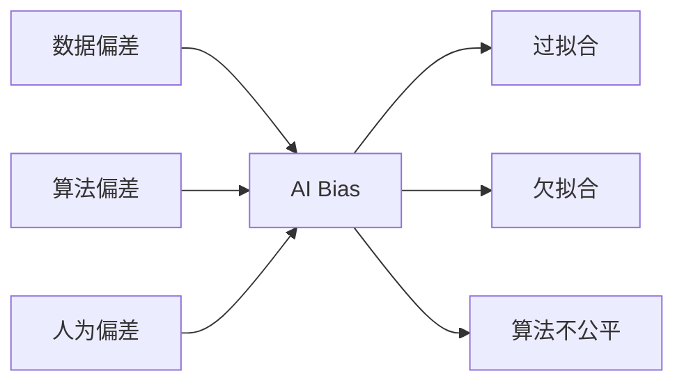

# AI Bias原理与代码实例讲解

## 1. 背景介绍
### 1.1 AI Bias的定义与现状
### 1.2 AI Bias产生的原因
#### 1.2.1 数据偏差
#### 1.2.2 算法偏差  
#### 1.2.3 人为偏差
### 1.3 AI Bias的危害

## 2. 核心概念与联系
### 2.1 偏差(Bias)与方差(Variance)
### 2.2 过拟合(Overfitting)与欠拟合(Underfitting)
### 2.3 算法公平性(Fairness)
### 2.4 核心概念之间的关系



## 3. 核心算法原理具体操作步骤
### 3.1 数据预处理
#### 3.1.1 数据清洗
#### 3.1.2 特征选择 
#### 3.1.3 数据增强
### 3.2 模型训练
#### 3.2.1 交叉验证
#### 3.2.2 正则化
#### 3.2.3 集成学习
### 3.3 模型评估
#### 3.3.1 混淆矩阵
#### 3.3.2 ROC曲线
#### 3.3.3 公平性指标

## 4. 数学模型和公式详细讲解举例说明
### 4.1 分类模型
#### 4.1.1 逻辑回归
逻辑回归模型:
$$P(Y=1|x) = \frac{1}{1+e^{-(\beta_0+\beta_1x_1+...+\beta_px_p)}}$$
其中,$x_1,...x_p$为特征,$\beta_0,\beta_1...\beta_p$为待学习参数。
#### 4.1.2 支持向量机
支持向量机目标函数:
$$\min \limits_{w,b} \frac{1}{2}||w||^2 \quad s.t. \quad y_i(w^Tx_i+b) \geq 1, i=1,2...N$$

### 4.2 回归模型
#### 4.2.1 线性回归
线性回归模型:
$$y = \beta_0 + \beta_1x_1 + ... + \beta_px_p + \epsilon$$
其中,$\epsilon$为随机误差。
#### 4.2.2 岭回归
岭回归损失函数:
$$L(w) = \sum_{i=1}^N(y_i - w^Tx_i)^2 + \lambda||w||^2$$
其中,$\lambda$为正则化系数。

## 5. 项目实践：代码实例和详细解释说明
### 5.1 数据预处理示例
```python
from sklearn.preprocessing import StandardScaler

# 标准化数值型特征
scaler = StandardScaler()
X_train_scaled = scaler.fit_transform(X_train) 
X_test_scaled = scaler.transform(X_test)
```
标准化可以将不同量纲的特征统一到相同尺度,有利于提升模型性能,减少某些特征主导模型的情况。

### 5.2 模型训练示例
```python
from sklearn.linear_model import LogisticRegression
from sklearn.model_selection import GridSearchCV

# 设置正则化系数搜索范围
param_grid = {'C': [0.001, 0.01, 0.1, 1, 10]}

lr = LogisticRegression(penalty='l2')

# 基于网格搜索进行超参数优化
grid_search = GridSearchCV(lr, param_grid, cv=5)
grid_search.fit(X_train_scaled, y_train)

# 输出最优模型
print(grid_search.best_params_)
print(grid_search.best_score_)
```
使用网格搜索对正则化系数C进行优化,可以在一定程度上缓解过拟合,提高模型泛化性能。

### 5.3 模型评估示例
```python
from sklearn.metrics import roc_auc_score
from fairlearn.metrics import demographic_parity_difference

# 计算AUC
auc = roc_auc_score(y_test, y_pred_prob)

# 计算人口统计学均衡差异
diffs = demographic_parity_difference(
    y_test, y_pred, sensitive_features=X_test['gender']
)
```
除了常规的准确率、AUC等指标外,在评估模型是否存在偏差时,还需要考虑一些公平性指标,如人口统计学均衡差异等。

## 6. 实际应用场景
### 6.1 人脸识别中的性别、肤色偏差
### 6.2 信贷评分模型中的年龄歧视
### 6.3 招聘系统中的性别歧视
### 6.4 刑事司法系统中的种族偏见

## 7. 工具和资源推荐
### 7.1 数据集
- [UCI Machine Learning Repository](https://archive.ics.uci.edu/ml/index.php)
- [Kaggle Datasets](https://www.kaggle.com/datasets) 

### 7.2 Python库
- [scikit-learn](https://scikit-learn.org/)
- [FairLearn](https://fairlearn.org/)
- [AI Fairness 360](https://aif360.mybluemix.net/)

### 7.3 相关书籍
- 《Fairness and Machine Learning》
- 《Weapons of Math Destruction》

## 8. 总结：未来发展趋势与挑战
### 8.1 AI Bias研究的重要性日益凸显
### 8.2 从技术和管理两个层面缓解偏差
### 8.3 构建负责任、可信赖的AI系统
### 8.4 跨领域合作与伦理治理

## 9. 附录：常见问题与解答
### Q1: 如何判断一个模型是否存在偏差?
**A1:** 主要有以下几个方面:
1. 评估模型在不同人口统计学群体上的性能差异
2. 考察模型是否存在"有利于"或"不利于"某些群体的系统性偏差
3. 使用公平性指标如人口统计学均衡、机会均等等衡量模型的偏差程度

### Q2: 如何在实践中减少AI Bias?
**A2:** 在实践中减少AI Bias需要从数据、算法、人三个层面着手:
1. 数据层面: 关注数据的代表性和均衡性,尽量消除数据中的偏差
2. 算法层面: 使用正则化、集成学习等手段提高模型的泛化性能,并引入公平性约束
3. 人的层面: 提高从业人员的AI伦理意识,建立第三方审计机制

### Q3: AI Bias治理需要哪些不同领域的合作?
**A3:** AI Bias是一个跨学科的复杂问题,需要技术、法律、社会学、伦理学等多个领域通力合作。未来亟需构建一套行之有效的AI伦理治理体系,制定相关法律法规,加强行业自律,促进人工智能健康有序发展。

作者：禅与计算机程序设计艺术 / Zen and the Art of Computer Programming