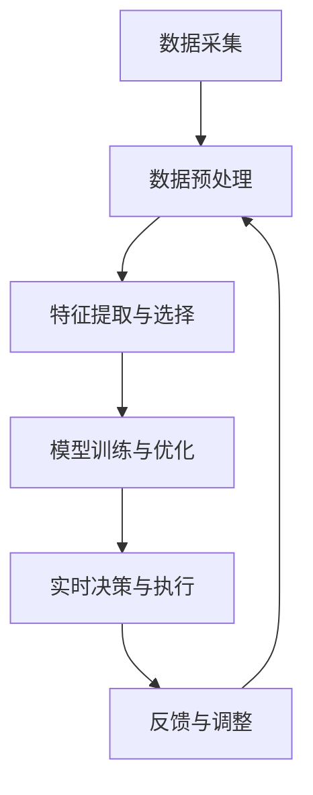

# AI人工智能代理工作流AI Agent WorkFlow：智能代理在能源管理系统中的应用

## 1.背景介绍

在全球能源需求不断增长的背景下，能源管理系统（EMS）变得越来越重要。传统的能源管理系统主要依赖于人工操作和预设规则，难以应对复杂多变的能源环境。随着人工智能（AI）技术的迅猛发展，智能代理（AI Agent）在能源管理系统中的应用成为了一个新的研究热点。智能代理通过自主学习和决策，可以显著提高能源管理的效率和灵活性。

## 2.核心概念与联系

### 2.1 智能代理（AI Agent）

智能代理是一种能够自主感知环境、做出决策并执行行动的计算机程序。它通常由感知模块、决策模块和执行模块组成。智能代理可以通过机器学习算法不断优化其决策过程，从而在复杂环境中实现高效的任务执行。

### 2.2 能源管理系统（EMS）

能源管理系统是一种用于监控、控制和优化能源使用的系统。它通常包括数据采集、数据分析、决策支持和控制执行等功能。EMS的目标是通过优化能源使用，提高能源效率，降低能源成本。

### 2.3 智能代理与能源管理系统的结合

将智能代理引入能源管理系统，可以实现对能源使用的实时监控和动态优化。智能代理可以根据实时数据和历史数据，自动调整能源使用策略，从而提高系统的整体效率。

## 3.核心算法原理具体操作步骤

### 3.1 数据采集与预处理

智能代理首先需要从能源管理系统中获取各种数据，包括能源消耗数据、环境数据、设备状态数据等。这些数据需要经过预处理，如去噪、归一化等，以便后续的分析和建模。

### 3.2 特征提取与选择

在预处理后的数据中，智能代理需要提取出对决策有用的特征。这些特征可以是原始数据的直接表示，也可以是通过特征工程生成的高阶特征。特征选择的目的是减少数据维度，提高模型的训练效率和预测准确性。

### 3.3 模型训练与优化

智能代理通常使用机器学习算法来训练决策模型。常用的算法包括线性回归、决策树、支持向量机、神经网络等。模型训练的过程包括模型选择、参数调优和交叉验证等步骤。为了提高模型的泛化能力，通常需要进行模型的正则化和集成学习。

### 3.4 实时决策与执行

训练好的模型可以用于实时决策。智能代理根据实时数据输入，生成相应的决策输出，并通过执行模块将决策付诸实施。为了保证决策的有效性，智能代理需要不断监控执行结果，并根据反馈信息进行调整和优化。



## 4.数学模型和公式详细讲解举例说明

### 4.1 线性回归模型

线性回归是一种最简单的回归模型，用于预测连续变量。其数学表达式为：

$$
y = \beta_0 + \beta_1 x_1 + \beta_2 x_2 + \cdots + \beta_n x_n + \epsilon
$$

其中，$y$ 是目标变量，$x_1, x_2, \ldots, x_n$ 是特征变量，$\beta_0, \beta_1, \ldots, \beta_n$ 是模型参数，$\epsilon$ 是误差项。

### 4.2 决策树模型

决策树是一种用于分类和回归的树状模型。其基本思想是通过一系列的决策规则，将数据划分成不同的子集。决策树的构建过程包括节点分裂、树的剪枝等步骤。

### 4.3 神经网络模型

神经网络是一种模拟人脑神经元结构的模型，广泛应用于复杂模式识别和预测任务。其基本结构包括输入层、隐藏层和输出层。神经网络的训练过程包括前向传播、反向传播和梯度下降等步骤。

$$
y = f(Wx + b)
$$

其中，$W$ 是权重矩阵，$x$ 是输入向量，$b$ 是偏置向量，$f$ 是激活函数。

## 5.项目实践：代码实例和详细解释说明

### 5.1 数据采集与预处理

```python
import pandas as pd
from sklearn.preprocessing import StandardScaler

# 读取数据
data = pd.read_csv('energy_data.csv')

# 数据预处理
scaler = StandardScaler()
data_scaled = scaler.fit_transform(data)
```

### 5.2 特征提取与选择

```python
from sklearn.feature_selection import SelectKBest, f_regression

# 特征选择
selector = SelectKBest(score_func=f_regression, k=10)
data_selected = selector.fit_transform(data_scaled, target)
```

### 5.3 模型训练与优化

```python
from sklearn.model_selection import train_test_split
from sklearn.linear_model import LinearRegression
from sklearn.metrics import mean_squared_error

# 数据分割
X_train, X_test, y_train, y_test = train_test_split(data_selected, target, test_size=0.2, random_state=42)

# 模型训练
model = LinearRegression()
model.fit(X_train, y_train)

# 模型评估
y_pred = model.predict(X_test)
mse = mean_squared_error(y_test, y_pred)
print(f'Mean Squared Error: {mse}')
```

### 5.4 实时决策与执行

```python
def make_decision(input_data):
    # 数据预处理
    input_scaled = scaler.transform(input_data)
    input_selected = selector.transform(input_scaled)
    
    # 模型预测
    decision = model.predict(input_selected)
    return decision

# 实时数据输入
real_time_data = pd.read_csv('real_time_data.csv')
decision = make_decision(real_time_data)
print(f'Real-time Decision: {decision}')
```

## 6.实际应用场景

### 6.1 智能电网

智能电网是智能代理在能源管理系统中的一个重要应用场景。通过智能代理，可以实现对电力负荷的实时监控和动态调度，从而提高电网的稳定性和效率。

### 6.2 智能建筑

在智能建筑中，智能代理可以根据实时数据和历史数据，自动调整空调、照明等设备的运行状态，从而实现节能减排。

### 6.3 工业能源管理

在工业能源管理中，智能代理可以对生产设备的能源使用进行优化，减少能源浪费，提高生产效率。

## 7.工具和资源推荐

### 7.1 开源工具

- **TensorFlow**：一个开源的机器学习框架，广泛应用于深度学习模型的训练和部署。
- **Scikit-learn**：一个基于Python的机器学习库，提供了丰富的算法和工具。
- **Pandas**：一个强大的数据处理和分析工具，适用于数据预处理和特征工程。

### 7.2 数据集

- **UCI Machine Learning Repository**：一个包含大量公开数据集的资源库，适用于机器学习模型的训练和测试。
- **Kaggle**：一个数据科学竞赛平台，提供了丰富的数据集和竞赛项目。

### 7.3 学习资源

- **Coursera**：提供了丰富的机器学习和人工智能课程，适合初学者和进阶学习者。
- **edX**：一个在线学习平台，提供了来自顶尖大学的机器学习和人工智能课程。

## 8.总结：未来发展趋势与挑战

### 8.1 未来发展趋势

随着人工智能技术的不断进步，智能代理在能源管理系统中的应用前景广阔。未来，智能代理将更加智能化和自主化，能够在更复杂的环境中实现高效的能源管理。同时，随着物联网技术的发展，智能代理将能够获取更多的实时数据，从而提高决策的准确性和及时性。

### 8.2 挑战

尽管智能代理在能源管理系统中具有广阔的应用前景，但也面临一些挑战。首先，数据的质量和可靠性是智能代理决策的基础，如何获取高质量的数据是一个重要问题。其次，智能代理的决策过程需要考虑多种因素，如经济效益、环境影响等，如何在多目标之间进行权衡是一个难题。最后，智能代理的安全性和可靠性也是一个重要问题，特别是在关键能源系统中的应用。

## 9.附录：常见问题与解答

### 9.1 智能代理在能源管理系统中的优势是什么？

智能代理可以实现对能源使用的实时监控和动态优化，从而提高系统的整体效率。相比于传统的能源管理系统，智能代理具有更高的灵活性和自主性。

### 9.2 如何选择合适的机器学习算法？

选择合适的机器学习算法需要考虑多个因素，如数据的特征、任务的类型、计算资源等。常用的算法包括线性回归、决策树、支持向量机、神经网络等。

### 9.3 如何保证智能代理的决策准确性？

为了保证智能代理的决策准确性，需要进行充分的数据预处理和特征选择，并使用交叉验证等方法进行模型评估和优化。同时，智能代理需要不断监控执行结果，并根据反馈信息进行调整和优化。

### 9.4 智能代理在能源管理系统中的应用有哪些实际案例？

智能代理在能源管理系统中的应用包括智能电网、智能建筑、工业能源管理等。通过智能代理，可以实现对电力负荷的实时监控和动态调度，自动调整空调、照明等设备的运行状态，对生产设备的能源使用进行优化等。

作者：禅与计算机程序设计艺术 / Zen and the Art of Computer Programming