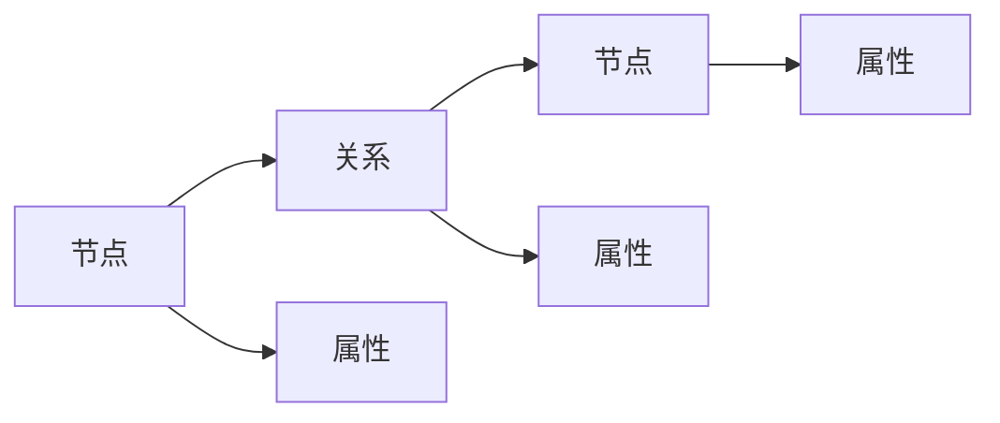
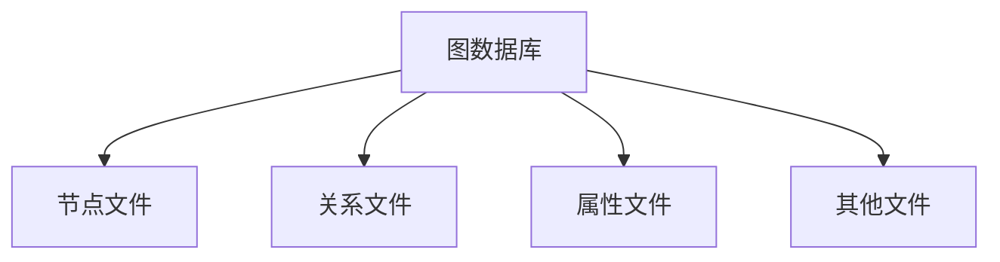
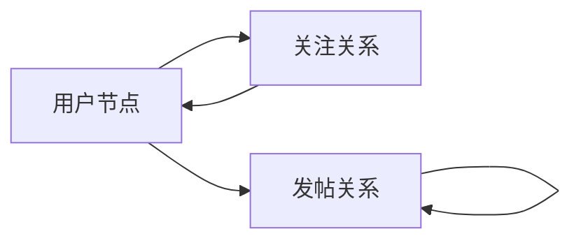

# AI系统Neo4j原理与代码实战案例讲解

## 1.背景介绍

在当今数据爆炸式增长的时代,传统的关系型数据库在处理高度连接的数据时表现得力不从心。Neo4j作为一种先进的图数据库,凭借其独特的属性图模型和声明式查询语言Cypher,在处理复杂数据关系方面展现出了巨大的优势。Neo4j已经被广泛应用于社交网络、推荐系统、知识图谱、反欺诈检测等诸多领域。

随着人工智能(AI)技术的不断发展,Neo4j与AI的结合也变得越来越紧密。Neo4j可以高效地存储和查询AI系统所需的大规模关系数据,为AI算法提供优质的数据支持。同时,Neo4j也可以用于构建知识图谱,为AI系统提供丰富的背景知识和语义信息。

## 2.核心概念与联系

### 2.1 Neo4j核心概念

Neo4j是一种基于属性图模型的图数据库,它将数据表示为由节点(Node)和关系(Relationship)组成的图结构。每个节点和关系都可以附加任意数量的属性(Property)。



Neo4j使用声明式查询语言Cypher来操作图数据。Cypher语法简洁易懂,能够高效地表达复杂的图模式匹配和遍历操作。

### 2.2 Neo4j与AI的联系

Neo4j与AI的联系主要体现在以下几个方面:

1. **知识图谱构建**:Neo4j可以高效地存储和查询知识图谱数据,为AI系统提供丰富的背景知识和语义信息。

2. **关系数据存储**:AI系统中常常需要处理大规模的关系数据,如社交网络、推荐系统等,Neo4j在这方面有着天然的优势。

3. **图算法支持**:Neo4j内置了多种图算法,如最短路径、中心性等,可以为AI算法提供有力的支持。

4. **可扩展性**:Neo4j具有良好的水平扩展能力,能够支持大规模数据和高并发查询。

## 3.核心算法原理具体操作步骤  

Neo4j的核心算法原理主要包括以下几个方面:

### 3.1 图存储引擎

Neo4j采用了本地化的图存储引擎,将整个图数据库存储在本地磁盘上。图数据被划分为多个存储文件,包括节点文件、关系文件、属性文件等。这种本地化的存储方式使得Neo4j在读写操作时具有很高的性能。



### 3.2 图遍历算法

Neo4j支持多种图遍历算法,如深度优先搜索(DFS)、广度优先搜索(BFS)等。这些算法被广泛应用于图模式匹配、最短路径查找等场景。

以BFS为例,其基本步骤如下:

1. 将起始节点放入队列
2. 取出队首节点,检查是否为目标节点
3. 将该节点的所有未访问邻居节点加入队尾
4. 重复步骤2-3,直到找到目标节点或队列为空

$$
\begin{array}{ll}
1) &  \textbf{Input:} \\
   & \qquad \text{Graph } G = (V, E) \\
   & \qquad \text{Start node } s \\
   & \qquad \text{Target node } t \\
2) & \textbf{Initialize:}\\  
   & \qquad \text{Queue } Q \gets \{ s \}\\
   & \qquad \text{Set of visited nodes } V' \gets \{ s \}\\
3) & \textbf{Loop:}\\
   & \qquad \textbf{while } Q \text{ is not empty}\\
   & \qquad\qquad n \gets \text{dequeue}(Q)\\
   & \qquad\qquad \textbf{if } n = t\\
   & \qquad\qquad\qquad \textbf{return} \text{ path from } s \text{ to } t\\  
   & \qquad\qquad \textbf{for each} \text{ neighbor } m \text{ of } n\\
   & \qquad\qquad\qquad \textbf{if } m \notin V'\\
   & \qquad\qquad\qquad\qquad \text{enqueue}(Q, m)\\
   & \qquad\qquad\qquad\qquad V' \gets V' \cup \{m\}\\
4) & \textbf{Return:} \text{No path from } s \text{ to } t \text{ exists}
\end{array}
$$

### 3.3 索引与约束

为了提高查询性能,Neo4j支持在节点和关系上创建索引。索引可以加快属性的查找速度,但也会增加写操作的开销。

另外,Neo4j还支持在属性上添加约束,如唯一性约束、节点键约束等,这有助于保证数据的完整性和一致性。

### 3.4 事务与ACID

Neo4j支持ACID事务,确保数据操作的原子性、一致性、隔离性和持久性。事务可以包含多个读写操作,要么全部成功提交,要么全部回滚。

## 4.数学模型和公式详细讲解举例说明

在Neo4j中,一些图算法和查询操作往往需要借助数学模型和公式来描述和实现。下面我们将详细讲解其中的一些核心数学模型和公式。

### 4.1 PageRank算法

PageRank算法最初被用于评估网页的重要性和排名,现在也被广泛应用于图数据库中节点重要性的计算。

PageRank算法的基本思想是:一个节点的重要性不仅取决于它被多少节点链接,还取决于链接它的节点的重要性。具体来说,节点 $v_i$ 的PageRank值 $PR(v_i)$ 可以通过以下公式计算:

$$
PR(v_i) = (1 - d) + d \sum_{v_j \in In(v_i)} \frac{PR(v_j)}{Out(v_j)}
$$

其中:

- $d$ 是一个阻尼系数,通常取值0.85
- $In(v_i)$ 表示所有链接到 $v_i$ 的节点集合
- $Out(v_j)$ 表示节点 $v_j$ 的出度(链出边的数量)

PageRank算法通过迭代的方式计算每个节点的PR值,直到收敛或达到最大迭代次数。

### 4.2 最短路径算法

在图数据库中,查找两个节点之间的最短路径是一个常见的需求。Neo4j支持多种最短路径算法,如Dijkstra算法、A*算法等。

以Dijkstra算法为例,它可以用于在加权图中查找单源最短路径。算法的基本思想是从源节点开始,不断扩展到其他节点,并维护一个距离值表示从源节点到该节点的最短距离。

设 $G=(V,E)$ 是一个加权图, $s$ 是源节点, $d[v]$ 表示从 $s$ 到节点 $v$ 的最短距离,则Dijkstra算法可以描述为:

$$
\begin{array}{ll}
1) & \textbf{Initialize:}\\
   & \qquad d[s] \gets 0\\
   & \qquad d[v] \gets \infty, \forall v \in V \setminus \{s\}\\
   & \qquad Q \gets V\\
2) & \textbf{Loop:}\\
   & \qquad \textbf{while } Q \neq \emptyset\\
   & \qquad\qquad u \gets \text{ExtractMin}(Q, d)\\
   & \qquad\qquad \textbf{for each} (u, v) \in E\\
   & \qquad\qquad\qquad \textbf{if } d[v] > d[u] + w(u, v)\\
   & \qquad\qquad\qquad\qquad d[v] \gets d[u] + w(u, v)
\end{array}
$$

其中 $w(u, v)$ 表示边 $(u, v)$ 的权重。算法的时间复杂度为 $O((|V| + |E|) \log |V|)$。

## 5.项目实践：代码实例和详细解释说明

为了更好地理解Neo4j的使用,我们将通过一个实际项目案例来讲解相关的代码实现。这个案例是一个简单的社交网络应用,包括用户(User)、关注(Follow)、发帖(Post)等基本功能。

### 5.1 数据模型

我们使用以下数据模型来表示社交网络:



- 用户节点(User)包含属性如姓名、年龄、地址等
- 关注关系(Follow)表示一个用户关注另一个用户
- 发帖关系(Post)表示一个用户发布了一条帖子,帖子之间也可以存在引用关系

### 5.2 创建节点和关系

使用Cypher语句,我们可以创建节点和关系:

```cypher
// 创建用户节点
CREATE (:User {name: 'Alice', age: 25, address: 'City A'})
CREATE (:User {name: 'Bob', age: 30, address: 'City B'})

// 创建关注关系
MATCH (u1:User), (u2:User)
WHERE u1.name = 'Alice' AND u2.name = 'Bob'
CREATE (u1)-[:FOLLOW]->(u2)

// 创建发帖关系
MATCH (u:User)
WHERE u.name = 'Alice'
CREATE (u)-[:POST]->(p1:Post {content: 'Hello world!'}),
       (p1)-[:REPLY_TO]->(p2:Post {content: 'Nice post!'})
```

### 5.3 查询和遍历

Cypher语句可以用于查询和遍历图数据,例如:

```cypher
// 查找Alice的所有关注者
MATCH (u:User)-[:FOLLOW]->(a:User)
WHERE a.name = 'Alice'
RETURN u.name

// 查找Alice发布的所有帖子
MATCH (a:User)-[:POST*]->(p:Post)
WHERE a.name = 'Alice'
RETURN p.content

// 查找两个用户之间的最短路径
MATCH (a:User), (b:User), path = shortestPath((a)-[*]-(b))
WHERE a.name = 'Alice' AND b.name = 'Bob'
RETURN path
```

## 6.实际应用场景

Neo4j因其优秀的图数据处理能力,在许多领域都有广泛的应用。下面我们列举几个典型的应用场景:

### 6.1 社交网络

社交网络中存在大量的人际关系数据,Neo4j可以高效地存储和查询这些关系数据,支持社交网络中的好友推荐、内容推荐等功能。

### 6.2 知识图谱

知识图谱是一种结构化的知识库,Neo4j可以用于构建和查询知识图谱,为智能问答系统、语义搜索等AI应用提供支持。

### 6.3 反欺诈检测

在金融、电商等领域,反欺诈检测需要分析大量的交易数据和关系数据,Neo4j可以帮助发现隐藏的欺诈模式和关系网络。

### 6.4 推荐系统

推荐系统中需要处理大量的用户、物品以及它们之间的关系数据,Neo4j可以高效地存储和查询这些数据,为推荐算法提供支持。

## 7.工具和资源推荐

在使用Neo4j时,有一些工具和资源可以为我们提供帮助:

- **Neo4j Desktop**: 一个图形化的客户端工具,可以方便地管理Neo4j数据库、运行Cypher查询等。
- **Neo4j Browser**: 一个基于Web的图形化界面,可以直接在浏览器中操作Neo4j数据库。
- **Neo4j驱动程序**: Neo4j提供了多种语言的官方驱动程序,如Java、Python、JavaScript等,方便开发人员编写应用程序。
- **Neo4j Bloom**: 一个基于Neo4j的图数据科学工具,提供了数据可视化、图算法等功能。
- **Neo4j社区**: Neo4j拥有一个活跃的社区,可以在论坛、Stack Overflow等渠道获取帮助和资源。

## 8.总结：未来发展趋势与挑战

作为一种先进的图数据库,Neo4j在处理复杂关系数据方面展现出了巨大的优势。随着人工智能技