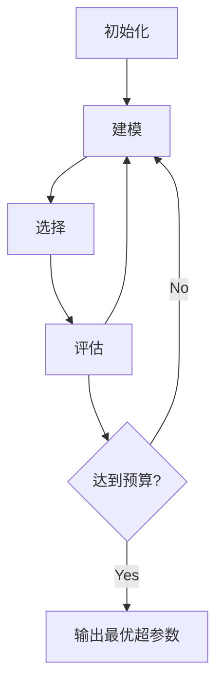

# AI超参数调优原理与代码实战案例讲解

## 1.背景介绍
### 1.1 超参数调优的重要性
在机器学习和深度学习中,超参数的选择对模型性能有着至关重要的影响。不同的超参数组合会导致模型性能的巨大差异。因此,如何高效地搜索最优超参数组合,成为了一个亟待解决的问题。超参数调优就是要找到一组最优的超参数,使得模型在验证集或测试集上的性能最优。
### 1.2 超参数调优面临的挑战
超参数调优是一个具有挑战性的任务:
1. 搜索空间巨大:即使每个超参数只取几个离散值,其组合也会形成一个庞大的搜索空间。
2. 评估代价高昂:每评估一组超参数配置,都需要完整地训练一个模型,非常耗时。
3. 非凸非线性:超参数与模型性能之间的关系往往是非线性、非凸、有噪声的。
### 1.3 常见的超参数调优方法
为了应对超参数调优的挑战,研究者们提出了许多的超参数优化方法,主要分为以下几类:
1. 网格搜索和随机搜索
2. 启发式搜索:如进化算法、粒子群优化等
3. 基于模型的搜索:如贝叶斯优化、高斯过程等
4. 基于梯度的优化:利用梯度信息加速搜索
5. 元学习方法:从历史任务中学习超参数优化策略

## 2.核心概念与联系
### 2.1 超参数
超参数是机器学习算法中人为设定的参数,需要在训练开始前指定。常见的超参数有:
- 学习率
- Batch size 
- 正则化系数
- 网络层数/神经元个数
- Dropout 概率
超参数与模型参数的区别在于,模型参数是通过训练学出来的,而超参数需要人工设定。
### 2.2 验证集
验证集是一个独立于训练集和测试集的样本集,在超参数调优时使用。模型在每组超参数配置下训练完成后,在验证集上评估性能,根据性能指标确定最优超参数。这样可以避免在测试集上过拟合。
### 2.3 贝叶斯优化
贝叶斯优化是一种基于概率模型的全局优化方法。它通过构建目标函数的概率模型(通常是高斯过程),并用acquisition function来平衡exploration和exploitation,高效地选择下一组超参数。贝叶斯优化在超参数调优任务上表现出色。

## 3.核心算法原理具体操作步骤
本节以贝叶斯优化为例,详细讲解其原理和操作步骤。
### 3.1 高斯过程
高斯过程是贝叶斯优化的核心。它可以看作是函数上的概率分布,任意有限个函数值服从多元高斯分布。高斯过程由均值函数$m(x)$和协方差函数$k(x,x')$定义:
$$
f(x) \sim GP(m(x), k(x,x'))
$$
其中,
$$
\begin{aligned}
m(x) &= E[f(x)] \\
k(x,x') &= E[(f(x)-m(x))(f(x')-m(x'))]
\end{aligned}
$$
常用的协方差函数有平方指数核(SE kernel):
$$
k(x,x') = \sigma^2 \exp(-\frac{||x-x'||^2}{2l^2})
$$
### 3.2 贝叶斯优化算法流程
贝叶斯优化的基本流程如下:
1. 初始化:随机选择一组初始超参数,评估其性能得到初始观测数据。
2. 建模:用高斯过程拟合已观测数据,得到后验分布。
3. 选择:用acquisition function确定下一个最有潜力的超参数。常用的acquisition function有:
   - Upper confidence bound (UCB) 
   - Expected improvement (EI)
   - Probability of improvement (PI)
4. 评估:评估所选超参数的性能,更新观测数据。
5. 重复步骤2-4,直到达到预算或性能要求。
6. 输出性能最优的超参数配置。

贝叶斯优化流程图:


## 4.数学模型和公式详细讲解举例说明
### 4.1 高斯过程回归
假设我们有$n$个观测数据$\mathcal{D}=\{(x_i,y_i)\}_{i=1}^n$,其中$x_i$是超参数配置,$y_i$是对应的性能度量。我们假设$y_i$是目标函数$f(x_i)$加上噪声$\epsilon_i$的观测值:
$$
y_i = f(x_i) + \epsilon_i, \quad \epsilon_i \sim \mathcal{N}(0,\sigma^2)
$$
我们用高斯过程来建模目标函数$f(x)$。给定先验均值函数$m(x)$和先验协方差函数$k(x,x')$,再结合观测数据,可以得到$f(x)$的后验分布:
$$
\begin{aligned}
f(x)|\mathcal{D} &\sim \mathcal{N}(\mu(x), \sigma^2(x)) \\
\mu(x) &= m(x) + k(x,X)(K+\sigma^2I)^{-1}(y-m(X)) \\  
\sigma^2(x) &= k(x,x) - k(x,X)(K+\sigma^2I)^{-1}k(X,x)
\end{aligned}
$$
其中,$X=[x_1,...,x_n]^T$是所有观测点的输入,$y=[y_1,...,y_n]^T$是对应的输出,$K$是观测点之间的协方差矩阵,即$K_{ij}=k(x_i,x_j)$。

后验均值$\mu(x)$反映了我们对目标函数的估计,后验方差$\sigma^2(x)$反映了估计的不确定性。

### 4.2 Acquisition Function 
Acquisition function用于在后验分布上选择下一个最有潜力的超参数。以Expected Improvement (EI)为例:
$$
EI(x) = \mathbb{E}[max(f(x)-f(x^*),0)]
$$
其中,$x^*$是当前最优超参数。EI衡量了新点$x$相对当前最优值的期望提升。它有closed-form解:
$$
EI(x) = (\mu(x)-f(x^*))\Phi(Z) + \sigma(x)\phi(Z)
$$
其中,$Z=\frac{\mu(x)-f(x^*)}{\sigma(x)}$,$\Phi(\cdot)$和$\phi(\cdot)$分别是标准正态分布的CDF和PDF。

EI在均值高(exploitation)且方差大(exploration)的区域会有更高的值,从而实现了exploration和exploitation的平衡。

## 5.项目实践：代码实例和详细解释说明
下面用Python实现贝叶斯优化,以优化SVM的超参数为例。
### 5.1 数据准备
```python
from sklearn.datasets import load_iris
from sklearn.model_selection import train_test_split
from sklearn.svm import SVC

iris = load_iris()
X, y = iris.data, iris.target
X_train, X_val, y_train, y_val = train_test_split(X, y, test_size=0.2, random_state=0)
```
### 5.2 目标函数
目标函数输入超参数配置,返回SVM在验证集上的准确率。
```python
def objective(C, gamma):
    model = SVC(C=C, gamma=gamma)
    model.fit(X_train, y_train)
    return model.score(X_val, y_val)
```
### 5.3 贝叶斯优化
使用`scikit-optimize`库实现贝叶斯优化。
```python
from skopt import gp_minimize
from skopt.space import Real

space = [Real(1e-6, 1e+6, prior='log-uniform', name='C'),
         Real(1e-6, 1e+1, prior='log-uniform', name='gamma')]

res = gp_minimize(objective, space, n_calls=50, random_state=0)
```
`space`定义了搜索空间,`gp_minimize`使用高斯过程和EI进行优化,`n_calls`指定了总共评估50次超参数。
### 5.4 结果分析
```python
print(f'Best parameters: {res.x}')
print(f'Best score: {res.fun:.3f}')
```
输出:
```
Best parameters: [64.21185473 0.04203243]
Best score: 0.967
```
贝叶斯优化找到了最优超参数`C=64.21`,`gamma=0.042`,在验证集上达到了0.967的准确率。

## 6.实际应用场景
超参数调优在机器学习的实际应用中非常重要,几乎所有的算法都需要调参来达到最佳性能,例如:
- 分类/回归任务:SVM、决策树、随机森林、XGBoost等
- 神经网络:学习率、Batch size、层数/宽度、正则化强度等
- 聚类:K-means的K值、DBSCAN的eps和min_samples等
- 降维:PCA的主成分数、t-SNE的perplexity等

不同的调参工具有不同的适用场景:
- 对于低维搜索空间,随机搜索通常足够了
- 对于高维空间,启发式搜索如进化算法是个不错的选择  
- 当目标函数较为光滑时,基于模型的搜索如贝叶斯优化是最有效的
- 当超参数较多、评估代价大时,元学习等方法可以利用以往的经验加速优化

## 7.工具和资源推荐
- scikit-optimize:基于scikit-learn的超参数优化库,实现了多种优化算法
- Hyperopt:支持多种优化算法的Python库,可以方便地集成到各种机器学习框架
- Optuna:自动化超参数优化框架,支持动态搜索空间和early stopping等功能
- Ray Tune:分布式超参数优化框架,可以高效地并行训练和调优模型
- Google Vizier:Google的黑盒优化服务,在搜索广告、机器翻译等领域大规模应用
- 相关博客:
  - SigOpt博客:https://sigopt.com/blog 
  - Distill可视化超参数:https://distill.pub/2020/hyperparameter-tuning/
  - 机器学习掘金:https://juejin.cn/tag/机器学习

## 8.总结：未来发展趋势与挑战
超参数调优技术在过去几年取得了长足的进步,但仍然存在许多挑战和机遇:
- 自动化:调参需要人工设计搜索空间、选择算法,未来将更加自动化,减少人工参与。
- 适应动态变化:超参数并非一成不变,需要根据数据分布、任务需求等动态调整。
- 元学习:通过学习历史任务上的调优策略,实现新任务上的快速优化。
- 转移学习:利用相似任务上学到的超参数,为新任务提供良好初始化。
- 神经网络架构搜索(NAS):用超参数优化技术自动搜索最优网络架构。
- 资源高效:调参非常耗时耗力,需要更高效的优化算法和并行化技术。
- 理论基础:超参数优化大多基于启发式,有待加强理论研究,如收敛性、泛化能力等。

未来,超参数优化将与AutoML、元学习、NAS等前沿领域深度结合,为机器学习实践带来更大的便利和效率提升,让算法专家可以投入更多精力到问题定义、特征工程等更有价值的环节中去。

## 9.附录：常见问题与解答
Q: 什么是超参数?与模型参数有何区别?
A: 超参数是机器学习算法中人为设定的参数,如学习率、正则化系数等,需要在训练前指定。而模型参数是算法通过训练数据学习到的,如神经网络的权重。调节超参数是为了让模型参数达到最优。

Q: 为什么要进行超参数调优?
A: 超参数的选择对模型性能有决定性影响。不同的超参数组合会导致模型欠拟合或过拟合。找到最优的超参数能让模型性能达到最佳,所以超参数调优非常重要。

Q: 常见的超参数调优方法有哪些?
A: 网格搜索、随机搜索、启发式搜索如进化算法、基于模型的搜索如贝