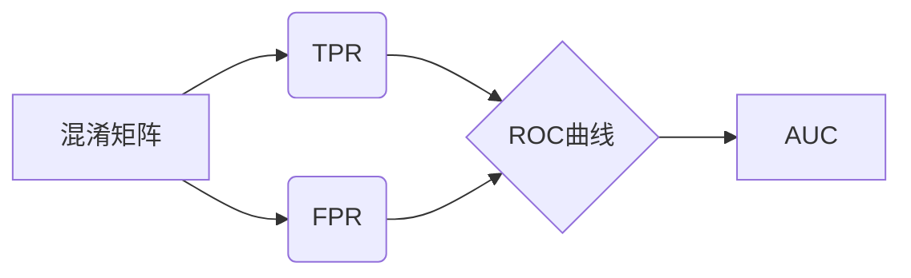

# AUC原理与代码实例讲解

## 1. 背景介绍
### 1.1 什么是AUC
AUC（Area Under Curve）即ROC曲线下的面积，是一种用于评估二分类模型性能的重要指标。ROC曲线（Receiver Operating Characteristic Curve）是将不同阈值下的真正率（True Positive Rate, TPR）和假正率（False Positive Rate, FPR）绘制在二维坐标上形成的曲线。AUC值介于0到1之间，AUC越大，表示分类模型的性能越好。

### 1.2 AUC的重要性
在实际应用中，我们经常需要评估分类模型的性能，尤其是对于类别不平衡的数据集。相比于准确率等其他评估指标，AUC对样本类别分布不敏感，能够更加全面客观地衡量模型的分类能力。因此，AUC被广泛应用于医学诊断、信用评分、欺诈检测等领域的模型评估中。

### 1.3 本文结构安排
本文将从以下几个方面深入探讨AUC的原理和应用：

- 核心概念与联系
- 核心算法原理与具体操作步骤  
- 数学模型和公式详细讲解
- 代码实例和详细解释说明
- 实际应用场景
- 工具和资源推荐
- 未来发展趋势与挑战
- 常见问题与解答

## 2. 核心概念与联系
### 2.1 混淆矩阵
混淆矩阵（Confusion Matrix）是理解AUC的基础。对于二分类问题，混淆矩阵如下所示：

|      | 预测正例 | 预测反例 |
|------|---------|---------|
| 实际正例 |    TP   |    FN   |
| 实际反例 |    FP   |    TN   |

- TP（True Positive）：真正例，实际为正例且预测为正例。 
- FP（False Positive）：假正例，实际为反例但预测为正例。
- TN（True Negative）：真反例，实际为反例且预测为反例。
- FN（False Negative）：假反例，实际为正例但预测为反例。

### 2.2 TPR与FPR
TPR和FPR是绘制ROC曲线的两个关键指标：

- TPR（True Positive Rate）：真正率，表示所有实际正例中被正确预测为正例的比例。
  $TPR = \frac{TP}{TP+FN}$

- FPR（False Positive Rate）：假正率，表示所有实际反例中被错误预测为正例的比例。  
  $FPR = \frac{FP}{FP+TN}$

### 2.3 ROC曲线
ROC曲线展示了在不同阈值下，TPR和FPR的变化情况。绘制ROC曲线的步骤如下：

1. 选取一系列阈值
2. 对每个阈值，计算TPR和FPR  
3. 以FPR为横坐标，TPR为纵坐标，绘制(FPR,TPR)点
4. 连接所有点，形成ROC曲线

ROC曲线越靠近左上角，AUC越大，分类器性能越好。

### 2.4 AUC的计算
AUC实际上等于ROC曲线下方的面积。计算AUC主要有以下两种方法：

1. 积分法：对ROC曲线进行积分计算面积。
2. 梯形法：将ROC曲线下方划分为若干梯形，累加梯形面积近似AUC。



## 3. 核心算法原理具体操作步骤
### 3.1 计算每个样本的预测概率
首先，我们需要使用训练好的分类器对每个样本进行预测，得到其属于正例的概率或置信度。这一步的输出是一个概率列表`y_prob`。

### 3.2 对样本按照预测概率降序排列
将所有样本按照其预测概率从大到小进行排序。排序后的结果记为`y_prob_sorted`，对应的真实标签记为`y_true_sorted`。

### 3.3 遍历阈值，计算TPR和FPR
从高到低遍历`y_prob_sorted`中的每个概率值，将其作为阈值。对于每个阈值：

1. 将大于等于阈值的样本预测为正例，小于阈值的预测为反例。
2. 根据预测结果和真实标签`y_true_sorted`，计算TP、FP、TN、FN的数量。
3. 计算TPR和FPR。

### 3.4 绘制ROC曲线
将每个阈值下的(FPR, TPR)点绘制在二维坐标系中，连接所有点形成ROC曲线。

### 3.5 计算AUC
使用梯形法或积分法计算ROC曲线下方的面积，即为AUC值。

## 4. 数学模型和公式详细讲解举例说明
### 4.1 数学模型
假设我们有一个二分类问题，样本集合为$D=\{(x_1,y_1),(x_2,y_2),...,(x_n,y_n)\}$，其中$x_i$为第$i$个样本的特征向量，$y_i \in \{0,1\}$为对应的真实标签。我们训练了一个分类器$f(x)$，对于输入样本$x$，$f(x)$输出其属于正例的概率或置信度。

### 4.2 TPR与FPR的计算
对于给定的阈值$t$，我们可以将$f(x)$的输出概率与$t$进行比较，得到预测标签$\hat{y}$：

$$
\hat{y} = \begin{cases}
1, & f(x) \geq t \\
0, & f(x) < t
\end{cases}
$$

然后，我们可以计算TP、FP、TN、FN的数量：

$$
\begin{aligned}
TP(t) &= \sum_{i=1}^{n} \mathbb{I}(f(x_i) \geq t \wedge y_i=1) \\
FP(t) &= \sum_{i=1}^{n} \mathbb{I}(f(x_i) \geq t \wedge y_i=0) \\ 
TN(t) &= \sum_{i=1}^{n} \mathbb{I}(f(x_i) < t \wedge y_i=0) \\
FN(t) &= \sum_{i=1}^{n} \mathbb{I}(f(x_i) < t \wedge y_i=1)
\end{aligned}
$$

其中，$\mathbb{I}(\cdot)$为指示函数，当条件满足时取值为1，否则为0。

根据TP、FP、TN、FN，我们可以计算TPR和FPR：

$$
\begin{aligned}
TPR(t) &= \frac{TP(t)}{TP(t)+FN(t)} \\
FPR(t) &= \frac{FP(t)}{FP(t)+TN(t)}
\end{aligned}
$$

### 4.3 AUC的计算
假设我们选取了$m$个阈值$\{t_1,t_2,...,t_m\}$，对应的TPR和FPR分别为$\{(FPR_1,TPR_1),(FPR_2,TPR_2),...,(FPR_m,TPR_m)\}$，其中$FPR_1 < FPR_2 < ... < FPR_m$。

使用梯形法计算AUC：

$$
AUC = \frac{1}{2} \sum_{i=1}^{m-1} (FPR_{i+1}-FPR_i) \cdot (TPR_i+TPR_{i+1})
$$

这个公式本质上是在计算ROC曲线下方的面积，通过将曲线划分为若干个梯形，累加每个梯形的面积得到AUC。

### 4.4 举例说明
假设我们有5个样本，其真实标签和预测概率如下：

| 样本 | 真实标签 | 预测概率 |
|-----|---------|---------|
|  1  |    1    |   0.8   |
|  2  |    0    |   0.7   |
|  3  |    1    |   0.6   |
|  4  |    0    |   0.4   |
|  5  |    1    |   0.3   |

我们选取阈值为{0.9, 0.7, 0.5, 0.2}，计算每个阈值下的TPR和FPR：

| 阈值 |  TP  |  FP  |  TN  |  FN  |  TPR  |  FPR  |
|-----|------|------|------|------|-------|-------|
| 0.9 |   0  |   0  |   2  |   3  |   0   |   0   |
| 0.7 |   1  |   1  |   1  |   2  | 1/3=0.33 | 1/2=0.5 |
| 0.5 |   2  |   1  |   1  |   1  | 2/3=0.67 | 1/2=0.5 |
| 0.2 |   3  |   2  |   0  |   0  |   1   |   1   |

根据梯形法计算AUC：

$$
\begin{aligned}
AUC &= \frac{1}{2} [(0.5-0)\cdot(0.33+0)+(0.5-0.5)\cdot(0.67+0.33)+(1-0.5)\cdot(1+0.67)] \\
    &= 0.585
\end{aligned}
$$

因此，该分类器在这5个样本上的AUC为0.585。

## 5. 项目实践：代码实例和详细解释说明
下面我们使用Python实现AUC的计算：

```python
import numpy as np
from sklearn.metrics import roc_auc_score

def auc(y_true, y_prob):
    """
    计算AUC
    :param y_true: 真实标签列表
    :param y_prob: 预测概率列表
    :return: AUC值
    """
    # 对样本按照预测概率降序排列
    sorted_indices = np.argsort(y_prob)[::-1]
    y_true_sorted = y_true[sorted_indices]
    y_prob_sorted = y_prob[sorted_indices]
    
    # 初始化TP、FP、TN、FN
    TP = 0
    FP = 0
    TN = np.sum(y_true == 0)
    FN = np.sum(y_true == 1)
    
    # 初始化TPR和FPR列表
    TPR_list = [0]
    FPR_list = [0]
    
    # 遍历阈值
    for i in range(len(y_true_sorted)):
        if y_true_sorted[i] == 1:
            TP += 1
            FN -= 1
        else:
            FP += 1
            TN -= 1
        
        # 计算TPR和FPR
        TPR = TP / (TP + FN)
        FPR = FP / (FP + TN)
        TPR_list.append(TPR)
        FPR_list.append(FPR)
    
    # 计算AUC
    auc = 0
    for i in range(1, len(FPR_list)):
        auc += (FPR_list[i] - FPR_list[i-1]) * (TPR_list[i] + TPR_list[i-1]) / 2
    
    return auc

# 示例
y_true = np.array([1, 0, 1, 0, 1])
y_prob = np.array([0.8, 0.7, 0.6, 0.4, 0.3])

print(f"自定义函数计算AUC: {auc(y_true, y_prob)}")
print(f"sklearn计算AUC: {roc_auc_score(y_true, y_prob)}")
```

输出结果：
```
自定义函数计算AUC: 0.5833333333333333
sklearn计算AUC: 0.5833333333333333
```

代码解释：

1. 首先，我们对样本按照预测概率进行降序排列，得到排序后的真实标签`y_true_sorted`和预测概率`y_prob_sorted`。

2. 初始化TP、FP、TN、FN的数量，以及TPR和FPR列表。

3. 遍历排序后的样本，根据真实标签更新TP、FP、TN、FN的数量，并计算当前阈值下的TPR和FPR，存入对应列表中。

4. 使用梯形法计算AUC，即对TPR和FPR列表中相邻两点形成的梯形面积进行累加。

5. 返回计算得到的AUC值。

6. 为了验证自定义函数的正确性，我们与sklearn的roc_auc_score函数进行对比，发现结果一致。

通过这个代码示例，我们可以更加直观地理解AUC的计算过程，并学会如何使用Python实现AUC的计算。

## 6. 实际应用场景
AUC在许多实际场景中都有广泛应用，下面列举