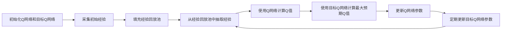

## 1. 背景介绍

在人工智能领域，强化学习（Reinforcement Learning, RL）是一种重要的机器学习方法，它使得智能体（agent）能够在与环境的交互中学习如何做出最优决策。DeepMind在2013年提出了深度Q网络（Deep Q-Network, DQN），将深度学习与强化学习相结合，成功解决了一系列复杂的决策问题，尤其是在Atari 2600视频游戏上取得了突破性的成绩。DQN的提出不仅在学术界引起了巨大反响，也为工业界提供了新的解决方案。

## 2. 核心概念与联系

在深入DQN之前，我们需要理解几个核心概念：

- **状态（State）**: 智能体所处的环境状态。
- **动作（Action）**: 智能体在某状态下可以采取的行为。
- **奖励（Reward）**: 智能体采取动作后从环境中获得的反馈。
- **策略（Policy）**: 智能体根据当前状态选择动作的规则。
- **价值函数（Value Function）**: 预测智能体从某状态开始，按照特定策略行动所能获得的累积奖励。
- **Q函数（Q-Function）**: 价值函数的一种，预测在某状态下采取某动作所能获得的累积奖励。

DQN的核心在于使用深度神经网络来近似Q函数，即Q值。

## 3. 核心算法原理具体操作步骤

DQN的工作流程可以用以下步骤描述：

1. 初始化Q网络和目标Q网络。
2. 采集初始经验，填充经验回放池。
3. 从经验回放池中随机抽取一批经验。
4. 使用Q网络计算当前状态下每个动作的Q值。
5. 使用目标Q网络计算下一个状态的最大预期Q值。
6. 根据奖励和最大预期Q值更新Q网络的参数。
7. 每隔一定步数更新目标Q网络的参数。



## 4. 数学模型和公式详细讲解举例说明

DQN的核心是Q学习（Q-Learning），其数学模型基于贝尔曼方程（Bellman Equation）。Q值的更新公式如下：

$$ Q_{\text{new}}(s_t, a_t) = Q(s_t, a_t) + \alpha \left[ r_{t+1} + \gamma \max_{a} Q(s_{t+1}, a) - Q(s_t, a_t) \right] $$

其中，$s_t$和$a_t$分别代表当前状态和动作，$r_{t+1}$是动作后获得的奖励，$\gamma$是折扣因子，$\alpha$是学习率。

在DQN中，我们使用深度神经网络来近似Q函数，网络的输出是对每个动作的Q值预测。通过最小化以下损失函数来训练网络：

$$ L(\theta) = \mathbb{E} \left[ \left( r + \gamma \max_{a'} Q(s', a'; \theta^-) - Q(s, a; \theta) \right)^2 \right] $$

其中，$\theta$和$\theta^-$分别是当前Q网络和目标Q网络的参数。

## 5. 项目实践：代码实例和详细解释说明

以下是一个简化的DQN代码实例，用于解释其工作原理：

```python
import numpy as np
import random
from collections import deque
from keras.models import Sequential
from keras.layers import Dense
from keras.optimizers import Adam

class DQNAgent:
    def __init__(self, state_size, action_size):
        self.state_size = state_size
        self.action_size = action_size
        self.memory = deque(maxlen=2000)
        self.gamma = 0.95    # discount rate
        self.epsilon = 1.0    # exploration rate
        self.epsilon_min = 0.01
        self.epsilon_decay = 0.995
        self.learning_rate = 0.001
        self.model = self._build_model()
        self.target_model = self._build_model()
        self.update_target_model()

    def _build_model(self):
        # Neural Net for Deep-Q learning Model
        model = Sequential()
        model.add(Dense(24, input_dim=self.state_size, activation='relu'))
        model.add(Dense(24, activation='relu'))
        model.add(Dense(self.action_size, activation='linear'))
        model.compile(loss='mse', optimizer=Adam(lr=self.learning_rate))
        return model

    def update_target_model(self):
        # copy weights from model to target_model
        self.target_model.set_weights(self.model.get_weights())

    def remember(self, state, action, reward, next_state, done):
        self.memory.append((state, action, reward, next_state, done))

    def act(self, state):
        if np.random.rand() <= self.epsilon:
            return random.randrange(self.action_size)
        act_values = self.model.predict(state)
        return np.argmax(act_values[0])  # returns action

    def replay(self, batch_size):
        minibatch = random.sample(self.memory, batch_size)
        for state, action, reward, next_state, done in minibatch:
            target = reward
            if not done:
                target = (reward + self.gamma *
                          np.amax(self.target_model.predict(next_state)[0]))
            target_f = self.model.predict(state)
            target_f[0][action] = target
            self.model.fit(state, target_f, epochs=1, verbose=0)
        if self.epsilon > self.epsilon_min:
            self.epsilon *= self.epsilon_decay

# ... (省略环境初始化和训练循环代码)

```

在这段代码中，我们定义了一个`DQNAgent`类，它包含了DQN算法的主要逻辑。`_build_model`方法构建了一个简单的神经网络，用于近似Q值。`remember`方法将经验存储在回放池中。`act`方法根据当前状态选择动作，`replay`方法从回放池中抽取经验并更新网络参数。

## 6. 实际应用场景

DQN已经被应用于多种场景，包括但不限于：

- 游戏AI：如Atari游戏、棋类游戏。
- 机器人控制：如机械臂抓取、自主导航。
- 资源管理：如数据中心能源优化。
- 金融领域：如自动交易系统。

## 7. 工具和资源推荐

- TensorFlow和PyTorch：两个流行的深度学习框架，适用于实现DQN。
- OpenAI Gym：提供了多种环境，用于测试和开发强化学习算法。
- Stable Baselines：一个强化学习算法库，包含了DQN的实现。

## 8. 总结：未来发展趋势与挑战

DQN是强化学习领域的一个重要里程碑，但它仍然面临着一些挑战，如样本效率低、训练稳定性差等。未来的研究可能会集中在改进算法的效率、稳定性以及泛化能力上。

## 9. 附录：常见问题与解答

- Q: DQN和传统Q学习有什么区别？
- A: DQN使用深度神经网络来近似Q函数，而传统Q学习通常使用表格来存储Q值。

- Q: DQN如何解决探索和利用的平衡问题？
- A: DQN通过逐渐减小探索率（epsilon）来平衡探索和利用。

- Q: 为什么需要目标Q网络？
- A: 目标Q网络可以稳定训练过程，防止Q值估计过程中的目标值不断变化导致的不稳定。

作者：禅与计算机程序设计艺术 / Zen and the Art of Computer Programming