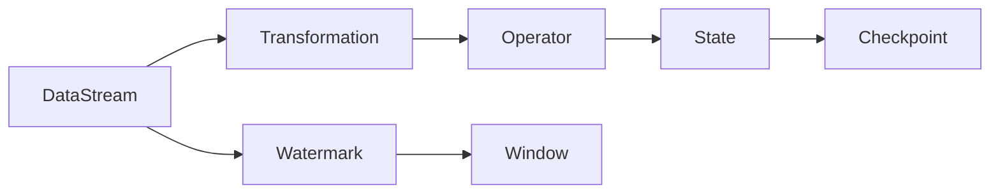

# Flink原理与代码实例讲解

## 1. 背景介绍
### 1.1 大数据处理的挑战
在当今大数据时代,海量数据的实时处理和分析已成为企业的迫切需求。传统的批处理框架如Hadoop MapReduce难以满足实时性要求,而Storm等流处理框架虽然实时性较好,但表现力和容错性不足。
### 1.2 Flink的诞生
Apache Flink是一个开源的分布式流处理和批处理框架,由德国柏林工业大学的研究人员发起。Flink在实时性、高吞吐、容错性等方面具有独特优势,逐渐成为大数据处理领域的新星。
### 1.3 Flink的发展历程
- 2009年,Flink前身Stratosphere项目启动
- 2014年,Stratosphere捐献给Apache基金会,更名为Flink
- 2015年,Flink正式成为Apache顶级项目
- 2019年,阿里巴巴宣布开源基于Flink的Blink平台
- 2021年,Flink 1.14发布,引入全新的批流一体引擎

## 2. 核心概念与联系
### 2.1 数据流(DataStream)
Flink以数据流作为核心抽象,数据流是一个分布式数据集,可以包含重复数据。
### 2.2 转换(Transformation)
转换操作定义了数据流之间的计算逻辑,如map、filter、reduce等。
### 2.3 时间(Time)
Flink支持事件时间(Event Time)、处理时间(Processing Time)和摄取时间(Ingestion Time)三种时间语义。
### 2.4 状态(State)
Flink提供了丰富的状态管理机制,如键控状态(Keyed State)、算子状态(Operator State)等。
### 2.5 检查点(Checkpoint)
Flink基于分布式快照实现容错,周期性地为算子状态生成检查点。
### 2.6 水位线(Watermark)
水位线用于处理乱序事件,表示某个时间点之前的数据都已到达。



## 3. 核心算法原理具体操作步骤
### 3.1 窗口算法
Flink支持滚动窗口(Tumbling Window)、滑动窗口(Sliding Window)、会话窗口(Session Window)等多种窗口类型。窗口算法的基本步骤如下:
1. 定义窗口分配器,将元素分配到不同窗口
2. 定义触发器,决定何时触发窗口计算  
3. 定义移除器,决定何时移除窗口
4. 定义窗口函数,对窗口内的元素进行计算

### 3.2 状态后端
Flink提供了三种状态后端:MemoryStateBackend、FsStateBackend、RocksDBStateBackend。不同状态后端的工作原理如下:
- MemoryStateBackend:将状态存储在JVM堆内存中,性能最好但容量有限
- FsStateBackend:将状态存储在文件系统(如HDFS)中,容量大但性能一般 
- RocksDBStateBackend:将状态存储在RocksDB数据库中,兼顾性能与容量

### 3.3 检查点算法
Flink基于Chandy-Lamport分布式快照算法实现检查点,主要步骤如下:
1. JobManager向所有算子发送检查点屏障(barrier)
2. 算子收到屏障后暂停处理,保存状态快照,向下游广播屏障
3. 所有算子完成快照后通知JobManager
4. JobManager收集快照元数据形成完整检查点

### 3.4 背压机制
Flink采用基于信用度的流控方法实现背压,步骤如下:  
1. 下游算子向上游算子申请信用度(credit)
2. 上游算子根据下游信用度安排发送数据
3. 下游算子消费数据后再次申请信用度
4. 上下游算子动态调整信用度,实现流量控制

## 4. 数学模型和公式详细讲解举例说明
### 4.1 窗口模型
以滑动窗口为例,假设窗口大小为$w$,滑动步长为$s$,则第$n$个窗口的起始位置$start(W_n)$和结束位置$end(W_n)$为:

$$
start(W_n) = n * s \\
end(W_n) = start(W_n) + w
$$

例如,对于30分钟窗口、5分钟滑动步长,第2个窗口($W_2$)覆盖的时间区间为:

$$
start(W_2) = 2 * 5 = 10 \\
end(W_2) = 10 + 30 = 40
$$

即$W_2$覆盖[10, 40)时间区间内的数据。

### 4.2 水位线更新
水位线用于处理乱序事件,Flink使用如下公式更新水位线$W(t)$:

$$
W(t) = max(W(t'), t - l)
$$

其中$t'$是上一个水位线的时间,$l$是最大允许延迟。例如,当前时间$t=100$,最大允许延迟$l=10$,上一个水位线$W(95) = 89$,则当前水位线为:

$$
W(100) = max(89, 100-10) = 90  
$$

即$t=100$时,可以确定事件时间小于90的数据都已到达。

### 4.3 反压模型
反压通过动态调整信用度实现流控。假设下游算子当前可用信用度为$c$,每个数据记录的权重为$w$,则下游能接收的记录数$n$为:

$$
n = \lfloor \frac{c}{w} \rfloor
$$

其中$\lfloor x \rfloor$表示对$x$向下取整。例如,当前信用度$c=1000$,记录权重$w=100$,则下游算子可以接收$\lfloor \frac{1000}{100} \rfloor = 10$条记录。上游算子根据下游申请的信用度安排发送,避免数据积压。

## 5. 项目实践：代码实例和详细解释说明
下面通过一个实际的Flink项目演示核心API的使用。该项目从socket接收文本数据,进行词频统计并打印结果。

```java
public class SocketWordCount {
    public static void main(String[] args) throws Exception {
        // 创建流处理环境
        StreamExecutionEnvironment env = StreamExecutionEnvironment.getExecutionEnvironment();

        // 从socket读取文本
        DataStream<String> text = env.socketTextStream("localhost", 9999);

        // 分词、转换成(word, 1)二元组
        DataStream<Tuple2<String, Integer>> wordCounts = text
            .flatMap((FlatMapFunction<String, Tuple2<String, Integer>>) (line, out) -> {
                String[] words = line.split("\\s+");
                for (String word : words) {
                    out.collect(Tuple2.of(word, 1));
                }
            })
            .returns(Types.TUPLE(Types.STRING, Types.INT))
            // 按单词分组
            .keyBy(t -> t.f0)
            // 聚合计数
            .sum(1);

        // 打印结果
        wordCounts.print();

        // 执行任务
        env.execute("Socket Word Count");
    }
}
```

代码解释:
1. 首先创建Flink流处理环境`StreamExecutionEnvironment`。
2. 使用`socketTextStream`方法从socket读取文本数据,得到`DataStream<String>`。
3. 对文本数据进行分词,使用`flatMap`算子将每个单词转换成`(word, 1)`二元组。
4. 使用`keyBy`算子按单词进行分组,将相同单词的二元组聚合到一起。
5. 对分组后的数据使用`sum`算子进行聚合计数,得到每个单词的出现次数。
6. 使用`print`算子将结果打印到控制台。
7. 最后调用`execute`方法执行任务。

以上就是一个简单的Flink词频统计项目,展示了Flink DataStream API的基本用法。Flink还支持窗口、时间、状态等高级特性,可以实现更加复杂的流处理逻辑。

## 6. 实际应用场景
Flink凭借其优异的流处理能力,在多个行业领域得到广泛应用,主要场景包括:

### 6.1 实时数据分析
Flink可以对流式数据进行实时统计分析,如网站点击流日志分析、电商用户行为分析等,帮助企业实时洞察业务情况、快速响应市场变化。

### 6.2 实时数据集成
Flink能够实时接入多源异构数据,并进行清洗、转换和关联,构建实时数据仓库或数据中台,为上层应用提供统一的数据服务。

### 6.3 实时风控与反欺诈
金融、电商等行业使用Flink进行实时交易监控,通过规则引擎或机器学习模型实时识别异常行为,防范欺诈风险,保障业务安全。

### 6.4 物联网数据处理
Flink适合处理物联网场景下的海量传感器数据,如工业设备监控、车联网等,实现设备故障实时预警、车辆状态实时分析等应用。

### 6.5 在线机器学习
Flink提供了机器学习库FlinkML,支持在线学习算法如线性回归、k-means聚类等,可用于实时推荐、异常检测等智能应用。

## 7. 工具和资源推荐
### 7.1 Flink官方文档
Flink官网提供了详尽的用户文档和API文档,是学习和使用Flink的权威指南。
官网地址: https://flink.apache.org/

### 7.2 Flink中文社区
Flink中文社区提供了丰富的中文学习资源,包括文章、视频、代码示例等,拥有活跃的讨论氛围。 
社区地址: http://flink-china.org/

### 7.3 Ververica Platform
Ververica Platform(原名Flink Forward Platform)是Flink的商业发行版,提供了Flink的企业级支持与服务,简化了Flink应用的开发、部署与运维。
官网地址: https://www.ververica.com/

### 7.4 阿里巴巴Blink
Blink是阿里巴巴基于Flink研发的企业级实时计算引擎,拥有诸多优化与扩展,在阿里集团内部广泛应用。Blink于2019年开源,与Flink社区共同发展。
GitHub地址: https://github.com/apache/flink-blink

### 7.5 《Stream Processing with Apache Flink》
该书由Flink核心贡献者撰写,系统讲解了Flink的架构设计与实现原理,是深入理解Flink内部机制的不二之选。
豆瓣地址: https://book.douban.com/subject/33426127/

## 8. 总结：未来发展趋势与挑战
### 8.1 流批一体化
流批一体化是大数据处理的必然趋势,Flink通过统一的DataStream/DataSet API,以及共享的状态存储和执行引擎,实现了真正意义上的流批统一。未来Flink将进一步简化流批融合的应用开发与部署。

### 8.2 SQL上统一  
Flink提供了强大的SQL支持,批流统一的Table API和SQL API使得Flink可以兼容多种上层应用。未来Flink将增强SQL的表达能力,成为大数据处理领域的通用计算引擎。

### 8.3 云原生部署
Flink已经支持了Kubernetes、Yarn等多种资源调度平台,并提供了会话、作业、应用等多种部署模式。未来Flink将更加贴合云原生架构,提供serverless、细粒度资源管理等能力,实现按需使用、按量付费的弹性计算。

### 8.4 机器学习
机器学习是Flink的重要发展方向,当前FlinkML已支持了多种常用的机器学习算法。未来Flink将借鉴TensorFlow、PyTorch等深度学习框架的经验,增强其在机器学习尤其是深度学习领域的表现力,打造端到端机器学习平台。

### 8.5 性能优化
尽管Flink在性能方面已经领先于众多同类框架,但仍有较大的优化空间。未来Flink将在编译器优化、算子Codegen、网络栈等方面持续发力,进一步提升整体性能,同时降低资源开销。

## 9. 附录：常见问题与解答
### Q1: Flink与Spark Streaming的区别是什么？
A1: 二者最大的区别在于数据处理