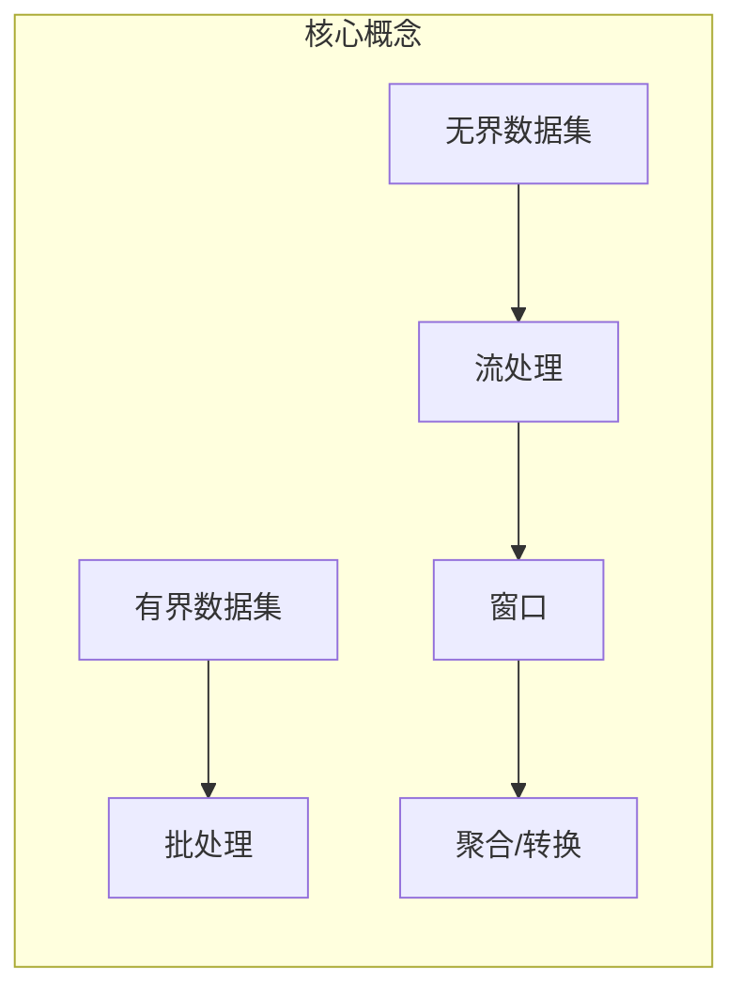
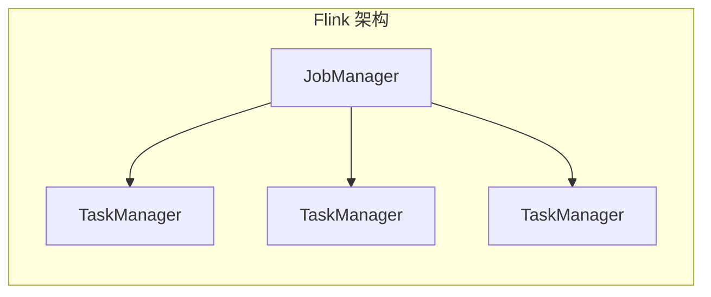
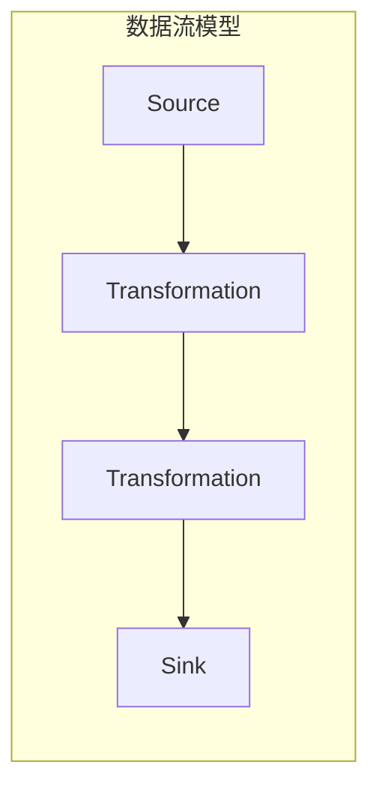
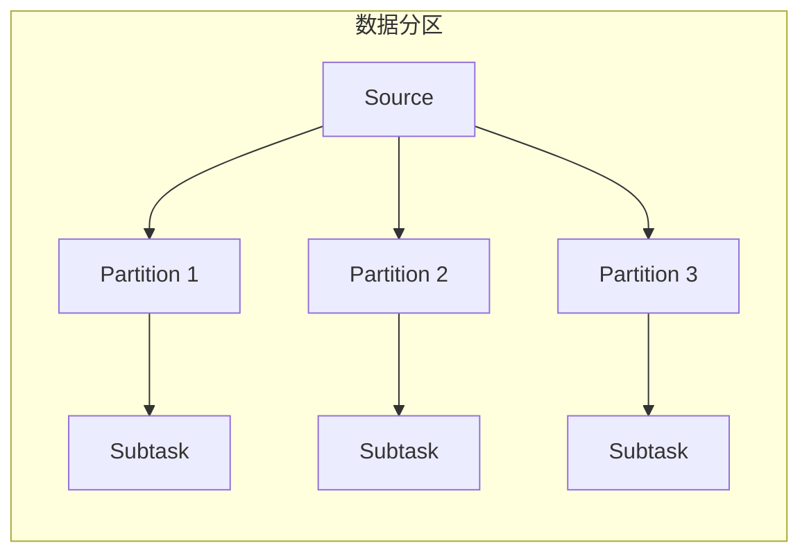
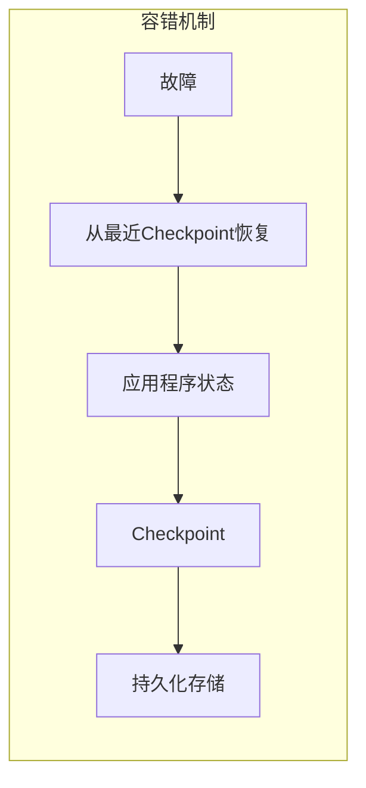

# Flink流处理框架原理与代码实例讲解

## 1. 背景介绍

### 1.1 大数据时代的到来

随着互联网、物联网、移动互联网等新兴技术的快速发展,海量的数据正以前所未有的速度被生成。这些数据包括网络日志、物联网设备数据、社交媒体内容等,呈现出巨大的数据规模、多样的数据类型以及持续不断的数据流特点。传统的基于磁盘的批处理系统很难满足对这些大规模数据流的实时处理需求。

### 1.2 流处理的重要性

面对这些持续不断产生的大规模数据流,能够实时处理和响应数据变化的流处理系统变得越来越重要。流处理系统可以实时分析数据流,及时发现异常模式、检测欺诈行为、生成实时报告等,为企业带来巨大的商业价值。

### 1.3 Apache Flink 简介

Apache Flink 是一个开源的分布式流处理框架,具有高吞吐量、低延迟和精确一次语义等优势。它不仅支持纯流处理,还支持批处理,可以在同一个系统中无缝集成流处理和批处理。Flink 提供了丰富的API、高度优化的执行引擎和容错机制,广泛应用于实时分析、机器学习、事件驱动应用等领域。

## 2. 核心概念与联系

### 2.1 流处理与批处理

批处理(Batch Processing)是指将有限的静态数据集作为输入,经过处理后生成最终结果。而流处理(Stream Processing)则是持续不断地处理无限的数据流,实时生成结果。

### 2.2 有界和无界数据集

Flink 将数据集分为有界数据集(Bounded Dataset)和无界数据集(Unbounded Dataset)。有界数据集是指有限的、静态的数据集,可以被完全存储在有限的存储空间中。无界数据集则是指持续不断产生的数据流,无法完全存储在有限的存储空间中。

### 2.3 窗口(Window)概念

为了能够对无界数据流进行有效处理,Flink 引入了窗口(Window)的概念。窗口是指一个有限的数据集,可以是基于时间(Time Window)或者基于数据条目个数(Count Window)。Flink 允许在窗口上进行各种转换和聚合操作。



## 3. 核心算法原理具体操作步骤

### 3.1 Flink 流处理架构

Flink 采用主从架构,由一个 JobManager(主节点)和多个 TaskManager(从节点)组成。JobManager 负责协调分布式执行,调度任务、协调检查点(Checkpoint)等,而 TaskManager 负责执行具体的数据处理任务。



### 3.2 数据流模型

Flink 基于数据流模型,将应用程序表示为逻辑数据流的有向无环图(DAG)。每个节点表示一个数据转换操作,边表示数据流向。



### 3.3 数据分区

为了实现并行处理,Flink 将数据流划分为多个逻辑分区(Logical Partition)。每个分区由一个单独的子任务(Subtask)处理。数据分区可以基于不同的策略,如轮询(Round-Robin)、重分区(Rebalance)、广播(Broadcast)等。



### 3.4 容错机制

Flink 采用分布式快照(Distributed Snapshots)机制实现容错,通过定期对状态进行持久化存储(Checkpoint)来实现故障恢复。当发生故障时,Flink 可以从最近的一次成功的 Checkpoint 恢复应用程序的状态,避免数据丢失或重复计算。



## 4. 数学模型和公式详细讲解举例说明

在流处理系统中,常常需要对数据流进行聚合和统计操作。以下是一些常用的数学模型和公式:

### 4.1 滑动窗口平均值

在实时数据分析中,经常需要计算一段时间内的平均值。滑动窗口平均值是一种常用的技术,它将数据流划分为固定大小的窗口,并计算每个窗口内的平均值。

设数据流为 $x_1, x_2, x_3, \ldots, x_n$,窗口大小为 $w$,则第 $i$ 个窗口的平均值可以表示为:

$$\text{avg}_i = \frac{1}{w} \sum_{j=i}^{i+w-1} x_j$$

例如,对于数据流 $[1, 2, 3, 4, 5]$,窗口大小为 $3$,则第一个窗口的平均值为 $\frac{1+2+3}{3} = 2$,第二个窗口的平均值为 $\frac{2+3+4}{3} = 3$。

### 4.2 指数加权移动平均

指数加权移动平均(Exponential Weighted Moving Average, EWMA)是另一种常用的平滑技术,它给予最近的观测值更高的权重。EWMA 的计算公式如下:

$$\text{EWMA}_t = \alpha x_t + (1 - \alpha) \text{EWMA}_{t-1}$$

其中 $x_t$ 是当前观测值, $\alpha$ 是平滑因子 $(0 < \alpha < 1)$, $\text{EWMA}_{t-1}$ 是上一时刻的 EWMA 值。

例如,对于数据流 $[1, 2, 3, 4, 5]$,平滑因子 $\alpha = 0.3$,初始 $\text{EWMA}_0 = 0$,则:

$$\begin{aligned}
\text{EWMA}_1 &= 0.3 \times 1 + 0.7 \times 0 = 0.3 \\
\text{EWMA}_2 &= 0.3 \times 2 + 0.7 \times 0.3 = 0.81 \\
\text{EWMA}_3 &= 0.3 \times 3 + 0.7 \times 0.81 = 1.467 \\
&\ldots
\end{aligned}$$

EWMA 可以有效地平滑数据流,并快速响应数据的突变。

## 5. 项目实践: 代码实例和详细解释说明

以下是一个使用 Flink 进行实时流处理的示例项目,它从 Socket 读取文本数据流,并统计每个单词出现的次数。

### 5.1 项目结构

```
wordcount-project
├── pom.xml
└── src
    └── main
        └── java
            └── com
                └── example
                    └── wordcount
                        ├── StreamingJob.java
                        └── WordCount.java
```

### 5.2 WordCount.java

`WordCount.java` 文件定义了 Flink 流处理的核心逻辑:

```java
import org.apache.flink.api.common.functions.FlatMapFunction;
import org.apache.flink.api.java.tuple.Tuple2;
import org.apache.flink.util.Collector;

public class WordCount {

    public static final class Tokenizer 
            implements FlatMapFunction<String, Tuple2<String, Integer>> {

        @Override
        public void flatMap(String value, Collector<Tuple2<String, Integer>> out) {
            // 按空格分词并转换为大写
            String[] tokens = value.toLowerCase().split("\\W+");
            
            // 遍历每个单词,发送 (word, 1) 给下游操作
            for (String token : tokens) {
                if (token.length() > 0) {
                    out.collect(new Tuple2<>(token, 1));
                }
            }
        }
    }
}
```

`Tokenizer` 类实现了 `FlatMapFunction` 接口,用于将输入的文本行拆分为单词,并发送 `(word, 1)` 对给下游操作。

### 5.3 StreamingJob.java

`StreamingJob.java` 文件定义了 Flink 作业的入口:

```java
import org.apache.flink.streaming.api.datastream.DataStream;
import org.apache.flink.streaming.api.environment.StreamExecutionEnvironment;

public class StreamingJob {

    public static void main(String[] args) throws Exception {
        // 创建执行环境
        StreamExecutionEnvironment env = StreamExecutionEnvironment.getExecutionEnvironment();

        // 从 Socket 读取数据流
        DataStream<String> text = env.socketTextStream("localhost", 9999);

        // 对数据流进行转换操作
        DataStream<Tuple2<String, Integer>> wordCounts = text
                .flatMap(new WordCount.Tokenizer())
                .keyBy(0)
                .sum(1);

        // 打印结果
        wordCounts.print();

        // 执行作业
        env.execute("Streaming WordCount");
    }
}
```

1. 创建 `StreamExecutionEnvironment` 对象,表示 Flink 的执行环境。
2. 使用 `socketTextStream` 从 Socket 读取文本数据流。
3. 对数据流执行以下转换操作:
   - `flatMap` 将每行文本拆分为单词,并发送 `(word, 1)` 对。
   - `keyBy(0)` 根据单词进行分组。
   - `sum(1)` 对每个单词的计数值求和。
4. 打印最终的 `(word, count)` 结果。
5. 执行作业。

### 5.4 运行项目

1. 启动 Flink 集群(如果使用单机模式,可以跳过这一步)。
2. 打包项目: `mvn clean package`。
3. 运行作业: `./bin/flink run ./target/wordcount-project-1.0.jar`。
4. 在另一个终端,使用 `nc` 命令向 Socket 发送文本数据: `nc -lk 9999`。
5. 观察作业的输出,统计单词出现的次数。

通过这个示例,你可以了解到如何使用 Flink 进行实时流处理,以及如何定义数据转换操作、设置执行环境和运行作业。

## 6. 实际应用场景

Flink 流处理框架在实际应用中有着广泛的应用场景,包括但不限于:

### 6.1 实时数据分析

Flink 可以对来自各种来源(如网络日志、物联网设备、社交媒体等)的数据流进行实时分析,生成实时报告和可视化仪表板。这对于监控系统健康状况、检测异常行为、发现趋势等非常有用。

### 6.2 实时数据管道

Flink 可以作为实时数据管道,从各种数据源(如 Kafka、Kinesis、RabbitMQ 等)获取数据,经过转换和enrichment后,将结果数据写入到不同的目标系统(如 HBase、Cassandra、Elasticsearch 等)。

### 6.3 实时机器学习

Flink 提供了对机器学习算法(如逻辑回归、梯度下降等)的支持,可以在流式数据上执行实时模型训练和预测,实现在线机器学习。

### 6.4 事件驱动应用

Flink 非常适合构建事件驱动的应用程序,如实时欺诈检测、实时推荐系统、实时交易处理等。它可以对事件流进行复杂的模式匹配和处理。

### 6.5 物联网数据处理

物联网设备产生的海量数据流可以使用 Flink 进行实时处理,如实时监控设备状态、预测故障、优化设备性能等。

## 7. 工具和资源推荐

### 7.1 Flink 官方网站

Flink 官方网站(https://flink.apache.org/)提供了详细的文档、教程、示例代码和社区资源，是学习 Flink 的绝佳起点。

### 7.2 Flink 操作手册

Flink 操作手册是每一位开发者的必备资源，详尽地介绍了 Flink 的安装、配置、运行和调试等各个方面。可以在[官方文档](https://ci.apache.org/projects/flink/flink-docs-release-1.14/)中找到最新的操作手册。

### 7.3 Flink 社区与论坛

Flink 社区是一个活跃的技术交流平台。参与社区的邮件列表、论坛和 Slack 频道，可以获取最新的技术动态、解决问题的建议以及与其他开发者的交流机会。

### 7.4 GitHub 资源

在 GitHub 上，Flink 的官方仓库(https://github.com/apache/flink)包含了源代码、文档和许多示例项目。通过阅读和分析这些代码，可以深入了解 Flink 的内部工作原理。

### 7.5 在线课程和培训

许多在线教育平台如 Coursera、Udacity 和 Pluralsight 提供了关于 Flink 的课程和培训。这些课程通常由经验丰富的专家讲授，内容涵盖从基础到高级的各个方面。

### 7.6 第三方工具和插件

一些第三方工具和插件可以帮助提高 Flink 的开发效率。例如，Apache Zeppelin 提供了交互式数据分析和可视化的支持，Flink SQL CLI 提供了 SQL 查询的命令行接口。

### 7.7 书籍推荐

一些经典的书籍可以帮助深入理解 Flink 的原理和应用。例如，《Stream Processing with Apache Flink》是一本全面介绍 Flink 流处理的书籍，适合初学者和有经验的开发者阅读。

## 8. 总结：未来发展趋势与挑战

### 8.1 Flink 的未来发展趋势

随着流处理需求的不断增加，Flink 在未来的发展中将继续扮演重要角色。以下是一些值得关注的趋势：

- **与云服务的深度集成**：越来越多的企业选择将流处理任务部署在云端，Flink 与 AWS、Google Cloud 和 Azure 等云服务的深度集成将是未来的重要趋势。
- **增强的机器学习支持**：流处理与机器学习的结合是一个重要的发展方向，Flink 将继续优化其与 TensorFlow、PyTorch 等机器学习框架的集成。
- **更高的性能和可扩展性**：随着数据量的爆炸式增长，Flink 将不断改进其性能和可扩展性，以满足大规模数据处理的需求。

### 8.2 面临的挑战

尽管 Flink 有许多优势，但在实际应用中仍然面临一些挑战：

- **复杂性**：Flink 的学习曲线较陡，对于初学者来说，理解和掌握其核心概念和操作可能需要较长时间。
- **资源消耗**：流处理任务通常需要大量的计算资源和内存，如何优化资源使用是一个重要的挑战。
- **实时性保障**：在高并发和大数据量的场景下，如何保证数据处理的实时性和准确性是一个技术难点。

## 9. 附录：常见问题与解答

### 9.1 如何安装和配置 Flink？

Flink 的安装和配置相对简单，可以从[官方下载页面](https://flink.apache.org/downloads.html)获取最新版本的安装包。解压后，配置 `flink-conf.yaml` 文件中的参数即可。

### 9.2 如何调试 Flink 程序？

调试 Flink 程序可以使用日志和 Web UI。通过设置适当的日志级别，可以在 `flink-conf.yaml` 文件中启用详细的日志记录。Flink 的 Web UI 提供了任务的状态、运行时信息和错误日志。

### 9.3 Flink 支持哪些数据源和数据接收器？

Flink 支持多种数据源和数据接收器，包括 Kafka、HDFS、Cassandra、Elasticsearch 等。可以通过 Flink 提供的连接器（Connector）来实现数据的读写操作。

### 9.4 如何优化 Flink 程序的性能？

优化 Flink 程序的性能可以从以下几个方面入手：

- **任务并行度**：合理设置任务的并行度，可以有效提升处理速度。
- **资源分配**：根据任务的需求，合理分配计算资源和内存。
- **数据分区**：通过自定义数据分区策略，减少数据传输的开销。

### 9.5 如何处理 Flink 程序中的故障？

Flink 提供了多种故障处理机制，包括检查点（Checkpoint）和保存点（Savepoint）。通过定期创建检查点，可以在程序故障时进行恢复。

### 9.6 Flink 与其他流处理框架相比有哪些优势？

Flink 的主要优势包括：

- **低延迟**：Flink 可以实现毫秒级的低延迟处理。
- **高吞吐量**：Flink 具有高效的数据处理能力，能够处理大规模数据流。
- **丰富的 API**：Flink 提供了多种高级 API，支持复杂的数据处理逻辑。

### 9.7 如何学习 Flink？

学习 Flink 可以从官方文档、在线课程和社区资源入手。通过阅读文档、参与社区讨论和实践项目，可以逐步掌握 Flink 的核心概念和操作。

---

作者：禅与计算机程序设计艺术 / Zen and the Art of Computer Programming