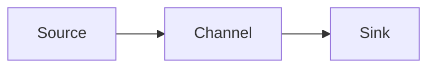

# Flume Channel原理与代码实例讲解

## 1. 背景介绍
### 1.1 大数据实时采集的重要性
在当今大数据时代,数据的实时采集和处理变得越来越重要。企业需要及时获取和分析海量的数据,以便做出正确的决策。然而,传统的数据采集方式难以满足实时性和可靠性的要求。
### 1.2 Flume在大数据生态系统中的地位
Apache Flume是一个分布式、可靠、高可用的数据采集系统,在Hadoop生态系统中占据重要地位。它可以从各种数据源收集数据,并将数据传输到目标存储系统如HDFS、HBase等。Flume采用基于事件的数据流模型,支持多种可靠性机制,保证数据传输过程中的数据不丢失。
### 1.3 Flume Channel的核心作用
在Flume的架构中,Channel是连接Source和Sink的桥梁,起到数据缓冲和临时存储的作用。Channel的可靠性和性能直接影响整个Flume系统的数据传输效率。因此,深入理解Flume Channel的工作原理和实现细节,对于优化Flume的性能和可靠性至关重要。

## 2. 核心概念与联系
### 2.1 Flume的架构概述
Flume采用基于Agent的分布式架构,每个Agent由Source、Channel和Sink三个核心组件组成。
- Source:负责从数据源采集数据,将数据封装成Event,并将Event放入Channel中。常见的Source如Exec Source、Spooling Directory Source等。
- Channel:连接Source和Sink,作为Event的缓存队列。Channel分为Memory Channel和File Channel两种类型。
- Sink:从Channel中取出Event,将Event发送到目标存储系统。常见的Sink如HDFS Sink、HBase Sink等。
### 2.2 Event事件
Event是Flume数据传输的基本单位,由Header和Body两部分组成。Header包含一些元数据信息,Body包含实际的数据内容。Event在Source、Channel和Sink之间流转,代表一条具体的消息或日志。
### 2.3 Transaction事务
为了保证数据传输的可靠性,Flume引入了事务机制。一个完整的事务包括Event从Source进入Channel,再从Channel发送到Sink的全过程。Flume的事务基于两阶段提交协议,确保事务的原子性和一致性。

## 3. 核心算法原理具体操作步骤
### 3.1 Put事务
1. Source调用Channel的put方法,将Event放入Channel。
2. Channel将Event写入内部的队列或缓存中。
3. Channel返回Put成功的结果给Source。
4. Source提交事务。
5. 如果提交失败,Channel回滚事务,撤销之前的Put操作。
### 3.2 Take事务  
1. Sink调用Channel的take方法,从Channel获取Event。
2. Channel从内部队列或缓存中取出Event,返回给Sink。
3. Sink处理Event,例如将其发送到HDFS等目标存储。
4. Sink提交事务。
5. 如果提交失败,Channel回滚事务,将Event重新放回队列。
### 3.3 Flume Channel的可靠性保证
- 对于Memory Channel,Put和Take操作都在内存中进行,速度快但可靠性较低。当Agent意外终止时,内存中的Event可能会丢失。
- 对于File Channel,Event会先写入内存中的缓存,再定期刷新到磁盘上的checkpoint和data文件中。即使Agent崩溃,也能从磁盘文件中恢复Event,保证了更高的可靠性。

## 4. 数学模型和公式详细讲解举例说明
### 4.1 Memory Channel的内存模型
Memory Channel基于一个线程安全的阻塞队列来存储Event。假设队列的容量为$n$,Put和Take操作分别由$p$和$t$个线程并发执行。根据排队论模型,队列的平均长度$L$可以表示为:

$$L = \frac{\lambda}{\mu - \lambda}$$

其中,$\lambda$表示Put操作的到达率,$\mu$表示Take操作的服务率。当$\lambda < \mu$时,队列处于稳定状态。
### 4.2 File Channel的Checkpoint机制
File Channel使用Checkpoint机制来保证数据的一致性和持久性。假设在时间$T$内,有$N$个Event写入Channel。Checkpoint的时间间隔为$\Delta t$,每次Checkpoint需要将内存中的Event刷新到磁盘。Checkpoint的频率$f$可以表示为:

$$f = \frac{1}{\Delta t}$$

Checkpoint操作的平均时间开销$C$可以估算为:

$$C = \frac{N}{f} \times t_w$$

其中,$t_w$表示单个Event写入磁盘的平均时间。通过调整$\Delta t$的大小,可以在可靠性和性能之间进行权衡。

## 5. 项目实践：代码实例和详细解释说明
下面通过一个简单的例子来演示Flume Channel的使用。我们将创建一个Flume Agent,使用Memory Channel将数据从Exec Source传输到Logger Sink。
### 5.1 配置文件flume.conf
```properties
# 定义Agent的组件
a1.sources = s1  
a1.channels = c1
a1.sinks = k1

# 配置Source  
a1.sources.s1.type = exec
a1.sources.s1.command = tail -F /var/log/messages

# 配置Channel
a1.channels.c1.type = memory
a1.channels.c1.capacity = 1000
a1.channels.c1.transactionCapacity = 100

# 配置Sink
a1.sinks.k1.type = logger

# 连接组件
a1.sources.s1.channels = c1  
a1.sinks.k1.channel = c1
```
### 5.2 启动Flume Agent
使用以下命令启动Flume Agent:
```bash
flume-ng agent --conf conf --conf-file flume.conf --name a1 -Dflume.root.logger=INFO,console
```
这里通过`--conf`指定配置文件目录,`--conf-file`指定配置文件名,`--name`指定Agent的名称。
### 5.3 代码解释
- Exec Source通过`tail`命令实时读取`/var/log/messages`文件中的新增内容,将每一行作为一个Event发送到Channel中。
- Memory Channel使用容量为1000的内存队列来缓存Event,单个事务最大处理100个Event。
- Logger Sink从Channel中取出Event,并将其输出到控制台日志中。
- 通过配置文件中的`a1.sources.s1.channels = c1`和`a1.sinks.k1.channel = c1`将Source、Channel、Sink进行连接,形成一个完整的数据传输流程。

## 6. 实际应用场景
Flume Channel在实际的大数据采集场景中有广泛的应用,下面列举几个典型的应用案例:
### 6.1 日志收集
Web服务器、应用服务器产生的日志文件通过Flume实时采集到HDFS或者Kafka中,进行后续的分析和处理。例如:
- 使用Exec Source或Spooling Directory Source读取日志文件。
- 使用File Channel或Kafka Channel进行可靠的数据传输。
- 使用HDFS Sink或Kafka Sink将数据写入目标存储系统。
### 6.2 数据库变更捕获
通过Flume监听数据库的binlog,捕获数据变更事件,实现数据的实时同步和备份。例如:
- 使用Mysql Source读取binlog事件。
- 使用Memory Channel进行缓存。
- 使用HBase Sink或HDFS Sink将数据写入备份存储。
### 6.3 社交媒体数据采集
通过Flume采集Twitter、Facebook等社交媒体的实时数据流,进行舆情分析和用户行为分析。例如:
- 使用HTTP Source或Kafka Source接收社交媒体数据。
- 使用Kafka Channel进行分布式的数据缓存。
- 使用Spark Streaming或Storm消费Kafka中的数据进行实时处理。

## 7. 工具和资源推荐
### 7.1 Flume官方文档
Flume的官方文档提供了详尽的用户指南、配置手册和API参考,是学习和使用Flume的权威资料。
- 官方网站: https://flume.apache.org/
- 用户指南: https://flume.apache.org/FlumeUserGuide.html 
### 7.2 Flume Github仓库
Flume的源代码托管在Github上,可以查看Flume的实现细节,了解其内部工作机制。
- Github地址: https://github.com/apache/flume
### 7.3 Flume UI工具
一些第三方开发的Flume UI工具可以帮助用户更直观地监控和管理Flume Agent,如Flume-UI、Flume Commander等。
- Flume-UI: https://github.com/keedio/flume-ui
- Flume Commander: https://github.com/jrkinley/flume-commander

## 8. 总结：未来发展趋势与挑战
### 8.1 云原生环境下的Flume
随着云计算的普及,越来越多的大数据平台搭建在云环境中。Flume需要适应云原生架构,提供更灵活的部署和配置方式,如容器化部署、动态扩容等。同时,Flume需要与云服务提供商的存储服务(如S3、OSS)进行更好的集成。
### 8.2 流批一体化架构
Lambda架构和Kappa架构的出现,促使流处理和批处理的边界逐渐模糊。Flume作为数据采集的前端,需要提供更通用的数据抽象和API,同时支持流处理和批处理引擎。未来Flume可能与Kafka、Spark Streaming等组件进一步融合,提供端到端的流批一体化数据处理能力。
### 8.3 数据安全与隐私保护
随着数据安全和隐私保护法规的出台,如GDPR等,对数据采集和传输提出了更高的要求。Flume需要在传输过程中提供数据加密、脱敏等安全机制,确保敏感数据的安全性。同时,Flume需要支持数据溯源和审计,记录数据的来源和去向,满足合规性要求。

## 9. 附录：常见问题与解答
### 9.1 Flume Channel的选型
- Q: 如何选择Memory Channel和File Channel?
- A: Memory Channel适用于对性能要求高、数据量较小的场景。File Channel适用于对可靠性要求高、数据量较大的场景。可以根据具体的业务需求和硬件资源进行选择。
### 9.2 Channel满了怎么办?
- Q: 当Channel满了,Put操作会阻塞吗?
- A: 默认情况下,当Channel满时,Put操作会阻塞直到Channel有空闲空间。可以通过配置`a1.channels.c1.keep-alive`参数设置Put操作的最大等待时间,超时后Put操作会失败。
### 9.3 Channel的监控指标
- Q: 如何监控Channel的运行状态?
- A: Flume提供了一些监控指标,如Channel的容量、当前占用量、Put/Take成功次数、失败次数等。可以通过JMX或HTTP Metrics接口获取这些指标,并集成到监控系统中进行告警和可视化展示。



作者：禅与计算机程序设计艺术 / Zen and the Art of Computer Programming